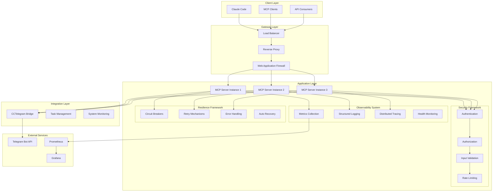
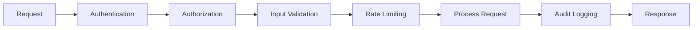
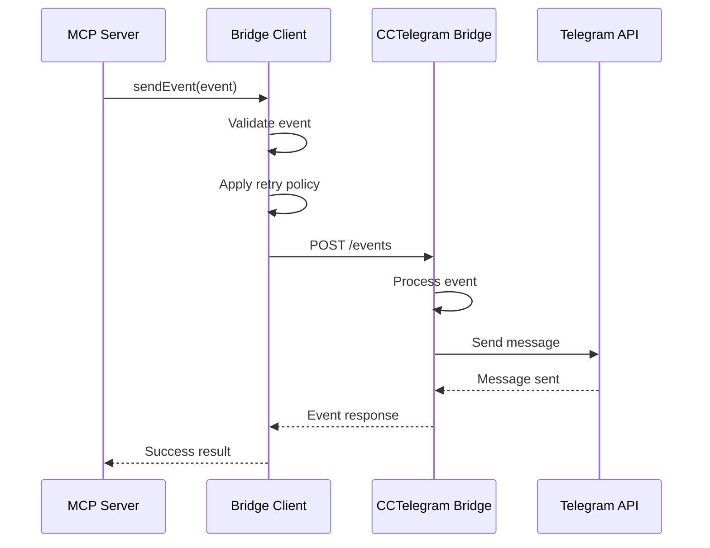
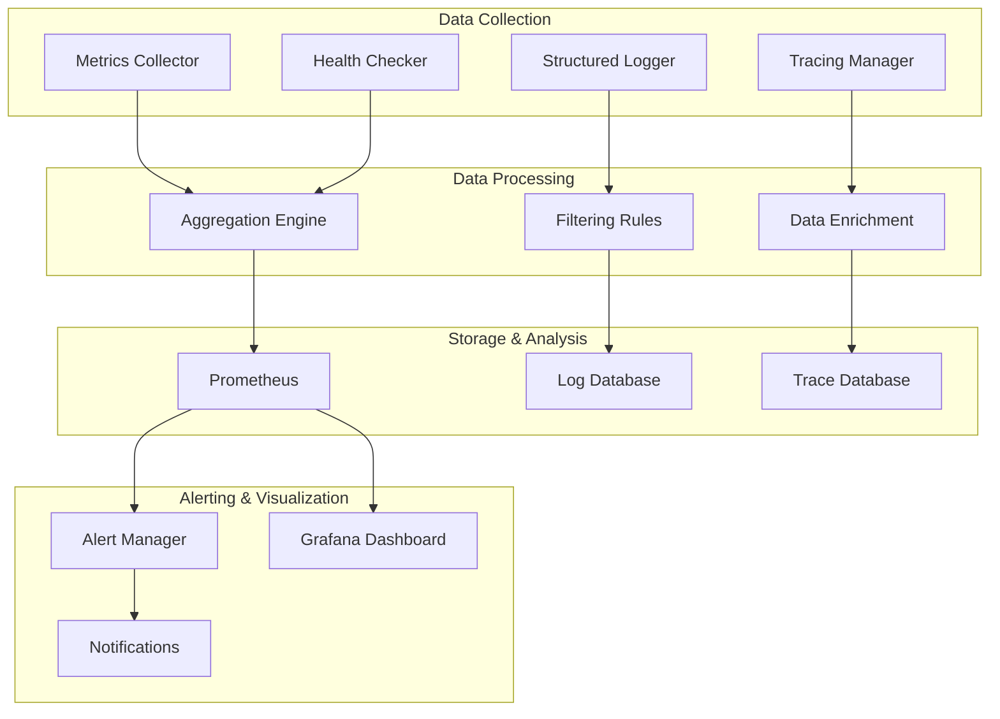
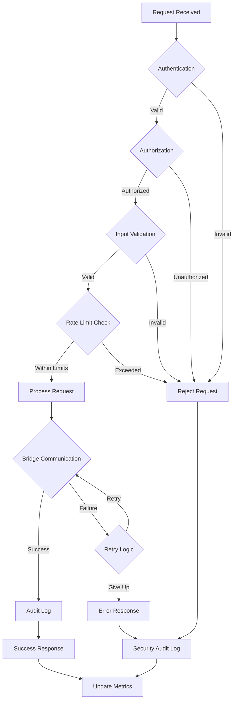
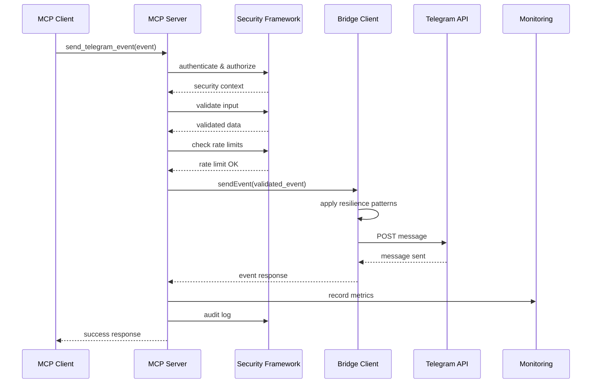
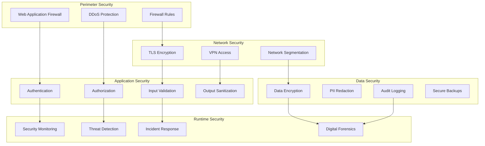
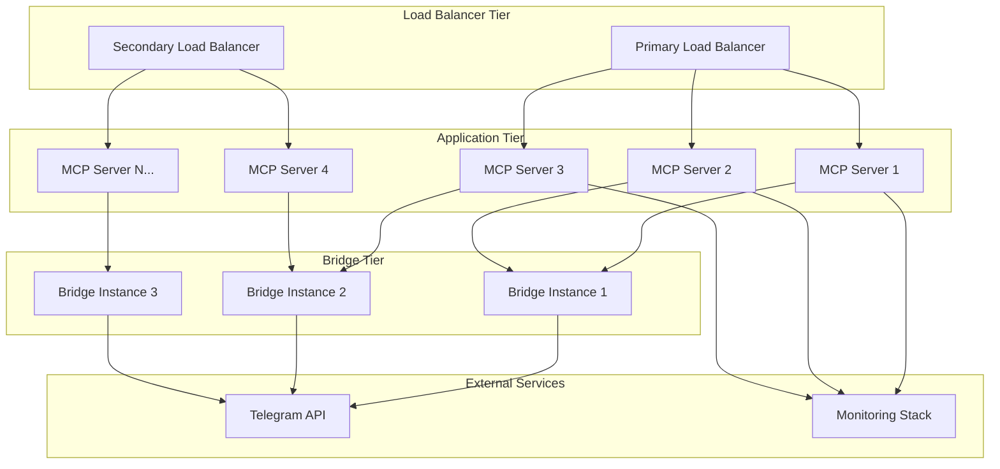
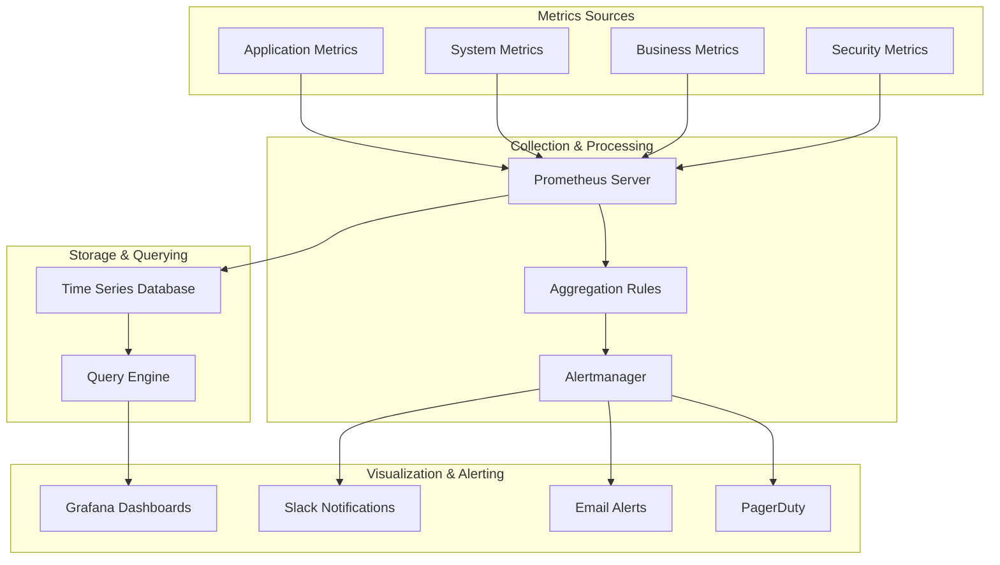
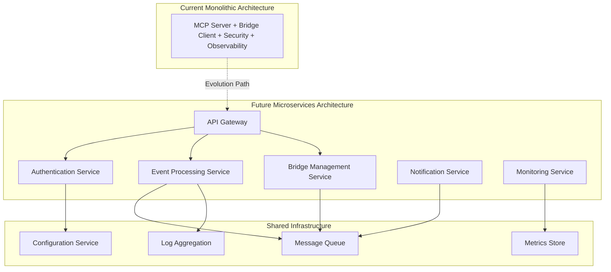

# System Architecture Overview

## 🏗️ Executive Summary

The CCTelegram MCP Server provides a secure, scalable, and resilient bridge between Model Context Protocol (MCP) clients and Telegram notifications. This document outlines the system's architecture, design decisions, and integration patterns for enterprise deployment.

### Key Architectural Principles

1. **Security by Design**: Multi-layered security with authentication, authorization, input validation, and secure logging
2. **Resilience & Reliability**: Circuit breakers, retry mechanisms, health monitoring, and automatic recovery
3. **Observability**: Comprehensive monitoring, structured logging, distributed tracing, and performance metrics
4. **Scalability**: Horizontal scaling, load balancing, and resource optimization
5. **Compliance**: OWASP Top 10 compliance, enterprise security standards, and audit trails

## 🎯 System Context

### Business Requirements

- **Real-time Notifications**: Instant delivery of development events to Telegram
- **Interactive Workflows**: Approval requests and user response processing
- **System Management**: Bridge process control and health monitoring
- **Enterprise Integration**: Secure API access with authentication and rate limiting
- **Compliance**: Security controls meeting enterprise standards

### Technical Requirements

- **Protocol Compliance**: Full MCP specification support
- **High Availability**: 99.9% uptime with automatic failover
- **Performance**: <500ms response time, 1000+ requests/minute capacity
- **Security**: OWASP compliance with zero critical vulnerabilities
- **Monitoring**: Real-time health checks and performance metrics

## 🏛️ High-Level Architecture



## 🔧 Component Architecture

### 1. MCP Server Core

#### Primary Responsibilities
- **Protocol Implementation**: Full MCP specification compliance
- **Tool Registration**: 16 MCP tools for Telegram integration
- **Resource Management**: Event templates, bridge status, response data
- **Request Routing**: Secure routing to appropriate handlers
- **Response Formatting**: Standardized JSON response structures

#### Key Components

```typescript
// Core Server Structure
export class MCPServer {
  private server: Server;
  private bridgeClient: CCTelegramBridgeClient;
  private securityManager: SecurityManager;
  private observabilityManager: ObservabilityManager;
  private resilienceManager: ResilienceManager;
  
  // Tool handlers for 16 MCP tools
  private toolHandlers: Map<string, ToolHandler>;
  
  // Resource providers
  private resourceProviders: Map<string, ResourceProvider>;
}
```

#### Tool Architecture

```typescript
// Tool Handler Interface
export interface ToolHandler {
  name: string;
  description: string;
  inputSchema: JSONSchema;
  permissions: string[];
  
  execute(args: any, context: SecurityContext): Promise<ToolResult>;
  validate(args: any): ValidationResult;
}

// Example: Telegram Event Tool
export class TelegramEventTool implements ToolHandler {
  name = 'send_telegram_event';
  permissions = ['telegram:send', 'events:create'];
  
  async execute(args: TelegramEventArgs, context: SecurityContext): Promise<ToolResult> {
    // 1. Validate input
    // 2. Apply security context
    // 3. Rate limit check
    // 4. Send to bridge
    // 5. Return formatted result
  }
}
```

### 2. Security Framework

#### Multi-Layer Security Architecture



#### Security Components

```typescript
// Security Context Management
export interface SecurityContext {
  clientId: string;
  authenticated: boolean;
  permissions: string[];
  rateLimitInfo: RateLimitInfo;
  sessionData: SessionData;
}

// Authentication Manager
export class AuthenticationManager {
  authenticateApiKey(apiKey: string): SecurityContext;
  validateSession(sessionId: string): SecurityContext;
  revokeAccess(clientId: string): void;
}

// Authorization Engine  
export class AuthorizationEngine {
  hasPermission(context: SecurityContext, resource: string, action: string): boolean;
  checkToolAccess(context: SecurityContext, toolName: string): boolean;
  enforceRBAC(context: SecurityContext, operation: Operation): void;
}

// Input Validation Pipeline
export class ValidationPipeline {
  validateToolInput(toolName: string, input: any): ValidationResult;
  sanitizeInput(input: any): any;
  checkSecurityConstraints(input: any): SecurityCheckResult;
}
```

#### Security Controls Implementation

| Control | Implementation | OWASP Mapping |
|---------|---------------|---------------|
| **Authentication** | API key validation with client identification | A07 - Authentication Failures |
| **Authorization** | Role-based access control (RBAC) | A01 - Broken Access Control |
| **Input Validation** | Joi schema validation with sanitization | A03 - Injection |
| **Rate Limiting** | Token bucket algorithm with client-specific limits | A04 - Insecure Design |
| **Secure Logging** | PII redaction with structured audit trails | A09 - Security Logging |
| **Error Handling** | Sanitized error responses with correlation IDs | A05 - Security Misconfiguration |

### 3. Bridge Integration Layer

#### CCTelegram Bridge Communication

```typescript
// Bridge Client Architecture
export class CCTelegramBridgeClient {
  private httpClient: AxiosInstance;
  private connectionPool: ConnectionPool;
  private retryManager: RetryManager;
  private healthChecker: HealthChecker;
  
  // Core bridge operations
  async sendEvent(event: CCTelegramEvent): Promise<EventResponse>;
  async getBridgeStatus(): Promise<BridgeStatus>;
  async getTelegramResponses(): Promise<TelegramResponse[]>;
  
  // Bridge process management
  async startBridge(): Promise<BridgeOperationResult>;
  async stopBridge(): Promise<BridgeOperationResult>;
  async restartBridge(): Promise<BridgeOperationResult>;
  
  // Health and monitoring
  async performHealthCheck(): Promise<HealthResult>;
  async getMetrics(): Promise<BridgeMetrics>;
}
```

#### Communication Protocol



#### Error Handling & Recovery

```typescript
// Resilient Bridge Communication
export class ResilientBridgeClient extends CCTelegramBridgeClient {
  private circuitBreaker: CircuitBreaker;
  private retryExecutor: RetryExecutor;
  private fallbackHandler: FallbackHandler;
  
  async sendEventResilient(event: CCTelegramEvent): Promise<EventResponse> {
    return await this.circuitBreaker.execute(async () => {
      return await this.retryExecutor.executeWithRetry(async () => {
        try {
          return await super.sendEvent(event);
        } catch (error) {
          if (this.isRetryableError(error)) {
            throw error; // Let retry mechanism handle
          }
          
          // Try fallback approach
          return await this.fallbackHandler.handleFailure(event, error);
        }
      });
    });
  }
}
```

### 4. Observability System

#### Comprehensive Monitoring Architecture



#### Observability Components

```typescript
// Observability Manager
export class ObservabilityManager {
  private metricsCollector: MetricsCollector;
  private structuredLogger: StructuredLogger;
  private tracingManager: TracingManager;
  private healthChecker: HealthChecker;
  private alertingEngine: AlertingEngine;
  private dashboardManager: DashboardManager;
  
  // Initialize all observability components
  async initialize(config: ObservabilityConfig): Promise<void>;
  
  // Collect and expose metrics
  collectMetrics(): SystemMetrics;
  
  // Log with structured context
  log(level: LogLevel, message: string, context: LogContext): void;
  
  // Trace operations
  startTrace(operation: string): TraceContext;
  
  // Health monitoring
  performHealthCheck(): HealthResult;
}

// Metrics Collection
export interface SystemMetrics {
  // System metrics
  cpu_usage_percent: number;
  memory_usage_bytes: number;
  disk_usage_percent: number;
  network_io_bytes: number;
  
  // Application metrics
  http_requests_total: Counter;
  http_request_duration_seconds: Histogram;
  mcp_tool_calls_total: Counter;
  bridge_connection_status: Gauge;
  
  // Security metrics
  authentication_failures_total: Counter;
  rate_limit_violations_total: Counter;
  security_events_total: Counter;
  
  // Business metrics
  telegram_messages_sent_total: Counter;
  approval_requests_total: Counter;
  task_completions_total: Counter;
}
```

#### Health Monitoring

```typescript
// Health Check Framework
export interface HealthCheck {
  id: string;
  name: string;
  type: 'system' | 'dependency' | 'custom';
  critical: boolean;
  timeout: number;
  interval: number;
  
  execute(): Promise<HealthCheckResult>;
}

// Health Check Results
export interface HealthCheckResult {
  status: 'pass' | 'fail' | 'warn';
  description: string;
  observedValue?: any;
  observedUnit?: string;
  time: string;
  componentId?: string;
  componentType?: string;
}

// Built-in Health Checks
export class SystemHealthChecks {
  static cpuUsageCheck(): HealthCheck;
  static memoryUsageCheck(): HealthCheck;
  static diskSpaceCheck(): HealthCheck;
  static bridgeConnectivityCheck(): HealthCheck;
  static telegramApiCheck(): HealthCheck;
  static databaseConnectionCheck(): HealthCheck;
}
```

### 5. Resilience Framework

#### Resilience Patterns Implementation

```typescript
// Circuit Breaker Implementation
export class CircuitBreaker {
  private state: 'CLOSED' | 'OPEN' | 'HALF_OPEN' = 'CLOSED';
  private failureCount: number = 0;
  private lastFailureTime: number = 0;
  
  constructor(
    private failureThreshold: number = 5,
    private recoveryTimeout: number = 60000,
    private successThreshold: number = 3
  ) {}
  
  async execute<T>(operation: () => Promise<T>): Promise<T> {
    if (this.state === 'OPEN') {
      if (Date.now() - this.lastFailureTime < this.recoveryTimeout) {
        throw new CircuitBreakerError('Circuit breaker is OPEN');
      }
      this.state = 'HALF_OPEN';
    }
    
    try {
      const result = await operation();
      this.onSuccess();
      return result;
    } catch (error) {
      this.onFailure();
      throw error;
    }
  }
}

// Retry Mechanisms
export class RetryExecutor {
  constructor(
    private maxAttempts: number = 3,
    private baseDelay: number = 1000,
    private maxDelay: number = 10000,
    private exponentialBase: number = 2,
    private jitterEnabled: boolean = true
  ) {}
  
  async executeWithRetry<T>(operation: () => Promise<T>): Promise<T> {
    let lastError: Error;
    
    for (let attempt = 1; attempt <= this.maxAttempts; attempt++) {
      try {
        return await operation();
      } catch (error) {
        lastError = error as Error;
        
        if (attempt < this.maxAttempts && this.isRetryable(error)) {
          await this.delay(this.calculateDelay(attempt));
        }
      }
    }
    
    throw new RetryExhaustedException(
      `Operation failed after ${this.maxAttempts} attempts`,
      lastError!
    );
  }
}
```

## 🔄 Data Flow Architecture

### Request Processing Pipeline



### Event Processing Workflow



## 🛡️ Security Architecture

### Defense in Depth Strategy



### Security Controls Matrix

| Layer | Control | Implementation | CVSS Mitigation |
|-------|---------|----------------|-----------------|
| **Network** | TLS Encryption | TLS 1.3 with strong cipher suites | Prevents man-in-the-middle attacks |
| **Application** | Authentication | API key validation with client identification | Prevents unauthorized access (CVSS 9.0) |
| **Application** | Authorization | RBAC with least privilege principle | Prevents privilege escalation |
| **Application** | Input Validation | Joi schema validation with whitelisting | Prevents injection attacks (CVSS 8.5) |
| **Application** | Rate Limiting | Token bucket with client-specific limits | Prevents DoS attacks |
| **Data** | Secure Logging | Structured logging with PII redaction | Prevents information disclosure (CVSS 7.0) |
| **Data** | Error Sanitization | Generic error messages with correlation IDs | Prevents system information leakage |
| **Runtime** | Security Monitoring | Real-time threat detection and alerting | Enables rapid incident response |

## 📈 Scalability & Performance

### Horizontal Scaling Strategy



### Performance Characteristics

| Component | Metric | Target | Scaling Factor |
|-----------|--------|---------|----------------|
| **MCP Server** | Response Time | <500ms (P95) | Linear with instances |
| **MCP Server** | Throughput | 1000 req/min per instance | Horizontal scaling |
| **Bridge Client** | Connection Pool | 10 connections per instance | Fixed per instance |
| **Security Framework** | Auth Overhead | <10ms per request | Constant time |
| **Observability** | Metrics Collection | <5ms per operation | Constant overhead |
| **Database** | Query Time | <100ms (P95) | Optimized indexes |

### Auto-Scaling Configuration

```yaml
# Kubernetes HPA Configuration
apiVersion: autoscaling/v2
kind: HorizontalPodAutoscaler
metadata:
  name: cctelegram-mcp-hpa
spec:
  scaleTargetRef:
    apiVersion: apps/v1
    kind: Deployment
    name: cctelegram-mcp
  minReplicas: 3
  maxReplicas: 20
  metrics:
  - type: Resource
    resource:
      name: cpu
      target:
        type: Utilization
        averageUtilization: 70
  - type: Resource
    resource:
      name: memory
      target:
        type: Utilization
        averageUtilization: 80
  - type: Pods
    pods:
      metric:
        name: http_requests_per_second
      target:
        type: AverageValue
        averageValue: "500"
```

## 🔌 Integration Patterns

### MCP Client Integration

```typescript
// Standard MCP Client Integration
export class MCPClientIntegration {
  private client: Client;
  private transport: StdioClientTransport;
  
  async connect(): Promise<void> {
    this.transport = new StdioClientTransport({
      command: 'npx',
      args: ['-y', 'cctelegram-mcp-server']
    });
    
    this.client = new Client({
      name: 'integration-client',
      version: '1.0.0'
    }, {
      capabilities: { tools: {} }
    });
    
    await this.client.connect(this.transport);
  }
  
  async callTool(name: string, args: any): Promise<any> {
    return await this.client.request({
      method: 'tools/call',
      params: { name, arguments: args }
    }, 'CallToolResultSchema');
  }
}
```

### Task Management System Integration

```typescript
// TaskMaster Integration Pattern
export class TaskMasterIntegration {
  private mcpClient: MCPClientIntegration;
  
  async onTaskCompleted(task: Task): Promise<void> {
    await this.mcpClient.callTool('send_task_completion', {
      task_id: task.id,
      title: task.title,
      results: task.results,
      files_affected: task.files_affected,
      duration_ms: task.duration_ms
    });
  }
  
  async requestApproval(task: Task): Promise<ApprovalResponse> {
    const result = await this.mcpClient.callTool('send_approval_request', {
      title: `Approval Required: ${task.title}`,
      description: task.description,
      options: ['Approve', 'Reject', 'Request Changes']
    });
    
    // Wait for response
    return await this.waitForApproval(result.event_id);
  }
}
```

### CI/CD Pipeline Integration

```typescript
// CI/CD Pipeline Integration
export class CIPipelineIntegration {
  private mcpClient: MCPClientIntegration;
  
  async onBuildStarted(build: BuildInfo): Promise<void> {
    await this.mcpClient.callTool('send_telegram_event', {
      type: 'task_started',
      title: `Build Started: ${build.branch}`,
      description: `Building commit ${build.commit_sha}`,
      task_id: build.id,
      source: 'ci-pipeline',
      data: {
        branch: build.branch,
        commit: build.commit_sha,
        author: build.author
      }
    });
  }
  
  async onBuildCompleted(build: BuildInfo, success: boolean): Promise<void> {
    await this.mcpClient.callTool('send_telegram_event', {
      type: success ? 'build_completed' : 'build_failed',
      title: `Build ${success ? 'Completed' : 'Failed'}: ${build.branch}`,
      description: success 
        ? `Successfully built and deployed`
        : `Build failed with ${build.error_count} errors`,
      task_id: build.id,
      source: 'ci-pipeline',
      data: {
        success,
        duration_ms: build.duration_ms,
        test_results: build.test_results,
        deployment_url: build.deployment_url
      }
    });
  }
}
```

## 🚀 Deployment Architecture

### Container Architecture

```dockerfile
# Multi-stage build for optimal image size
FROM node:20-alpine AS builder

WORKDIR /app
COPY package*.json ./
RUN npm ci --only=production

COPY . .
RUN npm run build

FROM node:20-alpine AS runtime

# Security: Run as non-root user
RUN addgroup -g 1001 -S nodejs
RUN adduser -S mcp -u 1001

WORKDIR /app

# Copy built application
COPY --from=builder --chown=mcp:nodejs /app/dist ./dist
COPY --from=builder --chown=mcp:nodejs /app/node_modules ./node_modules
COPY --from=builder --chown=mcp:nodejs /app/package.json ./

# Security: Set proper permissions
RUN chmod -R 755 /app
RUN chmod -R 644 /app/dist

USER mcp

EXPOSE 8080 9090

HEALTHCHECK --interval=30s --timeout=3s --start-period=5s --retries=3 \
  CMD node -e "const http = require('http'); \
    const options = { host: 'localhost', port: 8080, path: '/health', timeout: 2000 }; \
    const req = http.request(options, (res) => { \
      if (res.statusCode === 200) process.exit(0); else process.exit(1); \
    }); \
    req.on('error', () => process.exit(1)); \
    req.end();"

CMD ["node", "dist/index.js"]
```

### Kubernetes Deployment

```yaml
apiVersion: apps/v1
kind: Deployment
metadata:
  name: cctelegram-mcp
  labels:
    app: cctelegram-mcp
spec:
  replicas: 3
  selector:
    matchLabels:
      app: cctelegram-mcp
  template:
    metadata:
      labels:
        app: cctelegram-mcp
    spec:
      securityContext:
        runAsNonRoot: true
        runAsUser: 1001
        fsGroup: 1001
      containers:
      - name: mcp-server
        image: cctelegram/mcp-server:1.5.0
        ports:
        - containerPort: 8080
          name: http
        - containerPort: 9090
          name: metrics
        env:
        - name: NODE_ENV
          value: "production"
        - name: MCP_ENABLE_AUTH
          value: "true"
        - name: TELEGRAM_BOT_TOKEN
          valueFrom:
            secretKeyRef:
              name: telegram-secrets
              key: bot-token
        resources:
          requests:
            memory: "512Mi"
            cpu: "250m"
          limits:
            memory: "1Gi"
            cpu: "500m"
        livenessProbe:
          httpGet:
            path: /health
            port: 8080
          initialDelaySeconds: 30
          periodSeconds: 10
        readinessProbe:
          httpGet:
            path: /health/ready
            port: 8080
          initialDelaySeconds: 5
          periodSeconds: 5
        securityContext:
          allowPrivilegeEscalation: false
          readOnlyRootFilesystem: true
          capabilities:
            drop:
            - ALL
```

## 📊 Monitoring & Observability Architecture

### Metrics Architecture



### Dashboard Architecture

```typescript
// Grafana Dashboard Configuration
export const MCPServerDashboard = {
  dashboard: {
    title: "CCTelegram MCP Server",
    panels: [
      {
        title: "Request Rate",
        type: "graph",
        targets: [{
          expr: "rate(http_requests_total[5m])",
          legendFormat: "{{method}} {{status}}"
        }]
      },
      {
        title: "Response Time",
        type: "graph", 
        targets: [{
          expr: "histogram_quantile(0.95, rate(http_request_duration_seconds_bucket[5m]))",
          legendFormat: "95th percentile"
        }]
      },
      {
        title: "Error Rate",
        type: "singlestat",
        targets: [{
          expr: "rate(http_requests_total{status=~\"5..\"}[5m]) / rate(http_requests_total[5m])",
          legendFormat: "Error Rate"
        }]
      },
      {
        title: "Bridge Health",
        type: "stat",
        targets: [{
          expr: "bridge_connection_status",
          legendFormat: "Bridge Status"
        }]
      }
    ]
  }
};
```

## 🔄 Future Architecture Considerations

### Microservices Evolution



### Technology Roadmap

| Phase | Timeline | Focus | Technologies |
|-------|----------|-------|-------------|
| **Phase 1** | Q1 2025 | Security Hardening | Enhanced authentication, RBAC, audit trails |
| **Phase 2** | Q2 2025 | Performance Optimization | Connection pooling, caching, async processing |
| **Phase 3** | Q3 2025 | Advanced Observability | Distributed tracing, APM, custom metrics |
| **Phase 4** | Q4 2025 | Microservices Migration | Service mesh, event sourcing, CQRS |
| **Phase 5** | 2026 | AI/ML Integration | Intelligent alerting, predictive scaling |

---

## 📋 Architecture Decision Records (ADRs)

### ADR-001: MCP Protocol Implementation
- **Decision**: Implement full MCP specification compliance
- **Rationale**: Future-proof integration with evolving Claude Code ecosystem
- **Consequences**: Additional complexity but better long-term compatibility

### ADR-002: TypeScript for Core Implementation  
- **Decision**: Use TypeScript for type safety and developer experience
- **Rationale**: Better maintainability, IDE support, and error prevention
- **Consequences**: Build step required but significant quality benefits

### ADR-003: Security-First Architecture
- **Decision**: Implement comprehensive security framework from start
- **Rationale**: Enterprise deployment requires robust security controls
- **Consequences**: Additional complexity but mandatory for production use

### ADR-004: Observability by Design
- **Decision**: Built-in comprehensive monitoring and observability
- **Rationale**: Production systems require deep visibility for operations
- **Consequences**: Performance overhead but essential for reliability

### ADR-005: Bridge Integration Pattern
- **Decision**: HTTP-based communication with CCTelegram Bridge
- **Rationale**: Language agnostic, well-understood protocol, easy to debug
- **Consequences**: Network dependency but clear separation of concerns

---

## 🎯 Quality Attributes

### Performance
- **Response Time**: <500ms (95th percentile)
- **Throughput**: 1000+ requests/minute per instance
- **Resource Usage**: <1GB memory, <2 CPU cores per instance
- **Scalability**: Linear scaling up to 50 instances

### Reliability
- **Availability**: 99.9% uptime (8.7 hours downtime/year)
- **Recovery Time**: <15 minutes for service restart
- **Data Durability**: Zero message loss with proper error handling
- **Fault Tolerance**: Graceful degradation with circuit breakers

### Security
- **Authentication**: Strong API key validation with client identification
- **Authorization**: Role-based access control with least privilege
- **Data Protection**: Encryption in transit, PII redaction in logs
- **Compliance**: OWASP Top 10 compliance, enterprise security standards

### Maintainability
- **Code Quality**: >90% test coverage, TypeScript strict mode
- **Documentation**: Comprehensive API docs, architecture documentation
- **Monitoring**: Full observability with metrics, logs, and traces
- **Deployment**: Automated CI/CD with infrastructure as code

---

*This architecture overview provides the foundation for understanding, deploying, and maintaining the CCTelegram MCP Server system. For specific implementation details, refer to the component-specific documentation in the respective directories.*