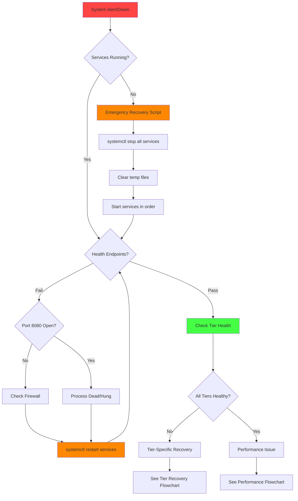
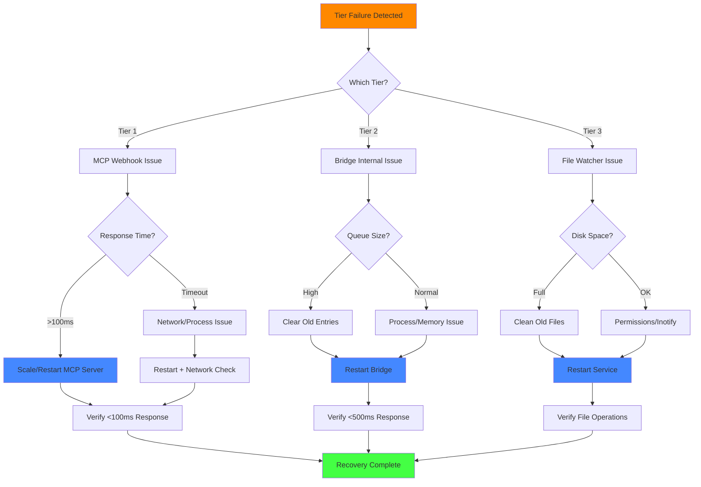
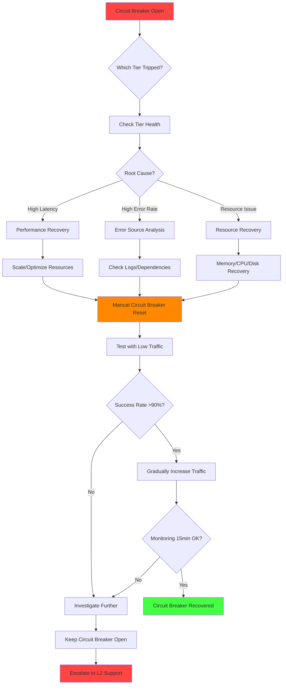
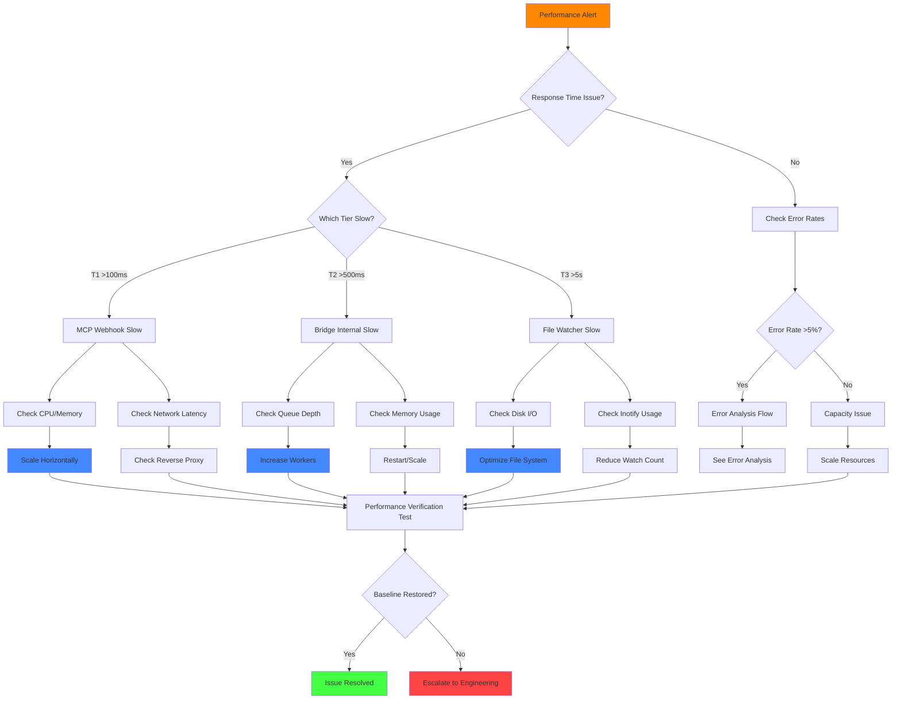
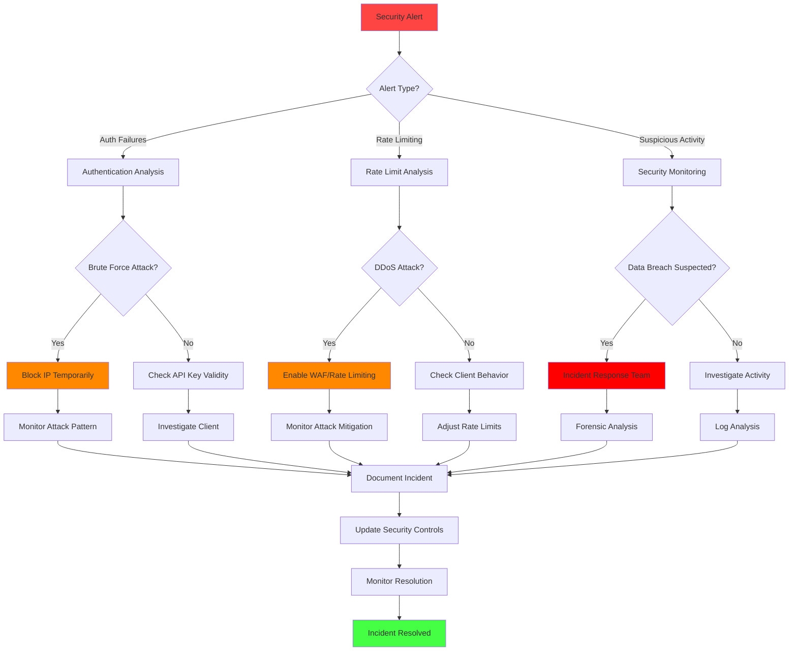
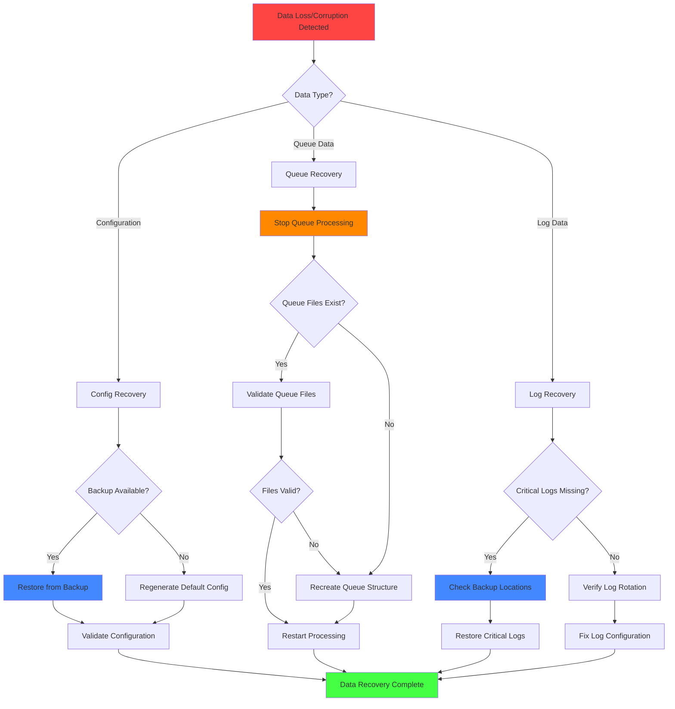
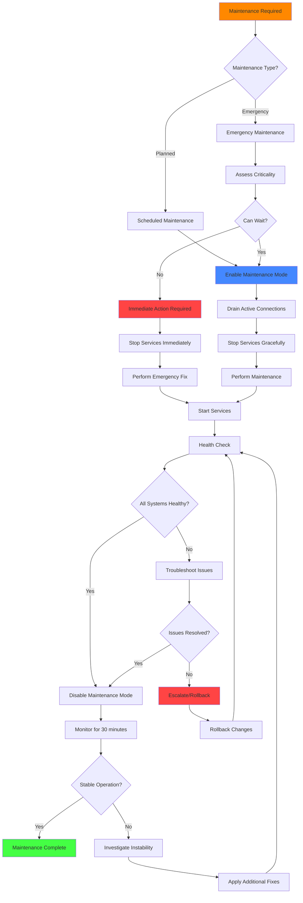
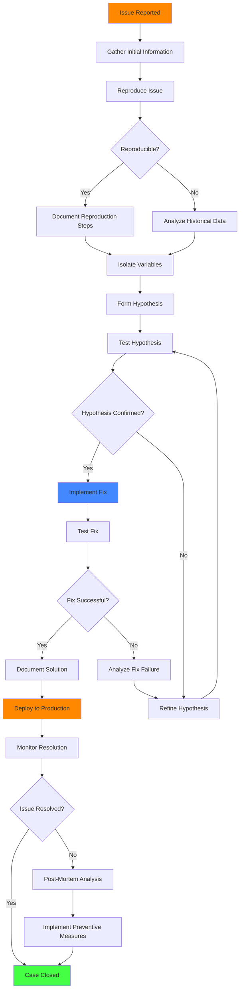

# Troubleshooting Flowcharts

Visual decision trees for systematic CCTelegram 3-tier system problem resolution.

## 🚨 System Down Flowchart

## ⚡ Tier Recovery Decision Tree

## 🔄 Circuit Breaker Recovery Flow

## 📊 Performance Degradation Flow

## 🔒 Security Incident Flow

## 🗃️ Data Recovery Flow

## 🔧 Maintenance Mode Flow

## 🔍 Root Cause Analysis Flow

---

**💡 Flowchart Usage Tips**:
- Start with the **System Down** flowchart for any system-wide issues
- Use **Tier Recovery** for component-specific problems  
- Follow **Circuit Breaker Recovery** when failover mechanisms activate
- Apply **Performance Flow** for slow response times or capacity issues
- Execute **Security Flow** for any security alerts or suspicious activity

**🔗 Navigation**:
- 📚 **Text Guides**: [Error Codes](error-codes.md) | [Recovery Procedures](recovery-procedures.md)
- 🛠️ **Tools**: [Diagnostic Commands](diagnostic-commands.md) | [Emergency Runbook](emergency-runbook.md)
- 📊 **Analysis**: [Log Analysis](log-analysis.md) | [Monitoring Alerts](monitoring-alerts.md)