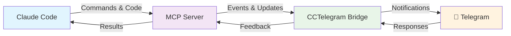

# 🚀 CCTelegram Quick Start Guide
**Get CCTelegram running with Claude Code in under 5 minutes**

```
CCTelegram Bridge v0.8.5 + MCP Server v1.8.5
Seamless Claude Code ↔ Telegram integration
```

## ⚡ 30-Second Install

```bash
git clone https://github.com/co8/cctelegram.git && cd cctelegram/mcp-server
./install.sh  # Guides token configuration
# Bridge starts automatically ✨
```

## 🎯 What You Get



**Core Features**:
- ✅ **44+ Event Types** - Task completion, errors, approvals, performance alerts
- ✅ **Bidirectional Communication** - Send commands from Telegram back to Claude
- ✅ **3 Operation Modes** - Local (local dev), Nomad (remote work), Mute (focus time)
- ✅ **Enterprise Security** - 8.5/10 security score with automated vulnerability scanning

## 🛠️ Configuration (2 minutes)

### 1. Get Your Tokens
```bash
# Required: Telegram Bot Token
# 1. Message @BotFather on Telegram
# 2. Create new bot: /newbot
# 3. Copy token: 123456789:ABCdef...

# Required: Your Telegram User ID  
# 1. Message @userinfobot
# 2. Copy your ID: 987654321
```

### 2. Environment Setup
```bash
# Installer creates .env with guided prompts
export TELEGRAM_BOT_TOKEN="your_bot_token_here"
export TELEGRAM_ALLOWED_USERS="your_user_id_here"

# Optional: Claude Code MCP integration
# Installer configures .mcp.json automatically
```

## 🎮 Usage Patterns

### Developer Workflow
```
┌─ Claude Code Session ────────────────────┐
│ • Start development task                 │
│ • CCTelegram notifies: "Task started"   │
│ • Code, test, commit                     │
│ • CCTelegram notifies: "Build complete" │
│ • Review results remotely via Telegram  │
└──────────────────────────────────────────┘
```

### Remote Work Mode
```
/cct:nomad     → Full bidirectional communication
/cct:local     → Local dev mode (minimal notifications)  
/cct:mute      → Focus time (notifications disabled)
```

### Event Examples
```
🎯 Task Started: "Implement user authentication"
✅ Build Complete: Tests passed (95% coverage)
🚨 Error Alert: Database connection failed
📊 Performance: API response time: 45ms (-12% improvement)
🔒 Security: No vulnerabilities found in latest scan
💬 Approval Request: Deploy to production? [Approve] [Deny]
```

## 📱 Telegram Commands

| Command | Action | Example |
|---------|--------|---------|
| `/status` | Show system health | Response times, memory usage |
| `/tasks` | List active tasks | Current and completed work |
| `/approve` | Respond to approvals | Deployment confirmations |
| `/logs` | Get recent logs | Error debugging |
| `/health` | System diagnostics | Bridge and MCP status |

## 🚦 Troubleshooting

### Common Issues
```
❌ "Bridge not responding"
→ Check: ps aux | grep cctelegram-bridge
→ Fix: npm run bridge:restart

❌ "MCP connection failed"  
→ Check: Claude Code MCP server status
→ Fix: Restart Claude Code, verify .mcp.json

❌ "No Telegram notifications"
→ Check: Bot token and user ID in .env
→ Fix: Verify bot permissions and user whitelist
```

### Health Check
```bash
npm run health-check  # Comprehensive system validation
npm run logs          # Recent activity and errors
npm run status        # Current operational status
```

## 📚 Next Steps

### 🧑‍💻 For Developers
- **[Claude Integration Guide](docs/user-guide/claude-integration.md)** - Advanced Claude Code workflows
- **[Event Reference](docs/user-guide/event-reference.md)** - Complete list of 44+ event types
- **[API Documentation](docs/development/api-reference.md)** - Technical integration details

### 🔧 For Administrators  
- **[Security Guide](docs/administration/security-guide.md)** - Production security configuration
- **[Monitoring Setup](docs/administration/monitoring.md)** - Health checks and alerting
- **[Deployment Guide](docs/administration/deployment.md)** - Production deployment

### 🏗️ For Contributors
- **[Architecture Overview](docs/development/architecture.md)** - System design and components
- **[Contributing Guidelines](docs/development/contributing.md)** - Development workflow
- **[Testing Guide](docs/development/testing.md)** - Testing procedures and standards

---

## 🏆 Success Indicators

After setup, you should see:
```
✅ Bridge Status: Running (PID: 12345)
✅ MCP Server: Connected (Claude Code integration active)
✅ Telegram Bot: Online (@your_bot_name)
✅ Health Check: All systems operational
✅ Test Notification: Delivered to Telegram
```

**Ready for remote development!** CCTelegram will keep you connected to your Claude Code sessions from anywhere.

---

## 🆘 Need Help?

- **📖 Documentation**: [Complete User Guide](docs/README.md)
- **🐛 Issues**: [GitHub Issues](https://github.com/co8/cctelegram/issues)
- **💬 Community**: [Discussions](https://github.com/co8/cctelegram/discussions)
- **🔒 Security**: [Security Policy](SECURITY.md)

**Quick Links**: [Features](docs/reference/features.md) | [Configuration](docs/reference/configuration.md) | [Troubleshooting](docs/user-guide/troubleshooting.md) | [Changelog](CHANGELOG.md)