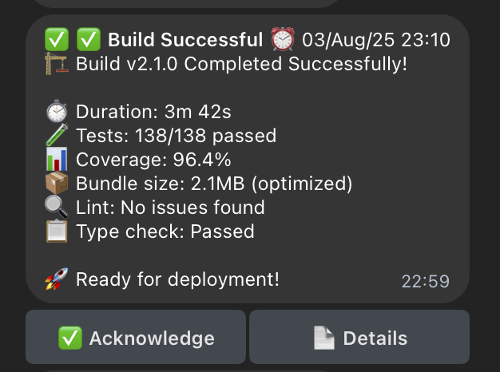
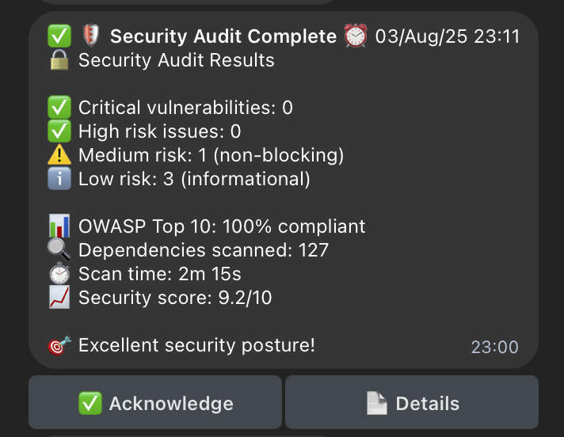
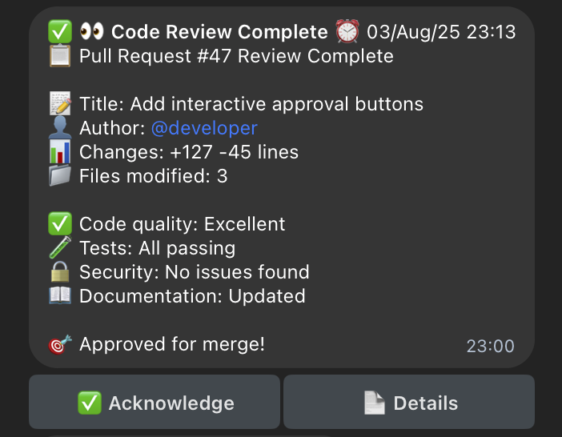
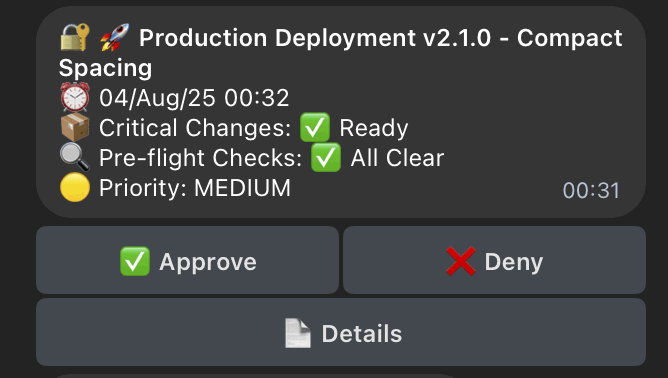
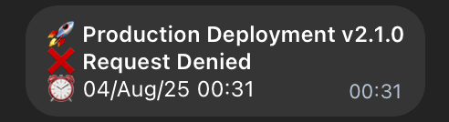
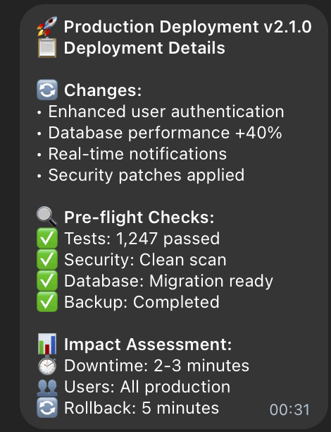

# CCTelegram MCP Server

[](https://github.com/co8/cctelegram/releases/tag/v0.5.1) [](mcp-server/README.md) [](https://claude.ai/code)

[](https://www.rust-lang.org/) [](https://www.typescriptlang.org/) [](https://opensource.org/licenses/MIT) [](https://github.com/co8/cctelegram) [](@docs/reference/SECURITY.md) [](@docs/reference/SECURITY.md) [](https://core.telegram.org/bots/api) [](@docs/reference/FEATURES.md) [](@test/) [](@docs/reference/FEATURES.md#performance-monitoring)

## TL;DR

**MCP for Notifications over [Telegram](https://telegram.org/) from [Claude Code](https://github.com/anthropics/claude-code)**<br> Get real-time notifications about builds, tests, deployments, and code changes.

**Approve or Deny while you're away. Get progress updates with notes**

**CCTelegram MCP Server** - Connect to Claude Code / VS Code<br> **CCTelegram Bridge** - Built in Rust and sends/receives messages

🛡️ **Security Score: 8.5/10 (LOW RISK)** | 🔒 **OWASP Top 10 2021: 100% Compliant** | ✅ **Zero Critical Vulnerabilities**

## 📱 Live Notifications

<div align="center">

| Build Success | Security Audit | Code Review |
|:---:|:---:|:---:|
|  |  |  |
| **✅ Comprehensive build metrics** | **🛡️ Zero-vulnerability reports** | **👀 Detailed review summaries** |
| Real-time CI/CD pipeline results with test coverage, bundle optimization, and deployment readiness | OWASP-compliant security scans with vulnerability breakdown and compliance scoring | Pull request analysis with code quality metrics and approval workflows |

</div>

## 🔐 Interactive Approval Workflow

<div align="center">

| Initial Request | Detailed Review | Final Confirmation |
|:---:|:---:|:---:|
|  |  |  |
| **🚀 Production Deployment** | **📋 Comprehensive Details** | **✅ Confirmed Response** |
| Critical changes with rating icons, pre-flight check status, and interactive approve/deny buttons | Enhanced authentication, performance improvements, security patches, and rollback planning | Real-time confirmation with timestamp and deployment tracking |

</div>

---

## ⚡ 30-Second Install

### 1. Get [Telegram](https://telegram.org/) Ready

- Create bot with [@BotFather](https://t.me/botfather): `/newbot`
- Get your user ID from [@userinfobot](https://t.me/userinfobot)

### 2. Install MCP Server

```bash
# Navigate to MCP server and install
cd mcp-server
./install.sh

# Configure your tokens in Claude Code config
# (installer guides you through this)
export TELEGRAM_BOT_TOKEN="your_bot_token_here"
export TELEGRAM_ALLOWED_USERS="your_user_id_here"
```

### 3. Test with [Claude Code](https://github.com/anthropics/claude-code)

```bash
# Restart Claude Code, then test with MCP tools:
@cctelegram send_telegram_message "🎉 CCTelegram MCP Server Working!"
```

**🎉 You should get a [Telegram](https://telegram.org/) notification within seconds!**  
_The bridge runs automatically in the background - no manual management needed._

---

## 🎯 Key Features

- **🔔 44+ Event Types** - Complete development lifecycle monitoring
- **🔌 MCP Server Integration** - Zero-config [Claude Code](https://github.com/anthropics/claude-code) integration
- **📱 Real-time [Telegram](https://telegram.org/) Notifications** - Instant alerts with rich formatting
- **✅ Interactive Approvals** - Approve deployments, code reviews via [Telegram](https://telegram.org/)
- **🛡️ Enterprise Security** - **NEW**: OWASP-compliant, zero critical vulnerabilities
- **🔐 Advanced Authentication** - **NEW**: API keys, HMAC integrity, rate limiting
- **📊 Performance Monitoring** - Built-in metrics, health checks, Prometheus integration
- **🔍 Comprehensive Audit Logging** - **NEW**: Secure event tracking, data sanitization

→ **[See all features & capabilities](@docs/reference/FEATURES.md)**

---

## 📁 Project Structure

```
cctelegram/
├── @docs/                     # 📚 All Documentation
│   ├── setup/                 # 🚀 Installation & Setup
│   ├── reference/             # 📖 Technical References
│   ├── security/              # 🛡️ Security Audits
│   └── development/           # 🔧 Contributing & Dev
├── @test/                     # 🧪 Testing Framework
│   └── unit/                  # Unit & Integration Tests
├── @scripts/                  # ⚙️ Utility Scripts
├── src/                       # 🦀 Rust Bridge Source
├── mcp-server/                # 🔌 MCP Server (TypeScript)
├── examples/                  # 💡 Usage Examples
└── target/                    # 🏗️ Build Artifacts
```

---

## 📚 Documentation

| Guide | Description |
| --- | --- |
| 🚀 **[Complete Setup Guide](@docs/setup/QUICKSTART.md)** | Detailed installation, configuration, and deployment |
| 🔧 **[Features & Capabilities](@docs/reference/FEATURES.md)** | All features, API reference, event types, monitoring |
| 🔒 **[Security & Compliance](@docs/reference/SECURITY.md)** | **NEW**: Enterprise security, OWASP compliance, zero vulnerabilities |
| 🎛️ **[MCP Integration](mcp-server/README.md)** | [Claude Code](https://github.com/anthropics/claude-code) MCP server setup and usage |
| 📖 **[Technical Reference](@docs/reference/EVENT_SYSTEM.md)** | Event system architecture and implementation |
| 🛡️ **[Security Audits](@docs/security/)** | Complete security audit reports and remediation |
| 🧪 **[Testing Guide](@test/)** | Unit tests and testing framework documentation |
| 🔧 **[Development Guide](@docs/development/CONTRIBUTING.md)** | Contributing guidelines and development setup |

---

## 💡 Quick Example

**Task Completion Notification:**

```bash
# Your build system creates this file when a task completes:
echo '{
  "type": "task_completion",
  "source": "ci_system",
  "title": "✅ Deploy Complete",
  "description": "Production deployment v2.1.0 successful"
}' > ~/.cc_telegram/events/deploy-complete.json

# CCTelegram instantly sends: "✅ Deploy Complete ⏰ 14:30 UTC
# Production deployment v2.1.0 successful"
```

**Performance Alert:**

```bash
# Monitoring system triggers alert:
echo '{
  "type": "performance_alert",
  "title": "⚠️ Memory High",
  "description": "Server memory usage: 85% (threshold: 80%)"
}' > ~/.cc_telegram/events/memory-alert.json

# Get instant notification with threshold details
```

---

## ⚙️ Alternative Installation

**Manual Bridge Setup (Advanced Users):**

```bash
# Download and extract latest bridge (v0.5.1)
curl -L https://github.com/co8/cctelegram/releases/download/v0.5.1/cctelegram-bridge-v0.5.1-source.tar.gz -o cctelegram-bridge-v0.5.1-source.tar.gz
tar -xzf cctelegram-bridge-v0.5.1-source.tar.gz
cd cctelegram-bridge-v0.5.1
cargo build --release

# Configure and run
export TELEGRAM_BOT_TOKEN="your_bot_token_here"
export TELEGRAM_ALLOWED_USERS="your_user_id_here"
./target/release/cctelegram-bridge

# Test with file creation
mkdir -p ~/.cc_telegram/events
echo '{"type": "task_completion", "title": "Bridge Test", "description": "Manual setup working"}' > ~/.cc_telegram/events/test.json
```

**Build from Source:**

```bash
git clone https://github.com/co8/cctelegram.git
cd cctelegram
cargo build --release
./target/release/cctelegram-bridge
```

---

## 🤝 Contributing

1. Fork the repository
2. Create a feature branch (`git checkout -b feature/amazing-feature`)
3. Commit your changes (`git commit -m 'Add amazing feature'`)
4. Push to the branch (`git push origin feature/amazing-feature`)
5. Open a Pull Request

---

## 📄 License

This project is licensed under the MIT License - see the [LICENSE](LICENSE) file for details.

## 📞 Support

- **Issues**: [GitHub Issues](https://github.com/co8/cctelegram/issues)
- **Discussions**: [GitHub Discussions](https://github.com/co8/cctelegram/discussions)

---

**Built with ❤️ in Rust** | **🔒 Enterprise Security** | **✅ OWASP Compliant** | **🛡️ Zero Critical Vulnerabilities**
