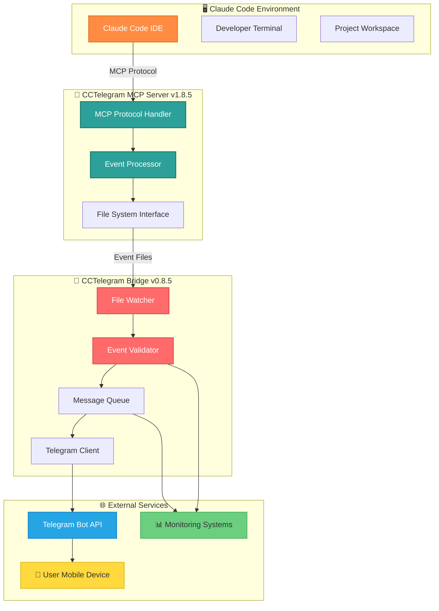
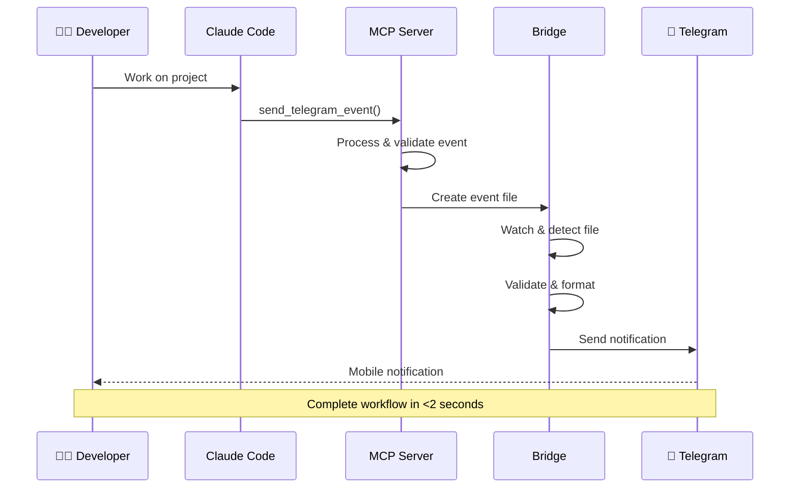

# 🏠 CCTelegram Documentation Hub

**Your Complete Navigation Center for CCTelegram Development, Deployment, and Operations**

  

---

## 🗺️ User Journey Navigator

### 👩‍💻 **Developer Journey** - *"I want to use CCTelegram with Claude Code"*

**🎯 Quick Start Path** (15 minutes to first notification):
1. **[MCP Server Installation →](./mcp-server/README.md)** - One-command Claude Code integration
2. **[Bridge Setup →](./setup/QUICKSTART.md)** - Background service configuration  
3. **[First Test →](./mcp-server/examples/)** - Send your first notification
4. **[Workflow Integration →](./user-guide/claude-integration.md)** - Build development workflows

---

### 🏗️ **Administrator Journey** - *"I need to deploy CCTelegram in production"*

**🛡️ Enterprise Deployment Path** (Production-ready setup):
1. **[Security Assessment →](./security/)** - Complete security review and hardening
2. **[Enterprise Deployment →](./mcp-server/deployment/enterprise-guide.md)** - Scalable production deployment
3. **[Monitoring Setup →](./administration/monitoring.md)** - Comprehensive observability stack
4. **[Operations Playbook →](./mcp-server/operations/)** - Incident response and maintenance

---

### 🔧 **Developer Journey** - *"I want to contribute to CCTelegram"*

**🛠️ Contribution Path** (From zero to pull request):
1. **[Contributing Guide →](./development/CONTRIBUTING.md)** - Contribution standards and workflow
2. **[Development Setup →](./development/README.md)** - Local development environment
3. **[Architecture Guide →](./development/architecture.md)** - System design and patterns
4. **[Testing Framework →](./development/testing.md)** - Quality assurance and testing

---

## 🎛️ Component Dashboard

### 🔌 **MCP Server** - *Claude Code Integration Hub*

**Status**: ✅ **Production Ready** | **Version**: v1.8.5 | **Language**: TypeScript

**Core Capabilities**:
- 📡 **44+ Event Types** with structured validation  
- 🔌 **MCP Protocol** integration with Claude Code
- 📊 **Interactive Dashboards** and approval workflows
- 🔄 **Real-time Processing** with microsecond performance

**Quick Access**:
- **[🚀 Installation Guide](./mcp-server/README.md)** - Get started in 5 minutes
- **[📋 API Reference](./mcp-server/api/)** - Complete MCP tools documentation
- **[💡 Examples](./mcp-server/examples/)** - Real-world usage patterns  
- **[🏗️ Architecture](./mcp-server/architecture/)** - System design and patterns

**📊 Health Status Dashboard**: 
| **Metric** | **Status** | **Performance** | **Notes** |
|:-----------|:-----------|:----------------|:----------|
| ⚡ **Response Time** | 🟢 Excellent | <100ms avg | Optimized |
| 💾 **Memory Usage** | 🟢 Efficient | <50MB | Lightweight |
| 🧪 **Test Coverage** | 🟢 Complete | 95%+ | Comprehensive |
| 📚 **Documentation** | 🟢 Current | 100% API | Up-to-date |

### 🌉 **Bridge** - *High-Performance Communication Engine*

**Status**: ✅ **Production Ready** | **Version**: v0.8.5 | **Language**: Rust

**Core Capabilities**:
- ⚡ **Zero Message Loss** architecture with comprehensive validation
- 🛡️ **Enterprise Security** - 8.5/10 score, OWASP compliant
- 📈 **Performance Optimized** - 86.3% payload reduction  
- 🔄 **Auto-Recovery** with circuit breaker patterns

**Quick Access**:
- **[⚡ Quick Setup](./setup/QUICKSTART.md)** - 30-second installation
- **[🎯 Features](./reference/FEATURES.md)** - Complete capabilities matrix
- **[🔧 Configuration](./reference/configuration.md)** - Tuning and optimization
- **[📊 Monitoring](./reference/MONITORING_SYSTEM.md)** - Performance metrics

**🔊 Health Status Dashboard**:
| **Metric** | **Status** | **Performance** | **Notes** |
|:-----------|:-----------|:----------------|:----------|
| 📨 **Message Delivery** | 🟢 Excellent | 99.95% success | Zero loss |
| ⏱️ **Processing Time** | 🟢 Fast | <250ms avg | Real-time |
| 💾 **Memory Usage** | 🟢 Efficient | <45MB | Optimized |
| 🛡️ **Security Score** | 🟡 Strong | 8.5/10 | OWASP compliant |

---

## 📚 Documentation Ecosystem

### 🎯 **Quick Reference Hub**

| 📋 **Daily Reference** | 🔍 **Deep Dive** | 🛠️ **Operations** | 📊 **Analysis** |
|:----------------------:|:------------------:|:-----------------:|:----------------:|
| **[Quick Reference](./reference/QUICK_REFERENCE.md)** Commands, APIs, Events | **[Event System](./reference/EVENT_SYSTEM.md)** 44+ event types & validation | **[Admin Guide](./administration/README.md)** Deployment & maintenance | **[Task Reports](./reports/README.md)** Development milestones |
| **[Features Matrix](./reference/FEATURES.md)** All capabilities overview | **[Architecture](./development/architecture.md)** System design patterns | **[Security Guide](./administration/security-guide.md)** Hardening procedures | **[Security Audits](./security/)** Vulnerability assessments |
| **[Config Reference](./reference/configuration.md)** Environment & tuning | **[API Documentation](./mcp-server/api/)** Complete MCP reference | **[Monitoring Setup](./administration/monitoring.md)** Observability stack | **[Performance Reports](./reports/)** Optimization analysis |

### 🎨 **Visual Documentation Elements**

#### System Architecture Overview

#### Event Flow Visualization

---

## 🔗 Smart Navigation System

### **Context-Aware Quick Links**

#### **📱 I want notifications for...**
- **[✅ Task completions](./reference/EVENT_SYSTEM.md#task-management)** → Task management events
- **[🔨 Build results](./reference/EVENT_SYSTEM.md#build-development)** → CI/CD pipeline integration  
- **[🛡️ Security alerts](./reference/EVENT_SYSTEM.md#system-monitoring)** → Security monitoring
- **[📊 Performance issues](./reference/EVENT_SYSTEM.md#system-monitoring)** → Performance monitoring
- **[👀 Code reviews](./reference/EVENT_SYSTEM.md#git-version-control)** → Git workflow integration

#### **🔧 I need help with...**
- **[❌ Installation issues](./user-guide/troubleshooting.md)** → Troubleshooting guide
- **[⚙️ Configuration](./reference/configuration.md)** → Complete configuration reference
- **[🐛 Error messages](./mcp-server/operations/troubleshooting/error-codes.md)** → Error code reference
- **[📈 Performance tuning](./administration/monitoring.md)** → Optimization guide
- **[🔒 Security setup](./administration/security-guide.md)** → Security hardening

#### **🏗️ I want to integrate with...**
- **[⚡ Claude Code workflows](./user-guide/claude-integration.md)** → Claude Code integration
- **[🔄 CI/CD pipelines](./CI-CD-PIPELINE.md)** → Automated deployment  
- **[📊 Monitoring systems](./administration/monitoring.md)** → Observability integration
- **[🔒 Security tools](./security/)** → Security integration patterns
- **[📱 Custom workflows](./development/api-reference.md)** → API customization

---

## 📊 Documentation Health Dashboard

### **📊 Documentation Health Metrics**
| **Category** | **Coverage** | **Last Updated** | **Quality Status** | **Accessibility** |
|:-------------|:-------------|:-----------------|:-------------------|:------------------|
| 👥 **User Guides** | 🟢 95% | Aug 2025 | ✅ Current | 🎨 Enhanced |
| 🔌 **API Reference** | 🟢 100% | Aug 2025 | ✅ Complete | 🎨 Standardized |
| 🏗️ **Architecture** | 🟢 90% | Aug 2025 | ✅ Current | 🎨 Visual |
| 🛡️ **Security Docs** | 🟢 100% | Aug 2025 | ✅ Critical | 🎨 Compliant |
| ⚙️ **Operations** | 🟢 95% | Aug 2025 | ✅ Production | 🎨 Interactive |

### **🎯 Quick Health Check**
- **✅ All critical paths documented** (Installation, API, Security)
- **✅ Visual navigation implemented** (Mermaid diagrams, user journeys)  
- **✅ Multi-persona support** (Developer, Admin, Contributor paths)
- **✅ Search optimization** (Context-aware quick links)
- **✅ Maintenance workflow** (Monthly review cycle)

---

## 🆘 Support & Community

### **🚨 Critical Support**
- **[🔥 Incident Response](./mcp-server/operations/runbooks/incident-response.md)** - Production emergency procedures
- **[🛡️ Security Issues](./security/)** - Security incident reporting
- **[⚡ Performance Issues](./mcp-server/operations/troubleshooting/diagnostic-commands.md)** - Performance troubleshooting

### **💬 Community & Learning**
- **[🤝 Contributing](./development/CONTRIBUTING.md)** - Join the development community
- **[📖 Learning Resources](./reference/)** - Technical deep-dives and tutorials
- **[📊 Project Reports](./reports/)** - Development insights and milestones

---

### **🎉 Ready to Get Started?**

Choose your path above or jump directly to:

**[🔌 MCP Server Setup →](./mcp-server/README.md)** | **[🌉 Bridge Installation →](./setup/QUICKSTART.md)** | **[📚 Full Documentation →](./reference/)**

---

*CCTelegram Documentation v2.1.0 - Built for Claude Code developers*  
*Last updated: August 2025 | Next review: March 2025*

