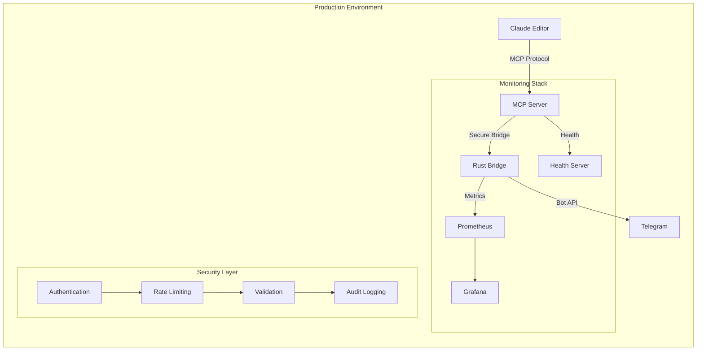
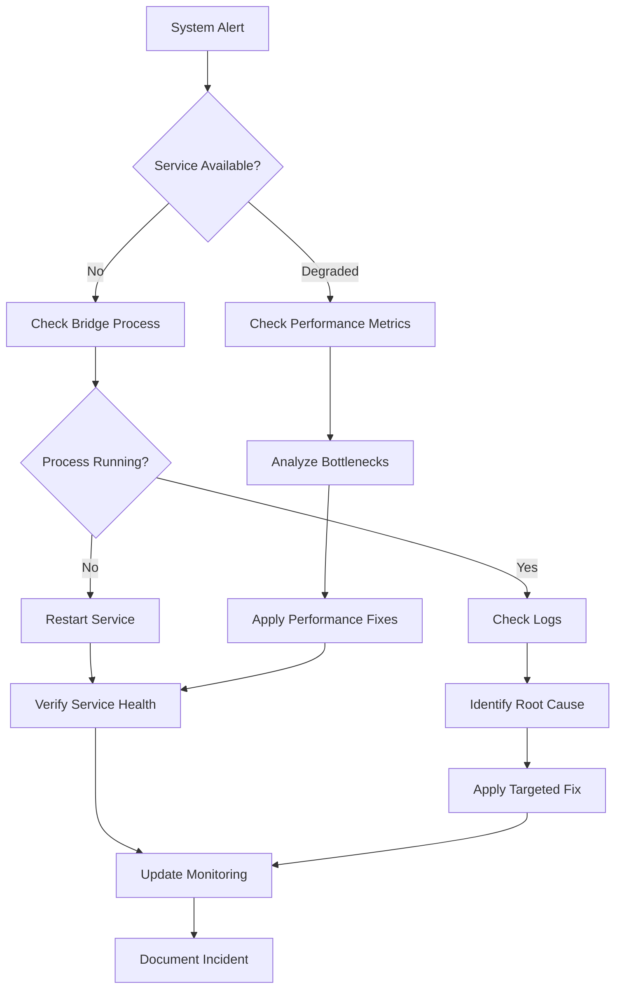
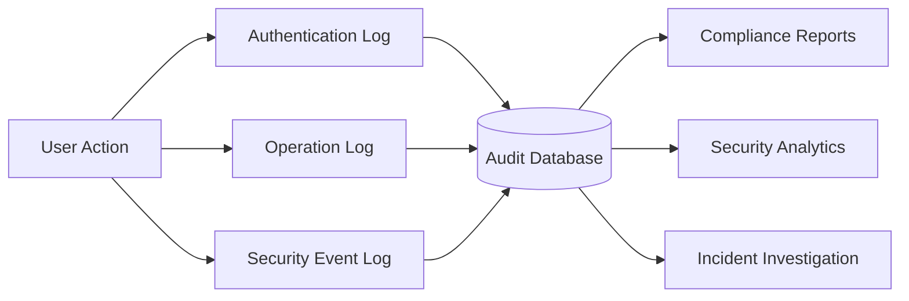

# CCTelegram Administration Guide

**Enterprise-Grade Remote Development Bridge for Claude Code**

[](security-guide.md)
[](monitoring.md)
[](deployment.md)

---

## 🎯 Administration Overview

CCTelegram provides enterprise-grade remote development capabilities through a secure Rust bridge and TypeScript MCP server. This administration section covers production deployment, monitoring, security, and maintenance procedures.



## 🚀 Quick Start for Administrators

### Production Deployment Checklist
- [ ] [Environment setup and configuration](deployment.md#environment-setup)
- [ ] [Security hardening implementation](security-guide.md#production-hardening)
- [ ] [Monitoring dashboard deployment](monitoring.md#dashboard-setup)
- [ ] [Backup and recovery procedures](maintenance.md#backup-procedures)

### Daily Operations
- [ ] [Health check verification](monitoring.md#health-checks)
- [ ] [Log review and analysis](monitoring.md#log-analysis)
- [ ] [Security alert monitoring](security-guide.md#alert-monitoring)
- [ ] [Performance metrics review](monitoring.md#performance-metrics)

## 📊 System Architecture

### High-Level Component Overview

```mermaid
graph TB
    subgraph "External Systems"
        TG[Telegram API]
        CL[Claude Code/Editor]
    end
    
    subgraph "CCTelegram Core"
        direction TB
        MCP[MCP Server<br/>TypeScript] --> |Bridge Communication| RB[Rust Bridge<br/>Primary Engine]
        
        subgraph "Bridge Components"
            direction LR
            EV[Event System] --> QM[Queue Manager]
            QM --> RL[Rate Limiter]
            RL --> RH[Retry Handler]
            RH --> MT[Message Tracker]
        end
        
        RB --> Bridge Components
    end
    
    subgraph "Infrastructure"
        RD[(Redis<br/>Queue & Cache)]
        FS[(File System<br/>Events & Logs)]
        PR[Prometheus<br/>Metrics]
    end
    
    CL --> |MCP Protocol| MCP
    RB --> |Bot API| TG
    RB --> |Data| RD
    RB --> |Events| FS
    RB --> |Metrics| PR
```

### Security Architecture

```mermaid
graph TB
    subgraph "Security Perimeter"
        direction TB
        
        subgraph "Authentication Layer"
            API[API Key Auth] --> HMAC[HMAC Validation]
            HMAC --> UA[User Authorization]
        end
        
        subgraph "Input Validation"
            IV[Input Sanitization] --> SV[Schema Validation]
            SV --> RL[Rate Limiting]
        end
        
        subgraph "Output Security"
            LS[Log Sanitization] --> ES[Error Sanitization]
            ES --> AM[Audit Monitoring]
        end
        
        Authentication Layer --> Input Validation
        Input Validation --> Output Security
    end
```

## 🛠️ Administration Sections

### [Deployment Guide](deployment.md)
**Production deployment procedures with architecture diagrams**
- Environment configuration and hardening
- Container and systemd service deployment
- Load balancing and high availability setup
- Multi-environment management (dev/staging/prod)

### [Monitoring & Observability](monitoring.md)
**Comprehensive monitoring with visual dashboards**
- Real-time health checks and metrics
- Prometheus integration and Grafana dashboards
- Alert configuration and incident response
- Performance analysis and optimization

### [Security Guide](security-guide.md)
**Enterprise security practices with threat models**
- Consolidated security audit findings
- Production security hardening procedures
- Threat model diagrams and mitigation strategies
- Compliance frameworks (OWASP, SOC 2, GDPR)

### [Maintenance Procedures](maintenance.md)
**Operational maintenance with process diagrams**
- Update and upgrade procedures
- Backup and disaster recovery
- Log rotation and cleanup procedures
- Performance tuning and capacity planning

## 🔍 Key Performance Indicators

### System Health Metrics

| Metric | Target | Critical Threshold | Monitoring |
|--------|--------|-------------------|------------|
| Message Delivery Rate | >95% | <90% | Real-time |
| System Response Time | <200ms | >1000ms | Continuous |
| Error Rate | <0.1% | >1% | Alert-based |
| Queue Depth | <100 | >500 | Dashboard |
| CPU Usage | <70% | >85% | Automated |
| Memory Usage | <80% | >90% | Automated |

### Security Metrics

| Metric | Target | Alert Threshold | Response |
|--------|--------|-----------------|----------|
| Failed Auth Attempts | <10/hour | >50/hour | Immediate |
| Rate Limit Violations | <5/hour | >25/hour | Monitor |
| Input Validation Failures | <1% | >5% | Review |
| Security Events | 0 critical | Any critical | Immediate |

## 🚨 Emergency Procedures

### Critical System Failure Response



### Escalation Matrix

| Severity | Response Time | Escalation Level | Contact |
|----------|---------------|------------------|---------|
| Critical | <15 minutes | On-call Engineer | Immediate |
| High | <1 hour | Team Lead | Phone/SMS |
| Medium | <4 hours | Team Member | Email |
| Low | <24 hours | Scheduled | Ticket |

## 📋 Compliance and Auditing

### Security Compliance Status

| Framework | Status | Score | Last Audit |
|-----------|---------|-------|------------|
| OWASP Top 10 | ✅ Compliant | 8.5/10 | Current |
| SOC 2 Type I | 🔄 In Progress | - | Q4 2025 |
| GDPR | ✅ Compliant | - | Current |
| ISO 27001 | 📋 Planned | - | 2026 |

### Audit Trail Requirements



## 🔗 Quick Navigation

### Essential Admin Tasks
- **[Daily Health Check](monitoring.md#daily-health-check)** - Verify system status
- **[Security Review](security-guide.md#daily-security-review)** - Check security events
- **[Performance Analysis](monitoring.md#performance-analysis)** - Review metrics
- **[Log Analysis](monitoring.md#log-analysis)** - Investigate issues

### Emergency Procedures
- **[Service Recovery](maintenance.md#service-recovery)** - Restore failed services
- **[Security Incident Response](security-guide.md#incident-response)** - Handle security events
- **[Performance Emergency](monitoring.md#performance-emergency)** - Address performance issues
- **[Backup Recovery](maintenance.md#disaster-recovery)** - Restore from backups

### Integration Points
- **[Claude Code Integration](../user-guide/claude-integration.md)** - MCP server setup
- **[Telegram Bot Configuration](deployment.md#telegram-setup)** - Bot deployment
- **[Monitoring Integration](monitoring.md#external-monitoring)** - External monitoring systems
- **[CI/CD Pipeline](../CI-CD-PIPELINE.md)** - Automated deployment

---

## 📞 Administrator Support

### Internal Contacts
- **Security Lead**: security@internal.com
- **DevOps Team**: devops@internal.com  
- **Development Lead**: dev-lead@internal.com

### External Resources
- **GitHub Issues**: [Report bugs and issues](https://github.com/co8/cctelegram/issues)
- **Security Reports**: [Responsible disclosure](security-guide.md#vulnerability-reporting)
- **Documentation**: [Community wiki](https://github.com/co8/cctelegram/wiki)

---

**Last Updated**: August 2025  
**Version**: CCTelegram Bridge v0.8.5, MCP Server v1.8.5  
**Maintained by**: CCTelegram Administration Team