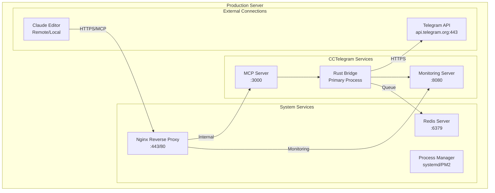
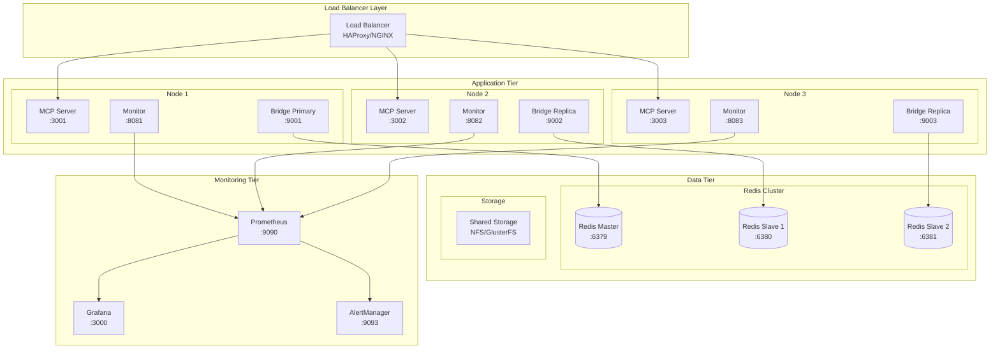
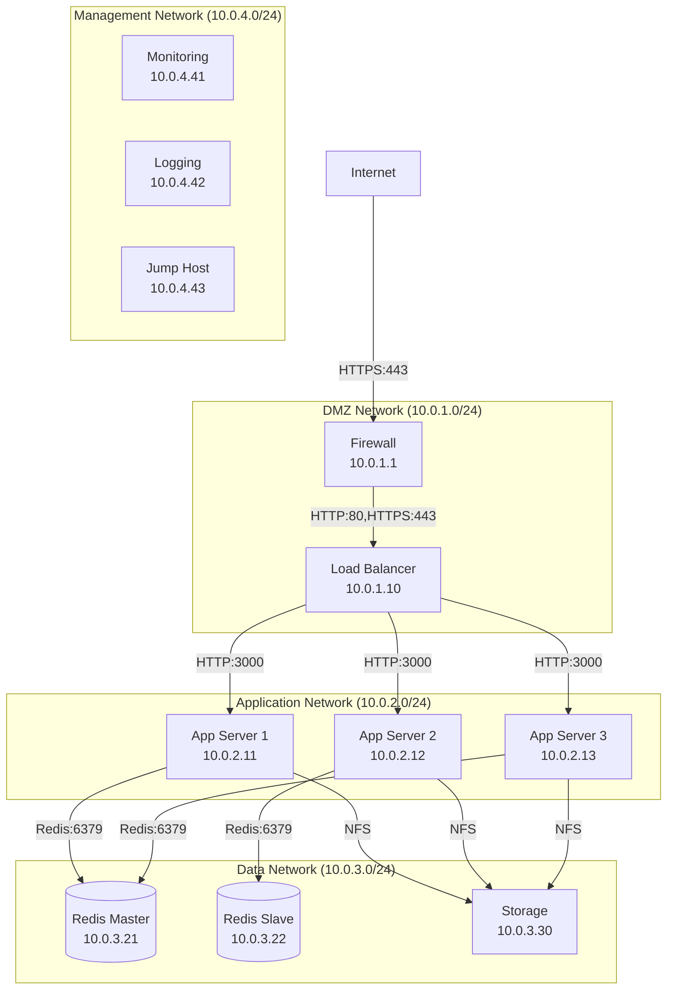
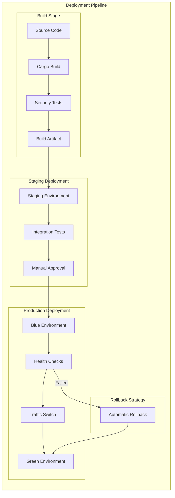
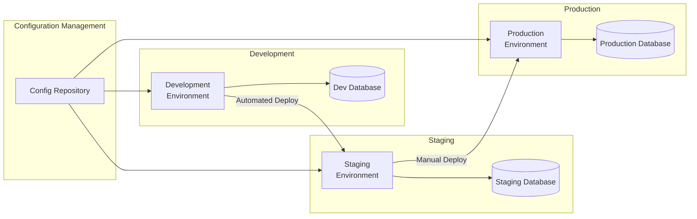

# Production Deployment Guide

**Enterprise-Grade CCTelegram Deployment with Architecture Diagrams**

---

## 🎯 Deployment Overview

CCTelegram supports multiple deployment scenarios from single-server installations to enterprise high-availability clusters. This guide provides production-ready deployment procedures with comprehensive architecture diagrams.

## 🏗️ Architecture Diagrams

### Single-Server Deployment



### High-Availability Cluster



### Network Topology



## 🚀 Environment Setup

### Prerequisites

#### System Requirements
- **OS**: Ubuntu 20.04+ / RHEL 8+ / CentOS 8+
- **RAM**: 4GB minimum (8GB recommended)
- **CPU**: 2 cores minimum (4 cores recommended)
- **Storage**: 20GB minimum (SSD recommended)
- **Network**: 1Gbps minimum

#### Software Dependencies
```bash
# Node.js 18+ for MCP Server
curl -fsSL https://deb.nodesource.com/setup_18.x | sudo -E bash -
sudo apt-get install -y nodejs

# Rust for Bridge (latest stable)
curl --proto '=https' --tlsv1.2 -sSf https://sh.rustup.rs | sh
source ~/.cargo/env

# Redis for queue management
sudo apt-get install -y redis-server redis-tools

# Nginx for reverse proxy
sudo apt-get install -y nginx

# Process manager
sudo apt-get install -y systemd  # Usually pre-installed
```

### Environment Configuration

#### Production Environment Variables
```bash
# /etc/cctelegram/production.env

# === Core Configuration ===
ENVIRONMENT=production
LOG_LEVEL=info
RUST_LOG=cctelegram_bridge=info,warn

# === Telegram Configuration ===
TELEGRAM_BOT_TOKEN=your_bot_token_here
TELEGRAM_ALLOWED_USERS=123456789,987654321
TELEGRAM_RATE_LIMIT_GLOBAL=30
TELEGRAM_RATE_LIMIT_PER_CHAT=10

# === Security Configuration ===
API_KEYS=api_key_1,api_key_2,api_key_3
HMAC_SECRET=your_secure_hmac_secret_here
SECURITY_AUDIT_LOG=true
INPUT_VALIDATION_STRICT=true

# === Database Configuration ===
REDIS_URL=redis://localhost:6379
REDIS_CLUSTER_NODES=10.0.3.21:6379,10.0.3.22:6379
REDIS_PASSWORD=secure_redis_password
REDIS_TLS_ENABLED=true

# === Monitoring Configuration ===
PROMETHEUS_ENABLED=true
PROMETHEUS_PORT=9090
MONITORING_SERVER_PORT=8080
HEALTH_CHECK_INTERVAL=30
METRICS_RETENTION_DAYS=30

# === Performance Configuration ===
WORKER_THREADS=4
QUEUE_SIZE_LIMIT=1000
MESSAGE_BATCH_SIZE=10
RETRY_MAX_ATTEMPTS=3
CIRCUIT_BREAKER_THRESHOLD=5

# === File Storage Configuration ===
EVENTS_DIR=/var/lib/cctelegram/events
LOGS_DIR=/var/log/cctelegram
BACKUP_DIR=/var/backups/cctelegram
FILE_RETENTION_DAYS=90

# === SSL/TLS Configuration ===
TLS_CERT_PATH=/etc/ssl/certs/cctelegram.crt
TLS_KEY_PATH=/etc/ssl/private/cctelegram.key
TLS_MIN_VERSION=1.2
```

## 📦 Container Deployment

### Docker Compose Production Setup

```yaml
# docker-compose.production.yml
version: '3.8'

services:
  # Rust Bridge Service
  bridge:
    build: 
      context: .
      dockerfile: Dockerfile.production
    image: cctelegram/bridge:0.8.5
    container_name: cctelegram-bridge
    restart: unless-stopped
    env_file: 
      - /etc/cctelegram/production.env
    volumes:
      - events_data:/var/lib/cctelegram/events
      - logs_data:/var/log/cctelegram
      - /etc/ssl/certs:/etc/ssl/certs:ro
    ports:
      - "8080:8080"  # Monitoring dashboard
    depends_on:
      - redis
      - mcp-server
    networks:
      - cctelegram-network
    healthcheck:
      test: ["CMD", "curl", "-f", "http://localhost:8080/health"]
      interval: 30s
      timeout: 10s
      retries: 3
      start_period: 40s

  # MCP Server Service  
  mcp-server:
    build:
      context: ./mcp-server
      dockerfile: Dockerfile.production
    image: cctelegram/mcp-server:1.8.5
    container_name: cctelegram-mcp
    restart: unless-stopped
    env_file:
      - /etc/cctelegram/production.env
    ports:
      - "3000:3000"
    volumes:
      - events_data:/var/lib/cctelegram/events
    networks:
      - cctelegram-network
    healthcheck:
      test: ["CMD", "curl", "-f", "http://localhost:3000/health"]
      interval: 30s
      timeout: 10s
      retries: 3

  # Redis Cache and Queue
  redis:
    image: redis:7-alpine
    container_name: cctelegram-redis
    restart: unless-stopped
    ports:
      - "6379:6379"
    volumes:
      - redis_data:/data
      - ./redis.conf:/etc/redis/redis.conf:ro
    command: redis-server /etc/redis/redis.conf
    networks:
      - cctelegram-network
    healthcheck:
      test: ["CMD", "redis-cli", "ping"]
      interval: 30s
      timeout: 10s
      retries: 3

  # Nginx Reverse Proxy
  nginx:
    image: nginx:alpine
    container_name: cctelegram-nginx
    restart: unless-stopped
    ports:
      - "80:80"
      - "443:443"
    volumes:
      - ./nginx/nginx.conf:/etc/nginx/nginx.conf:ro
      - ./nginx/sites-enabled:/etc/nginx/sites-enabled:ro
      - /etc/ssl/certs:/etc/ssl/certs:ro
      - /etc/ssl/private:/etc/ssl/private:ro
    depends_on:
      - bridge
      - mcp-server
    networks:
      - cctelegram-network

  # Prometheus Monitoring
  prometheus:
    image: prom/prometheus:latest
    container_name: cctelegram-prometheus
    restart: unless-stopped
    ports:
      - "9090:9090"
    volumes:
      - ./prometheus/prometheus.yml:/etc/prometheus/prometheus.yml:ro
      - prometheus_data:/prometheus
    command:
      - '--config.file=/etc/prometheus/prometheus.yml'
      - '--storage.tsdb.path=/prometheus'
      - '--web.console.libraries=/usr/share/prometheus/console_libraries'
      - '--web.console.templates=/usr/share/prometheus/consoles'
      - '--web.enable-lifecycle'
    networks:
      - cctelegram-network

  # Grafana Dashboards
  grafana:
    image: grafana/grafana:latest
    container_name: cctelegram-grafana
    restart: unless-stopped
    ports:
      - "3001:3000"
    environment:
      - GF_SECURITY_ADMIN_PASSWORD=secure_admin_password
      - GF_USERS_ALLOW_SIGN_UP=false
    volumes:
      - grafana_data:/var/lib/grafana
      - ./grafana/provisioning:/etc/grafana/provisioning:ro
    networks:
      - cctelegram-network

volumes:
  events_data:
    driver: local
  logs_data:
    driver: local
  redis_data:
    driver: local  
  prometheus_data:
    driver: local
  grafana_data:
    driver: local

networks:
  cctelegram-network:
    driver: bridge
    ipam:
      config:
        - subnet: 172.20.0.0/24
```

### Production Dockerfile

```dockerfile
# Dockerfile.production
FROM rust:1.75 as builder

WORKDIR /app
COPY Cargo.toml Cargo.lock ./
COPY src ./src

# Security: Build with optimizations
RUN cargo build --release --locked

# Production runtime
FROM debian:bullseye-slim

# Install runtime dependencies
RUN apt-get update && apt-get install -y \
    ca-certificates \
    curl \
    && rm -rf /var/lib/apt/lists/*

# Create non-root user
RUN groupadd -r cctelegram && useradd -r -g cctelegram cctelegram

# Create directories with proper permissions
RUN mkdir -p /var/lib/cctelegram/events \
    /var/log/cctelegram \
    /app \
    && chown -R cctelegram:cctelegram /var/lib/cctelegram \
    && chown -R cctelegram:cctelegram /var/log/cctelegram

# Copy binary
COPY --from=builder /app/target/release/cctelegram-bridge /app/
RUN chown cctelegram:cctelegram /app/cctelegram-bridge

# Switch to non-root user
USER cctelegram

# Health check
HEALTHCHECK --interval=30s --timeout=3s --start-period=5s --retries=3 \
  CMD curl -f http://localhost:8080/health || exit 1

EXPOSE 8080
CMD ["/app/cctelegram-bridge"]
```

## ⚙️ System Service Deployment

### Systemd Service Configuration

#### Bridge Service
```ini
# /etc/systemd/system/cctelegram-bridge.service
[Unit]
Description=CCTelegram Bridge Service
Documentation=https://github.com/co8/cctelegram
After=network.target redis.service
Wants=redis.service

[Service]
Type=simple
User=cctelegram
Group=cctelegram
WorkingDirectory=/opt/cctelegram
ExecStart=/opt/cctelegram/bin/cctelegram-bridge
ExecReload=/bin/kill -HUP $MAINPID

# Environment
EnvironmentFile=/etc/cctelegram/production.env

# Security
NoNewPrivileges=true
ProtectSystem=strict
ProtectHome=true
ReadWritePaths=/var/lib/cctelegram /var/log/cctelegram
PrivateTmp=true
ProtectKernelTunables=true
ProtectControlGroups=true
RestrictRealtime=true

# Resource limits
LimitNOFILE=65536
MemoryLimit=1G
CPUQuota=200%

# Restart policy
Restart=always
RestartSec=10
StartLimitInterval=60s
StartLimitBurst=3

# Logging
StandardOutput=journal
StandardError=journal
SyslogIdentifier=cctelegram-bridge

[Install]
WantedBy=multi-user.target
```

#### MCP Server Service
```ini
# /etc/systemd/system/cctelegram-mcp.service
[Unit]
Description=CCTelegram MCP Server
Documentation=https://github.com/co8/cctelegram
After=network.target
Before=cctelegram-bridge.service

[Service]
Type=simple
User=cctelegram
Group=cctelegram
WorkingDirectory=/opt/cctelegram/mcp-server
ExecStart=/usr/bin/node dist/index.js
ExecReload=/bin/kill -HUP $MAINPID

# Environment
EnvironmentFile=/etc/cctelegram/production.env
Environment=NODE_ENV=production

# Security
NoNewPrivileges=true
ProtectSystem=strict
ProtectHome=true
ReadWritePaths=/var/lib/cctelegram
PrivateTmp=true

# Resource limits
LimitNOFILE=4096
MemoryLimit=512M
CPUQuota=100%

# Restart policy
Restart=always
RestartSec=5
StartLimitInterval=60s
StartLimitBurst=5

[Install]
WantedBy=multi-user.target
```

### Service Management Commands

```bash
# Enable and start services
sudo systemctl enable cctelegram-mcp
sudo systemctl enable cctelegram-bridge
sudo systemctl start cctelegram-mcp
sudo systemctl start cctelegram-bridge

# Check service status
sudo systemctl status cctelegram-bridge
sudo systemctl status cctelegram-mcp

# View logs
sudo journalctl -u cctelegram-bridge -f
sudo journalctl -u cctelegram-mcp -f

# Restart services
sudo systemctl restart cctelegram-bridge
sudo systemctl restart cctelegram-mcp

# Reload configuration
sudo systemctl reload cctelegram-bridge
```

## 🌐 Reverse Proxy Configuration

### Nginx Configuration

```nginx
# /etc/nginx/sites-available/cctelegram
server {
    listen 80;
    server_name cctelegram.yourdomain.com;
    return 301 https://$server_name$request_uri;
}

server {
    listen 443 ssl http2;
    server_name cctelegram.yourdomain.com;

    # SSL Configuration
    ssl_certificate /etc/ssl/certs/cctelegram.crt;
    ssl_certificate_key /etc/ssl/private/cctelegram.key;
    ssl_protocols TLSv1.2 TLSv1.3;
    ssl_ciphers ECDHE-RSA-AES256-GCM-SHA384:ECDHE-RSA-AES128-GCM-SHA256;
    ssl_prefer_server_ciphers off;
    ssl_session_timeout 1d;
    ssl_session_cache shared:SSL:50m;
    ssl_stapling on;
    ssl_stapling_verify on;

    # Security Headers
    add_header Strict-Transport-Security "max-age=63072000" always;
    add_header X-Frame-Options DENY;
    add_header X-Content-Type-Options nosniff;
    add_header X-XSS-Protection "1; mode=block";
    add_header Referrer-Policy "strict-origin-when-cross-origin";

    # Rate limiting
    limit_req_zone $binary_remote_addr zone=api:10m rate=10r/s;
    limit_req zone=api burst=20 nodelay;

    # MCP Server (Primary endpoint)
    location /mcp/ {
        proxy_pass http://127.0.0.1:3000/;
        proxy_http_version 1.1;
        proxy_set_header Upgrade $http_upgrade;
        proxy_set_header Connection 'upgrade';
        proxy_set_header Host $host;
        proxy_set_header X-Real-IP $remote_addr;
        proxy_set_header X-Forwarded-For $proxy_add_x_forwarded_for;
        proxy_set_header X-Forwarded-Proto $scheme;
        proxy_cache_bypass $http_upgrade;
        
        # Timeouts
        proxy_connect_timeout 60s;
        proxy_send_timeout 60s;
        proxy_read_timeout 60s;
    }

    # Monitoring Dashboard  
    location /monitoring/ {
        proxy_pass http://127.0.0.1:8080/;
        proxy_set_header Host $host;
        proxy_set_header X-Real-IP $remote_addr;
        proxy_set_header X-Forwarded-For $proxy_add_x_forwarded_for;
        proxy_set_header X-Forwarded-Proto $scheme;
        
        # Authentication for monitoring
        auth_basic "CCTelegram Monitoring";
        auth_basic_user_file /etc/nginx/.htpasswd;
    }

    # Health checks (no auth required)
    location /health {
        proxy_pass http://127.0.0.1:8080/health;
        access_log off;
    }

    # Prometheus metrics (restricted)
    location /metrics {
        proxy_pass http://127.0.0.1:9090/metrics;
        allow 10.0.4.0/24;  # Management network only
        deny all;
    }

    # Block access to sensitive paths
    location ~ /\. {
        deny all;
        access_log off;
        log_not_found off;
    }

    # Logging
    access_log /var/log/nginx/cctelegram-access.log;
    error_log /var/log/nginx/cctelegram-error.log;
}
```

### Load Balancer Configuration (HAProxy)

```haproxy
# /etc/haproxy/haproxy.cfg
global
    daemon
    chroot /var/lib/haproxy
    stats socket /run/haproxy/admin.sock mode 660 level admin
    stats timeout 30s
    user haproxy
    group haproxy

    # SSL Configuration
    ssl-default-bind-ciphers ECDHE-RSA-AES256-GCM-SHA384:ECDHE-RSA-AES128-GCM-SHA256
    ssl-default-bind-options ssl-min-ver TLSv1.2 no-sslv3

defaults
    mode http
    timeout connect 5000ms
    timeout client 50000ms
    timeout server 50000ms
    option httplog
    option dontlognull
    option log-health-checks
    option redispatch
    retries 3
    maxconn 2000

# Frontend configuration
frontend cctelegram_frontend
    bind *:443 ssl crt /etc/ssl/private/cctelegram.pem
    bind *:80
    redirect scheme https if !{ ssl_fc }
    
    # Rate limiting
    stick-table type ip size 100k expire 30s store http_req_rate(10s)
    http-request track-sc0 src
    http-request deny if { sc_http_req_rate(0) gt 20 }
    
    # Route to backend
    default_backend cctelegram_backend

# Backend configuration  
backend cctelegram_backend
    balance roundrobin
    option httpchk GET /health
    http-check expect status 200
    
    server app1 10.0.2.11:3000 check inter 30s fall 3 rise 2
    server app2 10.0.2.12:3000 check inter 30s fall 3 rise 2
    server app3 10.0.2.13:3000 check inter 30s fall 3 rise 2

# Statistics
listen stats
    bind :8404
    stats enable
    stats uri /stats
    stats refresh 30s
    stats admin if { src 10.0.4.0/24 }
```

## 🔐 Security Hardening

### Firewall Configuration (iptables)

```bash
#!/bin/bash
# /etc/cctelegram/firewall.sh

# Flush existing rules
iptables -F
iptables -X
iptables -t nat -F
iptables -t nat -X

# Default policies
iptables -P INPUT DROP
iptables -P FORWARD DROP
iptables -P OUTPUT ACCEPT

# Loopback traffic
iptables -A INPUT -i lo -j ACCEPT
iptables -A OUTPUT -o lo -j ACCEPT

# Established connections
iptables -A INPUT -m state --state ESTABLISHED,RELATED -j ACCEPT

# SSH (restrictive)
iptables -A INPUT -p tcp --dport 22 -s 10.0.4.43/32 -j ACCEPT  # Jump host only

# HTTP/HTTPS
iptables -A INPUT -p tcp --dport 80 -j ACCEPT
iptables -A INPUT -p tcp --dport 443 -j ACCEPT

# Application ports (from application network)
iptables -A INPUT -p tcp --dport 3000 -s 10.0.2.0/24 -j ACCEPT  # MCP Server
iptables -A INPUT -p tcp --dport 8080 -s 10.0.4.0/24 -j ACCEPT  # Monitoring

# Redis (from application network only)
iptables -A INPUT -p tcp --dport 6379 -s 10.0.2.0/24 -j ACCEPT

# Monitoring (from management network)
iptables -A INPUT -p tcp --dport 9090 -s 10.0.4.0/24 -j ACCEPT  # Prometheus

# Rate limiting for external connections
iptables -A INPUT -p tcp --dport 443 -m limit --limit 25/minute --limit-burst 100 -j ACCEPT

# Drop everything else
iptables -A INPUT -j DROP

# Save rules
iptables-save > /etc/iptables/rules.v4
```

### Application Security Configuration

```bash
# /etc/security/limits.d/cctelegram.conf

# Process limits
cctelegram soft nproc 1024
cctelegram hard nproc 2048

# File descriptor limits
cctelegram soft nofile 65536
cctelegram hard nofile 65536

# Memory limits (handled by systemd)
# CPU limits (handled by systemd)
```

## 📊 Performance Tuning

### System-Level Optimizations

```bash
# /etc/sysctl.d/99-cctelegram.conf

# Network optimizations
net.core.rmem_max = 134217728
net.core.wmem_max = 134217728
net.ipv4.tcp_rmem = 4096 65536 134217728
net.ipv4.tcp_wmem = 4096 65536 134217728
net.core.netdev_max_backlog = 5000
net.ipv4.tcp_congestion_control = bbr

# File system optimizations
fs.file-max = 2097152
vm.swappiness = 10
vm.dirty_ratio = 15
vm.dirty_background_ratio = 5

# Redis optimizations
vm.overcommit_memory = 1
net.core.somaxconn = 65535
```

### Application Deployment Strategy



## 🔧 Maintenance Deployment

### Update Procedure

```bash
#!/bin/bash
# /opt/cctelegram/scripts/update.sh

set -euo pipefail

# Configuration
NEW_VERSION="$1"
BACKUP_DIR="/var/backups/cctelegram/$(date +%Y%m%d_%H%M%S)"
SERVICE_NAME="cctelegram-bridge"

# Validate input
if [[ -z "$NEW_VERSION" ]]; then
    echo "Usage: $0 <version>"
    exit 1
fi

# Pre-deployment backup
echo "Creating backup..."
mkdir -p "$BACKUP_DIR"
systemctl stop "$SERVICE_NAME"
cp -r /opt/cctelegram "$BACKUP_DIR/"
cp -r /var/lib/cctelegram "$BACKUP_DIR/"

# Download and verify new version
echo "Downloading version $NEW_VERSION..."
wget "https://releases.github.com/cctelegram/v$NEW_VERSION/cctelegram-bridge-linux-x64" \
     -O "/tmp/cctelegram-bridge-$NEW_VERSION"
wget "https://releases.github.com/cctelegram/v$NEW_VERSION/checksums.txt" \
     -O "/tmp/checksums.txt"

# Verify checksum
cd /tmp
sha256sum -c checksums.txt --ignore-missing

# Deploy new version
echo "Deploying new version..."
chmod +x "/tmp/cctelegram-bridge-$NEW_VERSION"
mv "/tmp/cctelegram-bridge-$NEW_VERSION" "/opt/cctelegram/bin/cctelegram-bridge"
chown cctelegram:cctelegram "/opt/cctelegram/bin/cctelegram-bridge"

# Start service and validate
echo "Starting service..."
systemctl start "$SERVICE_NAME"
sleep 10

# Health check
if curl -f "http://localhost:8080/health"; then
    echo "✅ Deployment successful!"
    systemctl status "$SERVICE_NAME"
else
    echo "❌ Health check failed! Rolling back..."
    systemctl stop "$SERVICE_NAME"
    cp "$BACKUP_DIR/cctelegram/bin/cctelegram-bridge" "/opt/cctelegram/bin/"
    systemctl start "$SERVICE_NAME"
    echo "Rollback completed."
    exit 1
fi

# Cleanup
echo "Cleaning up..."
rm -f "/tmp/cctelegram-bridge-$NEW_VERSION" "/tmp/checksums.txt"

echo "Update completed successfully!"
```

### Multi-Environment Management



## 📋 Deployment Checklist

### Pre-Deployment
- [ ] Environment variables configured
- [ ] SSL certificates installed and valid
- [ ] Database connections tested
- [ ] Firewall rules configured
- [ ] Monitoring systems ready
- [ ] Backup systems tested

### Deployment
- [ ] Services deployed in correct order
- [ ] Health checks passing
- [ ] Monitoring data flowing
- [ ] Load balancer configured
- [ ] SSL/TLS endpoints working
- [ ] Authentication systems functional

### Post-Deployment
- [ ] Full integration tests passed
- [ ] Performance baselines established
- [ ] Alert thresholds configured
- [ ] Documentation updated
- [ ] Team notifications sent
- [ ] Rollback procedures tested

---

**Next**: [Monitoring & Observability Guide](monitoring.md)  
**Related**: [Security Hardening](security-guide.md) • [Maintenance Procedures](maintenance.md)

---

**Last Updated**: August 2025  
**Version Compatibility**: Bridge v0.9.0, MCP Server v1.9.0  
**Deployment Types**: Single-server, High-availability, Container, Systemd