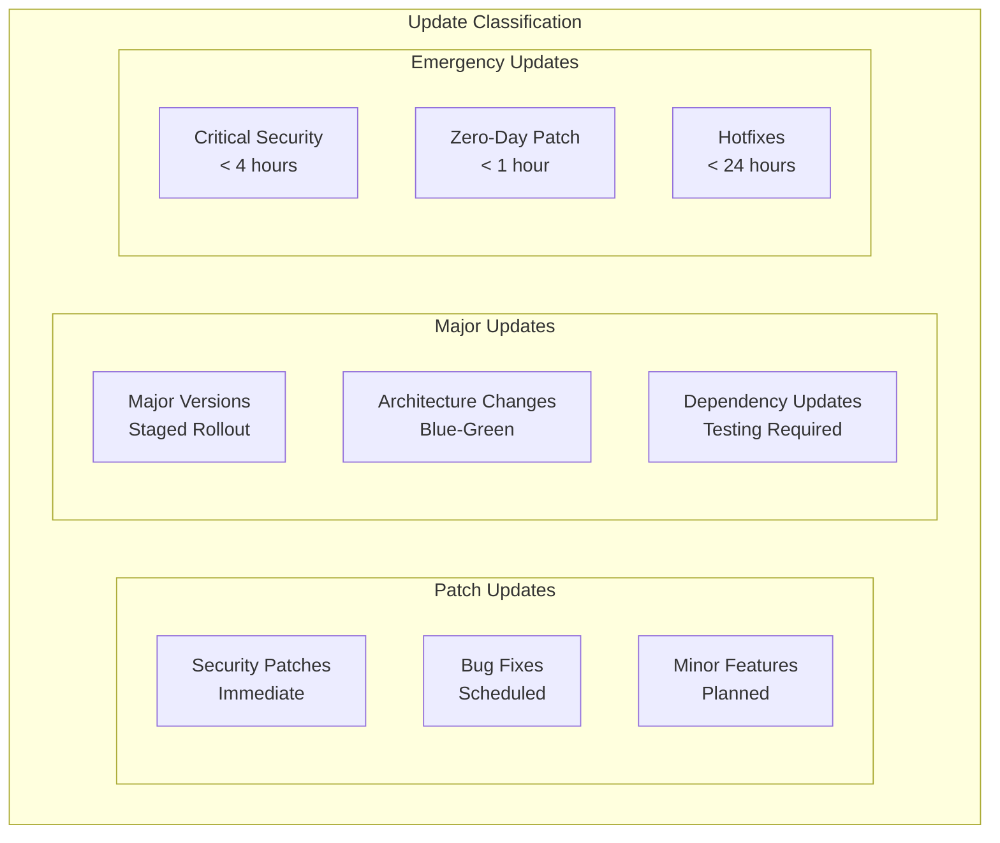
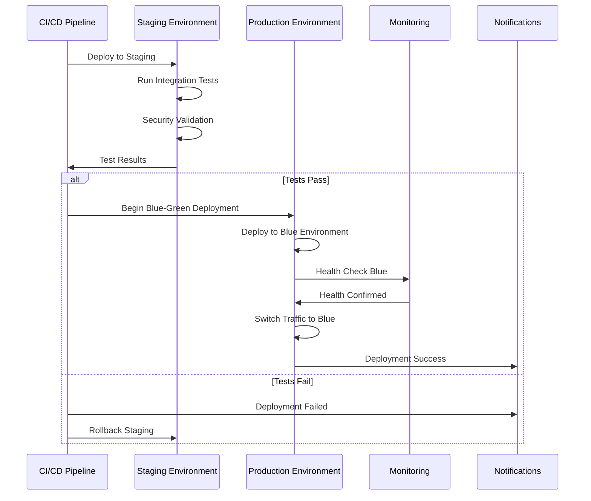
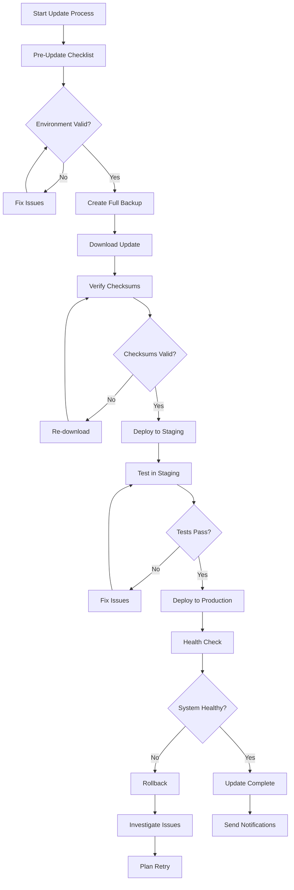
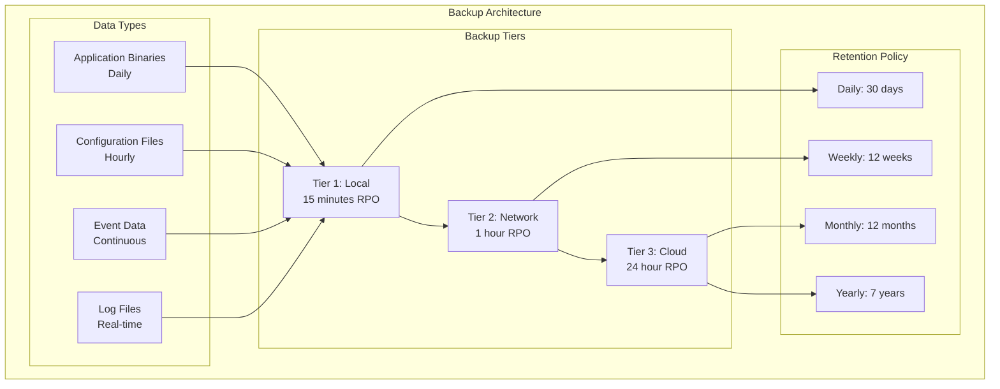
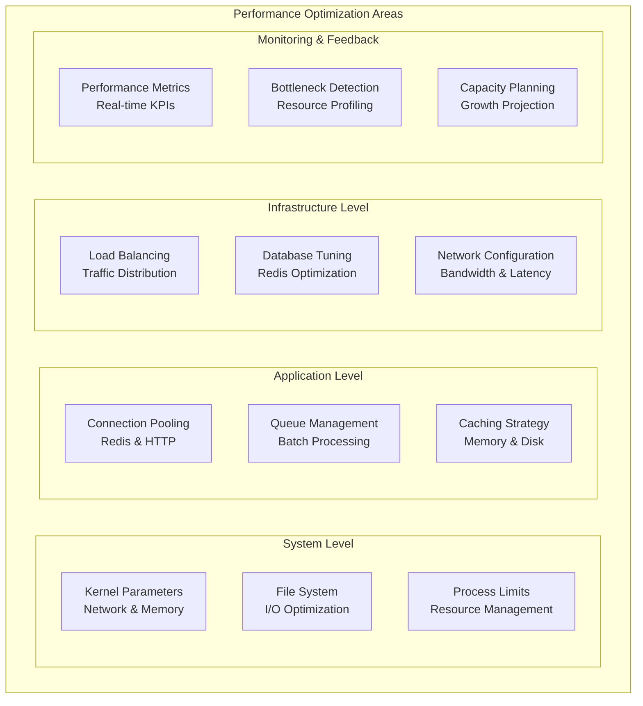
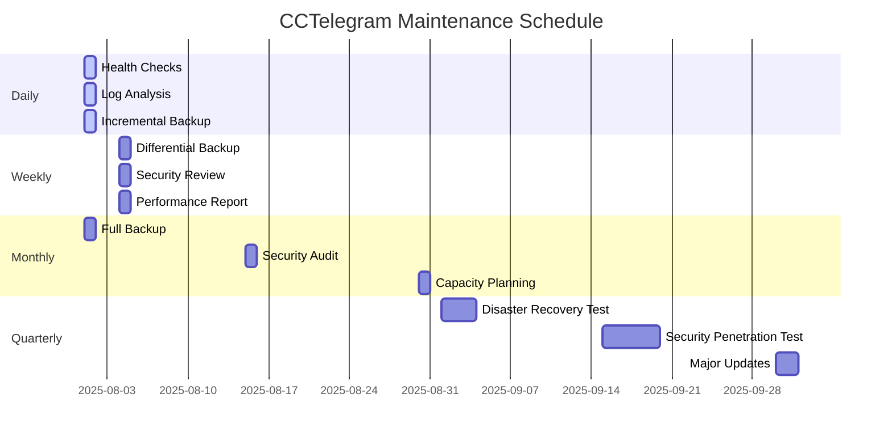

# Maintenance Procedures Guide

**Operational Maintenance with Process Diagrams**

---

## 🎯 Maintenance Overview

This guide covers comprehensive maintenance procedures for CCTelegram, including updates, backups, disaster recovery, log management, and performance tuning. All procedures include visual process diagrams and automation scripts.

## 🔄 Update & Upgrade Procedures

### Update Strategy Matrix



### Automated Update Pipeline



### Update Procedure Scripts

#### Automated Update Script
```bash
#!/bin/bash
# /opt/cctelegram/scripts/automated-update.sh

set -euo pipefail

# Configuration
UPDATE_VERSION="$1"
BACKUP_RETENTION_DAYS=30
HEALTH_CHECK_TIMEOUT=60
ROLLBACK_TIMEOUT=300

# Logging setup
exec 1> >(logger -s -t cctelegram-update)
exec 2> >(logger -s -t cctelegram-update-error)

echo "🚀 Starting CCTelegram automated update to version $UPDATE_VERSION"

# Pre-update validation
validate_environment() {
    echo "📋 Validating environment..."
    
    # Check disk space
    AVAILABLE_SPACE=$(df /opt/cctelegram | awk 'NR==2 {print $4}')
    REQUIRED_SPACE=1048576  # 1GB in KB
    
    if [[ $AVAILABLE_SPACE -lt $REQUIRED_SPACE ]]; then
        echo "❌ Insufficient disk space. Available: ${AVAILABLE_SPACE}KB, Required: ${REQUIRED_SPACE}KB"
        exit 1
    fi
    
    # Verify services are running
    systemctl is-active --quiet cctelegram-bridge || {
        echo "❌ CCTelegram Bridge is not running"
        exit 1
    }
    
    # Check database connectivity
    redis-cli -h localhost -p 6379 ping > /dev/null || {
        echo "❌ Cannot connect to Redis"
        exit 1
    }
    
    echo "✅ Environment validation passed"
}

# Create comprehensive backup
create_backup() {
    echo "💾 Creating backup..."
    
    BACKUP_DIR="/var/backups/cctelegram/$(date +%Y%m%d_%H%M%S)_v${UPDATE_VERSION}"
    mkdir -p "$BACKUP_DIR"
    
    # Backup application files
    tar -czf "$BACKUP_DIR/application.tar.gz" -C /opt/cctelegram .
    
    # Backup configuration
    tar -czf "$BACKUP_DIR/config.tar.gz" -C /etc/cctelegram .
    
    # Backup data
    tar -czf "$BACKUP_DIR/data.tar.gz" -C /var/lib/cctelegram .
    
    # Backup Redis data
    redis-cli -h localhost -p 6379 BGSAVE
    sleep 5
    cp /var/lib/redis/dump.rdb "$BACKUP_DIR/redis.rdb"
    
    # Create backup manifest
    cat > "$BACKUP_DIR/manifest.json" << EOF
{
    "timestamp": "$(date -u +%Y-%m-%dT%H:%M:%SZ)",
    "version_from": "$(cat /opt/cctelegram/VERSION 2>/dev/null || echo "unknown")",
    "version_to": "$UPDATE_VERSION",
    "backup_type": "full",
    "files": {
        "application": "application.tar.gz",
        "config": "config.tar.gz", 
        "data": "data.tar.gz",
        "redis": "redis.rdb"
    }
}
EOF
    
    echo "✅ Backup created: $BACKUP_DIR"
    echo "$BACKUP_DIR" > /tmp/cctelegram_backup_path
}

# Download and verify update
download_update() {
    echo "⬇️ Downloading update version $UPDATE_VERSION..."
    
    local temp_dir="/tmp/cctelegram_update_$$"
    mkdir -p "$temp_dir"
    
    # Download release
    wget -O "$temp_dir/cctelegram-bridge-$UPDATE_VERSION" \
         "https://releases.github.com/cctelegram/v$UPDATE_VERSION/cctelegram-bridge-linux-x64"
    
    wget -O "$temp_dir/cctelegram-mcp-$UPDATE_VERSION.tar.gz" \
         "https://releases.github.com/cctelegram/v$UPDATE_VERSION/cctelegram-mcp.tar.gz"
    
    # Download checksums
    wget -O "$temp_dir/checksums.sha256" \
         "https://releases.github.com/cctelegram/v$UPDATE_VERSION/checksums.sha256"
    
    # Verify checksums
    cd "$temp_dir"
    sha256sum -c checksums.sha256 || {
        echo "❌ Checksum verification failed"
        rm -rf "$temp_dir"
        exit 1
    }
    
    echo "✅ Download and verification completed"
    echo "$temp_dir" > /tmp/cctelegram_temp_dir
}

# Blue-green deployment
deploy_update() {
    echo "🔄 Deploying update using blue-green strategy..."
    
    local temp_dir=$(cat /tmp/cctelegram_temp_dir)
    local backup_dir=$(cat /tmp/cctelegram_backup_path)
    
    # Stop services
    echo "Stopping services..."
    systemctl stop cctelegram-mcp
    systemctl stop cctelegram-bridge
    
    # Deploy Rust Bridge
    echo "Deploying Rust Bridge..."
    chmod +x "$temp_dir/cctelegram-bridge-$UPDATE_VERSION"
    cp "$temp_dir/cctelegram-bridge-$UPDATE_VERSION" /opt/cctelegram/bin/cctelegram-bridge
    chown cctelegram:cctelegram /opt/cctelegram/bin/cctelegram-bridge
    
    # Deploy MCP Server
    echo "Deploying MCP Server..."
    cd /opt/cctelegram/mcp-server
    tar -xzf "$temp_dir/cctelegram-mcp-$UPDATE_VERSION.tar.gz"
    npm ci --production
    
    # Update version file
    echo "$UPDATE_VERSION" > /opt/cctelegram/VERSION
    
    # Start services
    echo "Starting services..."
    systemctl start cctelegram-mcp
    sleep 10
    systemctl start cctelegram-bridge
    
    echo "✅ Deployment completed"
}

# Health check and verification
verify_deployment() {
    echo "🏥 Verifying deployment health..."
    
    local max_attempts=30
    local attempt=0
    
    while [[ $attempt -lt $max_attempts ]]; do
        if curl -f -s http://localhost:8080/health > /dev/null; then
            echo "✅ Health check passed"
            break
        else
            echo "⏳ Health check attempt $((attempt + 1))/$max_attempts..."
            sleep 2
            ((attempt++))
        fi
    done
    
    if [[ $attempt -eq $max_attempts ]]; then
        echo "❌ Health check failed after $max_attempts attempts"
        return 1
    fi
    
    # Verify version
    local actual_version=$(curl -s http://localhost:8080/health | jq -r '.version')
    if [[ "$actual_version" != "$UPDATE_VERSION" ]]; then
        echo "❌ Version mismatch. Expected: $UPDATE_VERSION, Actual: $actual_version"
        return 1
    fi
    
    # Test basic functionality
    echo "Testing basic functionality..."
    local test_event='{
        "type": "info_notification",
        "title": "Update Test",
        "description": "Testing system after update",
        "source": "maintenance-script"
    }'
    
    curl -X POST http://localhost:3000/mcp/send_telegram_message \
         -H "Content-Type: application/json" \
         -d "$test_event" > /dev/null || {
        echo "❌ Functionality test failed"
        return 1
    }
    
    echo "✅ Deployment verification successful"
}

# Rollback procedure
rollback() {
    echo "🔄 Initiating rollback..."
    
    local backup_dir=$(cat /tmp/cctelegram_backup_path)
    
    # Stop services
    systemctl stop cctelegram-bridge
    systemctl stop cctelegram-mcp
    
    # Restore application
    tar -xzf "$backup_dir/application.tar.gz" -C /opt/cctelegram
    
    # Restore configuration
    tar -xzf "$backup_dir/config.tar.gz" -C /etc/cctelegram
    
    # Restore data
    tar -xzf "$backup_dir/data.tar.gz" -C /var/lib/cctelegram
    
    # Restore Redis data
    systemctl stop redis
    cp "$backup_dir/redis.rdb" /var/lib/redis/dump.rdb
    chown redis:redis /var/lib/redis/dump.rdb
    systemctl start redis
    
    # Start services
    systemctl start cctelegram-mcp
    systemctl start cctelegram-bridge
    
    echo "✅ Rollback completed"
}

# Cleanup
cleanup() {
    echo "🧹 Cleaning up..."
    
    # Remove temporary files
    local temp_dir=$(cat /tmp/cctelegram_temp_dir 2>/dev/null || echo "")
    if [[ -n "$temp_dir" && -d "$temp_dir" ]]; then
        rm -rf "$temp_dir"
    fi
    
    rm -f /tmp/cctelegram_temp_dir /tmp/cctelegram_backup_path
    
    # Clean old backups
    find /var/backups/cctelegram -type d -mtime +$BACKUP_RETENTION_DAYS -exec rm -rf {} + 2>/dev/null || true
    
    echo "✅ Cleanup completed"
}

# Main update process
main() {
    trap cleanup EXIT
    trap 'echo "❌ Update failed, initiating rollback..."; rollback; exit 1' ERR
    
    validate_environment
    create_backup
    download_update
    deploy_update
    
    if verify_deployment; then
        echo "🎉 Update completed successfully!"
        echo "Version: $UPDATE_VERSION"
        echo "Backup: $(cat /tmp/cctelegram_backup_path)"
        
        # Send success notification
        curl -X POST http://localhost:8080/webhook/update-success \
             -H "Content-Type: application/json" \
             -d "{\"version\":\"$UPDATE_VERSION\",\"timestamp\":\"$(date -u +%Y-%m-%dT%H:%M:%SZ)\"}" \
             || echo "Warning: Could not send success notification"
    else
        echo "❌ Update verification failed, rolling back..."
        rollback
        exit 1
    fi
}

# Input validation
if [[ $# -ne 1 ]]; then
    echo "Usage: $0 <version>"
    echo "Example: $0 0.8.6"
    exit 1
fi

if [[ ! "$UPDATE_VERSION" =~ ^[0-9]+\.[0-9]+\.[0-9]+$ ]]; then
    echo "Invalid version format. Use semantic versioning (e.g., 0.8.6)"
    exit 1
fi

main
```

### Manual Update Checklist



## 💾 Backup & Recovery Procedures

### Backup Strategy



### Backup Automation Script

```bash
#!/bin/bash
# /opt/cctelegram/scripts/backup-system.sh

set -euo pipefail

# Configuration
BACKUP_ROOT="/var/backups/cctelegram"
BACKUP_TYPES=("incremental" "differential" "full")
RETENTION_DAYS=(7 30 365)  # incremental, differential, full
COMPRESSION_LEVEL=6
ENCRYPTION_KEY="/etc/cctelegram/backup-key.gpg"

# Logging
exec 1> >(logger -s -t cctelegram-backup)
exec 2> >(logger -s -t cctelegram-backup-error)

create_backup() {
    local backup_type="$1"
    local timestamp=$(date +%Y%m%d_%H%M%S)
    local backup_dir="$BACKUP_ROOT/$backup_type/$timestamp"
    
    echo "📦 Creating $backup_type backup: $backup_dir"
    mkdir -p "$backup_dir"
    
    case "$backup_type" in
        "full")
            create_full_backup "$backup_dir"
            ;;
        "incremental")
            create_incremental_backup "$backup_dir"
            ;;
        "differential")
            create_differential_backup "$backup_dir"
            ;;
    esac
    
    # Create backup metadata
    create_backup_manifest "$backup_dir" "$backup_type"
    
    # Encrypt backup
    encrypt_backup "$backup_dir"
    
    # Verify backup integrity
    verify_backup "$backup_dir"
    
    echo "✅ Backup completed: $backup_dir"
}

create_full_backup() {
    local backup_dir="$1"
    
    echo "Creating full system backup..."
    
    # Application files
    tar -czf "$backup_dir/application.tar.gz" \
        -C /opt/cctelegram \
        --exclude="tmp" \
        --exclude="*.log" \
        .
    
    # Configuration files
    tar -czf "$backup_dir/config.tar.gz" \
        -C /etc/cctelegram \
        .
    
    # Data files
    tar -czf "$backup_dir/data.tar.gz" \
        -C /var/lib/cctelegram \
        --exclude="cache" \
        .
    
    # Database backup
    redis-cli -h localhost -p 6379 BGSAVE
    sleep 5
    cp /var/lib/redis/dump.rdb "$backup_dir/redis.rdb"
    
    # System configuration
    tar -czf "$backup_dir/system.tar.gz" \
        /etc/systemd/system/cctelegram* \
        /etc/nginx/sites-available/cctelegram \
        /etc/ssl/certs/cctelegram* \
        2>/dev/null || true
}

create_incremental_backup() {
    local backup_dir="$1"
    local last_backup=$(find "$BACKUP_ROOT" -name "*.manifest" -type f -printf '%T@ %p\n' | sort -n | tail -1 | cut -d' ' -f2-)
    local reference_date=""
    
    if [[ -n "$last_backup" ]]; then
        reference_date=$(stat -c %Y "$last_backup")
        echo "Creating incremental backup since: $(date -d @$reference_date)"
    else
        echo "No previous backup found, creating full backup instead"
        create_full_backup "$backup_dir"
        return
    fi
    
    # Find changed files since last backup
    find /opt/cctelegram -type f -newer "$last_backup" -print0 | \
        tar -czf "$backup_dir/application_incremental.tar.gz" --null -T -
    
    find /etc/cctelegram -type f -newer "$last_backup" -print0 | \
        tar -czf "$backup_dir/config_incremental.tar.gz" --null -T -
    
    find /var/lib/cctelegram -type f -newer "$last_backup" -print0 | \
        tar -czf "$backup_dir/data_incremental.tar.gz" --null -T -
}

create_differential_backup() {
    local backup_dir="$1"
    local last_full_backup=$(find "$BACKUP_ROOT/full" -name "*.manifest" -type f -printf '%T@ %p\n' | sort -n | tail -1 | cut -d' ' -f2-)
    
    if [[ -z "$last_full_backup" ]]; then
        echo "No full backup found, creating full backup instead"
        create_full_backup "$backup_dir"
        return
    fi
    
    echo "Creating differential backup since last full backup"
    
    # Find changed files since last full backup
    find /opt/cctelegram -type f -newer "$last_full_backup" -print0 | \
        tar -czf "$backup_dir/application_differential.tar.gz" --null -T -
    
    find /etc/cctelegram -type f -newer "$last_full_backup" -print0 | \
        tar -czf "$backup_dir/config_differential.tar.gz" --null -T -
    
    find /var/lib/cctelegram -type f -newer "$last_full_backup" -print0 | \
        tar -czf "$backup_dir/data_differential.tar.gz" --null -T -
}

create_backup_manifest() {
    local backup_dir="$1"
    local backup_type="$2"
    
    cat > "$backup_dir/manifest.json" << EOF
{
    "timestamp": "$(date -u +%Y-%m-%dT%H:%M:%SZ)",
    "backup_type": "$backup_type",
    "version": "$(cat /opt/cctelegram/VERSION 2>/dev/null || echo "unknown")",
    "hostname": "$(hostname)",
    "files": $(find "$backup_dir" -name "*.tar.gz" -o -name "*.rdb" | jq -R -s -c 'split("\n")[:-1]'),
    "checksums": {}
}
EOF
    
    # Calculate checksums
    for file in "$backup_dir"/*.{tar.gz,rdb} 2>/dev/null; do
        if [[ -f "$file" ]]; then
            local basename=$(basename "$file")
            local checksum=$(sha256sum "$file" | cut -d' ' -f1)
            echo "Checksum for $basename: $checksum"
            
            # Update manifest with checksum
            jq ".checksums[\"$basename\"] = \"$checksum\"" "$backup_dir/manifest.json" > "$backup_dir/manifest.tmp"
            mv "$backup_dir/manifest.tmp" "$backup_dir/manifest.json"
        fi
    done
}

encrypt_backup() {
    local backup_dir="$1"
    
    if [[ ! -f "$ENCRYPTION_KEY" ]]; then
        echo "⚠️ Backup encryption key not found, skipping encryption"
        return
    fi
    
    echo "🔐 Encrypting backup files..."
    
    for file in "$backup_dir"/*.{tar.gz,rdb,json} 2>/dev/null; do
        if [[ -f "$file" ]]; then
            gpg --quiet --batch --cipher-algo AES256 --compress-algo 1 --symmetric \
                --output "$file.gpg" --passphrase-file "$ENCRYPTION_KEY" "$file"
            rm "$file"  # Remove unencrypted file
        fi
    done
}

verify_backup() {
    local backup_dir="$1"
    
    echo "🔍 Verifying backup integrity..."
    
    # Verify encrypted files can be decrypted
    for file in "$backup_dir"/*.gpg 2>/dev/null; do
        if [[ -f "$file" ]]; then
            local original_name="${file%.gpg}"
            if ! gpg --quiet --batch --decrypt --passphrase-file "$ENCRYPTION_KEY" "$file" > /tmp/verify_test 2>/dev/null; then
                echo "❌ Failed to decrypt: $file"
                return 1
            fi
            rm -f /tmp/verify_test
        fi
    done
    
    echo "✅ Backup integrity verified"
}

cleanup_old_backups() {
    local backup_type="$1"
    local retention_days="$2"
    
    echo "🧹 Cleaning up old $backup_type backups (older than $retention_days days)..."
    
    find "$BACKUP_ROOT/$backup_type" -type d -mtime +$retention_days -exec rm -rf {} + 2>/dev/null || true
    
    local remaining=$(find "$BACKUP_ROOT/$backup_type" -type d -mindepth 1 | wc -l)
    echo "Remaining $backup_type backups: $remaining"
}

# Backup scheduling logic
case "${1:-schedule}" in
    "full")
        create_backup "full"
        cleanup_old_backups "full" 365
        ;;
    "differential")
        create_backup "differential" 
        cleanup_old_backups "differential" 30
        ;;
    "incremental")
        create_backup "incremental"
        cleanup_old_backups "incremental" 7
        ;;
    "schedule")
        # Automated scheduling based on time
        hour=$(date +%H)
        day=$(date +%u)  # 1=Monday, 7=Sunday
        
        if [[ $day -eq 7 && $hour -eq 2 ]]; then
            # Weekly full backup on Sunday at 2 AM
            create_backup "full"
            cleanup_old_backups "full" 365
        elif [[ $hour -eq 3 ]]; then
            # Daily differential backup at 3 AM
            create_backup "differential"
            cleanup_old_backups "differential" 30
        elif [[ $((hour % 4)) -eq 0 ]]; then
            # Incremental backup every 4 hours
            create_backup "incremental"
            cleanup_old_backups "incremental" 7
        fi
        ;;
    *)
        echo "Usage: $0 {full|differential|incremental|schedule}"
        exit 1
        ;;
esac
```

### Disaster Recovery Procedures

#### Recovery Time Objectives (RTO)

| Scenario | RTO Target | Recovery Steps | Verification |
|----------|-----------|---------------|--------------|
| **Service Failure** | < 5 minutes | Restart services | Health check |
| **Configuration Corruption** | < 15 minutes | Restore config, restart | Function test |
| **Data Loss** | < 30 minutes | Restore from backup | Data integrity |
| **Full System Failure** | < 2 hours | Full system restore | Complete testing |
| **Disaster (Site Loss)** | < 8 hours | Remote site activation | Business continuity |

#### Disaster Recovery Script

```bash
#!/bin/bash
# /opt/cctelegram/scripts/disaster-recovery.sh

set -euo pipefail

RECOVERY_TYPE="$1"
BACKUP_LOCATION="${2:-/var/backups/cctelegram}"

echo "🚨 Initiating disaster recovery: $RECOVERY_TYPE"

case "$RECOVERY_TYPE" in
    "service")
        echo "🔄 Service recovery..."
        systemctl stop cctelegram-bridge cctelegram-mcp
        sleep 5
        systemctl start redis
        sleep 10
        systemctl start cctelegram-mcp
        sleep 10
        systemctl start cctelegram-bridge
        
        # Verify services
        timeout 60 bash -c 'until curl -f http://localhost:8080/health; do sleep 2; done'
        echo "✅ Service recovery completed"
        ;;
        
    "configuration")
        echo "⚙️ Configuration recovery..."
        
        # Find latest config backup
        LATEST_CONFIG=$(find "$BACKUP_LOCATION" -name "config*.tar.gz.gpg" -type f -printf '%T@ %p\n' | sort -n | tail -1 | cut -d' ' -f2-)
        
        if [[ -z "$LATEST_CONFIG" ]]; then
            echo "❌ No configuration backup found"
            exit 1
        fi
        
        echo "Restoring from: $LATEST_CONFIG"
        
        # Stop services
        systemctl stop cctelegram-bridge cctelegram-mcp
        
        # Backup current config
        mv /etc/cctelegram /etc/cctelegram.broken.$(date +%s)
        mkdir -p /etc/cctelegram
        
        # Restore configuration
        gpg --quiet --batch --decrypt --passphrase-file /etc/cctelegram/backup-key.gpg "$LATEST_CONFIG" | \
            tar -xzf - -C /etc/cctelegram
        
        # Restart services
        systemctl start cctelegram-mcp
        systemctl start cctelegram-bridge
        
        echo "✅ Configuration recovery completed"
        ;;
        
    "full")
        echo "💿 Full system recovery..."
        
        # This is a complete disaster recovery
        # Find latest full backup
        LATEST_FULL=$(find "$BACKUP_LOCATION/full" -name "manifest.json.gpg" -type f -printf '%T@ %p\n' | sort -n | tail -1 | cut -d' ' -f2-)
        
        if [[ -z "$LATEST_FULL" ]]; then
            echo "❌ No full backup found"
            exit 1
        fi
        
        BACKUP_DIR=$(dirname "$LATEST_FULL")
        echo "Restoring from full backup: $BACKUP_DIR"
        
        # Stop all services
        systemctl stop cctelegram-bridge cctelegram-mcp redis nginx
        
        # Restore all components
        echo "Restoring application..."
        rm -rf /opt/cctelegram/*
        gpg --quiet --batch --decrypt --passphrase-file /etc/cctelegram/backup-key.gpg \
            "$BACKUP_DIR/application.tar.gz.gpg" | tar -xzf - -C /opt/cctelegram
        
        echo "Restoring configuration..."
        rm -rf /etc/cctelegram/*
        gpg --quiet --batch --decrypt --passphrase-file /etc/cctelegram/backup-key.gpg \
            "$BACKUP_DIR/config.tar.gz.gpg" | tar -xzf - -C /etc/cctelegram
        
        echo "Restoring data..."
        rm -rf /var/lib/cctelegram/*
        gpg --quiet --batch --decrypt --passphrase-file /etc/cctelegram/backup-key.gpg \
            "$BACKUP_DIR/data.tar.gz.gpg" | tar -xzf - -C /var/lib/cctelegram
        
        echo "Restoring database..."
        systemctl stop redis
        gpg --quiet --batch --decrypt --passphrase-file /etc/cctelegram/backup-key.gpg \
            "$BACKUP_DIR/redis.rdb.gpg" > /var/lib/redis/dump.rdb
        chown redis:redis /var/lib/redis/dump.rdb
        
        # Start services in order
        systemctl start redis
        sleep 10
        systemctl start cctelegram-mcp
        sleep 10
        systemctl start cctelegram-bridge
        systemctl start nginx
        
        echo "✅ Full system recovery completed"
        ;;
        
    *)
        echo "Usage: $0 {service|configuration|full} [backup_location]"
        exit 1
        ;;
esac

# Post-recovery verification
echo "🔍 Running post-recovery verification..."

# Health check
if curl -f -s http://localhost:8080/health > /dev/null; then
    echo "✅ Health check passed"
else
    echo "❌ Health check failed"
    exit 1
fi

# Function test
TEST_EVENT='{
    "type": "info_notification",
    "title": "Recovery Test",
    "description": "System recovery verification test",
    "source": "disaster-recovery-script"
}'

if curl -X POST http://localhost:3000/mcp/send_telegram_message \
        -H "Content-Type: application/json" \
        -d "$TEST_EVENT" > /dev/null 2>&1; then
    echo "✅ Function test passed"
else
    echo "⚠️ Function test failed - system may have limited functionality"
fi

echo "🎉 Disaster recovery completed successfully!"
```

## 📝 Log Management

### Log Rotation Configuration

```bash
# /etc/logrotate.d/cctelegram
/var/log/cctelegram/*.log {
    daily
    rotate 90
    compress
    delaycompress
    missingok
    notifempty
    create 640 cctelegram cctelegram
    
    postrotate
        # Signal applications to reopen log files
        systemctl reload cctelegram-bridge
        systemctl reload cctelegram-mcp
        
        # Archive old logs to backup storage
        find /var/log/cctelegram -name "*.log.*.gz" -mtime +7 -exec \
            cp {} /var/backups/cctelegram/logs/ \; -exec rm {} \;
    endscript
}

/var/log/cctelegram/security/*.log {
    daily
    rotate 365  # Keep security logs for 1 year
    compress
    delaycompress
    missingok
    notifempty
    create 600 cctelegram cctelegram  # Stricter permissions for security logs
    
    postrotate
        # Security logs require special handling
        systemctl reload cctelegram-bridge
        
        # Encrypt archived security logs
        find /var/log/cctelegram/security -name "*.log.*.gz" -mtime +1 -exec \
            gpg --quiet --batch --cipher-algo AES256 --symmetric \
                --passphrase-file /etc/cctelegram/backup-key.gpg \
                --output {}.gpg {} \; -exec rm {} \;
    endscript
}
```

### Log Analysis Automation

```bash
#!/bin/bash
# /opt/cctelegram/scripts/log-analysis.sh

# Daily log analysis and reporting
ANALYSIS_DATE="${1:-$(date -d yesterday +%Y-%m-%d)}"
REPORT_DIR="/var/log/cctelegram/reports"
mkdir -p "$REPORT_DIR"

echo "📊 Analyzing logs for $ANALYSIS_DATE"

# Error analysis
echo "=== Error Analysis ===" > "$REPORT_DIR/daily-$ANALYSIS_DATE.txt"
journalctl -u cctelegram-* --since "$ANALYSIS_DATE 00:00:00" --until "$ANALYSIS_DATE 23:59:59" | \
    grep -E "(ERROR|CRITICAL|FATAL)" | \
    awk '{print $0}' | \
    sort | uniq -c | sort -nr >> "$REPORT_DIR/daily-$ANALYSIS_DATE.txt"

# Performance metrics
echo -e "\n=== Performance Summary ===" >> "$REPORT_DIR/daily-$ANALYSIS_DATE.txt"
journalctl -u cctelegram-bridge --since "$ANALYSIS_DATE 00:00:00" --until "$ANALYSIS_DATE 23:59:59" | \
    grep "duration=" | \
    sed 's/.*duration=\([0-9.]*\)ms.*/\1/' | \
    awk '{
        sum += $1
        count++
        if ($1 > max) max = $1
        if (min == "" || $1 < min) min = $1
    }
    END {
        if (count > 0) {
            printf "Messages processed: %d\n", count
            printf "Average duration: %.2f ms\n", sum/count
            printf "Min duration: %.2f ms\n", min
            printf "Max duration: %.2f ms\n", max
        }
    }' >> "$REPORT_DIR/daily-$ANALYSIS_DATE.txt"

# Security events
echo -e "\n=== Security Events ===" >> "$REPORT_DIR/daily-$ANALYSIS_DATE.txt"
journalctl -u cctelegram-* --since "$ANALYSIS_DATE 00:00:00" --until "$ANALYSIS_DATE 23:59:59" | \
    grep -E "(authentication|authorization|security)" | \
    wc -l | \
    awk '{printf "Security events: %d\n", $1}' >> "$REPORT_DIR/daily-$ANALYSIS_DATE.txt"

echo "✅ Log analysis completed: $REPORT_DIR/daily-$ANALYSIS_DATE.txt"
```

## ⚡ Performance Tuning

### System Performance Optimization



### Performance Tuning Script

```bash
#!/bin/bash
# /opt/cctelegram/scripts/performance-tuning.sh

set -euo pipefail

echo "⚡ Applying CCTelegram performance optimizations..."

# System kernel parameters
apply_kernel_tuning() {
    echo "🔧 Applying kernel tuning..."
    
    cat > /etc/sysctl.d/99-cctelegram-performance.conf << EOF
# Network performance
net.core.rmem_max = 134217728
net.core.wmem_max = 134217728
net.ipv4.tcp_rmem = 4096 65536 134217728
net.ipv4.tcp_wmem = 4096 65536 134217728
net.core.netdev_max_backlog = 5000
net.ipv4.tcp_congestion_control = bbr

# Memory management
vm.swappiness = 10
vm.dirty_ratio = 15
vm.dirty_background_ratio = 5
vm.vfs_cache_pressure = 50

# File system performance
fs.file-max = 2097152
fs.nr_open = 1048576

# Redis-specific optimizations
vm.overcommit_memory = 1
net.core.somaxconn = 65535
EOF
    
    sysctl -p /etc/sysctl.d/99-cctelegram-performance.conf
    echo "✅ Kernel tuning applied"
}

# Application-level optimizations
apply_application_tuning() {
    echo "🚀 Applying application tuning..."
    
    # Update CCTelegram configuration for performance
    cat > /etc/cctelegram/performance.toml << EOF
[performance]
worker_threads = $(nproc)
queue_size = 10000
batch_size = 50
connection_pool_size = 20
keep_alive_timeout = 300

[redis]
max_connections = 100
connection_timeout = 5
command_timeout = 10
retry_attempts = 3

[monitoring]
metrics_interval = 10
health_check_interval = 30
performance_logging = true
EOF
    
    echo "✅ Application tuning applied"
}

# Redis optimization
optimize_redis() {
    echo "🗄️ Optimizing Redis configuration..."
    
    # Backup existing Redis config
    cp /etc/redis/redis.conf /etc/redis/redis.conf.backup.$(date +%s)
    
    # Apply Redis optimizations
    cat >> /etc/redis/redis.conf << EOF

# CCTelegram Performance Optimizations
maxmemory-policy allkeys-lru
maxmemory 1gb
tcp-keepalive 300
timeout 300
tcp-backlog 511

# Persistence optimization
save 900 1
save 300 10
save 60 10000
stop-writes-on-bgsave-error yes
rdbcompression yes

# Network optimization
tcp-nodelay yes
EOF
    
    systemctl restart redis
    echo "✅ Redis optimization applied"
}

# File system optimization
optimize_filesystem() {
    echo "💾 Applying filesystem optimizations..."
    
    # Optimize mount options for CCTelegram directories
    if ! grep -q "/var/lib/cctelegram" /etc/fstab; then
        echo "Adding optimized mount options for CCTelegram data directory"
        # This is informational - actual mount optimization requires manual intervention
        echo "# Recommended mount options for CCTelegram data:"
        echo "# /dev/sdb1 /var/lib/cctelegram ext4 defaults,noatime,data=ordered 0 2"
    fi
    
    # Set optimal I/O scheduler for SSD
    for disk in $(lsblk -d -o NAME | grep -v NAME); do
        if [[ -f "/sys/block/$disk/queue/scheduler" ]]; then
            echo "mq-deadline" > "/sys/block/$disk/queue/scheduler" 2>/dev/null || true
        fi
    done
    
    echo "✅ Filesystem optimization applied"
}

# Process and resource limits
configure_limits() {
    echo "📊 Configuring resource limits..."
    
    cat > /etc/security/limits.d/cctelegram-performance.conf << EOF
# CCTelegram Performance Limits
cctelegram soft nproc 65536
cctelegram hard nproc 65536
cctelegram soft nofile 1048576
cctelegram hard nofile 1048576
cctelegram soft memlock unlimited
cctelegram hard memlock unlimited

# Root limits (for administration)
root soft nproc 65536
root hard nproc 65536
root soft nofile 1048576
root hard nofile 1048576
EOF
    
    # Update systemd service limits
    mkdir -p /etc/systemd/system/cctelegram-bridge.service.d
    cat > /etc/systemd/system/cctelegram-bridge.service.d/performance.conf << EOF
[Service]
LimitNOFILE=1048576
LimitNPROC=65536
LimitMEMLOCK=infinity
EOF
    
    systemctl daemon-reload
    echo "✅ Resource limits configured"
}

# Network optimization
optimize_network() {
    echo "🌐 Applying network optimizations..."
    
    # TCP buffer sizes
    echo 'net.ipv4.tcp_window_scaling = 1' >> /etc/sysctl.d/99-cctelegram-performance.conf
    echo 'net.ipv4.tcp_timestamps = 1' >> /etc/sysctl.d/99-cctelegram-performance.conf
    echo 'net.ipv4.tcp_sack = 1' >> /etc/sysctl.d/99-cctelegram-performance.conf
    
    # Connection handling
    echo 'net.ipv4.tcp_fin_timeout = 15' >> /etc/sysctl.d/99-cctelegram-performance.conf
    echo 'net.ipv4.tcp_tw_reuse = 1' >> /etc/sysctl.d/99-cctelegram-performance.conf
    echo 'net.ipv4.ip_local_port_range = 32768 65535' >> /etc/sysctl.d/99-cctelegram-performance.conf
    
    sysctl -p /etc/sysctl.d/99-cctelegram-performance.conf
    echo "✅ Network optimization applied"
}

# Performance monitoring setup
setup_performance_monitoring() {
    echo "📈 Setting up performance monitoring..."
    
    # Create performance monitoring script
    cat > /opt/cctelegram/scripts/performance-monitor.sh << 'EOF'
#!/bin/bash
# Real-time performance monitoring

METRICS_FILE="/var/log/cctelegram/performance-$(date +%Y%m%d).log"

while true; do
    TIMESTAMP=$(date -u +%Y-%m-%dT%H:%M:%SZ)
    
    # System metrics
    CPU_USAGE=$(top -bn1 | grep "Cpu(s)" | awk '{print $2}' | sed 's/%us,//')
    MEMORY_USAGE=$(free | grep Mem | awk '{printf "%.2f", ($3/$2) * 100.0}')
    DISK_USAGE=$(df /var/lib/cctelegram | awk 'NR==2 {printf "%.2f", ($3/$2) * 100.0}')
    
    # Application metrics
    QUEUE_DEPTH=$(curl -s http://localhost:8080/metrics | grep cctelegram_queue_depth | awk '{print $2}')
    MESSAGE_RATE=$(curl -s http://localhost:8080/metrics | grep cctelegram_messages_total | awk '{print $2}')
    
    # Log metrics
    echo "$TIMESTAMP,CPU:$CPU_USAGE,MEM:$MEMORY_USAGE,DISK:$DISK_USAGE,QUEUE:$QUEUE_DEPTH,RATE:$MESSAGE_RATE" >> "$METRICS_FILE"
    
    sleep 60
done
EOF
    
    chmod +x /opt/cctelegram/scripts/performance-monitor.sh
    
    # Create systemd service for performance monitoring
    cat > /etc/systemd/system/cctelegram-performance-monitor.service << EOF
[Unit]
Description=CCTelegram Performance Monitor
After=cctelegram-bridge.service
Requires=cctelegram-bridge.service

[Service]
Type=simple
User=cctelegram
Group=cctelegram
ExecStart=/opt/cctelegram/scripts/performance-monitor.sh
Restart=always
RestartSec=10

[Install]
WantedBy=multi-user.target
EOF
    
    systemctl enable cctelegram-performance-monitor
    systemctl start cctelegram-performance-monitor
    
    echo "✅ Performance monitoring configured"
}

# Main execution
main() {
    case "${1:-all}" in
        "kernel")
            apply_kernel_tuning
            ;;
        "application")
            apply_application_tuning
            ;;
        "redis")
            optimize_redis
            ;;
        "filesystem")
            optimize_filesystem
            ;;
        "limits")
            configure_limits
            ;;
        "network")
            optimize_network
            ;;
        "monitoring")
            setup_performance_monitoring
            ;;
        "all")
            apply_kernel_tuning
            apply_application_tuning
            optimize_redis
            optimize_filesystem
            configure_limits
            optimize_network
            setup_performance_monitoring
            echo "🎉 All performance optimizations applied!"
            echo "Please reboot the system to ensure all changes take effect."
            ;;
        *)
            echo "Usage: $0 {kernel|application|redis|filesystem|limits|network|monitoring|all}"
            exit 1
            ;;
    esac
}

# Check for root privileges
if [[ $EUID -ne 0 ]]; then
   echo "This script must be run as root for system-level optimizations"
   exit 1
fi

main "$@"
```

## 📅 Maintenance Scheduling

### Maintenance Calendar



### Automated Maintenance Scheduler

```bash
#!/bin/bash
# /opt/cctelegram/scripts/maintenance-scheduler.sh

# Install cron jobs for automated maintenance
install_cron_jobs() {
    echo "📅 Installing maintenance cron jobs..."
    
    # Create crontab for cctelegram user
    cat > /tmp/cctelegram-crontab << EOF
# CCTelegram Automated Maintenance Schedule

# Daily maintenance (every day at 2 AM)
0 2 * * * /opt/cctelegram/scripts/daily-health-check.sh
30 2 * * * /opt/cctelegram/scripts/log-analysis.sh
0 3 * * * /opt/cctelegram/scripts/backup-system.sh incremental

# Weekly maintenance (every Sunday)
0 1 * * 0 /opt/cctelegram/scripts/backup-system.sh full
30 1 * * 0 /opt/cctelegram/scripts/daily-security-review.sh
0 4 * * 0 /opt/cctelegram/scripts/performance-report.sh

# Monthly maintenance (first day of month)
0 5 1 * * /opt/cctelegram/scripts/security-audit.sh
30 5 1 * * /opt/cctelegram/scripts/capacity-planning.sh

# Cleanup tasks (every night at midnight)
0 0 * * * find /tmp -name "cctelegram*" -mtime +1 -delete
5 0 * * * find /var/log/cctelegram -name "*.old" -mtime +7 -delete
EOF
    
    crontab -u cctelegram /tmp/cctelegram-crontab
    rm /tmp/cctelegram-crontab
    
    echo "✅ Cron jobs installed successfully"
}

install_cron_jobs
```

---

**Summary**: This maintenance guide provides comprehensive procedures for CCTelegram operations including automated updates, disaster recovery, performance tuning, and scheduled maintenance. All scripts include error handling, logging, and verification steps to ensure reliable operations.

---

**Next**: Return to [Administration Overview](README.md)  
**Related**: [Deployment Guide](deployment.md) • [Security Guide](security-guide.md) • [Monitoring Guide](monitoring.md)

---

**Last Updated**: August 2025  
**Script Compatibility**: Ubuntu 20.04+, RHEL 8+, CentOS 8+  
**Automation Level**: Fully automated with manual override capabilities