# Monitoring & Observability Guide

**Real-Time Health Monitoring with Visual Dashboards**

---

## 🎯 Monitoring Overview

CCTelegram provides comprehensive monitoring capabilities through integrated health checks, real-time metrics, Prometheus export, and visual dashboards. This guide covers monitoring setup, dashboard configuration, and operational procedures.

## 📊 Monitoring Architecture

### Real-Time Monitoring Stack


### Data Flow and Correlation


## 🔍 Health Monitoring System

### Health Check Endpoints

#### Bridge Health Check
```bash
# Primary health endpoint
curl -X GET http://localhost:8080/health

# Response format
{
  "status": "healthy",
  "timestamp": "2025-08-07T10:30:00Z",
  "version": "0.8.5",
  "components": {
    "telegram_api": {
      "status": "healthy",
      "response_time_ms": 45,
      "last_check": "2025-08-07T10:29:50Z"
    },
    "redis_connection": {
      "status": "healthy",
      "connection_pool": "8/10",
      "last_check": "2025-08-07T10:29:55Z"
    },
    "message_queue": {
      "status": "healthy", 
      "queue_depth": 23,
      "processing_rate": "15.2/sec",
      "last_check": "2025-08-07T10:30:00Z"
    },
    "file_system": {
      "status": "healthy",
      "disk_usage": "45%",
      "events_dir": "/var/lib/cctelegram/events",
      "last_check": "2025-08-07T10:30:00Z"
    }
  },
  "metrics": {
    "uptime_seconds": 86400,
    "memory_usage_mb": 128,
    "cpu_usage_percent": 12.5,
    "active_connections": 3,
    "messages_processed_total": 1542
  }
}
```

#### MCP Server Health Check
```bash
# MCP server health endpoint
curl -X GET http://localhost:3000/health

# Response format
{
  "status": "healthy",
  "timestamp": "2025-08-07T10:30:00Z", 
  "version": "1.8.5",
  "node_version": "18.17.0",
  "memory": {
    "used_mb": 64,
    "total_mb": 512,
    "usage_percent": 12.5
  },
  "uptime_seconds": 86400,
  "environment": "production"
}
```

### Health Status Definitions

| Status | Description | Action Required |
|--------|-------------|-----------------|
| **Healthy** | All components operational | None - Continue monitoring |
| **Degraded** | Some components experiencing issues | Investigation recommended |
| **Unhealthy** | Critical components failing | Immediate attention required |
| **Critical** | System-wide failure | Emergency response |

### Component Health Indicators

```mermaid
graph TB
    subgraph "Health Status Dashboard"
        subgraph "System Health"
            SH[System Health<br/>🟢 Healthy]
            UT[Uptime<br/>99.9%]
            MU[Memory Usage<br/>128/512 MB]
            CU[CPU Usage<br/>12.5%]
        end
        
        subgraph "Service Health"
            TG[Telegram API<br/>🟢 45ms]
            RD[Redis Connection<br/>🟢 8/10 pool]
            MQ[Message Queue<br/>🟢 23 depth]
            FS[File System<br/>🟢 45% usage]
        end
        
        subgraph "Performance Metrics"
            DR[Delivery Rate<br/>🟢 95.8%]
            RT[Response Time<br/>🟢 156ms avg]
            TP[Throughput<br/>🟢 15.2/sec]
            ER[Error Rate<br/>🟢 0.02%]
        end
    end
```



## 📈 Real-Time Dashboard

### Web Dashboard Interface

The monitoring dashboard provides real-time visibility into system performance and health.

**Access**: `http://localhost:8080/dashboard/`

#### Dashboard Layout


#### Live Charts and Visualizations

**Message Flow Visualization**


### Dashboard Configuration

#### Environment Variables
```bash
# Dashboard configuration
MONITORING_SERVER_PORT=8080
DASHBOARD_UPDATE_INTERVAL=1000  # 1 second
DASHBOARD_HISTORY_MINUTES=60    # 1 hour retention
DASHBOARD_AUTH_ENABLED=true
DASHBOARD_USERNAME=admin
DASHBOARD_PASSWORD=secure_password
```

#### Dashboard Features

**Real-Time Updates**
- Live message flow visualization
- Performance metric charts
- Health status indicators
- Active correlation tracking

**Historical Analysis**
- 1-hour rolling window
- Performance trend analysis
- Error pattern identification
- Capacity utilization tracking

**Interactive Elements**
- Drill-down into specific traces
- Filter by time range and status
- Export metrics data
- Alert acknowledgment

## 📊 Prometheus Integration

### Metrics Collection

#### Custom CCTelegram Metrics

```rust
// Key metrics exported to Prometheus
use prometheus::{Counter, Histogram, Gauge, register_counter, register_histogram, register_gauge};

// Message counters
static MESSAGES_TOTAL: Counter = register_counter!(
    "cctelegram_messages_total",
    "Total number of messages processed"
);

static MESSAGES_DELIVERED: Counter = register_counter!(
    "cctelegram_messages_delivered_total", 
    "Total number of messages successfully delivered"
);

static MESSAGES_FAILED: Counter = register_counter!(
    "cctelegram_messages_failed_total",
    "Total number of messages that failed delivery"
);

// Performance histograms
static MESSAGE_DURATION: Histogram = register_histogram!(
    "cctelegram_message_duration_seconds",
    "Time taken to process and deliver messages"
);

static API_RESPONSE_TIME: Histogram = register_histogram!(
    "cctelegram_telegram_api_response_seconds",
    "Response time for Telegram API calls"
);

// System gauges
static QUEUE_DEPTH: Gauge = register_gauge!(
    "cctelegram_queue_depth",
    "Current number of messages in queue"
);

static ACTIVE_CONNECTIONS: Gauge = register_gauge!(
    "cctelegram_active_connections",
    "Number of active connections"
);

static MEMORY_USAGE: Gauge = register_gauge!(
    "cctelegram_memory_usage_bytes",
    "Current memory usage in bytes"
);
```

#### Metrics Endpoint

```bash
# Prometheus metrics endpoint
curl http://localhost:8080/metrics

# Sample output
# HELP cctelegram_messages_total Total number of messages processed
# TYPE cctelegram_messages_total counter
cctelegram_messages_total 1542

# HELP cctelegram_messages_delivered_total Total number of messages successfully delivered
# TYPE cctelegram_messages_delivered_total counter
cctelegram_messages_delivered_total 1478

# HELP cctelegram_delivery_rate_percent Current message delivery success rate
# TYPE cctelegram_delivery_rate_percent gauge
cctelegram_delivery_rate_percent 95.8

# HELP cctelegram_message_duration_seconds Time taken to process and deliver messages
# TYPE cctelegram_message_duration_seconds histogram
cctelegram_message_duration_seconds_bucket{le="0.1"} 245
cctelegram_message_duration_seconds_bucket{le="0.5"} 1234
cctelegram_message_duration_seconds_bucket{le="1.0"} 1456
cctelegram_message_duration_seconds_bucket{le="5.0"} 1542
cctelegram_message_duration_seconds_bucket{le="+Inf"} 1542
cctelegram_message_duration_seconds_sum 187.45
cctelegram_message_duration_seconds_count 1542

# HELP cctelegram_queue_depth Current number of messages in queue
# TYPE cctelegram_queue_depth gauge
cctelegram_queue_depth 23

# HELP cctelegram_active_correlations Number of active message traces
# TYPE cctelegram_active_correlations gauge
cctelegram_active_correlations 12
```

### Prometheus Configuration

```yaml
# /etc/prometheus/prometheus.yml
global:
  scrape_interval: 15s
  evaluation_interval: 15s

rule_files:
  - "/etc/prometheus/rules/*.yml"

scrape_configs:
  # CCTelegram Bridge metrics
  - job_name: 'cctelegram-bridge'
    static_configs:
      - targets: ['localhost:8080']
    metrics_path: '/metrics'
    scrape_interval: 30s
    scrape_timeout: 10s
    
  # MCP Server metrics (if enabled)
  - job_name: 'cctelegram-mcp'
    static_configs:
      - targets: ['localhost:3000']
    metrics_path: '/metrics'
    scrape_interval: 30s
    
  # System metrics
  - job_name: 'node-exporter'
    static_configs:
      - targets: ['localhost:9100']
      
  # Redis metrics
  - job_name: 'redis-exporter'
    static_configs:
      - targets: ['localhost:9121']

alerting:
  alertmanagers:
    - static_configs:
        - targets:
          - localhost:9093
```

## 📊 Grafana Dashboard Configuration

### Dashboard Import

```json
{
  "dashboard": {
    "id": null,
    "title": "CCTelegram Monitoring",
    "tags": ["cctelegram", "messaging", "monitoring"],
    "timezone": "browser",
    "refresh": "5s",
    "time": {
      "from": "now-1h",
      "to": "now"
    },
    "panels": [
      {
        "title": "Message Delivery Rate",
        "type": "stat",
        "targets": [
          {
            "expr": "cctelegram_delivery_rate_percent",
            "legendFormat": "Delivery Rate %"
          }
        ],
        "fieldConfig": {
          "defaults": {
            "color": {
              "mode": "thresholds"
            },
            "thresholds": {
              "steps": [
                {"color": "red", "value": 0},
                {"color": "yellow", "value": 90},
                {"color": "green", "value": 95}
              ]
            }
          }
        }
      },
      {
        "title": "Messages per Second",
        "type": "graph", 
        "targets": [
          {
            "expr": "rate(cctelegram_messages_total[1m])",
            "legendFormat": "Messages/sec"
          }
        ]
      },
      {
        "title": "Queue Depth",
        "type": "graph",
        "targets": [
          {
            "expr": "cctelegram_queue_depth",
            "legendFormat": "Queue Depth"
          }
        ]
      },
      {
        "title": "Response Time Distribution",
        "type": "heatmap",
        "targets": [
          {
            "expr": "rate(cctelegram_message_duration_seconds_bucket[5m])",
            "legendFormat": "{{le}}"
          }
        ]
      }
    ]
  }
}
```

### Key Dashboard Panels

#### System Overview Panel

```mermaid
graph TB
    subgraph "System Overview Panel"
        subgraph "Status Indicators"
            ST[🟢 System Status<br/>HEALTHY]
            UP[⏱️ Uptime<br/>99.9%]
            VER[📋 Version<br/>v0.9.0]
        end
        
        subgraph "Key Metrics"
            DR[📊 Delivery Rate<br/>95.8%]
            TPS[⚡ Messages/sec<br/>15.2]
            RT[🕐 Avg Response<br/>156ms]
            ER[⚠️ Error Rate<br/>0.02%]
        end
        
        subgraph "Resource Usage"
            CPU[💻 CPU Usage<br/>12.5%]
            MEM[🧠 Memory<br/>128/512 MB]
            DISK[💾 Disk Usage<br/>45%]
            NET[🌐 Network I/O<br/>1.2 MB/s]
        end
    end
```


## 🚨 Alert Configuration

### AlertManager Configuration

```yaml
# /etc/alertmanager/alertmanager.yml
global:
  smtp_smarthost: 'localhost:587'
  smtp_from: 'alerts@yourdomain.com'

route:
  group_by: ['alertname', 'severity']
  group_wait: 30s
  group_interval: 5m
  repeat_interval: 12h
  receiver: 'default'
  routes:
    - match:
        severity: critical
      receiver: 'critical-alerts'
    - match:
        severity: warning  
      receiver: 'warning-alerts'

receivers:
  - name: 'default'
    email_configs:
      - to: 'ops@yourdomain.com'
        subject: 'CCTelegram Alert: {{ .GroupLabels.alertname }}'
        body: |
          {{ range .Alerts }}
          Alert: {{ .Annotations.summary }}
          Description: {{ .Annotations.description }}
          {{ end }}

  - name: 'critical-alerts'
    email_configs:
      - to: 'oncall@yourdomain.com'
        subject: '🚨 CRITICAL: CCTelegram Alert'
        body: |
          CRITICAL ALERT - Immediate attention required
          {{ range .Alerts }}
          Alert: {{ .Annotations.summary }}
          Description: {{ .Annotations.description }}
          Severity: {{ .Labels.severity }}
          {{ end }}
    webhook_configs:
      - url: 'http://localhost:8080/webhook/alert'
        send_resolved: true

  - name: 'warning-alerts'
    email_configs:
      - to: 'team@yourdomain.com'
        subject: '⚠️ Warning: CCTelegram Alert'
```

### Alert Rules

```yaml
# /etc/prometheus/rules/cctelegram.yml
groups:
  - name: cctelegram
    rules:
      # Critical alerts
      - alert: CCTelegramDown
        expr: up{job="cctelegram-bridge"} == 0
        for: 1m
        labels:
          severity: critical
        annotations:
          summary: "CCTelegram Bridge is down"
          description: "CCTelegram Bridge has been down for more than 1 minute"
          
      - alert: LowDeliveryRate
        expr: cctelegram_delivery_rate_percent < 90
        for: 5m
        labels:
          severity: critical
        annotations:
          summary: "Message delivery rate is below 90%"
          description: "Current delivery rate: {{ $value }}%"
          
      - alert: HighErrorRate  
        expr: rate(cctelegram_messages_failed_total[5m]) > 1
        for: 2m
        labels:
          severity: critical
        annotations:
          summary: "High message failure rate"
          description: "More than 1 message per second failing"
          
      # Warning alerts
      - alert: HighQueueDepth
        expr: cctelegram_queue_depth > 500
        for: 5m
        labels:
          severity: warning
        annotations:
          summary: "Message queue depth is high"
          description: "Queue depth: {{ $value }} messages"
          
      - alert: HighMemoryUsage
        expr: cctelegram_memory_usage_bytes / (1024*1024) > 400
        for: 10m
        labels:
          severity: warning
        annotations:
          summary: "High memory usage"
          description: "Memory usage: {{ $value }}MB"
          
      - alert: SlowResponseTime
        expr: histogram_quantile(0.95, cctelegram_message_duration_seconds_bucket) > 2
        for: 5m
        labels:
          severity: warning
        annotations:
          summary: "95th percentile response time is high"
          description: "95th percentile: {{ $value }}s"
```

## 📱 Telegram Alert Integration

### Alert Webhook Handler

```rust
// Webhook handler for sending alerts to Telegram
#[post("/webhook/alert")]
async fn alert_webhook(
    alert_payload: web::Json<AlertPayload>,
    telegram_bot: web::Data<TelegramBot>,
) -> Result<HttpResponse> {
    let alert = alert_payload.into_inner();
    
    // Format alert message
    let message = format!(
        "🚨 *CCTelegram Alert*\n\n\
        *Alert:* {}\n\
        *Severity:* {}\n\
        *Description:* {}\n\
        *Time:* {}\n\n\
        [View Dashboard](http://localhost:8080/dashboard)",
        alert.alert_name,
        alert.severity,
        alert.description,
        alert.timestamp.format("%Y-%m-%d %H:%M:%S")
    );
    
    // Send to admin chat
    telegram_bot.send_message(ADMIN_CHAT_ID, &message).await?;
    
    Ok(HttpResponse::Ok().json(json!({
        "status": "alert_sent",
        "timestamp": Utc::now()
    })))
}
```

### Alert Flow Diagram


## 📈 Performance Analysis

### Key Performance Indicators

#### Delivery Performance
```bash
# Query delivery rate over time
curl -G http://localhost:9090/api/v1/query_range \
  --data-urlencode 'query=cctelegram_delivery_rate_percent' \
  --data-urlencode 'start=2025-08-07T00:00:00Z' \
  --data-urlencode 'end=2025-08-07T23:59:59Z' \
  --data-urlencode 'step=300'

# Response time percentiles
curl -G http://localhost:9090/api/v1/query \
  --data-urlencode 'query=histogram_quantile(0.95, cctelegram_message_duration_seconds_bucket)'
```

#### System Performance
```bash
# CPU and Memory trends
curl -G http://localhost:9090/api/v1/query_range \
  --data-urlencode 'query=process_cpu_seconds_total{job="cctelegram-bridge"}' \
  --data-urlencode 'start=2025-08-07T00:00:00Z' \
  --data-urlencode 'end=2025-08-07T23:59:59Z'

# Queue depth analysis  
curl -G http://localhost:9090/api/v1/query \
  --data-urlencode 'query=avg_over_time(cctelegram_queue_depth[1h])'
```

### Performance Optimization Recommendations

#### Based on Metrics Analysis


## 🔧 Operational Procedures

### Daily Health Check

```bash
#!/bin/bash
# /opt/cctelegram/scripts/daily-health-check.sh

echo "=== CCTelegram Daily Health Check ==="
echo "Date: $(date)"
echo

# Service status
echo "=== Service Status ==="
systemctl status cctelegram-bridge --no-pager
systemctl status cctelegram-mcp --no-pager
echo

# Health endpoints
echo "=== Health Checks ==="
curl -s http://localhost:8080/health | jq '.status, .components'
curl -s http://localhost:3000/health | jq '.status'
echo

# Key metrics
echo "=== Key Metrics ==="
echo "Messages processed (24h): $(curl -s http://localhost:9090/api/v1/query?query=increase(cctelegram_messages_total[24h]) | jq -r '.data.result[0].value[1]')"
echo "Delivery rate: $(curl -s http://localhost:9090/api/v1/query?query=cctelegram_delivery_rate_percent | jq -r '.data.result[0].value[1]')%"
echo "Queue depth: $(curl -s http://localhost:9090/api/v1/query?query=cctelegram_queue_depth | jq -r '.data.result[0].value[1]')"
echo

# Disk usage
echo "=== Disk Usage ==="
df -h /var/lib/cctelegram
df -h /var/log/cctelegram
echo

# Recent errors
echo "=== Recent Errors ==="
journalctl -u cctelegram-bridge --since "24 hours ago" --grep="ERROR|CRITICAL" --no-pager -n 10
```

### Log Analysis

#### Structured Log Query Examples

```bash
# High-volume log analysis with jq
journalctl -u cctelegram-bridge --since "1 hour ago" -o json | \
  jq -r 'select(.MESSAGE | contains("ERROR")) | .MESSAGE'

# Performance analysis
journalctl -u cctelegram-bridge --since "1 day ago" -o json | \
  jq -r 'select(.MESSAGE | contains("duration")) | .MESSAGE' | \
  grep -o 'duration=[0-9.]*ms' | \
  awk -F= '{sum+=$2; count++} END {print "Average duration: " sum/count "ms"}'

# Error rate analysis
journalctl -u cctelegram-bridge --since "1 day ago" -o json | \
  jq -r '.MESSAGE' | \
  awk '/ERROR/{errors++} /INFO/{info++} END {
    total = errors + info
    error_rate = (errors / total) * 100
    printf "Error rate: %.2f%% (%d errors out of %d messages)\n", error_rate, errors, total
  }'
```

### Performance Emergency Response

#### Emergency Runbook


#### Emergency Commands

```bash
# Quick performance check
curl -s http://localhost:8080/health | jq '.metrics'

# Scale up workers (if using container orchestration)
docker service update --replicas 3 cctelegram-bridge

# Clear Redis queue if necessary (CAUTION!)
redis-cli -h localhost -p 6379 FLUSHDB

# Restart services with zero downtime
systemctl reload cctelegram-bridge

# Emergency log collection
journalctl -u cctelegram-bridge --since "1 hour ago" > /tmp/emergency-logs.txt
```

## 📊 Capacity Planning

### Growth Projection Model


### Scaling Thresholds

| Metric | Scale Up Trigger | Scale Down Trigger |
|--------|------------------|-------------------|
| CPU Usage | > 70% for 10 min | < 30% for 30 min |
| Memory Usage | > 80% for 5 min | < 40% for 20 min |
| Queue Depth | > 100 for 5 min | < 10 for 10 min |
| Response Time | > 500ms avg | < 100ms avg |
| Error Rate | > 0.5% for 5 min | < 0.1% for 15 min |

---

## 🔗 Integration with External Monitoring

### New Relic Integration

```rust
// New Relic custom metrics
use newrelic::{App, Transaction};

impl MessageTracker {
    async fn track_with_apm(&self, correlation_id: &str, status: MessageStatus) {
        let app = App::new("CCTelegram", "license_key");
        let txn = app.web_transaction("message_delivery");
        
        match status {
            MessageStatus::Delivered => {
                txn.record_custom_metric("Custom/MessageDelivery/Success", 1.0);
            }
            MessageStatus::Failed => {
                txn.record_custom_metric("Custom/MessageDelivery/Failed", 1.0);
            }
            _ => {}
        }
        
        txn.end();
    }
}
```

### Datadog Integration

```bash
# Datadog agent configuration
# /etc/datadog-agent/conf.d/cctelegram.yaml
init_config:
  
instances:
  - prometheus_url: http://localhost:8080/metrics
    namespace: cctelegram
    metrics:
      - cctelegram_messages_total
      - cctelegram_delivery_rate_percent
      - cctelegram_queue_depth
      - cctelegram_message_duration_seconds
```

---

**Next**: [Security Guide](security-guide.md)  
**Related**: [Deployment Guide](deployment.md) • [Maintenance Procedures](maintenance.md)

---

**Last Updated**: August 2025  
**Monitoring Stack**: Prometheus, Grafana, AlertManager  
**Dashboard Access**: http://localhost:8080/dashboard/