# Enterprise Security Guide

**Consolidated Security Practices with Threat Model Diagrams**

---

## 🎯 Security Overview

This guide consolidates comprehensive security audit findings, development guidelines, and vulnerability analyses into enterprise-grade security practices. CCTelegram maintains an **8.5/10 security posture** with production-ready security controls.

## 🛡️ Security Architecture

### Defense-in-Depth Model


### Security Component Matrix

| Component | Security Level | Status | OWASP Compliance |
|-----------|----------------|--------|------------------|
| **Rust Bridge** | **8.5/10** | ✅ Production Ready | 10/10 Controls |
| **MCP Server** | **6.0/10** | ⚠️ Requires Hardening | 3/10 Controls |
| **Overall System** | **7.0/10** | 🔄 In Progress | 7/10 Controls |

## 🔒 Threat Model Analysis

### STRIDE Threat Assessment


### Attack Surface Analysis


## 📊 Consolidated Security Audit Findings

### Critical Vulnerabilities (Resolved)

#### 1. Input Validation Enhancement ✅
**Previously**: Callback handler input validation bypass (CVSS 7.5)
**Resolution**: Comprehensive input sanitization implemented

```rust
// Enhanced input validation
pub fn validate_callback_data(callback_data: &str) -> Result<String, SecurityError> {
    // Length validation
    if callback_data.len() > MAX_CALLBACK_LENGTH {
        return Err(SecurityError::InputTooLong);
    }
    
    // Pattern validation
    let sanitized = callback_data.chars()
        .filter(|c| c.is_alphanumeric() || matches!(*c, '_' | '-' | '.'))
        .collect::<String>();
    
    // Structure validation
    let parts: Vec<&str> = sanitized.split('_').collect();
    if parts.len() < 2 {
        return Err(SecurityError::InvalidFormat);
    }
    
    // Task ID validation
    let task_id = parts[1..].join("_");
    validate_task_id(&task_id)?;
    
    Ok(sanitized)
}
```

#### 2. MCP Server Authentication ⚠️ In Progress
**Issue**: No authentication controls (CVSS 9.0)
**Current Status**: Implementation underway

```typescript
// Enhanced MCP Server Security (Implementation)
export class SecureMCPServer {
    private securityManager: SecurityManager;
    private rateLimiter: RateLimiter;
    
    constructor(config: SecurityConfig) {
        this.securityManager = new SecurityManager(config.apiKeys, config.hmacSecret);
        this.rateLimiter = new RateLimiter(config.rateLimit);
    }
    
    async authenticateRequest(request: MCPRequest): Promise<boolean> {
        // API key validation
        if (!this.securityManager.validateApiKey(request.headers.apiKey)) {
            this.logSecurityEvent('authentication_failed', { 
                ip: request.ip,
                reason: 'invalid_api_key'
            });
            return false;
        }
        
        // Rate limiting
        if (!await this.rateLimiter.checkLimit(request.ip)) {
            this.logSecurityEvent('rate_limit_exceeded', {
                ip: request.ip,
                limit: this.rateLimiter.getLimit()
            });
            return false;
        }
        
        // HMAC signature verification
        if (request.body) {
            const signature = request.headers['x-signature'];
            if (!this.securityManager.verifyHmac(request.body, signature)) {
                this.logSecurityEvent('hmac_verification_failed', {
                    ip: request.ip
                });
                return false;
            }
        }
        
        return true;
    }
}
```

### High-Priority Security Controls

#### Authentication & Authorization Framework

```rust
// Production authentication system
#[derive(Debug, Clone)]
pub struct SecurityContext {
    pub user_id: i64,
    pub api_key_hash: String,
    pub permissions: Vec<Permission>,
    pub session_id: String,
    pub expires_at: DateTime<Utc>,
}

impl SecurityManager {
    pub async fn authenticate_request(&self, request: &IncomingRequest) -> SecurityResult<SecurityContext> {
        // Multi-factor authentication
        let api_key = self.extract_api_key(request)?;
        let hmac_signature = self.extract_hmac(request)?;
        
        // Validate API key
        let api_key_hash = self.hash_api_key(&api_key);
        if !self.valid_api_keys.contains(&api_key_hash) {
            self.log_security_event("authentication_failed", json!({
                "reason": "invalid_api_key",
                "source_ip": request.source_ip,
                "timestamp": Utc::now()
            })).await;
            return Err(SecurityError::AuthenticationFailed);
        }
        
        // Verify HMAC
        if let Some(body) = &request.body {
            let expected_hmac = self.calculate_hmac(body)?;
            if !self.constant_time_compare(&hmac_signature, &expected_hmac) {
                self.log_security_event("hmac_verification_failed", json!({
                    "source_ip": request.source_ip,
                    "timestamp": Utc::now()
                })).await;
                return Err(SecurityError::IntegrityCheckFailed);
            }
        }
        
        // Rate limiting check
        if !self.rate_limiter.check_rate(request.source_ip).await? {
            return Err(SecurityError::RateLimitExceeded);
        }
        
        // Create security context
        Ok(SecurityContext {
            user_id: request.user_id,
            api_key_hash,
            permissions: self.get_user_permissions(request.user_id).await?,
            session_id: self.generate_session_id(),
            expires_at: Utc::now() + Duration::hours(1),
        })
    }
}
```

#### Input Validation Framework

```rust
// Comprehensive input validation
use serde::{Deserialize, Serialize};
use validator::{Validate, ValidationError};

#[derive(Debug, Deserialize, Validate)]
pub struct TelegramEvent {
    #[validate(length(min = 1, max = 50))]
    #[validate(custom = "validate_event_type")]
    pub event_type: String,
    
    #[validate(length(min = 1, max = 200))]
    #[validate(regex = "SAFE_TEXT_PATTERN")]
    pub title: String,
    
    #[validate(length(min = 1, max = 1000))]
    #[validate(custom = "sanitize_description")]
    pub description: String,
    
    #[validate(custom = "validate_task_id")]
    pub task_id: Option<String>,
    
    #[validate(custom = "validate_json_data")]
    pub data: serde_json::Value,
}

fn validate_event_type(event_type: &str) -> Result<(), ValidationError> {
    const ALLOWED_TYPES: &[&str] = &[
        "task_completion", "error_occurred", "info_notification", 
        "performance_alert", "approval_request"
    ];
    
    if !ALLOWED_TYPES.contains(&event_type) {
        return Err(ValidationError::new("invalid_event_type"));
    }
    
    Ok(())
}

static SAFE_TEXT_PATTERN: Lazy<Regex> = Lazy::new(|| {
    Regex::new(r"^[a-zA-Z0-9\s\-_.,!?()[\]{}:;]+$").unwrap()
});

fn sanitize_description(description: &str) -> Result<(), ValidationError> {
    // Remove potentially dangerous patterns
    let dangerous_patterns = [
        r"<script", r"javascript:", r"data:", r"vbscript:",
        r"on\w+\s*=", r"expression\s*\(", r"@import", r"behavior:"
    ];
    
    let lower_desc = description.to_lowercase();
    for pattern in &dangerous_patterns {
        let regex = Regex::new(pattern).unwrap();
        if regex.is_match(&lower_desc) {
            return Err(ValidationError::new("potentially_dangerous_content"));
        }
    }
    
    Ok(())
}
```

## 🔐 Production Security Hardening

### Environment Security Configuration

```bash
# /etc/cctelegram/security.env

# === Authentication Security ===
API_KEYS_FILE=/etc/cctelegram/api-keys.encrypted
HMAC_SECRET_FILE=/etc/cctelegram/hmac-secret.key
SESSION_TIMEOUT_HOURS=1
MAX_FAILED_AUTH_ATTEMPTS=5
AUTH_LOCKOUT_MINUTES=15

# === Input Validation ===
MAX_MESSAGE_LENGTH=4096
MAX_TITLE_LENGTH=200
MAX_DESCRIPTION_LENGTH=1000
STRICT_VALIDATION=true
SANITIZE_HTML=true
VALIDATE_JSON_SCHEMA=true

# === Rate Limiting ===
GLOBAL_RATE_LIMIT=100
PER_USER_RATE_LIMIT=10
RATE_LIMIT_WINDOW_MINUTES=1
BURST_ALLOWANCE=20

# === Encryption ===
ENCRYPTION_ALGORITHM=AES-256-GCM
KEY_DERIVATION=PBKDF2
KEY_ITERATIONS=100000
ENCRYPT_LOGS=true
ENCRYPT_EVENTS=true

# === Monitoring & Logging ===
AUDIT_LOG_LEVEL=info
SECURITY_LOG_RETENTION_DAYS=365
LOG_SENSITIVE_DATA=false
ALERT_ON_SECURITY_EVENTS=true

# === Network Security ===
TLS_MIN_VERSION=1.3
ALLOWED_CIPHER_SUITES=ECDHE-RSA-AES256-GCM-SHA384,ECDHE-RSA-AES128-GCM-SHA256
HSTS_MAX_AGE=31536000
REQUIRE_SNI=true

# === File System Security ===
SECURE_FILE_PERMISSIONS=0600
RESTRICTED_DIRECTORIES=true
TEMP_FILE_ENCRYPTION=true
ATOMIC_FILE_OPERATIONS=true
```

### System Hardening Checklist

#### Operating System Security
```bash
#!/bin/bash
# /opt/cctelegram/scripts/system-hardening.sh

echo "🔒 Applying system security hardening..."

# Disable unnecessary services
systemctl disable avahi-daemon
systemctl disable cups
systemctl disable bluetooth

# Configure firewall
ufw --force reset
ufw default deny incoming
ufw default allow outgoing
ufw allow ssh
ufw allow 443/tcp
ufw allow 80/tcp
ufw --force enable

# Secure shared memory
echo "tmpfs /run/shm tmpfs defaults,noexec,nosuid 0 0" >> /etc/fstab

# Set secure file permissions
find /etc/cctelegram -type f -exec chmod 600 {} \;
find /var/lib/cctelegram -type f -exec chmod 600 {} \;
find /var/log/cctelegram -type f -exec chmod 640 {} \;

# Configure log rotation with encryption
cat > /etc/logrotate.d/cctelegram << EOF
/var/log/cctelegram/*.log {
    daily
    rotate 365
    compress
    delaycompress
    missingok
    create 640 cctelegram cctelegram
    postrotate
        systemctl reload cctelegram-bridge
    endscript
}
EOF

# Secure kernel parameters
cat > /etc/sysctl.d/99-cctelegram-security.conf << EOF
# IP Spoofing protection
net.ipv4.conf.default.rp_filter = 1
net.ipv4.conf.all.rp_filter = 1

# Ignore ICMP redirects
net.ipv4.conf.all.accept_redirects = 0
net.ipv6.conf.all.accept_redirects = 0

# Ignore send redirects
net.ipv4.conf.all.send_redirects = 0

# Disable source packet routing
net.ipv4.conf.all.accept_source_route = 0
net.ipv6.conf.all.accept_source_route = 0

# Log Martians
net.ipv4.conf.all.log_martians = 1

# Ignore ping requests
net.ipv4.icmp_echo_ignore_all = 1
EOF

sysctl -p /etc/sysctl.d/99-cctelegram-security.conf

echo "✅ System hardening completed"
```

#### Application Security Configuration
```toml
# /etc/cctelegram/security.toml
[security]
strict_mode = true
validate_all_inputs = true
encrypt_sensitive_data = true
audit_all_actions = true

[authentication] 
require_api_key = true
require_hmac = true
session_timeout = 3600
max_sessions_per_user = 3

[authorization]
default_permissions = ["read"]
admin_users = ["123456789"]
audit_permissions = true

[encryption]
algorithm = "AES-256-GCM"
key_rotation_days = 30
encrypt_at_rest = true
encrypt_in_transit = true

[rate_limiting]
global_limit = 100
per_user_limit = 10  
window_seconds = 60
burst_allowance = 20

[monitoring]
log_all_requests = true
alert_on_anomalies = true
security_scan_interval = 300
```

## 🚨 Security Monitoring & Incident Response

### Security Event Detection

```rust
// Security monitoring system
#[derive(Debug, Serialize)]
pub struct SecurityEvent {
    pub event_id: String,
    pub timestamp: DateTime<Utc>,
    pub event_type: SecurityEventType,
    pub severity: Severity,
    pub source_ip: IpAddr,
    pub user_id: Option<i64>,
    pub details: serde_json::Value,
    pub mitigated: bool,
}

#[derive(Debug, Serialize)]
pub enum SecurityEventType {
    AuthenticationFailed,
    AuthenticationSuccess,
    AuthorizationDenied,
    RateLimitExceeded,
    InputValidationFailed,
    SuspiciousActivity,
    IntegrityCheckFailed,
    PrivilegeEscalationAttempt,
    SecurityScanDetected,
    AnomalousBehavior,
}

impl SecurityManager {
    pub async fn log_security_event(
        &self, 
        event_type: SecurityEventType,
        severity: Severity,
        source_ip: IpAddr,
        details: serde_json::Value
    ) -> Result<()> {
        let event = SecurityEvent {
            event_id: Uuid::new_v4().to_string(),
            timestamp: Utc::now(),
            event_type,
            severity,
            source_ip,
            user_id: self.current_user_id,
            details,
            mitigated: false,
        };
        
        // Write to audit log
        self.audit_logger.log_security_event(&event).await?;
        
        // Alert on critical events
        if matches!(severity, Severity::Critical | Severity::High) {
            self.alert_manager.send_security_alert(&event).await?;
        }
        
        // Real-time threat detection
        if self.threat_detector.is_suspicious(&event).await? {
            self.initiate_incident_response(&event).await?;
        }
        
        Ok(())
    }
}
```

### Threat Detection Algorithms

```rust
// Anomaly detection for security threats
pub struct ThreatDetector {
    baseline_metrics: HashMap<String, f64>,
    detection_rules: Vec<DetectionRule>,
    ml_model: Option<AnomalyModel>,
}

impl ThreatDetector {
    pub async fn is_suspicious(&self, event: &SecurityEvent) -> Result<bool> {
        // Rule-based detection
        for rule in &self.detection_rules {
            if rule.matches(event) {
                return Ok(true);
            }
        }
        
        // Statistical anomaly detection
        let current_metrics = self.extract_metrics(event);
        for (metric, value) in current_metrics {
            if let Some(baseline) = self.baseline_metrics.get(&metric) {
                let deviation = (value - baseline).abs() / baseline;
                if deviation > 2.5 { // 2.5 standard deviations
                    return Ok(true);
                }
            }
        }
        
        // Machine learning model (if available)
        if let Some(model) = &self.ml_model {
            let anomaly_score = model.predict(&event.features()).await?;
            if anomaly_score > 0.8 {
                return Ok(true);
            }
        }
        
        Ok(false)
    }
}

#[derive(Debug)]
pub struct DetectionRule {
    name: String,
    condition: Condition,
    threshold: f64,
    time_window: Duration,
}

impl DetectionRule {
    // Rate-based detection rules
    pub fn failed_authentication_rate() -> Self {
        Self {
            name: "High Authentication Failure Rate".to_string(),
            condition: Condition::EventRate {
                event_type: SecurityEventType::AuthenticationFailed,
                count: 10,
                window: Duration::minutes(5),
            },
            threshold: 10.0,
            time_window: Duration::minutes(5),
        }
    }
    
    pub fn privilege_escalation_attempt() -> Self {
        Self {
            name: "Privilege Escalation Detected".to_string(),
            condition: Condition::EventPattern {
                pattern: vec![
                    SecurityEventType::AuthenticationSuccess,
                    SecurityEventType::AuthorizationDenied,
                ],
                within: Duration::minutes(1),
            },
            threshold: 1.0,
            time_window: Duration::minutes(1),
        }
    }
}
```

### Security Dashboard


## 📋 Compliance & Audit Framework

### OWASP Top 10 Compliance Matrix

| OWASP Control | Bridge Status | MCP Server Status | Overall Status | Priority |
|---------------|---------------|-------------------|----------------|----------|
| **A01: Broken Access Control** | ✅ Secure | 🔄 Implementing | ⚠️ Medium Risk | Critical |
| **A02: Cryptographic Failures** | ✅ Secure | ➖ N/A | ✅ Secure | - |
| **A03: Injection** | ✅ Secure | 🔄 Implementing | ⚠️ Medium Risk | High |
| **A04: Insecure Design** | ✅ Secure | 🔄 Implementing | ⚠️ Medium Risk | High |
| **A05: Security Misconfiguration** | ✅ Secure | 🔄 Implementing | ⚠️ Medium Risk | Medium |
| **A06: Vulnerable Components** | ✅ Secure | ✅ Secure | ✅ Secure | - |
| **A07: Authentication Failures** | ✅ Secure | 🔄 Implementing | ⚠️ Medium Risk | Critical |
| **A08: Data Integrity Failures** | ✅ Secure | 🔄 Implementing | ⚠️ Medium Risk | High |
| **A09: Logging & Monitoring** | ✅ Secure | 🔄 Implementing | ⚠️ Medium Risk | Medium |
| **A10: SSRF** | ✅ Secure | ✅ Secure | ✅ Secure | - |

### SOC 2 Type I Readiness

```mermaid
graph TB
    subgraph "SOC 2 Control Framework"
        subgraph "Security (CC)"
            CC1[Control Environment<br/>✅ Implemented]
            CC2[Communication & Info<br/>✅ Implemented]
            CC3[Risk Assessment<br/>🔄 In Progress]
        end
        
        subgraph "Availability (A)"
            A1[Performance Standards<br/>✅ Implemented]
            A2[System Capacity<br/>✅ Implemented]
            A3[Environmental Protection<br/>🔄 In Progress]
        end
        
        subgraph "Confidentiality (C)"
            C1[Access Restrictions<br/>✅ Implemented]
            C2[Data Classification<br/>🔄 In Progress]
            C3[Encryption<br/>✅ Implemented]
        end
        
        subgraph "Processing Integrity (PI)"
            PI1[Data Processing<br/>✅ Implemented]
            PI2[Data Quality<br/>✅ Implemented]
        end
    end
```



### Audit Trail Requirements

```rust
// Comprehensive audit logging
#[derive(Debug, Serialize)]
pub struct AuditEvent {
    pub audit_id: String,
    pub timestamp: DateTime<Utc>,
    pub event_category: AuditCategory,
    pub actor: Actor,
    pub action: String,
    pub resource: String,
    pub result: AuditResult,
    pub risk_score: u8,
    pub context: AuditContext,
}

#[derive(Debug, Serialize)]
pub enum AuditCategory {
    Authentication,
    Authorization,
    DataAccess,
    Configuration,
    SystemAdmin,
    Security,
}

#[derive(Debug, Serialize)]
pub struct AuditContext {
    pub source_ip: IpAddr,
    pub user_agent: Option<String>,
    pub session_id: String,
    pub correlation_id: String,
    pub additional_data: serde_json::Value,
}

impl AuditLogger {
    pub async fn log_audit_event(&self, event: AuditEvent) -> Result<()> {
        // Structured logging with correlation
        let log_entry = json!({
            "audit_id": event.audit_id,
            "timestamp": event.timestamp.to_rfc3339(),
            "category": event.event_category,
            "actor": event.actor,
            "action": event.action,
            "resource": event.resource,
            "result": event.result,
            "risk_score": event.risk_score,
            "context": event.context
        });
        
        // Write to audit log with integrity protection
        let signature = self.sign_log_entry(&log_entry)?;
        let protected_entry = json!({
            "entry": log_entry,
            "signature": signature,
            "chain_hash": self.calculate_chain_hash(&log_entry)?
        });
        
        self.audit_writer.write(protected_entry).await?;
        
        // Real-time alerting for high-risk events
        if event.risk_score >= 7 {
            self.alert_manager.send_audit_alert(event).await?;
        }
        
        Ok(())
    }
}
```

## 🔧 Operational Security Procedures

### Daily Security Review

```bash
#!/bin/bash
# /opt/cctelegram/scripts/daily-security-review.sh

echo "=== CCTelegram Daily Security Review ==="
echo "Date: $(date)"
echo "Reviewer: $(whoami)"
echo

# Authentication metrics
echo "=== Authentication Summary ==="
echo "Successful logins (24h): $(journalctl --since "24 hours ago" -u cctelegram-* | grep -c "authentication_success")"
echo "Failed logins (24h): $(journalctl --since "24 hours ago" -u cctelegram-* | grep -c "authentication_failed")"
echo "Rate limit violations: $(journalctl --since "24 hours ago" -u cctelegram-* | grep -c "rate_limit_exceeded")"
echo

# Security events
echo "=== Security Events ==="
echo "Critical alerts: $(journalctl --since "24 hours ago" -u cctelegram-* | grep -c "CRITICAL")"
echo "Security warnings: $(journalctl --since "24 hours ago" -u cctelegram-* | grep -c "security.*WARNING")"
echo "Anomalies detected: $(journalctl --since "24 hours ago" -u cctelegram-* | grep -c "anomaly_detected")"
echo

# System integrity
echo "=== System Integrity ==="
echo "Configuration checksum: $(sha256sum /etc/cctelegram/production.env | cut -d' ' -f1)"
echo "Binary checksum: $(sha256sum /opt/cctelegram/bin/cctelegram-bridge | cut -d' ' -f1)"
echo "Certificate expiry: $(openssl x509 -in /etc/ssl/certs/cctelegram.crt -noout -dates)"
echo

# Vulnerability status
echo "=== Vulnerability Status ==="
echo "Last dependency scan: $(stat -c %y /var/log/cctelegram/security-scan.log 2>/dev/null || echo "Never")"
echo "Known vulnerabilities: $(cargo audit --quiet --json 2>/dev/null | jq '.vulnerabilities | length' || echo "0")"
echo

# Recommendations
echo "=== Recommendations ==="
if [[ $(journalctl --since "24 hours ago" -u cctelegram-* | grep -c "authentication_failed") -gt 50 ]]; then
    echo "⚠️  HIGH: Investigate elevated authentication failures"
fi

if [[ $(journalctl --since "24 hours ago" -u cctelegram-* | grep -c "CRITICAL") -gt 0 ]]; then
    echo "🚨 CRITICAL: Review critical security alerts immediately"
fi

echo "✅ Daily security review completed"
```

### Vulnerability Management Process


### Incident Response Procedures

#### Security Incident Classification

| Severity | Response Time | Escalation | Example Scenarios |
|----------|---------------|------------|-------------------|
| **Critical** | < 15 minutes | CISO + On-call | Data breach, system compromise |
| **High** | < 1 hour | Security team | Authentication bypass, privilege escalation |
| **Medium** | < 4 hours | Security analyst | Rate limit bypass, input validation failure |
| **Low** | < 24 hours | Standard process | Information disclosure, configuration issue |

#### Incident Response Playbook

```bash
#!/bin/bash
# /opt/cctelegram/scripts/incident-response.sh

SEVERITY="$1"
INCIDENT_ID="$2"
DESCRIPTION="$3"

echo "🚨 SECURITY INCIDENT RESPONSE"
echo "Incident ID: $INCIDENT_ID"
echo "Severity: $SEVERITY"
echo "Time: $(date)"
echo "Description: $DESCRIPTION"
echo

case "$SEVERITY" in
    "CRITICAL")
        echo "⚠️  CRITICAL INCIDENT - IMMEDIATE ACTION REQUIRED"
        
        # Immediate containment
        echo "1. Blocking suspicious traffic..."
        iptables -A INPUT -s "$SUSPICIOUS_IP" -j DROP
        
        # Service isolation
        echo "2. Isolating affected services..."
        systemctl stop cctelegram-mcp  # Stop MCP server if compromised
        
        # Evidence collection
        echo "3. Collecting evidence..."
        mkdir -p "/var/forensics/$INCIDENT_ID"
        journalctl --since "1 hour ago" > "/var/forensics/$INCIDENT_ID/logs.txt"
        netstat -tlnp > "/var/forensics/$INCIDENT_ID/network.txt"
        ps aux > "/var/forensics/$INCIDENT_ID/processes.txt"
        
        # Alert stakeholders
        echo "4. Notifying stakeholders..."
        curl -X POST http://localhost:8080/webhook/critical-alert \
             -H "Content-Type: application/json" \
             -d "{\"incident_id\":\"$INCIDENT_ID\",\"severity\":\"CRITICAL\"}"
        ;;
        
    "HIGH"|"MEDIUM")
        echo "⚠️  Security incident requiring attention"
        
        # Log incident
        echo "1. Logging incident..."
        logger -t cctelegram-security "INCIDENT: $INCIDENT_ID - $DESCRIPTION"
        
        # Analyze logs
        echo "2. Analyzing recent logs..."
        journalctl --since "30 minutes ago" -u cctelegram-* | grep -E "(ERROR|WARN|CRITICAL)"
        
        # Check system integrity
        echo "3. Verifying system integrity..."
        /opt/cctelegram/scripts/integrity-check.sh
        ;;
esac

echo "✅ Initial incident response completed"
echo "Next steps: Review incident in security dashboard"
```

## 🔒 Encryption & Key Management

### Encryption at Rest

```rust
// Data encryption for sensitive storage
use ring::aead::{Aad, LessSafeKey, Nonce, UnboundKey, AES_256_GCM};
use ring::rand::{SecureRandom, SystemRandom};

pub struct DataEncryption {
    key: LessSafeKey,
    rng: SystemRandom,
}

impl DataEncryption {
    pub fn new(key_material: &[u8]) -> Result<Self> {
        let unbound_key = UnboundKey::new(&AES_256_GCM, key_material)?;
        let key = LessSafeKey::new(unbound_key);
        
        Ok(Self {
            key,
            rng: SystemRandom::new(),
        })
    }
    
    pub fn encrypt(&self, plaintext: &[u8]) -> Result<Vec<u8>> {
        let mut nonce_bytes = [0u8; 12];
        self.rng.fill(&mut nonce_bytes)?;
        let nonce = Nonce::assume_unique_for_key(nonce_bytes);
        
        let mut ciphertext = plaintext.to_vec();
        self.key.seal_in_place_append_tag(nonce, Aad::empty(), &mut ciphertext)?;
        
        // Prepend nonce to ciphertext
        let mut result = nonce_bytes.to_vec();
        result.extend(ciphertext);
        
        Ok(result)
    }
    
    pub fn decrypt(&self, encrypted_data: &[u8]) -> Result<Vec<u8>> {
        if encrypted_data.len() < 12 {
            return Err(anyhow::anyhow!("Invalid encrypted data length"));
        }
        
        let (nonce_bytes, ciphertext) = encrypted_data.split_at(12);
        let nonce = Nonce::try_assume_unique_for_key(nonce_bytes)?;
        
        let mut plaintext = ciphertext.to_vec();
        let plaintext_len = self.key.open_in_place(nonce, Aad::empty(), &mut plaintext)?;
        plaintext.truncate(plaintext_len.len());
        
        Ok(plaintext)
    }
}
```

### Key Rotation Strategy


## 📊 Security Metrics & KPIs

### Security Scorecard

| Security Domain | Current Score | Target Score | Trend |
|-----------------|---------------|--------------|-------|
| **Access Control** | 8.5/10 | 9.0/10 | ↗️ Improving |
| **Encryption** | 9.0/10 | 9.5/10 | ↗️ Improving |
| **Input Validation** | 8.0/10 | 9.0/10 | ↗️ Improving |
| **Monitoring & Logging** | 7.5/10 | 8.5/10 | ↗️ Improving |
| **Incident Response** | 8.0/10 | 9.0/10 | → Stable |
| **Vulnerability Management** | 7.0/10 | 8.5/10 | ↗️ Improving |

### Security Monitoring Dashboard


---

**Next**: [Maintenance Procedures](maintenance.md)  
**Related**: [Deployment Guide](deployment.md) • [Monitoring Guide](monitoring.md)

---

**Last Updated**: August 2025  
**Security Status**: Production Ready (Bridge), Hardening in Progress (MCP)  
**Compliance**: OWASP 8.5/10, SOC 2 Type I Ready Q4 2025