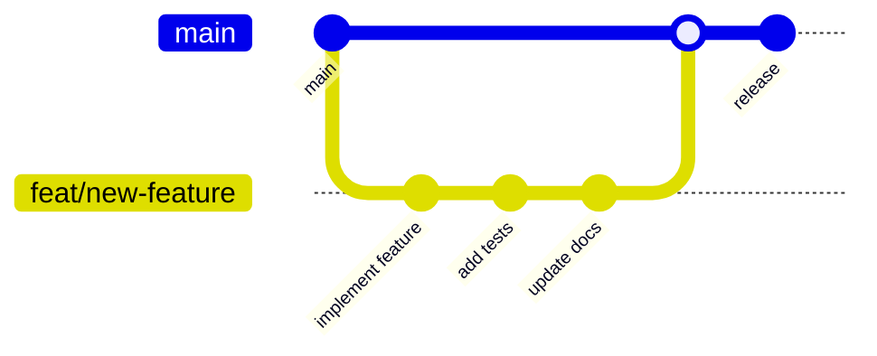
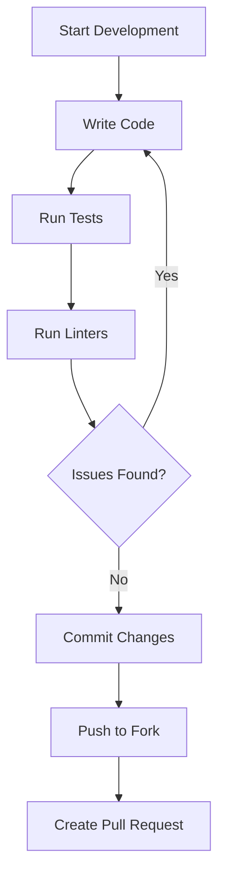
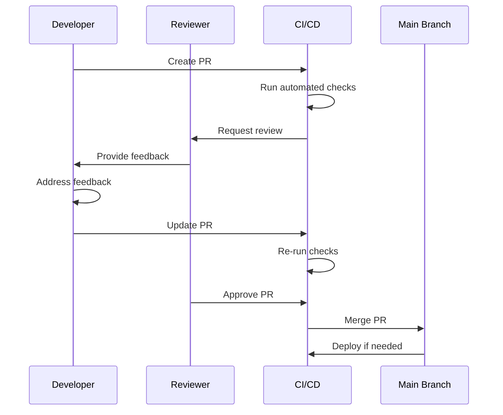

# Contributing to CCTelegram

**Complete contribution workflow** with git diagrams, quality gates, and technical procedures.

> **Quick Start**: Fork → Branch → Code → Test → PR → Review → Merge

## 🎯 Contribution Areas

### High-Impact Areas
- **🔧 MCP Tool Development**: Add new Telegram integration capabilities
- **⚡ Performance Optimization**: Improve throughput and response times
- **🛡️ Security Enhancements**: Strengthen authentication and authorization
- **🧪 Testing Infrastructure**: Expand automated testing coverage
- **📚 Documentation**: Improve developer experience and guides

### Technical Contributions
- **Bug Fixes**: Resolve issues with detailed root cause analysis
- **Feature Implementation**: Add new functionality with comprehensive tests
- **Code Reviews**: Help maintain quality through peer review
- **Performance Benchmarking**: Validate and improve system performance
- **Security Audits**: Identify and resolve security vulnerabilities

## 🚀 Complete Development Setup

### 1. Repository Setup
```bash
# Fork the repository on GitHub first
git clone https://github.com/yourusername/cctelegram.git
cd cctelegram

# Configure upstream remote
git remote add upstream https://github.com/co8/cctelegram.git
git remote -v  # Verify remotes
```

### 2. Rust Bridge Setup
```bash
# Install Rust 1.70+ with components
rustup install 1.70
rustup default 1.70
rustup component add clippy rustfmt rust-analyzer

# Verify installation
rustc --version
cargo --version

# Build and test Rust bridge
cargo build
cargo test
cargo clippy
cargo fmt --check
```

### 3. MCP Server Setup
```bash
# Navigate to MCP server directory
cd mcp-server

# Install Node.js dependencies
npm install

# Build TypeScript project
npm run build

# Run test suite
npm test
npm run lint
npm run type-check
```

### 4. Integration Testing
```bash
# Return to root directory
cd ..

# Run full integration tests
./scripts/test-all.sh

# Verify both systems work together
cargo test --test integration_tests
npm run test:integration --prefix mcp-server
```

## 📋 Development Prerequisites

### Required Tools
- **Rust**: 1.70+ with clippy, rustfmt, rust-analyzer
- **Node.js**: 20+ with npm 9+
- **Git**: 2.30+ for advanced features
- **System**: macOS, Linux, or Windows with WSL2

### Recommended IDE Setup
- **VS Code** with rust-analyzer, Jest, GitLens extensions
- **RustRover** or **IntelliJ IDEA** with Rust plugin
- **WebStorm** for TypeScript development

### Testing Requirements
- **Docker**: For integration tests and E2E testing
- **Telegram Bot Token**: For testing Telegram integration
- **Test Coverage**: >90% for new code

## 🔄 Git Workflow

### Branch Strategy


### Detailed Workflow

#### 1. Sync with Upstream
```bash
# Ensure main is current
git checkout main
git fetch upstream
git rebase upstream/main
git push origin main
```

#### 2. Create Feature Branch
```bash
# Create descriptive branch name
git checkout -b feat/add-approval-timeout
git checkout -b fix/memory-leak-queue
git checkout -b docs/api-reference-update
```

#### 3. Development Cycle


#### 4. Quality Validation
```bash
# Pre-commit validation script
#!/bin/bash
set -e

echo "🔍 Running quality checks..."

# Rust validation
echo "Validating Rust code..."
cargo clippy -- -D warnings
cargo fmt --check
cargo test

# TypeScript validation  
echo "Validating TypeScript code..."
cd mcp-server
npm run lint
npm run type-check
npm run test:unit

# Integration tests
echo "Running integration tests..."
npm run test:integration

echo "✅ All quality checks passed!"
```

## 🧪 Testing Standards

### Test Pyramid Strategy
```mermaid
pyramid
    Unit Tests [90% Coverage]
    Integration Tests [80% Coverage]
    E2E Tests [Critical Paths]
```

### Rust Testing
```rust
#[cfg(test)]
mod tests {
    use super::*;
    use tokio_test;
    
    #[tokio::test]
    async fn test_event_processing_success() {
        // Arrange
        let processor = EventProcessor::new(&temp_dir).await;
        let event = create_mock_event();
        
        // Act
        let result = processor.process_event(&event).await;
        
        // Assert
        assert!(result.is_ok());
        assert_eq!(result.unwrap().status, ProcessingStatus::Success);
    }
    
    #[tokio::test]
    async fn test_event_processing_failure() {
        // Test error handling paths
        let processor = EventProcessor::new(&invalid_dir).await;
        let result = processor.process_event(&invalid_event).await;
        
        assert!(result.is_err());
        assert_eq!(result.unwrap_err().kind(), ErrorKind::InvalidInput);
    }
}
```

### TypeScript Testing
```typescript
describe('MCPServer Tool Handler', () => {
  let server: MCPServer;
  let mockBridgeClient: jest.Mocked<CCTelegramBridgeClient>;
  
  beforeEach(() => {
    mockBridgeClient = createMockBridgeClient();
    server = new MCPServer(mockBridgeClient);
  });
  
  describe('send_telegram_event', () => {
    it('should successfully send event with valid parameters', async () => {
      // Arrange
      const eventArgs = {
        type: 'task_completion',
        title: 'Test Task',
        description: 'Test completed successfully'
      };
      
      mockBridgeClient.sendEvent.mockResolvedValue({
        success: true,
        event_id: 'test-123'
      });
      
      // Act
      const result = await server.callTool('send_telegram_event', eventArgs);
      
      // Assert
      expect(result.success).toBe(true);
      expect(mockBridgeClient.sendEvent).toHaveBeenCalledWith(
        expect.objectContaining({
          type: 'task_completion',
          title: 'Test Task'
        })
      );
    });
    
    it('should handle bridge communication failures', async () => {
      // Test error scenarios and retry logic
      mockBridgeClient.sendEvent.mockRejectedValue(
        new Error('Bridge connection failed')
      );
      
      const result = await server.callTool('send_telegram_event', eventArgs);
      
      expect(result.success).toBe(false);
      expect(result.error).toMatch(/Bridge connection failed/);
    });
  });
});
```

### Performance Testing
```bash
# Benchmark critical paths
npm run benchmark
cargo bench

# Load testing
npm run test:load
k6 run tests/load-test.js

# Memory leak detection
npm run test:memory-leak
valgrind cargo test
```

## 🚦 Pull Request Process

### PR Quality Checklist
```markdown
## Pre-Submission Checklist
- [ ] **Code Quality**
  - [ ] Rust: `cargo clippy` passes with zero warnings
  - [ ] TypeScript: `npm run lint` passes with zero violations
  - [ ] Code follows project conventions and patterns
  
- [ ] **Testing**
  - [ ] Unit tests added/updated (>90% coverage)
  - [ ] Integration tests pass
  - [ ] E2E tests cover critical paths
  - [ ] Performance tests validate no regressions
  
- [ ] **Documentation**
  - [ ] Code comments for complex logic
  - [ ] API documentation updated
  - [ ] README updated if needed
  - [ ] CHANGELOG.md entry added
  
- [ ] **Security**
  - [ ] Security implications reviewed
  - [ ] Input validation implemented
  - [ ] No secrets committed
  - [ ] Dependency vulnerabilities resolved
```

### PR Template
```markdown
## Description
Brief description of changes and motivation.

## Type of Change
- [ ] 🐛 Bug fix (non-breaking change fixing an issue)
- [ ] ✨ New feature (non-breaking change adding functionality)  
- [ ] 💥 Breaking change (fix or feature causing existing functionality to change)
- [ ] 📚 Documentation update
- [ ] 🎨 Code style/formatting changes
- [ ] ♻️ Code refactoring
- [ ] ⚡ Performance improvements
- [ ] 🧪 Test additions/improvements

## Testing Strategy
- [ ] Unit tests added/updated
- [ ] Integration tests added/updated
- [ ] Manual testing performed
- [ ] Performance impact validated
- [ ] Cross-platform compatibility verified

## Security Impact
- [ ] Authentication/authorization changes reviewed
- [ ] Input validation implemented
- [ ] Security implications documented
- [ ] No sensitive data exposure

## Performance Impact
- [ ] Performance benchmarks run
- [ ] Memory usage validated  
- [ ] No performance regressions introduced
- [ ] Scalability implications considered

## Breaking Changes
List any breaking changes and migration steps.

## Screenshots/Logs
Include relevant screenshots, logs, or examples.

## Related Issues
- Fixes #123
- Related to #456
- Implements RFC #789
```

### Review Process


## 📊 Code Quality Standards

### Rust Quality Gates
```toml
[lints.rust]
warnings = "deny"
unsafe_code = "forbid"

[lints.clippy]
all = "deny"
pedantic = "deny"
nursery = "deny"
cargo = "deny"
```

### TypeScript Quality Gates
```json
{
  "compilerOptions": {
    "strict": true,
    "noUncheckedIndexedAccess": true,
    "exactOptionalPropertyTypes": true,
    "noImplicitReturns": true,
    "noFallthroughCasesInSwitch": true
  }
}
```

### Performance Standards
- **Response Time**: <500ms P95 for MCP tools
- **Memory Usage**: <1GB per component under load
- **Throughput**: 1000+ events/minute sustained
- **Error Rate**: <0.1% for critical operations

### Security Requirements
- **Input Validation**: All external inputs validated with Joi/serde
- **Authentication**: API key validation with rate limiting
- **Authorization**: Role-based access control enforcement
- **Audit Logging**: All security events logged with context
- **Vulnerability Management**: Zero critical/high vulnerabilities

## 🎯 Contribution Guidelines

### Commit Message Format
```bash
# Format: type(scope): description
feat(mcp): add approval timeout configuration
fix(bridge): resolve memory leak in queue processing
docs(api): update MCP tool reference
test(integration): add E2E Telegram workflow tests
perf(queue): optimize batch processing performance
refactor(auth): simplify authentication middleware
```

### Code Review Standards
- **Functionality**: Code works as intended and handles edge cases
- **Testing**: Comprehensive test coverage with meaningful assertions
- **Performance**: No obvious performance regressions
- **Security**: Secure coding practices followed
- **Maintainability**: Code is readable and well-documented
- **Architecture**: Changes align with system design principles

### Release Integration
- **Feature Flags**: Use feature flags for experimental features
- **Backward Compatibility**: Maintain API compatibility when possible
- **Migration Guides**: Provide clear migration instructions for breaking changes
- **Performance Impact**: Document performance characteristics
- **Security Impact**: Highlight security implications and recommendations

## 🤝 Community Engagement

### Getting Help
- **Technical Questions**: Create GitHub Discussion with `question` label
- **Feature Requests**: Create GitHub Issue with `enhancement` label  
- **Bug Reports**: Create GitHub Issue with detailed reproduction steps
- **Security Issues**: Use private vulnerability reporting
- **Architecture Discussions**: Join community design sessions

### Contribution Recognition
- **Contributors**: Listed in README.md and release notes
- **Major Features**: Highlighted in changelog and announcements
- **Bug Fixes**: Acknowledged in issue resolution
- **Documentation**: Credited in documentation improvements
- **Code Reviews**: Recognized for review contributions

---

**Ready to start?** Choose your contribution area and follow this workflow for effective collaboration!

**Need architecture context?** Review our [Architecture Guide](./architecture.md) before implementing major changes.

**Questions about testing?** Check our [Testing Guide](./testing.md) for comprehensive testing procedures.