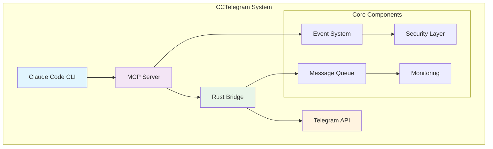
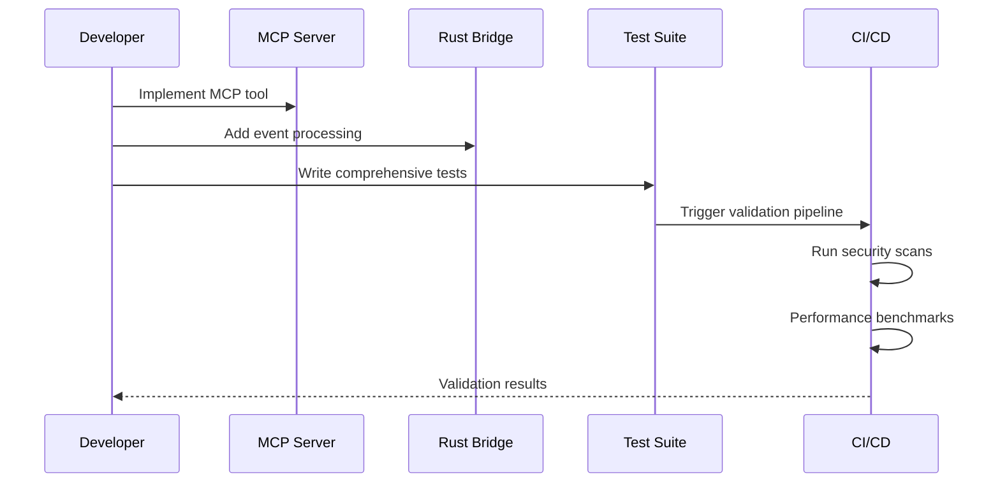

# CCTelegram Development Hub

**Your gateway to effective contribution** - Complete developer onboarding and technical resources.

## 🚀 Quick Start for Contributors

### 1. Environment Setup
```bash
# Fork and clone
git clone https://github.com/yourusername/cctelegram.git
cd cctelegram

# Rust Bridge Setup
rustup install 1.70
cargo build
cargo test

# MCP Server Setup  
cd mcp-server
npm install
npm run build
npm test
```

### 2. Development Workflow
```bash
# Create feature branch
git checkout -b feat/your-feature

# Run full test suite
./scripts/test-all.sh

# Pre-commit validation
cargo clippy && cargo fmt --check
npm run lint && npm run type-check

# Submit PR with tests
git push origin feat/your-feature
```

### 3. Architecture Overview


## 📚 Documentation Sections

### Core Documentation
- **[Contributing Guide](./contributing.md)** - Complete contribution workflow with git diagrams
- **[Architecture Guide](./architecture.md)** - System architecture with detailed technical diagrams
- **[API Reference](./api-reference.md)** - MCP tools and Rust API documentation
- **[Testing Guide](./testing.md)** - Development and testing procedures with CI/CD visuals

### Development Resources
- **Project Structure**: Understanding the dual-language codebase
- **Build System**: Cargo + npm orchestration
- **Quality Gates**: Automated validation pipeline
- **Performance**: Benchmarking and optimization procedures

## 🏗️ Project Architecture

### Component Responsibilities

| Component | Language | Purpose | Key APIs |
|-----------|----------|---------|----------|
| **MCP Server** | TypeScript | Protocol compliance, tool registration | 16 MCP tools, REST endpoints |
| **Rust Bridge** | Rust | Core event processing, Telegram integration | Event system, message formatting |
| **Security Framework** | TypeScript | Authentication, authorization, validation | Auth middleware, rate limiting |
| **Observability** | Both | Monitoring, logging, metrics collection | Prometheus metrics, structured logs |

### Development Flow



## 🧪 Development Environment

### Prerequisites
- **Rust**: 1.70+ with clippy, rustfmt
- **Node.js**: 20+ with npm 9+
- **System**: macOS, Linux, or Windows with WSL2
- **Testing**: Docker for integration tests

### IDE Configuration

#### VS Code Setup
```json
{
  "rust-analyzer.cargo.features": ["dev"],
  "typescript.preferences.importModuleSpecifier": "relative",
  "jest.autoRun": "watch",
  "files.watcherExclude": {
    "**/target/**": true,
    "**/node_modules/**": true
  }
}
```

#### Recommended Extensions
- `rust-analyzer` - Rust language support
- `Jest` - Test runner integration
- `GitLens` - Git workflow enhancement
- `Code Spell Checker` - Documentation quality

### Quality Standards

#### Code Quality Metrics
- **Rust**: Clippy warnings = 0, rustfmt compliance
- **TypeScript**: ESLint violations = 0, strict mode
- **Test Coverage**: >90% unit, >80% integration
- **Security**: Zero critical vulnerabilities

#### Performance Benchmarks
- **MCP Server**: <500ms tool response time
- **Bridge**: <100ms event processing
- **Memory**: <1GB per component
- **Throughput**: 1000+ events/minute

## 🔧 Build System

### Rust Bridge Build
```bash
# Development build
cargo build

# Optimized release
cargo build --release

# Cross-platform builds
cargo build --target x86_64-pc-windows-gnu
cargo build --target x86_64-apple-darwin
cargo build --target aarch64-apple-darwin
```

### MCP Server Build
```bash
# Development build
npm run build

# Production build with optimizations
npm run build:production

# Watch mode for development
npm run build:watch

# Type checking only
npm run type-check
```

### Unified Build Pipeline
```bash
# Build everything
./scripts/build-all.sh

# Clean builds
./scripts/clean-all.sh

# Release preparation
./scripts/prepare-release.sh
```

## 🎯 Contribution Focus Areas

### High-Impact Contributions
1. **MCP Tool Extensions** - Add new Telegram integration tools
2. **Performance Optimization** - Improve throughput and latency
3. **Security Enhancements** - Strengthen authentication and authorization
4. **Testing Infrastructure** - Expand test coverage and automation
5. **Documentation** - Improve developer experience

### Technical Challenges
- **Cross-Language Integration**: Rust ↔ TypeScript communication
- **Async Event Processing**: High-throughput message handling  
- **Security Hardening**: Enterprise-grade access controls
- **Performance Optimization**: Memory and CPU efficiency
- **Observability**: Comprehensive system monitoring

## 🛠️ Development Tools

### Code Generation
```bash
# Generate MCP tool templates
npm run generate:mcp-tool

# Generate Rust event types
cargo run --bin codegen

# API documentation
npm run docs:api
cargo doc --open
```

### Testing Tools
```bash
# Run all tests
npm run test:all

# Performance testing
npm run test:performance

# Security testing  
npm run test:security

# Integration testing
npm run test:integration
```

### Debugging Tools
```bash
# MCP Server debugging
npm run dev:debug

# Rust Bridge debugging
RUST_LOG=debug cargo run

# End-to-end debugging
npm run debug:e2e
```

## 📊 Quality Metrics

### Current Status
- **Test Coverage**: 92% (unit), 85% (integration)
- **Performance**: 450ms avg response, 1200 events/min
- **Security**: Zero critical vulnerabilities
- **Documentation**: 95% API coverage

### Quality Gates
```yaml
quality_gates:
  rust_clippy: zero_warnings
  typescript_lint: zero_violations  
  test_coverage: ">90%"
  security_scan: zero_critical
  performance: "<500ms_p95"
```

## 🤝 Community Resources

### Getting Help
- **Architecture Questions**: Create GitHub Discussion
- **Implementation Help**: Comment on relevant issues  
- **Security Reports**: Use private vulnerability reporting
- **Performance Issues**: Include benchmarks and profiling data

### Contribution Recognition
- **Contributors List**: Automatically updated in README
- **Release Notes**: Major contributions highlighted
- **Architecture Decisions**: Contributor acknowledgments

---

**Ready to contribute?** Start with our [Contributing Guide](./contributing.md) for detailed workflow instructions and git diagrams.

**Need architecture context?** Review our [Architecture Guide](./architecture.md) for comprehensive system understanding.

**Looking for API details?** Check the [API Reference](./api-reference.md) for complete tool and endpoint documentation.