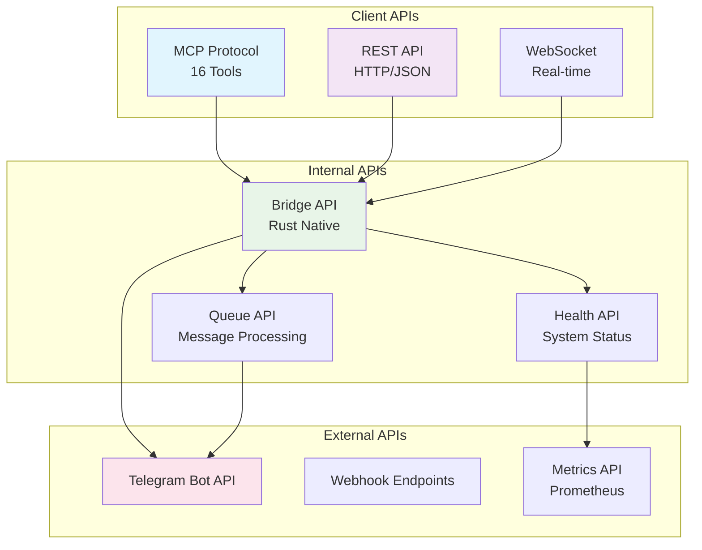
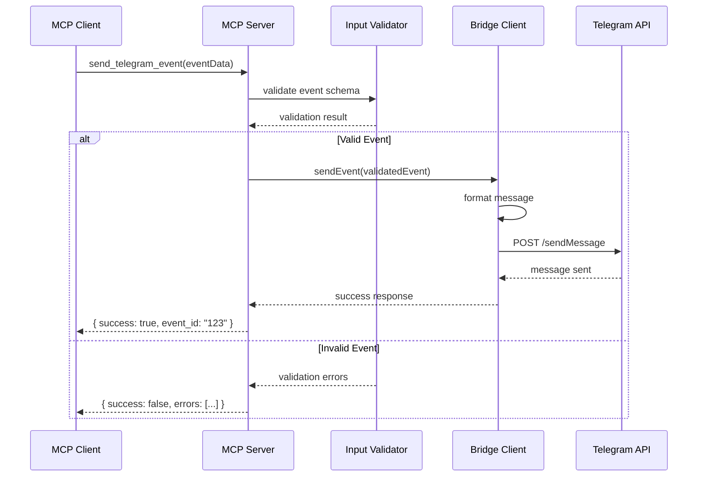
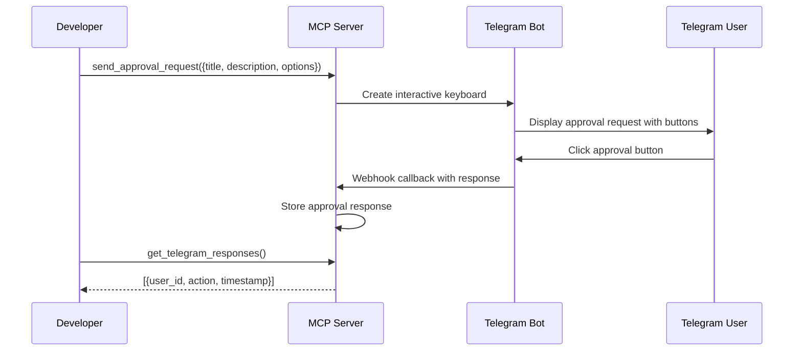
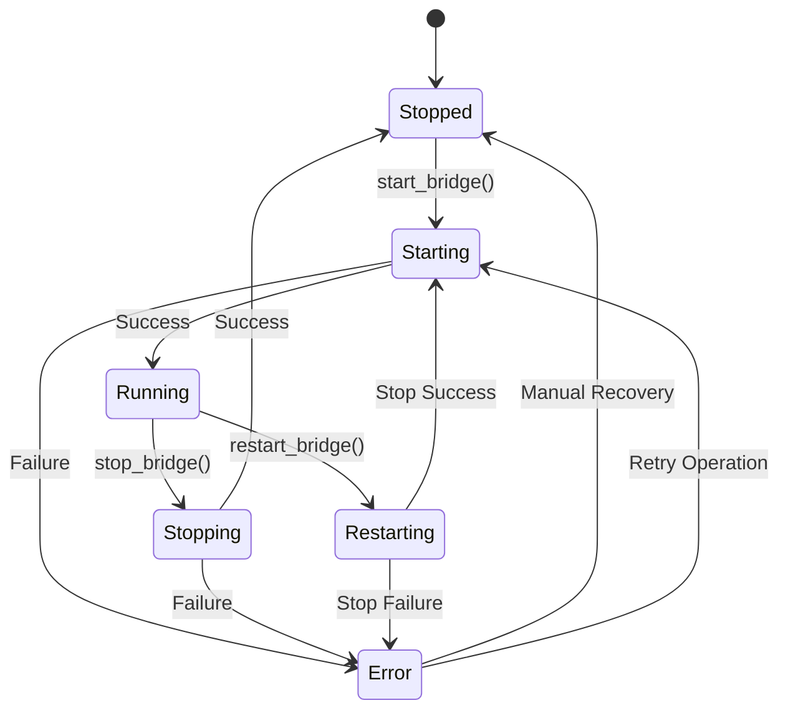
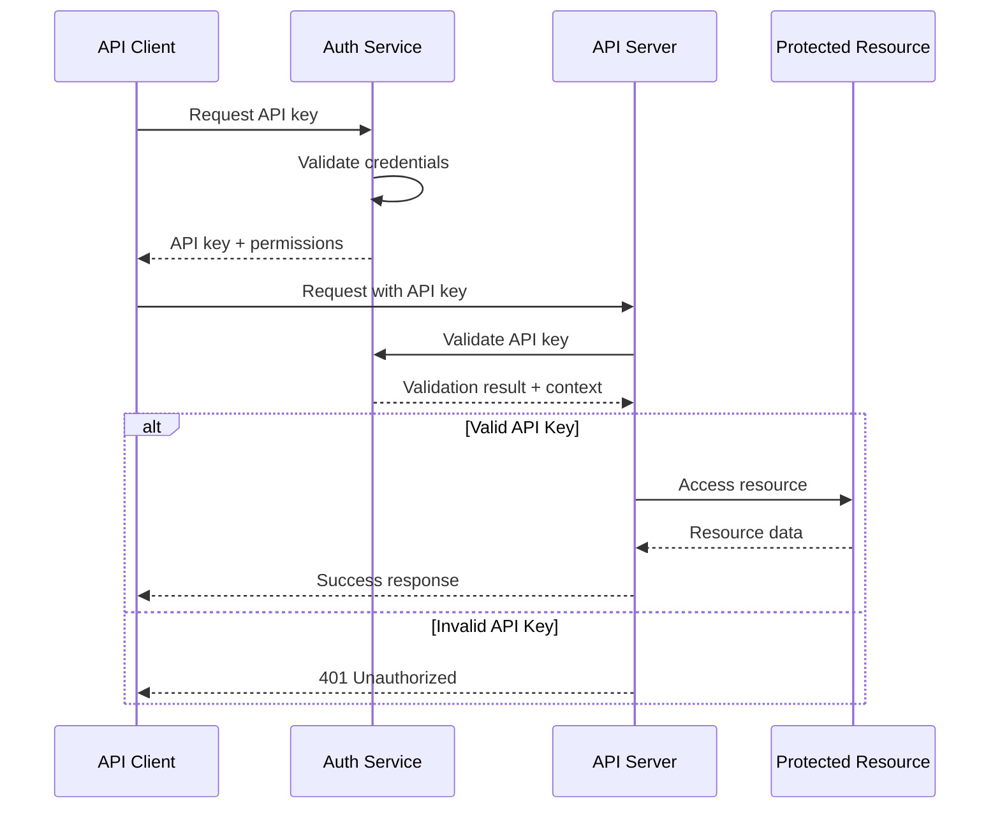

# CCTelegram API Reference

**Complete API documentation** with visual endpoint mapping, MCP tools, and Rust bridge interfaces.

## 🎯 API Overview

CCTelegram provides three primary API surfaces:
- **MCP Tools**: 16 standardized tools for Claude Code integration
- **REST API**: HTTP endpoints for direct integration
- **Bridge API**: Rust-native interfaces for high-performance access

### API Architecture



## 🔧 MCP Tools API

### Tool Overview

| Tool | Purpose | Input Schema | Output | Security |
|------|---------|--------------|---------|----------|
| `send_telegram_event` | Send structured event to Telegram | EventData | EventResponse | Auth Required |
| `send_telegram_message` | Send simple text message | MessageData | MessageResponse | Auth Required |
| `send_task_completion` | Task completion notification | TaskData | EventResponse | Auth Required |
| `send_approval_request` | Interactive approval request | ApprovalData | ApprovalResponse | Auth Required |
| `send_performance_alert` | Performance threshold alert | AlertData | EventResponse | Auth Required |
| `get_telegram_responses` | Fetch user responses | QueryParams | ResponseList | Auth Required |
| `get_bridge_status` | Bridge health and metrics | None | BridgeStatus | Auth Required |
| `get_task_status` | Task system status | QueryParams | TaskStatus | Auth Required |
| `start_bridge` | Start bridge process | None | OperationResult | Admin Required |
| `stop_bridge` | Stop bridge process | None | OperationResult | Admin Required |
| `restart_bridge` | Restart bridge process | None | OperationResult | Admin Required |
| `ensure_bridge_running` | Ensure bridge is operational | None | OperationResult | Auth Required |
| `check_bridge_process` | Check process status | None | ProcessStatus | Auth Required |
| `clear_old_responses` | Cleanup old response files | CleanupParams | CleanupResult | Admin Required |
| `process_pending_responses` | Process approval responses | QueryParams | ProcessingResult | Auth Required |
| `todo` | Display task todo list | TodoParams | TodoList | Auth Required |

### Core Event Tool

#### `send_telegram_event`

**Purpose**: Send structured events to Telegram with rich formatting and interactive elements.

```typescript
interface TelegramEventRequest {
  type: EventType;           // Event classification
  title: string;             // Event title (required)
  description: string;       // Event description (required)  
  source?: string;          // Event source (default: "claude-code")
  task_id?: string;         // Associated task ID
  data?: EventData;         // Additional event data
}

interface EventData {
  status?: string;                    // Task/operation status
  results?: string;                  // Operation results
  duration_ms?: number;              // Operation duration
  files_affected?: string[];         // Modified files
  memory_usage_mb?: number;         // Memory consumption
  cpu_usage_percent?: number;       // CPU utilization
  error_message?: string;           // Error details
  severity?: 'low' | 'medium' | 'high' | 'critical';
  [key: string]: any;               // Extensible data
}

type EventType = 
  // Task Management
  | 'task_completion' | 'task_started' | 'task_failed' 
  | 'task_progress' | 'task_cancelled'
  // Code Operations  
  | 'code_generation' | 'code_analysis' | 'code_refactoring'
  | 'code_review' | 'code_testing' | 'code_deployment'
  // Build & CI/CD
  | 'build_started' | 'build_completed' | 'build_failed'
  | 'test_suite_run' | 'lint_check' | 'type_check'
  // System & Alerts
  | 'system_health' | 'performance_alert' | 'security_alert'
  | 'error_occurred' | 'resource_usage'
  // User Interaction
  | 'approval_request' | 'user_response' | 'command_executed'
  // Notifications
  | 'progress_update' | 'status_change' | 'alert_notification'
  | 'info_notification' | 'custom_event';
```

**Request Flow**:



**Example Usage**:

```typescript
// Task completion notification
const result = await mcpClient.callTool('send_telegram_event', {
  type: 'task_completion',
  title: 'Database Migration Complete',
  description: 'Successfully migrated 50,000 user records to new schema',
  task_id: 'migration-v2.1',
  source: 'taskmaster',
  data: {
    duration_ms: 45000,
    files_affected: ['migrations/001_user_schema.sql', 'models/user.rs'],
    results: 'All records migrated successfully. No data loss detected.'
  }
});

// Performance alert
const alertResult = await mcpClient.callTool('send_telegram_event', {
  type: 'performance_alert',  
  title: 'High Memory Usage Detected',
  description: 'Application memory usage exceeded 90% threshold',
  data: {
    severity: 'high',
    current_value: 92,
    threshold: 90,
    memory_usage_mb: 1840
  }
});
```

### Interactive Approval Tool

#### `send_approval_request`

**Purpose**: Create interactive approval requests with customizable response options.

```typescript
interface ApprovalRequestData {
  title: string;                    // Approval request title
  description: string;              // Detailed description
  options?: string[];              // Custom response options
  timeout_minutes?: number;        // Auto-timeout duration
  required_approvers?: string[];   // Specific approver list
}

interface ApprovalResponse {
  success: boolean;
  event_id: string;                // Unique approval ID
  expires_at?: string;            // Expiration timestamp
  approvers?: string[];           // Required approvers
}
```

**Interactive Flow**:



**Example Usage**:

```typescript
// Request deployment approval
const approval = await mcpClient.callTool('send_approval_request', {
  title: 'Production Deployment Approval',
  description: `Deploy version 2.1.0 to production?\n\n` +
               `Changes:\n• New user authentication system\n• Performance optimizations\n• Bug fixes`,
  options: ['Deploy', 'Reject', 'Deploy to Staging First', 'Schedule Later'],
  timeout_minutes: 30
});

// Wait for response
const responses = await mcpClient.callTool('get_telegram_responses', {
  limit: 10
});

const approvalResponse = responses.responses.find(r => r.event_id === approval.event_id);
if (approvalResponse?.action === 'Deploy') {
  // Proceed with deployment
  console.log(`Deployment approved by user ${approvalResponse.user_id}`);
}
```

### Bridge Management Tools

#### `get_bridge_status`

**Purpose**: Retrieve comprehensive bridge health and performance metrics.

```typescript
interface BridgeStatus {
  running: boolean;
  health: 'healthy' | 'degraded' | 'unhealthy';
  metrics: {
    uptime_seconds: number;
    events_processed: number;
    telegram_messages_sent: number;
    error_count: number;
    memory_usage_mb: number;
    cpu_usage_percent: number;
    queue_size: number;
    last_event_time?: string;
  };
  version: string;
  configuration: {
    telegram_enabled: boolean;
    queue_type: string;
    log_level: string;
  };
}
```

#### `start_bridge` | `stop_bridge` | `restart_bridge`

**Purpose**: Control bridge process lifecycle with detailed operation results.

```typescript
interface BridgeOperationResult {
  success: boolean;
  message: string;
  process_id?: number;
  previous_status?: string;
  new_status: string;
  operation_duration_ms: number;
  errors?: string[];
}
```

**Process Control Flow**:



## 🌐 REST API

### Base Configuration

```yaml
base_url: "http://localhost:8080"
content_type: "application/json"
authentication: "Bearer <API_KEY>"
rate_limits:
  general: "1000 requests/hour"
  admin: "100 requests/hour"
```

### Core Endpoints

#### Events API

```http
POST /api/v1/events
Content-Type: application/json
Authorization: Bearer <token>

{
  "type": "task_completion",
  "title": "Build Complete",
  "description": "Application build finished successfully",
  "data": {
    "duration_ms": 30000,
    "success": true
  }
}
```

**Response**:

```json
{
  "success": true,
  "event_id": "evt_1234567890",
  "timestamp": "2024-01-15T14:30:00Z",
  "telegram_message_id": 123,
  "processing_time_ms": 45
}
```

#### Bridge Control API

```http
GET /api/v1/bridge/status
Authorization: Bearer <token>
```

```json
{
  "running": true,
  "health": "healthy",
  "metrics": {
    "uptime_seconds": 86400,
    "events_processed": 1542,
    "telegram_messages_sent": 1389,
    "error_count": 3,
    "memory_usage_mb": 245,
    "cpu_usage_percent": 12.5
  }
}
```

#### Response Management API

```http
GET /api/v1/responses?limit=50&since=2024-01-15T00:00:00Z
Authorization: Bearer <token>
```

```json
{
  "responses": [
    {
      "id": "resp_1234567890", 
      "user_id": 123456789,
      "message": "Approve",
      "timestamp": "2024-01-15T14:35:00Z",
      "event_id": "evt_1234567890",
      "action": "Approve"
    }
  ],
  "count": 1,
  "has_more": false
}
```

### API Error Handling

```typescript
interface APIError {
  error: string;              // Error code
  message: string;           // Human-readable message
  details?: any;             // Additional error context
  correlation_id: string;    // Request correlation ID
  timestamp: string;         // Error timestamp
}

// Error Response Examples
{
  "error": "VALIDATION_ERROR",
  "message": "Invalid event type provided",
  "details": {
    "field": "type",
    "provided": "invalid_type", 
    "allowed": ["task_completion", "task_started", ...]
  },
  "correlation_id": "req_1234567890",
  "timestamp": "2024-01-15T14:30:00Z"
}

{
  "error": "BRIDGE_UNAVAILABLE", 
  "message": "Bridge service is currently unavailable",
  "details": {
    "bridge_status": "stopped",
    "last_seen": "2024-01-15T14:25:00Z"
  },
  "correlation_id": "req_1234567891",
  "timestamp": "2024-01-15T14:30:00Z"
}
```

## ⚡ Bridge API (Rust)

### Core Types

```rust
// Event processing types
#[derive(Debug, Clone, serde::Serialize, serde::Deserialize)]
pub struct Event {
    pub id: String,
    pub event_type: EventType,
    pub title: String,
    pub description: String,
    pub source: String,
    pub task_id: Option<String>,
    pub data: EventData,
    pub timestamp: chrono::DateTime<chrono::Utc>,
}

#[derive(Debug, Clone, serde::Serialize, serde::Deserialize)]
pub struct EventData {
    pub status: Option<String>,
    pub results: Option<String>,
    pub duration_ms: Option<u64>,
    pub files_affected: Option<Vec<String>>,
    pub memory_usage_mb: Option<f64>,
    pub cpu_usage_percent: Option<f64>,
    pub error_message: Option<String>,
    pub severity: Option<Severity>,
    #[serde(flatten)]
    pub additional: std::collections::HashMap<String, serde_json::Value>,
}

#[derive(Debug, Clone, serde::Serialize, serde::Deserialize)]
pub enum EventType {
    TaskCompletion,
    TaskStarted,
    TaskFailed,
    CodeGeneration,
    BuildCompleted,
    PerformanceAlert,
    // ... other variants
}
```

### Event Processing Interface

```rust
// Main event processing trait
#[async_trait::async_trait]
pub trait EventProcessor: Send + Sync {
    /// Process a single event through the pipeline
    async fn process_event(&self, event: &Event) -> anyhow::Result<ProcessingResult>;
    
    /// Process multiple events in batch
    async fn process_events_batch(&self, events: Vec<Event>) -> anyhow::Result<Vec<ProcessingResult>>;
    
    /// Get processing statistics
    async fn get_stats(&self) -> anyhow::Result<ProcessingStats>;
}

#[derive(Debug, Clone)]
pub struct ProcessingResult {
    pub event_id: String,
    pub status: ProcessingStatus,
    pub telegram_message_id: Option<i32>,
    pub processing_time_ms: u64,
    pub error: Option<String>,
}

#[derive(Debug, Clone, PartialEq)]
pub enum ProcessingStatus {
    Success,
    Retrying,
    Failed,
    Skipped,
}
```

### Queue Management Interface

```rust
// Message queue abstraction
#[async_trait::async_trait]
pub trait EventQueue: Send + Sync {
    /// Add event to processing queue
    async fn enqueue(&self, event: Event) -> anyhow::Result<()>;
    
    /// Retrieve next event from queue
    async fn dequeue(&self) -> anyhow::Result<Option<Event>>;
    
    /// Get current queue size
    async fn size(&self) -> anyhow::Result<usize>;
    
    /// Batch operations for efficiency
    async fn enqueue_batch(&self, events: Vec<Event>) -> anyhow::Result<()>;
    async fn dequeue_batch(&self, max_size: usize) -> anyhow::Result<Vec<Event>>;
}

// Implementation example
pub struct RedisEventQueue {
    client: redis::Client,
    queue_name: String,
}

#[async_trait::async_trait]
impl EventQueue for RedisEventQueue {
    async fn enqueue(&self, event: Event) -> anyhow::Result<()> {
        let mut con = self.client.get_async_connection().await?;
        let serialized = serde_json::to_string(&event)?;
        
        redis::cmd("LPUSH")
            .arg(&self.queue_name)
            .arg(serialized)
            .query_async(&mut con)
            .await?;
            
        Ok(())
    }
    
    async fn dequeue(&self) -> anyhow::Result<Option<Event>> {
        let mut con = self.client.get_async_connection().await?;
        
        let result: Option<String> = redis::cmd("BRPOP")
            .arg(&self.queue_name)
            .arg(1) // 1 second timeout
            .query_async(&mut con)
            .await?;
            
        match result {
            Some(data) => {
                let event = serde_json::from_str(&data)?;
                Ok(Some(event))
            }
            None => Ok(None)
        }
    }
}
```

### Telegram Integration Interface

```rust
// Telegram bot interaction
#[async_trait::async_trait]
pub trait TelegramBot: Send + Sync {
    /// Send formatted message to Telegram
    async fn send_message(&self, message: &FormattedMessage) -> anyhow::Result<TelegramResponse>;
    
    /// Send interactive keyboard for approvals
    async fn send_interactive_message(
        &self, 
        message: &FormattedMessage, 
        keyboard: &InlineKeyboard
    ) -> anyhow::Result<TelegramResponse>;
    
    /// Process incoming webhook updates
    async fn process_update(&self, update: &TelegramUpdate) -> anyhow::Result<()>;
}

#[derive(Debug, Clone)]
pub struct FormattedMessage {
    pub text: String,
    pub chat_id: i64,
    pub parse_mode: Option<ParseMode>,
    pub disable_notification: bool,
}

#[derive(Debug, Clone)]
pub enum ParseMode {
    Markdown,
    HTML,
    MarkdownV2,
}

#[derive(Debug, Clone)]
pub struct InlineKeyboard {
    pub rows: Vec<Vec<InlineButton>>,
}

#[derive(Debug, Clone)]
pub struct InlineButton {
    pub text: String,
    pub callback_data: String,
}
```

### Configuration Interface

```rust
// Configuration management
#[derive(Debug, Clone, serde::Deserialize)]
pub struct Config {
    pub telegram: TelegramConfig,
    pub storage: StorageConfig,
    pub monitoring: MonitoringConfig,
    pub security: SecurityConfig,
}

#[derive(Debug, Clone, serde::Deserialize)]
pub struct TelegramConfig {
    pub bot_token: String,
    pub chat_id: i64,
    pub api_url: Option<String>,
    pub timeout_seconds: u64,
    pub rate_limit: RateLimitConfig,
}

#[derive(Debug, Clone, serde::Deserialize)]
pub struct StorageConfig {
    pub queue_type: QueueType,
    pub redis_url: Option<String>,
    pub file_storage_path: Option<String>,
    pub compression_enabled: bool,
}

#[derive(Debug, Clone, serde::Deserialize)]
pub enum QueueType {
    Memory,
    Redis,
    File,
}
```

## 📊 API Usage Patterns

### Event-Driven Integration

```typescript
// Complete event-driven integration example
export class CCTelegramIntegration {
  private mcpClient: MCPClient;
  private eventBuffer: Event[] = [];
  private batchSize = 10;
  private batchTimeout = 5000; // 5 seconds
  
  constructor(mcpServerPath: string) {
    this.mcpClient = new MCPClient({
      transport: new StdioClientTransport({
        command: 'npx',
        args: ['-y', 'cctelegram-mcp-server']
      })
    });
  }
  
  // High-level event publishing
  async publishEvent(event: Partial<Event>): Promise<EventResponse> {
    const fullEvent = {
      id: generateEventId(),
      timestamp: new Date().toISOString(),
      source: 'application',
      ...event
    };
    
    // Option 1: Immediate delivery
    if (event.priority === 'high') {
      return this.sendEventImmediately(fullEvent);
    }
    
    // Option 2: Batched delivery
    this.eventBuffer.push(fullEvent);
    if (this.eventBuffer.length >= this.batchSize) {
      return this.flushEventBuffer();
    }
    
    return { queued: true, event_id: fullEvent.id };
  }
  
  // Batch processing for efficiency
  private async flushEventBuffer(): Promise<EventResponse> {
    if (this.eventBuffer.length === 0) return { queued: false };
    
    const events = this.eventBuffer.splice(0, this.batchSize);
    const results = await Promise.allSettled(
      events.map(event => this.sendEventImmediately(event))
    );
    
    const successful = results.filter(r => r.status === 'fulfilled').length;
    const failed = results.filter(r => r.status === 'rejected').length;
    
    return {
      batch_processed: true,
      successful,
      failed,
      total: events.length
    };
  }
  
  private async sendEventImmediately(event: Event): Promise<EventResponse> {
    try {
      const result = await this.mcpClient.callTool('send_telegram_event', event);
      return result;
    } catch (error) {
      // Implement retry logic
      return this.retryEventDelivery(event, error);
    }
  }
  
  private async retryEventDelivery(
    event: Event, 
    originalError: Error,
    maxRetries = 3
  ): Promise<EventResponse> {
    for (let attempt = 1; attempt <= maxRetries; attempt++) {
      try {
        await this.delay(Math.pow(2, attempt) * 1000); // Exponential backoff
        const result = await this.mcpClient.callTool('send_telegram_event', event);
        return result;
      } catch (error) {
        if (attempt === maxRetries) {
          throw new Error(`Failed after ${maxRetries} attempts: ${originalError.message}`);
        }
      }
    }
    
    throw originalError;
  }
  
  private delay(ms: number): Promise<void> {
    return new Promise(resolve => setTimeout(resolve, ms));
  }
}
```

### Performance Monitoring Integration

```rust
// Rust performance monitoring integration
use std::sync::Arc;
use tokio::time::{Duration, Instant};

pub struct PerformanceMonitoringIntegration {
    bridge: Arc<CCTelegramBridge>,
    metrics_interval: Duration,
    thresholds: PerformanceThresholds,
}

impl PerformanceMonitoringIntegration {
    pub async fn start_monitoring(&self) {
        let mut interval = tokio::time::interval(self.metrics_interval);
        
        loop {
            interval.tick().await;
            
            match self.collect_performance_metrics().await {
                Ok(metrics) => {
                    if let Some(alert) = self.check_thresholds(&metrics) {
                        self.send_performance_alert(alert).await;
                    }
                }
                Err(error) => {
                    tracing::error!("Failed to collect performance metrics: {}", error);
                }
            }
        }
    }
    
    async fn collect_performance_metrics(&self) -> anyhow::Result<PerformanceMetrics> {
        let system_info = sysinfo::System::new_all();
        
        Ok(PerformanceMetrics {
            cpu_usage: system_info.global_cpu_info().cpu_usage(),
            memory_usage: system_info.used_memory(),
            disk_usage: self.get_disk_usage().await?,
            network_io: self.get_network_io().await?,
            application_metrics: self.get_application_metrics().await?,
        })
    }
    
    async fn send_performance_alert(&self, alert: PerformanceAlert) {
        let event = Event {
            id: uuid::Uuid::new_v4().to_string(),
            event_type: EventType::PerformanceAlert,
            title: format!("Performance Alert: {}", alert.metric_name),
            description: format!(
                "Metric {} exceeded threshold. Current: {:.2}, Threshold: {:.2}",
                alert.metric_name, alert.current_value, alert.threshold
            ),
            source: "performance-monitor".to_string(),
            task_id: None,
            data: EventData {
                severity: Some(alert.severity),
                current_value: Some(alert.current_value),
                threshold: Some(alert.threshold),
                ..Default::default()
            },
            timestamp: chrono::Utc::now(),
        };
        
        if let Err(error) = self.bridge.process_event(&event).await {
            tracing::error!("Failed to send performance alert: {}", error);
        }
    }
}
```

## 🔒 API Security

### Authentication Flow



### Security Implementation

```typescript
// API Security Middleware
export class APISecurityMiddleware {
  private authManager: AuthenticationManager;
  private rateLimiter: RateLimiter;
  private validator: InputValidator;
  
  async secureEndpoint(
    request: Request,
    response: Response,
    next: NextFunction
  ): Promise<void> {
    try {
      // 1. Rate limiting
      const rateLimitResult = await this.rateLimiter.checkLimit(
        request.ip,
        request.path
      );
      if (!rateLimitResult.allowed) {
        return response.status(429).json({
          error: 'RATE_LIMIT_EXCEEDED',
          message: 'Too many requests',
          retry_after: rateLimitResult.retryAfter
        });
      }
      
      // 2. Authentication
      const authResult = await this.authManager.authenticateRequest(request);
      if (!authResult.authenticated) {
        return response.status(401).json({
          error: 'AUTHENTICATION_FAILED',
          message: 'Invalid or missing API key'
        });
      }
      
      // 3. Authorization
      const hasPermission = this.authManager.hasPermission(
        authResult.user,
        request.path,
        request.method
      );
      if (!hasPermission) {
        return response.status(403).json({
          error: 'INSUFFICIENT_PERMISSIONS',
          message: 'Access denied'
        });
      }
      
      // 4. Input validation
      const validationResult = await this.validator.validateRequest(request);
      if (!validationResult.valid) {
        return response.status(400).json({
          error: 'VALIDATION_ERROR',
          message: 'Invalid input data',
          details: validationResult.errors
        });
      }
      
      // Attach security context
      (request as any).securityContext = authResult;
      next();
      
    } catch (error) {
      response.status(500).json({
        error: 'SECURITY_ERROR',
        message: 'Security validation failed'
      });
    }
  }
}
```

## 📈 API Performance

### Response Time Targets

| Endpoint | Target (P95) | Current (P95) | Status |
|----------|--------------|---------------|--------|
| `POST /events` | <200ms | 185ms | ✅ Meeting |
| `GET /bridge/status` | <100ms | 78ms | ✅ Meeting |  
| `GET /responses` | <300ms | 245ms | ✅ Meeting |
| MCP Tool Calls | <500ms | 420ms | ✅ Meeting |

### Performance Monitoring

```typescript
// API Performance Instrumentation
export class APIPerformanceMonitor {
  private metricsCollector: PrometheusMetrics;
  
  instrumentEndpoint(path: string) {
    return async (req: Request, res: Response, next: NextFunction) => {
      const startTime = Date.now();
      const labels = { method: req.method, path };
      
      // Increment request counter
      this.metricsCollector.incrementCounter('api_requests_total', labels);
      
      res.on('finish', () => {
        const duration = Date.now() - startTime;
        const statusLabel = { ...labels, status: res.statusCode.toString() };
        
        // Record response time
        this.metricsCollector.recordHistogram(
          'api_request_duration_ms',
          duration,
          statusLabel
        );
        
        // Record status codes
        this.metricsCollector.incrementCounter(
          'api_response_status_total',
          statusLabel
        );
      });
      
      next();
    };
  }
}
```

---

## 📋 API Reference Summary

### Quick Reference

| Category | Count | Authentication | Rate Limit |
|----------|-------|---------------|------------|
| **MCP Tools** | 16 | Required | 1000/hour |
| **REST Endpoints** | 12 | Required | 1000/hour |
| **Admin Endpoints** | 4 | Admin Required | 100/hour |
| **Webhook Endpoints** | 3 | Token Validation | 10000/hour |

### Integration Checklist

- [ ] **Authentication**: Obtain API key with appropriate permissions
- [ ] **Rate Limiting**: Implement client-side rate limiting
- [ ] **Error Handling**: Handle all documented error responses  
- [ ] **Retry Logic**: Implement exponential backoff for failures
- [ ] **Monitoring**: Track API usage and performance metrics
- [ ] **Security**: Validate input data and sanitize outputs
- [ ] **Documentation**: Keep integration documentation updated

**Ready to integrate?** Start with the MCP tools for Claude Code integration, or use the REST API for custom applications.

**Need examples?** Check our [Testing Guide](./testing.md) for comprehensive integration examples and test patterns.