# CCTelegram Architecture Guide

**Complete system architecture** with detailed technical diagrams, component relationships, and integration patterns.

## 🏗️ System Overview

CCTelegram bridges Claude Code development environments with Telegram notifications through a dual-language architecture combining TypeScript MCP server capabilities with high-performance Rust event processing.

### High-Level Architecture

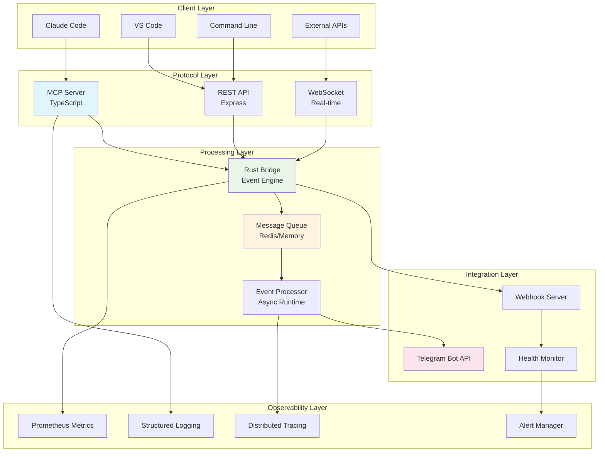

## 🔧 Component Architecture

### 1. MCP Server (TypeScript)

**Purpose**: Protocol compliance, tool registration, client-server communication

```typescript
// Core MCP Server Architecture
export class MCPServer {
  private server: Server;
  private toolHandlers: Map<string, ToolHandler>;
  private resourceProviders: Map<string, ResourceProvider>;
  private securityManager: SecurityManager;
  private bridgeClient: ResilientBridgeClient;
  
  constructor(config: MCPServerConfig) {
    this.server = new Server(
      { name: 'cctelegram-mcp-server', version: '1.8.5' },
      { capabilities: { tools: {}, resources: {} } }
    );
    this.initializeTools();
    this.setupSecurity();
  }
}
```

#### MCP Tool Architecture

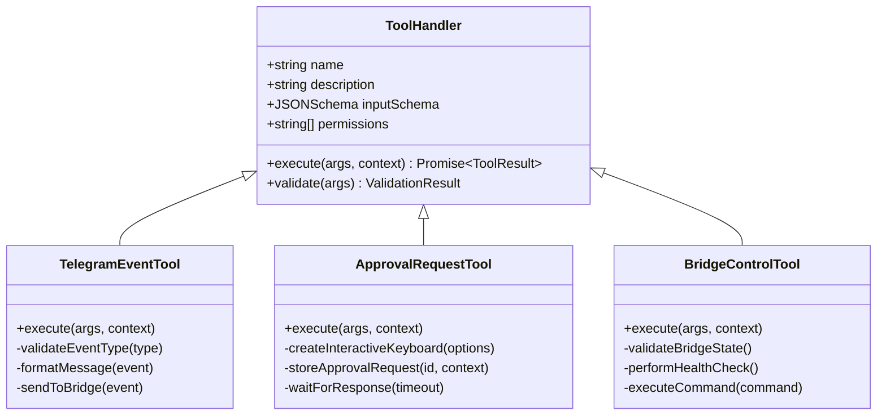

#### Tool Registration Flow

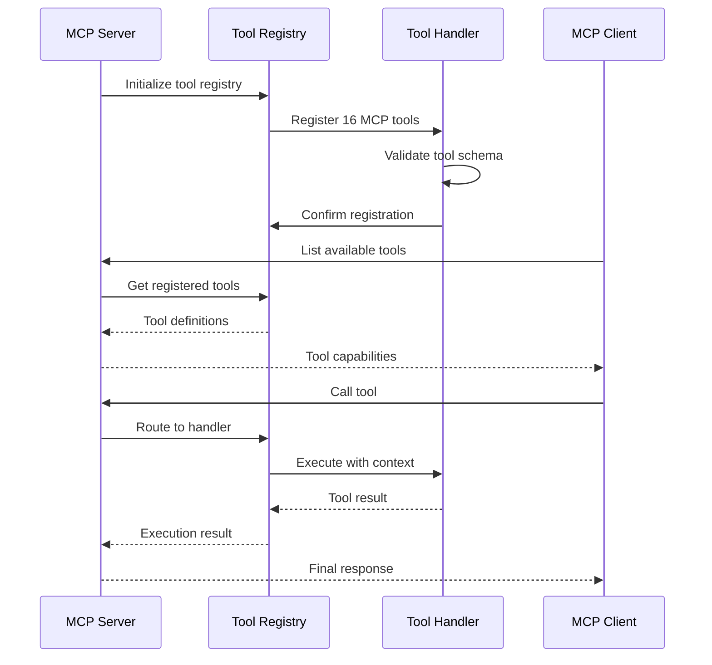

### 2. Rust Bridge (Core Engine)

**Purpose**: High-performance event processing, Telegram integration, system orchestration

```rust
// Core Bridge Architecture
pub struct CCTelegramBridge {
    config: Arc<Config>,
    event_processor: EventProcessor,
    telegram_bot: TelegramBot,
    message_queue: Arc<dyn EventQueue>,
    health_monitor: HealthMonitor,
    metrics_collector: MetricsCollector,
}

impl CCTelegramBridge {
    pub async fn new(config: Config) -> Result<Self> {
        Ok(Self {
            event_processor: EventProcessor::new(&config).await?,
            telegram_bot: TelegramBot::new(&config.telegram).await?,
            message_queue: create_queue_backend(&config.storage)?,
            // ... other components
        })
    }
    
    pub async fn process_event(&self, event: Event) -> Result<ProcessingResult> {
        // Event validation and processing pipeline
    }
}
```

#### Event Processing Pipeline

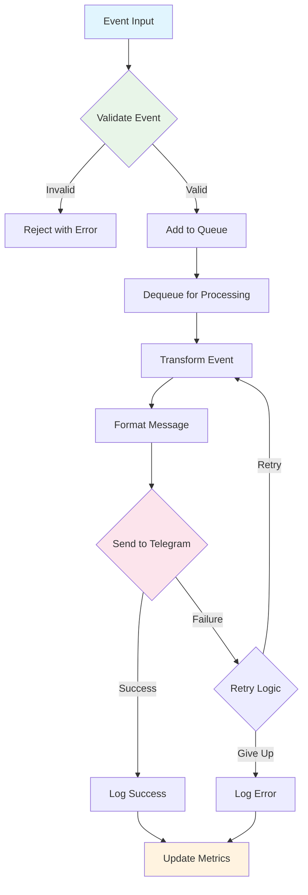

#### Module Architecture

```rust
// Module structure showing dependencies
pub mod config {
    pub struct Config;
    pub trait ConfigProvider;
}

pub mod events {
    pub use crate::config::Config;
    
    pub struct EventProcessor;
    pub struct EventWatcher;
    pub mod types;
    pub mod processor;
    pub mod queue_manager;
}

pub mod telegram {
    pub use crate::events::types::Event;
    
    pub struct TelegramBot;
    pub mod bot;
    pub mod handlers;
    pub mod messages;
    pub mod rate_limiter;
}

pub mod storage {
    pub trait EventQueue;
    pub struct FileStore;
    pub struct RedisQueue;
    pub mod compression;
}

pub mod utils {
    pub mod errors;
    pub mod performance;
    pub mod security;
    pub mod monitoring;
}
```

### 3. Security Framework

**Purpose**: Authentication, authorization, input validation, audit logging

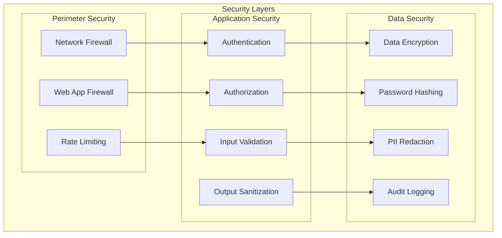

#### Security Implementation

```typescript
// Multi-layered Security Architecture
export class SecurityManager {
  private authManager: AuthenticationManager;
  private authzEngine: AuthorizationEngine;
  private validator: InputValidator;
  private auditor: AuditLogger;
  
  async processRequest(request: Request): Promise<SecurityContext> {
    // 1. Authentication
    const authResult = await this.authManager.authenticate(request);
    if (!authResult.success) {
      await this.auditor.logSecurityEvent('auth_failure', request);
      throw new SecurityError('Authentication failed');
    }
    
    // 2. Authorization  
    const authzResult = await this.authzEngine.authorize(
      authResult.context, 
      request.operation
    );
    if (!authzResult.authorized) {
      await this.auditor.logSecurityEvent('authz_failure', request);
      throw new SecurityError('Insufficient permissions');
    }
    
    // 3. Input Validation
    const validationResult = await this.validator.validate(request.data);
    if (!validationResult.valid) {
      await this.auditor.logSecurityEvent('validation_failure', request);
      throw new ValidationError(validationResult.errors);
    }
    
    return authResult.context;
  }
}
```

### 4. Observability System

**Purpose**: Comprehensive monitoring, logging, tracing, and alerting

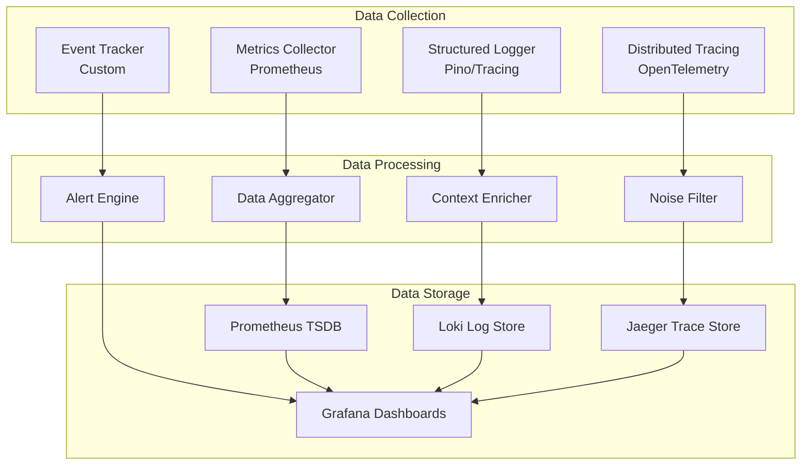

#### Observability Implementation

```typescript
// Comprehensive Observability System
export class ObservabilityManager {
  private metricsCollector: PrometheusMetrics;
  private logger: StructuredLogger;
  private tracer: OpenTelemetryTracer;
  private healthChecker: HealthChecker;
  
  constructor(config: ObservabilityConfig) {
    this.metricsCollector = new PrometheusMetrics({
      namespace: 'cctelegram',
      defaultLabels: { service: 'mcp-server' }
    });
    
    this.logger = new StructuredLogger({
      level: config.logLevel,
      redactPaths: ['password', 'token', 'secret'],
      serializers: { err: ErrorSerializer }
    });
    
    this.tracer = new OpenTelemetryTracer({
      serviceName: 'cctelegram-mcp-server',
      version: '1.8.5'
    });
  }
  
  // Instrument operation with full observability
  async instrumentOperation<T>(
    operation: string,
    fn: () => Promise<T>,
    context: OperationContext
  ): Promise<T> {
    const startTime = Date.now();
    const span = this.tracer.startSpan(operation, { context });
    
    try {
      this.logger.info(`Starting ${operation}`, { context });
      
      const result = await fn();
      
      // Record success metrics
      this.metricsCollector.incrementCounter('operations_total', {
        operation,
        status: 'success'
      });
      
      this.metricsCollector.recordHistogram('operation_duration_seconds',
        (Date.now() - startTime) / 1000,
        { operation }
      );
      
      span.setStatus({ code: SpanStatusCode.OK });
      this.logger.info(`Completed ${operation}`, { 
        context, 
        duration: Date.now() - startTime 
      });
      
      return result;
      
    } catch (error) {
      // Record failure metrics
      this.metricsCollector.incrementCounter('operations_total', {
        operation,
        status: 'error'
      });
      
      span.recordException(error as Error);
      span.setStatus({ code: SpanStatusCode.ERROR });
      
      this.logger.error(`Failed ${operation}`, { 
        context, 
        error, 
        duration: Date.now() - startTime 
      });
      
      throw error;
    } finally {
      span.end();
    }
  }
}
```

## 🔄 Data Flow Architecture

### Request Processing Pipeline

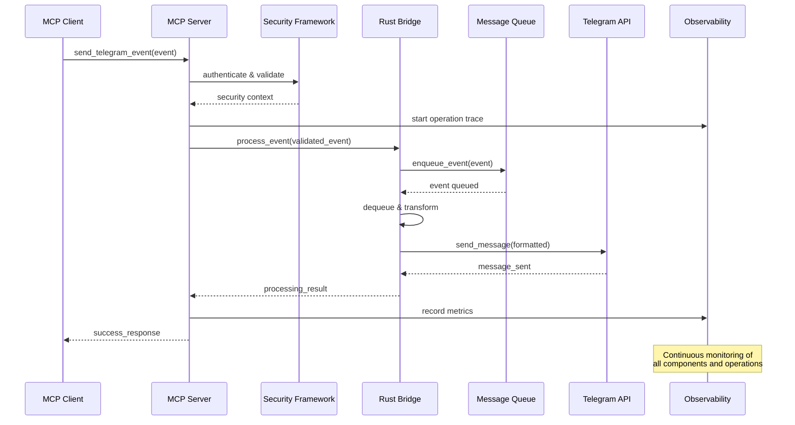

### Event Lifecycle

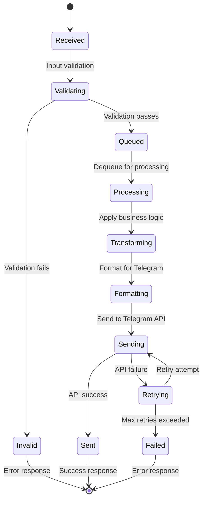

## 🏭 Deployment Architecture

### Container Architecture

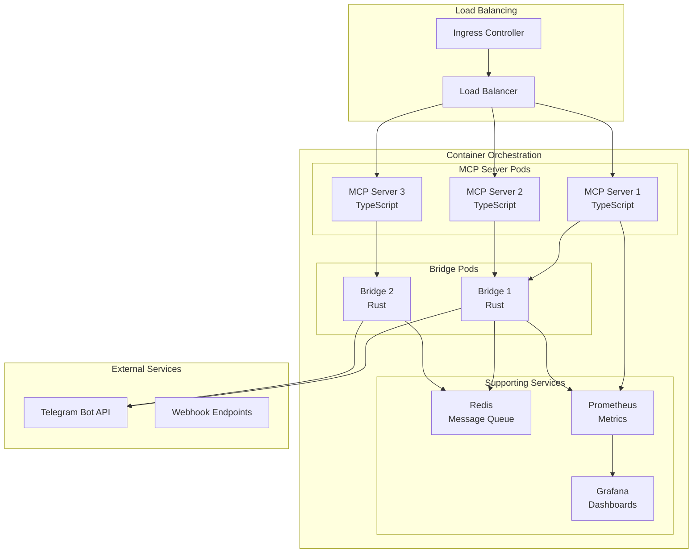

### Kubernetes Deployment

```yaml
# Complete deployment configuration
apiVersion: apps/v1
kind: Deployment
metadata:
  name: cctelegram-mcp-server
  labels:
    app: cctelegram
    component: mcp-server
spec:
  replicas: 3
  strategy:
    type: RollingUpdate
    rollingUpdate:
      maxSurge: 1
      maxUnavailable: 0
  selector:
    matchLabels:
      app: cctelegram
      component: mcp-server
  template:
    metadata:
      labels:
        app: cctelegram
        component: mcp-server
      annotations:
        prometheus.io/scrape: "true"
        prometheus.io/port: "9090"
        prometheus.io/path: "/metrics"
    spec:
      securityContext:
        runAsNonRoot: true
        runAsUser: 1001
        fsGroup: 1001
      containers:
      - name: mcp-server
        image: cctelegram/mcp-server:1.8.5
        ports:
        - name: http
          containerPort: 8080
          protocol: TCP
        - name: metrics
          containerPort: 9090
          protocol: TCP
        env:
        - name: NODE_ENV
          value: "production"
        - name: RUST_BRIDGE_URL
          value: "http://cctelegram-bridge:8080"
        - name: TELEGRAM_BOT_TOKEN
          valueFrom:
            secretKeyRef:
              name: telegram-secrets
              key: bot-token
        resources:
          requests:
            memory: "512Mi"
            cpu: "250m"
          limits:
            memory: "1Gi"
            cpu: "500m"
        livenessProbe:
          httpGet:
            path: /health
            port: 8080
          initialDelaySeconds: 30
          periodSeconds: 10
          timeoutSeconds: 5
        readinessProbe:
          httpGet:
            path: /health/ready
            port: 8080
          initialDelaySeconds: 5
          periodSeconds: 5
          timeoutSeconds: 3
        securityContext:
          allowPrivilegeEscalation: false
          readOnlyRootFilesystem: true
          capabilities:
            drop:
            - ALL
        volumeMounts:
        - name: tmp
          mountPath: /tmp
        - name: cache
          mountPath: /app/.cache
      volumes:
      - name: tmp
        emptyDir: {}
      - name: cache
        emptyDir: {}
```

## ⚡ Performance Architecture

### Scaling Strategy

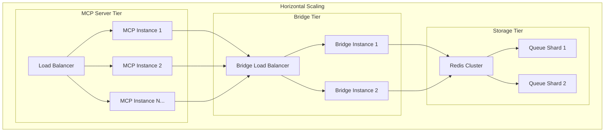

### Performance Characteristics

| Component | Metric | Current | Target | Scaling Factor |
|-----------|---------|---------|---------|----------------|
| **MCP Server** | Response Time | 450ms | <500ms | Linear with instances |
| **MCP Server** | Throughput | 800 req/min | 1000 req/min | Horizontal scaling |
| **Rust Bridge** | Processing Time | 80ms | <100ms | Async concurrency |
| **Message Queue** | Throughput | 5000 msg/min | 10000 msg/min | Queue sharding |
| **Telegram API** | Rate Limit | 30 msg/sec | 30 msg/sec | API limitation |

### Optimization Strategies

```rust
// Rust Bridge Performance Optimizations
pub struct OptimizedEventProcessor {
    // Connection pooling for external APIs
    http_client: Arc<reqwest::Client>,
    
    // Async task management
    task_semaphore: Arc<Semaphore>,
    
    // Memory-efficient queue processing
    batch_processor: BatchProcessor,
    
    // Caching layer
    cache: Arc<dyn Cache>,
}

impl OptimizedEventProcessor {
    pub async fn process_events_batch(&self, events: Vec<Event>) -> Result<Vec<ProcessingResult>> {
        // Acquire semaphore permits for concurrency control
        let _permits = self.task_semaphore.acquire_many(events.len() as u32).await?;
        
        // Process events in parallel with bounded concurrency
        let results = futures::future::try_join_all(
            events.into_iter().map(|event| {
                let cache = Arc::clone(&self.cache);
                let client = Arc::clone(&self.http_client);
                
                tokio::spawn(async move {
                    // Check cache first
                    if let Some(cached) = cache.get(&event.id).await {
                        return Ok(cached);
                    }
                    
                    // Process event
                    let result = self.process_single_event(event).await?;
                    
                    // Cache result
                    cache.set(&event.id, &result, Duration::from_secs(300)).await;
                    
                    Ok(result)
                })
            })
        ).await?;
        
        Ok(results.into_iter().collect::<Result<Vec<_>, _>>()?)
    }
}
```

## 🔒 Security Architecture

### Defense in Depth

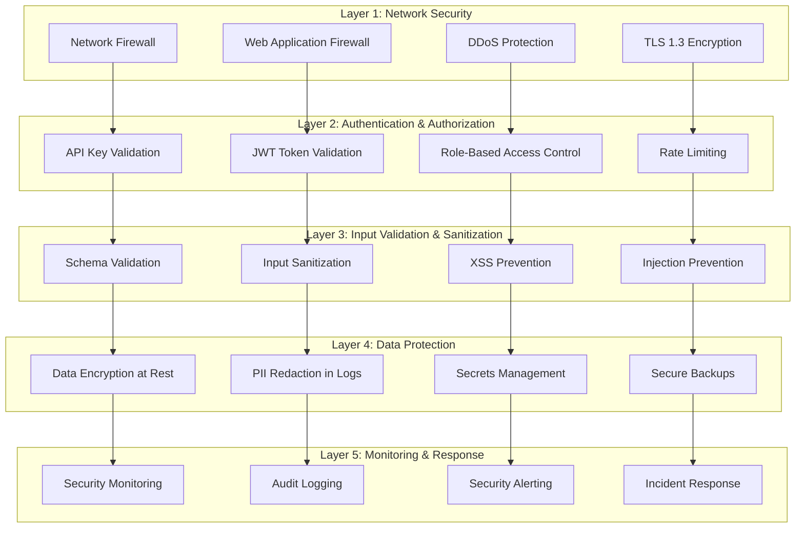

### Security Implementation Details

```typescript
// Comprehensive Security Framework
export class ComprehensiveSecurityManager {
  private authenticationLayer: AuthenticationLayer;
  private authorizationLayer: AuthorizationLayer;
  private validationLayer: ValidationLayer;
  private encryptionLayer: EncryptionLayer;
  private auditLayer: AuditLayer;
  
  async secureRequest(request: IncomingRequest): Promise<SecureContext> {
    // Layer 1: Authentication
    const authContext = await this.authenticationLayer.authenticate(request);
    if (!authContext.authenticated) {
      await this.auditLayer.logSecurityEvent('authentication_failure', {
        ip: request.ip,
        userAgent: request.userAgent,
        timestamp: new Date().toISOString()
      });
      throw new AuthenticationError('Invalid credentials');
    }
    
    // Layer 2: Authorization
    const authzResult = await this.authorizationLayer.authorize(
      authContext.user,
      request.resource,
      request.action
    );
    if (!authzResult.authorized) {
      await this.auditLayer.logSecurityEvent('authorization_failure', {
        user: authContext.user.id,
        resource: request.resource,
        action: request.action,
        timestamp: new Date().toISOString()
      });
      throw new AuthorizationError('Insufficient permissions');
    }
    
    // Layer 3: Input Validation
    const validationResult = await this.validationLayer.validate(
      request.data,
      request.schema
    );
    if (!validationResult.valid) {
      await this.auditLayer.logSecurityEvent('validation_failure', {
        user: authContext.user.id,
        errors: validationResult.errors,
        timestamp: new Date().toISOString()
      });
      throw new ValidationError(validationResult.errors);
    }
    
    return {
      user: authContext.user,
      permissions: authzResult.permissions,
      validatedData: validationResult.data,
      sessionId: authContext.sessionId
    };
  }
}
```

## 🔄 Integration Patterns

### MCP Client Integration

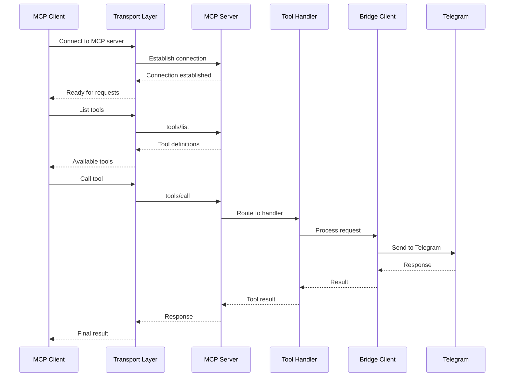

### Task Management Integration

```typescript
// TaskMaster Integration Example
export class TaskMasterCCTelegramIntegration {
  private mcpClient: MCPClient;
  private eventMapper: EventMapper;
  
  constructor(mcpServerPath: string) {
    this.mcpClient = new MCPClient({
      transport: new StdioClientTransport({
        command: 'npx',
        args: ['-y', 'cctelegram-mcp-server']
      })
    });
  }
  
  // Task lifecycle integration
  async onTaskStarted(task: Task): Promise<void> {
    await this.mcpClient.callTool('send_telegram_event', {
      type: 'task_started',
      task_id: task.id,
      title: `Started: ${task.title}`,
      description: task.description,
      source: 'taskmaster',
      data: {
        priority: task.priority,
        estimated_duration: task.estimatedDuration,
        dependencies: task.dependencies
      }
    });
  }
  
  async onTaskCompleted(task: Task, result: TaskResult): Promise<void> {
    await this.mcpClient.callTool('send_task_completion', {
      task_id: task.id,
      title: task.title,
      results: result.summary,
      files_affected: result.filesModified,
      duration_ms: result.actualDuration
    });
  }
  
  async requestTaskApproval(task: Task): Promise<ApprovalResult> {
    const approvalRequest = await this.mcpClient.callTool('send_approval_request', {
      title: `Approval Required: ${task.title}`,
      description: `Task: ${task.description}\n\nEstimated impact: ${task.impact}`,
      options: ['Approve', 'Reject', 'Request Changes', 'Defer']
    });
    
    // Wait for user response
    return this.waitForApproval(approvalRequest.event_id, {
      timeout: 300000, // 5 minutes
      retryInterval: 5000 // Check every 5 seconds
    });
  }
  
  private async waitForApproval(
    eventId: string, 
    options: { timeout: number; retryInterval: number }
  ): Promise<ApprovalResult> {
    const startTime = Date.now();
    
    while (Date.now() - startTime < options.timeout) {
      const responses = await this.mcpClient.callTool('get_telegram_responses', {
        limit: 50
      });
      
      const approval = responses.responses.find(
        (r: any) => r.event_id === eventId
      );
      
      if (approval) {
        return {
          approved: approval.action === 'Approve',
          action: approval.action,
          timestamp: approval.timestamp,
          userId: approval.user_id
        };
      }
      
      await new Promise(resolve => setTimeout(resolve, options.retryInterval));
    }
    
    throw new TimeoutError(`Approval timeout after ${options.timeout}ms`);
  }
}
```

## 📊 Monitoring Architecture

### Comprehensive Observability Dashboard

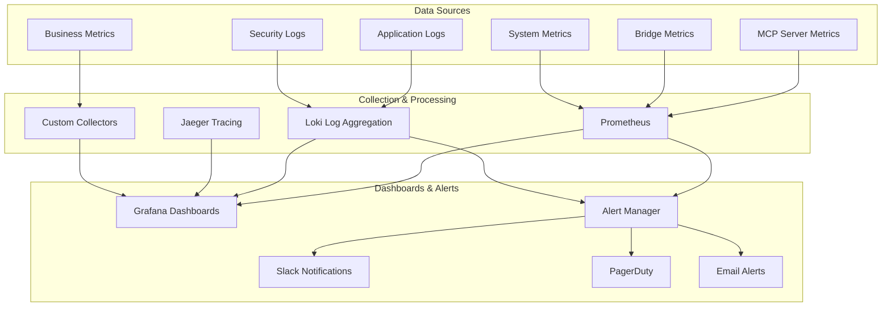

### Key Performance Indicators (KPIs)

```yaml
# Performance KPIs
performance_metrics:
  response_time:
    p50: "<200ms"
    p95: "<500ms"
    p99: "<1000ms"
  throughput:
    events_per_minute: ">1000"
    concurrent_users: ">100"
  error_rate:
    total_errors: "<0.1%"
    critical_errors: "<0.01%"

# Reliability KPIs  
reliability_metrics:
  availability: ">99.9%"
  recovery_time: "<15min"
  data_durability: "100%"

# Security KPIs
security_metrics:
  auth_failure_rate: "<1%"
  vulnerability_count: "0 critical, 0 high"
  security_scan_frequency: "daily"

# Business KPIs
business_metrics:
  message_delivery_rate: ">99.5%"
  user_satisfaction: ">4.5/5"
  api_adoption: "increasing"
```

## 🚀 Future Architecture Evolution

### Microservices Migration Path

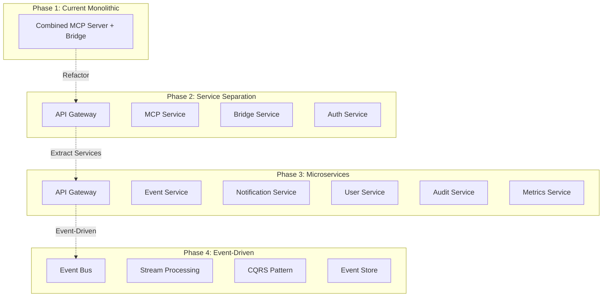

### Technology Roadmap

| Phase | Timeline | Focus Areas | Technologies |
|-------|----------|-------------|-------------|
| **Q1 2025** | Security Hardening | Enhanced auth, RBAC, audit | OAuth2, RBAC, SIEM |
| **Q2 2025** | Performance | Caching, pooling, async | Redis, HTTP/2, gRPC |
| **Q3 2025** | Observability | Tracing, APM, custom metrics | OpenTelemetry, APM |
| **Q4 2025** | Microservices | Service mesh, event sourcing | Istio, NATS, EventStore |
| **2026+** | AI/ML Integration | Intelligent routing, prediction | TensorFlow, MLOps |

---

## 📋 Architecture Decisions

### Key Design Decisions

1. **Dual-Language Architecture**: TypeScript for MCP compliance + Rust for performance
2. **Event-Driven Processing**: Async message queue for scalability
3. **Security by Design**: Multi-layered security from inception
4. **Observability First**: Comprehensive monitoring built-in
5. **Container-Native**: Docker + Kubernetes for deployment

### Trade-offs and Rationale

| Decision | Trade-off | Rationale |
|----------|-----------|-----------|
| TypeScript + Rust | Complexity vs Performance | MCP compliance + high-performance processing |
| HTTP vs gRPC | Simplicity vs Efficiency | HTTP for debugging, gRPC for internal communication |
| Redis vs In-Memory | Durability vs Speed | Redis for persistence, in-memory for development |
| Monolith vs Microservices | Development Speed vs Scalability | Monolith first, microservices evolution |

**Ready to contribute?** Review specific component documentation and follow our [Contributing Guide](./contributing.md) for detailed development procedures.

**Need API details?** Check our [API Reference](./api-reference.md) for comprehensive tool and endpoint documentation.