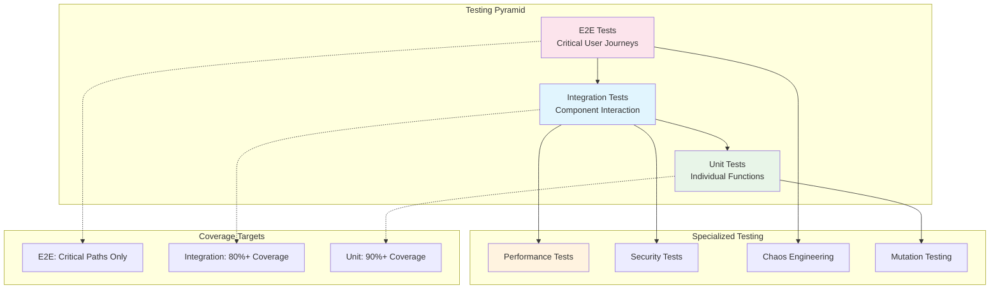
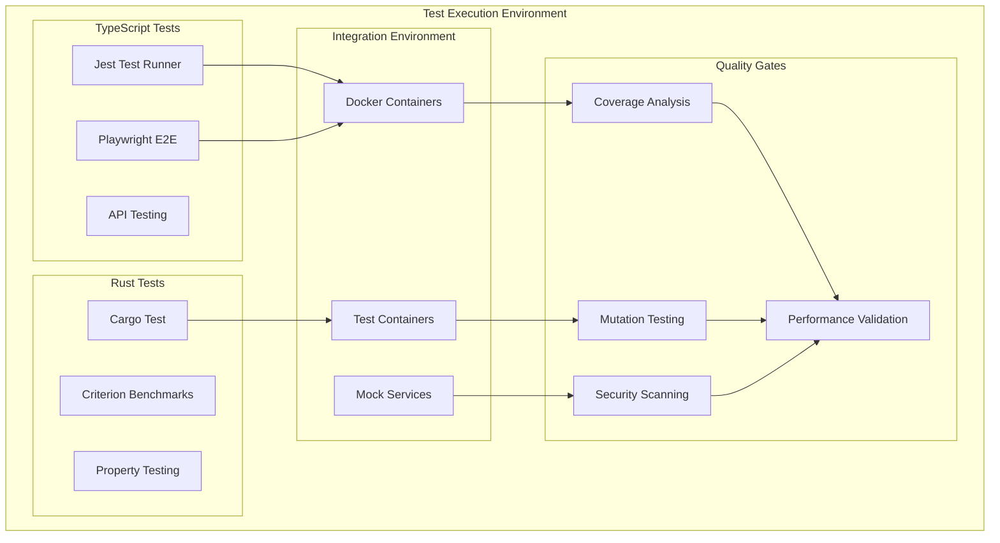
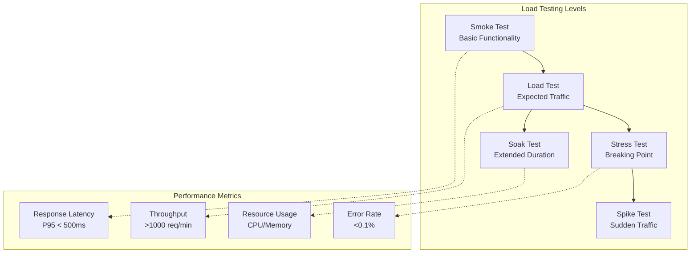

# CCTelegram Testing Guide

**Comprehensive testing procedures** with CI/CD pipeline visuals, testing strategies, and quality assurance frameworks.

## 🎯 Testing Overview

CCTelegram employs a multi-layered testing strategy ensuring reliability, performance, and security across both TypeScript MCP server and Rust bridge components.

### Testing Pyramid



### Test Architecture



## 🧪 Unit Testing

### TypeScript Unit Testing

#### Test Structure and Patterns

```typescript
// Example: MCP Tool Testing
import { MCPServer } from '../src/index';
import { MockBridgeClient } from './mocks/bridge-client.mock';
import { createMockSecurityContext } from './fixtures/security.fixture';

describe('MCP Server - Telegram Event Tool', () => {
  let server: MCPServer;
  let mockBridgeClient: jest.Mocked<MockBridgeClient>;
  let securityContext: SecurityContext;
  
  beforeEach(async () => {
    mockBridgeClient = new MockBridgeClient();
    server = new MCPServer({
      bridgeClient: mockBridgeClient,
      security: { enabled: true }
    });
    securityContext = createMockSecurityContext({
      permissions: ['telegram:send', 'events:create']
    });
  });
  
  describe('send_telegram_event', () => {
    it('should successfully process valid event', async () => {
      // Arrange
      const eventArgs = {
        type: 'task_completion',
        title: 'Test Task Complete',
        description: 'Task completed successfully',
        data: {
          duration_ms: 5000,
          success: true
        }
      };
      
      mockBridgeClient.sendEvent.mockResolvedValue({
        success: true,
        event_id: 'test-event-123',
        telegram_message_id: 456
      });
      
      // Act
      const result = await server.callTool(
        'send_telegram_event',
        eventArgs,
        securityContext
      );
      
      // Assert
      expect(result.success).toBe(true);
      expect(result.data.event_id).toBe('test-event-123');
      expect(mockBridgeClient.sendEvent).toHaveBeenCalledWith(
        expect.objectContaining({
          type: 'task_completion',
          title: 'Test Task Complete',
          source: 'claude-code'
        })
      );
    });
    
    it('should handle bridge communication failures gracefully', async () => {
      // Arrange
      const eventArgs = {
        type: 'task_completion',
        title: 'Test Task',
        description: 'Test description'
      };
      
      mockBridgeClient.sendEvent.mockRejectedValue(
        new Error('Bridge connection timeout')
      );
      
      // Act
      const result = await server.callTool(
        'send_telegram_event',
        eventArgs,
        securityContext
      );
      
      // Assert
      expect(result.success).toBe(false);
      expect(result.error).toMatch(/Bridge connection timeout/);
      expect(result.data.retry_suggested).toBe(true);
    });
    
    it('should validate event type against allowed values', async () => {
      // Arrange
      const invalidEventArgs = {
        type: 'invalid_event_type',
        title: 'Test',
        description: 'Test'
      };
      
      // Act
      const result = await server.callTool(
        'send_telegram_event',
        invalidEventArgs,
        securityContext
      );
      
      // Assert
      expect(result.success).toBe(false);
      expect(result.error).toMatch(/Invalid event type/);
      expect(result.data.validation_errors).toContainEqual({
        field: 'type',
        message: 'Event type "invalid_event_type" is not supported'
      });
    });
    
    it('should enforce security permissions', async () => {
      // Arrange
      const restrictedContext = createMockSecurityContext({
        permissions: [] // No permissions
      });
      
      const eventArgs = {
        type: 'task_completion',
        title: 'Test',
        description: 'Test'
      };
      
      // Act
      const result = await server.callTool(
        'send_telegram_event',
        eventArgs,
        restrictedContext
      );
      
      // Assert
      expect(result.success).toBe(false);
      expect(result.error).toMatch(/Insufficient permissions/);
    });
  });
  
  describe('Performance and Error Handling', () => {
    it('should complete tool calls within performance budget', async () => {
      const startTime = Date.now();
      
      await server.callTool('get_bridge_status', {}, securityContext);
      
      const duration = Date.now() - startTime;
      expect(duration).toBeLessThan(500); // 500ms budget
    });
    
    it('should handle concurrent tool calls safely', async () => {
      const promises = Array.from({ length: 10 }, (_, i) =>
        server.callTool('send_telegram_event', {
          type: 'task_completion',
          title: `Concurrent Task ${i}`,
          description: `Task ${i} description`
        }, securityContext)
      );
      
      const results = await Promise.allSettled(promises);
      const successful = results.filter(r => r.status === 'fulfilled').length;
      
      expect(successful).toBe(10);
    });
  });
});
```

#### Test Utilities and Fixtures

```typescript
// test/fixtures/event-fixtures.ts
export const createMockEvent = (overrides: Partial<CCTelegramEvent> = {}): CCTelegramEvent => ({
  type: 'task_completion',
  source: 'test-suite',
  timestamp: new Date().toISOString(),
  task_id: 'test-task-123',
  title: 'Test Event',
  description: 'Test event description',
  data: {
    duration_ms: 1000,
    success: true
  },
  ...overrides
});

export const createMockBridgeResponse = (
  overrides: Partial<BridgeResponse> = {}
): BridgeResponse => ({
  success: true,
  event_id: 'evt-' + Math.random().toString(36).substr(2, 9),
  telegram_message_id: Math.floor(Math.random() * 10000),
  processing_time_ms: 50,
  ...overrides
});

// test/mocks/bridge-client.mock.ts
export class MockBridgeClient implements CCTelegramBridgeClient {
  sendEvent = jest.fn();
  getBridgeStatus = jest.fn();
  startBridge = jest.fn();
  stopBridge = jest.fn();
  restartBridge = jest.fn();
  getTelegramResponses = jest.fn();
  
  constructor() {
    // Default successful responses
    this.sendEvent.mockResolvedValue(createMockBridgeResponse());
    this.getBridgeStatus.mockResolvedValue({
      running: true,
      health: 'healthy',
      metrics: {
        uptime_seconds: 3600,
        events_processed: 100,
        telegram_messages_sent: 95,
        error_count: 0
      }
    });
  }
  
  reset(): void {
    jest.clearAllMocks();
  }
}
```

### Rust Unit Testing

#### Test Structure and Patterns

```rust
// src/events/processor.rs tests
#[cfg(test)]
mod tests {
    use super::*;
    use tokio_test;
    use tempfile::TempDir;
    use crate::test_utils::*;
    
    #[tokio::test]
    async fn test_event_processing_success() {
        // Arrange
        let temp_dir = TempDir::new().unwrap();
        let config = create_test_config(&temp_dir);
        let processor = EventProcessor::new(&config).await.unwrap();
        let event = create_mock_event();
        
        // Act
        let result = processor.process_event(&event).await;
        
        // Assert
        assert!(result.is_ok());
        let processing_result = result.unwrap();
        assert_eq!(processing_result.status, ProcessingStatus::Success);
        assert!(processing_result.processing_time_ms > 0);
        assert!(processing_result.processing_time_ms < 1000); // Performance check
    }
    
    #[tokio::test]
    async fn test_event_processing_with_invalid_data() {
        let temp_dir = TempDir::new().unwrap();
        let config = create_test_config(&temp_dir);
        let processor = EventProcessor::new(&config).await.unwrap();
        
        let invalid_event = Event {
            id: "".to_string(), // Invalid empty ID
            event_type: EventType::TaskCompletion,
            title: "".to_string(), // Invalid empty title
            description: "Test".to_string(),
            source: "test".to_string(),
            task_id: None,
            data: EventData::default(),
            timestamp: chrono::Utc::now(),
        };
        
        let result = processor.process_event(&invalid_event).await;
        
        assert!(result.is_err());
        assert!(result.unwrap_err().to_string().contains("validation"));
    }
    
    #[tokio::test]
    async fn test_batch_event_processing() {
        let temp_dir = TempDir::new().unwrap();
        let config = create_test_config(&temp_dir);
        let processor = EventProcessor::new(&config).await.unwrap();
        
        let events = (0..10)
            .map(|i| create_mock_event_with_id(&format!("batch-event-{}", i)))
            .collect();
        
        let results = processor.process_events_batch(events).await.unwrap();
        
        assert_eq!(results.len(), 10);
        for result in results {
            assert_eq!(result.status, ProcessingStatus::Success);
        }
    }
    
    #[tokio::test]
    async fn test_queue_integration() {
        let temp_dir = TempDir::new().unwrap();
        let config = create_test_config(&temp_dir);
        let queue = create_test_queue(&config).await.unwrap();
        
        let event = create_mock_event();
        
        // Test enqueue
        queue.enqueue(event.clone()).await.unwrap();
        assert_eq!(queue.size().await.unwrap(), 1);
        
        // Test dequeue
        let dequeued = queue.dequeue().await.unwrap();
        assert!(dequeued.is_some());
        assert_eq!(dequeued.unwrap().id, event.id);
        assert_eq!(queue.size().await.unwrap(), 0);
    }
}

// Property-based testing with proptest
#[cfg(test)]
mod property_tests {
    use super::*;
    use proptest::prelude::*;
    
    proptest! {
        #[test]
        fn event_serialization_roundtrip(
            event_type in prop::sample::select(vec![
                EventType::TaskCompletion,
                EventType::TaskStarted,
                EventType::CodeGeneration
            ]),
            title in "[a-zA-Z0-9 ]{1,100}",
            description in "[a-zA-Z0-9 .,!?]{1,500}"
        ) {
            let event = Event {
                id: uuid::Uuid::new_v4().to_string(),
                event_type,
                title,
                description,
                source: "proptest".to_string(),
                task_id: None,
                data: EventData::default(),
                timestamp: chrono::Utc::now(),
            };
            
            // Test JSON serialization roundtrip
            let json = serde_json::to_string(&event).unwrap();
            let deserialized: Event = serde_json::from_str(&json).unwrap();
            
            assert_eq!(event.id, deserialized.id);
            assert_eq!(event.title, deserialized.title);
            assert_eq!(event.description, deserialized.description);
        }
    }
}
```

#### Performance and Memory Testing

```rust
// Benchmark tests using Criterion
use criterion::{black_box, criterion_group, criterion_main, Criterion};
use cctelegram_bridge::*;

fn benchmark_event_processing(c: &mut Criterion) {
    let rt = tokio::runtime::Runtime::new().unwrap();
    
    c.bench_function("event_processing_single", |b| {
        b.iter(|| {
            rt.block_on(async {
                let processor = create_test_processor().await;
                let event = create_mock_event();
                
                let result = processor.process_event(black_box(&event)).await;
                black_box(result)
            })
        })
    });
    
    c.bench_function("event_processing_batch_10", |b| {
        b.iter(|| {
            rt.block_on(async {
                let processor = create_test_processor().await;
                let events = (0..10).map(|_| create_mock_event()).collect();
                
                let result = processor.process_events_batch(black_box(events)).await;
                black_box(result)
            })
        })
    });
}

criterion_group!(benches, benchmark_event_processing);
criterion_main!(benches);

// Memory leak detection
#[tokio::test]
async fn test_memory_usage_stability() {
    let initial_memory = get_memory_usage();
    let processor = create_test_processor().await;
    
    // Process many events
    for _ in 0..1000 {
        let event = create_mock_event();
        processor.process_event(&event).await.unwrap();
    }
    
    // Force garbage collection
    tokio::task::yield_now().await;
    
    let final_memory = get_memory_usage();
    let memory_growth = final_memory - initial_memory;
    
    // Memory growth should be bounded
    assert!(memory_growth < 100_000_000, "Memory leak detected: {} bytes", memory_growth);
}
```

## 🔗 Integration Testing

### Cross-Component Integration

```typescript
// tests/integration/mcp-server.integration.test.ts
import { MCPServer } from '../../src/index';
import { CCTelegramBridge } from '../helpers/test-bridge';
import { TestEnvironment } from '../setup/test-environment';

describe('MCP Server Integration Tests', () => {
  let testEnv: TestEnvironment;
  let mcpServer: MCPServer;
  let bridge: CCTelegramBridge;
  
  beforeAll(async () => {
    testEnv = await TestEnvironment.setup({
      components: ['mcp-server', 'bridge', 'redis'],
      telegram: { mockBot: true },
      logging: { level: 'debug' }
    });
    
    mcpServer = testEnv.getMCPServer();
    bridge = testEnv.getBridge();
  });
  
  afterAll(async () => {
    await testEnv.teardown();
  });
  
  describe('End-to-End Event Processing', () => {
    it('should process event from MCP tool to Telegram delivery', async () => {
      // Arrange
      const eventData = {
        type: 'task_completion',
        title: 'Integration Test Task',
        description: 'Testing end-to-end event processing',
        data: {
          duration_ms: 2500,
          files_affected: ['test/integration.test.ts']
        }
      };
      
      // Act
      const mcpResult = await mcpServer.callTool('send_telegram_event', eventData);
      
      // Wait for bridge processing
      await testEnv.waitForEventProcessing(mcpResult.data.event_id);
      
      // Assert
      expect(mcpResult.success).toBe(true);
      
      const bridgeStatus = await bridge.getStatus();
      expect(bridgeStatus.metrics.events_processed).toBeGreaterThan(0);
      
      const telegramMessages = await testEnv.getTelegramMessages();
      expect(telegramMessages).toHaveLength(1);
      expect(telegramMessages[0].text).toContain('Integration Test Task');
    });
    
    it('should handle approval workflow end-to-end', async () => {
      // Send approval request
      const approvalResult = await mcpServer.callTool('send_approval_request', {
        title: 'Integration Test Approval',
        description: 'Please approve this integration test',
        options: ['Approve', 'Reject']
      });
      
      expect(approvalResult.success).toBe(true);
      const eventId = approvalResult.data.event_id;
      
      // Simulate user response
      await testEnv.simulateUserResponse(eventId, 'Approve', { user_id: 12345 });
      
      // Retrieve responses
      const responses = await mcpServer.callTool('get_telegram_responses');
      const approval = responses.data.responses.find(r => r.event_id === eventId);
      
      expect(approval).toBeDefined();
      expect(approval.action).toBe('Approve');
      expect(approval.user_id).toBe(12345);
    });
  });
  
  describe('Error Handling and Recovery', () => {
    it('should handle bridge unavailability gracefully', async () => {
      // Stop bridge
      await testEnv.stopComponent('bridge');
      
      // Attempt to send event
      const result = await mcpServer.callTool('send_telegram_event', {
        type: 'task_completion',
        title: 'Test During Outage',
        description: 'Should handle bridge being down'
      });
      
      expect(result.success).toBe(false);
      expect(result.error).toMatch(/bridge.*unavailable/i);
      
      // Restart bridge
      await testEnv.startComponent('bridge');
      
      // Verify recovery
      const statusResult = await mcpServer.callTool('get_bridge_status');
      expect(statusResult.success).toBe(true);
      expect(statusResult.data.running).toBe(true);
    });
  });
  
  describe('Performance Under Load', () => {
    it('should maintain performance under concurrent load', async () => {
      const concurrentRequests = 50;
      const startTime = Date.now();
      
      const promises = Array.from({ length: concurrentRequests }, (_, i) =>
        mcpServer.callTool('send_telegram_event', {
          type: 'task_completion',
          title: `Load Test Event ${i}`,
          description: `Concurrent event ${i} for load testing`
        })
      );
      
      const results = await Promise.allSettled(promises);
      const duration = Date.now() - startTime;
      
      const successful = results.filter(r => 
        r.status === 'fulfilled' && r.value.success
      ).length;
      
      expect(successful).toBeGreaterThanOrEqual(concurrentRequests * 0.95); // 95% success rate
      expect(duration).toBeLessThan(10000); // Complete within 10 seconds
      
      const avgResponseTime = duration / concurrentRequests;
      expect(avgResponseTime).toBeLessThan(500); // Average under 500ms
    });
  });
});
```

### Database Integration Testing

```rust
// tests/integration/storage_integration.rs
use cctelegram_bridge::storage::*;
use testcontainers::*;
use redis::Client;

#[tokio::test]
async fn test_redis_queue_integration() {
    // Start Redis container
    let docker = clients::Cli::default();
    let redis_container = docker.run(images::redis::Redis::default());
    let redis_port = redis_container.get_host_port_ipv4(6379);
    
    let redis_url = format!("redis://127.0.0.1:{}", redis_port);
    let queue = RedisEventQueue::new(&redis_url).await.unwrap();
    
    // Test queue operations
    let event = create_test_event();
    
    // Enqueue event
    queue.enqueue(event.clone()).await.unwrap();
    assert_eq!(queue.size().await.unwrap(), 1);
    
    // Dequeue event
    let dequeued = queue.dequeue().await.unwrap();
    assert!(dequeued.is_some());
    assert_eq!(dequeued.unwrap().id, event.id);
    assert_eq!(queue.size().await.unwrap(), 0);
    
    // Test batch operations
    let batch_events = (0..5).map(|i| create_test_event_with_id(&format!("batch-{}", i))).collect();
    queue.enqueue_batch(batch_events).await.unwrap();
    assert_eq!(queue.size().await.unwrap(), 5);
    
    let dequeued_batch = queue.dequeue_batch(3).await.unwrap();
    assert_eq!(dequeued_batch.len(), 3);
    assert_eq!(queue.size().await.unwrap(), 2);
}

#[tokio::test]
async fn test_file_storage_integration() {
    let temp_dir = tempfile::TempDir::new().unwrap();
    let file_store = FileStore::new(temp_dir.path()).await.unwrap();
    
    let event = create_test_event();
    let event_id = &event.id;
    
    // Store event
    file_store.store_event(&event).await.unwrap();
    
    // Retrieve event
    let retrieved = file_store.get_event(event_id).await.unwrap();
    assert!(retrieved.is_some());
    assert_eq!(retrieved.unwrap().id, event.id);
    
    // Test file compression
    let large_event = create_large_test_event(1024 * 1024); // 1MB event
    file_store.store_event(&large_event).await.unwrap();
    
    let file_path = file_store.get_event_file_path(&large_event.id);
    let file_size = std::fs::metadata(&file_path).unwrap().len();
    
    // Compressed size should be significantly smaller
    assert!(file_size < 1024 * 512, "File should be compressed: {} bytes", file_size);
}
```

## 🚀 End-to-End Testing

### Playwright E2E Testing

```typescript
// tests/e2e/telegram-integration.e2e.test.ts
import { test, expect } from '@playwright/test';
import { TestEnvironment } from '../setup/test-environment';
import { TelegramBotSimulator } from '../utils/telegram-bot-simulator';

test.describe('Telegram Integration E2E', () => {
  let testEnv: TestEnvironment;
  let telegramBot: TelegramBotSimulator;
  
  test.beforeAll(async () => {
    testEnv = await TestEnvironment.setup({
      components: ['mcp-server', 'bridge', 'telegram-mock'],
      realTelegram: false
    });
    
    telegramBot = testEnv.getTelegramBot();
  });
  
  test.afterAll(async () => {
    await testEnv.teardown();
  });
  
  test('should complete full task notification workflow', async () => {
    // Simulate task completion event from Claude Code
    const eventResponse = await testEnv.sendMCPEvent({
      type: 'task_completion',
      title: 'E2E Test Task Complete',
      description: 'End-to-end testing task completed successfully',
      data: {
        duration_ms: 15000,
        files_affected: ['src/main.rs', 'tests/e2e.test.ts'],
        results: 'All tests passed, no issues found'
      }
    });
    
    expect(eventResponse.success).toBe(true);
    
    // Wait for message to appear in Telegram
    await telegramBot.waitForMessage({
      text: /E2E Test Task Complete/,
      timeout: 5000
    });
    
    const messages = await telegramBot.getMessages();
    const taskMessage = messages.find(m => m.text.includes('E2E Test Task Complete'));
    
    expect(taskMessage).toBeDefined();
    expect(taskMessage.text).toContain('15000ms');
    expect(taskMessage.text).toContain('src/main.rs');
    expect(taskMessage.parse_mode).toBe('Markdown');
  });
  
  test('should handle interactive approval flow', async ({ page }) => {
    // Send approval request
    const approvalResponse = await testEnv.sendMCPEvent({
      type: 'approval_request',
      title: 'E2E Deployment Approval',
      description: 'Deploy version 1.0.0 to production?',
      options: ['✅ Deploy', '❌ Cancel', '⏸️ Defer']
    });
    
    expect(approvalResponse.success).toBe(true);
    
    // Wait for interactive message
    const interactiveMessage = await telegramBot.waitForInteractiveMessage({
      text: /E2E Deployment Approval/,
      hasButtons: true,
      timeout: 5000
    });
    
    expect(interactiveMessage.reply_markup).toBeDefined();
    expect(interactiveMessage.reply_markup.inline_keyboard).toHaveLength(1);
    expect(interactiveMessage.reply_markup.inline_keyboard[0]).toHaveLength(3);
    
    // Simulate user clicking "Deploy" button
    await telegramBot.clickButton(interactiveMessage.message_id, '✅ Deploy');
    
    // Wait for response to be processed
    await testEnv.waitForApprovalProcessing(approvalResponse.data.event_id);
    
    // Verify response was stored
    const responses = await testEnv.getMCPServer().callTool('get_telegram_responses');
    const approval = responses.data.responses.find(
      r => r.event_id === approvalResponse.data.event_id
    );
    
    expect(approval).toBeDefined();
    expect(approval.action).toBe('✅ Deploy');
  });
  
  test('should maintain performance under realistic load', async () => {
    const eventCount = 100;
    const batchSize = 10;
    const startTime = Date.now();
    
    // Send events in batches to simulate realistic usage
    for (let batch = 0; batch < eventCount / batchSize; batch++) {
      const batchPromises = Array.from({ length: batchSize }, (_, i) => 
        testEnv.sendMCPEvent({
          type: 'code_analysis',
          title: `Analysis Task ${batch * batchSize + i}`,
          description: `Code analysis task ${batch * batchSize + i} completed`,
          data: { duration_ms: Math.random() * 5000 }
        })
      );
      
      await Promise.all(batchPromises);
      
      // Small delay between batches
      await new Promise(resolve => setTimeout(resolve, 100));
    }
    
    const processingTime = Date.now() - startTime;
    
    // Wait for all messages to be delivered
    await telegramBot.waitForMessageCount(eventCount, { timeout: 30000 });
    
    const totalTime = Date.now() - startTime;
    const messages = await telegramBot.getMessages();
    
    expect(messages).toHaveLength(eventCount);
    expect(totalTime).toBeLessThan(60000); // Complete within 1 minute
    expect(processingTime / eventCount).toBeLessThan(200); // Avg 200ms per event
  });
});
```

### Cross-Browser Testing

```typescript
// playwright.config.ts
import { defineConfig, devices } from '@playwright/test';

export default defineConfig({
  testDir: './tests/e2e',
  fullyParallel: true,
  forbidOnly: !!process.env.CI,
  retries: process.env.CI ? 2 : 0,
  workers: process.env.CI ? 1 : undefined,
  reporter: [
    ['html'],
    ['json', { outputFile: 'test-results/results.json' }],
    ['junit', { outputFile: 'test-results/junit.xml' }]
  ],
  use: {
    baseURL: 'http://localhost:8080',
    trace: 'on-first-retry',
    video: 'retain-on-failure',
    screenshot: 'only-on-failure'
  },
  projects: [
    // Desktop Browsers
    {
      name: 'Chrome Desktop',
      use: { ...devices['Desktop Chrome'] }
    },
    {
      name: 'Firefox Desktop', 
      use: { ...devices['Desktop Firefox'] }
    },
    {
      name: 'Safari Desktop',
      use: { ...devices['Desktop Safari'] }
    },
    // Mobile Browsers
    {
      name: 'Chrome Mobile',
      use: { ...devices['Pixel 5'] }
    },
    {
      name: 'Safari Mobile',
      use: { ...devices['iPhone 12'] }
    }
  ],
  webServer: {
    command: 'npm run start:test',
    port: 8080,
    reuseExistingServer: !process.env.CI
  }
});
```

## ⚡ Performance Testing

### Load Testing Strategy



### K6 Load Testing

```javascript
// tests/performance/k6/load-test.js
import http from 'k6/http';
import { check, sleep } from 'k6';
import { Rate, Trend } from 'k6/metrics';

// Custom metrics
const errorRate = new Rate('errors');
const eventProcessingTime = new Trend('event_processing_time', true);

// Test configuration
export const options = {
  stages: [
    { duration: '2m', target: 10 },   // Ramp up
    { duration: '5m', target: 50 },   // Stay at 50 users
    { duration: '2m', target: 100 },  // Ramp to 100 users
    { duration: '5m', target: 100 },  // Stay at 100 users
    { duration: '2m', target: 0 },    // Ramp down
  ],
  thresholds: {
    http_req_duration: ['p(95)<500'], // 95% of requests under 500ms
    http_req_failed: ['rate<0.01'],   // Error rate under 1%
    errors: ['rate<0.01'],
    event_processing_time: ['p(95)<1000'],
  },
};

const BASE_URL = __ENV.BASE_URL || 'http://localhost:8080';
const API_KEY = __ENV.API_KEY || 'test-api-key';

export function setup() {
  // Setup test data
  return {
    apiKey: API_KEY,
    eventTypes: [
      'task_completion',
      'task_started', 
      'code_analysis',
      'build_completed'
    ]
  };
}

export default function(data) {
  // Select random event type
  const eventType = data.eventTypes[Math.floor(Math.random() * data.eventTypes.length)];
  
  const payload = JSON.stringify({
    type: eventType,
    title: `Load Test Event ${__VU}-${__ITER}`,
    description: `Performance testing event from VU ${__VU} iteration ${__ITER}`,
    source: 'k6-load-test',
    data: {
      duration_ms: Math.floor(Math.random() * 10000),
      success: Math.random() > 0.1, // 90% success rate
      vu_id: __VU,
      iteration: __ITER
    }
  });
  
  const params = {
    headers: {
      'Content-Type': 'application/json',
      'Authorization': `Bearer ${data.apiKey}`,
    },
  };
  
  const startTime = Date.now();
  const response = http.post(`${BASE_URL}/api/v1/events`, payload, params);
  const processingTime = Date.now() - startTime;
  
  // Record metrics
  eventProcessingTime.add(processingTime);
  
  // Check response
  const success = check(response, {
    'status is 200': (r) => r.status === 200,
    'response time < 500ms': (r) => r.timings.duration < 500,
    'response has event_id': (r) => {
      try {
        const body = JSON.parse(r.body);
        return body.success && body.event_id;
      } catch (e) {
        return false;
      }
    },
  });
  
  errorRate.add(!success);
  
  // Brief pause between requests
  sleep(Math.random() * 2);
}

export function teardown(data) {
  // Cleanup if needed
  console.log('Load test completed');
}
```

### Benchmark Testing with Criterion

```rust
// benches/event_processing_benchmark.rs
use criterion::{black_box, criterion_group, criterion_main, BenchmarkId, Criterion, Throughput};
use cctelegram_bridge::*;
use tokio::runtime::Runtime;

fn benchmark_event_processing(c: &mut Criterion) {
    let rt = Runtime::new().unwrap();
    
    // Single event processing
    c.bench_function("process_single_event", |b| {
        b.iter(|| {
            rt.block_on(async {
                let processor = create_test_processor().await;
                let event = create_mock_event();
                
                let result = processor.process_event(black_box(&event)).await;
                black_box(result)
            })
        })
    });
    
    // Batch processing benchmarks
    let mut batch_group = c.benchmark_group("batch_processing");
    for batch_size in [1, 10, 50, 100].iter() {
        batch_group.throughput(Throughput::Elements(*batch_size as u64));
        batch_group.bench_with_input(
            BenchmarkId::new("events", batch_size),
            batch_size,
            |b, &batch_size| {
                b.iter(|| {
                    rt.block_on(async {
                        let processor = create_test_processor().await;
                        let events = (0..batch_size)
                            .map(|_| create_mock_event())
                            .collect::<Vec<_>>();
                        
                        let result = processor.process_events_batch(black_box(events)).await;
                        black_box(result)
                    })
                })
            },
        );
    }
    batch_group.finish();
    
    // Queue operations benchmark
    c.bench_function("queue_operations", |b| {
        b.iter(|| {
            rt.block_on(async {
                let queue = create_test_queue().await;
                let event = create_mock_event();
                
                // Enqueue
                queue.enqueue(black_box(event.clone())).await.unwrap();
                
                // Dequeue
                let dequeued = queue.dequeue().await.unwrap();
                black_box(dequeued)
            })
        })
    });
}

criterion_group!(benches, benchmark_event_processing);
criterion_main!(benches);
```

## 🛡️ Security Testing

### Security Test Framework

```typescript
// tests/security/security.test.ts
import { SecurityTester } from '../utils/security-tester';
import { TestEnvironment } from '../setup/test-environment';

describe('Security Testing', () => {
  let testEnv: TestEnvironment;
  let securityTester: SecurityTester;
  
  beforeAll(async () => {
    testEnv = await TestEnvironment.setup({
      components: ['mcp-server', 'bridge'],
      security: { strictMode: true }
    });
    securityTester = new SecurityTester(testEnv);
  });
  
  describe('Authentication & Authorization', () => {
    it('should reject requests without API key', async () => {
      const response = await securityTester.testEndpoint({
        url: '/api/v1/events',
        method: 'POST',
        payload: { type: 'test', title: 'Test', description: 'Test' },
        headers: {} // No Authorization header
      });
      
      expect(response.status).toBe(401);
      expect(response.body.error).toBe('AUTHENTICATION_FAILED');
    });
    
    it('should reject requests with invalid API key', async () => {
      const response = await securityTester.testEndpoint({
        url: '/api/v1/events',
        method: 'POST',
        payload: { type: 'test', title: 'Test', description: 'Test' },
        headers: { Authorization: 'Bearer invalid-key' }
      });
      
      expect(response.status).toBe(401);
      expect(response.body.error).toBe('AUTHENTICATION_FAILED');
    });
    
    it('should enforce role-based access control', async () => {
      // Create limited-permission API key
      const limitedApiKey = await testEnv.createApiKey({
        permissions: ['events:read'] // No write permissions
      });
      
      const response = await securityTester.testEndpoint({
        url: '/api/v1/events',
        method: 'POST',
        payload: { type: 'test', title: 'Test', description: 'Test' },
        headers: { Authorization: `Bearer ${limitedApiKey}` }
      });
      
      expect(response.status).toBe(403);
      expect(response.body.error).toBe('INSUFFICIENT_PERMISSIONS');
    });
  });
  
  describe('Input Validation', () => {
    it('should sanitize XSS attempts in event data', async () => {
      const maliciousPayload = {
        type: 'task_completion',
        title: '<script>alert("XSS")</script>Malicious Title',
        description: 'javascript:alert("XSS")',
        data: {
          results: ''
        }
      };
      
      const response = await securityTester.testEndpoint({
        url: '/api/v1/events',
        method: 'POST',
        payload: maliciousPayload,
        headers: { Authorization: `Bearer ${testEnv.getApiKey()}` }
      });
      
      if (response.status === 200) {
        // If accepted, verify it was sanitized
        const eventId = response.body.event_id;
        const telegramMessage = await testEnv.waitForTelegramMessage(eventId);
        
        expect(telegramMessage.text).not.toContain('<script>');
        expect(telegramMessage.text).not.toContain('javascript:');
        expect(telegramMessage.text).not.toContain('onerror=');
      } else {
        // Should be rejected with validation error
        expect(response.status).toBe(400);
        expect(response.body.error).toBe('VALIDATION_ERROR');
      }
    });
    
    it('should prevent SQL injection attempts', async () => {
      const injectionPayload = {
        type: 'task_completion',
        title: "'; DROP TABLE events; --",
        description: "1' OR '1'='1",
        task_id: "' UNION SELECT * FROM secrets --"
      };
      
      const response = await securityTester.testEndpoint({
        url: '/api/v1/events',
        method: 'POST',
        payload: injectionPayload,
        headers: { Authorization: `Bearer ${testEnv.getApiKey()}` }
      });
      
      // Should either be rejected or safely escaped
      if (response.status === 200) {
        // Verify database integrity
        const dbCheck = await testEnv.queryDatabase('SELECT COUNT(*) FROM events');
        expect(dbCheck).toBeDefined(); // Table should still exist
      } else {
        expect(response.status).toBe(400);
        expect(response.body.error).toBe('VALIDATION_ERROR');
      }
    });
  });
  
  describe('Rate Limiting', () => {
    it('should enforce rate limits per API key', async () => {
      const apiKey = testEnv.getApiKey();
      const requests = [];
      
      // Send requests rapid-fire to exceed rate limit
      for (let i = 0; i < 1100; i++) { // Over 1000/hour limit
        requests.push(
          securityTester.testEndpoint({
            url: '/api/v1/bridge/status',
            method: 'GET',
            headers: { Authorization: `Bearer ${apiKey}` }
          })
        );
      }
      
      const responses = await Promise.all(requests);
      const rateLimitedResponses = responses.filter(r => r.status === 429);
      
      expect(rateLimitedResponses.length).toBeGreaterThan(0);
      expect(rateLimitedResponses[0].headers['retry-after']).toBeDefined();
    });
  });
  
  describe('Data Protection', () => {
    it('should not expose sensitive information in error messages', async () => {
      // Trigger various error conditions
      const testCases = [
        { url: '/api/v1/events', method: 'POST', payload: null },
        { url: '/api/v1/nonexistent', method: 'GET' },
        { url: '/api/v1/bridge/admin', method: 'POST' }
      ];
      
      for (const testCase of testCases) {
        const response = await securityTester.testEndpoint({
          ...testCase,
          headers: { Authorization: `Bearer ${testEnv.getApiKey()}` }
        });
        
        // Error messages should not contain:
        expect(JSON.stringify(response.body)).not.toMatch(/password|secret|key|token/i);
        expect(JSON.stringify(response.body)).not.toMatch(/\/home\/|c:\\|\/var\//i); // File paths
        expect(JSON.stringify(response.body)).not.toMatch(/stack trace|at \w+\.\w+/i); // Stack traces
      }
    });
    
    it('should redact PII from logs', async () => {
      const eventWithPII = {
        type: 'user_response',
        title: 'User Response',
        description: 'User provided personal information',
        data: {
          email: 'user@example.com',
          phone: '+1234567890',
          ssn: '123-45-6789'
        }
      };
      
      await securityTester.testEndpoint({
        url: '/api/v1/events',
        method: 'POST',
        payload: eventWithPII,
        headers: { Authorization: `Bearer ${testEnv.getApiKey()}` }
      });
      
      const logs = await testEnv.getRecentLogs();
      const logContent = logs.join(' ');
      
      // PII should be redacted in logs
      expect(logContent).not.toContain('user@example.com');
      expect(logContent).not.toContain('+1234567890');
      expect(logContent).not.toContain('123-45-6789');
      expect(logContent).toContain('[REDACTED]');
    });
  });
});
```

## 🧬 Chaos Engineering

### Chaos Testing Framework

```typescript
// tests/chaos/chaos-engineering.test.ts
import { ChaosEngineer } from '../utils/chaos-engineer';
import { TestEnvironment } from '../setup/test-environment';
import { SystemMonitor } from '../utils/system-monitor';

describe('Chaos Engineering Tests', () => {
  let testEnv: TestEnvironment;
  let chaosEngineer: ChaosEngineer;
  let systemMonitor: SystemMonitor;
  
  beforeAll(async () => {
    testEnv = await TestEnvironment.setup({
      components: ['mcp-server', 'bridge', 'redis', 'telegram-mock'],
      chaos: { enabled: true }
    });
    
    chaosEngineer = new ChaosEngineer(testEnv);
    systemMonitor = new SystemMonitor(testEnv);
  });
  
  describe('Network Chaos', () => {
    it('should handle network partitions gracefully', async () => {
      // Start baseline traffic
      const trafficGenerator = systemMonitor.startTrafficGeneration({
        eventsPerSecond: 10,
        duration: 60000 // 1 minute
      });
      
      // Monitor system health
      const healthMonitor = systemMonitor.startHealthMonitoring();
      
      await Promise.all([
        // Introduce network partition after 10 seconds
        chaosEngineer.scheduleNetworkPartition({
          delay: 10000,
          duration: 20000, // 20 second partition
          components: ['bridge', 'redis']
        }),
        
        // Monitor recovery
        systemMonitor.waitForRecovery({
          timeout: 40000,
          healthCheck: async () => {
            const status = await testEnv.getBridgeStatus();
            return status.running && status.health === 'healthy';
          }
        }),
        
        trafficGenerator
      ]);
      
      const healthReport = await healthMonitor.getReport();
      
      // System should recover within acceptable time
      expect(healthReport.recoveryTime).toBeLessThan(30000); // 30 seconds
      expect(healthReport.dataLoss).toBe(0); // No data loss
      expect(healthReport.finalHealthStatus).toBe('healthy');
    });
    
    it('should handle high network latency', async () => {
      // Introduce 500ms latency
      await chaosEngineer.introduceNetworkLatency({
        latency: 500,
        jitter: 100,
        components: ['bridge', 'telegram-api']
      });
      
      const startTime = Date.now();
      
      // Send events during high latency
      const results = await Promise.all([
        testEnv.sendEvent({ type: 'task_completion', title: 'Latency Test 1' }),
        testEnv.sendEvent({ type: 'task_completion', title: 'Latency Test 2' }),
        testEnv.sendEvent({ type: 'task_completion', title: 'Latency Test 3' })
      ]);
      
      const processingTime = Date.now() - startTime;
      
      // All events should eventually succeed
      expect(results.every(r => r.success)).toBe(true);
      
      // Processing time should account for latency
      expect(processingTime).toBeGreaterThan(1000); // At least 1 second due to latency
      expect(processingTime).toBeLessThan(10000); // But not excessive
      
      // Cleanup latency
      await chaosEngineer.removeNetworkLatency();
    });
  });
  
  describe('Service Chaos', () => {
    it('should handle Redis service failure', async () => {
      // Fill queue with events
      await testEnv.enqueueEvents(50);
      const initialQueueSize = await testEnv.getQueueSize();
      
      // Kill Redis
      await chaosEngineer.killService('redis');
      
      // System should fallback to in-memory queue
      const eventResponse = await testEnv.sendEvent({
        type: 'task_completion',
        title: 'Redis Down Test'
      });
      
      expect(eventResponse.success).toBe(true);
      expect(eventResponse.fallbackUsed).toBe(true);
      
      // Restart Redis
      await chaosEngineer.restartService('redis');
      
      // Verify queue recovery
      await testEnv.waitForQueueRecovery();
      const finalQueueSize = await testEnv.getQueueSize();
      
      // Events should be preserved or properly handled
      expect(finalQueueSize).toBeGreaterThanOrEqual(0);
    });
    
    it('should handle Bridge service crashes', async () => {
      const crashSimulator = chaosEngineer.createCrashSimulator({
        service: 'bridge',
        crashProbability: 0.1, // 10% chance per operation
        recoveryTime: 5000 // 5 seconds
      });
      
      await crashSimulator.start();
      
      // Send events continuously during chaos
      const eventPromises = Array.from({ length: 20 }, (_, i) =>
        testEnv.sendEvent({
          type: 'code_analysis',
          title: `Crash Test Event ${i}`,
          description: `Testing resilience during service crashes`
        }).catch(error => ({ error: error.message }))
      );
      
      const results = await Promise.all(eventPromises);
      
      await crashSimulator.stop();
      
      // Analyze results
      const successful = results.filter(r => r.success).length;
      const failed = results.filter(r => r.error).length;
      
      // Should handle crashes gracefully
      expect(successful).toBeGreaterThan(15); // At least 75% success rate
      expect(failed).toBeLessThan(5); // Less than 25% failures
      
      // Final system state should be healthy
      const finalStatus = await testEnv.getBridgeStatus();
      expect(finalStatus.running).toBe(true);
      expect(finalStatus.health).toBe('healthy');
    });
  });
  
  describe('Resource Chaos', () => {
    it('should handle memory pressure', async () => {
      // Create memory pressure
      await chaosEngineer.createMemoryPressure({
        targetUsage: 0.9, // 90% memory usage
        duration: 30000 // 30 seconds
      });
      
      // Monitor memory usage and performance
      const performanceMonitor = systemMonitor.startPerformanceMonitoring();
      
      // Send events during memory pressure
      const eventCount = 100;
      const startTime = Date.now();
      
      const results = await Promise.all(
        Array.from({ length: eventCount }, (_, i) =>
          testEnv.sendEvent({
            type: 'performance_alert',
            title: `Memory Pressure Test ${i}`,
            data: { memory_usage_percent: 90 + Math.random() * 5 }
          })
        )
      );
      
      const processingTime = Date.now() - startTime;
      const performanceReport = await performanceMonitor.getReport();
      
      // System should remain functional under pressure
      const successRate = results.filter(r => r.success).length / eventCount;
      expect(successRate).toBeGreaterThan(0.8); // 80% success rate minimum
      
      // Performance degradation should be bounded
      expect(performanceReport.averageResponseTime).toBeLessThan(2000);
      expect(performanceReport.memoryLeaks).toBe(0);
      
      // Cleanup memory pressure
      await chaosEngineer.releaseMemoryPressure();
    });
  });
});
```

## 📊 CI/CD Pipeline Testing

### GitHub Actions Workflow

```yaml
# .github/workflows/ci.yml
name: Comprehensive CI/CD Pipeline

on:
  push:
    branches: [ main, develop ]
  pull_request:
    branches: [ main ]

jobs:
  # Rust Bridge Testing
  rust-tests:
    runs-on: ubuntu-latest
    strategy:
      matrix:
        rust: [stable, beta, nightly]
    
    steps:
    - uses: actions/checkout@v3
    
    - name: Setup Rust
      uses: actions-rs/toolchain@v1
      with:
        toolchain: ${{ matrix.rust }}
        components: rustfmt, clippy
        override: true
    
    - name: Cache Cargo
      uses: actions/cache@v3
      with:
        path: |
          ~/.cargo/registry
          ~/.cargo/git
          target
        key: ${{ runner.os }}-cargo-${{ hashFiles('**/Cargo.lock') }}
    
    - name: Run Tests
      run: |
        cargo test --verbose --all-features
        cargo test --release --verbose
    
    - name: Run Benchmarks
      run: cargo bench --verbose
    
    - name: Security Audit
      run: |
        cargo install cargo-audit
        cargo audit
    
    - name: Code Coverage
      run: |
        cargo install cargo-tarpaulin
        cargo tarpaulin --out xml --output-dir coverage/
    
    - name: Upload Coverage
      uses: codecov/codecov-action@v3
      with:
        files: coverage/cobertura.xml
        flags: rust

  # TypeScript MCP Server Testing  
  typescript-tests:
    runs-on: ubuntu-latest
    strategy:
      matrix:
        node-version: [18.x, 20.x, 21.x]
    
    steps:
    - uses: actions/checkout@v3
    
    - name: Setup Node.js
      uses: actions/setup-node@v3
      with:
        node-version: ${{ matrix.node-version }}
        cache: 'npm'
        cache-dependency-path: mcp-server/package-lock.json
    
    - name: Install Dependencies
      working-directory: mcp-server
      run: npm ci
    
    - name: Type Checking
      working-directory: mcp-server
      run: npm run type-check
    
    - name: Linting
      working-directory: mcp-server
      run: npm run lint
    
    - name: Unit Tests
      working-directory: mcp-server
      run: npm run test:unit -- --coverage
    
    - name: Integration Tests
      working-directory: mcp-server
      run: npm run test:integration
    
    - name: Security Testing
      working-directory: mcp-server
      run: |
        npm audit --audit-level=moderate
        npm run test:security
    
    - name: Upload Coverage
      uses: codecov/codecov-action@v3
      with:
        files: mcp-server/coverage/lcov.info
        flags: typescript

  # End-to-End Testing
  e2e-tests:
    runs-on: ubuntu-latest
    needs: [rust-tests, typescript-tests]
    
    services:
      redis:
        image: redis:7-alpine
        ports:
          - 6379:6379
        options: >-
          --health-cmd "redis-cli ping"
          --health-interval 10s
          --health-timeout 5s
          --health-retries 5
    
    steps:
    - uses: actions/checkout@v3
    
    - name: Setup Test Environment
      run: |
        docker-compose -f docker-compose.test.yml up -d
        sleep 30 # Wait for services to start
    
    - name: Setup Node.js
      uses: actions/setup-node@v3
      with:
        node-version: '20'
        cache: 'npm'
        cache-dependency-path: mcp-server/package-lock.json
    
    - name: Install Playwright
      working-directory: mcp-server
      run: |
        npm ci
        npx playwright install --with-deps
    
    - name: Run E2E Tests
      working-directory: mcp-server
      run: npm run test:e2e
      env:
        CI: true
        TELEGRAM_BOT_TOKEN: ${{ secrets.TEST_TELEGRAM_BOT_TOKEN }}
    
    - name: Upload E2E Results
      uses: actions/upload-artifact@v3
      if: failure()
      with:
        name: playwright-report
        path: mcp-server/test-results/
        retention-days: 7

  # Performance Testing
  performance-tests:
    runs-on: ubuntu-latest
    needs: [rust-tests, typescript-tests]
    
    steps:
    - uses: actions/checkout@v3
    
    - name: Setup Environment
      run: |
        docker-compose -f docker-compose.perf.yml up -d
        sleep 30
    
    - name: Install K6
      run: |
        sudo apt-key adv --keyserver hkp://keyserver.ubuntu.com:80 --recv-keys C5AD17C747E3415A3642D57D77C6C491D6AC1D69
        echo "deb https://dl.k6.io/deb stable main" | sudo tee /etc/apt/sources.list.d/k6.list
        sudo apt-get update
        sudo apt-get install k6
    
    - name: Run Performance Tests
      working-directory: mcp-server
      run: |
        k6 run tests/performance/k6/load-test.js
        k6 run tests/performance/k6/stress-test.js
    
    - name: Benchmark Comparison
      run: |
        cargo bench -- --save-baseline current
        # Compare with previous baseline if exists

  # Security Scanning
  security-scan:
    runs-on: ubuntu-latest
    
    steps:
    - uses: actions/checkout@v3
    
    - name: Run Trivy Vulnerability Scanner
      uses: aquasecurity/trivy-action@master
      with:
        scan-type: 'fs'
        scan-ref: '.'
        format: 'sarif'
        output: 'trivy-results.sarif'
    
    - name: Upload Trivy Results
      uses: github/codeql-action/upload-sarif@v2
      with:
        sarif_file: 'trivy-results.sarif'
    
    - name: Semgrep Security Scan
      uses: returntocorp/semgrep-action@v1
      with:
        config: p/security-audit p/secrets p/ci

  # Deployment Tests
  deployment-tests:
    runs-on: ubuntu-latest
    needs: [e2e-tests, performance-tests, security-scan]
    if: github.ref == 'refs/heads/main'
    
    steps:
    - uses: actions/checkout@v3
    
    - name: Build Production Images
      run: |
        docker build -t cctelegram/mcp-server:${{ github.sha }} mcp-server/
        docker build -t cctelegram/bridge:${{ github.sha }} .
    
    - name: Test Deployment Configuration
      run: |
        docker-compose -f docker-compose.prod.yml config
        docker-compose -f docker-compose.prod.yml up --dry-run
    
    - name: Smoke Test Deployment
      run: |
        docker-compose -f docker-compose.prod.yml up -d
        sleep 60
        curl -f http://localhost:8080/health || exit 1
        docker-compose -f docker-compose.prod.yml down
```

### Pipeline Visualization

```mermaid
graph TB
    subgraph "CI/CD Pipeline"
        subgraph "Code Quality Gates"
            LINT[Linting & Formatting]
            TYPE[Type Checking]
            AUDIT[Security Audit]
        end
        
        subgraph "Testing Stages"
            UNIT[Unit Tests<br/>90%+ Coverage]
            INT[Integration Tests<br/>Component Interaction]
            E2E[E2E Tests<br/>User Journeys]
            PERF[Performance Tests<br/>Load & Stress]
            SEC[Security Tests<br/>Vulnerability Scan]
        end
        
        subgraph "Quality Validation"
            COV[Coverage Analysis<br/>95% Threshold]
            BENCH[Benchmark Validation<br/>Performance Regression]
            CHAOS[Chaos Testing<br/>Resilience Validation]
        end
        
        subgraph "Deployment Pipeline"
            BUILD[Build Images]
            STAGE[Staging Deploy]
            PROD[Production Deploy]
        end
    end
    
    LINT --> UNIT
    TYPE --> UNIT
    AUDIT --> SEC
    
    UNIT --> INT
    INT --> E2E
    E2E --> PERF
    PERF --> SEC
    
    SEC --> COV
    COV --> BENCH
    BENCH --> CHAOS
    
    CHAOS --> BUILD
    BUILD --> STAGE
    STAGE --> PROD
    
    style UNIT fill:#e8f5e8
    style INT fill:#e1f5fe
    style E2E fill:#fce4ec
    style PROD fill:#f3e5f5
```



---

## 📋 Testing Checklist

### Pre-Commit Testing
- [ ] **Unit Tests**: >90% coverage, all passing
- [ ] **Integration Tests**: Component interactions verified  
- [ ] **Linting**: Zero violations in Rust (clippy) and TypeScript (ESLint)
- [ ] **Type Safety**: Strict TypeScript compilation successful
- [ ] **Security**: No critical vulnerabilities detected
- [ ] **Performance**: No regressions in benchmark tests

### CI/CD Testing
- [ ] **Cross-Platform**: Tests pass on Linux, macOS, Windows
- [ ] **Multi-Version**: Compatible with supported Node.js and Rust versions
- [ ] **End-to-End**: Critical user journeys validated
- [ ] **Load Testing**: Performance targets met under load
- [ ] **Security Scanning**: Vulnerability scan passed
- [ ] **Chaos Testing**: System resilience validated

### Production Readiness
- [ ] **Monitoring**: All metrics and alerts configured
- [ ] **Logging**: Structured logging with appropriate levels
- [ ] **Error Handling**: Graceful degradation implemented
- [ ] **Documentation**: API documentation current and accurate
- [ ] **Rollback Plan**: Deployment rollback procedures tested

**Ready to test?** Start with unit tests and work up the testing pyramid for comprehensive coverage.

**Need CI/CD setup?** Use our GitHub Actions workflow as a foundation for your testing pipeline.