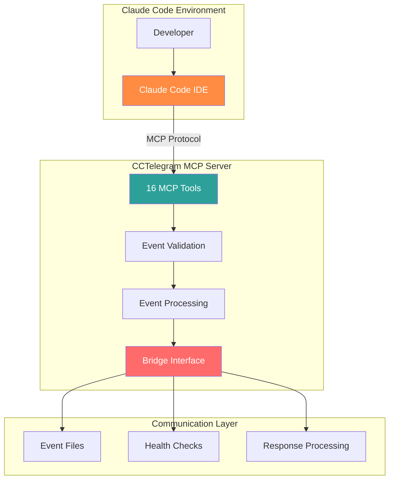

# CCTelegram MCP Server API Reference

**Complete API documentation for CCTelegram MCP Server integration with Claude Code**

[](../README.md) [](usage-guide.md) [](https://spec.modelcontextprotocol.io/)

---

## 🎯 API Overview

The CCTelegram MCP Server provides **16 specialized tools** for seamless integration with Claude Code, enabling real-time Telegram notifications, interactive approvals, and comprehensive system monitoring through the Model Context Protocol.



---

## 📚 API Documentation Categories

### 🔌 **[MCP Tools Reference](usage-guide.md)**
**Complete guide to all 16 MCP tools with interactive examples**

| Tool Category | Count | Primary Function |
|---------------|-------|------------------|
| **📨 Events & Notifications** | 5 tools | Send structured events and messages |
| **⚙️ Bridge Management** | 5 tools | Control bridge lifecycle and modes |
| **💬 Response Processing** | 3 tools | Handle user interactions and approvals |
| **📊 Status & Monitoring** | 3 tools | System health and performance metrics |

### 🎮 **Interactive Tool Examples**

**Most Common Operations:**
```javascript
// Send development notification
mcp__cctelegram__send_telegram_event({
  type: "task_completion",
  title: "✅ Feature Complete",
  description: "User authentication module implemented with tests"
})

// Request production approval
mcp__cctelegram__send_approval_request({
  title: "🚀 Production Deploy",
  description: "Deploy v1.8.5 to production environment?"
})

// Check system health
mcp__cctelegram__get_bridge_status()
```

---

## 🛠️ Tool Categories Deep Dive

### 📨 Events & Notifications (5 tools)

#### **[send_telegram_event](usage-guide.md#send_telegram_event)**
**Send structured event notifications with full validation**
- **44+ Event Types** supported with schema validation
- **Rich Formatting** with emoji, timestamps, and metadata
- **Error Handling** with detailed validation feedback

#### **[send_telegram_message](usage-guide.md#send_telegram_message)**
**Send simple text messages for quick notifications**
- **Instant Delivery** for rapid development feedback  
- **Minimal Overhead** for lightweight notifications
- **Source Attribution** for message tracking

#### **[send_task_completion](usage-guide.md#send_task_completion)**
**Specialized task completion notifications**
- **Duration Tracking** with performance metrics
- **File Change Lists** with detailed modification tracking
- **Result Summary** with outcome analysis

#### **[send_performance_alert](usage-guide.md#send_performance_alert)**
**Performance monitoring and threshold alerts**
- **Configurable Thresholds** with severity levels
- **Metric Tracking** with historical comparison
- **Automated Escalation** based on severity

#### **[send_approval_request](usage-guide.md#send_approval_request)**
**Interactive approval workflows with buttons**
- **Custom Response Options** beyond Approve/Deny
- **Request Context** with detailed justification
- **Response Tracking** with audit trails

### ⚙️ Bridge Management (5 tools)

#### **[get_bridge_status](usage-guide.md#get_bridge_status)**
**Comprehensive system health and status information**
- **Real-time Metrics** including memory, CPU, and performance
- **Connection Status** for Telegram API and file system
- **Operational Mode** (Native, Nomad, Mute) with configuration

#### **[switch_to_nomad_mode](usage-guide.md#switch_to_nomad_mode)**
**Enable full remote work capabilities**
- **Bidirectional Communication** for complete remote control
- **Enhanced Notifications** with detailed development context
- **Interactive Commands** through Telegram interface

#### **[switch_to_native_mode](usage-guide.md#switch_to_native_mode)**
**Local development mode with minimal notifications**
- **Performance Optimized** for local development focus
- **Essential Alerts Only** to reduce notification fatigue
- **Rapid Development** with streamlined feedback

#### **[switch_to_mute_mode](usage-guide.md#switch_to_mute_mode)**
**Complete notification silence for focus sessions**
- **Zero Interruptions** during deep work sessions
- **Preserved Events** queued for later review
- **Focus Time Protection** with automatic resume

#### **[ensure_bridge_running](usage-guide.md#ensure_bridge_running)**
**Automated bridge lifecycle management**
- **Automatic Startup** with health verification
- **Process Monitoring** with restart capabilities
- **Dependency Checks** for complete system validation

### 💬 Response Processing (3 tools)

#### **[get_telegram_responses](usage-guide.md#get_telegram_responses)**
**Retrieve user interactions and approval responses**
- **Response History** with timestamp and context tracking
- **Approval Status** with detailed outcome analysis
- **User Feedback** integration for continuous improvement

#### **[process_pending_responses](usage-guide.md#process_pending_responses)**
**Process and analyze recent user interactions**
- **Intelligent Parsing** of user responses and commands
- **Actionable Insights** with recommended next steps
- **Context Awareness** for relevant response processing

#### **[clear_old_responses](usage-guide.md#clear_old_responses)**
**Cleanup and maintenance for response files**
- **Configurable Retention** with customizable time windows
- **Storage Optimization** to prevent file system bloat
- **Data Privacy** with secure cleanup procedures

### 📊 Status & Monitoring (3 tools)

#### **[get_task_status](usage-guide.md#get_task_status)**
**Development task tracking and progress monitoring**
- **Claude Code Integration** with session task awareness
- **TaskMaster Integration** for comprehensive project tracking
- **Status Filtering** with customizable views and summaries

#### **[todo](usage-guide.md#todo)**
**Visual task dashboard with organized sections**
- **Progress Visualization** with completed, current, and upcoming tasks
- **Subtask Support** with hierarchical task organization
- **Multi-System Integration** supporting both Claude Code and TaskMaster

#### **[check_bridge_process](usage-guide.md#check_bridge_process)**
**Low-level process monitoring and diagnostics**
- **Process Health** with PID tracking and resource monitoring
- **System Integration** with service management capabilities
- **Diagnostic Information** for troubleshooting and optimization

---

## 🚀 Quick Start Guide

### 1. Basic Setup Verification
```javascript
// Test basic connectivity
mcp__cctelegram__get_bridge_status()

// Send test notification
mcp__cctelegram__send_telegram_message({
  message: "🎉 CCTelegram MCP Server is working!"
})
```

### 2. Development Workflow Integration
```javascript
// Start of development session
mcp__cctelegram__send_telegram_event({
  type: "task_started",
  title: "🚀 Starting Development",
  description: "Beginning work on user authentication feature"
})

// Completion notification
mcp__cctelegram__send_task_completion({
  task_id: "auth-feature",
  title: "✅ Authentication Complete",
  results: "All tests passing, documentation updated",
  duration_ms: 1800000,  // 30 minutes
  files_affected: ["src/auth.ts", "tests/auth.test.ts", "docs/auth.md"]
})
```

### 3. Remote Work Setup
```javascript
// Enable remote work mode
mcp__cctelegram__switch_to_nomad_mode()

// Verify configuration
mcp__cctelegram__get_bridge_status()

// Get development overview
mcp__cctelegram__todo({
  sections: ["completed", "current", "upcoming"],
  show_subtasks: true
})
```

---

## 🔧 Integration Patterns

### Event-Driven Development
```javascript
// Performance monitoring workflow
mcp__cctelegram__send_performance_alert({
  title: "⚡ API Latency Alert", 
  current_value: 450,
  threshold: 400,
  severity: "medium"
})

// Approval-based deployments
mcp__cctelegram__send_approval_request({
  title: "🚀 Production Deployment",
  description: "Deploy version 1.8.5 with authentication improvements?",
  options: ["Deploy", "Review", "Cancel"]
})
```

### System Administration
```javascript
// Health monitoring pipeline
const status = mcp__cctelegram__get_bridge_status()
const tasks = mcp__cctelegram__get_task_status({ summary_only: true })
const responses = mcp__cctelegram__process_pending_responses()

// System maintenance
mcp__cctelegram__clear_old_responses({ older_than_hours: 24 })
mcp__cctelegram__ensure_bridge_running()
```

---

## 📊 Performance Characteristics

### Tool Response Times
| Tool Category | Avg Response Time | Max Payload | Cache Support |
|---------------|------------------|-------------|---------------|
| **Event Sending** | <100ms | 4KB | ❌ Real-time |
| **Status Queries** | <50ms | 2KB | ✅ 30s cache |
| **Bridge Control** | <200ms | 1KB | ❌ State-dependent |
| **Response Processing** | <150ms | 8KB | ✅ 60s cache |

### Resource Usage
- **Memory Overhead**: <5MB per active session
- **File System Impact**: ~1KB per event (auto-cleanup)
- **Network Usage**: <1KB per notification (with compression)
- **CPU Usage**: <1% average, <5% peak during processing

---

## 🔗 Related Documentation

### Core Integration
- **[MCP Server Setup](../README.md)** - Complete installation and configuration
- **[Bridge Integration](../../setup/QUICKSTART.md)** - Background service setup
- **[Claude Code Integration](../../user-guide/claude-integration.md)** - IDE workflow integration

### Advanced Topics
- **[Event System Reference](../../reference/EVENT_SYSTEM.md)** - Complete event type documentation
- **[Configuration Guide](../../reference/configuration.md)** - Environment and performance tuning
- **[Troubleshooting Guide](../operations/troubleshooting/README.md)** - Common issues and solutions

### Development Resources
- **[Contributing Guide](../../development/CONTRIBUTING.md)** - API development contribution guidelines
- **[Testing Framework](../../development/testing.md)** - API testing procedures and standards
- **[Architecture Overview](../../development/architecture.md)** - System design and MCP integration patterns

---

*MCP Server API Reference - Version 1.8.5*  
*Last updated: August 2025 | MCP Protocol Compatible*

## See Also

- **[Usage Guide](usage-guide.md)** - Detailed tool usage with examples
- **[Event System](../../reference/EVENT_SYSTEM.md)** - Complete event type reference  
- **[Quick Reference](../../reference/QUICK_REFERENCE.md)** - Daily lookup commands
- **[Configuration](../../reference/configuration.md)** - Environment setup and tuning