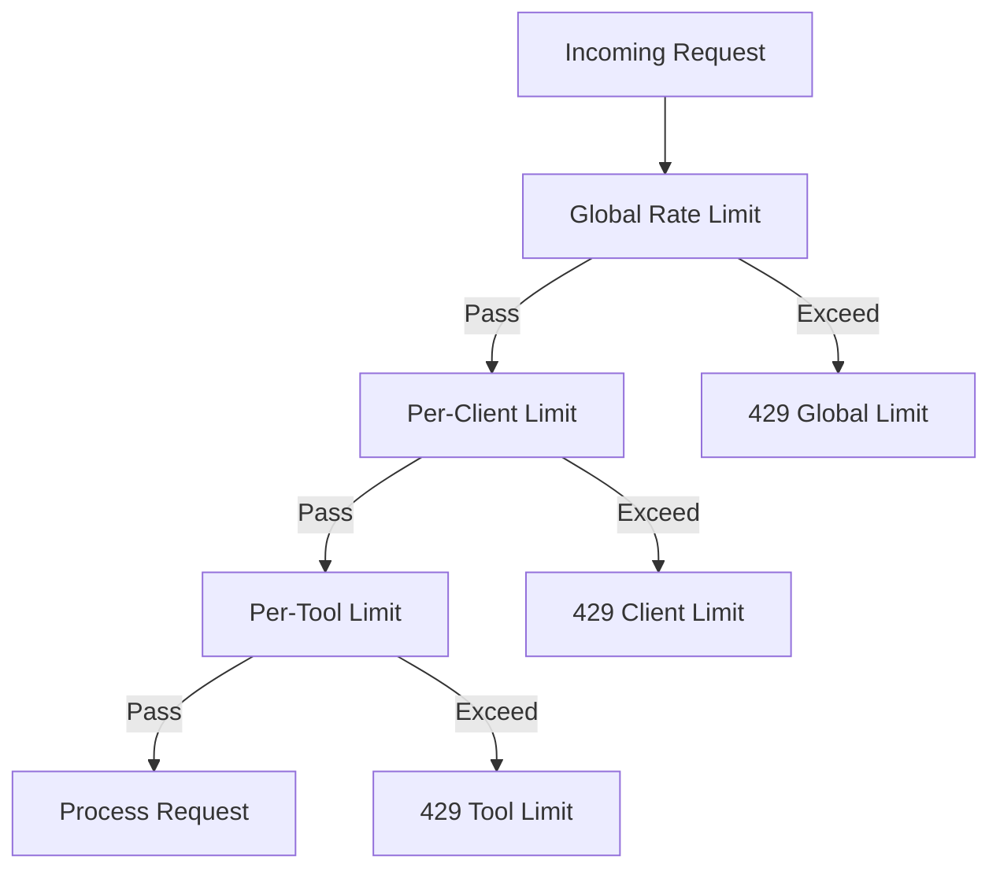

# Rate Limiting

The CCTelegram MCP Server implements comprehensive rate limiting to ensure fair usage, prevent abuse, and maintain service quality.

## 🚦 Rate Limiting Overview

### Rate Limiting Levels



### Default Limits

| Limit Type | Default Value | Window | Description |
|------------|---------------|---------|-------------|
| **Global** | 1000 requests | 1 minute | Server-wide request limit |
| **Per-Client** | 100 requests | 1 minute | Per API key limit |
| **Per-Tool** | 50 requests | 1 minute | Per MCP tool limit |
| **Burst** | 10 requests | 10 seconds | Short burst protection |

## ⚙️ Configuration

### Environment Variables
```bash
# Enable/disable rate limiting
MCP_ENABLE_RATE_LIMIT=true

# Global rate limits
MCP_RATE_LIMIT_GLOBAL_MAX=1000
MCP_RATE_LIMIT_GLOBAL_WINDOW_MS=60000

# Per-client rate limits  
MCP_RATE_LIMIT_CLIENT_MAX=100
MCP_RATE_LIMIT_CLIENT_WINDOW_MS=60000

# Per-tool rate limits
MCP_RATE_LIMIT_TOOL_MAX=50
MCP_RATE_LIMIT_TOOL_WINDOW_MS=60000

# Burst protection
MCP_RATE_LIMIT_BURST_MAX=10
MCP_RATE_LIMIT_BURST_WINDOW_MS=10000

# Storage backend for limits
MCP_RATE_LIMIT_STORE=memory  # or redis
MCP_REDIS_URL=redis://localhost:6379  # if using Redis
```

### Configuration File
```toml
# config.toml
[rate_limiting]
enabled = true
store = "memory"  # or "redis"

[rate_limiting.global]
max_requests = 1000
window_ms = 60000

[rate_limiting.per_client]
max_requests = 100 
window_ms = 60000

[rate_limiting.per_tool]
max_requests = 50
window_ms = 60000

[rate_limiting.burst]
max_requests = 10
window_ms = 10000

[rate_limiting.redis]
url = "redis://localhost:6379"
key_prefix = "mcp_rate_limit:"
```

## 📊 Rate Limit Headers

All API responses include rate limit information in headers:

### Standard Headers
```http
X-RateLimit-Limit: 100
X-RateLimit-Remaining: 85
X-RateLimit-Reset: 1705401060
X-RateLimit-Window: 60
```

### Extended Headers
```http
X-RateLimit-Global-Limit: 1000
X-RateLimit-Global-Remaining: 750
X-RateLimit-Tool-Limit: 50
X-RateLimit-Tool-Remaining: 30
X-RateLimit-Burst-Limit: 10
X-RateLimit-Burst-Remaining: 8
```

### Rate Limit Exceeded Response
```http
HTTP/1.1 429 Too Many Requests
Content-Type: application/json
Retry-After: 30
X-RateLimit-Limit: 100
X-RateLimit-Remaining: 0
X-RateLimit-Reset: 1705401090

{
  "error": true,
  "code": "RATE_LIMIT_EXCEEDED",
  "message": "Request rate limit exceeded",
  "details": {
    "limit": 100,
    "window": 60,
    "current_requests": 105,
    "retry_after": 30,
    "reset_time": "2025-01-15T10:31:30.000Z",
    "limit_type": "per_client"
  },
  "timestamp": "2025-01-15T10:31:00.000Z"
}
```

## 🛠️ Tool-Specific Limits

### High-Volume Tools
Some tools have higher default limits due to typical usage patterns:

```javascript
const toolLimits = {
  // Status and monitoring tools - higher limits
  'get_bridge_status': { max: 120, window: 60000 },
  'check_bridge_process': { max: 120, window: 60000 },
  'get_telegram_responses': { max: 100, window: 60000 },
  
  // Event tools - standard limits  
  'send_telegram_event': { max: 50, window: 60000 },
  'send_telegram_message': { max: 50, window: 60000 },
  'send_task_completion': { max: 50, window: 60000 },
  
  // Bridge management - lower limits (heavy operations)
  'start_bridge': { max: 10, window: 60000 },
  'stop_bridge': { max: 10, window: 60000 },
  'restart_bridge': { max: 5, window: 60000 },
  
  // Approval and response tools - standard limits
  'send_approval_request': { max: 30, window: 60000 },
  'process_pending_responses': { max: 60, window: 60000 },
  
  // Cleanup tools - lower limits
  'clear_old_responses': { max: 20, window: 60000 }
};
```

## 🔧 Client Implementation

### JavaScript Rate Limit Handler

```javascript
class RateLimitHandler {
  constructor(apiKey, baseUrl = 'http://localhost:8080') {
    this.apiKey = apiKey;
    this.baseUrl = baseUrl;
    this.rateLimitInfo = new Map();
    this.requestQueue = [];
    this.processing = false;
  }
  
  async makeRequest(tool, data = {}) {
    return new Promise((resolve, reject) => {
      this.requestQueue.push({
        tool,
        data, 
        resolve,
        reject,
        timestamp: Date.now()
      });
      
      this.processQueue();
    });
  }
  
  async processQueue() {
    if (this.processing || this.requestQueue.length === 0) {
      return;
    }
    
    this.processing = true;
    
    while (this.requestQueue.length > 0) {
      const request = this.requestQueue.shift();
      
      // Check if we should wait due to rate limits
      const waitTime = this.calculateWaitTime(request.tool);
      if (waitTime > 0) {
        console.log(`Rate limited - waiting ${waitTime}ms`);
        await this.delay(waitTime);
      }
      
      try {
        const result = await this.executeRequest(request);
        request.resolve(result);
      } catch (error) {
        if (error.code === 'RATE_LIMIT_EXCEEDED') {
          // Re-queue the request for retry
          this.requestQueue.unshift(request);
          const retryAfter = error.details?.retry_after || 60;
          await this.delay(retryAfter * 1000);
        } else {
          request.reject(error);
        }
      }
    }
    
    this.processing = false;
  }
  
  async executeRequest(request) {
    const response = await fetch(`${this.baseUrl}/tools/${request.tool}`, {
      method: 'POST',
      headers: {
        'Content-Type': 'application/json',
        'X-API-Key': this.apiKey
      },
      body: JSON.stringify(request.data)
    });
    
    // Update rate limit info from headers
    this.updateRateLimitInfo(request.tool, response.headers);
    
    const data = await response.json();
    
    if (!response.ok || data.error) {
      const error = new Error(data.message || 'Request failed');
      error.code = data.code;
      error.details = data.details;
      throw error;
    }
    
    return data;
  }
  
  updateRateLimitInfo(tool, headers) {
    this.rateLimitInfo.set(tool, {
      limit: parseInt(headers.get('X-RateLimit-Limit')) || 0,
      remaining: parseInt(headers.get('X-RateLimit-Remaining')) || 0,
      reset: parseInt(headers.get('X-RateLimit-Reset')) || 0,
      window: parseInt(headers.get('X-RateLimit-Window')) || 60,
      updated: Date.now()
    });
  }
  
  calculateWaitTime(tool) {
    const info = this.rateLimitInfo.get(tool);
    if (!info || info.remaining > 0) {
      return 0;
    }
    
    const now = Math.floor(Date.now() / 1000);
    const waitTime = Math.max(0, (info.reset - now)) * 1000;
    
    return waitTime;
  }
  
  delay(ms) {
    return new Promise(resolve => setTimeout(resolve, ms));
  }
  
  getRateLimitStatus(tool) {
    return this.rateLimitInfo.get(tool) || null;
  }
}

// Usage
const rateLimitHandler = new RateLimitHandler('your_api_key');

// Make rate-limited requests
try {
  const result = await rateLimitHandler.makeRequest('send_telegram_event', {
    type: 'task_completion',
    title: 'Test Event',
    description: 'This is a test event'
  });
  console.log('Event sent:', result);
} catch (error) {
  console.error('Request failed:', error);
}
```

### Python Rate Limit Handler

```python
import time
import requests
from typing import Dict, Any, Optional
import asyncio
import aiohttp

class RateLimitHandler:
    def __init__(self, api_key: str, base_url: str = "http://localhost:8080"):
        self.api_key = api_key
        self.base_url = base_url
        self.rate_limit_info: Dict[str, Dict] = {}
        self.session = requests.Session()
        self.session.headers.update({"X-API-Key": api_key})
    
    def make_request(self, tool: str, data: Dict[str, Any] = None) -> Dict[str, Any]:
        data = data or {}
        
        # Check rate limits and wait if necessary
        wait_time = self.calculate_wait_time(tool)
        if wait_time > 0:
            print(f"Rate limited - waiting {wait_time} seconds")
            time.sleep(wait_time)
        
        # Make the request
        response = self.session.post(
            f"{self.base_url}/tools/{tool}",
            json=data,
            timeout=30
        )
        
        # Update rate limit info
        self.update_rate_limit_info(tool, response.headers)
        
        # Handle response
        response_data = response.json()
        
        if not response.ok or response_data.get('error'):
            if response_data.get('code') == 'RATE_LIMIT_EXCEEDED':
                retry_after = response_data.get('details', {}).get('retry_after', 60)
                print(f"Rate limit exceeded - waiting {retry_after} seconds")
                time.sleep(retry_after)
                return self.make_request(tool, data)  # Retry
            else:
                raise requests.RequestException(response_data.get('message', 'Request failed'))
        
        return response_data
    
    def update_rate_limit_info(self, tool: str, headers):
        self.rate_limit_info[tool] = {
            'limit': int(headers.get('X-RateLimit-Limit', 0)),
            'remaining': int(headers.get('X-RateLimit-Remaining', 0)),
            'reset': int(headers.get('X-RateLimit-Reset', 0)),
            'window': int(headers.get('X-RateLimit-Window', 60)),
            'updated': time.time()
        }
    
    def calculate_wait_time(self, tool: str) -> float:
        info = self.rate_limit_info.get(tool)
        if not info or info['remaining'] > 0:
            return 0
        
        now = time.time()
        wait_time = max(0, info['reset'] - now)
        
        return wait_time
    
    def get_rate_limit_status(self, tool: str) -> Optional[Dict]:
        return self.rate_limit_info.get(tool)

# Async version for high-throughput applications
class AsyncRateLimitHandler:
    def __init__(self, api_key: str, base_url: str = "http://localhost:8080"):
        self.api_key = api_key
        self.base_url = base_url
        self.rate_limit_info: Dict[str, Dict] = {}
        self.semaphore = asyncio.Semaphore(10)  # Max concurrent requests
    
    async def make_request(self, tool: str, data: Dict[str, Any] = None) -> Dict[str, Any]:
        async with self.semaphore:
            data = data or {}
            
            # Check rate limits
            wait_time = self.calculate_wait_time(tool)
            if wait_time > 0:
                print(f"Rate limited - waiting {wait_time} seconds")
                await asyncio.sleep(wait_time)
            
            # Make request
            async with aiohttp.ClientSession() as session:
                headers = {
                    'Content-Type': 'application/json',
                    'X-API-Key': self.api_key
                }
                
                async with session.post(
                    f"{self.base_url}/tools/{tool}",
                    json=data,
                    headers=headers,
                    timeout=30
                ) as response:
                    
                    # Update rate limit info
                    self.update_rate_limit_info(tool, response.headers)
                    
                    response_data = await response.json()
                    
                    if not response.ok or response_data.get('error'):
                        if response_data.get('code') == 'RATE_LIMIT_EXCEEDED':
                            retry_after = response_data.get('details', {}).get('retry_after', 60)
                            await asyncio.sleep(retry_after)
                            return await self.make_request(tool, data)
                        else:
                            raise Exception(response_data.get('message', 'Request failed'))
                    
                    return response_data

# Usage examples
handler = RateLimitHandler('your_api_key')

# Send multiple events with automatic rate limiting
events = [
    {'type': 'task_completion', 'title': f'Task {i}', 'description': f'Task {i} completed'}
    for i in range(20)
]

for event in events:
    try:
        result = handler.make_request('send_telegram_event', event)
        print(f"Event sent: {result['event_id']}")
    except Exception as e:
        print(f"Failed to send event: {e}")
```

## 📈 Monitoring Rate Limits

### Rate Limit Dashboard
```javascript
class RateLimitDashboard {
  constructor(apiKey) {
    this.handler = new RateLimitHandler(apiKey);
    this.metrics = new Map();
  }
  
  async updateMetrics() {
    const tools = [
      'send_telegram_event',
      'get_bridge_status', 
      'send_approval_request',
      'get_telegram_responses'
    ];
    
    for (const tool of tools) {
      const status = this.handler.getRateLimitStatus(tool);
      if (status) {
        this.metrics.set(tool, {
          ...status,
          usage_percentage: ((status.limit - status.remaining) / status.limit) * 100
        });
      }
    }
  }
  
  displayMetrics() {
    console.log('\n📊 Rate Limit Status:');
    console.log('━'.repeat(60));
    
    for (const [tool, metrics] of this.metrics) {
      const bar = this.createUsageBar(metrics.usage_percentage);
      console.log(`${tool}:`);
      console.log(`  ${bar} ${metrics.usage_percentage.toFixed(1)}%`);
      console.log(`  ${metrics.remaining}/${metrics.limit} remaining`);
      console.log(`  Resets: ${new Date(metrics.reset * 1000).toLocaleTimeString()}`);
      console.log('');
    }
  }
  
  createUsageBar(percentage, width = 20) {
    const filled = Math.round((percentage / 100) * width);
    const empty = width - filled;
    return '█'.repeat(filled) + '░'.repeat(empty);
  }
  
  async monitorContinuously(intervalMs = 5000) {
    setInterval(async () => {
      await this.updateMetrics();
      console.clear();
      this.displayMetrics();
    }, intervalMs);
  }
}

// Usage
const dashboard = new RateLimitDashboard('your_api_key');
dashboard.monitorContinuously();
```

### Alerting on Rate Limit Usage
```javascript
class RateLimitAlerting {
  constructor(handler, thresholds = { warning: 80, critical: 95 }) {
    this.handler = handler;
    this.thresholds = thresholds;
    this.alertHistory = new Map();
  }
  
  checkAndAlert() {
    for (const [tool, status] of this.handler.rateLimitInfo) {
      const usagePercentage = ((status.limit - status.remaining) / status.limit) * 100;
      
      // Check critical threshold
      if (usagePercentage >= this.thresholds.critical) {
        this.sendAlert('critical', tool, usagePercentage, status);
      }
      // Check warning threshold  
      else if (usagePercentage >= this.thresholds.warning) {
        this.sendAlert('warning', tool, usagePercentage, status);
      }
    }
  }
  
  sendAlert(level, tool, usage, status) {
    const alertKey = `${tool}_${level}`;
    const now = Date.now();
    
    // Prevent spam (only alert once per 5 minutes for same tool/level)
    const lastAlert = this.alertHistory.get(alertKey);
    if (lastAlert && (now - lastAlert) < 5 * 60 * 1000) {
      return;
    }
    
    this.alertHistory.set(alertKey, now);
    
    const message = `🚨 Rate Limit ${level.toUpperCase()}: ${tool} at ${usage.toFixed(1)}% usage`;
    const resetTime = new Date(status.reset * 1000).toLocaleTimeString();
    
    console.log(message);
    console.log(`   Remaining: ${status.remaining}/${status.limit}`);
    console.log(`   Resets at: ${resetTime}`);
    
    // Send to monitoring system, Slack, etc.
    this.sendToMonitoringSystem(level, tool, usage, status);
  }
  
  sendToMonitoringSystem(level, tool, usage, status) {
    // Implementation for your monitoring system
    // e.g., Datadog, New Relic, PagerDuty, etc.
  }
}
```

## 🎯 Best Practices

### Application Design
- **Implement Client-Side Rate Limiting** - Track limits to avoid server rejections
- **Use Request Queuing** - Queue requests and process them within limits
- **Batch Operations** - Combine multiple operations where possible
- **Cache Responses** - Cache responses to reduce API calls
- **Implement Exponential Backoff** - Handle rate limit errors gracefully

### Monitoring
- **Track Usage Patterns** - Monitor rate limit usage across tools
- **Set Up Alerting** - Alert when approaching rate limits
- **Analyze Trends** - Identify usage patterns and optimize accordingly  
- **Monitor Reset Times** - Track when limits reset to optimize timing

### Error Handling
- **Respect Retry-After Headers** - Wait the specified time before retrying
- **Implement Circuit Breakers** - Prevent cascading failures
- **Log Rate Limit Events** - Log when limits are hit for analysis
- **Graceful Degradation** - Continue operating with reduced functionality

### Performance Optimization
- **Request Prioritization** - Prioritize critical requests
- **Request Deduplication** - Avoid duplicate requests
- **Connection Pooling** - Reuse HTTP connections
- **Async Processing** - Use asynchronous request processing

## 🔧 Advanced Configuration

### Custom Rate Limits per API Key
```bash
# Environment-based custom limits
MCP_RATE_LIMIT_CLIENT_abc123=200  # Higher limit for specific client
MCP_RATE_LIMIT_CLIENT_xyz789=25   # Lower limit for specific client
```

### Tool-Specific Overrides
```bash
# Custom limits for specific tools
MCP_RATE_LIMIT_TOOL_send_telegram_event=100
MCP_RATE_LIMIT_TOOL_start_bridge=5
MCP_RATE_LIMIT_TOOL_get_bridge_status=200
```

### Redis-Based Distributed Rate Limiting
```toml
[rate_limiting]
store = "redis"

[rate_limiting.redis]
url = "redis://redis-cluster:6379"
key_prefix = "mcp_rl:"
key_ttl = 3600
cluster_mode = true
```

This completes the comprehensive API documentation for the CCTelegram MCP Server! The documentation now includes all 16 MCP tools with interactive Swagger UI, ReDoc integration, and practical examples.