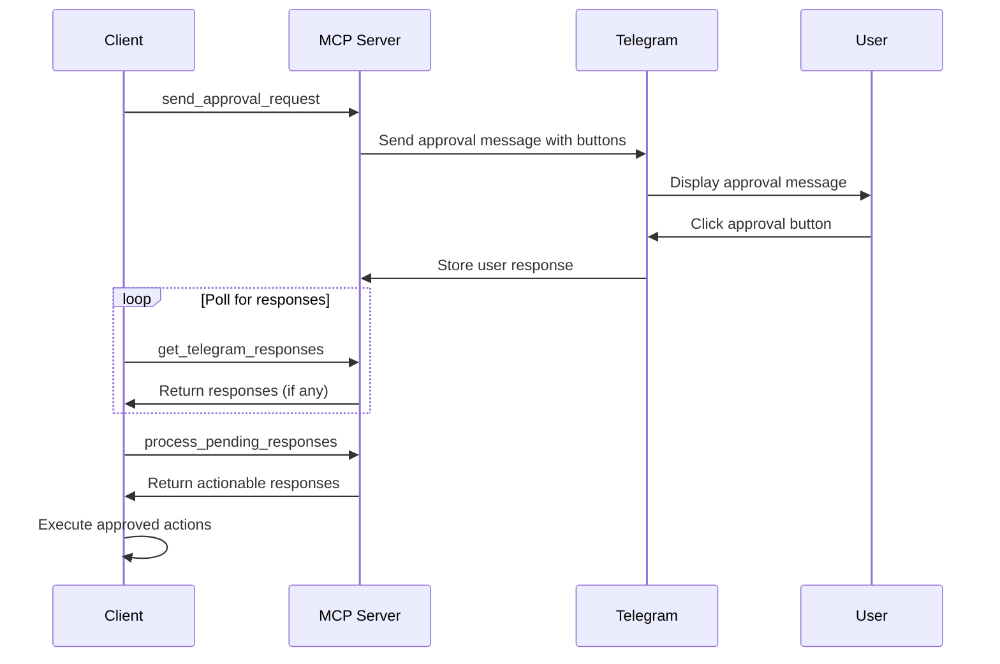
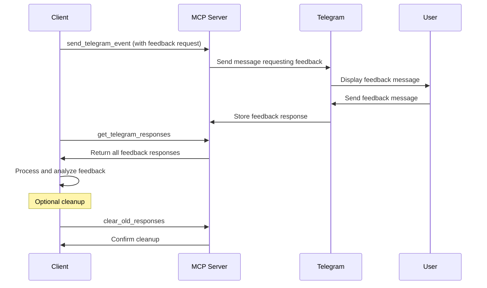

# Response Processing

Handle user responses from Telegram interactions with these 3 specialized tools for processing approvals, feedback, and user interactions.

## 🛠️ Available Tools

### get_telegram_responses
Retrieve user responses from Telegram interactions.

**Use Cases:**
- Poll for approval responses
- Collect user feedback
- Process interactive button clicks
- Gather survey responses

**Parameters:**
| Parameter | Type | Required | Default | Description |
|-----------|------|----------|---------|-------------|
| `limit` | number | ❌ | 10 | Maximum number of responses to return (1-100) |

**Response:**
```json
{
  "count": 3,
  "total": 15,
  "responses": [
    {
      "id": "resp_abc123",
      "event_id": "evt_def456",
      "user_id": "123456789",
      "username": "john_doe",
      "response": "Approve",
      "timestamp": "2025-01-15T10:30:00.000Z",
      "message_id": 789
    },
    {
      "id": "resp_xyz789",
      "event_id": "evt_ghi012",
      "user_id": "987654321", 
      "username": "jane_smith",
      "response": "Deploy Later",
      "timestamp": "2025-01-15T10:25:00.000Z",
      "message_id": 790
    }
  ]
}
```

**Example Usage:**
```bash
# Get latest 5 responses
curl -H "X-API-Key: your_key" \
     "http://localhost:8080/tools/get_telegram_responses?limit=5"

# Get all recent responses
curl -H "X-API-Key: your_key" \
     "http://localhost:8080/tools/get_telegram_responses?limit=100"
```

### process_pending_responses
Process pending approval responses and return actionable information.

**Use Cases:**
- Handle approval workflow responses
- Process time-sensitive decisions
- Filter actionable vs informational responses
- Implement approval automation

**Parameters:**
| Parameter | Type | Required | Default | Description |
|-----------|------|----------|---------|-------------|
| `since_minutes` | number | ❌ | 10 | Process responses from last N minutes (1-1440) |

**Response:**
```json
{
  "pending_count": 5,
  "processed_count": 3,
  "responses": [
    {
      "event_id": "evt_deploy_001",
      "response_id": "resp_abc123", 
      "user_response": "Approve",
      "timestamp": "2025-01-15T10:30:00.000Z",
      "actionable": true,
      "context": {
        "original_title": "Deploy to Production?",
        "original_description": "Version 2.1.0 ready for production deployment",
        "response_options": ["Deploy", "Cancel", "Review Changes"],
        "selected_option": "Deploy"
      }
    },
    {
      "event_id": "evt_config_002",
      "response_id": "resp_def456",
      "user_response": "Cancel", 
      "timestamp": "2025-01-15T10:28:00.000Z",
      "actionable": true,
      "context": {
        "original_title": "Update Database Schema?",
        "selected_option": "Cancel"
      }
    }
  ]
}
```

**Example Usage:**
```bash
# Process responses from last 5 minutes
curl -X POST \
     -H "X-API-Key: your_key" \
     -H "Content-Type: application/json" \
     -d '{"since_minutes": 5}' \
     http://localhost:8080/tools/process_pending_responses

# Process all responses from last hour
curl -X POST \
     -H "X-API-Key: your_key" \
     -H "Content-Type: application/json" \
     -d '{"since_minutes": 60}' \
     http://localhost:8080/tools/process_pending_responses
```

### clear_old_responses
Clear old response files to prevent accumulation and manage storage.

**Use Cases:**
- Scheduled cleanup operations
- Storage management
- Privacy compliance (data retention)
- Performance optimization

**Parameters:**
| Parameter | Type | Required | Default | Description |
|-----------|------|----------|---------|-------------|
| `older_than_hours` | number | ❌ | 24 | Clear responses older than N hours (1-720) |

**Response:**
```json
{
  "deleted_count": 15,
  "message": "Cleared 15 old response files"
}
```

**Example Usage:**
```bash
# Clear responses older than 24 hours (default)
curl -X DELETE \
     -H "X-API-Key: your_key" \
     "http://localhost:8080/tools/clear_old_responses"

# Clear responses older than 7 days
curl -X DELETE \
     -H "X-API-Key: your_key" \
     "http://localhost:8080/tools/clear_old_responses?older_than_hours=168"

# Clear responses older than 1 hour (testing)
curl -X DELETE \
     -H "X-API-Key: your_key" \
     "http://localhost:8080/tools/clear_old_responses?older_than_hours=1"
```

## 🔄 Response Workflow Patterns

### Approval Workflow
Complete approval workflow with response processing:



### Feedback Collection
Collect and process user feedback:



### Periodic Response Processing
Automated response processing pattern:

```bash
#!/bin/bash
# Periodic response processor

while true; do
    # Process recent responses
    responses=$(curl -s -H "X-API-Key: $API_KEY" \
                     -X POST \
                     -d '{"since_minutes": 5}' \
                     http://localhost:8080/tools/process_pending_responses)
    
    # Check for actionable responses
    actionable=$(echo $responses | jq '.responses[] | select(.actionable == true)')
    
    if [ -n "$actionable" ]; then
        echo "Processing actionable responses..."
        # Process responses here
    fi
    
    # Wait 5 minutes before next check
    sleep 300
done
```

## 📊 Response Data Structure

### Response Object
Each response includes comprehensive metadata:

```typescript
interface TelegramResponse {
  id: string;                    // Unique response ID
  event_id?: string;            // Original event ID (if from approval)
  user_id: string;              // Telegram user ID
  username?: string;            // Telegram username
  response: string;             // User response text
  timestamp: string;            // ISO timestamp
  message_id: number;           // Telegram message ID
  context?: ResponseContext;    // Additional context
}

interface ResponseContext {
  original_title?: string;      // Original event title
  original_description?: string; // Original event description  
  response_options?: string[];  // Available response options
  selected_option?: string;     // Selected option (for button responses)
  response_type?: 'button' | 'text' | 'inline'; // Response interaction type
}
```

### Actionable Response Detection
Responses are marked as actionable when:

- **Button Responses** - User clicked approval/action buttons
- **Keyword Matches** - Response contains action keywords (approve, deploy, etc.)
- **Time Sensitivity** - Recent responses to time-sensitive requests
- **Context Matching** - Response matches expected approval context

## 🚨 Error Handling

### Common Error Scenarios

**No Responses Available:**
```json
{
  "count": 0,
  "total": 0,
  "responses": []
}
```

**Invalid Time Range:**
```json
{
  "error": true,
  "code": "VALIDATION_ERROR",
  "message": "Invalid time range",
  "details": {
    "field": "since_minutes",
    "reason": "must be between 1 and 1440"
  }
}
```

**Response Processing Failed:**
```json
{
  "error": true,
  "code": "PROCESSING_ERROR", 
  "message": "Failed to process responses",
  "details": {
    "failed_count": 2,
    "error_details": "File system permission error"
  }
}
```

## 🎯 Best Practices

### Polling Strategy
- **Reasonable Intervals** - Poll every 30-60 seconds for approvals
- **Exponential Backoff** - Increase intervals if no responses
- **Time Limits** - Set maximum polling duration
- **Error Handling** - Implement retry logic for failed requests

### Response Management
- **Prompt Processing** - Process actionable responses quickly
- **Data Retention** - Clear old responses regularly
- **User Privacy** - Respect data retention policies
- **Audit Trail** - Log important approval decisions

### Performance Optimization
- **Limit Responses** - Use appropriate `limit` parameters
- **Time Windows** - Use `since_minutes` to limit processing scope
- **Cleanup Schedule** - Regular cleanup to prevent storage bloat
- **Caching** - Cache processed responses to avoid reprocessing

### Security Considerations
- **Validate Responses** - Verify response authenticity
- **User Authorization** - Check user permissions for approvals
- **Audit Logging** - Log all approval decisions
- **Rate Limiting** - Prevent response flooding

## 💡 Integration Examples

### Simple Approval Check
```typescript
async function checkApprovals(): Promise<boolean> {
  const responses = await mcpClient.processPendingResponses({
    since_minutes: 10
  });
  
  const approvals = responses.responses.filter(r => 
    r.actionable && r.user_response.toLowerCase().includes('approve')
  );
  
  return approvals.length > 0;
}
```

### Feedback Aggregation
```typescript
async function collectFeedback(eventId: string): Promise<string[]> {
  const allResponses = await mcpClient.getTelegramResponses({
    limit: 100
  });
  
  return allResponses.responses
    .filter(r => r.event_id === eventId)
    .map(r => r.response);
}
```

### Automated Cleanup
```typescript
async function dailyCleanup(): Promise<void> {
  // Clear responses older than 7 days
  const result = await mcpClient.clearOldResponses({
    older_than_hours: 168
  });
  
  console.log(`Cleaned up ${result.deleted_count} old responses`);
}

// Schedule daily cleanup
setInterval(dailyCleanup, 24 * 60 * 60 * 1000);
```