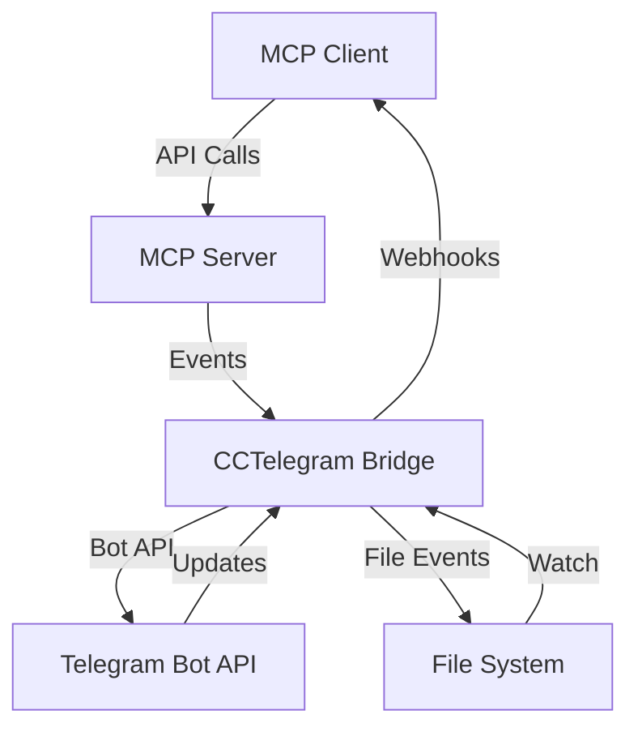

# Webhooks & Bridge Communication

The CCTelegram system supports webhook endpoints for real-time event delivery and bi-directional communication between the bridge and client applications.

## 🔗 Webhook Architecture

### Communication Flow



### Components
- **MCP Server** - Handles tool calls and API requests
- **CCTelegram Bridge** - Rust service managing Telegram communication
- **File System Events** - Event files written to disk for processing
- **Webhook Endpoints** - HTTP endpoints for real-time notifications

## 🛠️ Webhook Endpoints

### Event Notification Webhook
Receives real-time notifications when events are processed by the bridge.

**Endpoint:** `POST /webhook/events`

**Headers:**
```
Content-Type: application/json
X-CCTelegram-Signature: sha256=<signature>
X-CCTelegram-Timestamp: 1705401000
User-Agent: CCTelegram-Bridge/1.4.0
```

**Payload:**
```json
{
  "webhook_type": "event_processed",
  "timestamp": "2025-01-15T10:30:00.000Z",
  "event": {
    "id": "evt_abc123def456",
    "type": "task_completion",
    "source": "claude-code",
    "title": "Build Complete",
    "description": "Production build finished successfully",
    "status": "delivered",
    "telegram_message_id": 12345,
    "chat_id": "-1001234567890",
    "delivery_timestamp": "2025-01-15T10:30:02.000Z"
  },
  "bridge_info": {
    "version": "1.4.0",
    "uptime_seconds": 7200,
    "process_id": 12345
  }
}
```

### Response Status Webhook
Receives notifications when users respond to interactive messages.

**Endpoint:** `POST /webhook/responses`

**Payload:**
```json
{
  "webhook_type": "user_response",
  "timestamp": "2025-01-15T10:31:00.000Z", 
  "response": {
    "id": "resp_xyz789abc123",
    "event_id": "evt_abc123def456",
    "user": {
      "id": 123456789,
      "username": "john_doe",
      "first_name": "John",
      "last_name": "Doe"
    },
    "message": {
      "id": 12346,
      "text": "Approve",
      "chat_id": "-1001234567890",
      "timestamp": "2025-01-15T10:31:00.000Z"
    },
    "interaction_type": "callback_query",
    "callback_data": "approve_deploy_prod_001"
  },
  "original_event": {
    "type": "approval_request",
    "title": "Deploy to Production?",
    "options": ["Approve", "Deny", "Review"]
  }
}
```

### Bridge Health Webhook
Receives bridge health status updates and alerts.

**Endpoint:** `POST /webhook/health`

**Payload:**
```json
{
  "webhook_type": "health_update",
  "timestamp": "2025-01-15T10:32:00.000Z",
  "health": {
    "status": "healthy",
    "previous_status": "degraded",
    "checks": [
      {
        "name": "telegram_api_connectivity",
        "status": "pass",
        "response_time_ms": 150,
        "last_check": "2025-01-15T10:32:00.000Z"
      },
      {
        "name": "memory_usage",
        "status": "pass",
        "value": 42.5,
        "unit": "MB",
        "threshold": 100
      }
    ],
    "uptime_seconds": 7320,
    "events_processed_total": 1250
  },
  "alert_type": "health_recovered",
  "alert_message": "Bridge health recovered from degraded state"
}
```

## 🔐 Webhook Security

### Signature Verification
All webhook requests include a cryptographic signature for verification:

```javascript
const crypto = require('crypto');

function verifyWebhookSignature(payload, signature, secret) {
  const expectedSignature = crypto
    .createHmac('sha256', secret)
    .update(payload)
    .digest('hex');
    
  const actualSignature = signature.replace('sha256=', '');
  
  return crypto.timingSafeEqual(
    Buffer.from(expectedSignature, 'hex'),
    Buffer.from(actualSignature, 'hex')
  );
}

// Usage
app.post('/webhook/events', (req, res) => {
  const signature = req.headers['x-cctelegram-signature'];
  const payload = JSON.stringify(req.body);
  
  if (!verifyWebhookSignature(payload, signature, process.env.WEBHOOK_SECRET)) {
    return res.status(401).json({ error: 'Invalid signature' });
  }
  
  // Process webhook...
  res.status(200).json({ status: 'received' });
});
```

### Configuration
Configure webhook security in bridge settings:

```toml
# Bridge configuration
[webhook]
enabled = true
secret = "your_webhook_secret_key"
endpoints = [
  "https://your-app.com/webhook/events",
  "https://your-app.com/webhook/responses",
  "https://your-app.com/webhook/health"
]
timeout_seconds = 30
retry_attempts = 3
```

## 🚀 Implementation Examples

### Express.js Webhook Handler
```javascript
const express = require('express');
const crypto = require('crypto');

const app = express();
app.use(express.json());

// Webhook secret from environment
const WEBHOOK_SECRET = process.env.CCTELEGRAM_WEBHOOK_SECRET;

// Middleware for signature verification
function verifySignature(req, res, next) {
  const signature = req.headers['x-cctelegram-signature'];
  const timestamp = req.headers['x-cctelegram-timestamp'];
  
  if (!signature || !timestamp) {
    return res.status(401).json({ error: 'Missing signature or timestamp' });
  }
  
  // Check timestamp (prevent replay attacks)
  const now = Math.floor(Date.now() / 1000);
  const requestTime = parseInt(timestamp);
  if (Math.abs(now - requestTime) > 300) { // 5 minute tolerance
    return res.status(401).json({ error: 'Request timestamp too old' });
  }
  
  // Verify signature
  const payload = JSON.stringify(req.body);
  const expectedSignature = crypto
    .createHmac('sha256', WEBHOOK_SECRET)
    .update(payload)
    .digest('hex');
    
  const actualSignature = signature.replace('sha256=', '');
  
  if (!crypto.timingSafeEqual(
    Buffer.from(expectedSignature, 'hex'),
    Buffer.from(actualSignature, 'hex')
  )) {
    return res.status(401).json({ error: 'Invalid signature' });
  }
  
  next();
}

// Event notification webhook
app.post('/webhook/events', verifySignature, (req, res) => {
  const { webhook_type, event } = req.body;
  
  console.log(`Received ${webhook_type} for event ${event.id}`);
  
  switch (event.status) {
    case 'delivered':
      console.log(`Event delivered to Telegram: ${event.title}`);
      break;
    case 'failed':
      console.error(`Event delivery failed: ${event.title}`);
      break;
    case 'pending':
      console.log(`Event pending delivery: ${event.title}`);
      break;
  }
  
  res.status(200).json({ status: 'received' });
});

// User response webhook
app.post('/webhook/responses', verifySignature, (req, res) => {
  const { webhook_type, response, original_event } = req.body;
  
  console.log(`User response received for ${original_event.type}`);
  
  // Handle approval responses
  if (original_event.type === 'approval_request') {
    const approved = response.message.text.toLowerCase().includes('approve');
    
    if (approved) {
      console.log(`Approval granted for: ${original_event.title}`);
      // Execute approved action
      executeApprovedAction(original_event, response);
    } else {
      console.log(`Approval denied for: ${original_event.title}`);
    }
  }
  
  res.status(200).json({ status: 'processed' });
});

// Bridge health webhook
app.post('/webhook/health', verifySignature, (req, res) => {
  const { webhook_type, health, alert_type } = req.body;
  
  if (alert_type) {
    console.log(`Bridge health alert: ${alert_type}`);
    
    // Handle critical health issues
    if (health.status === 'unhealthy') {
      console.error('Bridge unhealthy - triggering alert');
      // Send alert to monitoring system
      sendHealthAlert(health);
    }
  }
  
  res.status(200).json({ status: 'received' });
});

app.listen(3000, () => {
  console.log('Webhook server running on port 3000');
});
```

### Python Flask Webhook Handler
```python
from flask import Flask, request, jsonify
import hmac
import hashlib
import json
import time
import os

app = Flask(__name__)
WEBHOOK_SECRET = os.environ.get('CCTELEGRAM_WEBHOOK_SECRET')

def verify_signature(payload_body, signature_header, timestamp_header):
    if not signature_header or not timestamp_header:
        return False
    
    # Check timestamp (prevent replay attacks)
    try:
        request_timestamp = int(timestamp_header)
        if abs(time.time() - request_timestamp) > 300:  # 5 minute tolerance
            return False
    except ValueError:
        return False
    
    # Verify signature
    expected_signature = hmac.new(
        WEBHOOK_SECRET.encode('utf-8'),
        payload_body,
        hashlib.sha256
    ).hexdigest()
    
    actual_signature = signature_header.replace('sha256=', '')
    
    return hmac.compare_digest(expected_signature, actual_signature)

@app.route('/webhook/events', methods=['POST'])
def handle_events():
    signature = request.headers.get('X-CCTelegram-Signature')
    timestamp = request.headers.get('X-CCTelegram-Timestamp')
    
    if not verify_signature(request.data, signature, timestamp):
        return jsonify({'error': 'Invalid signature'}), 401
    
    webhook_data = request.json
    event = webhook_data.get('event', {})
    
    print(f"Event {event.get('id')} status: {event.get('status')}")
    
    # Process event based on status
    if event.get('status') == 'delivered':
        handle_delivered_event(event)
    elif event.get('status') == 'failed':
        handle_failed_event(event)
    
    return jsonify({'status': 'received'}), 200

@app.route('/webhook/responses', methods=['POST']) 
def handle_responses():
    signature = request.headers.get('X-CCTelegram-Signature')
    timestamp = request.headers.get('X-CCTelegram-Timestamp')
    
    if not verify_signature(request.data, signature, timestamp):
        return jsonify({'error': 'Invalid signature'}), 401
    
    webhook_data = request.json
    response = webhook_data.get('response', {})
    original_event = webhook_data.get('original_event', {})
    
    # Handle approval workflows
    if original_event.get('type') == 'approval_request':
        user_response = response.get('message', {}).get('text', '').lower()
        
        if 'approve' in user_response:
            print(f"Approval granted for: {original_event.get('title')}")
            execute_approved_action(original_event, response)
        else:
            print(f"Approval denied for: {original_event.get('title')}")
    
    return jsonify({'status': 'processed'}), 200

@app.route('/webhook/health', methods=['POST'])
def handle_health():
    signature = request.headers.get('X-CCTelegram-Signature')
    timestamp = request.headers.get('X-CCTelegram-Timestamp')
    
    if not verify_signature(request.data, signature, timestamp):
        return jsonify({'error': 'Invalid signature'}), 401
    
    webhook_data = request.json
    health = webhook_data.get('health', {})
    alert_type = webhook_data.get('alert_type')
    
    if alert_type:
        print(f"Health alert: {alert_type}")
        
        if health.get('status') == 'unhealthy':
            send_health_alert(health)
    
    return jsonify({'status': 'received'}), 200

def handle_delivered_event(event):
    # Log successful delivery
    print(f"✅ Event delivered: {event.get('title')}")

def handle_failed_event(event):
    # Handle delivery failure
    print(f"❌ Event delivery failed: {event.get('title')}")
    # Could implement retry logic here

def execute_approved_action(event, response):
    # Execute the approved action
    print(f"Executing approved action for: {event.get('title')}")
    # Implementation depends on the specific action

def send_health_alert(health):
    # Send alert to monitoring system
    print(f"🚨 Bridge health alert - Status: {health.get('status')}")

if __name__ == '__main__':
    app.run(host='0.0.0.0', port=3000, debug=True)
```

## 🔄 Webhook Retry Logic

The bridge implements automatic retry logic for failed webhook deliveries:

### Retry Configuration
```toml
[webhook.retry]
max_attempts = 3
initial_delay_ms = 1000
max_delay_ms = 30000
backoff_multiplier = 2.0
```

### Retry Behavior
1. **Initial Attempt** - Immediate delivery attempt
2. **First Retry** - After 1 second delay
3. **Second Retry** - After 2 second delay  
4. **Third Retry** - After 4 second delay
5. **Failed** - Event marked as delivery failed

### Retry Headers
Retry attempts include additional headers:

```
X-CCTelegram-Retry-Count: 2
X-CCTelegram-Max-Retries: 3
X-CCTelegram-Original-Timestamp: 1705401000
```

## 📊 Webhook Monitoring

### Delivery Metrics
Monitor webhook delivery success rates and performance:

```javascript
class WebhookMetrics {
  constructor() {
    this.deliveryStats = {
      total: 0,
      successful: 0,
      failed: 0,
      retries: 0
    };
    this.responseTimeStats = [];
  }
  
  recordDelivery(success, responseTime, retryCount = 0) {
    this.deliveryStats.total++;
    
    if (success) {
      this.deliveryStats.successful++;
    } else {
      this.deliveryStats.failed++;
    }
    
    if (retryCount > 0) {
      this.deliveryStats.retries += retryCount;
    }
    
    this.responseTimeStats.push(responseTime);
    
    // Keep only last 1000 response times
    if (this.responseTimeStats.length > 1000) {
      this.responseTimeStats.shift();
    }
  }
  
  getMetrics() {
    const avgResponseTime = this.responseTimeStats.reduce((a, b) => a + b, 0) / this.responseTimeStats.length;
    
    return {
      delivery_rate: (this.deliveryStats.successful / this.deliveryStats.total) * 100,
      total_deliveries: this.deliveryStats.total,
      failed_deliveries: this.deliveryStats.failed,
      retry_rate: (this.deliveryStats.retries / this.deliveryStats.total) * 100,
      average_response_time_ms: avgResponseTime || 0
    };
  }
}
```

### Health Monitoring
Set up health checks for webhook endpoints:

```javascript
async function checkWebhookHealth(endpoints) {
  const results = [];
  
  for (const endpoint of endpoints) {
    try {
      const start = Date.now();
      
      const response = await fetch(endpoint + '/health', {
        method: 'GET',
        timeout: 5000
      });
      
      const responseTime = Date.now() - start;
      
      results.push({
        endpoint,
        healthy: response.ok,
        response_time_ms: responseTime,
        status_code: response.status
      });
    } catch (error) {
      results.push({
        endpoint,
        healthy: false,
        error: error.message
      });
    }
  }
  
  return results;
}
```

## 🎯 Best Practices

### Security
- **Always Verify Signatures** - Never process unverified webhook requests
- **Use HTTPS** - Ensure all webhook endpoints use HTTPS in production
- **Implement Replay Protection** - Check timestamps to prevent replay attacks
- **Rate Limiting** - Implement rate limiting on webhook endpoints
- **Secret Rotation** - Regularly rotate webhook secrets

### Reliability  
- **Idempotent Processing** - Handle duplicate webhook deliveries gracefully
- **Timeout Handling** - Set appropriate timeouts for webhook processing
- **Error Handling** - Return appropriate HTTP status codes
- **Retry Logic** - Implement client-side retry for failed webhook calls
- **Dead Letter Queues** - Handle permanently failed webhooks

### Performance
- **Async Processing** - Process webhooks asynchronously when possible
- **Response Speed** - Respond quickly to webhook requests (< 5 seconds)
- **Resource Management** - Limit concurrent webhook processing
- **Monitoring** - Monitor webhook delivery metrics and performance

### Development
- **Local Testing** - Use tools like ngrok for local webhook testing
- **Staging Environment** - Test webhooks in staging before production
- **Documentation** - Document webhook payloads and expected responses
- **Versioning** - Version webhook payloads for backward compatibility