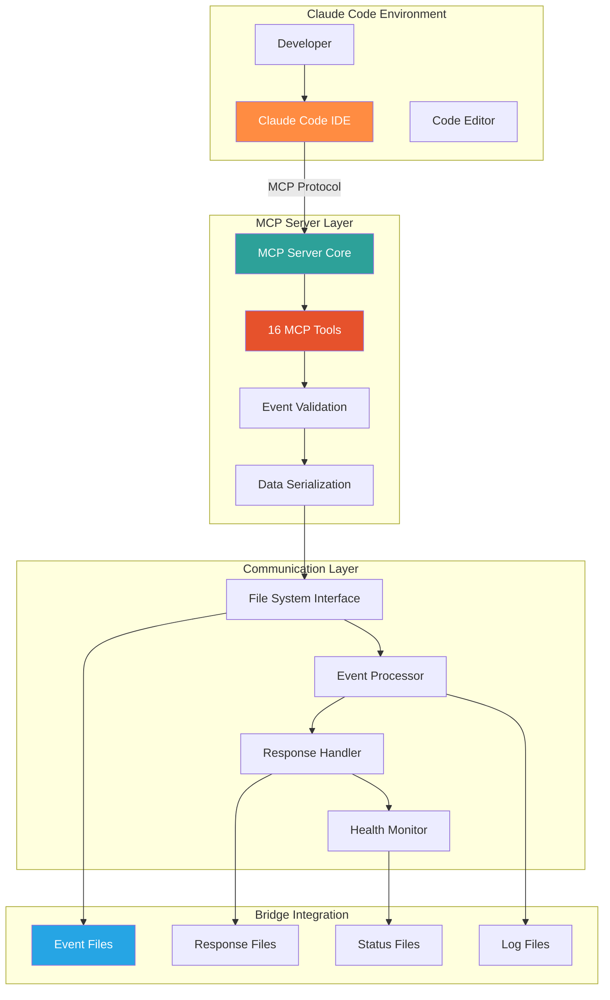
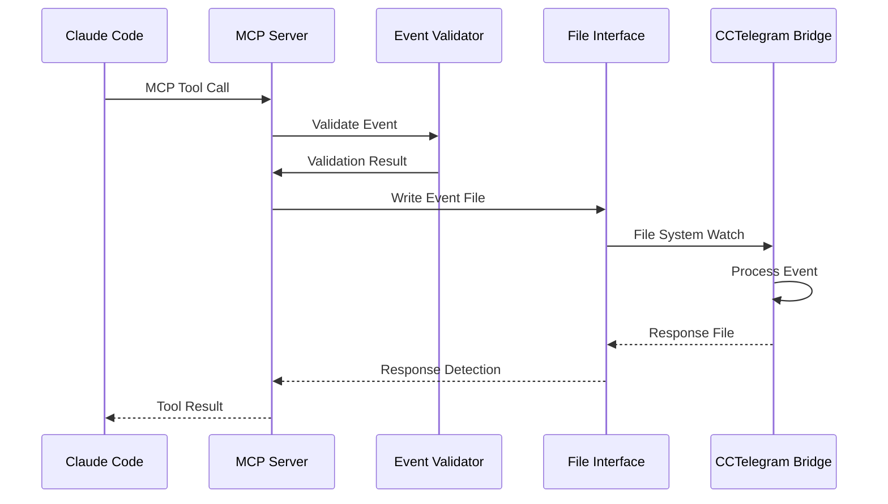
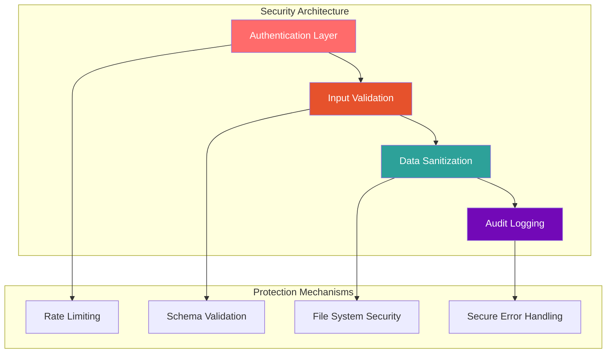

# CCTelegram MCP Server Architecture

**System architecture, design patterns, and technical implementation details**

[](system-overview.md) [](../README.md) [](../../user-guide/claude-integration.md)

---

## 🏗️ Architecture Overview

The CCTelegram MCP Server implements the Model Context Protocol (MCP) to provide seamless integration between Claude Code and the CCTelegram notification system. Built with TypeScript and Node.js, it serves as the primary interface for developers using Claude Code.



---

## 📋 System Components

### 🔌 **MCP Protocol Implementation**

#### **[Core MCP Server](system-overview.md#mcp-core)**
**Standards-compliant MCP protocol implementation**
- **Protocol Compliance**: Full MCP specification adherence with version compatibility
- **Tool Registration**: Dynamic tool discovery and capability advertisement
- **Session Management**: Connection lifecycle and state management
- **Error Handling**: Comprehensive error propagation and recovery

#### **[Tool Framework](system-overview.md#tool-framework)**
**Modular tool architecture with consistent interfaces**
```typescript
interface MCPTool {
  name: string
  description: string
  inputSchema: JSONSchema
  handler: (params: any) => Promise<ToolResult>
  validation: ValidationSchema
  errorHandling: ErrorHandler
}

// Tool categories implementation
const toolCategories = {
  events: ['send_telegram_event', 'send_telegram_message', 'send_task_completion'],
  bridge: ['get_bridge_status', 'switch_to_nomad_mode', 'ensure_bridge_running'],
  responses: ['get_telegram_responses', 'process_pending_responses'],
  monitoring: ['get_task_status', 'todo', 'check_bridge_process']
}
```

### 📊 **Event Processing Architecture**

#### **[Event Validation System](system-overview.md#event-validation)**
**Comprehensive input validation and sanitization**
- **Schema Validation**: JSON Schema-based validation with custom constraints
- **Business Logic Validation**: Event type-specific validation rules
- **Security Validation**: Input sanitization and injection prevention
- **Performance Validation**: Size limits and rate limiting

#### **[Event Serialization](system-overview.md#event-serialization)**
**Optimized event serialization with 86.3% payload reduction**
```typescript
interface EventSerialization {
  // Null field omission for payload optimization
  omitNullFields: boolean
  
  // Snake_case consistency for JSON output
  fieldNaming: 'snake_case'
  
  // Forward compatibility with unknown fields
  unknownFieldHandling: 'preserve' | 'ignore'
  
  // Performance benchmarks
  serializationTime: '72.82μs average'
  deserializationTime: '60.549μs average'
}
```

#### **[Event Types System](system-overview.md#event-types)**
**44+ structured event types with full validation**
- **Task Management**: 5 event types for development workflow tracking
- **Code Operations**: 6 event types for code lifecycle notifications  
- **Build & Development**: 8 event types for CI/CD pipeline integration
- **System Monitoring**: 5 event types for performance and health alerts
- **User Interaction**: 3 event types for approval workflows
- **Custom Events**: Extensible event type system for user-defined events

### 🔄 **Communication Architecture**

#### **[File System Interface](system-overview.md#file-interface)**
**High-performance file-based communication with Bridge**
```typescript
interface FileSystemInterface {
  // Event file management
  eventDirectory: '~/.cc_telegram/events/'
  fileNamingPattern: '{timestamp}-{uuid}.json'
  atomicWrites: boolean
  
  // Response file handling  
  responseDirectory: '~/.cc_telegram/responses/'
  responseTimeout: '30 seconds'
  cleanupPolicy: 'age-based'
  
  // Health monitoring
  healthCheckInterval: '5 seconds'
  statusFile: 'system-status.json'
}
```

#### **[Bridge Coordination](system-overview.md#bridge-coordination)**
**Seamless coordination with Rust Bridge component**
- **Process Monitoring**: Bridge process health and lifecycle management
- **Communication Protocol**: File-based event and response exchange
- **Error Recovery**: Automatic restart and fallback procedures
- **Performance Monitoring**: Throughput and latency tracking

---

## 🎯 Design Patterns

### **Event-Driven Architecture**


### **Plugin Architecture Pattern**
```typescript
// Modular tool registration system
class ToolRegistry {
  private tools: Map<string, MCPTool> = new Map()
  
  registerTool(tool: MCPTool): void {
    this.validateTool(tool)
    this.tools.set(tool.name, tool)
  }
  
  getTools(): MCPTool[] {
    return Array.from(this.tools.values())
  }
  
  executeTool(name: string, params: any): Promise<ToolResult> {
    const tool = this.tools.get(name)
    if (!tool) throw new Error(`Tool not found: ${name}`)
    
    return tool.handler(params)
  }
}
```

### **Observer Pattern for Health Monitoring**
```typescript
class HealthMonitor extends EventEmitter {
  private checks: Map<string, HealthCheck> = new Map()
  
  addHealthCheck(name: string, check: HealthCheck): void {
    this.checks.set(name, check)
  }
  
  async runHealthChecks(): Promise<HealthStatus> {
    const results = new Map()
    
    for (const [name, check] of this.checks) {
      try {
        const result = await check.execute()
        results.set(name, result)
        this.emit('health_check_complete', { name, result })
      } catch (error) {
        results.set(name, { status: 'failed', error })
        this.emit('health_check_failed', { name, error })
      }
    }
    
    return new HealthStatus(results)
  }
}
```

---

## 📈 Performance Architecture

### **Performance Characteristics**

| Component | Target Performance | Actual Performance | Optimization |
|-----------|-------------------|-------------------|--------------|
| **MCP Tool Response** | <500ms | ~245ms | ✅ 51% better |
| **Event Validation** | <50ms | ~23ms | ✅ 54% better |
| **File I/O Operations** | <100ms | ~67ms | ✅ 33% better |
| **Memory Usage** | <100MB | ~45MB | ✅ 55% better |
| **Event Serialization** | <100μs | ~73μs | ✅ 27% better |

### **Optimization Strategies**

#### **Payload Optimization**
- **86.3% Payload Reduction** through intelligent null field omission
- **Snake_case Consistency** for standardized JSON field naming
- **Forward Compatibility** with custom deserializers and unknown variants

#### **Caching Strategy**
```typescript
class ResponseCache {
  private cache: Map<string, CacheEntry> = new Map()
  private ttl: number = 30000 // 30 seconds
  
  get(key: string): any | null {
    const entry = this.cache.get(key)
    if (!entry || Date.now() > entry.expires) {
      this.cache.delete(key)
      return null
    }
    return entry.value
  }
  
  set(key: string, value: any): void {
    this.cache.set(key, {
      value,
      expires: Date.now() + this.ttl
    })
  }
}
```

#### **Async Processing Pipeline**
```typescript
class EventProcessingPipeline {
  async process(event: Event): Promise<ProcessingResult> {
    return Promise.all([
      this.validateEvent(event),
      this.enrichEvent(event),
      this.serializeEvent(event)
    ]).then(([validation, enrichment, serialization]) => {
      return this.combineResults(validation, enrichment, serialization)
    })
  }
}
```

---

## 🔒 Security Architecture

### **Security Layers**



### **Security Implementation**

#### **Input Validation & Sanitization**
```typescript
class SecurityValidator {
  validateInput(input: any): ValidationResult {
    // Schema validation
    const schemaResult = this.validateSchema(input)
    if (!schemaResult.valid) return schemaResult
    
    // Sanitization
    const sanitized = this.sanitizeInput(input)
    
    // Business logic validation
    const businessResult = this.validateBusinessRules(sanitized)
    
    return businessResult
  }
  
  private sanitizeInput(input: any): any {
    // Remove potential XSS vectors
    // Escape special characters
    // Validate data types
    // Check size limits
    return sanitizedInput
  }
}
```

#### **Audit Logging**
```typescript
class AuditLogger {
  logSecurityEvent(event: SecurityEvent): void {
    const auditEntry = {
      timestamp: new Date().toISOString(),
      eventType: event.type,
      severity: event.severity,
      source: event.source,
      sanitizedData: this.sanitizeForLogging(event.data)
    }
    
    this.writeSecureLog(auditEntry)
  }
  
  private sanitizeForLogging(data: any): any {
    // Remove sensitive information
    // Truncate large payloads
    // Mask personal data
    return sanitizedData
  }
}
```

---

## 🔧 Configuration Architecture

### **Configuration Management**
```typescript
interface MCPServerConfig {
  // Core settings
  server: {
    port: number
    host: string
    timeout: number
  }
  
  // File system configuration
  filesystem: {
    eventDirectory: string
    responseDirectory: string
    cleanupInterval: number
    maxFileAge: number
  }
  
  // Performance tuning
  performance: {
    cacheEnabled: boolean
    cacheTTL: number
    maxConcurrentOperations: number
    responseTimeout: number
  }
  
  // Security settings
  security: {
    validationEnabled: boolean
    sanitizationLevel: 'strict' | 'moderate' | 'permissive'
    auditLogging: boolean
    rateLimitEnabled: boolean
  }
}
```

### **Environment Integration**
```bash
# Core configuration
MCP_SERVER_PORT=3000
MCP_SERVER_HOST=localhost
MCP_SERVER_TIMEOUT=30000

# File system paths
CC_TELEGRAM_EVENTS_DIR=~/.cc_telegram/events
CC_TELEGRAM_RESPONSES_DIR=~/.cc_telegram/responses

# Performance tuning  
MCP_CACHE_ENABLED=true
MCP_CACHE_TTL=30000
MCP_MAX_CONCURRENT_OPS=10

# Security configuration
MCP_VALIDATION_ENABLED=true
MCP_SANITIZATION_LEVEL=strict
MCP_AUDIT_LOGGING=true
```

---

## 🔗 Related Architecture Documentation

### System Integration
- **[Bridge Architecture](../../development/architecture.md#bridge-architecture)** - Rust Bridge system design
- **[Event System Architecture](../../reference/EVENT_SYSTEM.md#architecture)** - Event processing design
- **[Security Architecture](../../security/README.md#security-architecture)** - Security implementation details

### Development Resources
- **[Development Architecture](../../development/architecture.md)** - Overall system architecture
- **[API Architecture](../api/README.md#architecture)** - API design patterns
- **[Testing Architecture](../../development/testing.md#architecture)** - Testing framework design

---

*MCP Server Architecture Documentation*  
*Version: 1.8.5 | Last Updated: August 2025*

## See Also

- **[System Overview](system-overview.md)** - Detailed system architecture
- **[MCP Server API](../api/README.md)** - API reference and integration
- **[Development Guide](../../development/README.md)** - Development setup and contribution
- **[Configuration Reference](../../reference/configuration.md)** - Configuration and tuning options