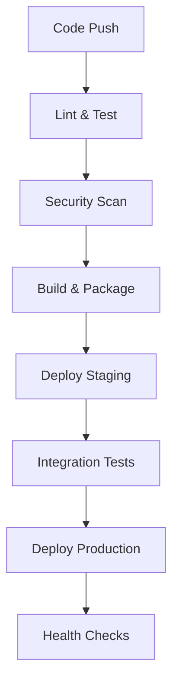

# CI/CD Pipeline Guide

Complete CI/CD setup for CCTelegram MCP Server using GitHub Actions.

## Pipeline Architecture



## GitHub Actions Workflows

### .github/workflows/ci.yml

```yaml
name: CI Pipeline

on:
  push:
    branches: [main, develop]
    paths:
      - 'mcp-server/**'
      - '.github/workflows/**'
  pull_request:
    branches: [main]
    paths:
      - 'mcp-server/**'

env:
  NODE_VERSION: '20.x'
  REGISTRY: ghcr.io
  IMAGE_NAME: ${{ github.repository }}/mcp-server

concurrency:
  group: ${{ github.workflow }}-${{ github.ref }}
  cancel-in-progress: true

jobs:
  # Lint and format checks
  lint:
    name: 🔍 Lint & Format
    runs-on: ubuntu-latest
    outputs:
      lint-passed: ${{ steps.lint.outcome == 'success' }}
    steps:
      - uses: actions/checkout@v4
      
      - name: Setup Node.js
        uses: actions/setup-node@v4
        with:
          node-version: ${{ env.NODE_VERSION }}
          cache: 'npm'
          cache-dependency-path: mcp-server/package-lock.json
      
      - name: Install dependencies
        working-directory: ./mcp-server
        run: npm ci
      
      - name: TypeScript check
        working-directory: ./mcp-server
        run: npx tsc --noEmit
      
      - name: ESLint
        id: lint
        working-directory: ./mcp-server
        run: npx eslint "src/**/*.{ts,tsx}" --format=github
      
      - name: Prettier check
        working-directory: ./mcp-server
        run: npx prettier --check "src/**/*.{ts,tsx,js,jsx}"

  # Security scanning
  security:
    name: 🛡️ Security Scan
    runs-on: ubuntu-latest
    permissions:
      security-events: write
      contents: read
    outputs:
      security-passed: ${{ steps.security-gate.outputs.passed }}
      vulnerabilities: ${{ steps.audit.outputs.vulnerabilities }}
    steps:
      - uses: actions/checkout@v4
      
      - name: Setup Node.js
        uses: actions/setup-node@v4
        with:
          node-version: ${{ env.NODE_VERSION }}
          cache: 'npm'
          cache-dependency-path: mcp-server/package-lock.json
      
      - name: Install dependencies
        working-directory: ./mcp-server
        run: npm ci
      
      # CodeQL Analysis
      - name: Initialize CodeQL
        uses: github/codeql-action/init@v3
        with:
          languages: typescript
          queries: security-extended,security-and-quality
      
      - name: Perform CodeQL Analysis
        uses: github/codeql-action/analyze@v3
        with:
          category: "/language:typescript"
      
      # Dependency audit
      - name: Audit dependencies
        id: audit
        working-directory: ./mcp-server
        run: |
          npm audit --audit-level=moderate --json > audit-results.json || true
          VULNERABILITIES=$(jq '.metadata.vulnerabilities.total' audit-results.json)
          CRITICAL=$(jq '.metadata.vulnerabilities.critical // 0' audit-results.json)
          HIGH=$(jq '.metadata.vulnerabilities.high // 0' audit-results.json)
          
          echo "vulnerabilities=$VULNERABILITIES" >> $GITHUB_OUTPUT
          echo "critical=$CRITICAL" >> $GITHUB_OUTPUT
          echo "high=$HIGH" >> $GITHUB_OUTPUT
          
          if [ "$CRITICAL" -gt 0 ]; then
            echo "❌ Critical vulnerabilities found: $CRITICAL"
            exit 1
          fi
      
      # Semgrep SAST
      - name: Run Semgrep
        uses: semgrep/semgrep-action@v1
        with:
          config: >-
            p/security-audit
            p/typescript
            p/owasp-top-ten
          generateSarif: "1"
      
      - name: Upload Semgrep SARIF
        if: always()
        uses: github/codeql-action/upload-sarif@v3
        with:
          sarif_file: semgrep.sarif
      
      - name: Security gate check
        id: security-gate
        run: |
          if [ "${{ steps.audit.outputs.critical }}" = "0" ]; then
            echo "✅ Security gate PASSED"
            echo "passed=true" >> $GITHUB_OUTPUT
          else
            echo "❌ Security gate FAILED"
            echo "passed=false" >> $GITHUB_OUTPUT
            exit 1
          fi

  # Test matrix
  test:
    name: 🧪 Test Suite
    runs-on: ubuntu-latest
    needs: [lint, security]
    if: needs.lint.outputs.lint-passed == 'success' && needs.security.outputs.security-passed == 'true'
    strategy:
      matrix:
        node-version: [18.x, 20.x]
    outputs:
      coverage-passed: ${{ steps.coverage.outputs.passed }}
    steps:
      - uses: actions/checkout@v4
      
      - name: Setup Node.js ${{ matrix.node-version }}
        uses: actions/setup-node@v4
        with:
          node-version: ${{ matrix.node-version }}
          cache: 'npm'
          cache-dependency-path: mcp-server/package-lock.json
      
      - name: Install dependencies
        working-directory: ./mcp-server
        run: npm ci
      
      - name: Build project
        working-directory: ./mcp-server
        run: npm run build
      
      - name: Run tests
        working-directory: ./mcp-server
        run: npm test -- --coverage --passWithNoTests
        env:
          NODE_ENV: test
      
      - name: Coverage gate
        id: coverage
        working-directory: ./mcp-server
        run: |
          if [ -f "coverage/coverage-summary.json" ]; then
            COVERAGE=$(jq '.total.statements.pct' coverage/coverage-summary.json)
            echo "Coverage: $COVERAGE%"
            
            if (( $(echo "$COVERAGE >= 90" | bc -l) )); then
              echo "✅ Coverage gate PASSED ($COVERAGE%)"
              echo "passed=true" >> $GITHUB_OUTPUT
            else
              echo "❌ Coverage gate FAILED ($COVERAGE% < 90%)"
              echo "passed=false" >> $GITHUB_OUTPUT
              exit 1
            fi
          else
            echo "⚠️ No coverage report found, skipping gate"
            echo "passed=true" >> $GITHUB_OUTPUT
          fi
      
      - name: Upload coverage to Codecov
        uses: codecov/codecov-action@v3
        with:
          file: ./mcp-server/coverage/lcov.info
          flags: unit-tests
          name: node-${{ matrix.node-version }}

  # Build and package
  build:
    name: 📦 Build & Package
    runs-on: ubuntu-latest
    needs: [test]
    if: needs.test.outputs.coverage-passed == 'true'
    outputs:
      image-digest: ${{ steps.build.outputs.digest }}
      image-tags: ${{ steps.meta.outputs.tags }}
    steps:
      - uses: actions/checkout@v4
      
      - name: Set up Docker Buildx
        uses: docker/setup-buildx-action@v3
      
      - name: Log in to Container Registry
        if: github.event_name != 'pull_request'
        uses: docker/login-action@v3
        with:
          registry: ${{ env.REGISTRY }}
          username: ${{ github.actor }}
          password: ${{ secrets.GITHUB_TOKEN }}
      
      - name: Extract metadata
        id: meta
        uses: docker/metadata-action@v5
        with:
          images: ${{ env.REGISTRY }}/${{ env.IMAGE_NAME }}
          tags: |
            type=ref,event=branch
            type=ref,event=pr
            type=semver,pattern={{version}}
            type=semver,pattern={{major}}.{{minor}}
            type=sha,prefix=sha-
      
      - name: Build and push
        id: build
        uses: docker/build-push-action@v5
        with:
          context: ./mcp-server
          platforms: linux/amd64,linux/arm64
          push: ${{ github.event_name != 'pull_request' }}
          tags: ${{ steps.meta.outputs.tags }}
          labels: ${{ steps.meta.outputs.labels }}
          cache-from: type=gha
          cache-to: type=gha,mode=max
          build-args: |
            BUILDTIME=${{ fromJSON(steps.meta.outputs.json).labels['org.opencontainers.image.created'] }}
            VERSION=${{ fromJSON(steps.meta.outputs.json).labels['org.opencontainers.image.version'] }}
            REVISION=${{ fromJSON(steps.meta.outputs.json).labels['org.opencontainers.image.revision'] }}
```

### .github/workflows/cd.yml

```yaml
name: CD Pipeline

on:
  workflow_run:
    workflows: ["CI Pipeline"]
    types:
      - completed
    branches: [main, develop]

env:
  REGISTRY: ghcr.io
  IMAGE_NAME: ${{ github.repository }}/mcp-server

jobs:
  # Deploy to staging
  deploy-staging:
    name: 🚀 Deploy Staging
    runs-on: ubuntu-latest
    if: ${{ github.event.workflow_run.conclusion == 'success' && github.event.workflow_run.head_branch == 'develop' }}
    environment:
      name: staging
      url: https://mcp-staging.company.com
    steps:
      - uses: actions/checkout@v4
      
      - name: Configure kubectl
        uses: azure/k8s-set-context@v1
        with:
          method: kubeconfig
          kubeconfig: ${{ secrets.KUBE_CONFIG_STAGING }}
      
      - name: Deploy to staging
        uses: azure/k8s-deploy@v1
        with:
          manifests: |
            k8s/staging/
          images: |
            ${{ env.REGISTRY }}/${{ env.IMAGE_NAME }}:sha-${{ github.sha }}
          namespace: cctelegram-staging
      
      - name: Wait for rollout
        run: |
          kubectl rollout status deployment/cctelegram-mcp-server \
            -n cctelegram-staging \
            --timeout=300s
      
      - name: Run smoke tests
        run: |
          kubectl run smoke-test \
            --image=curlimages/curl:7.85.0 \
            --rm -i --restart=Never \
            --namespace=cctelegram-staging \
            -- curl -f https://mcp-staging.company.com/health

  # Deploy to production
  deploy-production:
    name: 🚀 Deploy Production
    runs-on: ubuntu-latest
    if: ${{ github.event.workflow_run.conclusion == 'success' && github.event.workflow_run.head_branch == 'main' }}
    environment:
      name: production
      url: https://mcp.company.com
    steps:
      - uses: actions/checkout@v4
      
      - name: Configure kubectl
        uses: azure/k8s-set-context@v1
        with:
          method: kubeconfig
          kubeconfig: ${{ secrets.KUBE_CONFIG_PRODUCTION }}
      
      - name: Deploy with Helm
        run: |
          helm upgrade cctelegram ./helm/cctelegram \
            --namespace cctelegram-production \
            --values ./helm/cctelegram/values-production.yaml \
            --set image.tag=sha-${{ github.sha }} \
            --wait \
            --timeout=10m
      
      - name: Verify deployment
        run: |
          kubectl get pods -n cctelegram-production -l app.kubernetes.io/name=cctelegram
          kubectl rollout status deployment/cctelegram -n cctelegram-production --timeout=300s
      
      - name: Run health checks
        run: |
          kubectl run health-check \
            --image=curlimages/curl:7.85.0 \
            --rm -i --restart=Never \
            --namespace=cctelegram-production \
            -- curl -f https://mcp.company.com/health
      
      - name: Notify deployment success
        uses: 8398a7/action-slack@v3
        with:
          status: success
          text: "🎉 CCTelegram MCP Server deployed to production successfully!"
        env:
          SLACK_WEBHOOK_URL: ${{ secrets.SLACK_WEBHOOK_URL }}
```

### .github/workflows/performance.yml

```yaml
name: Performance Testing

on:
  schedule:
    - cron: '0 2 * * *'  # Daily at 2 AM
  workflow_dispatch:

jobs:
  performance-test:
    name: ⚡ Performance Tests
    runs-on: ubuntu-latest
    steps:
      - uses: actions/checkout@v4
      
      - name: Setup Node.js
        uses: actions/setup-node@v4
        with:
          node-version: '20.x'
          cache: 'npm'
          cache-dependency-path: mcp-server/package-lock.json
      
      - name: Install dependencies
        working-directory: ./mcp-server
        run: npm ci
      
      - name: Build project
        working-directory: ./mcp-server
        run: npm run build
      
      - name: Start server
        working-directory: ./mcp-server
        run: |
          npm start &
          sleep 10
        env:
          NODE_ENV: test
          MCP_ENABLE_AUTH: false
      
      - name: Install k6
        run: |
          curl https://github.com/grafana/k6/releases/download/v0.46.0/k6-v0.46.0-linux-amd64.tar.gz -L | tar xvz --strip-components 1
          sudo mv k6 /usr/local/bin
      
      - name: Run performance tests
        working-directory: ./mcp-server
        run: |
          k6 run tests/performance/k6/load-test.js
          k6 run tests/performance/k6/stress-test.js
        env:
          BASE_URL: http://localhost:3000
          TARGET_VUS: 50
          DURATION: 30s
      
      - name: Upload performance results
        uses: actions/upload-artifact@v4
        with:
          name: performance-results
          path: |
            mcp-server/performance-*.json
          retention-days: 30
```

## Environment Configuration

### Staging Environment

```yaml
# k8s/staging/kustomization.yaml
apiVersion: kustomize.config.k8s.io/v1beta1
kind: Kustomization

namespace: cctelegram-staging

resources:
  - ../../base

patchesStrategicMerge:
  - staging-patches.yaml

configMapGenerator:
  - name: cctelegram-config
    behavior: merge
    literals:
      - NODE_ENV=staging
      - MCP_LOG_LEVEL=debug
      - MCP_ENABLE_AUTH=false

secretGenerator:
  - name: cctelegram-secrets
    behavior: replace
    literals:
      - TELEGRAM_BOT_TOKEN=${TELEGRAM_BOT_TOKEN_STAGING}
      - MCP_HMAC_SECRET=${MCP_HMAC_SECRET_STAGING}

images:
  - name: ghcr.io/your-org/cctelegram-mcp-server
    newTag: latest
```

### Production Environment

```yaml
# k8s/production/kustomization.yaml
apiVersion: kustomize.config.k8s.io/v1beta1
kind: Kustomization

namespace: cctelegram-production

resources:
  - ../../base

patchesStrategicMerge:
  - production-patches.yaml

configMapGenerator:
  - name: cctelegram-config
    behavior: merge
    literals:
      - NODE_ENV=production
      - MCP_LOG_LEVEL=warn
      - MCP_ENABLE_AUTH=true

secretGenerator:
  - name: cctelegram-secrets
    behavior: replace
    literals:
      - TELEGRAM_BOT_TOKEN=${TELEGRAM_BOT_TOKEN_PRODUCTION}
      - MCP_HMAC_SECRET=${MCP_HMAC_SECRET_PRODUCTION}

replicas:
  - name: cctelegram-mcp-server
    count: 5

images:
  - name: ghcr.io/your-org/cctelegram-mcp-server
    newTag: latest
```

## Security & Secrets Management

### GitHub Secrets Setup

```bash
# Repository secrets (via GitHub CLI)
gh secret set KUBE_CONFIG_STAGING < ~/.kube/config-staging
gh secret set KUBE_CONFIG_PRODUCTION < ~/.kube/config-production
gh secret set TELEGRAM_BOT_TOKEN_STAGING --body "staging-bot-token"
gh secret set TELEGRAM_BOT_TOKEN_PRODUCTION --body "production-bot-token"
gh secret set MCP_HMAC_SECRET_STAGING --body "$(openssl rand -hex 32)"
gh secret set MCP_HMAC_SECRET_PRODUCTION --body "$(openssl rand -hex 32)"
gh secret set SLACK_WEBHOOK_URL --body "https://hooks.slack.com/services/..."
```

### Secret Management with External Secrets

```yaml
# k8s/external-secrets/secret-store.yaml
apiVersion: external-secrets.io/v1beta1
kind: SecretStore
metadata:
  name: vault-backend
  namespace: cctelegram-production
spec:
  provider:
    vault:
      server: "https://vault.company.com"
      path: "secret"
      version: "v2"
      auth:
        kubernetes:
          mountPath: "kubernetes"
          role: "cctelegram"
          secretRef:
            name: vault-token
            key: token

---
apiVersion: external-secrets.io/v1beta1
kind: ExternalSecret
metadata:
  name: cctelegram-secrets
  namespace: cctelegram-production
spec:
  refreshInterval: 1h
  secretStoreRef:
    name: vault-backend
    kind: SecretStore
  target:
    name: cctelegram-secrets
    creationPolicy: Owner
  data:
  - secretKey: TELEGRAM_BOT_TOKEN
    remoteRef:
      key: cctelegram/production
      property: telegram_bot_token
  - secretKey: MCP_HMAC_SECRET
    remoteRef:
      key: cctelegram/production
      property: mcp_hmac_secret
```

## Quality Gates & Validation

### .github/workflows/quality-gates.yml

```yaml
name: Quality Gates

on:
  pull_request:
    branches: [main]

jobs:
  quality-gates:
    name: 🎯 Quality Gates
    runs-on: ubuntu-latest
    steps:
      - uses: actions/checkout@v4
        with:
          fetch-depth: 0
      
      - name: Setup Node.js
        uses: actions/setup-node@v4
        with:
          node-version: '20.x'
          cache: 'npm'
          cache-dependency-path: mcp-server/package-lock.json
      
      - name: Install dependencies
        working-directory: ./mcp-server
        run: npm ci
      
      - name: Build project
        working-directory: ./mcp-server
        run: npm run build
      
      - name: Run quality gates script
        working-directory: ./mcp-server
        run: node scripts/ci-quality-gates.js
        env:
          GITHUB_TOKEN: ${{ secrets.GITHUB_TOKEN }}
          PR_NUMBER: ${{ github.event.number }}
      
      - name: Comment PR
        if: always()
        uses: actions/github-script@v6
        with:
          script: |
            const fs = require('fs');
            if (fs.existsSync('./mcp-server/quality-report.md')) {
              const report = fs.readFileSync('./mcp-server/quality-report.md', 'utf8');
              github.rest.issues.createComment({
                issue_number: context.issue.number,
                owner: context.repo.owner,
                repo: context.repo.repo,
                body: report
              });
            }
```

### Quality Gates Script

```javascript
// scripts/ci-quality-gates.js
const fs = require('fs');
const { execSync } = require('child_process');

class QualityGates {
  constructor() {
    this.results = {
      coverage: { passed: false, value: 0, threshold: 90 },
      complexity: { passed: false, value: 0, threshold: 10 },
      duplication: { passed: false, value: 0, threshold: 3 },
      security: { passed: false, vulnerabilities: 0, threshold: 0 },
      performance: { passed: false, value: 0, threshold: 1000 }
    };
  }

  async checkCoverage() {
    try {
      const coverage = JSON.parse(fs.readFileSync('coverage/coverage-summary.json', 'utf8'));
      const totalCoverage = coverage.total.statements.pct;
      
      this.results.coverage = {
        passed: totalCoverage >= this.results.coverage.threshold,
        value: totalCoverage,
        threshold: this.results.coverage.threshold
      };
    } catch (error) {
      console.error('Coverage check failed:', error.message);
    }
  }

  async checkSecurity() {
    try {
      execSync('npm audit --audit-level=moderate --json > audit-results.json', { stdio: 'pipe' });
      const audit = JSON.parse(fs.readFileSync('audit-results.json', 'utf8'));
      const vulnerabilities = audit.metadata.vulnerabilities.total || 0;
      
      this.results.security = {
        passed: vulnerabilities <= this.results.security.threshold,
        vulnerabilities: vulnerabilities,
        threshold: this.results.security.threshold
      };
    } catch (error) {
      // npm audit returns non-zero exit code when vulnerabilities found
      if (fs.existsSync('audit-results.json')) {
        const audit = JSON.parse(fs.readFileSync('audit-results.json', 'utf8'));
        this.results.security.vulnerabilities = audit.metadata.vulnerabilities.total || 0;
        this.results.security.passed = false;
      }
    }
  }

  generateReport() {
    const report = `
## Quality Gates Report

| Gate | Status | Value | Threshold | Result |
|------|--------|-------|-----------|--------|
| Coverage | ${this.results.coverage.passed ? '✅' : '❌'} | ${this.results.coverage.value}% | ${this.results.coverage.threshold}% | ${this.results.coverage.passed ? 'PASS' : 'FAIL'} |
| Security | ${this.results.security.passed ? '✅' : '❌'} | ${this.results.security.vulnerabilities} vulnerabilities | ${this.results.security.threshold} max | ${this.results.security.passed ? 'PASS' : 'FAIL'} |

### Summary
${Object.values(this.results).every(r => r.passed) ? '✅ All quality gates passed!' : '❌ Some quality gates failed!'}
    `;

    fs.writeFileSync('quality-report.md', report.trim());
    return report;
  }

  async run() {
    await this.checkCoverage();
    await this.checkSecurity();
    
    const report = this.generateReport();
    console.log(report);
    
    const allPassed = Object.values(this.results).every(r => r.passed);
    process.exit(allPassed ? 0 : 1);
  }
}

new QualityGates().run().catch(console.error);
```

## GitOps with ArgoCD

### argocd/application.yaml

```yaml
apiVersion: argoproj.io/v1alpha1
kind: Application
metadata:
  name: cctelegram-mcp-server
  namespace: argocd
spec:
  project: default
  source:
    repoURL: https://github.com/your-org/cctelegram
    targetRevision: HEAD
    path: k8s/production
  destination:
    server: https://kubernetes.default.svc
    namespace: cctelegram-production
  syncPolicy:
    automated:
      prune: true
      selfHeal: true
    syncOptions:
    - CreateNamespace=true
    - ApplyOutOfSyncOnly=true
  revisionHistoryLimit: 10
```

## Monitoring & Alerting

### Prometheus Alerts

```yaml
# alerts/cctelegram-alerts.yaml
groups:
- name: cctelegram.deployment
  rules:
  - alert: DeploymentFailed
    expr: kube_deployment_status_replicas_unavailable{deployment="cctelegram-mcp-server"} > 0
    for: 5m
    labels:
      severity: critical
    annotations:
      summary: "CCTelegram deployment has unavailable replicas"
      description: "{{ $value }} replicas are unavailable for deployment {{ $labels.deployment }}"
  
  - alert: HighErrorRate
    expr: rate(http_requests_total{status=~"5.."}[5m]) > 0.1
    for: 2m
    labels:
      severity: high
    annotations:
      summary: "High error rate after deployment"
      description: "Error rate is {{ $value }} errors per second"
```

This comprehensive CI/CD guide provides production-ready pipeline setup with quality gates, security scanning, and automated deployment for the CCTelegram MCP Server.