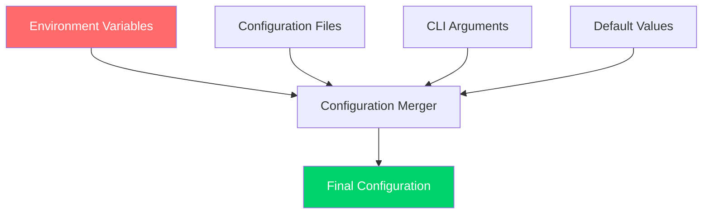

# Environment Configuration

**Complete guide to configuring CCTelegram MCP Server environments for development, staging, and production**

[](../README.md) [](README.md) [](../security/README.md)

---

## 🌍 Environment Overview

The CCTelegram MCP Server supports multiple deployment environments with dedicated configuration profiles optimized for different use cases.

### Supported Environments

| Environment | Purpose | Security Level | Performance Profile |
|-------------|---------|----------------|-------------------|
| **Development** | Local development and testing | Basic | Debug-optimized |
| **Staging** | Pre-production validation | Enhanced | Production-like |
| **Production** | Live deployment | Maximum | High-performance |
| **Testing** | Automated testing and CI/CD | Isolated | Test-optimized |

---

## 🔧 Configuration Architecture

### Configuration Sources (Priority Order)

1. **Environment Variables** - Runtime configuration (highest priority)
2. **Configuration Files** - TOML/JSON configuration files
3. **CLI Arguments** - Command-line overrides
4. **Default Values** - Built-in fallbacks (lowest priority)



### Configuration File Locations

```bash
# Primary configuration file
config/cctelegram.toml

# Environment-specific overrides
config/environments/development.toml
config/environments/staging.toml
config/environments/production.toml
config/environments/testing.toml

# Local developer overrides (gitignored)
config/local.toml
```

---

## 🔑 Environment Variables Reference

### Core Service Configuration

```bash
# Environment and deployment
NODE_ENV=production                    # development|staging|production|testing
MCP_DEPLOYMENT_MODE=standalone        # standalone|docker|kubernetes
MCP_LOG_LEVEL=info                   # error|warn|info|debug|trace

# Server configuration
MCP_HOST=0.0.0.0                     # Bind address (0.0.0.0 for containers)
MCP_PORT=8080                        # Server port (8080 default)
MCP_WORKER_THREADS=4                 # Worker thread count (auto-detected)
MCP_MAX_CONNECTIONS=100              # Maximum concurrent connections
```

### Telegram Integration

```bash
# Telegram Bot API
TELEGRAM_BOT_TOKEN=your_bot_token_here    # Required: Bot API token
TELEGRAM_CHAT_ID=your_chat_id_here        # Required: Target chat ID
TELEGRAM_API_URL=https://api.telegram.org # Optional: Custom API endpoint

# Bot behavior
TELEGRAM_PARSE_MODE=MarkdownV2           # HTML|Markdown|MarkdownV2
TELEGRAM_DISABLE_NOTIFICATION=false     # true|false
TELEGRAM_TIMEOUT=30                      # API timeout in seconds
TELEGRAM_RETRY_ATTEMPTS=3                # Retry attempts for failed requests
```

### File System Configuration

```bash
# File system paths (absolute paths recommended)
MCP_EVENT_DIRECTORY=/var/lib/cctelegram/events
MCP_RESPONSE_DIRECTORY=/var/lib/cctelegram/responses
MCP_STATUS_DIRECTORY=/var/lib/cctelegram/status
MCP_LOG_DIRECTORY=/var/log/cctelegram
MCP_CONFIG_DIRECTORY=/etc/cctelegram

# File management
MCP_CLEANUP_INTERVAL=300             # Cleanup interval in seconds
MCP_MAX_FILE_AGE=3600               # Maximum file age in seconds
MCP_MAX_DIRECTORY_SIZE=1073741824   # Maximum directory size in bytes (1GB)
```

### Performance and Resource Management

```bash
# Memory management
MCP_MAX_MEMORY_USAGE=536870912       # Maximum memory usage in bytes (512MB)
MCP_GC_INTERVAL=60                   # Garbage collection interval in seconds
MCP_MEMORY_PRESSURE_THRESHOLD=0.8   # Memory pressure threshold (0.0-1.0)

# Performance tuning
MCP_ENABLE_CACHING=true              # Enable response caching
MCP_CACHE_TTL=3600                   # Cache TTL in seconds
MCP_MAX_CONCURRENT_EVENTS=50         # Maximum concurrent event processing
MCP_EVENT_QUEUE_SIZE=1000           # Event queue size
```

### Security Configuration

```bash
# Authentication and authorization
MCP_ENABLE_AUTH=true                 # Enable authentication
MCP_AUTH_TOKEN=your_secure_token     # API authentication token
MCP_ALLOWED_ORIGINS=*               # CORS allowed origins
MCP_ALLOWED_USERS=user1,user2       # Comma-separated allowed user list

# Rate limiting
MCP_ENABLE_RATE_LIMIT=true          # Enable rate limiting
MCP_RATE_LIMIT_WINDOW=60            # Rate limit window in seconds
MCP_RATE_LIMIT_MAX_REQUESTS=100     # Maximum requests per window

# Input validation
MCP_ENABLE_INPUT_VALIDATION=true    # Enable input validation
MCP_MAX_REQUEST_SIZE=10485760       # Maximum request size in bytes (10MB)
MCP_SANITIZATION_LEVEL=strict       # strict|moderate|permissive
```

### Monitoring and Observability

```bash
# Logging configuration
MCP_LOG_FORMAT=json                 # json|text
MCP_LOG_TIMESTAMP=true              # Include timestamps in logs
MCP_LOG_LEVEL=info                  # Logging level
MCP_AUDIT_LOGGING=true              # Enable audit logging

# Metrics and monitoring
MCP_ENABLE_METRICS=true             # Enable Prometheus metrics
MCP_METRICS_PORT=9090               # Metrics server port
MCP_HEALTH_CHECK_INTERVAL=30        # Health check interval in seconds
MCP_PERFORMANCE_MONITORING=true     # Enable performance monitoring
```

### Development and Debugging

```bash
# Development features
MCP_DEBUG_MODE=false                # Enable debug mode
MCP_HOT_RELOAD=false               # Enable hot reload (development only)
MCP_MOCK_TELEGRAM=false            # Use mock Telegram API
MCP_VERBOSE_ERRORS=false           # Include stack traces in errors

# Testing configuration
MCP_TEST_MODE=false                # Enable test mode
MCP_TEST_DATA_DIRECTORY=/tmp/test  # Test data directory
MCP_DISABLE_EXTERNAL_CALLS=false   # Disable external API calls
```

---

## 📋 Environment-Specific Configurations

### Development Environment

**File:** `config/environments/development.toml`

```toml
[server]
host = "127.0.0.1"
port = 8080
worker_threads = 2
debug_mode = true
hot_reload = true

[logging]
level = "debug"
format = "text"
timestamp = true
audit_logging = false

[security]
enable_auth = false
rate_limit_enabled = false
input_validation_level = "moderate"

[performance]
enable_caching = false
max_concurrent_events = 10
memory_gc_interval = 30

[telegram]
mock_api = true
timeout = 10
retry_attempts = 1

[files]
cleanup_interval = 60
max_file_age = 300
```

### Staging Environment

**File:** `config/environments/staging.toml`

```toml
[server]
host = "0.0.0.0"
port = 8080
worker_threads = 4
debug_mode = false

[logging]
level = "info"
format = "json"
timestamp = true
audit_logging = true

[security]
enable_auth = true
rate_limit_enabled = true
rate_limit_max_requests = 200
input_validation_level = "strict"
sanitization_level = "strict"

[performance]
enable_caching = true
cache_ttl = 1800
max_concurrent_events = 25
memory_max_usage = "256MB"

[monitoring]
enable_metrics = true
health_check_interval = 15
performance_monitoring = true

[files]
cleanup_interval = 300
max_file_age = 1800
max_directory_size = "500MB"
```

### Production Environment

**File:** `config/environments/production.toml`

```toml
[server]
host = "0.0.0.0"
port = 8080
worker_threads = 8
max_connections = 200

[logging]
level = "warn"
format = "json"
timestamp = true
audit_logging = true
log_rotation = true
max_log_size = "100MB"

[security]
enable_auth = true
auth_token_required = true
rate_limit_enabled = true
rate_limit_max_requests = 500
input_validation_level = "strict"
sanitization_level = "strict"
enable_cors = false

[performance]
enable_caching = true
cache_ttl = 3600
max_concurrent_events = 100
memory_max_usage = "1GB"
gc_interval = 300

[monitoring]
enable_metrics = true
metrics_port = 9090
health_check_interval = 10
performance_monitoring = true
alert_webhooks = ["https://alerts.internal/webhook"]

[files]
cleanup_interval = 600
max_file_age = 7200
max_directory_size = "2GB"
retention_policy = "compress_old"

[telegram]
timeout = 60
retry_attempts = 5
connection_pooling = true
```

---

## 🐳 Container Configuration

### Docker Environment Variables

```dockerfile
# Dockerfile environment configuration
ENV NODE_ENV=production
ENV MCP_LOG_LEVEL=info
ENV MCP_HOST=0.0.0.0
ENV MCP_PORT=8080

# Security hardening
ENV MCP_ENABLE_AUTH=true
ENV MCP_RATE_LIMIT_ENABLED=true
ENV MCP_INPUT_VALIDATION_LEVEL=strict

# Performance optimization
ENV MCP_WORKER_THREADS=4
ENV MCP_MAX_MEMORY_USAGE=536870912
ENV MCP_ENABLE_CACHING=true

# File system configuration
ENV MCP_EVENT_DIRECTORY=/app/data/events
ENV MCP_RESPONSE_DIRECTORY=/app/data/responses
ENV MCP_STATUS_DIRECTORY=/app/data/status
ENV MCP_LOG_DIRECTORY=/app/logs
```

### Docker Compose Configuration

```yaml
version: '3.8'
services:
  cctelegram-mcp:
    image: cctelegram/mcp-server:latest
    environment:
      # Core configuration
      NODE_ENV: production
      MCP_LOG_LEVEL: info
      
      # Telegram configuration
      TELEGRAM_BOT_TOKEN: ${TELEGRAM_BOT_TOKEN}
      TELEGRAM_CHAT_ID: ${TELEGRAM_CHAT_ID}
      
      # Security
      MCP_ENABLE_AUTH: "true"
      MCP_AUTH_TOKEN: ${MCP_AUTH_TOKEN}
      MCP_RATE_LIMIT_ENABLED: "true"
      
      # Performance
      MCP_MAX_MEMORY_USAGE: "1073741824" # 1GB
      MCP_WORKER_THREADS: "6"
      MCP_ENABLE_CACHING: "true"
      
      # Monitoring
      MCP_ENABLE_METRICS: "true"
      MCP_METRICS_PORT: "9090"
      
    ports:
      - "8080:8080"
      - "9090:9090"
    volumes:
      - ./data:/app/data
      - ./logs:/app/logs
      - ./config:/app/config
    restart: unless-stopped
    healthcheck:
      test: ["CMD", "curl", "-f", "http://localhost:8080/health"]
      interval: 30s
      timeout: 10s
      retries: 3
```

---

## ☸️ Kubernetes Configuration

### ConfigMap for Environment Configuration

```yaml
apiVersion: v1
kind: ConfigMap
metadata:
  name: cctelegram-config
  namespace: cctelegram
data:
  NODE_ENV: "production"
  MCP_LOG_LEVEL: "info"
  MCP_HOST: "0.0.0.0"
  MCP_PORT: "8080"
  MCP_WORKER_THREADS: "8"
  MCP_MAX_CONNECTIONS: "200"
  MCP_ENABLE_AUTH: "true"
  MCP_RATE_LIMIT_ENABLED: "true"
  MCP_RATE_LIMIT_MAX_REQUESTS: "1000"
  MCP_ENABLE_CACHING: "true"
  MCP_CACHE_TTL: "3600"
  MCP_ENABLE_METRICS: "true"
  MCP_METRICS_PORT: "9090"
  MCP_HEALTH_CHECK_INTERVAL: "10"
```

### Secret for Sensitive Configuration

```yaml
apiVersion: v1
kind: Secret
metadata:
  name: cctelegram-secrets
  namespace: cctelegram
type: Opaque
stringData:
  TELEGRAM_BOT_TOKEN: "your-bot-token-here"
  TELEGRAM_CHAT_ID: "your-chat-id-here"
  MCP_AUTH_TOKEN: "your-secure-auth-token"
```

### Deployment with Environment Configuration

```yaml
apiVersion: apps/v1
kind: Deployment
metadata:
  name: cctelegram-mcp
  namespace: cctelegram
spec:
  replicas: 3
  selector:
    matchLabels:
      app: cctelegram-mcp
  template:
    metadata:
      labels:
        app: cctelegram-mcp
    spec:
      containers:
      - name: mcp-server
        image: cctelegram/mcp-server:v1.9.0
        ports:
        - containerPort: 8080
          name: http
        - containerPort: 9090
          name: metrics
        envFrom:
        - configMapRef:
            name: cctelegram-config
        - secretRef:
            name: cctelegram-secrets
        resources:
          requests:
            memory: "256Mi"
            cpu: "250m"
          limits:
            memory: "1Gi"
            cpu: "1000m"
        livenessProbe:
          httpGet:
            path: /health
            port: 8080
          initialDelaySeconds: 30
          periodSeconds: 10
        readinessProbe:
          httpGet:
            path: /ready
            port: 8080
          initialDelaySeconds: 5
          periodSeconds: 5
```

---

## 🔧 Configuration Validation

### Environment Validation Script

```bash
#!/bin/bash
# validate-environment.sh

echo "🔍 Validating CCTelegram Environment Configuration..."

# Check required environment variables
required_vars=(
  "NODE_ENV"
  "TELEGRAM_BOT_TOKEN"
  "TELEGRAM_CHAT_ID"
)

missing_vars=()
for var in "${required_vars[@]}"; do
  if [[ -z "${!var}" ]]; then
    missing_vars+=("$var")
  fi
done

if [[ ${#missing_vars[@]} -gt 0 ]]; then
  echo "❌ Missing required environment variables:"
  printf '   %s\n' "${missing_vars[@]}"
  exit 1
fi

# Validate Telegram configuration
if [[ ! $TELEGRAM_BOT_TOKEN =~ ^[0-9]+:[a-zA-Z0-9_-]{35}$ ]]; then
  echo "❌ Invalid TELEGRAM_BOT_TOKEN format"
  exit 1
fi

if [[ ! $TELEGRAM_CHAT_ID =~ ^-?[0-9]+$ ]]; then
  echo "❌ Invalid TELEGRAM_CHAT_ID format"
  exit 1
fi

# Validate directories exist and are writable
directories=(
  "${MCP_EVENT_DIRECTORY:-/var/lib/cctelegram/events}"
  "${MCP_RESPONSE_DIRECTORY:-/var/lib/cctelegram/responses}"
  "${MCP_STATUS_DIRECTORY:-/var/lib/cctelegram/status}"
  "${MCP_LOG_DIRECTORY:-/var/log/cctelegram}"
)

for dir in "${directories[@]}"; do
  if [[ ! -d "$dir" ]]; then
    echo "⚠️  Creating directory: $dir"
    mkdir -p "$dir" || {
      echo "❌ Failed to create directory: $dir"
      exit 1
    }
  fi
  
  if [[ ! -w "$dir" ]]; then
    echo "❌ Directory not writable: $dir"
    exit 1
  fi
done

echo "✅ Environment configuration is valid!"
```

### Configuration Test Suite

```typescript
// config-test.ts
import { loadConfiguration } from '../src/config/loader';
import { validateConfiguration } from '../src/config/validator';

describe('Environment Configuration', () => {
  test('loads development configuration correctly', async () => {
    process.env.NODE_ENV = 'development';
    const config = await loadConfiguration();
    
    expect(config.server.host).toBe('127.0.0.1');
    expect(config.logging.level).toBe('debug');
    expect(config.security.enableAuth).toBe(false);
  });

  test('loads production configuration correctly', async () => {
    process.env.NODE_ENV = 'production';
    const config = await loadConfiguration();
    
    expect(config.server.host).toBe('0.0.0.0');
    expect(config.logging.level).toBe('warn');
    expect(config.security.enableAuth).toBe(true);
    expect(config.security.rateLimitEnabled).toBe(true);
  });

  test('validates required environment variables', () => {
    const requiredVars = [
      'TELEGRAM_BOT_TOKEN',
      'TELEGRAM_CHAT_ID'
    ];
    
    for (const varName of requiredVars) {
      delete process.env[varName];
      expect(() => validateConfiguration()).toThrow();
    }
  });

  test('validates Telegram configuration format', () => {
    process.env.TELEGRAM_BOT_TOKEN = 'invalid-token';
    expect(() => validateConfiguration()).toThrow(/Invalid bot token format/);
    
    process.env.TELEGRAM_CHAT_ID = 'invalid-chat-id';
    expect(() => validateConfiguration()).toThrow(/Invalid chat ID format/);
  });
});
```

---

## 🚀 Deployment Workflows

### Development Deployment

```bash
#!/bin/bash
# deploy-development.sh

export NODE_ENV=development
export MCP_LOG_LEVEL=debug
export MCP_DEBUG_MODE=true
export MCP_HOT_RELOAD=true

# Start with development configuration
npm run dev
```

### Production Deployment

```bash
#!/bin/bash
# deploy-production.sh

# Validate environment
./scripts/validate-environment.sh

# Build production artifacts
npm run build

# Set production environment
export NODE_ENV=production
export MCP_LOG_LEVEL=warn
export MCP_ENABLE_AUTH=true
export MCP_RATE_LIMIT_ENABLED=true

# Start production server
npm run start:prod
```

---

## 🔗 Related Documentation

### Configuration Resources
- **[Infrastructure Requirements](infrastructure.md)** - Infrastructure setup and requirements
- **[Monitoring Setup](monitoring-setup.md)** - Monitoring and observability configuration
- **[Security Configuration](../security/security-procedures.md)** - Security hardening procedures

### Deployment Guides
- **[Deployment Overview](README.md)** - Complete deployment guide
- **[Enterprise Guide](enterprise-guide.md)** - Enterprise deployment patterns
- **[Container Deployment](container-deployment.md)** - Docker and Kubernetes deployment

---

*Environment Configuration Guide - Version 1.8.5*  
*Last updated: August 2025 | Next review: November 2025*

## See Also

- **[Configuration Reference](../../reference/configuration.md)** - Complete configuration options
- **[Security Guide](../security/README.md)** - Security configuration and best practices
- **[Operations Runbooks](../operations/runbooks/README.md)** - Operational procedures and troubleshooting