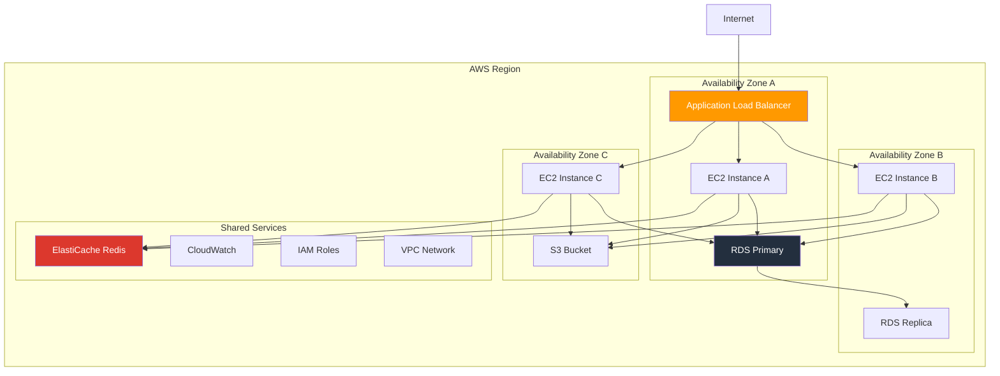

# Infrastructure Requirements

**Comprehensive infrastructure requirements and specifications for CCTelegram MCP Server deployment**

[](README.md) [](README.md) [](README.md)

---

## 🖥️ System Requirements

### Minimum Hardware Requirements

#### **Single Instance Deployment**
```yaml
CPU:
  - 2 vCPUs (x86_64 or ARM64)
  - 2.0 GHz base frequency minimum
  - Support for hardware virtualization (recommended)

Memory:
  - 4 GB RAM minimum
  - 8 GB RAM recommended for production
  - 16 GB+ for high-volume deployments

Storage:
  - 20 GB available disk space
  - SSD storage recommended
  - 50 GB+ for comprehensive logging and backups
  - RAID 1 or higher for production environments

Network:
  - 1 Gbps network interface
  - Stable internet connection
  - Static IP address (recommended)
  - IPv4 and IPv6 support
```

#### **High Availability Deployment**
```yaml
Load Balancer:
  - 2 vCPUs, 4 GB RAM
  - Redundant network interfaces
  - Health check capabilities

Application Servers (3+ instances):
  - 4 vCPUs, 8 GB RAM each
  - 50 GB SSD storage each
  - Auto-scaling capabilities

Database Cluster:
  - Primary: 4 vCPUs, 16 GB RAM, 100 GB SSD
  - Replica: 4 vCPUs, 16 GB RAM, 100 GB SSD
  - Backup storage: 500 GB+ capacity

Monitoring & Logging:
  - 2 vCPUs, 8 GB RAM
  - 200 GB+ SSD for log retention
  - Time-series database capabilities
```

### Recommended Hardware Specifications

#### **Production Environment**
```yaml
Application Tier:
  - CPU: 8 vCPUs (Intel Xeon or AMD EPYC)
  - Memory: 32 GB RAM
  - Storage: 200 GB NVMe SSD
  - Network: 10 Gbps interface
  - Redundancy: N+1 configuration

Database Tier:
  - CPU: 16 vCPUs with high clock speed
  - Memory: 64 GB RAM
  - Storage: 1 TB NVMe SSD with RAID 10
  - Network: 25 Gbps interface
  - Backup: Dedicated backup storage array

Cache Tier:
  - CPU: 4 vCPUs
  - Memory: 16 GB RAM (Redis/Memcached)
  - Storage: 50 GB SSD
  - Network: Low-latency connection
```

---

## ☁️ Cloud Infrastructure

### AWS Infrastructure

#### **Architecture Overview**


#### **AWS Services Configuration**
```yaml
Compute (EC2):
  Instance Type: t3.large or m5.xlarge
  AMI: Amazon Linux 2023 or Ubuntu 22.04 LTS
  Auto Scaling: 2-10 instances
  Load Balancer: Application Load Balancer (ALB)
  Target Groups: Health check on /health endpoint

Database (RDS):
  Engine: PostgreSQL 15+ or MySQL 8.0+
  Instance Class: db.r6g.xlarge
  Multi-AZ: Enabled for production
  Backup Retention: 30 days
  Encryption: At-rest and in-transit

Caching (ElastiCache):
  Engine: Redis 7.0+
  Node Type: cache.r6g.large
  Cluster Mode: Enabled
  Encryption: At-rest and in-transit
  Backup: Daily snapshots

Storage (S3):
  Bucket: Versioning enabled
  Encryption: SSE-S3 or SSE-KMS
  Lifecycle Policy: Intelligent tiering
  Access: IAM roles and policies

Networking (VPC):
  CIDR: 10.0.0.0/16
  Subnets: Public and private in each AZ
  NAT Gateway: For outbound internet access
  Security Groups: Least privilege access
```

### Azure Infrastructure

#### **Azure Architecture**
```yaml
Resource Group: cctelegram-prod

Compute (Virtual Machines):
  - VM Size: Standard_D4s_v3 or higher
  - OS: Ubuntu 22.04 LTS
  - Availability Set: 3 fault domains, 5 update domains
  - Load Balancer: Azure Load Balancer (Layer 4) or Application Gateway (Layer 7)

Database (Azure Database):
  - Service: Azure Database for PostgreSQL or MySQL
  - Tier: General Purpose or Business Critical
  - Compute: 4 vCores, 32 GB RAM
  - Storage: 1 TB Premium SSD
  - Backup: Geo-redundant backup

Caching (Azure Cache for Redis):
  - Tier: Premium
  - Size: P2 (6 GB)
  - Clustering: Enabled
  - Persistence: RDB backup

Storage (Azure Blob Storage):
  - Performance Tier: Premium
  - Replication: GRS (Geo-Redundant Storage)
  - Access Tier: Hot
  - Encryption: Microsoft-managed keys or customer-managed keys

Networking (Virtual Network):
  - Address Space: 10.0.0.0/16
  - Subnets: Frontend (10.0.1.0/24), Backend (10.0.2.0/24), Data (10.0.3.0/24)
  - Network Security Groups: Application-specific rules
```

### Google Cloud Platform (GCP)

#### **GCP Architecture**
```yaml
Project: cctelegram-prod

Compute (Compute Engine):
  - Machine Type: n2-standard-4 or c2-standard-8
  - Image: Ubuntu 22.04 LTS or Container-Optimized OS
  - Instance Groups: Managed instance groups with auto-scaling
  - Load Balancer: HTTP(S) Load Balancer

Database (Cloud SQL):
  - Database Engine: PostgreSQL 15 or MySQL 8.0
  - Machine Type: db-custom-4-16384
  - Storage: 500 GB SSD
  - High Availability: Regional persistent disks
  - Backup: Automated daily backups

Caching (Memorystore):
  - Redis: 6 GB Standard Tier
  - Region: Same as compute instances
  - Network: Authorized VPC networks
  - Backup: Point-in-time recovery

Storage (Cloud Storage):
  - Bucket Class: Regional or Multi-regional
  - Encryption: Google-managed or customer-managed
  - Lifecycle Management: Automatic archival
  - IAM: Fine-grained access control

Networking (VPC):
  - Network: Auto mode or custom mode
  - Subnets: Regional subnets per tier
  - Firewall Rules: Source-based and tag-based
  - Cloud NAT: For outbound internet access
```

---

## 🐳 Container Infrastructure

### Docker Deployment

#### **Container Architecture**
```yaml
Services:
  mcp-server:
    image: cctelegram/mcp-server:latest
    ports: ["8080:8080"]
    environment:
      - NODE_ENV=production
      - DATABASE_URL=${DATABASE_URL}
      - REDIS_URL=${REDIS_URL}
    health_check:
      test: ["CMD", "curl", "-f", "http://localhost:8080/health"]
      interval: 30s
      timeout: 10s
      retries: 3
    deploy:
      replicas: 3
      resources:
        limits: {memory: 2G, cpus: '1.0'}
        reservations: {memory: 1G, cpus: '0.5'}

  bridge:
    image: cctelegram/bridge:latest
    environment:
      - RUST_ENV=production
      - MCP_SERVER_URL=http://mcp-server:8080
      - TELEGRAM_BOT_TOKEN=${TELEGRAM_BOT_TOKEN}
    deploy:
      replicas: 2
      resources:
        limits: {memory: 512M, cpus: '0.5'}

  database:
    image: postgres:15-alpine
    environment:
      - POSTGRES_DB=cctelegram
      - POSTGRES_USER=cctelegram
      - POSTGRES_PASSWORD=${DB_PASSWORD}
    volumes:
      - postgres_data:/var/lib/postgresql/data
    deploy:
      replicas: 1
      placement:
        constraints: [node.role == manager]

  redis:
    image: redis:7-alpine
    command: redis-server --appendonly yes --requirepass ${REDIS_PASSWORD}
    volumes:
      - redis_data:/data
    deploy:
      replicas: 1
```

### Kubernetes Deployment

#### **Kubernetes Manifests**
```yaml
# Namespace
apiVersion: v1
kind: Namespace
metadata:
  name: cctelegram
---
# ConfigMap
apiVersion: v1
kind: ConfigMap
metadata:
  name: cctelegram-config
  namespace: cctelegram
data:
  NODE_ENV: "production"
  LOG_LEVEL: "info"
  METRICS_ENABLED: "true"
---
# Secret
apiVersion: v1
kind: Secret
metadata:
  name: cctelegram-secrets
  namespace: cctelegram
type: Opaque
data:
  database-url: <base64-encoded-database-url>
  telegram-bot-token: <base64-encoded-bot-token>
  redis-password: <base64-encoded-redis-password>
---
# Deployment - MCP Server
apiVersion: apps/v1
kind: Deployment
metadata:
  name: mcp-server
  namespace: cctelegram
spec:
  replicas: 3
  selector:
    matchLabels:
      app: mcp-server
  template:
    metadata:
      labels:
        app: mcp-server
    spec:
      containers:
      - name: mcp-server
        image: cctelegram/mcp-server:latest
        ports:
        - containerPort: 8080
        env:
        - name: NODE_ENV
          valueFrom:
            configMapKeyRef:
              name: cctelegram-config
              key: NODE_ENV
        - name: DATABASE_URL
          valueFrom:
            secretKeyRef:
              name: cctelegram-secrets
              key: database-url
        resources:
          requests:
            memory: "1Gi"
            cpu: "500m"
          limits:
            memory: "2Gi"
            cpu: "1000m"
        livenessProbe:
          httpGet:
            path: /health
            port: 8080
          initialDelaySeconds: 30
          periodSeconds: 10
        readinessProbe:
          httpGet:
            path: /ready
            port: 8080
          initialDelaySeconds: 10
          periodSeconds: 5
---
# Service
apiVersion: v1
kind: Service
metadata:
  name: mcp-server-service
  namespace: cctelegram
spec:
  selector:
    app: mcp-server
  ports:
  - port: 80
    targetPort: 8080
  type: ClusterIP
---
# Ingress
apiVersion: networking.k8s.io/v1
kind: Ingress
metadata:
  name: cctelegram-ingress
  namespace: cctelegram
  annotations:
    kubernetes.io/ingress.class: "nginx"
    cert-manager.io/cluster-issuer: "letsencrypt-prod"
    nginx.ingress.kubernetes.io/rate-limit: "100"
spec:
  tls:
  - hosts:
    - api.cctelegram.dev
    secretName: cctelegram-tls
  rules:
  - host: api.cctelegram.dev
    http:
      paths:
      - path: /
        pathType: Prefix
        backend:
          service:
            name: mcp-server-service
            port:
              number: 80
```

---

## 📊 Monitoring Infrastructure

### Observability Stack

#### **Prometheus + Grafana Setup**
```yaml
Monitoring Components:
  Prometheus:
    Purpose: Metrics collection and storage
    Retention: 30 days
    Storage: 100 GB SSD minimum
    Scrape Interval: 15 seconds
    
  Grafana:
    Purpose: Visualization and dashboards
    Database: PostgreSQL for dashboard storage
    Authentication: LDAP/OAuth integration
    Alerting: Alert manager integration
    
  Alert Manager:
    Purpose: Alert routing and notification
    Routes: Email, Slack, PagerDuty
    Grouping: Service-based alert grouping
    Silencing: Maintenance window support
    
  Node Exporter:
    Purpose: System metrics collection
    Metrics: CPU, memory, disk, network
    Installation: On all application servers
    Port: 9100 (secured)
```

#### **ELK Stack (Elasticsearch, Logstash, Kibana)**
```yaml
Logging Architecture:
  Elasticsearch:
    Cluster: 3 nodes minimum
    RAM: 32 GB per node
    Storage: 1 TB SSD per node
    Indices: Time-based with rollover
    
  Logstash:
    Purpose: Log processing and enrichment
    Input: Filebeat, syslog, API
    Filters: Grok patterns, geo-location
    Output: Elasticsearch, dead letter queue
    
  Kibana:
    Purpose: Log visualization and analysis
    Authentication: X-Pack security
    Dashboards: Pre-built security dashboards
    Alerting: Watcher-based alerts
    
  Filebeat:
    Purpose: Log shipping
    Installation: On all servers
    Configuration: Centralized management
    TLS: Encrypted log transmission
```

### Application Performance Monitoring (APM)

#### **Jaeger Tracing**
```yaml
Distributed Tracing:
  Jaeger Collector:
    Deployment: Kubernetes DaemonSet
    Storage Backend: Elasticsearch
    Retention: 7 days
    Sampling: Probabilistic (1% default)
    
  Jaeger Agent:
    Purpose: Local trace aggregation
    Buffer: 10,000 spans
    Batch Size: 100 spans
    UDP Port: 6831
    
  Jaeger Query:
    Purpose: Trace query interface
    UI: Web interface for trace analysis
    API: RESTful API for integration
    Authentication: OAuth2/OIDC
```

---

## 🔒 Security Infrastructure

### Network Security

#### **Firewall Configuration**
```yaml
External Firewall (Cloud Provider):
  Inbound Rules:
    - Port 443 (HTTPS): 0.0.0.0/0
    - Port 80 (HTTP): 0.0.0.0/0 → Redirect to HTTPS
    - Port 22 (SSH): Management IP ranges only
    - Custom Ports: Application-specific, restricted sources
    
  Outbound Rules:
    - Port 443 (HTTPS): Required for external APIs
    - Port 53 (DNS): For name resolution
    - Port 123 (NTP): Time synchronization
    - Port 25/587 (SMTP): Email notifications
    
Host-based Firewall (UFW/iptables):
  Default Policy: Deny all
  Allow Rules:
    - SSH from bastion host only
    - Application ports from load balancer
    - Health check endpoints
    - Monitoring agent access
```

#### **VPN Infrastructure**
```yaml
Site-to-Site VPN:
  Type: IPSec tunnel mode
  Encryption: AES-256-GCM
  Authentication: Pre-shared keys or certificates
  Redundancy: Multiple tunnels for high availability
  
Client VPN:
  Protocol: OpenVPN or WireGuard
  Authentication: Multi-factor (certificate + LDAP/RADIUS)
  IP Pool: Dedicated subnet for VPN clients
  Route Table: Split tunneling configuration
  
Bastion Host:
  Purpose: Secure administrative access
  Hardening: Minimal services, key-based auth
  Logging: Complete session logging
  Access: Time-limited, role-based
```

### Certificate Management

#### **TLS Certificate Infrastructure**
```yaml
Certificate Authority:
  Internal CA: For internal service communication
  Public CA: Let's Encrypt or commercial CA
  Validity: 90 days with automatic renewal
  Algorithm: ECDSA P-256 or RSA 2048+
  
Certificate Management:
  Automation: cert-manager for Kubernetes
  Storage: Kubernetes secrets or HashiCorp Vault
  Monitoring: Certificate expiration alerts
  Rotation: Automatic renewal 30 days before expiration
  
mTLS Configuration:
  Service Mesh: Istio or Linkerd
  Certificates: Short-lived service certificates
  Validation: Certificate-based service authentication
  Encryption: End-to-end encryption for all internal traffic
```

---

## 💾 Backup Infrastructure

### Data Backup Strategy

#### **Database Backup**
```yaml
Backup Types:
  Full Backup:
    Schedule: Daily at 2:00 AM UTC
    Retention: 30 days
    Compression: Gzip compression
    Encryption: AES-256 encryption
    
  Incremental Backup:
    Schedule: Every 6 hours
    Retention: 7 days
    Method: WAL (Write-Ahead Log) shipping
    Storage: Separate storage account/bucket
    
  Point-in-Time Recovery:
    Capability: Restore to any point in time
    Granularity: 1-second precision
    Retention: 7 days of WAL files
    Testing: Monthly recovery drills
```

#### **Application Backup**
```yaml
Configuration Backup:
  Files: All configuration files and secrets
  Schedule: Before any configuration change
  Versioning: Git-based version control
  Encryption: GPG encryption for sensitive files
  
Log Backup:
  Retention: 90 days minimum
  Storage: Cold storage after 30 days
  Compression: Automatic compression
  Access: Searchable and indexed
  
Code Backup:
  Repository: Git with multiple remotes
  Branches: Protected main branch
  Tags: Version-based tagging
  Access Control: Role-based repository access
```

### Disaster Recovery

#### **Recovery Time Objectives (RTO)**
```yaml
Service Tiers:
  Critical Services (MCP Server):
    RTO: 15 minutes
    RPO: 5 minutes
    Method: Hot standby with automatic failover
    
  Important Services (Database):
    RTO: 1 hour  
    RPO: 15 minutes
    Method: Warm standby with manual failover
    
  Standard Services (Monitoring):
    RTO: 4 hours
    RPO: 1 hour
    Method: Cold standby with backup restoration
```

---

## 🔗 Related Documentation

### Infrastructure Resources
- **[Environment Configuration](environment-config.md)** - Environment-specific configurations
- **[Monitoring Setup](monitoring-setup.md)** - Monitoring infrastructure setup
- **[Container Deployment](container-deployment.md)** - Container orchestration setup

### Operations Resources
- **[Deployment Overview](README.md)** - Complete deployment guide
- **[Security Guide](../security/README.md)** - Security infrastructure requirements
- **[Operations Center](../operations/README.md)** - Operations and maintenance

---

*Infrastructure Requirements - Version 1.8.5*  
*Last updated: August 2025 | Next review: November 2025*

## See Also

- **[System Architecture](../architecture/system-overview.md)** - Detailed architecture diagrams
- **[Performance Tuning](../maintenance/performance-tuning.md)** - Performance optimization guide
- **[Capacity Planning](../maintenance/capacity-planning.md)** - Infrastructure scaling strategies