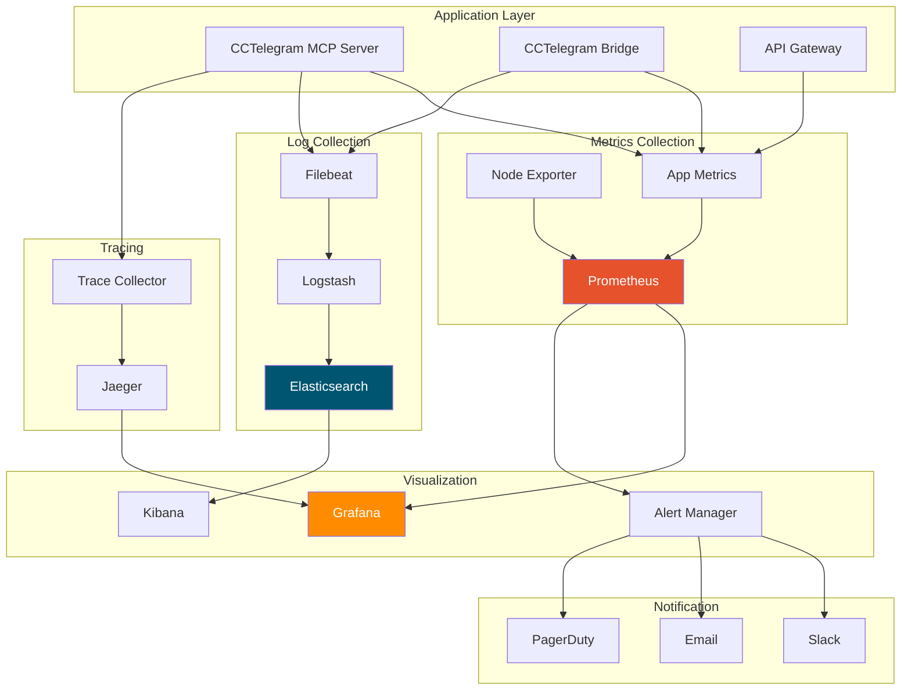

# Monitoring Setup

**Comprehensive monitoring setup and configuration for CCTelegram MCP Server**

[](README.md) [](README.md) [](README.md)

---

## 📊 Monitoring Architecture

### Overview

CCTelegram implements a comprehensive monitoring stack using industry-standard tools for metrics, logs, and traces.



---

## 🔧 Basic Setup

### Quick Installation

#### **Docker Compose Monitoring Stack**
```yaml
version: '3.8'
services:
  # Prometheus for metrics
  prometheus:
    image: prom/prometheus:v2.47.0
    container_name: prometheus
    ports:
      - "9090:9090"
    volumes:
      - ./prometheus.yml:/etc/prometheus/prometheus.yml
      - prometheus_data:/prometheus
    command:
      - '--config.file=/etc/prometheus/prometheus.yml'
      - '--storage.tsdb.path=/prometheus'
      - '--web.console.libraries=/etc/prometheus/console_libraries'
      - '--web.console.templates=/etc/prometheus/consoles'
      - '--storage.tsdb.retention.time=30d'
      - '--web.enable-lifecycle'
      - '--web.enable-admin-api'
    networks:
      - monitoring

  # Grafana for visualization
  grafana:
    image: grafana/grafana:10.1.0
    container_name: grafana
    ports:
      - "3000:3000"
    environment:
      - GF_SECURITY_ADMIN_PASSWORD=admin123
      - GF_INSTALL_PLUGINS=grafana-clock-panel,grafana-simple-json-datasource
    volumes:
      - grafana_data:/var/lib/grafana
      - ./grafana/dashboards:/etc/grafana/provisioning/dashboards
      - ./grafana/datasources:/etc/grafana/provisioning/datasources
    networks:
      - monitoring
    depends_on:
      - prometheus

  # Node Exporter for system metrics
  node_exporter:
    image: prom/node-exporter:v1.6.1
    container_name: node_exporter
    ports:
      - "9100:9100"
    volumes:
      - /proc:/host/proc:ro
      - /sys:/host/sys:ro
      - /:/rootfs:ro
    command:
      - '--path.procfs=/host/proc'
      - '--path.rootfs=/rootfs'
      - '--path.sysfs=/host/sys'
      - '--collector.filesystem.mount-points-exclude=^/(sys|proc|dev|host|etc)($$|/)'
    networks:
      - monitoring

  # Alert Manager for notifications
  alertmanager:
    image: prom/alertmanager:v0.26.0
    container_name: alertmanager
    ports:
      - "9093:9093"
    volumes:
      - ./alertmanager.yml:/etc/alertmanager/alertmanager.yml
      - alertmanager_data:/alertmanager
    networks:
      - monitoring

  # Elasticsearch for logs
  elasticsearch:
    image: docker.elastic.co/elasticsearch/elasticsearch:8.9.0
    container_name: elasticsearch
    environment:
      - discovery.type=single-node
      - "ES_JAVA_OPTS=-Xms2g -Xmx2g"
      - xpack.security.enabled=false
    ports:
      - "9200:9200"
    volumes:
      - elasticsearch_data:/usr/share/elasticsearch/data
    networks:
      - monitoring

  # Kibana for log visualization
  kibana:
    image: docker.elastic.co/kibana/kibana:8.9.0
    container_name: kibana
    ports:
      - "5601:5601"
    environment:
      - ELASTICSEARCH_HOSTS=http://elasticsearch:9200
    networks:
      - monitoring
    depends_on:
      - elasticsearch

volumes:
  prometheus_data:
  grafana_data:
  alertmanager_data:
  elasticsearch_data:

networks:
  monitoring:
    driver: bridge
```

#### **Installation Script**
```bash
#!/bin/bash
# install-monitoring.sh - Quick monitoring setup

echo "🚀 Installing CCTelegram Monitoring Stack"
echo "========================================="

# Create monitoring directory
mkdir -p ~/cctelegram-monitoring/{config,data}
cd ~/cctelegram-monitoring

# Download configuration files
echo "📥 Downloading configuration files..."
wget -O docker-compose.yml https://raw.githubusercontent.com/cctelegram/monitoring/main/docker-compose.yml
wget -O config/prometheus.yml https://raw.githubusercontent.com/cctelegram/monitoring/main/prometheus.yml
wget -O config/alertmanager.yml https://raw.githubusercontent.com/cctelegram/monitoring/main/alertmanager.yml

# Create Grafana provisioning directories
mkdir -p config/grafana/{dashboards,datasources}
wget -O config/grafana/datasources/prometheus.yml https://raw.githubusercontent.com/cctelegram/monitoring/main/grafana/datasources/prometheus.yml
wget -O config/grafana/dashboards/cctelegram.json https://raw.githubusercontent.com/cctelegram/monitoring/main/grafana/dashboards/cctelegram.json

# Set permissions
chmod +x config/prometheus.yml
chmod +x config/alertmanager.yml

# Start monitoring stack
echo "🐳 Starting monitoring containers..."
docker-compose up -d

# Wait for services to start
echo "⏳ Waiting for services to start..."
sleep 30

# Verify services
echo "✅ Verifying services..."
curl -s http://localhost:9090/api/v1/targets | jq '.data.activeTargets[] | select(.health == "up") | .labels.job'
curl -s http://localhost:3000/api/health

echo "========================================="
echo "✅ Monitoring stack installed successfully!"
echo ""
echo "🔗 Access URLs:"
echo "   Grafana:     http://localhost:3000 (admin/admin123)"
echo "   Prometheus:  http://localhost:9090"
echo "   Kibana:      http://localhost:5601"
echo "   AlertManager: http://localhost:9093"
echo ""
echo "📊 Next steps:"
echo "   1. Configure alert notification channels"
echo "   2. Import CCTelegram dashboards"
echo "   3. Set up log forwarding from applications"
echo "========================================="
```

---

## 📈 Metrics Configuration

### Prometheus Configuration

#### **prometheus.yml**
```yaml
global:
  scrape_interval: 15s
  evaluation_interval: 15s
  external_labels:
    cluster: 'cctelegram-prod'
    region: 'us-west-2'

rule_files:
  - "alerts/*.yml"

alerting:
  alertmanagers:
    - static_configs:
        - targets:
          - alertmanager:9093

scrape_configs:
  # Prometheus itself
  - job_name: 'prometheus'
    static_configs:
      - targets: ['localhost:9090']

  # Node Exporter for system metrics
  - job_name: 'node'
    static_configs:
      - targets: 
        - 'node_exporter:9100'
        - 'host1:9100'
        - 'host2:9100'
    scrape_interval: 30s
    metrics_path: /metrics

  # CCTelegram MCP Server
  - job_name: 'cctelegram-mcp'
    static_configs:
      - targets:
        - 'mcp-server:8080'
    metrics_path: /metrics
    scrape_interval: 15s
    params:
      format: ['prometheus']

  # CCTelegram Bridge
  - job_name: 'cctelegram-bridge'
    static_configs:
      - targets:
        - 'bridge:3030'
    metrics_path: /metrics
    scrape_interval: 15s

  # Database metrics (if PostgreSQL with postgres_exporter)
  - job_name: 'postgres'
    static_configs:
      - targets: ['postgres-exporter:9187']
    scrape_interval: 30s

  # Redis metrics (if Redis with redis_exporter)
  - job_name: 'redis'
    static_configs:
      - targets: ['redis-exporter:9121']
    scrape_interval: 30s

  # Docker metrics (if using cAdvisor)
  - job_name: 'cadvisor'
    static_configs:
      - targets: ['cadvisor:8080']
    scrape_interval: 30s
    metrics_path: /metrics

  # Application-specific metrics
  - job_name: 'cctelegram-custom'
    static_configs:
      - targets: ['app:9091']
    metrics_path: /custom-metrics
    scrape_interval: 15s
```

### Application Metrics Integration

#### **Node.js (MCP Server) Metrics**
```javascript
// metrics.js - Application metrics setup
const promClient = require('prom-client');

// Create a Registry
const register = new promClient.Registry();

// Add default metrics
promClient.collectDefaultMetrics({
  register,
  prefix: 'cctelegram_mcp_'
});

// Custom metrics
const httpRequestDuration = new promClient.Histogram({
  name: 'cctelegram_mcp_http_request_duration_seconds',
  help: 'Duration of HTTP requests in seconds',
  labelNames: ['method', 'route', 'status_code'],
  buckets: [0.1, 0.3, 0.5, 0.7, 1, 3, 5, 7, 10]
});

const httpRequestTotal = new promClient.Counter({
  name: 'cctelegram_mcp_http_requests_total',
  help: 'Total number of HTTP requests',
  labelNames: ['method', 'route', 'status_code']
});

const activeConnections = new promClient.Gauge({
  name: 'cctelegram_mcp_active_connections',
  help: 'Number of active connections'
});

const telegramEvents = new promClient.Counter({
  name: 'cctelegram_telegram_events_total',
  help: 'Total number of Telegram events processed',
  labelNames: ['event_type', 'status']
});

const queueSize = new promClient.Gauge({
  name: 'cctelegram_mcp_queue_size',
  help: 'Current size of event queue',
  labelNames: ['queue_name']
});

// Register custom metrics
register.registerMetric(httpRequestDuration);
register.registerMetric(httpRequestTotal);
register.registerMetric(activeConnections);
register.registerMetric(telegramEvents);
register.registerMetric(queueSize);

// Middleware for Express
const metricsMiddleware = (req, res, next) => {
  const start = Date.now();
  
  res.on('finish', () => {
    const duration = (Date.now() - start) / 1000;
    const route = req.route ? req.route.path : req.path;
    
    httpRequestDuration
      .labels(req.method, route, res.statusCode)
      .observe(duration);
    
    httpRequestTotal
      .labels(req.method, route, res.statusCode)
      .inc();
  });
  
  next();
};

// Metrics endpoint
const getMetrics = async () => {
  return register.metrics();
};

// Update metrics functions
const updateActiveConnections = (count) => {
  activeConnections.set(count);
};

const recordTelegramEvent = (eventType, status = 'success') => {
  telegramEvents.labels(eventType, status).inc();
};

const updateQueueSize = (queueName, size) => {
  queueSize.labels(queueName).set(size);
};

module.exports = {
  register,
  metricsMiddleware,
  getMetrics,
  updateActiveConnections,
  recordTelegramEvent,
  updateQueueSize
};
```

#### **Rust (Bridge) Metrics**
```rust
// metrics.rs - Bridge metrics setup
use prometheus::{Counter, Gauge, Histogram, Registry};
use std::sync::Arc;

pub struct Metrics {
    pub registry: Arc<Registry>,
    pub bridge_events_total: Counter,
    pub bridge_connections: Gauge,
    pub bridge_response_time: Histogram,
    pub telegram_api_calls: Counter,
    pub error_count: Counter,
}

impl Metrics {
    pub fn new() -> Self {
        let registry = Arc::new(Registry::new());
        
        let bridge_events_total = Counter::new(
            "cctelegram_bridge_events_total",
            "Total number of bridge events processed"
        ).unwrap();
        
        let bridge_connections = Gauge::new(
            "cctelegram_bridge_connections",
            "Number of active bridge connections"
        ).unwrap();
        
        let bridge_response_time = Histogram::with_opts(
            prometheus::HistogramOpts::new(
                "cctelegram_bridge_response_time_seconds",
                "Bridge response time in seconds"
            ).buckets(vec![0.001, 0.005, 0.01, 0.05, 0.1, 0.5, 1.0])
        ).unwrap();
        
        let telegram_api_calls = Counter::new(
            "cctelegram_bridge_telegram_api_calls_total",
            "Total number of Telegram API calls"
        ).unwrap();
        
        let error_count = Counter::new(
            "cctelegram_bridge_errors_total", 
            "Total number of bridge errors"
        ).unwrap();
        
        // Register metrics
        registry.register(Box::new(bridge_events_total.clone())).unwrap();
        registry.register(Box::new(bridge_connections.clone())).unwrap();
        registry.register(Box::new(bridge_response_time.clone())).unwrap();
        registry.register(Box::new(telegram_api_calls.clone())).unwrap();
        registry.register(Box::new(error_count.clone())).unwrap();
        
        Self {
            registry,
            bridge_events_total,
            bridge_connections,
            bridge_response_time,
            telegram_api_calls,
            error_count,
        }
    }
    
    pub fn record_event(&self) {
        self.bridge_events_total.inc();
    }
    
    pub fn set_connections(&self, count: f64) {
        self.bridge_connections.set(count);
    }
    
    pub fn record_response_time(&self, duration: f64) {
        self.bridge_response_time.observe(duration);
    }
    
    pub fn record_telegram_api_call(&self) {
        self.telegram_api_calls.inc();
    }
    
    pub fn record_error(&self) {
        self.error_count.inc();
    }
}
```

---

## 🚨 Alerting Configuration

### Alert Rules

#### **alerts/cctelegram.yml**
```yaml
groups:
- name: cctelegram.rules
  rules:
  # High CPU usage
  - alert: HighCPUUsage
    expr: 100 - (avg by(instance) (rate(node_cpu_seconds_total{mode="idle"}[2m])) * 100) > 80
    for: 2m
    labels:
      severity: warning
      service: system
    annotations:
      summary: "High CPU usage detected"
      description: "{{ $labels.instance }} has CPU usage above 80% (current value: {{ $value }}%)"
      runbook_url: "https://docs.cctelegram.dev/runbooks/high-cpu"

  # High memory usage
  - alert: HighMemoryUsage
    expr: (node_memory_MemTotal_bytes - node_memory_MemAvailable_bytes) / node_memory_MemTotal_bytes * 100 > 85
    for: 2m
    labels:
      severity: warning
      service: system
    annotations:
      summary: "High memory usage detected"
      description: "{{ $labels.instance }} has memory usage above 85% (current value: {{ $value }}%)"
      runbook_url: "https://docs.cctelegram.dev/runbooks/high-memory"

  # Disk space low
  - alert: DiskSpaceLow
    expr: node_filesystem_avail_bytes{fstype!="tmpfs"} / node_filesystem_size_bytes{fstype!="tmpfs"} * 100 < 10
    for: 1m
    labels:
      severity: critical
      service: system
    annotations:
      summary: "Disk space critically low"
      description: "{{ $labels.instance }} has less than 10% disk space available on {{ $labels.mountpoint }}"
      runbook_url: "https://docs.cctelegram.dev/runbooks/disk-space"

  # MCP Server down
  - alert: MCPServerDown
    expr: up{job="cctelegram-mcp"} == 0
    for: 30s
    labels:
      severity: critical
      service: cctelegram
    annotations:
      summary: "MCP Server is down"
      description: "{{ $labels.instance }} MCP Server is not responding"
      runbook_url: "https://docs.cctelegram.dev/runbooks/mcp-server-down"

  # Bridge connection issues
  - alert: BridgeConnectionLow
    expr: cctelegram_bridge_connections < 1
    for: 1m
    labels:
      severity: critical
      service: cctelegram
    annotations:
      summary: "Bridge has no active connections"
      description: "CCTelegram Bridge has no active connections to Telegram"
      runbook_url: "https://docs.cctelegram.dev/runbooks/bridge-connection"

  # High error rate
  - alert: HighErrorRate
    expr: rate(cctelegram_mcp_http_requests_total{status_code=~"5.."}[5m]) / rate(cctelegram_mcp_http_requests_total[5m]) * 100 > 5
    for: 2m
    labels:
      severity: warning
      service: cctelegram
    annotations:
      summary: "High error rate detected"
      description: "Error rate is {{ $value }}% over the last 5 minutes"
      runbook_url: "https://docs.cctelegram.dev/runbooks/high-error-rate"

  # Slow response times
  - alert: SlowResponseTime
    expr: histogram_quantile(0.95, rate(cctelegram_mcp_http_request_duration_seconds_bucket[5m])) > 2
    for: 3m
    labels:
      severity: warning
      service: cctelegram
    annotations:
      summary: "Slow response times detected"
      description: "95th percentile response time is {{ $value }} seconds"
      runbook_url: "https://docs.cctelegram.dev/runbooks/slow-response"

  # Queue size too large
  - alert: QueueSizeLarge
    expr: cctelegram_mcp_queue_size > 1000
    for: 2m
    labels:
      severity: warning
      service: cctelegram
    annotations:
      summary: "Large queue size detected"
      description: "Queue {{ $labels.queue_name }} has {{ $value }} items"
      runbook_url: "https://docs.cctelegram.dev/runbooks/large-queue"

  # Database connection issues
  - alert: DatabaseConnectionFailed
    expr: up{job="postgres"} == 0
    for: 30s
    labels:
      severity: critical
      service: database
    annotations:
      summary: "Database connection failed"
      description: "Unable to connect to PostgreSQL database"
      runbook_url: "https://docs.cctelegram.dev/runbooks/database-connection"

  # Telegram API issues
  - alert: TelegramAPIErrors
    expr: increase(cctelegram_bridge_errors_total[5m]) > 10
    for: 1m
    labels:
      severity: warning
      service: telegram
    annotations:
      summary: "Multiple Telegram API errors"
      description: "{{ $value }} Telegram API errors in the last 5 minutes"
      runbook_url: "https://docs.cctelegram.dev/runbooks/telegram-api-errors"
```

### Alert Manager Configuration

#### **alertmanager.yml**
```yaml
global:
  smtp_smarthost: 'smtp.gmail.com:587'
  smtp_from: 'alerts@cctelegram.dev'
  smtp_auth_username: 'alerts@cctelegram.dev'
  smtp_auth_password: 'your-app-password'

route:
  group_by: ['alertname', 'service']
  group_wait: 10s
  group_interval: 10s
  repeat_interval: 1h
  receiver: 'web.hook'
  routes:
  - match:
      severity: critical
    receiver: 'critical-alerts'
    group_wait: 10s
    repeat_interval: 5m
  - match:
      service: cctelegram
    receiver: 'cctelegram-team'
  - match:
      service: system
    receiver: 'infrastructure-team'

inhibit_rules:
- source_match:
    severity: 'critical'
  target_match:
    severity: 'warning'
  equal: ['alertname', 'dev', 'instance']

receivers:
- name: 'web.hook'
  webhook_configs:
  - url: 'http://127.0.0.1:5001/'

- name: 'critical-alerts'
  email_configs:
  - to: 'oncall@cctelegram.dev'
    subject: '🚨 CRITICAL: {{ .GroupLabels.alertname }}'
    body: |
      {{ range .Alerts }}
      **Alert:** {{ .Annotations.summary }}
      **Description:** {{ .Annotations.description }}
      **Severity:** {{ .Labels.severity }}
      **Instance:** {{ .Labels.instance }}
      **Runbook:** {{ .Annotations.runbook_url }}
      {{ end }}
    headers:
      X-Priority: '1'
      X-MSMail-Priority: 'High'
  
  slack_configs:
  - api_url: 'YOUR-SLACK-WEBHOOK-URL'
    channel: '#alerts-critical'
    color: 'danger'
    title: '🚨 Critical Alert: {{ .GroupLabels.alertname }}'
    text: |
      {{ range .Alerts }}
      *Summary:* {{ .Annotations.summary }}
      *Description:* {{ .Annotations.description }}
      *Instance:* {{ .Labels.instance }}
      *Runbook:* {{ .Annotations.runbook_url }}
      {{ end }}

  pagerduty_configs:
  - routing_key: 'YOUR-PAGERDUTY-ROUTING-KEY'
    description: '{{ .GroupLabels.alertname }} - {{ .Alerts | len }} alert(s)'
    details:
      summary: '{{ range .Alerts }}{{ .Annotations.summary }} {{ end }}'
      urgency: 'high'

- name: 'cctelegram-team'
  email_configs:
  - to: 'team@cctelegram.dev'
    subject: '⚠️ CCTelegram Alert: {{ .GroupLabels.alertname }}'
    body: |
      {{ range .Alerts }}
      Alert: {{ .Annotations.summary }}
      Description: {{ .Annotations.description }}
      Instance: {{ .Labels.instance }}
      Runbook: {{ .Annotations.runbook_url }}
      {{ end }}

  slack_configs:
  - api_url: 'YOUR-SLACK-WEBHOOK-URL'
    channel: '#cctelegram-alerts'
    color: 'warning'
    title: '⚠️ CCTelegram Alert: {{ .GroupLabels.alertname }}'
    text: |
      {{ range .Alerts }}
      *Summary:* {{ .Annotations.summary }}
      *Instance:* {{ .Labels.instance }}
      {{ end }}

- name: 'infrastructure-team'
  email_configs:
  - to: 'infrastructure@cctelegram.dev'
    subject: '🖥️ Infrastructure Alert: {{ .GroupLabels.alertname }}'
    body: |
      {{ range .Alerts }}
      Alert: {{ .Annotations.summary }}
      Description: {{ .Annotations.description }}
      Instance: {{ .Labels.instance }}
      {{ end }}
```

---

## 📋 Dashboard Configuration

### Grafana Dashboard Setup

#### **CCTelegram Overview Dashboard**
```json
{
  "dashboard": {
    "id": null,
    "title": "CCTelegram Overview",
    "tags": ["cctelegram", "overview"],
    "timezone": "browser",
    "panels": [
      {
        "id": 1,
        "title": "System Health",
        "type": "stat",
        "targets": [
          {
            "expr": "up{job=~\"cctelegram.*\"}",
            "legendFormat": "{{ instance }}"
          }
        ],
        "fieldConfig": {
          "defaults": {
            "mappings": [
              {
                "options": {
                  "0": { "text": "DOWN", "color": "red" },
                  "1": { "text": "UP", "color": "green" }
                }
              }
            ]
          }
        }
      },
      {
        "id": 2,
        "title": "Request Rate",
        "type": "graph",
        "targets": [
          {
            "expr": "rate(cctelegram_mcp_http_requests_total[5m])",
            "legendFormat": "{{ method }} {{ route }}"
          }
        ]
      },
      {
        "id": 3,
        "title": "Response Time P95",
        "type": "graph",
        "targets": [
          {
            "expr": "histogram_quantile(0.95, rate(cctelegram_mcp_http_request_duration_seconds_bucket[5m]))",
            "legendFormat": "95th percentile"
          }
        ]
      },
      {
        "id": 4,
        "title": "Error Rate",
        "type": "graph",
        "targets": [
          {
            "expr": "rate(cctelegram_mcp_http_requests_total{status_code=~\"5..\"}[5m]) / rate(cctelegram_mcp_http_requests_total[5m]) * 100",
            "legendFormat": "Error Rate %"
          }
        ]
      },
      {
        "id": 5,
        "title": "Active Connections",
        "type": "graph",
        "targets": [
          {
            "expr": "cctelegram_mcp_active_connections",
            "legendFormat": "MCP Server"
          },
          {
            "expr": "cctelegram_bridge_connections", 
            "legendFormat": "Bridge"
          }
        ]
      },
      {
        "id": 6,
        "title": "Telegram Events",
        "type": "graph",
        "targets": [
          {
            "expr": "rate(cctelegram_telegram_events_total[5m])",
            "legendFormat": "{{ event_type }}"
          }
        ]
      }
    ],
    "time": {
      "from": "now-1h",
      "to": "now"
    },
    "refresh": "5s"
  }
}
```

#### **System Resources Dashboard**
```json
{
  "dashboard": {
    "id": null,
    "title": "System Resources",
    "tags": ["system", "resources"],
    "panels": [
      {
        "id": 1,
        "title": "CPU Usage",
        "type": "graph",
        "targets": [
          {
            "expr": "100 - (avg by(instance) (rate(node_cpu_seconds_total{mode=\"idle\"}[2m])) * 100)",
            "legendFormat": "{{ instance }}"
          }
        ],
        "yAxes": [
          {
            "max": 100,
            "min": 0,
            "unit": "percent"
          }
        ]
      },
      {
        "id": 2,
        "title": "Memory Usage",
        "type": "graph",
        "targets": [
          {
            "expr": "(node_memory_MemTotal_bytes - node_memory_MemAvailable_bytes) / node_memory_MemTotal_bytes * 100",
            "legendFormat": "{{ instance }}"
          }
        ],
        "yAxes": [
          {
            "max": 100,
            "min": 0,
            "unit": "percent"
          }
        ]
      },
      {
        "id": 3,
        "title": "Disk Usage",
        "type": "graph", 
        "targets": [
          {
            "expr": "(node_filesystem_size_bytes - node_filesystem_avail_bytes) / node_filesystem_size_bytes * 100",
            "legendFormat": "{{ instance }} {{ mountpoint }}"
          }
        ]
      },
      {
        "id": 4,
        "title": "Network I/O",
        "type": "graph",
        "targets": [
          {
            "expr": "rate(node_network_receive_bytes_total[5m])",
            "legendFormat": "{{ instance }} RX"
          },
          {
            "expr": "rate(node_network_transmit_bytes_total[5m])",
            "legendFormat": "{{ instance }} TX"
          }
        ]
      }
    ]
  }
}
```

---

## 📝 Log Configuration

### Filebeat Configuration

#### **filebeat.yml**
```yaml
filebeat.inputs:
- type: log
  enabled: true
  paths:
    - /var/log/cctelegram/*.log
  fields:
    service: cctelegram-mcp
  fields_under_root: true
  multiline.pattern: '^\d{4}-\d{2}-\d{2}'
  multiline.negate: true
  multiline.match: after

- type: log
  enabled: true
  paths:
    - /var/log/cctelegram-bridge/*.log
  fields:
    service: cctelegram-bridge
  fields_under_root: true

- type: log
  enabled: true
  paths:
    - /var/log/nginx/access.log
    - /var/log/nginx/error.log
  fields:
    service: nginx
  fields_under_root: true

output.elasticsearch:
  hosts: ["elasticsearch:9200"]
  index: "cctelegram-logs-%{+yyyy.MM.dd}"
  template.name: "cctelegram"
  template.pattern: "cctelegram-*"
  template.settings:
    index.number_of_shards: 1
    index.number_of_replicas: 0

processors:
- add_host_metadata:
    when.not.contains.tags: forwarded
- add_docker_metadata: ~
- add_kubernetes_metadata: ~

logging.level: info
logging.to_files: true
logging.files:
  path: /var/log/filebeat
  name: filebeat
  keepfiles: 7
  permissions: 0600
```

### Application Logging

#### **Node.js Logging Configuration**
```javascript
// logger.js - Structured logging setup
const winston = require('winston');
const { ElasticsearchTransport } = require('winston-elasticsearch');

const esTransport = new ElasticsearchTransport({
  level: 'info',
  clientOpts: { node: 'http://elasticsearch:9200' },
  index: 'cctelegram-app-logs'
});

const logger = winston.createLogger({
  level: process.env.LOG_LEVEL || 'info',
  format: winston.format.combine(
    winston.format.timestamp(),
    winston.format.errors({ stack: true }),
    winston.format.json()
  ),
  defaultMeta: {
    service: 'cctelegram-mcp',
    version: process.env.APP_VERSION || '1.0.0'
  },
  transports: [
    new winston.transports.File({ filename: '/var/log/cctelegram/error.log', level: 'error' }),
    new winston.transports.File({ filename: '/var/log/cctelegram/combined.log' }),
    new winston.transports.Console({
      format: winston.format.combine(
        winston.format.colorize(),
        winston.format.simple()
      )
    }),
    esTransport
  ]
});

// Request logging middleware
const requestLogger = (req, res, next) => {
  const start = Date.now();
  
  res.on('finish', () => {
    const duration = Date.now() - start;
    logger.info('HTTP Request', {
      method: req.method,
      url: req.url,
      status: res.statusCode,
      duration: duration,
      userAgent: req.get('User-Agent'),
      ip: req.ip
    });
  });
  
  next();
};

module.exports = { logger, requestLogger };
```

---

## 🔗 Related Documentation

### Monitoring Resources
- **[Infrastructure Requirements](infrastructure.md)** - Infrastructure setup for monitoring
- **[Health Check Procedures](../operations/runbooks/health-checks.md)** - Automated health monitoring
- **[Performance Tuning](../maintenance/performance-tuning.md)** - Performance optimization with monitoring

### Operations Resources  
- **[Deployment Overview](README.md)** - Complete deployment guide
- **[Operations Center](../operations/README.md)** - Operations and maintenance procedures
- **[Troubleshooting Guide](../operations/troubleshooting.md)** - Using monitoring for troubleshooting

---

*Monitoring Setup Guide - Version 1.8.5*  
*Last updated: August 2025 | Next review: November 2025*

## See Also

- **[System Architecture](../architecture/system-overview.md)** - Understanding monitoring architecture
- **[Security Monitoring](../security/README.md)** - Security-specific monitoring setup
- **[API Documentation](../api/README.md)** - API endpoint monitoring