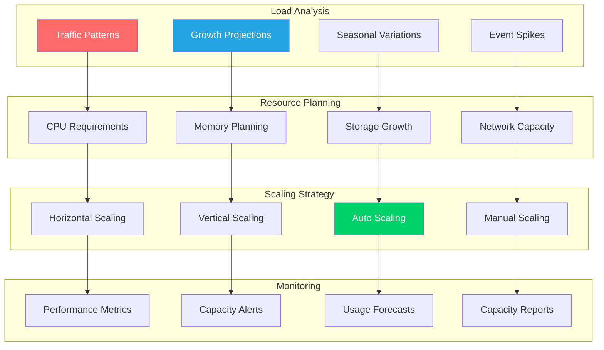

# Capacity Planning

**Comprehensive capacity planning guide for CCTelegram MCP Server scaling and resource optimization**

[](README.md) [](README.md) [](README.md)

---

## 📊 Capacity Planning Overview

### Planning Philosophy

CCTelegram capacity planning follows a data-driven approach with automated scaling capabilities to handle varying loads while maintaining optimal performance and cost efficiency.



---

## 📈 Load Analysis & Forecasting

### Current Usage Baselines

#### **Performance Baselines**
```yaml
Single Instance Baseline (t3.medium):
  CPU Utilization: 25% average, 60% peak
  Memory Usage: 1.2GB average, 2.1GB peak
  Disk I/O: 50MB/s read, 20MB/s write
  Network: 10MB/s inbound, 5MB/s outbound
  
Concurrent Users: 
  Light Load: 100 users (10% CPU, 0.8GB RAM)
  Medium Load: 500 users (40% CPU, 1.5GB RAM)
  Heavy Load: 1000 users (70% CPU, 2.8GB RAM)
  Peak Load: 2000 users (90% CPU, 3.5GB RAM)

Response Times:
  API Calls: 95th percentile <200ms
  Telegram Events: 95th percentile <500ms
  Database Queries: 95th percentile <100ms
  Redis Operations: 95th percentile <10ms
```

#### **Resource Utilization Patterns**
```javascript
// capacity-analyzer.js - Load pattern analysis
const loadPatterns = {
  daily: {
    peak: { hours: [9, 10, 11, 14, 15, 16], multiplier: 1.5 },
    normal: { hours: [8, 12, 13, 17, 18], multiplier: 1.0 },
    low: { hours: [19, 20, 21, 22, 23, 0, 1, 2, 3, 4, 5, 6, 7], multiplier: 0.3 }
  },
  
  weekly: {
    weekdays: { multiplier: 1.0 },
    weekends: { multiplier: 0.4 }
  },
  
  monthly: {
    monthStart: { days: [1, 2, 3], multiplier: 1.3 },
    monthEnd: { days: [28, 29, 30, 31], multiplier: 1.2 },
    normal: { multiplier: 1.0 }
  },
  
  seasonal: {
    q1: { months: [1, 2, 3], multiplier: 0.9 },
    q2: { months: [4, 5, 6], multiplier: 1.1 },
    q3: { months: [7, 8, 9], multiplier: 0.7 },
    q4: { months: [10, 11, 12], multiplier: 1.3 }
  }
};

const calculateExpectedLoad = (baseLoad, timestamp) => {
  const date = new Date(timestamp);
  const hour = date.getHours();
  const day = date.getDay();
  const dayOfMonth = date.getDate();
  const month = date.getMonth() + 1;
  
  let multiplier = 1.0;
  
  // Apply daily pattern
  if (loadPatterns.daily.peak.hours.includes(hour)) {
    multiplier *= loadPatterns.daily.peak.multiplier;
  } else if (loadPatterns.daily.normal.hours.includes(hour)) {
    multiplier *= loadPatterns.daily.normal.multiplier;
  } else {
    multiplier *= loadPatterns.daily.low.multiplier;
  }
  
  // Apply weekly pattern
  if (day === 0 || day === 6) {
    multiplier *= loadPatterns.weekly.weekends.multiplier;
  }
  
  // Apply monthly pattern
  if (loadPatterns.monthly.monthStart.days.includes(dayOfMonth)) {
    multiplier *= loadPatterns.monthly.monthStart.multiplier;
  } else if (loadPatterns.monthly.monthEnd.days.includes(dayOfMonth)) {
    multiplier *= loadPatterns.monthly.monthEnd.multiplier;
  }
  
  // Apply seasonal pattern
  const quarter = Math.ceil(month / 3);
  const seasonalKey = `q${quarter}`;
  if (loadPatterns.seasonal[seasonalKey]) {
    multiplier *= loadPatterns.seasonal[seasonalKey].multiplier;
  }
  
  return Math.round(baseLoad * multiplier);
};

module.exports = { loadPatterns, calculateExpectedLoad };
```

### Growth Projections

#### **User Growth Models**
```yaml
Conservative Growth (15% annually):
  Year 1: 10,000 active users
  Year 2: 11,500 active users  
  Year 3: 13,225 active users
  
Moderate Growth (30% annually):
  Year 1: 10,000 active users
  Year 2: 13,000 active users
  Year 3: 16,900 active users
  
Aggressive Growth (60% annually):
  Year 1: 10,000 active users
  Year 2: 16,000 active users
  Year 3: 25,600 active users
  
Viral Growth (200% first year, 50% thereafter):
  Year 1: 30,000 active users
  Year 2: 45,000 active users
  Year 3: 67,500 active users
```

#### **Infrastructure Scaling Requirements**
```yaml
Conservative Growth Resource Needs:
  Year 1: 2 application servers, 1 database, 1 cache
  Year 2: 3 application servers, 1 database (upgraded), 1 cache
  Year 3: 4 application servers, 1 database (upgraded), 2 cache instances
  
Moderate Growth Resource Needs:
  Year 1: 3 application servers, 1 database, 1 cache
  Year 2: 5 application servers, 2 database (primary + replica), 2 cache instances
  Year 3: 8 application servers, 3 database instances, 3 cache instances
  
Aggressive Growth Resource Needs:
  Year 1: 5 application servers, 2 database instances, 2 cache instances
  Year 2: 12 application servers, 4 database instances, 4 cache instances
  Year 3: 25 application servers, 8 database instances, 6 cache instances
  
Viral Growth Resource Needs:
  Year 1: 15 application servers, 6 database instances, 4 cache instances
  Year 2: 25 application servers, 10 database instances, 6 cache instances
  Year 3: 40 application servers, 15 database instances, 10 cache instances
```

---

## 🔧 Resource Sizing

### CPU Planning

#### **CPU Requirements by Load**
```yaml
MCP Server CPU Usage:
  Base Process: 0.1 CPU cores
  Per 100 Concurrent Users: 0.3 CPU cores
  Per 1000 Events/hour: 0.2 CPU cores
  Peak Buffer: 50% additional capacity
  
Bridge CPU Usage:
  Base Process: 0.05 CPU cores
  Per 100 Concurrent Connections: 0.1 CPU cores
  Per Telegram API Call: 0.001 CPU cores
  Peak Buffer: 30% additional capacity
  
Database CPU Usage:
  Base Process: 0.2 CPU cores
  Per 100 Concurrent Connections: 0.5 CPU cores
  Per 1000 Queries/minute: 0.3 CPU cores
  Peak Buffer: 40% additional capacity
```

#### **CPU Scaling Formula**
```javascript
// cpu-calculator.js
const calculateCPURequirements = (metrics) => {
  const {
    concurrentUsers,
    eventsPerHour,
    queriesPerMinute,
    telegramApiCalls
  } = metrics;
  
  // MCP Server CPU
  const mcpBaseCPU = 0.1;
  const mcpUserCPU = Math.ceil(concurrentUsers / 100) * 0.3;
  const mcpEventCPU = Math.ceil(eventsPerHour / 1000) * 0.2;
  const mcpTotalCPU = (mcpBaseCPU + mcpUserCPU + mcpEventCPU) * 1.5; // 50% buffer
  
  // Bridge CPU
  const bridgeBaseCPU = 0.05;
  const bridgeUserCPU = Math.ceil(concurrentUsers / 100) * 0.1;
  const bridgeApiCPU = telegramApiCalls * 0.001;
  const bridgeTotalCPU = (bridgeBaseCPU + bridgeUserCPU + bridgeApiCPU) * 1.3; // 30% buffer
  
  // Database CPU
  const dbBaseCPU = 0.2;
  const dbConnectionCPU = Math.ceil(concurrentUsers / 100) * 0.5;
  const dbQueryCPU = Math.ceil(queriesPerMinute / 1000) * 0.3;
  const dbTotalCPU = (dbBaseCPU + dbConnectionCPU + dbQueryCPU) * 1.4; // 40% buffer
  
  return {
    mcp: Math.ceil(mcpTotalCPU * 2) / 2, // Round to nearest 0.5 CPU
    bridge: Math.ceil(bridgeTotalCPU * 4) / 4, // Round to nearest 0.25 CPU
    database: Math.ceil(dbTotalCPU * 2) / 2,
    total: Math.ceil((mcpTotalCPU + bridgeTotalCPU + dbTotalCPU) * 2) / 2
  };
};
```

### Memory Planning

#### **Memory Requirements by Component**
```yaml
MCP Server Memory Usage:
  Base Process: 256MB
  Per 100 Concurrent Users: 128MB
  Per 1000 Cached Objects: 64MB
  Node.js Heap: 512MB minimum
  Buffer Pool: 256MB
  Peak Buffer: 40% additional capacity
  
Bridge Memory Usage:
  Base Process: 32MB
  Per 100 Concurrent Connections: 16MB
  Per Active Webhook: 4MB
  Rust Runtime: 64MB
  Peak Buffer: 20% additional capacity
  
Database Memory Usage:
  Base Process: 128MB
  Shared Buffers: 25% of total system memory
  Work Memory: 4MB per connection
  Maintenance Memory: 64MB
  WAL Buffers: 16MB
  Peak Buffer: 30% additional capacity
```

#### **Memory Scaling Calculator**
```javascript
// memory-calculator.js
const calculateMemoryRequirements = (metrics) => {
  const {
    concurrentUsers,
    cachedObjects,
    activeWebhooks,
    dbConnections
  } = metrics;
  
  // MCP Server Memory (in MB)
  const mcpBase = 256;
  const mcpUsers = Math.ceil(concurrentUsers / 100) * 128;
  const mcpCache = Math.ceil(cachedObjects / 1000) * 64;
  const mcpHeap = 512;
  const mcpBuffer = 256;
  const mcpTotal = (mcpBase + mcpUsers + mcpCache + mcpHeap + mcpBuffer) * 1.4;
  
  // Bridge Memory (in MB)
  const bridgeBase = 32;
  const bridgeConnections = Math.ceil(concurrentUsers / 100) * 16;
  const bridgeWebhooks = activeWebhooks * 4;
  const bridgeRuntime = 64;
  const bridgeTotal = (bridgeBase + bridgeConnections + bridgeWebhooks + bridgeRuntime) * 1.2;
  
  // Database Memory (in MB) - assuming 8GB system
  const dbBase = 128;
  const dbSharedBuffers = 2048; // 25% of 8GB
  const dbWorkMemory = dbConnections * 4;
  const dbMaintenance = 64;
  const dbWAL = 16;
  const dbTotal = (dbBase + dbSharedBuffers + dbWorkMemory + dbMaintenance + dbWAL) * 1.3;
  
  return {
    mcp: Math.ceil(mcpTotal / 256) * 256, // Round to nearest 256MB
    bridge: Math.ceil(bridgeTotal / 64) * 64, // Round to nearest 64MB
    database: Math.ceil(dbTotal / 512) * 512, // Round to nearest 512MB
    total: Math.ceil((mcpTotal + bridgeTotal + dbTotal) / 1024) * 1024 // Round to nearest GB
  };
};
```

### Storage Planning

#### **Storage Growth Projections**
```yaml
Data Storage Requirements:
  User Data: 1KB per user (profiles, preferences)
  Event Data: 500 bytes per event (average)
  Message History: 2KB per message
  Log Files: 100MB per day (default logging)
  Metrics Data: 10MB per day (30-day retention)
  Backup Storage: 3x production data size
  
Daily Growth Estimates:
  Light Usage (1000 users): 50MB/day
  Medium Usage (5000 users): 250MB/day
  Heavy Usage (10000 users): 500MB/day
  Enterprise Usage (50000 users): 2.5GB/day
  
Monthly Storage Requirements:
  Light Usage: 1.5GB + growth
  Medium Usage: 7.5GB + growth  
  Heavy Usage: 15GB + growth
  Enterprise Usage: 75GB + growth
```

#### **Storage Allocation Strategy**
```yaml
Production Storage Layout:
  System/OS: 20GB
  Application Code: 5GB
  Application Logs: 50GB (rotating)
  Database Data: 
    Initial: 10GB
    Growth: +20% per month
  Database Logs: 10GB (rotating)
  Cache Data: 5GB (volatile)
  Backups: 3x database size
  Monitoring Data: 20GB (rotating)
  Temporary Files: 10GB
  
Performance Storage Tiers:
  Hot Data (SSD NVMe): Active database, cache, logs
  Warm Data (SSD SATA): Recent backups, archived logs
  Cold Data (HDD): Long-term backups, old logs
  
IOPS Requirements:
  Database: 1000 IOPS minimum, 3000 IOPS preferred
  Logs: 500 IOPS
  Cache: 2000 IOPS
  Backups: 100 IOPS
```

### Network Planning

#### **Bandwidth Requirements**
```yaml
Network Traffic Patterns:
  Inbound Traffic:
    API Requests: 10KB average per request
    Webhook Data: 5KB average per webhook
    File Uploads: 1MB average (occasional)
    Admin Interface: 50KB per page load
    
  Outbound Traffic:
    API Responses: 15KB average per response
    Telegram Messages: 2KB average per message
    File Downloads: 500KB average (occasional)
    Monitoring Data: 1KB per metric point
    
Bandwidth Calculations (per 1000 concurrent users):
  Light Usage: 10Mbps inbound, 15Mbps outbound
  Medium Usage: 25Mbps inbound, 35Mbps outbound
  Heavy Usage: 50Mbps inbound, 70Mbps outbound
  Peak Load: 100Mbps inbound, 150Mbps outbound
```

---

## ⚖️ Scaling Strategies

### Horizontal Scaling

#### **Auto-Scaling Configuration**
```yaml
# Kubernetes HPA Configuration
apiVersion: autoscaling/v2
kind: HorizontalPodAutoscaler
metadata:
  name: cctelegram-mcp-hpa
spec:
  scaleTargetRef:
    apiVersion: apps/v1
    kind: Deployment
    name: cctelegram-mcp
  minReplicas: 3
  maxReplicas: 20
  metrics:
  - type: Resource
    resource:
      name: cpu
      target:
        type: Utilization
        averageUtilization: 70
  - type: Resource
    resource:
      name: memory
      target:
        type: Utilization
        averageUtilization: 80
  - type: Pods
    pods:
      metric:
        name: requests_per_second
      target:
        type: AverageValue
        averageValue: "100"
  behavior:
    scaleUp:
      stabilizationWindowSeconds: 60
      policies:
      - type: Percent
        value: 100
        periodSeconds: 60
    scaleDown:
      stabilizationWindowSeconds: 300
      policies:
      - type: Percent
        value: 50
        periodSeconds: 60
```

#### **Load Balancing Strategy**
```yaml
Application Load Balancing:
  Algorithm: Round-robin with health checks
  Session Affinity: None (stateless design)
  Health Check: /health endpoint every 10s
  Timeout: 30s request timeout
  Retry Logic: 3 retries with exponential backoff
  
Database Load Balancing:
  Read Replicas: 2-5 depending on read load
  Write Load: Single primary with failover
  Connection Pooling: 20 connections per app instance
  Query Routing: Reads to replicas, writes to primary
  
Cache Distribution:
  Consistent Hashing: For Redis cluster
  Replication Factor: 2
  Auto Failover: Enabled
  Client-side Load Balancing: Yes
```

### Vertical Scaling

#### **Instance Sizing Tiers**
```yaml
Micro Tier (Development/Testing):
  CPU: 1 vCPU
  Memory: 2GB
  Storage: 20GB SSD
  Network: 1Gbps
  Concurrent Users: ~200
  
Small Tier (Light Production):
  CPU: 2 vCPUs
  Memory: 4GB
  Storage: 50GB SSD
  Network: 2Gbps
  Concurrent Users: ~500
  
Medium Tier (Standard Production):
  CPU: 4 vCPUs
  Memory: 8GB
  Storage: 100GB SSD
  Network: 5Gbps
  Concurrent Users: ~1500
  
Large Tier (High Volume):
  CPU: 8 vCPUs
  Memory: 16GB
  Storage: 200GB NVMe SSD
  Network: 10Gbps
  Concurrent Users: ~3000
  
XLarge Tier (Enterprise):
  CPU: 16 vCPUs
  Memory: 32GB
  Storage: 500GB NVMe SSD
  Network: 25Gbps
  Concurrent Users: ~6000
```

#### **Automated Vertical Scaling**
```yaml
# Kubernetes VPA Configuration
apiVersion: autoscaling.k8s.io/v1
kind: VerticalPodAutoscaler
metadata:
  name: cctelegram-mcp-vpa
spec:
  targetRef:
    apiVersion: apps/v1
    kind: Deployment
    name: cctelegram-mcp
  updatePolicy:
    updateMode: "Auto"
  resourcePolicy:
    containerPolicies:
    - containerName: mcp-server
      minAllowed:
        cpu: 500m
        memory: 512Mi
      maxAllowed:
        cpu: 4000m
        memory: 8Gi
      controlledResources: ["cpu", "memory"]
```

---

## 📊 Performance Monitoring

### Capacity Metrics

#### **Key Performance Indicators**
```javascript
// capacity-metrics.js
const capacityMetrics = {
  // Resource Utilization
  cpu: {
    target: 70, // Target 70% utilization
    warning: 80, // Warning at 80%
    critical: 90 // Critical at 90%
  },
  
  memory: {
    target: 75, // Target 75% utilization
    warning: 85, // Warning at 85%
    critical: 95 // Critical at 95%
  },
  
  disk: {
    target: 70, // Target 70% utilization
    warning: 80, // Warning at 80%
    critical: 90 // Critical at 90%
  },
  
  // Application Metrics
  responseTime: {
    target: 200, // Target 200ms 95th percentile
    warning: 500, // Warning at 500ms
    critical: 1000 // Critical at 1000ms
  },
  
  throughput: {
    minimum: 100, // Minimum 100 requests/second
    target: 500, // Target 500 requests/second
    maximum: 2000 // Maximum capacity
  },
  
  errorRate: {
    target: 0.1, // Target 0.1% error rate
    warning: 1.0, // Warning at 1%
    critical: 5.0 // Critical at 5%
  },
  
  // Scaling Triggers
  scaleUp: {
    cpu: 75, // Scale up at 75% CPU for 5 minutes
    memory: 80, // Scale up at 80% memory for 3 minutes
    responseTime: 300, // Scale up if response time > 300ms
    queueDepth: 50 // Scale up if queue depth > 50
  },
  
  scaleDown: {
    cpu: 40, // Scale down at 40% CPU for 15 minutes
    memory: 50, // Scale down at 50% memory for 10 minutes
    responseTime: 100, // Scale down if response time < 100ms
    idleTime: 300 // Scale down after 5 minutes of low usage
  }
};

module.exports = capacityMetrics;
```

#### **Monitoring Dashboard**
```yaml
Grafana Dashboard Panels:
  Resource Utilization:
    - CPU usage by instance
    - Memory usage by instance
    - Disk I/O by instance
    - Network I/O by instance
    
  Application Performance:
    - Response time percentiles
    - Request rate and throughput
    - Error rate by endpoint
    - Queue depth and processing time
    
  Scaling Indicators:
    - Current vs target capacity
    - Scaling events timeline
    - Capacity headroom remaining
    - Predicted time to capacity limit
    
  Cost Analysis:
    - Resource costs by component
    - Cost per user/request
    - Optimization opportunities
    - Budget vs actual spending
```

### Capacity Alerting

#### **Alert Rules**
```yaml
# Prometheus Alert Rules
groups:
- name: capacity.rules
  rules:
  
  # CPU Capacity Alerts
  - alert: HighCPUUtilization
    expr: avg(rate(node_cpu_seconds_total{mode!="idle"}[5m])) * 100 > 80
    for: 5m
    labels:
      severity: warning
      category: capacity
    annotations:
      summary: "High CPU utilization detected"
      description: "CPU utilization is {{ $value }}% for 5 minutes"
      runbook_url: "https://docs.cctelegram.dev/runbooks/high-cpu"
  
  - alert: CriticalCPUUtilization
    expr: avg(rate(node_cpu_seconds_total{mode!="idle"}[5m])) * 100 > 90
    for: 2m
    labels:
      severity: critical
      category: capacity
    annotations:
      summary: "Critical CPU utilization detected"
      description: "CPU utilization is {{ $value }}% - immediate scaling required"
  
  # Memory Capacity Alerts
  - alert: HighMemoryUsage
    expr: (node_memory_MemTotal_bytes - node_memory_MemAvailable_bytes) / node_memory_MemTotal_bytes * 100 > 85
    for: 3m
    labels:
      severity: warning
      category: capacity
    annotations:
      summary: "High memory usage detected"
      description: "Memory usage is {{ $value }}% for 3 minutes"
  
  # Application Performance Alerts
  - alert: SlowResponseTime
    expr: histogram_quantile(0.95, rate(http_request_duration_seconds_bucket[5m])) > 0.5
    for: 3m
    labels:
      severity: warning
      category: performance
    annotations:
      summary: "Slow response times detected"
      description: "95th percentile response time is {{ $value }}s"
  
  # Capacity Projection Alerts
  - alert: CapacityProjectionWarning
    expr: predict_linear(node_filesystem_free_bytes[1h], 24*3600) < 1e9
    for: 5m
    labels:
      severity: warning
      category: capacity
    annotations:
      summary: "Disk space will be exhausted in 24 hours"
      description: "Based on current usage trends"
```

---

## 💰 Cost Optimization

### Cost Analysis Framework

#### **Cost Breakdown by Component**
```yaml
Monthly Cost Structure (Medium Tier):
  Compute Resources:
    Application Servers (3x t3.large): $150
    Database Server (1x db.r5.xlarge): $200
    Cache Server (1x cache.r5.large): $100
    Load Balancer: $25
    Total Compute: $475
    
  Storage Costs:
    Database Storage (100GB): $12
    Log Storage (200GB): $20
    Backup Storage (300GB): $15
    Total Storage: $47
    
  Network Costs:
    Data Transfer: $50
    NAT Gateway: $45
    CloudFront CDN: $20
    Total Network: $115
    
  Monitoring & Logging:
    CloudWatch: $30
    Third-party APM: $50
    Total Monitoring: $80
    
  Total Monthly Cost: $717
  Cost per 1000 Users: $71.70
  Cost per 1M API Calls: $23.90
```

#### **Cost Optimization Strategies**
```yaml
Immediate Optimizations (0-30 days):
  - Right-size instances based on utilization
  - Use spot instances for development
  - Optimize storage classes (hot/warm/cold)
  - Enable auto-scaling to reduce idle capacity
  - Potential Savings: 15-25%
  
Short-term Optimizations (1-6 months):
  - Implement reserved instance pricing
  - Optimize database queries to reduce compute
  - Implement caching to reduce database load
  - Use CDN for static content delivery
  - Potential Savings: 25-40%
  
Long-term Optimizations (6+ months):
  - Multi-region deployment for cost arbitrage
  - Custom AMIs to reduce startup time
  - Microservices architecture for granular scaling
  - Automated cost optimization pipeline
  - Potential Savings: 40-60%
```

### Budget Planning

#### **Budget Allocation Model**
```yaml
Annual Budget Planning:
  Development Environment: 15%
    - Feature development instances
    - Testing infrastructure
    - CI/CD pipeline resources
    
  Staging Environment: 10%
    - Pre-production testing
    - Load testing infrastructure
    - Security testing environment
    
  Production Environment: 60%
    - Core application infrastructure
    - High availability setup
    - Production databases and cache
    
  Monitoring & Logging: 5%
    - APM and monitoring tools
    - Log aggregation and analysis
    - Security monitoring
    
  Backup & Disaster Recovery: 5%
    - Backup storage and retention
    - Disaster recovery infrastructure
    - Business continuity resources
    
  Buffer/Scaling Reserve: 5%
    - Unexpected load spikes
    - Emergency scaling resources
    - New feature infrastructure
```

---

## 🔧 Capacity Planning Tools

### Automated Capacity Planning

#### **Capacity Planning Script**
```bash
#!/bin/bash
# capacity-planner.sh - Automated capacity analysis and planning

set -euo pipefail

echo "🔍 CCTelegram Capacity Planning Analysis"
echo "======================================"

# Get current resource utilization
echo "📊 Current Resource Utilization:"
CPU_USAGE=$(top -bn1 | grep "Cpu(s)" | awk '{print $2}' | sed 's/%us,//')
MEMORY_USAGE=$(free | grep Mem | awk '{printf "%.1f", ($3/$2) * 100.0}')
DISK_USAGE=$(df -h / | awk 'NR==2{printf "%s", $5}')

echo "  CPU Usage: ${CPU_USAGE}%"
echo "  Memory Usage: ${MEMORY_USAGE}%"
echo "  Disk Usage: ${DISK_USAGE}"

# Get current load metrics
echo ""
echo "📈 Current Load Metrics:"
LOAD_AVG=$(uptime | awk -F'load average:' '{ print $2 }' | cut -d, -f1 | xargs)
CONNECTIONS=$(ss -tun | grep ESTAB | wc -l)
PROCESSES=$(ps aux | wc -l)

echo "  Load Average: ${LOAD_AVG}"
echo "  Active Connections: ${CONNECTIONS}"
echo "  Running Processes: ${PROCESSES}"

# Calculate capacity recommendations
echo ""
echo "🎯 Capacity Recommendations:"

# CPU recommendation
if (( $(echo "$CPU_USAGE > 80" | bc -l) )); then
    echo "  ⚠️  CPU: Scale up recommended (current: ${CPU_USAGE}%)"
elif (( $(echo "$CPU_USAGE < 30" | bc -l) )); then
    echo "  ⬇️  CPU: Scale down possible (current: ${CPU_USAGE}%)"
else
    echo "  ✅ CPU: Optimal range (current: ${CPU_USAGE}%)"
fi

# Memory recommendation
if (( $(echo "$MEMORY_USAGE > 85" | bc -l) )); then
    echo "  ⚠️  Memory: Scale up recommended (current: ${MEMORY_USAGE}%)"
elif (( $(echo "$MEMORY_USAGE < 40" | bc -l) )); then
    echo "  ⬇️  Memory: Scale down possible (current: ${MEMORY_USAGE}%)"
else
    echo "  ✅ Memory: Optimal range (current: ${MEMORY_USAGE}%)"
fi

# Disk recommendation
DISK_PERCENT=$(echo "$DISK_USAGE" | sed 's/%//')
if (( DISK_PERCENT > 80 )); then
    echo "  ⚠️  Disk: Expansion recommended (current: ${DISK_USAGE})"
else
    echo "  ✅ Disk: Sufficient space (current: ${DISK_USAGE})"
fi

# Growth projection
echo ""
echo "📊 Growth Projections (next 6 months):"

# Current user estimate (placeholder - replace with actual metrics)
CURRENT_USERS=1000
GROWTH_RATE=0.30  # 30% every 6 months

PROJECTED_USERS=$(echo "$CURRENT_USERS * (1 + $GROWTH_RATE)" | bc -l | cut -d. -f1)
RESOURCE_MULTIPLIER=$(echo "scale=2; $PROJECTED_USERS / $CURRENT_USERS" | bc -l)

echo "  Current Users: ${CURRENT_USERS}"
echo "  Projected Users: ${PROJECTED_USERS}"
echo "  Resource Multiplier: ${RESOURCE_MULTIPLIER}x"

# Resource projections
PROJECTED_CPU=$(echo "scale=1; $CPU_USAGE * $RESOURCE_MULTIPLIER" | bc -l)
PROJECTED_MEMORY=$(echo "scale=1; $MEMORY_USAGE * $RESOURCE_MULTIPLIER" | bc -l)

echo "  Projected CPU Usage: ${PROJECTED_CPU}%"
echo "  Projected Memory Usage: ${PROJECTED_MEMORY}%"

# Scaling recommendations
echo ""
echo "🚀 Scaling Recommendations:"

if (( $(echo "$PROJECTED_CPU > 70" | bc -l) )); then
    echo "  📈 Plan CPU scaling within 3 months"
fi

if (( $(echo "$PROJECTED_MEMORY > 80" | bc -l) )); then
    echo "  📈 Plan memory scaling within 3 months"
fi

if (( $(echo "$PROJECTED_USERS > 2000" | bc -l) )); then
    echo "  🌐 Consider horizontal scaling architecture"
fi

echo ""
echo "✅ Capacity planning analysis complete"
echo "📋 Save this report and review monthly"
```

---

## 🔗 Related Documentation

### Capacity Resources
- **[Performance Tuning](performance-tuning.md)** - Performance optimization strategies
- **[Infrastructure Requirements](../deployment/infrastructure.md)** - Infrastructure planning and setup
- **[Monitoring Setup](../deployment/monitoring-setup.md)** - Monitoring and alerting configuration

### Operations Resources
- **[Operations Center](../operations/README.md)** - Operations and maintenance procedures
- **[Troubleshooting Guide](../operations/troubleshooting.md)** - Performance troubleshooting
- **[Health Checks](../operations/runbooks/health-checks.md)** - System health monitoring

---

*Capacity Planning Guide - Version 1.8.5*  
*Last updated: August 2025 | Next review: November 2025*

## See Also

- **[System Architecture](../architecture/system-overview.md)** - Understanding system scalability
- **[Deployment Overview](../deployment/README.md)** - Deployment scaling strategies
- **[Security Performance](../security/security-procedures.md#performance-considerations)** - Security impact on performance