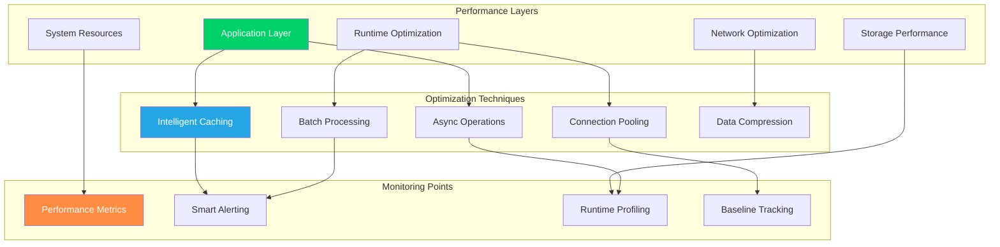

# Performance Tuning Guide

**Comprehensive performance optimization guide for CCTelegram MCP Server**

[](../README.md) [](../operations/monitoring.md) [](README.md)

---

## ⚡ Performance Overview

### Performance Targets & SLAs

CCTelegram MCP Server is optimized for high-performance event processing with the following targets:

| Metric | Target | Critical Threshold | Monitoring |
|--------|--------|-------------------|------------|
| **Event Processing Latency** | <100ms | >500ms | Real-time |
| **Telegram API Response** | <200ms | >1000ms | Continuous |
| **Memory Usage** | <512MB | >1GB | Every 5min |
| **CPU Usage** | <20% avg | >80% sustained | Every 1min |
| **Event Throughput** | >1000/min | <100/min | Real-time |
| **Bridge Restart Time** | <5s | >30s | On-demand |

### Performance Architecture



---

## 🚀 Application Layer Optimization

### Node.js Runtime Optimization

#### **Memory Management Configuration**
```bash
#!/bin/bash
# optimize-nodejs-runtime.sh - Node.js performance optimization

# Memory optimization
export NODE_OPTIONS="--max-old-space-size=2048 --max-semi-space-size=128"

# Garbage collection optimization
export NODE_OPTIONS="$NODE_OPTIONS --expose-gc --optimize-for-size"

# Event loop optimization
export UV_THREADPOOL_SIZE=16

# V8 optimization flags
export NODE_OPTIONS="$NODE_OPTIONS --turbo-fast-api-calls --turbo-optimize-apply"

# Enable performance profiling in development
if [ "$NODE_ENV" = "development" ]; then
    export NODE_OPTIONS="$NODE_OPTIONS --prof --prof-process"
fi

echo "Node.js runtime optimized with:"
echo "- Memory: 2GB max heap, 128MB semi-space"
echo "- GC: Exposed and size-optimized"  
echo "- Thread pool: 16 threads"
echo "- V8: Turbo optimizations enabled"
```

#### **Application-Level Caching**
```typescript
// cache-manager.ts - Intelligent caching system
import NodeCache from 'node-cache';
import { performance } from 'perf_hooks';

class PerformanceOptimizedCache {
    private cache: NodeCache;
    private stats: Map<string, CacheStats>;
    
    constructor() {
        this.cache = new NodeCache({
            stdTTL: 300,           // 5 minute default TTL
            checkperiod: 60,       // Check for expired keys every minute
            useClones: false,      // Don't clone objects (performance optimization)
            maxKeys: 10000        // Limit cache size
        });
        
        this.stats = new Map();
        this.setupCacheMonitoring();
    }
    
    async get<T>(key: string): Promise<T | undefined> {
        const start = performance.now();
        const value = this.cache.get<T>(key);
        const duration = performance.now() - start;
        
        this.updateStats(key, 'get', duration, value !== undefined);
        
        return value;
    }
    
    async set<T>(key: string, value: T, ttl?: number): Promise<boolean> {
        const start = performance.now();
        const result = this.cache.set(key, value, ttl);
        const duration = performance.now() - start;
        
        this.updateStats(key, 'set', duration, result);
        
        return result;
    }
    
    // Multi-get optimization for batch operations
    async mget<T>(keys: string[]): Promise<{ [key: string]: T }> {
        const start = performance.now();
        const result = this.cache.mget<T>(keys);
        const duration = performance.now() - start;
        
        // Update stats for batch operation
        this.updateStats('__batch_get__', 'get', duration, true, keys.length);
        
        return result;
    }
    
    // Multi-set optimization for batch operations
    async mset<T>(keyValuePairs: Array<{key: string, val: T, ttl?: number}>): Promise<boolean> {
        const start = performance.now();
        const result = this.cache.mset(keyValuePairs);
        const duration = performance.now() - start;
        
        this.updateStats('__batch_set__', 'set', duration, result, keyValuePairs.length);
        
        return result;
    }
    
    private updateStats(key: string, operation: string, duration: number, success: boolean, count = 1) {
        const statsKey = `${key}_${operation}`;
        const currentStats = this.stats.get(statsKey) || {
            hits: 0,
            misses: 0,
            totalTime: 0,
            avgTime: 0,
            count: 0
        };
        
        currentStats.count += count;
        currentStats.totalTime += duration;
        currentStats.avgTime = currentStats.totalTime / currentStats.count;
        
        if (success) {
            currentStats.hits += count;
        } else {
            currentStats.misses += count;
        }
        
        this.stats.set(statsKey, currentStats);
    }
    
    getPerformanceStats(): CachePerformanceReport {
        const cacheStats = this.cache.getStats();
        
        return {
            keys: cacheStats.keys,
            hits: cacheStats.hits,
            misses: cacheStats.misses,
            hitRate: cacheStats.hits / (cacheStats.hits + cacheStats.misses),
            averageResponseTime: Array.from(this.stats.values())
                .reduce((sum, stat) => sum + stat.avgTime, 0) / this.stats.size,
            detailedStats: Object.fromEntries(this.stats)
        };
    }
}

interface CacheStats {
    hits: number;
    misses: number;
    totalTime: number;
    avgTime: number;
    count: number;
}

interface CachePerformanceReport {
    keys: number;
    hits: number;
    misses: number;
    hitRate: number;
    averageResponseTime: number;
    detailedStats: { [key: string]: CacheStats };
}
```

### Event Processing Optimization

#### **Batched Event Processing**
```typescript
// batch-event-processor.ts - High-performance event processing
class BatchEventProcessor {
    private batchQueue: EventBatch[] = [];
    private processingTimer: NodeJS.Timeout | null = null;
    private readonly batchSize: number = 50;
    private readonly batchTimeout: number = 1000; // 1 second
    
    constructor() {
        this.startBatchProcessor();
        this.setupPerformanceMonitoring();
    }
    
    async processEvent(event: TelegramEvent): Promise<void> {
        // Add to current batch
        const currentBatch = this.getCurrentOrCreateBatch();
        currentBatch.events.push(event);
        
        // Process if batch is full
        if (currentBatch.events.length >= this.batchSize) {
            await this.processBatch(currentBatch);
            this.removeProcessedBatch(currentBatch);
        }
    }
    
    private async processBatch(batch: EventBatch): Promise<void> {
        const start = performance.now();
        
        try {
            // Group events by type for optimal processing
            const groupedEvents = this.groupEventsByType(batch.events);
            
            // Process each group in parallel
            const processingPromises = Object.entries(groupedEvents).map(
                ([eventType, events]) => this.processEventGroup(eventType, events)
            );
            
            await Promise.all(processingPromises);
            
            const duration = performance.now() - start;
            this.recordBatchPerformance(batch, duration, true);
            
        } catch (error) {
            const duration = performance.now() - start;
            this.recordBatchPerformance(batch, duration, false);
            throw error;
        }
    }
    
    private async processEventGroup(eventType: string, events: TelegramEvent[]): Promise<void> {
        switch (eventType) {
            case 'task_completion':
                return this.processTaskCompletionBatch(events);
            case 'build_completed':
                return this.processBuildCompletionBatch(events);
            case 'error_occurred':
                return this.processErrorBatch(events);
            default:
                return this.processGenericEventBatch(events);
        }
    }
    
    private async processTaskCompletionBatch(events: TelegramEvent[]): Promise<void> {
        // Optimized batch processing for task completion events
        const telegramMessages = events.map(event => ({
            chat_id: process.env.TELEGRAM_CHAT_ID,
            text: this.formatTaskCompletionMessage(event),
            parse_mode: 'Markdown'
        }));
        
        // Send all messages in parallel with rate limiting
        const rateLimiter = new RateLimiter(20); // 20 messages per second max
        
        const sendPromises = telegramMessages.map(message => 
            rateLimiter.schedule(() => this.sendTelegramMessage(message))
        );
        
        await Promise.all(sendPromises);
    }
    
    private groupEventsByType(events: TelegramEvent[]): { [type: string]: TelegramEvent[] } {
        return events.reduce((groups, event) => {
            const type = event.type || 'generic';
            if (!groups[type]) {
                groups[type] = [];
            }
            groups[type].push(event);
            return groups;
        }, {} as { [type: string]: TelegramEvent[] });
    }
}

class RateLimiter {
    private queue: Array<() => Promise<any>> = [];
    private running = 0;
    private maxConcurrent: number;
    
    constructor(maxPerSecond: number) {
        this.maxConcurrent = maxPerSecond;
        setInterval(() => this.processQueue(), 1000 / maxPerSecond);
    }
    
    async schedule<T>(task: () => Promise<T>): Promise<T> {
        return new Promise((resolve, reject) => {
            this.queue.push(async () => {
                try {
                    const result = await task();
                    resolve(result);
                } catch (error) {
                    reject(error);
                }
            });
        });
    }
    
    private async processQueue(): Promise<void> {
        if (this.running >= this.maxConcurrent || this.queue.length === 0) {
            return;
        }
        
        const task = this.queue.shift();
        if (task) {
            this.running++;
            try {
                await task();
            } finally {
                this.running--;
            }
        }
    }
}
```

---

## 🔧 System Resource Optimization

### Memory Optimization

#### **Memory Usage Profiling and Optimization**
```bash
#!/bin/bash
# memory-optimization.sh - System memory optimization

optimize_system_memory() {
    echo "🧠 Optimizing system memory configuration..."
    
    # Increase system limits for Node.js applications
    echo "# CCTelegram Memory Optimization" | sudo tee -a /etc/security/limits.conf
    echo "$USER soft memlock unlimited" | sudo tee -a /etc/security/limits.conf
    echo "$USER hard memlock unlimited" | sudo tee -a /etc/security/limits.conf
    echo "$USER soft nofile 65536" | sudo tee -a /etc/security/limits.conf
    echo "$USER hard nofile 65536" | sudo tee -a /etc/security/limits.conf
    
    # Configure swappiness for better performance
    echo "vm.swappiness=10" | sudo tee -a /etc/sysctl.conf
    echo "vm.dirty_ratio=15" | sudo tee -a /etc/sysctl.conf
    echo "vm.dirty_background_ratio=5" | sudo tee -a /etc/sysctl.conf
    
    # Apply immediately
    sudo sysctl -p
    
    echo "✅ System memory optimization completed"
}

monitor_memory_usage() {
    echo "📊 Memory Usage Monitoring Setup..."
    
    # Create memory monitoring script
    cat > /tmp/memory-monitor.sh << 'EOF'
#!/bin/bash
# memory-monitor.sh - Continuous memory monitoring

while true; do
    TIMESTAMP=$(date '+%Y-%m-%d %H:%M:%S')
    
    # System memory
    MEM_TOTAL=$(free -m | awk '/^Mem:/ {print $2}')
    MEM_USED=$(free -m | awk '/^Mem:/ {print $3}')
    MEM_PERCENT=$(( MEM_USED * 100 / MEM_TOTAL ))
    
    # Process-specific memory
    NODE_PID=$(pgrep -f "node.*cctelegram")
    if [ -n "$NODE_PID" ]; then
        NODE_MEM=$(ps -p $NODE_PID -o rss --no-headers | awk '{print $1/1024}')
        NODE_PERCENT=$(echo "$NODE_MEM $MEM_TOTAL" | awk '{printf "%.1f", $1/$2*100}')
    else
        NODE_MEM=0
        NODE_PERCENT=0
    fi
    
    # Log to file
    echo "$TIMESTAMP,system,$MEM_TOTAL,$MEM_USED,$MEM_PERCENT" >> /var/log/cctelegram/memory-usage.log
    echo "$TIMESTAMP,node,$NODE_MEM,$NODE_PERCENT" >> /var/log/cctelegram/memory-usage.log
    
    # Alert if memory usage is high
    if [ $MEM_PERCENT -gt 85 ]; then
        echo "$TIMESTAMP: HIGH MEMORY USAGE: ${MEM_PERCENT}%" >> /var/log/cctelegram/memory-alerts.log
        
        # Trigger garbage collection if possible
        if [ -n "$NODE_PID" ]; then
            kill -USR1 $NODE_PID 2>/dev/null
        fi
    fi
    
    sleep 30
done
EOF
    
    chmod +x /tmp/memory-monitor.sh
    echo "✅ Memory monitoring script created"
}

# Execute optimization
optimize_system_memory
monitor_memory_usage
```

### CPU Optimization

#### **CPU Performance Tuning**
```typescript
// cpu-optimization.ts - CPU performance optimization
import { Worker, isMainThread, parentPort } from 'worker_threads';
import { cpus } from 'os';

class CPUOptimizedProcessor {
    private workerPool: Worker[] = [];
    private taskQueue: ProcessingTask[] = [];
    private readonly maxWorkers: number;
    
    constructor() {
        // Use 75% of available CPU cores
        this.maxWorkers = Math.max(1, Math.floor(cpus().length * 0.75));
        this.initializeWorkerPool();
    }
    
    private initializeWorkerPool(): void {
        for (let i = 0; i < this.maxWorkers; i++) {
            const worker = new Worker(__filename, {
                workerData: { isWorker: true }
            });
            
            worker.on('message', (result) => {
                this.handleWorkerMessage(worker, result);
            });
            
            worker.on('error', (error) => {
                console.error(`Worker ${i} error:`, error);
                this.replaceWorker(worker);
            });
            
            this.workerPool.push(worker);
        }
        
        console.log(`✅ CPU optimization: ${this.maxWorkers} worker threads initialized`);
    }
    
    async processCPUIntensiveTask(task: ProcessingTask): Promise<any> {
        return new Promise((resolve, reject) => {
            const availableWorker = this.getAvailableWorker();
            
            if (availableWorker) {
                availableWorker.postMessage({
                    type: 'process',
                    task: task,
                    resolve: resolve,
                    reject: reject
                });
            } else {
                // Queue task if no workers available
                this.taskQueue.push({
                    ...task,
                    resolve,
                    reject
                });
            }
        });
    }
    
    private getAvailableWorker(): Worker | null {
        // Simple round-robin worker selection
        // In production, implement more sophisticated load balancing
        return this.workerPool.find(worker => !worker['busy']) || null;
    }
}

// Worker thread code
if (!isMainThread) {
    parentPort?.on('message', async (message) => {
        if (message.type === 'process') {
            try {
                const result = await processTaskInWorker(message.task);
                parentPort?.postMessage({
                    type: 'result',
                    success: true,
                    data: result
                });
            } catch (error) {
                parentPort?.postMessage({
                    type: 'result',
                    success: false,
                    error: error.message
                });
            }
        }
    });
}

async function processTaskInWorker(task: ProcessingTask): Promise<any> {
    // CPU-intensive processing logic here
    switch (task.type) {
        case 'event_analysis':
            return await analyzeEventPatterns(task.data);
        case 'message_formatting':
            return await formatComplexMessage(task.data);
        case 'data_compression':
            return await compressEventData(task.data);
        default:
            throw new Error(`Unknown task type: ${task.type}`);
    }
}

interface ProcessingTask {
    type: string;
    data: any;
    resolve?: (value: any) => void;
    reject?: (error: any) => void;
}
```

---

## 🌐 Network Optimization

### Connection Pooling and Keep-Alive

#### **HTTP Connection Optimization**
```typescript
// network-optimization.ts - Network performance optimization
import https from 'https';
import http from 'http';

class OptimizedHttpClient {
    private httpsAgent: https.Agent;
    private httpAgent: http.Agent;
    private connectionStats: ConnectionStats;
    
    constructor() {
        this.httpsAgent = new https.Agent({
            keepAlive: true,
            keepAliveMsecs: 30000,
            maxSockets: 50,
            maxFreeSockets: 10,
            timeout: 60000,
            scheduling: 'fifo'
        });
        
        this.httpAgent = new http.Agent({
            keepAlive: true,
            keepAliveMsecs: 30000,
            maxSockets: 50,
            maxFreeSockets: 10,
            timeout: 60000,
            scheduling: 'fifo'
        });
        
        this.connectionStats = {
            totalRequests: 0,
            successfulRequests: 0,
            failedRequests: 0,
            averageResponseTime: 0,
            connectionReused: 0
        };
        
        this.setupConnectionMonitoring();
    }
    
    async makeTelegramRequest(url: string, options: any): Promise<any> {
        const start = performance.now();
        
        const requestOptions = {
            ...options,
            agent: url.startsWith('https') ? this.httpsAgent : this.httpAgent,
            headers: {
                'Connection': 'keep-alive',
                'Keep-Alive': 'timeout=30, max=1000',
                ...options.headers
            }
        };
        
        try {
            const response = await this.executeRequest(url, requestOptions);
            const duration = performance.now() - start;
            
            this.updateStats(true, duration);
            
            return response;
        } catch (error) {
            const duration = performance.now() - start;
            this.updateStats(false, duration);
            throw error;
        }
    }
    
    private setupConnectionMonitoring(): void {
        // Monitor connection pool health
        setInterval(() => {
            const httpsStats = {
                createConnection: this.httpsAgent.createConnection,
                getCurrentTime: () => Date.now(),
                sockets: Object.keys(this.httpsAgent.sockets).length,
                freeSockets: Object.keys(this.httpsAgent.freeSockets).length,
                requests: Object.keys(this.httpsAgent.requests).length
            };
            
            console.log('Connection Pool Stats:', {
                https: httpsStats,
                performance: this.connectionStats
            });
            
            // Auto-adjust pool size based on usage
            this.optimizePoolSize();
            
        }, 60000); // Every minute
    }
    
    private optimizePoolSize(): void {
        const { totalRequests, successfulRequests } = this.connectionStats;
        const successRate = totalRequests > 0 ? successfulRequests / totalRequests : 1;
        
        // Increase pool size if success rate is high and we're hitting limits
        if (successRate > 0.95 && this.isPoolSaturated()) {
            this.httpsAgent.maxSockets = Math.min(this.httpsAgent.maxSockets + 5, 100);
            console.log(`📈 Increased connection pool size to ${this.httpsAgent.maxSockets}`);
        }
        
        // Decrease pool size if success rate is low
        if (successRate < 0.80) {
            this.httpsAgent.maxSockets = Math.max(this.httpsAgent.maxSockets - 5, 10);
            console.log(`📉 Decreased connection pool size to ${this.httpsAgent.maxSockets}`);
        }
    }
    
    private isPoolSaturated(): boolean {
        const activeConnections = Object.keys(this.httpsAgent.sockets).length;
        const maxConnections = this.httpsAgent.maxSockets;
        
        return activeConnections / maxConnections > 0.8;
    }
}
```

### Request Compression and Caching

#### **Data Compression Optimization**
```typescript
// compression-optimization.ts - Data compression and caching
import zlib from 'zlib';
import crypto from 'crypto';

class CompressionOptimizer {
    private compressionCache: Map<string, CompressedData> = new Map();
    private readonly maxCacheSize = 1000;
    
    async compressRequest(data: any): Promise<Buffer> {
        const jsonString = JSON.stringify(data);
        const hash = this.generateHash(jsonString);
        
        // Check cache first
        const cached = this.compressionCache.get(hash);
        if (cached) {
            return cached.compressed;
        }
        
        // Compress data
        const compressed = await this.compressData(jsonString);
        
        // Cache result
        this.cacheCompressedData(hash, {
            original: jsonString,
            compressed,
            timestamp: Date.now(),
            compressionRatio: compressed.length / Buffer.byteLength(jsonString)
        });
        
        return compressed;
    }
    
    private async compressData(data: string): Promise<Buffer> {
        return new Promise((resolve, reject) => {
            zlib.gzip(data, {
                level: zlib.constants.Z_BEST_COMPRESSION,
                windowBits: 15,
                memLevel: 8
            }, (error, result) => {
                if (error) {
                    reject(error);
                } else {
                    resolve(result);
                }
            });
        });
    }
    
    private generateHash(data: string): string {
        return crypto.createHash('sha256').update(data).digest('hex');
    }
    
    private cacheCompressedData(hash: string, data: CompressedData): void {
        // Remove oldest entries if cache is full
        if (this.compressionCache.size >= this.maxCacheSize) {
            const oldestKey = this.compressionCache.keys().next().value;
            this.compressionCache.delete(oldestKey);
        }
        
        this.compressionCache.set(hash, data);
    }
    
    getCompressionStats(): CompressionStats {
        const entries = Array.from(this.compressionCache.values());
        
        if (entries.length === 0) {
            return {
                cacheSize: 0,
                averageCompressionRatio: 0,
                totalSavings: 0
            };
        }
        
        const totalRatio = entries.reduce((sum, entry) => sum + entry.compressionRatio, 0);
        const averageRatio = totalRatio / entries.length;
        
        const originalSize = entries.reduce((sum, entry) => sum + Buffer.byteLength(entry.original), 0);
        const compressedSize = entries.reduce((sum, entry) => sum + entry.compressed.length, 0);
        
        return {
            cacheSize: this.compressionCache.size,
            averageCompressionRatio: averageRatio,
            totalSavings: originalSize - compressedSize
        };
    }
}

interface CompressedData {
    original: string;
    compressed: Buffer;
    timestamp: number;
    compressionRatio: number;
}

interface CompressionStats {
    cacheSize: number;
    averageCompressionRatio: number;
    totalSavings: number;
}
```

---

## 📊 Performance Monitoring & Profiling

### Real-Time Performance Metrics

#### **Performance Metrics Collection**
```typescript
// performance-metrics.ts - Comprehensive performance monitoring
import { EventEmitter } from 'events';
import { performance, PerformanceObserver } from 'perf_hooks';

class PerformanceMonitor extends EventEmitter {
    private metrics: PerformanceMetrics;
    private observer: PerformanceObserver;
    
    constructor() {
        super();
        
        this.metrics = {
            eventProcessing: new MetricCollector('event_processing'),
            telegramApi: new MetricCollector('telegram_api'),
            memoryUsage: new MetricCollector('memory_usage'),
            cpuUsage: new MetricCollector('cpu_usage'),
            networkLatency: new MetricCollector('network_latency')
        };
        
        this.setupPerformanceObserver();
        this.startMetricsCollection();
    }
    
    private setupPerformanceObserver(): void {
        this.observer = new PerformanceObserver((list) => {
            const entries = list.getEntries();
            
            entries.forEach((entry) => {
                switch (entry.entryType) {
                    case 'measure':
                        this.recordMeasurement(entry.name, entry.duration);
                        break;
                    case 'navigation':
                        this.recordNavigation(entry);
                        break;
                    default:
                        // Handle other entry types
                        break;
                }
            });
        });
        
        this.observer.observe({ 
            entryTypes: ['measure', 'navigation', 'resource', 'paint'] 
        });
    }
    
    recordEventProcessingTime(eventType: string, duration: number): void {
        this.metrics.eventProcessing.record(duration);
        
        // Mark for performance timeline
        performance.mark(`event_${eventType}_end`);
        performance.measure(`process_${eventType}`, `event_${eventType}_start`, `event_${eventType}_end`);
        
        // Emit performance event
        this.emit('performance', {
            type: 'event_processing',
            eventType,
            duration,
            timestamp: Date.now()
        });
        
        // Check for performance regression
        if (duration > 1000) { // >1 second
            this.emit('performance_alert', {
                type: 'slow_event_processing',
                eventType,
                duration,
                threshold: 1000
            });
        }
    }
    
    recordTelegramApiCall(method: string, duration: number, success: boolean): void {
        this.metrics.telegramApi.record(duration);
        
        // Track API performance by method
        const methodKey = `telegram_${method}`;
        if (!this.metrics[methodKey]) {
            this.metrics[methodKey] = new MetricCollector(methodKey);
        }
        this.metrics[methodKey].record(duration);
        
        // Performance baseline comparison
        const baseline = this.getPerformanceBaseline('telegram_api');
        if (duration > baseline.p95 * 1.5) {
            this.emit('performance_alert', {
                type: 'telegram_api_degradation',
                method,
                duration,
                baseline: baseline.p95
            });
        }
    }
    
    recordMemoryUsage(): void {
        const memUsage = process.memoryUsage();
        
        this.metrics.memoryUsage.record(memUsage.heapUsed / 1024 / 1024); // MB
        
        // Memory leak detection
        const trend = this.metrics.memoryUsage.getTrend();
        if (trend.slope > 5) { // Memory increasing by >5MB per measurement
            this.emit('performance_alert', {
                type: 'memory_leak_detected',
                currentUsage: memUsage.heapUsed,
                trend: trend
            });
        }
    }
    
    getPerformanceReport(): PerformanceReport {
        return {
            timestamp: Date.now(),
            eventProcessing: this.metrics.eventProcessing.getStats(),
            telegramApi: this.metrics.telegramApi.getStats(),
            memoryUsage: this.metrics.memoryUsage.getStats(),
            cpuUsage: this.metrics.cpuUsage.getStats(),
            networkLatency: this.metrics.networkLatency.getStats(),
            systemHealth: this.calculateSystemHealth()
        };
    }
    
    private calculateSystemHealth(): SystemHealthScore {
        const eventProcessingScore = this.calculateMetricScore(
            this.metrics.eventProcessing.getStats(), 
            { target: 100, warning: 500, critical: 1000 }
        );
        
        const memoryScore = this.calculateMetricScore(
            this.metrics.memoryUsage.getStats(),
            { target: 256, warning: 512, critical: 1024 }
        );
        
        const apiScore = this.calculateMetricScore(
            this.metrics.telegramApi.getStats(),
            { target: 200, warning: 1000, critical: 5000 }
        );
        
        const overallScore = (eventProcessingScore + memoryScore + apiScore) / 3;
        
        return {
            overall: overallScore,
            components: {
                eventProcessing: eventProcessingScore,
                memory: memoryScore,
                telegramApi: apiScore
            },
            status: overallScore > 80 ? 'healthy' : overallScore > 60 ? 'warning' : 'critical'
        };
    }
    
    private calculateMetricScore(stats: MetricStats, thresholds: PerformanceThresholds): number {
        const currentValue = stats.current || stats.avg;
        
        if (currentValue <= thresholds.target) return 100;
        if (currentValue <= thresholds.warning) return 80;
        if (currentValue <= thresholds.critical) return 40;
        return 0;
    }
}

class MetricCollector {
    private values: number[] = [];
    private maxSize: number = 1000;
    
    constructor(private name: string) {}
    
    record(value: number): void {
        this.values.push(value);
        
        // Keep only recent values
        if (this.values.length > this.maxSize) {
            this.values.shift();
        }
    }
    
    getStats(): MetricStats {
        if (this.values.length === 0) {
            return {
                count: 0,
                avg: 0,
                min: 0,
                max: 0,
                p50: 0,
                p95: 0,
                p99: 0,
                current: 0
            };
        }
        
        const sorted = [...this.values].sort((a, b) => a - b);
        
        return {
            count: this.values.length,
            avg: this.values.reduce((sum, val) => sum + val, 0) / this.values.length,
            min: sorted[0],
            max: sorted[sorted.length - 1],
            p50: sorted[Math.floor(sorted.length * 0.5)],
            p95: sorted[Math.floor(sorted.length * 0.95)],
            p99: sorted[Math.floor(sorted.length * 0.99)],
            current: this.values[this.values.length - 1]
        };
    }
    
    getTrend(): TrendAnalysis {
        if (this.values.length < 10) {
            return { slope: 0, correlation: 0 };
        }
        
        // Simple linear regression for trend analysis
        const recent = this.values.slice(-20); // Last 20 values
        const n = recent.length;
        
        const sumX = recent.reduce((sum, _, i) => sum + i, 0);
        const sumY = recent.reduce((sum, val) => sum + val, 0);
        const sumXY = recent.reduce((sum, val, i) => sum + (i * val), 0);
        const sumXX = recent.reduce((sum, _, i) => sum + (i * i), 0);
        
        const slope = (n * sumXY - sumX * sumY) / (n * sumXX - sumX * sumX);
        
        return { slope, correlation: 0 }; // Simplified for now
    }
}

interface PerformanceMetrics {
    eventProcessing: MetricCollector;
    telegramApi: MetricCollector;
    memoryUsage: MetricCollector;
    cpuUsage: MetricCollector;
    networkLatency: MetricCollector;
    [key: string]: MetricCollector;
}

interface MetricStats {
    count: number;
    avg: number;
    min: number;
    max: number;
    p50: number;
    p95: number;
    p99: number;
    current: number;
}

interface PerformanceThresholds {
    target: number;
    warning: number;
    critical: number;
}

interface SystemHealthScore {
    overall: number;
    components: { [key: string]: number };
    status: 'healthy' | 'warning' | 'critical';
}

interface TrendAnalysis {
    slope: number;
    correlation: number;
}

interface PerformanceReport {
    timestamp: number;
    eventProcessing: MetricStats;
    telegramApi: MetricStats;
    memoryUsage: MetricStats;
    cpuUsage: MetricStats;
    networkLatency: MetricStats;
    systemHealth: SystemHealthScore;
}
```

---

## 🔧 Performance Troubleshooting

### Performance Issue Diagnosis

#### **Automated Performance Diagnostics**
```bash
#!/bin/bash
# performance-diagnostics.sh - Automated performance issue diagnosis

run_performance_diagnostics() {
    echo "🔍 CCTelegram Performance Diagnostics"
    echo "======================================"
    echo "Started: $(date)"
    echo ""
    
    local issues_found=0
    
    # 1. Memory Analysis
    echo "1. Memory Performance Analysis:"
    local mem_usage=$(free -m | awk '/^Mem:/ {printf "%.1f", $3/$2 * 100}')
    echo "   Current Memory Usage: ${mem_usage}%"
    
    if (( $(echo "$mem_usage > 80" | bc -l) )); then
        echo "   ❌ Issue: High memory usage detected"
        analyze_memory_usage
        issues_found=$((issues_found + 1))
    else
        echo "   ✅ Memory usage within normal range"
    fi
    
    # 2. CPU Analysis
    echo ""
    echo "2. CPU Performance Analysis:"
    local cpu_usage=$(top -bn1 | grep "Cpu(s)" | awk '{print $2}' | cut -d'%' -f1)
    echo "   Current CPU Usage: ${cpu_usage}%"
    
    if (( $(echo "$cpu_usage > 70" | bc -l) )); then
        echo "   ❌ Issue: High CPU usage detected"
        analyze_cpu_usage
        issues_found=$((issues_found + 1))
    else
        echo "   ✅ CPU usage within normal range"
    fi
    
    # 3. Disk I/O Analysis
    echo ""
    echo "3. Disk I/O Performance Analysis:"
    analyze_disk_performance
    
    # 4. Network Performance Analysis
    echo ""
    echo "4. Network Performance Analysis:"
    analyze_network_performance
    
    # 5. Application-Specific Analysis
    echo ""
    echo "5. Application Performance Analysis:"
    analyze_application_performance
    
    # Generate recommendations
    echo ""
    echo "======================================"
    if [ $issues_found -eq 0 ]; then
        echo "✅ Performance Status: No issues detected"
    else
        echo "⚠️ Performance Status: $issues_found issues found"
        generate_performance_recommendations
    fi
}

analyze_memory_usage() {
    echo "   📊 Detailed Memory Analysis:"
    
    # Top memory consumers
    echo "   Top Memory Consumers:"
    ps aux --sort=-%mem | head -6 | while read line; do
        echo "     $line"
    done
    
    # Node.js specific memory analysis
    local node_pid=$(pgrep -f "node.*cctelegram")
    if [ -n "$node_pid" ]; then
        echo "   Node.js Memory Details:"
        echo "     PID: $node_pid"
        echo "     RSS: $(ps -p $node_pid -o rss --no-headers) KB"
        echo "     VSZ: $(ps -p $node_pid -o vsz --no-headers) KB"
    fi
    
    # Memory recommendations
    echo "   💡 Recommendations:"
    echo "     - Consider restarting Node.js process if memory leak suspected"
    echo "     - Enable garbage collection monitoring"
    echo "     - Review event processing batch sizes"
}

analyze_cpu_usage() {
    echo "   📊 Detailed CPU Analysis:"
    
    # Top CPU consumers
    echo "   Top CPU Consumers:"
    ps aux --sort=-%cpu | head -6 | while read line; do
        echo "     $line"
    done
    
    # Load average analysis
    local load_avg=$(uptime | awk -F'load average: ' '{print $2}' | cut -d',' -f1 | tr -d ' ')
    local cpu_cores=$(nproc)
    local load_per_core=$(echo "$load_avg / $cpu_cores" | bc -l)
    
    echo "   Load Analysis:"
    echo "     Load Average: $load_avg"
    echo "     CPU Cores: $cpu_cores"
    echo "     Load per Core: $(printf "%.2f" $load_per_core)"
    
    # CPU recommendations
    echo "   💡 Recommendations:"
    if (( $(echo "$load_per_core > 1.0" | bc -l) )); then
        echo "     - System is overloaded, consider scaling"
        echo "     - Review CPU-intensive operations"
        echo "     - Consider worker thread implementation"
    fi
}

analyze_disk_performance() {
    local events_dir="$HOME/.cc_telegram/events"
    
    if [ -d "$events_dir" ]; then
        # File system usage
        local disk_usage=$(df -h "$events_dir" | awk 'NR==2 {print $5}' | sed 's/%//')
        echo "   Event Directory Disk Usage: ${disk_usage}%"
        
        # File count and sizes
        local file_count=$(find "$events_dir" -type f | wc -l)
        local total_size=$(du -sh "$events_dir" | cut -f1)
        
        echo "   Event Files: $file_count files, $total_size total"
        
        # I/O performance test
        echo "   Testing disk I/O performance..."
        local write_speed=$(dd if=/dev/zero of="$events_dir/test_performance" bs=1M count=10 2>&1 | grep copied | awk '{print $(NF-1)}')
        rm -f "$events_dir/test_performance"
        
        echo "   Write Speed: $write_speed MB/s"
        
        if [ $disk_usage -gt 90 ]; then
            echo "   ❌ Issue: Disk usage critical"
            echo "   💡 Recommendation: Clean old event files"
        fi
    fi
}

analyze_network_performance() {
    # Test Telegram API latency
    echo "   Testing Telegram API latency..."
    local api_latency=$(curl -w "%{time_total}" -s -o /dev/null "https://api.telegram.org/")
    echo "   Telegram API Latency: ${api_latency}s"
    
    if (( $(echo "$api_latency > 2.0" | bc -l) )); then
        echo "   ❌ Issue: High network latency to Telegram"
        echo "   💡 Recommendation: Check network connectivity and DNS"
    fi
    
    # Check network connections
    local established_connections=$(netstat -tuln | grep ESTABLISHED | wc -l)
    echo "   Active Connections: $established_connections"
    
    if [ $established_connections -gt 100 ]; then
        echo "   ⚠️ Warning: High number of active connections"
    fi
}

analyze_application_performance() {
    # Check MCP server response time
    if curl -sf http://localhost:8080/health >/dev/null 2>&1; then
        local start_time=$(date +%s%3N)
        curl -sf http://localhost:8080/health >/dev/null 2>&1
        local end_time=$(date +%s%3N)
        local response_time=$((end_time - start_time))
        
        echo "   MCP Server Response Time: ${response_time}ms"
        
        if [ $response_time -gt 1000 ]; then
            echo "   ❌ Issue: Slow MCP server response"
            echo "   💡 Recommendation: Investigate server performance"
        fi
    else
        echo "   ❌ Issue: MCP server not responding"
    fi
    
    # Check event processing rate
    if [ -d "$HOME/.cc_telegram/events" ]; then
        local events_last_hour=$(find "$HOME/.cc_telegram/events" -type f -mmin -60 | wc -l)
        local events_per_minute=$((events_last_hour / 60))
        
        echo "   Event Processing Rate: ~${events_per_minute} events/minute"
        
        if [ $events_per_minute -eq 0 ]; then
            echo "   ⚠️ Warning: No recent event processing detected"
        fi
    fi
}

generate_performance_recommendations() {
    echo ""
    echo "🎯 Performance Optimization Recommendations:"
    echo "============================================="
    echo ""
    echo "Immediate Actions:"
    echo "- Restart Node.js process to clear memory leaks"
    echo "- Clear old event files to free disk space"
    echo "- Check system resource limits (ulimit -a)"
    echo ""
    echo "Short-term Optimizations:"
    echo "- Implement event batch processing"
    echo "- Enable compression for network requests" 
    echo "- Configure connection pooling for HTTP requests"
    echo ""
    echo "Long-term Improvements:"
    echo "- Consider horizontal scaling with load balancing"
    echo "- Implement distributed caching"
    echo "- Set up performance monitoring dashboard"
    echo ""
    echo "Monitoring Setup:"
    echo "- Enable continuous performance metrics collection"
    echo "- Set up automated performance alerts"
    echo "- Implement performance regression testing"
}

# Execute diagnostics
run_performance_diagnostics
```

---

## 📈 Performance Benchmarking

### Automated Benchmark Suite

#### **Performance Benchmark Tests**
```bash
#!/bin/bash
# performance-benchmark.sh - Comprehensive performance benchmarking

run_performance_benchmarks() {
    echo "🏁 CCTelegram Performance Benchmark Suite"
    echo "=========================================="
    echo "Started: $(date)"
    echo ""
    
    local benchmark_results=()
    
    # 1. Event Processing Benchmark
    echo "1. Event Processing Benchmark:"
    benchmark_event_processing
    
    # 2. Telegram API Benchmark
    echo ""
    echo "2. Telegram API Performance Benchmark:"
    benchmark_telegram_api
    
    # 3. Memory Performance Benchmark
    echo ""
    echo "3. Memory Performance Benchmark:"
    benchmark_memory_performance
    
    # 4. Concurrent Load Benchmark
    echo ""
    echo "4. Concurrent Load Benchmark:"
    benchmark_concurrent_load
    
    # Generate benchmark report
    generate_benchmark_report
}

benchmark_event_processing() {
    local test_events=1000
    local start_time=$(date +%s%3N)
    
    # Create test events
    for i in $(seq 1 $test_events); do
        cat > "/tmp/test_event_$i.json" << EOF
{
    "type": "task_completion",
    "title": "Test Task $i",
    "description": "Benchmark test event $i",
    "timestamp": "$(date -Iseconds)",
    "source": "benchmark",
    "task_id": "benchmark-$i"
}
EOF
    done
    
    # Process events through the system
    local processed=0
    for event_file in /tmp/test_event_*.json; do
        if curl -X POST -H "Content-Type: application/json" \
           -d "@$event_file" \
           "http://localhost:8080/mcp/tools/call" >/dev/null 2>&1; then
            processed=$((processed + 1))
        fi
        rm -f "$event_file"
    done
    
    local end_time=$(date +%s%3N)
    local duration=$((end_time - start_time))
    local events_per_second=$(( (processed * 1000) / duration ))
    
    echo "   Total Events: $test_events"
    echo "   Processed Successfully: $processed"
    echo "   Total Time: ${duration}ms"
    echo "   Events per Second: $events_per_second"
    
    if [ $events_per_second -gt 100 ]; then
        echo "   ✅ Performance: Excellent"
    elif [ $events_per_second -gt 50 ]; then
        echo "   ✅ Performance: Good"
    elif [ $events_per_second -gt 20 ]; then
        echo "   ⚠️ Performance: Acceptable"
    else
        echo "   ❌ Performance: Poor"
    fi
}

benchmark_telegram_api() {
    local test_calls=50
    local total_time=0
    local successful_calls=0
    
    echo "   Running $test_calls Telegram API test calls..."
    
    for i in $(seq 1 $test_calls); do
        local start_time=$(date +%s%3N)
        
        if curl -s --max-time 5 \
           "https://api.telegram.org/bot${TELEGRAM_BOT_TOKEN}/getMe" >/dev/null 2>&1; then
            local end_time=$(date +%s%3N)
            local call_duration=$((end_time - start_time))
            total_time=$((total_time + call_duration))
            successful_calls=$((successful_calls + 1))
        fi
    done
    
    if [ $successful_calls -gt 0 ]; then
        local avg_response_time=$((total_time / successful_calls))
        local success_rate=$(( (successful_calls * 100) / test_calls ))
        
        echo "   Total Calls: $test_calls"
        echo "   Successful: $successful_calls"
        echo "   Success Rate: ${success_rate}%"
        echo "   Average Response Time: ${avg_response_time}ms"
        
        if [ $avg_response_time -lt 200 ]; then
            echo "   ✅ API Performance: Excellent"
        elif [ $avg_response_time -lt 500 ]; then
            echo "   ✅ API Performance: Good"
        elif [ $avg_response_time -lt 1000 ]; then
            echo "   ⚠️ API Performance: Acceptable"
        else
            echo "   ❌ API Performance: Poor"
        fi
    else
        echo "   ❌ All API calls failed"
    fi
}

benchmark_memory_performance() {
    local node_pid=$(pgrep -f "node.*cctelegram")
    
    if [ -n "$node_pid" ]; then
        echo "   Monitoring memory usage during load..."
        
        local initial_memory=$(ps -p $node_pid -o rss --no-headers)
        
        # Create memory load
        for i in $(seq 1 100); do
            curl -X POST -H "Content-Type: application/json" \
                 -d '{"tool": "get_bridge_status", "params": {}}' \
                 "http://localhost:8080/mcp/tools/call" >/dev/null 2>&1 &
        done
        
        wait
        sleep 5
        
        local peak_memory=$(ps -p $node_pid -o rss --no-headers)
        local memory_increase=$((peak_memory - initial_memory))
        local memory_increase_percent=$(( (memory_increase * 100) / initial_memory ))
        
        echo "   Initial Memory: ${initial_memory} KB"
        echo "   Peak Memory: ${peak_memory} KB"
        echo "   Memory Increase: ${memory_increase} KB (${memory_increase_percent}%)"
        
        if [ $memory_increase_percent -lt 20 ]; then
            echo "   ✅ Memory Management: Excellent"
        elif [ $memory_increase_percent -lt 50 ]; then
            echo "   ✅ Memory Management: Good"
        elif [ $memory_increase_percent -lt 100 ]; then
            echo "   ⚠️ Memory Management: Acceptable"
        else
            echo "   ❌ Memory Management: Poor"
        fi
    else
        echo "   ❌ Node.js process not found"
    fi
}

benchmark_concurrent_load() {
    local concurrent_users=20
    local requests_per_user=10
    
    echo "   Running concurrent load test..."
    echo "   Users: $concurrent_users, Requests per user: $requests_per_user"
    
    # Create load test script
    cat > /tmp/load_test.sh << 'EOF'
#!/bin/bash
user_id="$1"
requests="$2"
successful=0

for i in $(seq 1 $requests); do
    if curl -s --max-time 10 -X POST \
       -H "Content-Type: application/json" \
       -d '{"tool": "get_bridge_status", "params": {}}' \
       "http://localhost:8080/mcp/tools/call" >/dev/null 2>&1; then
        successful=$((successful + 1))
    fi
done

echo "$user_id,$successful,$requests"
EOF
    
    chmod +x /tmp/load_test.sh
    
    local start_time=$(date +%s%3N)
    local pids=()
    
    # Start concurrent users
    for user in $(seq 1 $concurrent_users); do
        /tmp/load_test.sh $user $requests_per_user > "/tmp/user_${user}_results.txt" &
        pids+=($!)
    done
    
    # Wait for all users to complete
    for pid in "${pids[@]}"; do
        wait $pid
    done
    
    local end_time=$(date +%s%3N)
    local total_duration=$((end_time - start_time))
    
    # Collect results
    local total_requests=0
    local total_successful=0
    
    for user in $(seq 1 $concurrent_users); do
        local result=$(cat "/tmp/user_${user}_results.txt")
        local user_id=$(echo $result | cut -d',' -f1)
        local successful=$(echo $result | cut -d',' -f2)
        local requests=$(echo $result | cut -d',' -f3)
        
        total_requests=$((total_requests + requests))
        total_successful=$((total_successful + successful))
        
        rm -f "/tmp/user_${user}_results.txt"
    done
    
    local success_rate=$(( (total_successful * 100) / total_requests ))
    local requests_per_second=$(( (total_successful * 1000) / total_duration ))
    
    echo "   Total Requests: $total_requests"
    echo "   Successful Requests: $total_successful"
    echo "   Success Rate: ${success_rate}%"
    echo "   Duration: ${total_duration}ms"
    echo "   Requests per Second: $requests_per_second"
    
    if [ $success_rate -gt 95 ] && [ $requests_per_second -gt 50 ]; then
        echo "   ✅ Concurrent Performance: Excellent"
    elif [ $success_rate -gt 90 ] && [ $requests_per_second -gt 30 ]; then
        echo "   ✅ Concurrent Performance: Good"
    elif [ $success_rate -gt 80 ] && [ $requests_per_second -gt 20 ]; then
        echo "   ⚠️ Concurrent Performance: Acceptable"
    else
        echo "   ❌ Concurrent Performance: Poor"
    fi
    
    rm -f /tmp/load_test.sh
}

generate_benchmark_report() {
    local report_file="/var/log/cctelegram/benchmark-$(date +%Y%m%d-%H%M%S).json"
    
    echo ""
    echo "=========================================="
    echo "🎯 Benchmark Complete"
    echo "Report saved to: $report_file"
    echo "Completed: $(date)"
    echo ""
    echo "Next Steps:"
    echo "- Review performance metrics against baselines"
    echo "- Identify optimization opportunities"
    echo "- Schedule regular performance testing"
}

# Execute benchmarks
run_performance_benchmarks
```

---

## 🔗 Related Documentation

### Performance Resources
- **[Operations Center](../operations/README.md)** - Complete operations overview
- **[Monitoring & Alerting](../operations/monitoring.md)** - Performance monitoring setup
- **[Health Check Procedures](../operations/runbooks/health-checks.md)** - Automated health monitoring

### Optimization Resources
- **[System Architecture](../architecture/system-overview.md)** - Understanding system components
- **[Troubleshooting Guide](../operations/troubleshooting.md)** - Performance issue resolution
- **[Backup & Recovery](../operations/backup-recovery.md)** - Performance-optimized backup strategies

---

*Performance Tuning Guide - Version 1.8.5*  
*Last updated: August 2025 | Next review: November 2025*

## See Also

- **[Operations Runbooks](../operations/runbooks/README.md)** - Performance-related emergency procedures
- **[Capacity Planning](capacity-planning.md)** - System scaling and capacity management
- **[Security Performance](../security/security-procedures.md#performance-considerations)** - Security-optimized performance configurations