# CCTelegram MCP Server Operations

**Production operations, troubleshooting, and maintenance for CCTelegram MCP Server**

[](runbooks/incident-response.md) [](../../administration/monitoring.md) [](troubleshooting/README.md)

---

## 🎯 Operations Overview

The CCTelegram MCP Server operations documentation provides comprehensive guidance for production deployment, monitoring, troubleshooting, and maintenance of the MCP Server component in enterprise environments.


---

## 📚 Operations Documentation

### 🚨 **[Incident Response Runbooks](runbooks/)**
**Emergency procedures and escalation protocols**

#### **[Primary Incident Response Guide](runbooks/incident-response.md)**
- **Severity Classification** with response time requirements
- **Escalation Procedures** with contact information and protocols
- **Recovery Workflows** with step-by-step restoration procedures
- **Post-Incident Analysis** with lessons learned documentation

**Common Incident Types:**
- MCP Server connectivity issues with Claude Code
- Event processing failures and queue backlog
- Telegram API integration problems
- Performance degradation and resource exhaustion

### 🔧 **[Troubleshooting Center](troubleshooting/)**
**Comprehensive problem resolution with diagnostic tools**

#### **[Troubleshooting Hub](troubleshooting/README.md)**
**Central navigation for all troubleshooting resources**
- **Quick Reference** guides for common issues
- **Diagnostic Tools** and automated health checks
- **Resolution Workflows** with step-by-step procedures
- **Escalation Paths** when self-service resolution fails

#### **[Error Code Reference](troubleshooting/error-codes.md)**
**Complete error code catalog with solutions**
- **MCP Protocol Errors** with Claude Code integration issues
- **Event Processing Errors** with validation and formatting problems
- **Bridge Communication Errors** with file system and process issues
- **Telegram API Errors** with authentication and delivery problems

#### **[Diagnostic Commands](troubleshooting/diagnostic-commands.md)**
**Command-line tools for system diagnosis**
```bash
# MCP Server health check
npm run health:check

# Event processing diagnostics
npm run diag:events

# Bridge connectivity test
npm run test:bridge

# Performance analysis
npm run perf:analyze
```

#### **[Log Analysis Guide](troubleshooting/log-analysis.md)**
**Structured log analysis and pattern recognition**
- **Log Levels** and categorization for efficient analysis
- **Error Patterns** with common failure signatures
- **Performance Metrics** extraction from log data
- **Automated Analysis Tools** for large-scale log processing

#### **[Monitoring & Alerts](troubleshooting/monitoring-alerts.md)**
**Proactive monitoring and alerting configuration**
- **Health Check Integration** with automated monitoring systems
- **Alert Thresholds** and escalation policies
- **Performance Metrics** and SLA monitoring
- **Custom Alert Configuration** for specific operational needs

#### **[Recovery Procedures](troubleshooting/recovery-procedures.md)**
**Systematic recovery from various failure scenarios**
- **Service Recovery** with process restart and dependency verification
- **Data Recovery** with backup restoration and consistency checks
- **Configuration Recovery** with rollback and validation procedures
- **Cluster Recovery** for distributed deployment scenarios

#### **[Emergency Runbook](troubleshooting/emergency-runbook.md)**
**Critical incident response for production emergencies**
- **Immediate Response** procedures for critical failures
- **Communication Protocols** for stakeholder notification
- **Recovery Prioritization** with business impact assessment
- **Documentation Requirements** for post-incident review

---

## 🔍 Operational Monitoring

### Key Performance Indicators

| Metric | Target | Warning Threshold | Critical Threshold |
|--------|--------|------------------|-------------------|
| **MCP Response Time** | <500ms | >1000ms | >2000ms |
| **Event Processing Rate** | >100/min | <50/min | <10/min |
| **Bridge Communication** | >95% success | <90% success | <80% success |
| **Memory Usage** | <100MB | >150MB | >200MB |
| **CPU Usage** | <50% | >75% | >90% |
| **Disk I/O** | <1000 IOPS | >5000 IOPS | >10000 IOPS |

### Health Check Endpoints

```javascript
// System health verification
{
  endpoint: "/health",
  method: "GET", 
  expected: {
    status: "healthy",
    components: {
      mcp_server: "running",
      bridge_communication: "connected", 
      telegram_api: "authenticated",
      file_system: "accessible"
    }
  }
}

// Detailed diagnostics
{
  endpoint: "/diagnostics",
  method: "GET",
  provides: {
    performance_metrics: "response times, throughput, resource usage",
    error_rates: "failure percentages by component",
    dependency_status: "external service connectivity",
    configuration_validation: "settings verification"
  }
}
```

---

## 🛠️ Maintenance Procedures

### Routine Maintenance Schedule

#### **Daily Operations**
- [ ] **Health Check Verification** - Automated system health validation
- [ ] **Log Review** - Error pattern analysis and performance monitoring
- [ ] **Event Queue Status** - Processing backlog and throughput analysis
- [ ] **Resource Monitoring** - Memory, CPU, and disk usage trending

#### **Weekly Maintenance**
- [ ] **Performance Analysis** - Comprehensive performance review and optimization
- [ ] **Security Monitoring** - Vulnerability scanning and access audit
- [ ] **Backup Verification** - Configuration and data backup validation
- [ ] **Capacity Planning** - Resource usage forecasting and scaling decisions

#### **Monthly Operations**
- [ ] **Comprehensive Testing** - End-to-end functionality validation
- [ ] **Documentation Review** - Operations documentation updates and accuracy
- [ ] **Disaster Recovery Testing** - Recovery procedure validation
- [ ] **Performance Optimization** - System tuning and configuration improvements

### Upgrade Procedures

```bash
# Pre-upgrade health check
npm run ops:pre-upgrade-check

# Backup current configuration
npm run ops:backup-config

# Perform upgrade with validation
npm run ops:upgrade --version=1.8.6 --validate

# Post-upgrade verification
npm run ops:post-upgrade-verify

# Rollback if needed
npm run ops:rollback --to-version=1.8.5
```

---

## 📊 Operations Dashboard

### System Status Overview

```mermaid
graph LR
    subgraph "MCP Server Status"
        MCP_STATUS[✅ Running]
        MCP_VERSION[v1.8.5]
        MCP_UPTIME[99.95%]
    end
    
    subgraph "Integration Health"
        CLAUDE_STATUS[✅ Connected]
        BRIDGE_STATUS[✅ Communicating]
        TELEGRAM_STATUS[✅ Authenticated]
    end
    
    subgraph "Performance Metrics"
        RESPONSE_TIME[245ms avg]
        EVENT_RATE[127/min]
        ERROR_RATE[0.02%]
    end
    
    MCP_STATUS --> CLAUDE_STATUS
    CLAUDE_STATUS --> RESPONSE_TIME
    BRIDGE_STATUS --> EVENT_RATE
    TELEGRAM_STATUS --> ERROR_RATE
    
    style MCP_STATUS fill:#00D26A,color:#fff
    style CLAUDE_STATUS fill:#FF8C42,color:#fff
    style BRIDGE_STATUS fill:#FF6B6B,color:#fff
    style TELEGRAM_STATUS fill:#26A5E4,color:#fff
```



### Operational Metrics

| Component | Status | Last Check | Response Time | Error Rate |
|-----------|--------|------------|---------------|------------|
| **MCP Server** | ✅ Healthy | <1 min ago | 89ms | 0.01% |
| **Claude Integration** | ✅ Connected | <1 min ago | 145ms | 0.00% |
| **Bridge Communication** | ✅ Active | <30s ago | 67ms | 0.05% |
| **Telegram API** | ✅ Authenticated | <2 min ago | 234ms | 0.03% |
| **File System** | ✅ Accessible | <1 min ago | 12ms | 0.00% |

---

## 🚨 Emergency Procedures

### Critical Incident Response

#### **Severity 1: Complete Service Outage**
1. **Immediate Actions** (0-15 minutes)
   - Verify incident scope and impact
   - Initiate emergency communication
   - Begin primary recovery procedures
   - Escalate to on-call engineering team

2. **Recovery Actions** (15-60 minutes)
   - Execute service restoration procedures
   - Validate system functionality
   - Monitor for secondary failures
   - Update stakeholders on progress

3. **Stabilization Actions** (60+ minutes)
   - Conduct thorough system verification
   - Implement monitoring for recurrence
   - Document incident timeline and resolution
   - Schedule post-incident review

#### **Severity 2: Partial Service Degradation**
- **Response Time**: <1 hour
- **Escalation**: Team lead notification
- **Recovery**: Standard troubleshooting procedures
- **Monitoring**: Enhanced observation during recovery

#### **Severity 3: Minor Issues**
- **Response Time**: <4 hours
- **Escalation**: Normal support channels
- **Recovery**: Self-service resolution or scheduled maintenance
- **Monitoring**: Standard operational monitoring

---

## 📞 Operations Support

### Internal Support Contacts

| Role | Primary Contact | Backup Contact | Escalation |
|------|----------------|----------------|------------|
| **Operations Lead** | ops-lead@internal | ops-backup@internal | CTO |
| **MCP Server Engineer** | mcp-dev@internal | senior-dev@internal | Engineering Manager |
| **Infrastructure** | infra@internal | devops@internal | Infrastructure Manager |
| **Security** | security@internal | sec-backup@internal | CISO |

### External Support Resources

- **Anthropic Claude Code**: [Claude Code Support](https://claude.ai/support)
- **Telegram Bot API**: [Telegram Developer Support](https://t.me/BotSupport)
- **TypeScript/Node.js**: [Node.js Community Support](https://nodejs.org/support)
- **MCP Protocol**: [MCP Protocol Specification](https://spec.modelcontextprotocol.io/)

---

## 🔗 Related Documentation

### Core Operations
- **[Administration Guide](../../administration/README.md)** - Overall system administration
- **[Security Operations](../../security/README.md)** - Security incident response
- **[Monitoring Setup](../../administration/monitoring.md)** - Observability configuration

### Development Integration
- **[MCP Server API](../api/README.md)** - API reference and integration guides
- **[Development Testing](../../development/testing.md)** - Testing procedures and standards
- **[Contributing Guidelines](../../development/CONTRIBUTING.md)** - Development contribution workflow

### User Resources
- **[User Guide](../../user-guide/README.md)** - End-user documentation and workflows
- **[Configuration Reference](../../reference/configuration.md)** - Configuration and tuning guides
- **[Quick Reference](../../reference/QUICK_REFERENCE.md)** - Daily operational commands

---

*MCP Server Operations - Production Ready*  
*Last updated: August 2025 | Next review: November 2025*

## See Also

- **[Incident Response](runbooks/incident-response.md)** - Emergency procedures
- **[Troubleshooting Hub](troubleshooting/README.md)** - Problem resolution center
- **[Health Monitoring](../../administration/monitoring.md)** - System observability
- **[Security Operations](../../security/README.md)** - Security incident response