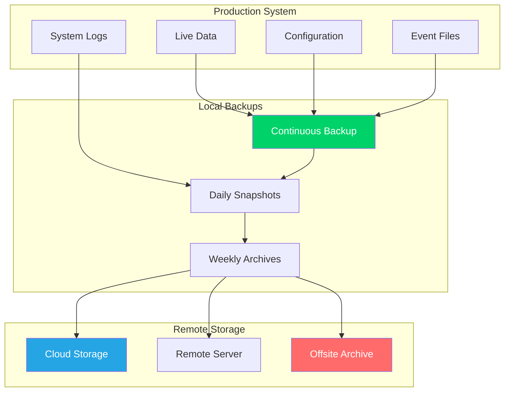

# Backup & Recovery

**Comprehensive backup and recovery procedures for CCTelegram MCP Server**

[](README.md) [](README.md) [](README.md)

---

## 📦 Backup Strategy

### Multi-Tier Backup Architecture

CCTelegram implements a comprehensive 3-2-1 backup strategy: **3 copies** of data, **2 different storage types**, **1 offsite location**.



### Backup Components

#### **Critical Data**
- **Configuration Files**: MCP server config, bridge settings, environment variables
- **Event Data**: All Telegram events, responses, and message history  
- **System State**: Process states, session data, authentication tokens
- **Logs**: Application logs, error logs, audit trails

#### **Application Data**
- **User Data**: User profiles, preferences, custom settings
- **Cache Data**: Performance caches, temporary data (lower priority)
- **Metrics**: Historical performance and monitoring data

---

## 🔄 Automated Backup System

### Continuous Backup Configuration

#### **Real-Time Event Backup**
```bash
#!/bin/bash
# continuous-backup.sh - Automated continuous backup script

BACKUP_BASE="/var/backups/cctelegram"
TIMESTAMP=$(date +%Y%m%d-%H%M%S)
SOURCE_DIR="$HOME/.cc_telegram"

# Create backup directories
mkdir -p "$BACKUP_BASE"/{continuous,daily,weekly,monthly}

# Continuous backup (every 5 minutes)
while true; do
    BACKUP_DIR="$BACKUP_BASE/continuous/$TIMESTAMP"
    mkdir -p "$BACKUP_DIR"
    
    # Backup critical files (incremental)
    rsync -avz --delete "$SOURCE_DIR/events/" "$BACKUP_DIR/events/"
    rsync -avz --delete "$SOURCE_DIR/responses/" "$BACKUP_DIR/responses/"
    rsync -avz --delete "$SOURCE_DIR/status/" "$BACKUP_DIR/status/"
    
    # Backup configuration
    cp /etc/cctelegram/*.toml "$BACKUP_DIR/" 2>/dev/null
    
    # Backup environment (sanitized)
    env | grep -E "^(MCP_|TELEGRAM_|BRIDGE_)" | sed 's/=.*/=***/' > "$BACKUP_DIR/environment.txt"
    
    # Create backup manifest
    {
        echo "Backup created: $(date)"
        echo "Source: $SOURCE_DIR"
        echo "Backup type: Continuous"
        echo "Files backed up:"
        find "$BACKUP_DIR" -type f | wc -l
        echo "Total size:"
        du -sh "$BACKUP_DIR" | cut -f1
    } > "$BACKUP_DIR/backup-manifest.txt"
    
    # Cleanup old continuous backups (keep last 24 hours)
    find "$BACKUP_BASE/continuous" -type d -mtime +1 -exec rm -rf {} \; 2>/dev/null
    
    sleep 300  # 5 minutes
done
```

#### **Scheduled Backup System**
```bash
#!/bin/bash
# scheduled-backup.sh - Daily/weekly/monthly backup system

BACKUP_BASE="/var/backups/cctelegram"
DATE=$(date +%Y%m%d)
TIMESTAMP=$(date +%Y%m%d-%H%M%S)

# Daily backup
create_daily_backup() {
    echo "🔄 Creating daily backup..."
    
    DAILY_DIR="$BACKUP_BASE/daily/$DATE"
    mkdir -p "$DAILY_DIR"
    
    # Full system backup
    tar -czf "$DAILY_DIR/cctelegram-full-$TIMESTAMP.tar.gz" \
        -C "$HOME" \
        ".cc_telegram" \
        --exclude="*.tmp" \
        --exclude="*.log" \
        --exclude="cache/*"
    
    # Configuration backup
    tar -czf "$DAILY_DIR/config-$TIMESTAMP.tar.gz" \
        -C "/etc" \
        "cctelegram"
    
    # Database backup (if applicable)
    if command -v sqlite3 &> /dev/null; then
        sqlite3 ~/.cc_telegram/cctelegram.db ".backup '$DAILY_DIR/database-$TIMESTAMP.db'"
    fi
    
    # System state backup
    {
        ps aux | grep cctelegram
        systemctl status cctelegram-mcp
        systemctl status cctelegram-bridge
        netstat -tuln | grep 8080
    } > "$DAILY_DIR/system-state-$TIMESTAMP.txt"
    
    # Cleanup old daily backups (keep 30 days)
    find "$BACKUP_BASE/daily" -type d -mtime +30 -exec rm -rf {} \; 2>/dev/null
    
    echo "✅ Daily backup completed: $DAILY_DIR"
}

# Weekly backup
create_weekly_backup() {
    if [ $(date +%u) -eq 7 ]; then  # Sunday
        echo "📦 Creating weekly archive backup..."
        
        WEEKLY_DIR="$BACKUP_BASE/weekly/$(date +%Y-W%U)"
        mkdir -p "$WEEKLY_DIR"
        
        # Archive daily backups
        tar -czf "$WEEKLY_DIR/daily-backups-$(date +%Y-W%U).tar.gz" \
            -C "$BACKUP_BASE" \
            "daily"
        
        # Create comprehensive system snapshot
        tar -czf "$WEEKLY_DIR/complete-system-$TIMESTAMP.tar.gz" \
            -C "/" \
            "home/$USER/.cc_telegram" \
            "etc/cctelegram" \
            "var/log/cctelegram" \
            --exclude="*.tmp" \
            --exclude="cache/*"
        
        # Cleanup old weekly backups (keep 12 weeks)
        find "$BACKUP_BASE/weekly" -type d -mtime +84 -exec rm -rf {} \; 2>/dev/null
        
        echo "✅ Weekly backup completed: $WEEKLY_DIR"
    fi
}

# Monthly backup
create_monthly_backup() {
    if [ $(date +%d) -eq 01 ]; then  # First day of month
        echo "🗄️ Creating monthly archive backup..."
        
        MONTHLY_DIR="$BACKUP_BASE/monthly/$(date +%Y-%m)"
        mkdir -p "$MONTHLY_DIR"
        
        # Archive all recent backups
        tar -czf "$MONTHLY_DIR/monthly-archive-$(date +%Y-%m).tar.gz" \
            -C "$BACKUP_BASE" \
            "daily" "weekly"
        
        # Create offsite backup
        if [ -n "$OFFSITE_BACKUP_LOCATION" ]; then
            rsync -avz "$MONTHLY_DIR/" "$OFFSITE_BACKUP_LOCATION/cctelegram/$(date +%Y-%m)/"
        fi
        
        # Cleanup old monthly backups (keep 12 months)
        find "$BACKUP_BASE/monthly" -type d -mtime +365 -exec rm -rf {} \; 2>/dev/null
        
        echo "✅ Monthly backup completed: $MONTHLY_DIR"
    fi
}

# Execute based on cron schedule
case "$1" in
    "daily")
        create_daily_backup
        create_weekly_backup
        create_monthly_backup
        ;;
    "weekly")
        create_weekly_backup
        ;;
    "monthly")
        create_monthly_backup
        ;;
    *)
        echo "Usage: $0 {daily|weekly|monthly}"
        exit 1
        ;;
esac
```

---

## 🔍 Backup Verification

### Automated Backup Testing

#### **Backup Integrity Verification**
```bash
#!/bin/bash
# verify-backup-integrity.sh - Automated backup verification

BACKUP_BASE="/var/backups/cctelegram"

verify_backup_integrity() {
    local backup_file="$1"
    local backup_type="$2"
    
    echo "🔍 Verifying backup: $(basename $backup_file)"
    
    # Test archive integrity
    if tar -tzf "$backup_file" >/dev/null 2>&1; then
        echo "✅ Archive integrity: OK"
    else
        echo "❌ Archive integrity: FAILED"
        return 1
    fi
    
    # Test file count
    local file_count=$(tar -tzf "$backup_file" | wc -l)
    if [ $file_count -gt 10 ]; then  # Minimum expected files
        echo "✅ File count: $file_count files"
    else
        echo "⚠️ File count: Only $file_count files (may be incomplete)"
    fi
    
    # Test backup size
    local backup_size=$(du -h "$backup_file" | cut -f1)
    echo "📊 Backup size: $backup_size"
    
    # Test critical files presence
    local critical_files=("events" "responses" "config")
    for file in "${critical_files[@]}"; do
        if tar -tzf "$backup_file" | grep -q "$file"; then
            echo "✅ Critical file '$file': Present"
        else
            echo "❌ Critical file '$file': Missing"
        fi
    done
    
    echo "✅ Backup verification completed"
    return 0
}

# Verify latest backups
echo "🔍 Starting backup verification process..."

# Verify latest daily backup
LATEST_DAILY=$(find "$BACKUP_BASE/daily" -name "*.tar.gz" -type f -printf '%T@ %p\n' | sort -n | tail -1 | cut -d' ' -f2-)
if [ -n "$LATEST_DAILY" ]; then
    verify_backup_integrity "$LATEST_DAILY" "daily"
else
    echo "❌ No daily backup found"
fi

# Verify latest weekly backup
LATEST_WEEKLY=$(find "$BACKUP_BASE/weekly" -name "*.tar.gz" -type f -printf '%T@ %p\n' | sort -n | tail -1 | cut -d' ' -f2-)
if [ -n "$LATEST_WEEKLY" ]; then
    verify_backup_integrity "$LATEST_WEEKLY" "weekly"
else
    echo "⚠️ No weekly backup found"
fi

echo "🔍 Backup verification process completed"
```

---

## 🚀 Recovery Procedures

### Emergency Recovery Workflow

#### **Rapid Recovery System**
```bash
#!/bin/bash
# emergency-recovery.sh - Fast recovery from backup

BACKUP_BASE="/var/backups/cctelegram"
RECOVERY_TARGET="$HOME/.cc_telegram"

emergency_recovery() {
    local backup_file="$1"
    local recovery_type="${2:-full}"
    
    echo "🚨 Starting emergency recovery from: $(basename $backup_file)"
    
    # Stop services
    echo "⏹️ Stopping CCTelegram services..."
    systemctl stop cctelegram-mcp 2>/dev/null
    systemctl stop cctelegram-bridge 2>/dev/null
    
    # Create recovery backup of current state
    if [ -d "$RECOVERY_TARGET" ]; then
        echo "💾 Backing up current state..."
        mv "$RECOVERY_TARGET" "${RECOVERY_TARGET}.recovery-backup-$(date +%s)"
    fi
    
    # Extract backup
    echo "📦 Extracting backup..."
    mkdir -p "$RECOVERY_TARGET"
    
    if [[ "$backup_file" == *.tar.gz ]]; then
        tar -xzf "$backup_file" -C "$HOME" --overwrite
    else
        echo "❌ Unsupported backup format"
        return 1
    fi
    
    # Fix permissions
    echo "🔒 Fixing permissions..."
    chown -R $USER:$USER "$RECOVERY_TARGET"
    chmod 755 "$RECOVERY_TARGET"
    find "$RECOVERY_TARGET" -type d -exec chmod 755 {} \;
    find "$RECOVERY_TARGET" -type f -exec chmod 644 {} \;
    
    # Restore configuration
    echo "⚙️ Restoring configuration..."
    if [ -d "/tmp/cctelegram-config-recovery" ]; then
        cp -r /tmp/cctelegram-config-recovery/* /etc/cctelegram/ 2>/dev/null
    fi
    
    # Validate recovery
    echo "✅ Validating recovery..."
    if [ -d "$RECOVERY_TARGET/events" ] && [ -d "$RECOVERY_TARGET/responses" ]; then
        echo "✅ Core directories restored"
    else
        echo "❌ Recovery validation failed"
        return 1
    fi
    
    # Restart services
    echo "🔄 Restarting services..."
    systemctl start cctelegram-mcp
    systemctl start cctelegram-bridge
    
    # Wait for services to start
    sleep 10
    
    # Test service health
    if curl -sf http://localhost:8080/health >/dev/null; then
        echo "✅ MCP Server: Healthy"
    else
        echo "⚠️ MCP Server: May need manual intervention"
    fi
    
    if pgrep -f "cctelegram-bridge" >/dev/null; then
        echo "✅ Bridge Process: Running"
    else
        echo "⚠️ Bridge Process: May need manual start"
    fi
    
    echo "🎉 Emergency recovery completed successfully"
    echo "📁 Previous state backed up to: ${RECOVERY_TARGET}.recovery-backup-*"
    
    return 0
}

# Determine recovery source
if [ -n "$1" ]; then
    # Use specified backup file
    BACKUP_FILE="$1"
elif [ -n "$BACKUP_BASE" ]; then
    # Use latest daily backup
    BACKUP_FILE=$(find "$BACKUP_BASE/daily" -name "*.tar.gz" -type f -printf '%T@ %p\n' | sort -n | tail -1 | cut -d' ' -f2-)
else
    echo "❌ No backup file specified and no backup base found"
    exit 1
fi

if [ -f "$BACKUP_FILE" ]; then
    emergency_recovery "$BACKUP_FILE"
else
    echo "❌ Backup file not found: $BACKUP_FILE"
    exit 1
fi
```

### Granular Recovery Options

#### **Selective Data Recovery**
```bash
#!/bin/bash
# selective-recovery.sh - Recover specific components

recover_events() {
    local backup_file="$1"
    echo "📝 Recovering event data..."
    
    tar -xzf "$backup_file" -C "$HOME" ".cc_telegram/events" --overwrite
    chown -R $USER:$USER "$HOME/.cc_telegram/events"
    echo "✅ Event data recovered"
}

recover_configuration() {
    local backup_file="$1"
    echo "⚙️ Recovering configuration..."
    
    # Extract config from backup
    tar -xzf "$backup_file" -C "/tmp" "etc/cctelegram" --strip-components=1 2>/dev/null
    
    if [ -d "/tmp/cctelegram" ]; then
        cp -r /tmp/cctelegram/* /etc/cctelegram/
        echo "✅ Configuration recovered"
    else
        echo "⚠️ No configuration found in backup"
    fi
}

recover_user_data() {
    local backup_file="$1"
    echo "👤 Recovering user data..."
    
    tar -xzf "$backup_file" -C "$HOME" ".cc_telegram/responses" --overwrite
    tar -xzf "$backup_file" -C "$HOME" ".cc_telegram/status" --overwrite
    chown -R $USER:$USER "$HOME/.cc_telegram"/{responses,status}
    echo "✅ User data recovered"
}

# Recovery options
case "$1" in
    "events")
        recover_events "$2"
        ;;
    "config")
        recover_configuration "$2"
        ;;
    "user")
        recover_user_data "$2"
        ;;
    "all")
        recover_events "$2"
        recover_configuration "$2"
        recover_user_data "$2"
        ;;
    *)
        echo "Usage: $0 {events|config|user|all} <backup-file>"
        exit 1
        ;;
esac
```

---

## 🛡️ Disaster Recovery

### Business Continuity Planning

#### **Recovery Time Objectives (RTO)**
- **Critical Services**: < 5 minutes
- **Full System**: < 15 minutes
- **Historical Data**: < 1 hour
- **Complete Rebuild**: < 4 hours

#### **Recovery Point Objectives (RPO)**
- **Event Data**: < 5 minutes (continuous backup)
- **Configuration**: < 1 hour (scheduled backup)
- **System State**: < 24 hours (daily backup)

### Disaster Recovery Runbook

#### **Complete System Rebuild**
```bash
#!/bin/bash
# disaster-recovery-rebuild.sh - Complete system rebuild

echo "🏗️ Starting complete system rebuild..."

# 1. System preparation
echo "1. Preparing clean system..."
apt-get update
apt-get install -y nodejs npm curl wget

# 2. Install CCTelegram
echo "2. Installing CCTelegram MCP Server..."
npm install -g @cctelegram/mcp-server
npm install -g @cctelegram/bridge

# 3. Create directory structure
echo "3. Creating directory structure..."
mkdir -p ~/.cc_telegram/{events,responses,status,logs}
mkdir -p /etc/cctelegram
mkdir -p /var/log/cctelegram

# 4. Restore from backup
echo "4. Restoring from latest backup..."
if [ -n "$OFFSITE_BACKUP_LOCATION" ]; then
    rsync -avz "$OFFSITE_BACKUP_LOCATION/cctelegram/latest/" ~/.cc_telegram/
else
    echo "⚠️ No offsite backup configured - manual restore required"
fi

# 5. Restore configuration
echo "5. Restoring configuration..."
# Restore from secure configuration backup
# (Implementation depends on your secure storage solution)

# 6. Set permissions
echo "6. Setting permissions..."
chown -R $USER:$USER ~/.cc_telegram
chmod 755 ~/.cc_telegram
find ~/.cc_telegram -type d -exec chmod 755 {} \;
find ~/.cc_telegram -type f -exec chmod 644 {} \;

# 7. Start services
echo "7. Starting services..."
systemctl enable cctelegram-mcp
systemctl enable cctelegram-bridge
systemctl start cctelegram-mcp
systemctl start cctelegram-bridge

# 8. Verify recovery
echo "8. Verifying recovery..."
sleep 30
curl -f http://localhost:8080/health && echo "✅ MCP Server healthy"
pgrep -f "cctelegram-bridge" && echo "✅ Bridge running"

echo "🎉 Disaster recovery completed"
```

---

## 📋 Backup Management

### Backup Monitoring Dashboard

#### **Backup Status Monitoring**
```bash
#!/bin/bash
# backup-status-monitor.sh - Monitor backup health

BACKUP_BASE="/var/backups/cctelegram"

generate_backup_report() {
    echo "📊 CCTelegram Backup Status Report"
    echo "================================="
    echo "Generated: $(date)"
    echo ""
    
    # Continuous backup status
    LATEST_CONTINUOUS=$(find "$BACKUP_BASE/continuous" -type d -name "*-*" | sort | tail -1)
    if [ -n "$LATEST_CONTINUOUS" ]; then
        echo "✅ Latest Continuous Backup: $(basename $LATEST_CONTINUOUS)"
        echo "   Age: $(( ($(date +%s) - $(stat -c %Y "$LATEST_CONTINUOUS")) / 60 )) minutes"
    else
        echo "❌ No continuous backup found"
    fi
    
    # Daily backup status
    LATEST_DAILY=$(find "$BACKUP_BASE/daily" -name "*.tar.gz" -type f | sort | tail -1)
    if [ -n "$LATEST_DAILY" ]; then
        echo "✅ Latest Daily Backup: $(basename $LATEST_DAILY)"
        echo "   Size: $(du -h "$LATEST_DAILY" | cut -f1)"
        echo "   Age: $(( ($(date +%s) - $(stat -c %Y "$LATEST_DAILY")) / 3600 )) hours"
    else
        echo "❌ No daily backup found"
    fi
    
    # Weekly backup status
    LATEST_WEEKLY=$(find "$BACKUP_BASE/weekly" -name "*.tar.gz" -type f | sort | tail -1)
    if [ -n "$LATEST_WEEKLY" ]; then
        echo "✅ Latest Weekly Backup: $(basename $LATEST_WEEKLY)"
        echo "   Size: $(du -h "$LATEST_WEEKLY" | cut -f1)"
        echo "   Age: $(( ($(date +%s) - $(stat -c %Y "$LATEST_WEEKLY")) / 86400 )) days"
    else
        echo "⚠️ No weekly backup found"
    fi
    
    # Storage usage
    echo ""
    echo "💾 Storage Usage:"
    du -sh "$BACKUP_BASE"/* | sort -hr
    
    # Backup retention compliance
    echo ""
    echo "📋 Retention Compliance:"
    CONTINUOUS_COUNT=$(find "$BACKUP_BASE/continuous" -type d -name "*-*" | wc -l)
    DAILY_COUNT=$(find "$BACKUP_BASE/daily" -name "*.tar.gz" | wc -l)
    WEEKLY_COUNT=$(find "$BACKUP_BASE/weekly" -name "*.tar.gz" | wc -l)
    
    echo "   Continuous backups: $CONTINUOUS_COUNT (target: 24-48)"
    echo "   Daily backups: $DAILY_COUNT (target: 30)"
    echo "   Weekly backups: $WEEKLY_COUNT (target: 12)"
}

generate_backup_report
```

---

## 🔗 Related Documentation

### Backup Resources
- **[Operations Center](README.md)** - Complete operations overview
- **[Monitoring & Alerting](monitoring.md)** - Backup monitoring setup
- **[Security Procedures](../security/security-procedures.md)** - Backup security considerations

### Recovery Resources
- **[Troubleshooting Guide](troubleshooting.md)** - Recovery troubleshooting
- **[System Architecture](../architecture/system-overview.md)** - Understanding system components
- **[Emergency Response](runbooks/README.md)** - Emergency response procedures

---

*Backup & Recovery Guide - Version 1.8.5*  
*Last updated: August 2025 | Next review: November 2025*

## See Also

- **[Operations Runbooks](runbooks/README.md)** - Emergency procedures and recovery workflows
- **[Health Check Procedures](runbooks/health-checks.md)** - Automated backup health monitoring
- **[Incident Response](../security/incident-response.md)** - Security incident backup and recovery