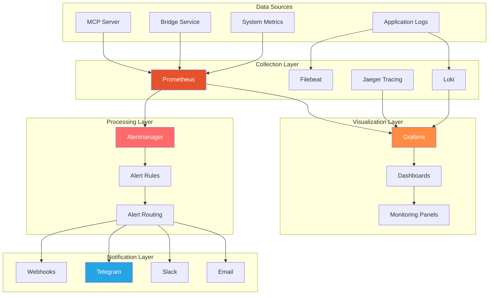

# Monitoring & Alerting

**Comprehensive monitoring and alerting system for CCTelegram MCP Server**

[](README.md) [](README.md) [](README.md)

---

## 📊 Monitoring Overview

CCTelegram MCP Server implements comprehensive monitoring and alerting to ensure optimal performance, reliability, and security across all system components.

### Monitoring Architecture



---

## 🔧 Metrics Collection

### Prometheus Configuration

#### **Core Metrics Configuration**
```yaml
# prometheus.yml
global:
  scrape_interval: 15s
  evaluation_interval: 15s
  external_labels:
    cluster: 'cctelegram'
    environment: 'production'

rule_files:
  - "alert_rules/*.yml"
  - "recording_rules/*.yml"

alerting:
  alertmanagers:
    - static_configs:
        - targets:
          - alertmanager:9093

scrape_configs:
  # MCP Server metrics
  - job_name: 'cctelegram-mcp'
    static_configs:
      - targets: ['localhost:9090']
    scrape_interval: 10s
    metrics_path: /metrics
    params:
      format: ['prometheus']
    relabel_configs:
      - source_labels: [__address__]
        target_label: instance
        replacement: 'mcp-server'

  # Bridge service metrics  
  - job_name: 'cctelegram-bridge'
    static_configs:
      - targets: ['localhost:9091']
    scrape_interval: 15s
    metrics_path: /metrics
    
  # System metrics
  - job_name: 'node-exporter'
    static_configs:
      - targets: ['localhost:9100']
    scrape_interval: 30s

  # Process metrics
  - job_name: 'process-exporter'
    static_configs:
      - targets: ['localhost:9256']
    scrape_interval: 30s
```

#### **Custom Metrics Registry**
```typescript
import { register, Counter, Histogram, Gauge } from 'prom-client';

export class MetricsRegistry {
  // Event processing metrics
  public static readonly eventProcessingTotal = new Counter({
    name: 'cctelegram_events_processed_total',
    help: 'Total number of events processed',
    labelNames: ['event_type', 'status', 'source']
  });

  public static readonly eventProcessingDuration = new Histogram({
    name: 'cctelegram_event_processing_duration_seconds',
    help: 'Event processing duration in seconds',
    labelNames: ['event_type'],
    buckets: [0.1, 0.5, 1, 2, 5, 10, 30]
  });

  // Telegram API metrics
  public static readonly telegramApiRequests = new Counter({
    name: 'cctelegram_telegram_api_requests_total',
    help: 'Total Telegram API requests',
    labelNames: ['method', 'status']
  });

  public static readonly telegramApiDuration = new Histogram({
    name: 'cctelegram_telegram_api_duration_seconds',
    help: 'Telegram API request duration',
    labelNames: ['method'],
    buckets: [0.1, 0.5, 1, 2, 5, 10]
  });

  // Bridge metrics
  public static readonly bridgeHealth = new Gauge({
    name: 'cctelegram_bridge_health',
    help: 'Bridge health status (1=healthy, 0=unhealthy)',
    labelNames: ['instance']
  });

  public static readonly bridgeQueueDepth = new Gauge({
    name: 'cctelegram_bridge_queue_depth',
    help: 'Number of items in bridge queue',
    labelNames: ['queue_type']
  });

  // System resource metrics
  public static readonly memoryUsage = new Gauge({
    name: 'cctelegram_memory_usage_bytes',
    help: 'Memory usage in bytes',
    labelNames: ['component']
  });

  public static readonly cpuUsage = new Gauge({
    name: 'cctelegram_cpu_usage_percent',
    help: 'CPU usage percentage',
    labelNames: ['component']
  });

  // Authentication metrics
  public static readonly authAttempts = new Counter({
    name: 'cctelegram_auth_attempts_total',
    help: 'Authentication attempts',
    labelNames: ['status', 'method']
  });

  public static readonly activeSessions = new Gauge({
    name: 'cctelegram_active_sessions',
    help: 'Number of active user sessions'
  });

  // Error metrics
  public static readonly errorTotal = new Counter({
    name: 'cctelegram_errors_total',
    help: 'Total errors by type',
    labelNames: ['error_type', 'component', 'severity']
  });

  public static registerAll(): void {
    register.registerMetric(this.eventProcessingTotal);
    register.registerMetric(this.eventProcessingDuration);
    register.registerMetric(this.telegramApiRequests);
    register.registerMetric(this.telegramApiDuration);
    register.registerMetric(this.bridgeHealth);
    register.registerMetric(this.bridgeQueueDepth);
    register.registerMetric(this.memoryUsage);
    register.registerMetric(this.cpuUsage);
    register.registerMetric(this.authAttempts);
    register.registerMetric(this.activeSessions);
    register.registerMetric(this.errorTotal);
  }
}
```

### Metrics Instrumentation

#### **Application Metrics**
```typescript
class ApplicationMetrics {
  static instrumentEventProcessing(eventType: string) {
    const timer = MetricsRegistry.eventProcessingDuration.startTimer({ event_type: eventType });
    
    return {
      recordSuccess: () => {
        timer();
        MetricsRegistry.eventProcessingTotal.inc({ 
          event_type: eventType, 
          status: 'success',
          source: 'mcp-server'
        });
      },
      recordFailure: (error: string) => {
        timer();
        MetricsRegistry.eventProcessingTotal.inc({ 
          event_type: eventType, 
          status: 'failure',
          source: 'mcp-server'
        });
        MetricsRegistry.errorTotal.inc({
          error_type: error,
          component: 'event-processor',
          severity: 'high'
        });
      }
    };
  }

  static recordTelegramApiCall(method: string, duration: number, success: boolean) {
    MetricsRegistry.telegramApiRequests.inc({
      method,
      status: success ? 'success' : 'failure'
    });
    
    MetricsRegistry.telegramApiDuration.observe({ method }, duration / 1000);
  }

  static updateSystemMetrics(component: string, memoryBytes: number, cpuPercent: number) {
    MetricsRegistry.memoryUsage.set({ component }, memoryBytes);
    MetricsRegistry.cpuUsage.set({ component }, cpuPercent);
  }

  static recordAuthAttempt(method: string, success: boolean) {
    MetricsRegistry.authAttempts.inc({
      status: success ? 'success' : 'failure',
      method
    });
  }
}
```

---

## 📈 Grafana Dashboards

### System Overview Dashboard

#### **Dashboard Configuration**
```json
{
  "dashboard": {
    "id": null,
    "title": "CCTelegram System Overview",
    "tags": ["cctelegram", "system"],
    "timezone": "browser",
    "refresh": "30s",
    "time": {
      "from": "now-1h",
      "to": "now"
    },
    "panels": [
      {
        "id": 1,
        "title": "Event Processing Rate",
        "type": "stat",
        "targets": [
          {
            "expr": "rate(cctelegram_events_processed_total[5m])",
            "legendFormat": "{{event_type}}"
          }
        ],
        "fieldConfig": {
          "defaults": {
            "unit": "reqps",
            "thresholds": {
              "steps": [
                { "color": "green", "value": null },
                { "color": "yellow", "value": 50 },
                { "color": "red", "value": 100 }
              ]
            }
          }
        }
      },
      {
        "id": 2,
        "title": "Response Time Distribution",
        "type": "heatmap",
        "targets": [
          {
            "expr": "rate(cctelegram_event_processing_duration_seconds_bucket[5m])",
            "legendFormat": "{{le}}"
          }
        ]
      },
      {
        "id": 3,
        "title": "System Resources",
        "type": "timeseries",
        "targets": [
          {
            "expr": "cctelegram_memory_usage_bytes / 1024 / 1024",
            "legendFormat": "Memory (MB) - {{component}}"
          },
          {
            "expr": "cctelegram_cpu_usage_percent",
            "legendFormat": "CPU (%) - {{component}}"
          }
        ]
      },
      {
        "id": 4,
        "title": "Error Rate",
        "type": "timeseries",
        "targets": [
          {
            "expr": "rate(cctelegram_errors_total[5m])",
            "legendFormat": "{{error_type}} - {{component}}"
          }
        ],
        "fieldConfig": {
          "defaults": {
            "custom": {
              "drawStyle": "line",
              "lineInterpolation": "linear",
              "fillOpacity": 10
            }
          }
        }
      }
    ]
  }
}
```

### Performance Dashboard

#### **Key Performance Indicators**
```json
{
  "dashboard": {
    "title": "CCTelegram Performance Metrics",
    "panels": [
      {
        "title": "Telegram API Performance",
        "type": "timeseries",
        "targets": [
          {
            "expr": "histogram_quantile(0.95, rate(cctelegram_telegram_api_duration_seconds_bucket[5m]))",
            "legendFormat": "95th percentile"
          },
          {
            "expr": "histogram_quantile(0.50, rate(cctelegram_telegram_api_duration_seconds_bucket[5m]))",
            "legendFormat": "50th percentile"
          }
        ]
      },
      {
        "title": "Bridge Queue Health",
        "type": "stat",
        "targets": [
          {
            "expr": "cctelegram_bridge_queue_depth",
            "legendFormat": "{{queue_type}}"
          }
        ],
        "fieldConfig": {
          "defaults": {
            "thresholds": {
              "steps": [
                { "color": "green", "value": null },
                { "color": "yellow", "value": 50 },
                { "color": "red", "value": 100 }
              ]
            }
          }
        }
      },
      {
        "title": "Authentication Success Rate",
        "type": "stat",
        "targets": [
          {
            "expr": "rate(cctelegram_auth_attempts_total{status=\"success\"}[5m]) / rate(cctelegram_auth_attempts_total[5m]) * 100",
            "legendFormat": "Success Rate (%)"
          }
        ]
      }
    ]
  }
}
```

---

## 🚨 Alerting System

### Alert Rules Configuration

#### **Critical System Alerts**
```yaml
# alert_rules/critical.yml
groups:
  - name: cctelegram.critical
    rules:
      # Service availability
      - alert: MCPServerDown
        expr: up{job="cctelegram-mcp"} == 0
        for: 1m
        labels:
          severity: critical
          service: mcp-server
        annotations:
          summary: "MCP Server is down"
          description: "MCP Server has been down for more than 1 minute"
          runbook_url: "https://docs.cctelegram.io/operations/runbooks/mcp-server-down"

      - alert: BridgeServiceDown
        expr: cctelegram_bridge_health == 0
        for: 2m
        labels:
          severity: critical
          service: bridge
        annotations:
          summary: "Bridge service is unhealthy"
          description: "Bridge service health check failing for {{ $value }} minutes"

      # Performance alerts
      - alert: HighEventProcessingLatency
        expr: histogram_quantile(0.95, rate(cctelegram_event_processing_duration_seconds_bucket[5m])) > 5
        for: 5m
        labels:
          severity: warning
          service: event-processor
        annotations:
          summary: "High event processing latency"
          description: "95th percentile latency is {{ $value }}s"

      - alert: TelegramAPIErrors
        expr: rate(cctelegram_telegram_api_requests_total{status="failure"}[5m]) > 0.1
        for: 2m
        labels:
          severity: critical
          service: telegram-api
        annotations:
          summary: "High Telegram API error rate"
          description: "Telegram API error rate is {{ $value }} errors/sec"

      # Resource alerts
      - alert: HighMemoryUsage
        expr: cctelegram_memory_usage_bytes / 1024 / 1024 > 500
        for: 10m
        labels:
          severity: warning
          service: system
        annotations:
          summary: "High memory usage"
          description: "Memory usage is {{ $value }}MB for {{ $labels.component }}"

      - alert: HighCPUUsage
        expr: cctelegram_cpu_usage_percent > 80
        for: 10m
        labels:
          severity: warning
          service: system
        annotations:
          summary: "High CPU usage"
          description: "CPU usage is {{ $value }}% for {{ $labels.component }}"
```

#### **Security Alerts**
```yaml
# alert_rules/security.yml
groups:
  - name: cctelegram.security
    rules:
      # Authentication failures
      - alert: HighAuthFailureRate
        expr: rate(cctelegram_auth_attempts_total{status="failure"}[5m]) > 0.5
        for: 2m
        labels:
          severity: warning
          service: authentication
        annotations:
          summary: "High authentication failure rate"
          description: "Authentication failure rate is {{ $value }} failures/sec"

      - alert: UnusualAuthActivity
        expr: cctelegram_auth_attempts_total{status="success"} > 100
        for: 1h
        labels:
          severity: info
          service: authentication
        annotations:
          summary: "Unusual authentication activity"
          description: "{{ $value }} successful authentications in the last hour"

      # Error monitoring
      - alert: SecurityErrors
        expr: rate(cctelegram_errors_total{severity="critical"}[5m]) > 0
        for: 0m
        labels:
          severity: critical
          service: security
        annotations:
          summary: "Critical security errors detected"
          description: "{{ $value }} critical errors/sec in {{ $labels.component }}"
```

### Alertmanager Configuration

#### **Alert Routing and Notification**
```yaml
# alertmanager.yml
global:
  smtp_smarthost: 'localhost:587'
  smtp_from: 'alerts@cctelegram.io'
  telegram_api_url: 'https://api.telegram.org'

route:
  group_by: ['alertname', 'service']
  group_wait: 30s
  group_interval: 5m
  repeat_interval: 4h
  receiver: 'default'
  routes:
    # Critical alerts - immediate notification
    - match:
        severity: critical
      receiver: 'critical-alerts'
      group_wait: 10s
      repeat_interval: 30m

    # Security alerts
    - match:
        service: security
      receiver: 'security-team'
      group_wait: 30s

    # Service-specific routing
    - match:
        service: telegram-api
      receiver: 'telegram-alerts'

receivers:
  - name: 'default'
    email_configs:
      - to: 'ops-team@cctelegram.io'
        subject: 'CCTelegram Alert: {{ .GroupLabels.alertname }}'
        html: |
          {{ range .Alerts }}
          <h3>{{ .Annotations.summary }}</h3>
          <p>{{ .Annotations.description }}</p>
          <p><strong>Labels:</strong> {{ range .Labels.SortedPairs }}{{ .Name }}={{ .Value }} {{ end }}</p>
          {{ end }}

  - name: 'critical-alerts'
    telegram_configs:
      - bot_token: '{{ .CommonAnnotations.telegram_bot_token }}'
        chat_id: -1001234567890
        message: |
          🚨 *CRITICAL ALERT* 🚨
          
          *Service:* {{ .GroupLabels.service }}
          *Alert:* {{ .GroupLabels.alertname }}
          
          {{ range .Alerts }}
          *Summary:* {{ .Annotations.summary }}
          *Description:* {{ .Annotations.description }}
          {{ if .Annotations.runbook_url }}
          [📖 Runbook]({{ .Annotations.runbook_url }})
          {{ end }}
          {{ end }}
        parse_mode: 'Markdown'
    
    email_configs:
      - to: 'critical@cctelegram.io'
        subject: '[CRITICAL] CCTelegram Alert: {{ .GroupLabels.alertname }}'
        priority: 'high'

  - name: 'security-team'
    telegram_configs:
      - bot_token: '{{ .CommonAnnotations.telegram_bot_token }}'
        chat_id: -1001111111111
        message: |
          🛡️ *SECURITY ALERT* 🛡️
          
          {{ range .Alerts }}
          *Alert:* {{ .Annotations.summary }}
          *Details:* {{ .Annotations.description }}
          *Severity:* {{ .Labels.severity }}
          {{ end }}
        parse_mode: 'Markdown'
```

---

## 📱 Smart Alerting Features

### Alert Suppression and Correlation

#### **Dynamic Thresholds**
```typescript
class DynamicAlertThresholds {
  private historicalData: Map<string, number[]> = new Map();
  
  calculateAdaptiveThreshold(metric: string, currentValue: number): number {
    const history = this.historicalData.get(metric) || [];
    
    if (history.length < 10) {
      // Not enough data, use static threshold
      return this.getStaticThreshold(metric);
    }
    
    // Calculate statistical thresholds
    const mean = history.reduce((a, b) => a + b) / history.length;
    const stdDev = Math.sqrt(
      history.reduce((acc, val) => acc + Math.pow(val - mean, 2), 0) / history.length
    );
    
    // Dynamic threshold: mean + 2 standard deviations
    return mean + (2 * stdDev);
  }
  
  updateHistory(metric: string, value: number): void {
    const history = this.historicalData.get(metric) || [];
    history.push(value);
    
    // Keep only last 100 values
    if (history.length > 100) {
      history.shift();
    }
    
    this.historicalData.set(metric, history);
  }
}
```

#### **Alert Correlation Engine**
```typescript
class AlertCorrelationEngine {
  private recentAlerts: Alert[] = [];
  
  correlateAlert(newAlert: Alert): CorrelationResult {
    const relatedAlerts = this.findRelatedAlerts(newAlert);
    
    if (relatedAlerts.length > 0) {
      return {
        shouldSuppress: this.shouldSuppressAlert(newAlert, relatedAlerts),
        correlatedAlerts: relatedAlerts,
        rootCause: this.identifyRootCause(newAlert, relatedAlerts)
      };
    }
    
    return { shouldSuppress: false, correlatedAlerts: [], rootCause: null };
  }
  
  private findRelatedAlerts(alert: Alert): Alert[] {
    const timeWindow = 5 * 60 * 1000; // 5 minutes
    const now = Date.now();
    
    return this.recentAlerts.filter(recentAlert => {
      // Same service or component
      const sameService = recentAlert.labels.service === alert.labels.service;
      const sameComponent = recentAlert.labels.component === alert.labels.component;
      
      // Within time window
      const withinWindow = (now - recentAlert.timestamp) < timeWindow;
      
      return (sameService || sameComponent) && withinWindow;
    });
  }
  
  private shouldSuppressAlert(alert: Alert, relatedAlerts: Alert[]): boolean {
    // Suppress if we already have a critical alert for the same service
    return relatedAlerts.some(related => 
      related.labels.severity === 'critical' && 
      related.labels.service === alert.labels.service
    );
  }
}
```

### Intelligent Escalation

#### **Escalation Rules**
```yaml
# escalation.yml
escalation_policies:
  - name: "critical-service-down"
    conditions:
      - severity: "critical"
        services: ["mcp-server", "bridge"]
    escalation_steps:
      - delay: 0m
        notify: ["on-call-engineer"]
      - delay: 15m
        notify: ["team-lead", "senior-engineer"]
        if_not_acknowledged: true
      - delay: 30m
        notify: ["engineering-manager", "cto"]
        if_not_resolved: true
      - delay: 60m
        notify: ["executive-team"]
        if_not_resolved: true

  - name: "performance-degradation"
    conditions:
      - severity: "warning"
        labels:
          service: ["event-processor", "telegram-api"]
    escalation_steps:
      - delay: 5m
        notify: ["on-call-engineer"]
      - delay: 30m
        notify: ["team-lead"]
        if_not_acknowledged: true

  - name: "security-incident"
    conditions:
      - service: "security"
      - labels:
          error_type: ["auth_failure", "intrusion_attempt"]
    escalation_steps:
      - delay: 0m
        notify: ["security-team", "on-call-engineer"]
      - delay: 10m
        notify: ["security-manager", "engineering-manager"]
        if_not_acknowledged: true
```

---

## 🔧 Health Checks

### Comprehensive Health Monitoring

#### **Multi-Level Health Checks**
```typescript
interface HealthCheck {
  name: string
  status: 'healthy' | 'degraded' | 'unhealthy'
  lastCheck: Date
  details: Record<string, any>
  dependencies?: string[]
}

class HealthChecker {
  private checks: Map<string, HealthCheck> = new Map();
  
  async runHealthChecks(): Promise<OverallHealth> {
    const results: HealthCheck[] = [];
    
    // System health checks
    results.push(await this.checkSystemResources());
    results.push(await this.checkDiskSpace());
    results.push(await this.checkNetworkConnectivity());
    
    // Service health checks
    results.push(await this.checkMCPServer());
    results.push(await this.checkBridgeService());
    results.push(await this.checkTelegramAPI());
    
    // Data integrity checks
    results.push(await this.checkEventQueue());
    results.push(await this.checkResponseSystem());
    
    return this.calculateOverallHealth(results);
  }
  
  private async checkMCPServer(): Promise<HealthCheck> {
    try {
      const response = await fetch('http://localhost:8080/health', {
        timeout: 5000
      });
      
      if (response.ok) {
        const data = await response.json();
        return {
          name: 'mcp-server',
          status: data.status === 'healthy' ? 'healthy' : 'degraded',
          lastCheck: new Date(),
          details: data
        };
      } else {
        return {
          name: 'mcp-server',
          status: 'unhealthy',
          lastCheck: new Date(),
          details: { error: `HTTP ${response.status}` }
        };
      }
    } catch (error) {
      return {
        name: 'mcp-server',
        status: 'unhealthy',
        lastCheck: new Date(),
        details: { error: error.message }
      };
    }
  }
  
  private async checkBridgeService(): Promise<HealthCheck> {
    try {
      // Check if bridge process is running
      const processExists = await this.checkProcessExists('cctelegram-bridge');
      
      if (!processExists) {
        return {
          name: 'bridge-service',
          status: 'unhealthy',
          lastCheck: new Date(),
          details: { error: 'Process not found' }
        };
      }
      
      // Check bridge health endpoint
      const response = await fetch('http://localhost:8080/bridge/health', {
        timeout: 3000
      });
      
      if (response.ok) {
        const data = await response.json();
        return {
          name: 'bridge-service',
          status: data.healthy ? 'healthy' : 'degraded',
          lastCheck: new Date(),
          details: data
        };
      }
      
      return {
        name: 'bridge-service',
        status: 'degraded',
        lastCheck: new Date(),
        details: { warning: 'Health endpoint unavailable but process running' }
      };
      
    } catch (error) {
      return {
        name: 'bridge-service',
        status: 'unhealthy',
        lastCheck: new Date(),
        details: { error: error.message }
      };
    }
  }
  
  private async checkTelegramAPI(): Promise<HealthCheck> {
    try {
      const response = await fetch(
        `https://api.telegram.org/bot${process.env.TELEGRAM_BOT_TOKEN}/getMe`,
        { timeout: 5000 }
      );
      
      if (response.ok) {
        const data = await response.json();
        return {
          name: 'telegram-api',
          status: data.ok ? 'healthy' : 'degraded',
          lastCheck: new Date(),
          details: { bot: data.result?.username }
        };
      }
      
      return {
        name: 'telegram-api',
        status: 'unhealthy',
        lastCheck: new Date(),
        details: { error: `HTTP ${response.status}` }
      };
      
    } catch (error) {
      return {
        name: 'telegram-api',
        status: 'unhealthy',
        lastCheck: new Date(),
        details: { error: error.message }
      };
    }
  }
}
```

### Health Dashboard Integration

#### **Health Status API**
```typescript
// Health status endpoint
app.get('/health', async (req, res) => {
  const healthChecker = new HealthChecker();
  const health = await healthChecker.runHealthChecks();
  
  const statusCode = health.status === 'healthy' ? 200 : 
                    health.status === 'degraded' ? 200 : 503;
  
  res.status(statusCode).json({
    status: health.status,
    timestamp: new Date().toISOString(),
    version: process.env.APP_VERSION || '1.8.5',
    uptime: process.uptime(),
    checks: health.checks,
    summary: {
      healthy: health.checks.filter(c => c.status === 'healthy').length,
      degraded: health.checks.filter(c => c.status === 'degraded').length,
      unhealthy: health.checks.filter(c => c.status === 'unhealthy').length
    }
  });
});
```

---

## 📋 Monitoring Setup Checklist

### Deployment Checklist

- [ ] **Prometheus server configured and running**
- [ ] **Grafana dashboards imported and configured**
- [ ] **Alertmanager rules deployed and tested**
- [ ] **Notification channels configured (email, Telegram, Slack)**
- [ ] **Health check endpoints verified**
- [ ] **Log aggregation configured (if using Loki)**
- [ ] **Metric retention policies configured**
- [ ] **Backup monitoring data regularly**
- [ ] **Test alert delivery to all channels**
- [ ] **Document runbook procedures**
- [ ] **Train team on dashboard usage**
- [ ] **Set up monitoring monitoring (meta-monitoring)**

### Configuration Validation

```bash
#!/bin/bash
# validate-monitoring.sh

echo "🔍 Validating Monitoring Configuration"

# Check Prometheus
if curl -sf http://localhost:9090/-/healthy; then
  echo "✅ Prometheus: Running"
else
  echo "❌ Prometheus: Not accessible"
fi

# Check Alertmanager
if curl -sf http://localhost:9093/-/healthy; then
  echo "✅ Alertmanager: Running"
else
  echo "❌ Alertmanager: Not accessible"
fi

# Check Grafana
if curl -sf http://localhost:3000/api/health; then
  echo "✅ Grafana: Running"
else
  echo "❌ Grafana: Not accessible"
fi

# Test metric collection
METRIC_COUNT=$(curl -s http://localhost:9090/api/v1/label/__name__/values | jq '.data | length')
if [[ $METRIC_COUNT -gt 0 ]]; then
  echo "✅ Metrics: $METRIC_COUNT metrics collected"
else
  echo "❌ Metrics: No metrics found"
fi

# Test alert rules
RULE_COUNT=$(curl -s http://localhost:9090/api/v1/rules | jq '.data.groups | length')
if [[ $RULE_COUNT -gt 0 ]]; then
  echo "✅ Alert Rules: $RULE_COUNT rule groups loaded"
else
  echo "❌ Alert Rules: No rules found"
fi

echo "✅ Monitoring validation completed"
```

---

## 🔗 Related Documentation

### Monitoring Resources
- **[Operations Center](README.md)** - Complete operations overview
- **[Troubleshooting Guide](troubleshooting.md)** - Problem resolution procedures
- **[Performance Tuning](../maintenance/performance-tuning.md)** - System optimization

### Integration Resources
- **[System Architecture](../architecture/system-overview.md)** - Understanding system components
- **[Security Monitoring](../security/security-procedures.md#security-monitoring)** - Security-specific monitoring
- **[Emergency Response](runbooks/README.md)** - Emergency response procedures

---

*Monitoring & Alerting Guide - Version 1.8.5*  
*Last updated: August 2025 | Next review: November 2025*

## See Also

- **[Operations Runbooks](runbooks/README.md)** - Operational procedures and emergency response
- **[Health Check Procedures](runbooks/health-checks.md)** - Automated health monitoring
- **[System Performance](../architecture/system-overview.md#performance-optimization)** - Performance optimization and monitoring