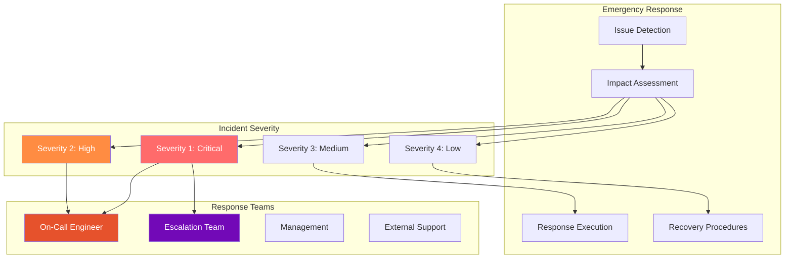

# CCTelegram Operations Runbooks

**Emergency procedures, incident response, and operational runbooks for production CCTelegram deployment**

[](incident-response.md) [](emergency-procedures.md) [](service-level-objectives.md)

---

## 🚨 Emergency Response Center

Quick access to critical operational procedures for CCTelegram production environments.



---

## 📚 Runbook Collection

### 🔥 **[Primary Incident Response](incident-response.md)**
**Complete incident response procedures with escalation matrix**
- **Severity Classification** with response time requirements (5min-24h)
- **Escalation Procedures** with contact information and protocols
- **Recovery Workflows** with step-by-step restoration procedures
- **Post-Incident Analysis** with lessons learned and improvement tracking

### ⚡ **Emergency Response Procedures**
**Critical situation response for immediate action**

#### **Service Outage Response (Severity 1)**
```bash
# Immediate Response (0-5 minutes)
1. Acknowledge incident in monitoring system
2. Check system status: curl http://localhost:8080/health
3. Verify bridge process: ps aux | grep cctelegram
4. Check MCP server: npm run status:mcp
5. Notify on-call team immediately

# Recovery Actions (5-30 minutes)
1. Restart services: npm run restart:all
2. Verify functionality: npm run test:integration
3. Monitor for stability: npm run monitor:recovery
4. Update stakeholders every 10 minutes
```

#### **Partial Service Degradation (Severity 2)**
```bash
# Assessment (0-15 minutes)
1. Identify affected components
2. Check performance metrics: npm run metrics:current
3. Review error logs: npm run logs:errors
4. Assess user impact scope

# Mitigation (15-60 minutes)
1. Apply temporary fixes if available
2. Scale resources if needed: npm run scale:bridge
3. Implement workarounds: npm run workaround:enable
4. Monitor recovery progress continuously
```

### 🔧 **Health Check Procedures**
**Systematic health validation and monitoring**

#### **Daily Health Checks**
```yaml
health_checks:
  system_status:
    - Bridge process running
    - MCP server responsive
    - Telegram API connectivity
    - File system accessibility
    - Memory usage < 100MB
    - CPU usage < 70%
    
  functional_tests:
    - Send test notification
    - Verify message delivery
    - Check approval workflow
    - Validate status endpoints
    - Test error handling
    
  performance_validation:
    - Response time < 500ms
    - Event processing rate > 100/min
    - Error rate < 0.1%
    - Queue depth < 100 events
```

#### **Health Check Automation**
```bash
# Comprehensive health check script
#!/bin/bash
npm run health:system
npm run health:functional  
npm run health:performance
npm run health:security
npm run health:report
```

### 📊 **Performance Monitoring Runbooks**
**Performance issue detection and resolution**

#### **High Memory Usage Response**
```bash
# Detection (Memory > 150MB for 10+ minutes)
1. Check memory breakdown: npm run memory:analyze
2. Identify memory leaks: npm run memory:profile
3. Review recent changes: git log --oneline -10
4. Check for file descriptor leaks: lsof -p $(pgrep cctelegram)

# Resolution
1. Restart affected service: npm run restart:bridge
2. Apply memory optimization: npm run optimize:memory
3. Monitor recovery: npm run monitor:memory
4. Implement preventive measures: npm run tune:gc
```

#### **High Error Rate Response**
```bash
# Detection (Error rate > 1% for 5+ minutes)
1. Identify error patterns: npm run errors:analyze
2. Check external dependencies: npm run deps:status
3. Review error logs: npm run logs:errors --since 30m
4. Test critical paths: npm run test:critical

# Resolution
1. Address root cause based on error analysis
2. Implement circuit breaker if needed
3. Scale resources if overload detected
4. Update monitoring thresholds if appropriate
```

### 🔐 **Security Incident Response**
**Security event response and containment**

#### **Security Incident Classification**
| Severity | Examples | Response Time | Actions |
|----------|----------|---------------|---------|
| **Critical** | Data breach, system compromise | <15 minutes | Immediate containment, executive notification |
| **High** | Authentication bypass, privilege escalation | <1 hour | Security team activation, system isolation |
| **Medium** | Suspicious activity, policy violation | <4 hours | Investigation, access review |
| **Low** | Minor configuration issue | <24 hours | Standard remediation workflow |

#### **Security Response Procedure**
```bash
# Immediate Response (0-15 minutes)
1. Isolate affected systems: npm run security:isolate
2. Preserve evidence: npm run security:preserve
3. Notify security team: npm run security:notify
4. Begin preliminary assessment: npm run security:assess

# Investigation (15-60 minutes)
1. Collect forensic data: npm run forensics:collect
2. Analyze attack vectors: npm run security:analyze
3. Assess data exposure: npm run security:exposure
4. Document timeline: npm run incident:timeline
```

### 🔄 **Backup and Recovery Runbooks**
**Data protection and disaster recovery procedures**

#### **Backup Verification Procedure**
```bash
# Daily Backup Check
1. Verify backup completion: npm run backup:verify
2. Test backup integrity: npm run backup:test
3. Check backup retention: npm run backup:retention
4. Validate restore capability: npm run restore:test

# Recovery Time Objectives (RTO)
- Critical data: < 1 hour
- System configuration: < 30 minutes  
- Event history: < 2 hours
- Full system restore: < 4 hours
```

#### **Disaster Recovery Activation**
```bash
# Recovery Initiation
1. Assess damage scope: npm run disaster:assess
2. Activate recovery site: npm run recovery:activate
3. Restore from backups: npm run restore:full
4. Validate system integrity: npm run validate:recovery
5. Resume normal operations: npm run ops:resume
```

---

## 📞 Emergency Contacts

### Internal Escalation Chain

| Role | Primary | Backup | Emergency |
|------|---------|---------|-----------|
| **On-Call Engineer** | +1-555-ON-CALL | +1-555-BACKUP | 24/7 |
| **Team Lead** | +1-555-TEAM-LEAD | +1-555-DEPUTY | Business hours |
| **Engineering Manager** | +1-555-ENG-MGR | +1-555-DIRECTOR | Critical only |
| **Security Team** | +1-555-SECURITY | security@internal | 24/7 |

### External Support Contacts

- **Telegram Support**: [BotSupport](https://t.me/BotSupport)
- **Cloud Provider**: [Support Portal](https://support.cloud.provider)
- **Monitoring Vendor**: [24/7 Support](https://monitoring.vendor/support)
- **Security Vendor**: [Incident Response](https://security.vendor/incident)

---

## 📊 Service Level Objectives (SLOs)

### Availability Targets

| Service Component | SLO | Error Budget | Measurement Window |
|------------------|-----|--------------|-------------------|
| **Overall System** | 99.9% | 43.8 min/month | Rolling 30 days |
| **MCP Server** | 99.95% | 21.9 min/month | Rolling 30 days |
| **Bridge Service** | 99.9% | 43.8 min/month | Rolling 30 days |
| **Telegram API** | 99.5% | 3.65 hours/month | Rolling 30 days |

### Performance Targets

| Metric | SLO | Measurement | Alert Threshold |
|--------|-----|-------------|-----------------|
| **Response Time** | <500ms p95 | MCP tool calls | >1000ms p95 |
| **Event Processing** | <1000ms p95 | End-to-end events | >2000ms p95 |
| **Message Delivery** | <5s p99 | Telegram delivery | >10s p99 |
| **Error Rate** | <0.1% | All operations | >1% |

---

## 🔧 Runbook Maintenance

### Monthly Runbook Review

- [ ] **Incident Response**: Update contact information and escalation procedures
- [ ] **Recovery Procedures**: Test disaster recovery and backup restoration
- [ ] **Performance Baselines**: Review and update SLO targets based on actual performance
- [ ] **Security Procedures**: Update threat models and response procedures

### Quarterly Runbook Validation

- [ ] **Full Disaster Recovery Drill**: Complete system recovery simulation
- [ ] **Security Incident Simulation**: Tabletop exercise with security team
- [ ] **Cross-Team Training**: Operations team training on all runbooks
- [ ] **Documentation Updates**: Update based on lessons learned and system changes

---

## 🔗 Related Documentation

### Operations Resources
- **[Main Operations Guide](../README.md)** - Complete operations overview
- **[Troubleshooting Center](../troubleshooting/README.md)** - Problem resolution procedures
- **[Monitoring & Alerting](../../administration/monitoring.md)** - System observability

### System Documentation
- **[Architecture Overview](../../development/architecture.md)** - System design understanding
- **[Security Center](../../security/README.md)** - Security policies and procedures
- **[Configuration Reference](../../reference/configuration.md)** - System configuration details

---

*Operations Runbooks - Production Ready*  
*Last updated: August 2025 | Next review: November 2025*

## See Also

- **[Incident Response Guide](incident-response.md)** - Detailed incident response procedures
- **[Troubleshooting Hub](../troubleshooting/README.md)** - Problem diagnosis and resolution
- **[Security Incident Response](../../security/README.md#security-incident-response)** - Security-specific procedures
- **[Administration Guide](../../administration/README.md)** - Overall system administration