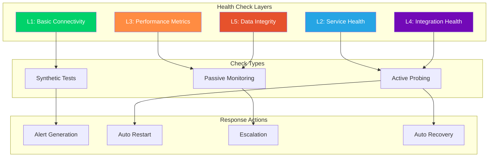

# Health Check Procedures

**Automated health monitoring and diagnostic procedures for CCTelegram MCP Server**

[](../README.md) [](../README.md) [](README.md)

---

## 🏥 Health Check Overview

### Multi-Level Health Assessment

CCTelegram implements comprehensive health monitoring across multiple system layers to ensure optimal performance and early issue detection.



---

## 🔍 Level 1: Basic Connectivity Checks

### HTTP Endpoint Health

#### **Primary Health Endpoint**
```bash
#!/bin/bash
# l1-connectivity-check.sh - Basic connectivity verification

check_http_health() {
    local endpoint="$1"
    local expected_status="${2:-200}"
    local timeout="${3:-10}"
    
    echo "🌐 Testing HTTP health: $endpoint"
    
    # Basic connectivity test
    if curl -sSf --max-time "$timeout" "$endpoint" >/dev/null 2>&1; then
        echo "✅ HTTP Connectivity: OK"
        return 0
    else
        echo "❌ HTTP Connectivity: FAILED"
        return 1
    fi
}

check_mcp_health() {
    local mcp_host="${MCP_HOST:-localhost}"
    local mcp_port="${MCP_PORT:-8080}"
    local health_endpoint="http://$mcp_host:$mcp_port/health"
    
    echo "🔍 L1 Health Check: MCP Server Connectivity"
    echo "==========================================>"
    
    # Test basic TCP connectivity
    if timeout 5 bash -c "cat < /dev/null > /dev/tcp/$mcp_host/$mcp_port"; then
        echo "✅ TCP Port $mcp_port: Open"
    else
        echo "❌ TCP Port $mcp_port: Closed or unreachable"
        return 1
    fi
    
    # Test HTTP health endpoint
    if check_http_health "$health_endpoint"; then
        # Get detailed health information
        local health_response=$(curl -s --max-time 5 "$health_endpoint" 2>/dev/null)
        
        if echo "$health_response" | jq -r '.status' 2>/dev/null | grep -q "healthy"; then
            echo "✅ MCP Health Status: Healthy"
            
            # Extract key metrics
            local uptime=$(echo "$health_response" | jq -r '.uptime // "unknown"')
            local version=$(echo "$health_response" | jq -r '.version // "unknown"')
            
            echo "📊 Uptime: $uptime seconds"
            echo "📦 Version: $version"
            
            return 0
        else
            echo "⚠️ MCP Health Status: Degraded"
            echo "Response: $health_response"
            return 1
        fi
    else
        echo "❌ MCP Health Endpoint: Unreachable"
        return 1
    fi
}

check_bridge_connectivity() {
    echo "🌉 L1 Health Check: Bridge Process Connectivity"
    echo "==============================================="
    
    # Check if bridge process exists
    if pgrep -f "cctelegram.*bridge" >/dev/null; then
        echo "✅ Bridge Process: Running"
        
        # Get process details
        local bridge_pid=$(pgrep -f "cctelegram.*bridge")
        local bridge_uptime=$(ps -o etime= -p "$bridge_pid" | tr -d ' ')
        
        echo "🆔 Process ID: $bridge_pid"
        echo "⏱️ Process Uptime: $bridge_uptime"
        
        return 0
    else
        echo "❌ Bridge Process: Not running"
        return 1
    fi
}

check_telegram_connectivity() {
    echo "📱 L1 Health Check: Telegram API Connectivity"
    echo "=============================================="
    
    if [ -z "$TELEGRAM_BOT_TOKEN" ]; then
        echo "⚠️ Telegram Bot Token: Not configured"
        return 1
    fi
    
    # Test Telegram API connectivity
    local telegram_response=$(curl -s --max-time 10 \
        "https://api.telegram.org/bot$TELEGRAM_BOT_TOKEN/getMe" 2>/dev/null)
    
    if echo "$telegram_response" | jq -r '.ok' 2>/dev/null | grep -q "true"; then
        local bot_username=$(echo "$telegram_response" | jq -r '.result.username')
        echo "✅ Telegram API: Accessible"
        echo "🤖 Bot Username: @$bot_username"
        return 0
    else
        echo "❌ Telegram API: Connection failed"
        echo "Response: $telegram_response"
        return 1
    fi
}

# Execute L1 checks
main() {
    echo "🏥 Level 1 Health Checks - Basic Connectivity"
    echo "=============================================="
    echo "Started: $(date)"
    echo ""
    
    local overall_status=0
    
    # MCP Server connectivity
    if ! check_mcp_health; then
        overall_status=1
    fi
    echo ""
    
    # Bridge connectivity
    if ! check_bridge_connectivity; then
        overall_status=1
    fi
    echo ""
    
    # Telegram connectivity
    if ! check_telegram_connectivity; then
        overall_status=1
    fi
    echo ""
    
    # Overall status
    echo "=============================================="
    if [ $overall_status -eq 0 ]; then
        echo "✅ L1 Health Check: PASSED - All connectivity tests successful"
    else
        echo "❌ L1 Health Check: FAILED - One or more connectivity tests failed"
    fi
    echo "Completed: $(date)"
    
    return $overall_status
}

main "$@"
```

---

## 🔧 Level 2: Service Health Checks

### Process Health Monitoring

#### **Service Status Verification**
```bash
#!/bin/bash
# l2-service-health-check.sh - Service health verification

check_service_health() {
    echo "🔧 L2 Health Check: Service Health Verification"
    echo "==============================================="
    
    local overall_status=0
    
    # MCP Server service health
    echo "1. MCP Server Service Health:"
    if systemctl is-active --quiet cctelegram-mcp 2>/dev/null; then
        echo "   ✅ Service Status: Active"
        
        # Check service load time
        local start_time=$(systemctl show cctelegram-mcp --property=ActiveEnterTimestamp --value)
        echo "   📅 Started: $start_time"
        
        # Check if service is listening
        if netstat -tuln | grep -q ":8080.*LISTEN"; then
            echo "   ✅ Port 8080: Listening"
        else
            echo "   ❌ Port 8080: Not listening"
            overall_status=1
        fi
        
        # Check recent failures
        local failed_count=$(systemctl show cctelegram-mcp --property=NRestarts --value)
        if [ "$failed_count" -gt 5 ]; then
            echo "   ⚠️ Recent Restarts: $failed_count (high)"
        else
            echo "   ✅ Recent Restarts: $failed_count"
        fi
        
    else
        echo "   ❌ Service Status: Inactive"
        overall_status=1
    fi
    
    # Bridge service health  
    echo ""
    echo "2. Bridge Service Health:"
    if pgrep -f "cctelegram.*bridge" >/dev/null; then
        local bridge_pid=$(pgrep -f "cctelegram.*bridge")
        echo "   ✅ Bridge Process: Running (PID: $bridge_pid)"
        
        # Check process resource usage
        local cpu_usage=$(ps -p "$bridge_pid" -o %cpu --no-headers | tr -d ' ')
        local mem_usage=$(ps -p "$bridge_pid" -o %mem --no-headers | tr -d ' ')
        
        echo "   📊 CPU Usage: ${cpu_usage}%"
        echo "   💾 Memory Usage: ${mem_usage}%"
        
        # Check if process is responsive (not hung)
        if kill -0 "$bridge_pid" 2>/dev/null; then
            echo "   ✅ Process Responsiveness: OK"
        else
            echo "   ❌ Process Responsiveness: Failed"
            overall_status=1
        fi
        
    else
        echo "   ❌ Bridge Process: Not running"
        overall_status=1
    fi
    
    return $overall_status
}

check_configuration_health() {
    echo ""
    echo "3. Configuration Health:"
    
    # Check configuration file existence
    local config_files=(
        "/etc/cctelegram/cctelegram.toml"
        "$HOME/.cc_telegram/config.json"
    )
    
    for config_file in "${config_files[@]}"; do
        if [ -f "$config_file" ]; then
            echo "   ✅ Config File: $(basename $config_file) exists"
            
            # Check file permissions
            if [ -r "$config_file" ]; then
                echo "   ✅ Permissions: Readable"
            else
                echo "   ❌ Permissions: Not readable"
                overall_status=1
            fi
            
            # Check file age (warn if very old)
            local file_age=$(( ($(date +%s) - $(stat -c %Y "$config_file")) / 86400 ))
            if [ $file_age -gt 30 ]; then
                echo "   ⚠️ File Age: $file_age days (consider review)"
            else
                echo "   ✅ File Age: $file_age days"
            fi
            
        else
            echo "   ⚠️ Config File: $(basename $config_file) missing"
        fi
    done
    
    # Check environment variables
    echo ""
    echo "4. Environment Configuration:"
    
    local required_vars=("TELEGRAM_BOT_TOKEN" "TELEGRAM_CHAT_ID")
    for var in "${required_vars[@]}"; do
        if [ -n "${!var}" ]; then
            echo "   ✅ $var: Configured"
        else
            echo "   ❌ $var: Missing"
            overall_status=1
        fi
    done
    
    return $overall_status
}

# Execute L2 checks
main() {
    echo "🏥 Level 2 Health Checks - Service Health"
    echo "=========================================="
    echo "Started: $(date)"
    echo ""
    
    local overall_status=0
    
    if ! check_service_health; then
        overall_status=1
    fi
    
    if ! check_configuration_health; then
        overall_status=1
    fi
    
    echo ""
    echo "=========================================="
    if [ $overall_status -eq 0 ]; then
        echo "✅ L2 Health Check: PASSED - All service health checks successful"
    else
        echo "❌ L2 Health Check: FAILED - One or more service health checks failed"
    fi
    echo "Completed: $(date)"
    
    return $overall_status
}

main "$@"
```

---

## 📊 Level 3: Performance Health Checks

### Resource Utilization Monitoring

#### **Performance Metrics Assessment**
```bash
#!/bin/bash
# l3-performance-health-check.sh - Performance metrics assessment

check_system_resources() {
    echo "📊 L3 Health Check: System Resource Assessment"
    echo "=============================================="
    
    local overall_status=0
    
    # Memory usage check
    echo "1. Memory Usage Analysis:"
    local mem_total=$(free -m | awk '/^Mem:/ {print $2}')
    local mem_used=$(free -m | awk '/^Mem:/ {print $3}')
    local mem_percent=$(( mem_used * 100 / mem_total ))
    
    echo "   💾 Total Memory: ${mem_total}MB"
    echo "   💾 Used Memory: ${mem_used}MB (${mem_percent}%)"
    
    if [ $mem_percent -lt 75 ]; then
        echo "   ✅ Memory Status: Normal"
    elif [ $mem_percent -lt 90 ]; then
        echo "   ⚠️ Memory Status: High usage"
    else
        echo "   ❌ Memory Status: Critical usage"
        overall_status=1
    fi
    
    # CPU usage check
    echo ""
    echo "2. CPU Usage Analysis:"
    local cpu_usage=$(top -bn1 | grep "Cpu(s)" | awk '{print $2}' | cut -d'%' -f1)
    local cpu_load_1=$(uptime | awk -F'load average: ' '{print $2}' | cut -d',' -f1 | tr -d ' ')
    local cpu_cores=$(nproc)
    
    echo "   🖥️ Current CPU Usage: ${cpu_usage}%"
    echo "   📊 Load Average (1min): $cpu_load_1"
    echo "   🔢 CPU Cores: $cpu_cores"
    
    # Calculate load percentage
    local load_percent=$(echo "$cpu_load_1 $cpu_cores" | awk '{printf "%.0f", $1/$2*100}')
    
    if [ $load_percent -lt 75 ]; then
        echo "   ✅ CPU Load: Normal (${load_percent}%)"
    elif [ $load_percent -lt 90 ]; then
        echo "   ⚠️ CPU Load: High (${load_percent}%)"
    else
        echo "   ❌ CPU Load: Critical (${load_percent}%)"
        overall_status=1
    fi
    
    # Disk usage check
    echo ""
    echo "3. Disk Usage Analysis:"
    local disk_usage=$(df -h "$HOME/.cc_telegram" | awk 'NR==2 {print $5}' | sed 's/%//')
    local disk_available=$(df -h "$HOME/.cc_telegram" | awk 'NR==2 {print $4}')
    
    echo "   💿 Disk Usage: ${disk_usage}%"
    echo "   📀 Available Space: $disk_available"
    
    if [ $disk_usage -lt 80 ]; then
        echo "   ✅ Disk Status: Normal"
    elif [ $disk_usage -lt 95 ]; then
        echo "   ⚠️ Disk Status: High usage"
    else
        echo "   ❌ Disk Status: Critical usage"
        overall_status=1
    fi
    
    return $overall_status
}

check_application_performance() {
    echo ""
    echo "4. Application Performance Metrics:"
    
    # Check event processing rate
    if [ -d "$HOME/.cc_telegram/events" ]; then
        local events_last_hour=$(find "$HOME/.cc_telegram/events" -type f -mmin -60 | wc -l)
        local events_last_day=$(find "$HOME/.cc_telegram/events" -type f -mtime -1 | wc -l)
        
        echo "   📝 Events (last hour): $events_last_hour"
        echo "   📝 Events (last day): $events_last_day"
        
        # Calculate events per minute
        local events_per_minute=$(( events_last_hour / 60 ))
        echo "   ⏱️ Processing Rate: ~${events_per_minute} events/minute"
        
        if [ $events_per_minute -gt 100 ]; then
            echo "   ⚠️ Processing Load: High volume"
        else
            echo "   ✅ Processing Load: Normal"
        fi
    fi
    
    # Check response time to health endpoint
    echo ""
    echo "5. Response Time Analysis:"
    local start_time=$(date +%s%3N)
    
    if curl -sSf --max-time 5 "http://localhost:8080/health" >/dev/null 2>&1; then
        local end_time=$(date +%s%3N)
        local response_time=$(( end_time - start_time ))
        
        echo "   ⏱️ Health Endpoint Response: ${response_time}ms"
        
        if [ $response_time -lt 500 ]; then
            echo "   ✅ Response Performance: Excellent"
        elif [ $response_time -lt 2000 ]; then
            echo "   ✅ Response Performance: Good"
        elif [ $response_time -lt 5000 ]; then
            echo "   ⚠️ Response Performance: Slow"
        else
            echo "   ❌ Response Performance: Poor"
            overall_status=1
        fi
    else
        echo "   ❌ Health Endpoint: Unreachable"
        overall_status=1
    fi
    
    return $overall_status
}

# Execute L3 checks
main() {
    echo "🏥 Level 3 Health Checks - Performance Assessment"
    echo "=================================================="
    echo "Started: $(date)"
    echo ""
    
    local overall_status=0
    
    if ! check_system_resources; then
        overall_status=1
    fi
    
    if ! check_application_performance; then
        overall_status=1
    fi
    
    echo ""
    echo "=================================================="
    if [ $overall_status -eq 0 ]; then
        echo "✅ L3 Health Check: PASSED - All performance metrics within acceptable ranges"
    else
        echo "❌ L3 Health Check: FAILED - Performance issues detected"
    fi
    echo "Completed: $(date)"
    
    return $overall_status
}

main "$@"
```

---

## 🔗 Level 4: Integration Health Checks

### External System Integration

#### **Integration Point Verification**
```bash
#!/bin/bash
# l4-integration-health-check.sh - External integration verification

check_telegram_integration() {
    echo "🔗 L4 Health Check: Telegram Integration Verification"
    echo "====================================================="
    
    local overall_status=0
    
    echo "1. Telegram Bot Integration:"
    
    if [ -z "$TELEGRAM_BOT_TOKEN" ] || [ -z "$TELEGRAM_CHAT_ID" ]; then
        echo "   ❌ Configuration: Missing bot token or chat ID"
        return 1
    fi
    
    # Test bot information retrieval
    local bot_info=$(curl -s --max-time 10 \
        "https://api.telegram.org/bot$TELEGRAM_BOT_TOKEN/getMe" 2>/dev/null)
    
    if echo "$bot_info" | jq -r '.ok' 2>/dev/null | grep -q "true"; then
        local bot_username=$(echo "$bot_info" | jq -r '.result.username')
        local bot_id=$(echo "$bot_info" | jq -r '.result.id')
        echo "   ✅ Bot Authentication: Successful"
        echo "   🤖 Bot: @$bot_username (ID: $bot_id)"
    else
        echo "   ❌ Bot Authentication: Failed"
        echo "   Response: $bot_info"
        overall_status=1
    fi
    
    # Test message sending capability (dry run)
    echo ""
    echo "2. Message Sending Capability:"
    local test_message="CCTelegram Health Check - $(date +%H:%M:%S)"
    local send_response=$(curl -s --max-time 10 -X POST \
        "https://api.telegram.org/bot$TELEGRAM_BOT_TOKEN/sendMessage" \
        -H "Content-Type: application/json" \
        -d "{\"chat_id\":\"$TELEGRAM_CHAT_ID\",\"text\":\"$test_message\"}" 2>/dev/null)
    
    if echo "$send_response" | jq -r '.ok' 2>/dev/null | grep -q "true"; then
        local message_id=$(echo "$send_response" | jq -r '.result.message_id')
        echo "   ✅ Message Sending: Successful (ID: $message_id)"
        
        # Clean up test message
        curl -s -X POST "https://api.telegram.org/bot$TELEGRAM_BOT_TOKEN/deleteMessage" \
            -H "Content-Type: application/json" \
            -d "{\"chat_id\":\"$TELEGRAM_CHAT_ID\",\"message_id\":$message_id}" \
            >/dev/null 2>&1
        echo "   🧹 Test Message: Cleaned up"
    else
        echo "   ❌ Message Sending: Failed"
        echo "   Response: $send_response"
        overall_status=1
    fi
    
    return $overall_status
}

check_mcp_integration() {
    echo ""
    echo "3. MCP Server Integration:"
    
    # Test MCP tool availability
    local tools_response=$(curl -s --max-time 10 -X POST \
        "http://localhost:8080/mcp/tools/list" 2>/dev/null)
    
    if [ $? -eq 0 ] && [ -n "$tools_response" ]; then
        local tools_count=$(echo "$tools_response" | jq '.tools | length' 2>/dev/null)
        if [ -n "$tools_count" ] && [ "$tools_count" -gt 0 ]; then
            echo "   ✅ MCP Tools: Available ($tools_count tools)"
            
            # Test specific critical tools
            local critical_tools=("send_telegram_event" "get_bridge_status" "ensure_bridge_running")
            for tool in "${critical_tools[@]}"; do
                if echo "$tools_response" | jq -r '.tools[].name' | grep -q "$tool"; then
                    echo "   ✅ Critical Tool: $tool available"
                else
                    echo "   ⚠️ Critical Tool: $tool missing"
                fi
            done
        else
            echo "   ❌ MCP Tools: No tools available"
            overall_status=1
        fi
    else
        echo "   ❌ MCP Tools: Unable to retrieve tool list"
        overall_status=1
    fi
    
    # Test MCP tool execution
    echo ""
    echo "4. MCP Tool Execution Test:"
    local status_response=$(curl -s --max-time 10 -X POST \
        "http://localhost:8080/mcp/tools/call" \
        -H "Content-Type: application/json" \
        -d '{"tool": "get_bridge_status", "params": {}}' 2>/dev/null)
    
    if [ $? -eq 0 ] && [ -n "$status_response" ]; then
        echo "   ✅ Tool Execution: Successful"
        echo "   📊 Bridge Status: $(echo "$status_response" | jq -r '.status // "unknown"')"
    else
        echo "   ❌ Tool Execution: Failed"
        overall_status=1
    fi
    
    return $overall_status
}

check_file_system_integration() {
    echo ""
    echo "5. File System Integration:"
    
    local directories=(
        "$HOME/.cc_telegram/events"
        "$HOME/.cc_telegram/responses"
        "$HOME/.cc_telegram/status"
    )
    
    for dir in "${directories[@]}"; do
        if [ -d "$dir" ]; then
            echo "   ✅ Directory: $(basename $dir) exists"
            
            # Check write permissions
            local test_file="$dir/.health_check_$(date +%s)"
            if touch "$test_file" 2>/dev/null; then
                echo "   ✅ Write Access: $(basename $dir) writable"
                rm -f "$test_file"
            else
                echo "   ❌ Write Access: $(basename $dir) not writable"
                overall_status=1
            fi
        else
            echo "   ❌ Directory: $(basename $dir) missing"
            overall_status=1
        fi
    done
    
    return $overall_status
}

# Execute L4 checks
main() {
    echo "🏥 Level 4 Health Checks - Integration Verification"
    echo "==================================================="
    echo "Started: $(date)"
    echo ""
    
    local overall_status=0
    
    if ! check_telegram_integration; then
        overall_status=1
    fi
    
    if ! check_mcp_integration; then
        overall_status=1
    fi
    
    if ! check_file_system_integration; then
        overall_status=1
    fi
    
    echo ""
    echo "==================================================="
    if [ $overall_status -eq 0 ]; then
        echo "✅ L4 Health Check: PASSED - All integrations functioning correctly"
    else
        echo "❌ L4 Health Check: FAILED - Integration issues detected"
    fi
    echo "Completed: $(date)"
    
    return $overall_status
}

main "$@"
```

---

## 🔒 Level 5: Data Integrity Checks

### Data Consistency Verification

#### **Data Integrity Assessment**
```bash
#!/bin/bash
# l5-data-integrity-check.sh - Data integrity verification

check_event_data_integrity() {
    echo "🔒 L5 Health Check: Data Integrity Verification"
    echo "=============================================="
    
    local overall_status=0
    
    echo "1. Event Data Integrity:"
    
    local events_dir="$HOME/.cc_telegram/events"
    if [ ! -d "$events_dir" ]; then
        echo "   ❌ Events Directory: Missing"
        return 1
    fi
    
    # Count and validate event files
    local event_count=$(find "$events_dir" -name "*.json" | wc -l)
    local corrupted_count=0
    
    echo "   📊 Total Event Files: $event_count"
    
    if [ $event_count -gt 0 ]; then
        # Check JSON validity of recent event files (last 10)
        find "$events_dir" -name "*.json" -type f -mtime -1 | head -10 | while read -r event_file; do
            if ! jq empty "$event_file" 2>/dev/null; then
                echo "   ❌ Corrupted Event File: $(basename "$event_file")"
                corrupted_count=$((corrupted_count + 1))
            fi
        done
        
        if [ $corrupted_count -eq 0 ]; then
            echo "   ✅ Event File Integrity: All recent files valid"
        else
            echo "   ❌ Event File Integrity: $corrupted_count corrupted files found"
            overall_status=1
        fi
    else
        echo "   ⚠️ Event Files: None found (may be normal for new installation)"
    fi
    
    # Check event file permissions
    local permission_issues=$(find "$events_dir" -type f ! -readable | wc -l)
    if [ $permission_issues -eq 0 ]; then
        echo "   ✅ Event File Permissions: All files readable"
    else
        echo "   ❌ Event File Permissions: $permission_issues files not readable"
        overall_status=1
    fi
    
    return $overall_status
}

check_response_data_integrity() {
    echo ""
    echo "2. Response Data Integrity:"
    
    local responses_dir="$HOME/.cc_telegram/responses"
    if [ ! -d "$responses_dir" ]; then
        echo "   ❌ Responses Directory: Missing"
        return 1
    fi
    
    # Check for orphaned response files (older than 24 hours)
    local old_responses=$(find "$responses_dir" -name "*.json" -type f -mtime +1 | wc -l)
    if [ $old_responses -gt 0 ]; then
        echo "   ⚠️ Old Response Files: $old_responses files older than 24h (consider cleanup)"
    else
        echo "   ✅ Response Files: No old files found"
    fi
    
    # Check response file format
    local recent_responses=$(find "$responses_dir" -name "*.json" -type f -mtime -1 | head -5)
    local format_errors=0
    
    for response_file in $recent_responses; do
        if [ -f "$response_file" ]; then
            # Check JSON format
            if ! jq empty "$response_file" 2>/dev/null; then
                echo "   ❌ Invalid JSON: $(basename "$response_file")"
                format_errors=$((format_errors + 1))
            fi
            
            # Check required fields
            if ! jq -e '.timestamp and .event_type and .status' "$response_file" >/dev/null 2>&1; then
                echo "   ❌ Missing Required Fields: $(basename "$response_file")"
                format_errors=$((format_errors + 1))
            fi
        fi
    done
    
    if [ $format_errors -eq 0 ]; then
        echo "   ✅ Response File Format: All recent files valid"
    else
        echo "   ❌ Response File Format: $format_errors files with format issues"
        overall_status=1
    fi
    
    return $overall_status
}

check_configuration_integrity() {
    echo ""
    echo "3. Configuration Integrity:"
    
    local config_files=(
        "/etc/cctelegram/cctelegram.toml"
        "$HOME/.cc_telegram/config.json"
    )
    
    for config_file in "${config_files[@]}"; do
        if [ -f "$config_file" ]; then
            echo "   📁 Checking: $(basename "$config_file")"
            
            # Check file format based on extension
            case "$config_file" in
                *.toml)
                    # Basic TOML syntax check
                    if python3 -c "import toml; toml.load('$config_file')" 2>/dev/null; then
                        echo "   ✅ TOML Syntax: Valid"
                    else
                        echo "   ❌ TOML Syntax: Invalid"
                        overall_status=1
                    fi
                    ;;
                *.json)
                    if jq empty "$config_file" 2>/dev/null; then
                        echo "   ✅ JSON Syntax: Valid"
                    else
                        echo "   ❌ JSON Syntax: Invalid"
                        overall_status=1
                    fi
                    ;;
            esac
            
            # Check file size (detect truncation)
            local file_size=$(stat -c%s "$config_file")
            if [ $file_size -lt 10 ]; then
                echo "   ❌ File Size: Suspiciously small ($file_size bytes)"
                overall_status=1
            else
                echo "   ✅ File Size: Normal ($file_size bytes)"
            fi
        else
            echo "   ⚠️ Config File: $(basename "$config_file") not found"
        fi
    done
    
    return $overall_status
}

check_backup_integrity() {
    echo ""
    echo "4. Backup Data Integrity:"
    
    local backup_dirs=(
        "/var/backups/cctelegram"
        "$HOME/backups/cctelegram"
    )
    
    local backup_found=false
    
    for backup_dir in "${backup_dirs[@]}"; do
        if [ -d "$backup_dir" ]; then
            backup_found=true
            echo "   📁 Backup Directory: $(basename "$backup_dir") found"
            
            # Find most recent backup
            local recent_backup=$(find "$backup_dir" -name "*.tar.gz" -type f -mtime -7 | head -1)
            if [ -n "$recent_backup" ]; then
                echo "   ✅ Recent Backup: $(basename "$recent_backup")"
                
                # Test backup integrity
                if tar -tzf "$recent_backup" >/dev/null 2>&1; then
                    echo "   ✅ Backup Integrity: Archive is valid"
                else
                    echo "   ❌ Backup Integrity: Archive is corrupted"
                    overall_status=1
                fi
            else
                echo "   ⚠️ Recent Backup: No backup found within 7 days"
            fi
        fi
    done
    
    if [ "$backup_found" = false ]; then
        echo "   ⚠️ Backup System: No backup directories found"
    fi
    
    return $overall_status
}

# Execute L5 checks
main() {
    echo "🏥 Level 5 Health Checks - Data Integrity Verification"
    echo "======================================================="
    echo "Started: $(date)"
    echo ""
    
    local overall_status=0
    
    if ! check_event_data_integrity; then
        overall_status=1
    fi
    
    if ! check_response_data_integrity; then
        overall_status=1
    fi
    
    if ! check_configuration_integrity; then
        overall_status=1
    fi
    
    if ! check_backup_integrity; then
        overall_status=1
    fi
    
    echo ""
    echo "======================================================="
    if [ $overall_status -eq 0 ]; then
        echo "✅ L5 Health Check: PASSED - Data integrity verified"
    else
        echo "❌ L5 Health Check: FAILED - Data integrity issues detected"
    fi
    echo "Completed: $(date)"
    
    return $overall_status
}

main "$@"
```

---

## 🤖 Automated Health Check Orchestrator

### Master Health Check Coordinator

#### **Complete Health Assessment System**
```bash
#!/bin/bash
# health-check-orchestrator.sh - Master health check coordinator

HEALTH_CHECK_DIR="$(dirname "$0")"
LOG_DIR="/var/log/cctelegram/health-checks"
TIMESTAMP=$(date +%Y%m%d-%H%M%S)

# Ensure log directory exists
mkdir -p "$LOG_DIR"

run_complete_health_assessment() {
    echo "🏥 CCTelegram Complete Health Assessment"
    echo "========================================"
    echo "Started: $(date)"
    echo "Assessment ID: $TIMESTAMP"
    echo ""
    
    local overall_status=0
    local level_results=()
    
    # Level 1: Basic Connectivity
    echo "🟢 Starting Level 1: Basic Connectivity Checks..."
    if bash "$HEALTH_CHECK_DIR/l1-connectivity-check.sh" > "$LOG_DIR/l1-$TIMESTAMP.log" 2>&1; then
        echo "✅ Level 1: PASSED"
        level_results+=("L1:PASS")
    else
        echo "❌ Level 1: FAILED"
        level_results+=("L1:FAIL")
        overall_status=1
    fi
    
    # Level 2: Service Health
    echo "🔵 Starting Level 2: Service Health Checks..."
    if bash "$HEALTH_CHECK_DIR/l2-service-health-check.sh" > "$LOG_DIR/l2-$TIMESTAMP.log" 2>&1; then
        echo "✅ Level 2: PASSED"
        level_results+=("L2:PASS")
    else
        echo "❌ Level 2: FAILED"
        level_results+=("L2:FAIL")
        overall_status=1
    fi
    
    # Level 3: Performance Assessment
    echo "🟡 Starting Level 3: Performance Assessment..."
    if bash "$HEALTH_CHECK_DIR/l3-performance-health-check.sh" > "$LOG_DIR/l3-$TIMESTAMP.log" 2>&1; then
        echo "✅ Level 3: PASSED"
        level_results+=("L3:PASS")
    else
        echo "❌ Level 3: FAILED"
        level_results+=("L3:FAIL")
        overall_status=1
    fi
    
    # Level 4: Integration Verification
    echo "🟣 Starting Level 4: Integration Verification..."
    if bash "$HEALTH_CHECK_DIR/l4-integration-health-check.sh" > "$LOG_DIR/l4-$TIMESTAMP.log" 2>&1; then
        echo "✅ Level 4: PASSED"
        level_results+=("L4:PASS")
    else
        echo "❌ Level 4: FAILED"
        level_results+=("L4:FAIL")
        overall_status=1
    fi
    
    # Level 5: Data Integrity
    echo "🔴 Starting Level 5: Data Integrity Checks..."
    if bash "$HEALTH_CHECK_DIR/l5-data-integrity-check.sh" > "$LOG_DIR/l5-$TIMESTAMP.log" 2>&1; then
        echo "✅ Level 5: PASSED"
        level_results+=("L5:PASS")
    else
        echo "❌ Level 5: FAILED"
        level_results+=("L5:FAIL")
        overall_status=1
    fi
    
    # Generate summary report
    generate_health_summary "$overall_status" "${level_results[@]}"
    
    return $overall_status
}

generate_health_summary() {
    local overall_status="$1"
    shift
    local level_results=("$@")
    
    local summary_file="$LOG_DIR/health-summary-$TIMESTAMP.json"
    
    {
        echo "{"
        echo "  \"assessment_id\": \"$TIMESTAMP\","
        echo "  \"timestamp\": \"$(date -Iseconds)\","
        echo "  \"overall_status\": \"$([ $overall_status -eq 0 ] && echo "HEALTHY" || echo "UNHEALTHY")\","
        echo "  \"levels\": {"
        
        local first=true
        for result in "${level_results[@]}"; do
            local level=$(echo "$result" | cut -d: -f1)
            local status=$(echo "$result" | cut -d: -f2)
            
            [ "$first" = true ] && first=false || echo ","
            echo "    \"$level\": \"$status\""
        done
        
        echo "  },"
        echo "  \"log_files\": ["
        
        local first=true
        for i in {1..5}; do
            [ "$first" = true ] && first=false || echo ","
            echo "    \"$LOG_DIR/l$i-$TIMESTAMP.log\""
        done
        
        echo "  ],"
        echo "  \"next_assessment\": \"$(date -d '+1 hour' -Iseconds)\""
        echo "}"
    } > "$summary_file"
    
    echo ""
    echo "========================================"
    if [ $overall_status -eq 0 ]; then
        echo "🎉 OVERALL HEALTH: SYSTEM HEALTHY"
        echo "All health check levels passed successfully"
    else
        echo "🚨 OVERALL HEALTH: ISSUES DETECTED"
        echo "One or more health check levels failed"
        echo "Review individual level logs for details"
    fi
    
    echo ""
    echo "📊 Level Results:"
    for result in "${level_results[@]}"; do
        local level=$(echo "$result" | cut -d: -f1)
        local status=$(echo "$result" | cut -d: -f2)
        echo "   $level: $status"
    done
    
    echo ""
    echo "📁 Detailed logs available in: $LOG_DIR/"
    echo "📋 Summary report: $summary_file"
    echo "Completed: $(date)"
    
    # Send notification if configured
    if [ -n "$HEALTH_CHECK_WEBHOOK" ]; then
        send_health_notification "$overall_status" "$summary_file"
    fi
}

send_health_notification() {
    local status="$1"
    local summary_file="$2"
    
    local message="CCTelegram Health Check: $([ $status -eq 0 ] && echo "✅ HEALTHY" || echo "❌ UNHEALTHY")"
    
    curl -X POST "$HEALTH_CHECK_WEBHOOK" \
        -H "Content-Type: application/json" \
        -d "{
            \"status\": \"$([ $status -eq 0 ] && echo "healthy" || echo "unhealthy")\",
            \"message\": \"$message\",
            \"timestamp\": \"$(date -Iseconds)\",
            \"assessment_id\": \"$TIMESTAMP\"
        }" >/dev/null 2>&1
}

# Scheduled health check modes
case "${1:-full}" in
    "quick")
        # Quick check (L1 + L2 only)
        bash "$HEALTH_CHECK_DIR/l1-connectivity-check.sh"
        bash "$HEALTH_CHECK_DIR/l2-service-health-check.sh"
        ;;
    "performance")
        # Performance focused check (L2 + L3)
        bash "$HEALTH_CHECK_DIR/l2-service-health-check.sh"
        bash "$HEALTH_CHECK_DIR/l3-performance-health-check.sh"
        ;;
    "integration")
        # Integration focused check (L1 + L4)
        bash "$HEALTH_CHECK_DIR/l1-connectivity-check.sh"
        bash "$HEALTH_CHECK_DIR/l4-integration-health-check.sh"
        ;;
    "full"|*)
        # Complete health assessment
        run_complete_health_assessment
        ;;
esac
```

---

## 📋 Health Check Scheduling

### Automated Scheduling Configuration

#### **Cron-Based Health Check Schedule**
```bash
# health-check-crontab
# Add to crontab with: crontab -e

# Every 5 minutes: Quick connectivity check
*/5 * * * * /opt/cctelegram/health-checks/health-check-orchestrator.sh quick

# Every 15 minutes: Performance check
*/15 * * * * /opt/cctelegram/health-checks/health-check-orchestrator.sh performance

# Every hour: Integration check
0 * * * * /opt/cctelegram/health-checks/health-check-orchestrator.sh integration

# Every 6 hours: Complete health assessment
0 */6 * * * /opt/cctelegram/health-checks/health-check-orchestrator.sh full

# Daily: Generate health trend report
0 6 * * * /opt/cctelegram/health-checks/generate-health-trend-report.sh
```

---

## 🔗 Related Documentation

### Health Monitoring Resources
- **[Operations Center](../README.md)** - Complete operations overview
- **[Monitoring & Alerting](../monitoring.md)** - Advanced monitoring setup
- **[Troubleshooting Guide](../troubleshooting.md)** - Issue resolution procedures

### Automation Resources
- **[Operations Runbooks](README.md)** - Automated response procedures
- **[System Architecture](../../architecture/system-overview.md)** - Understanding system components
- **[Backup & Recovery](../backup-recovery.md)** - Health check backup integration

---

*Health Check Procedures - Version 1.8.5*  
*Last updated: August 2025 | Next review: November 2025*

## See Also

- **[Emergency Response](incident-response.md)** - Health check integration with incident response
- **[Performance Tuning](../../maintenance/performance-tuning.md)** - Performance optimization based on health checks
- **[Security Monitoring](../../security/security-procedures.md#health-monitoring)** - Security-focused health monitoring