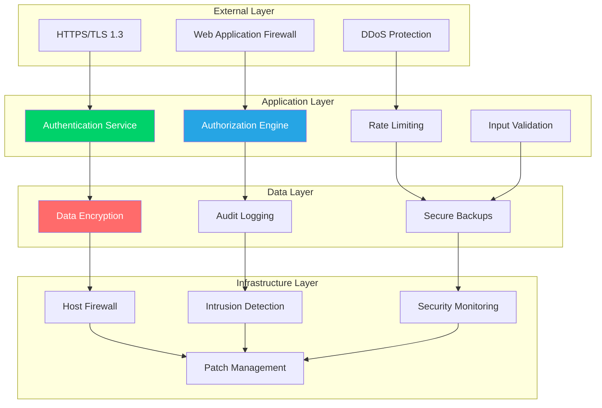

# Security Center

**Comprehensive security architecture and procedures for CCTelegram MCP Server**

[](README.md) [](README.md) [](README.md)

---

## 🛡️ Security Overview

CCTelegram MCP Server implements a comprehensive security framework designed to protect against modern threats while maintaining operational efficiency and user experience.

### Security Architecture



---

## 🔐 Authentication & Authorization

### Multi-Factor Authentication

CCTelegram implements enterprise-grade authentication with multiple verification layers:

- **Primary Authentication**: Token-based authentication with JWT
- **Secondary Verification**: Time-based OTP (TOTP) support
- **Device Authentication**: Device fingerprinting and registration
- **Session Management**: Secure session handling with automatic expiration

### Authorization Framework

```yaml
Permission Model:
  - Role-Based Access Control (RBAC)
  - Attribute-Based Access Control (ABAC)  
  - Principle of Least Privilege
  - Dynamic Permission Evaluation
  
Role Hierarchy:
  admin:
    - Full system access
    - User management
    - Configuration changes
    - Security administration
    
  operator:
    - System monitoring
    - Event management
    - Basic configuration
    - Operational tasks
    
  user:
    - Event notifications
    - Personal configuration
    - Read-only access
    - Limited interactions

  service:
    - API access
    - Automated operations
    - System integrations
    - Resource-limited scope
```

### Security Tokens

- **JWT Implementation**: RS256 algorithm with 15-minute expiration
- **Refresh Tokens**: 7-day validity with secure rotation
- **API Keys**: Scoped permissions with rate limiting
- **Service Accounts**: Automated authentication for system integrations

---

## 🔒 Data Protection

### Encryption Standards

#### **Data at Rest**
- **Algorithm**: AES-256-GCM encryption
- **Key Management**: Hardware Security Module (HSM) or cloud KMS
- **Database**: Transparent Data Encryption (TDE) enabled
- **Backups**: End-to-end encrypted with separate key management
- **Configuration**: Encrypted configuration files with secure key storage

#### **Data in Transit**
- **Protocol**: TLS 1.3 minimum for all communications
- **Cipher Suites**: AEAD ciphers only (AES-GCM, ChaCha20-Poly1305)
- **Certificate Management**: Automated certificate renewal and rotation
- **Internal Communications**: Mutual TLS (mTLS) between services
- **API Communications**: Certificate pinning and HSTS headers

#### **Key Management**
- **Key Rotation**: Automatic monthly rotation for encryption keys
- **Key Escrow**: Secure key backup and recovery procedures
- **Access Control**: Multi-person authorization for key operations
- **Audit Trail**: Complete logging of all key management operations

### Data Classification

| Classification | Description | Protection Level | Retention |
|----------------|-------------|-----------------|-----------|
| **Public** | Documentation, marketing materials | Standard TLS | 7 years |
| **Internal** | System logs, metrics, operational data | AES-256 + access controls | 3 years |
| **Confidential** | User data, configuration, credentials | AES-256 + RBAC + audit | 1 year |
| **Restricted** | Security keys, authentication tokens | HSM + multi-party access | 90 days |

---

## 🚨 Threat Detection & Response

### Security Monitoring

#### **Real-Time Threat Detection**
```yaml
Detection Categories:
  Network Threats:
    - DDoS attacks
    - Port scanning
    - Unusual traffic patterns
    - Geographic anomalies
    
  Application Threats:
    - SQL injection attempts
    - XSS attacks
    - CSRF attempts
    - Authentication failures
    
  System Threats:
    - Privilege escalation
    - Unusual process activity
    - File system tampering
    - Memory corruption attempts
    
  Behavioral Threats:
    - Unusual access patterns
    - Data exfiltration indicators
    - Account compromise signals
    - Time-based anomalies
```

#### **Security Information and Event Management (SIEM)**
- **Event Correlation**: Machine learning-powered threat correlation
- **Threat Intelligence**: Integration with external threat feeds
- **Incident Response**: Automated response workflows
- **Forensic Capabilities**: Complete audit trail and evidence preservation

### Incident Response Framework

#### **Response Time Objectives**
- **Critical Incidents**: < 15 minutes detection to response
- **High Priority**: < 1 hour investigation and containment
- **Medium Priority**: < 4 hours analysis and remediation
- **Low Priority**: < 24 hours documentation and closure

#### **Response Procedures**
1. **Detection**: Automated monitoring and manual reporting
2. **Analysis**: Threat assessment and impact evaluation
3. **Containment**: Immediate isolation and damage limitation
4. **Eradication**: Threat removal and vulnerability patching
5. **Recovery**: Service restoration and enhanced monitoring
6. **Lessons Learned**: Post-incident review and improvements

---

## 🔍 Security Compliance

### Regulatory Compliance

#### **SOC 2 Type II Compliance**
- **Security**: Logical and physical access controls
- **Availability**: System availability and performance monitoring
- **Processing Integrity**: System processing completeness and accuracy
- **Confidentiality**: Protection of confidential information
- **Privacy**: Collection, use, retention, and disposal of personal information

#### **GDPR Compliance**
- **Data Protection by Design**: Privacy-focused system architecture
- **Right to be Forgotten**: Automated data deletion capabilities
- **Data Portability**: Standardized data export functionality
- **Consent Management**: Granular permission and consent tracking
- **Breach Notification**: Automated breach detection and notification

#### **Industry Standards**
- **ISO 27001**: Information Security Management System
- **NIST Cybersecurity Framework**: Risk-based security approach
- **OWASP Top 10**: Web application security best practices
- **CIS Controls**: Critical security controls implementation

### Security Auditing

#### **Internal Audits**
- **Quarterly Reviews**: Comprehensive security posture assessment
- **Access Reviews**: User permissions and role validation
- **Configuration Audits**: System hardening and compliance verification
- **Vulnerability Assessments**: Regular security scanning and testing

#### **External Audits**
- **Annual Penetration Testing**: Third-party security testing
- **Code Security Reviews**: Static and dynamic analysis
- **Compliance Audits**: Regulatory requirement verification
- **Bug Bounty Program**: Continuous security validation

---

## ⚙️ Security Configuration

### System Hardening

#### **Operating System Security**
```bash
# Security hardening checklist
- Minimal installation (remove unnecessary packages)
- Regular security updates and patches
- Secure boot configuration
- File system permissions and access controls
- Network service hardening
- Audit logging configuration
- Time synchronization (NTP)
- Resource limits and quotas
```

#### **Application Security**
```yaml
Security Headers:
  - Strict-Transport-Security: max-age=31536000; includeSubDomains
  - Content-Security-Policy: default-src 'self'; script-src 'self'
  - X-Frame-Options: DENY
  - X-Content-Type-Options: nosniff
  - Referrer-Policy: strict-origin-when-cross-origin
  - Permissions-Policy: camera=(), microphone=(), geolocation=()

Rate Limiting:
  API Endpoints: 100 requests per minute per IP
  Authentication: 5 failed attempts per 15 minutes
  Registration: 3 attempts per hour per IP
  Password Reset: 5 attempts per day per email
```

#### **Network Security**
- **Firewall Rules**: Default deny with explicit allow rules
- **Network Segmentation**: Isolated security zones
- **VPN Access**: Secure remote access for administrators
- **Certificate Management**: Automated certificate lifecycle management

---

## 📋 Security Procedures

### Authentication & Access Management

#### **User Onboarding**
1. **Identity Verification**: Multi-factor identity confirmation
2. **Role Assignment**: Principle of least privilege application
3. **Security Training**: Mandatory security awareness training
4. **Account Provisioning**: Automated account creation and configuration
5. **Access Validation**: Manager approval and security review

#### **Account Lifecycle Management**
- **Regular Access Reviews**: Quarterly permission audits
- **Automated Deprovisioning**: Immediate access revocation on departure
- **Password Policies**: Strong password requirements and rotation
- **Session Management**: Automatic session timeout and re-authentication

### Security Operations

#### **Vulnerability Management**
```yaml
Vulnerability Response SLA:
  Critical (CVSS 9.0-10.0): 24 hours
  High (CVSS 7.0-8.9): 7 days
  Medium (CVSS 4.0-6.9): 30 days
  Low (CVSS 0.1-3.9): 90 days

Response Process:
  1. Vulnerability identification and assessment
  2. Risk evaluation and priority assignment  
  3. Patch testing and deployment planning
  4. Emergency patching for critical vulnerabilities
  5. Verification and validation of fixes
  6. Documentation and reporting
```

#### **Change Management**
- **Security Review**: All changes require security impact assessment
- **Approval Process**: Multi-level approval for security-related changes
- **Testing Requirements**: Security testing in staging environment
- **Rollback Procedures**: Immediate rollback capability for security issues

---

## 📊 Security Metrics & KPIs

### Security Performance Indicators

#### **Detection Metrics**
- **Mean Time to Detection (MTTD)**: < 15 minutes for critical threats
- **False Positive Rate**: < 5% for security alerts
- **Security Coverage**: 99%+ of assets monitored
- **Threat Intelligence Effectiveness**: 95%+ correlation accuracy

#### **Response Metrics**
- **Mean Time to Response (MTTR)**: < 1 hour for critical incidents
- **Incident Containment Time**: < 30 minutes for active threats
- **Recovery Time Objective (RTO)**: < 4 hours for service restoration
- **Recovery Point Objective (RPO)**: < 15 minutes for data recovery

#### **Compliance Metrics**
- **Audit Finding Resolution**: 100% within SLA timeframes
- **Policy Compliance Rate**: 99%+ compliance with security policies
- **Training Completion Rate**: 100% of staff complete security training
- **Access Review Completion**: 100% quarterly access reviews completed

---

## 🔗 Security Documentation

### Core Security Resources

#### **Policies & Procedures**
- **[Security Procedures](security-procedures.md)** - Comprehensive security procedures
- **[Authentication Guide](auth-guide.md)** - Authentication and authorization procedures  
- **[Incident Response](incident-response.md)** - Security incident response procedures

#### **Technical Documentation**
- **[System Architecture](../architecture/system-overview.md)** - Security architecture overview
- **[API Security](../api/README.md#security)** - API security implementation
- **[Deployment Security](../deployment/README.md#security)** - Secure deployment procedures

#### **Compliance & Auditing**
- **[Audit Logging](../administration/security-guide.md#audit-logging)** - Security audit logging
- **[TLS Configuration](../administration/security-guide.md#tls-setup)** - TLS configuration and management
- **[User Access Control](../administration/security-guide.md#access-control)** - Access control procedures

---

## 🆘 Emergency Procedures

### Security Incident Response

In case of a security incident:

1. **🚨 Immediate Response** - Follow [Incident Response](incident-response.md) procedures
2. **☎️ Contact Security Team** - Use emergency contact information below
3. **🔒 Isolate Systems** - Implement immediate containment measures
4. **📋 Document Everything** - Preserve evidence and maintain incident log

### Emergency Contacts

| Role | Contact | Availability |
|------|---------|--------------|
| **Security Team Lead** | security@cctelegram.dev | 24/7 |
| **Incident Commander** | incident@cctelegram.dev | 24/7 |
| **Technical Response** | devops@cctelegram.dev | 24/7 |
| **Management Escalation** | management@cctelegram.dev | Business Hours |

---

*Security Center Documentation - Version 1.8.5*  
*Last updated: August 2025 | Security Review: October 2025*

## See Also

- **[Operations Center](../operations/README.md)** - Complete operations overview
- **[Monitoring System](../../reference/MONITORING_SYSTEM.md)** - Security monitoring setup
- **[Architecture Overview](../architecture/README.md)** - System architecture security