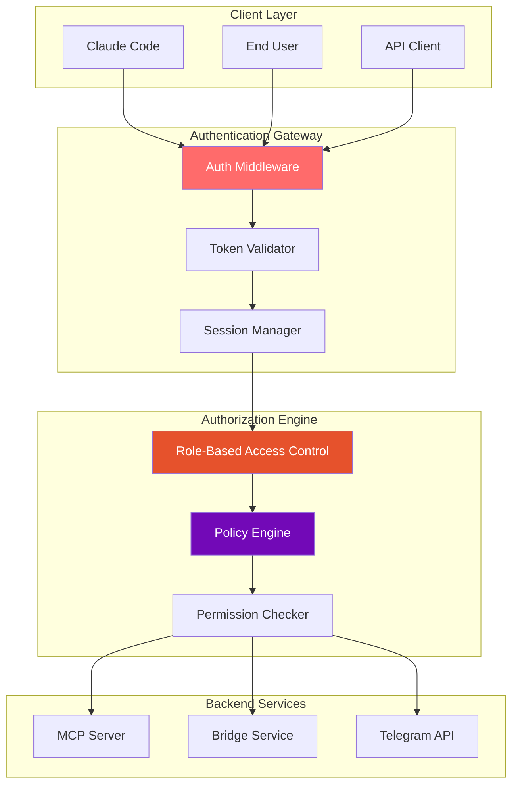

# Authentication & Authorization Guide

**Complete guide to implementing authentication and authorization for CCTelegram MCP Server**

[](README.md) [](README.md) [](README.md)

---

## 🔑 Authentication Overview

CCTelegram MCP Server implements comprehensive authentication and authorization mechanisms to ensure secure access control across all system components.

### Authentication Architecture



---

## 🔐 Authentication Mechanisms

### 1. Token-Based Authentication

#### **API Token Configuration**
```bash
# Generate secure API token
export MCP_AUTH_TOKEN=$(openssl rand -hex 32)

# Enable authentication
export MCP_ENABLE_AUTH=true

# Configure token expiry (3600 seconds = 1 hour)
export MCP_TOKEN_EXPIRY=3600

# Enable token refresh
export MCP_TOKEN_REFRESH_ENABLED=true
```

#### **Token Structure**
```typescript
interface AuthToken {
  id: string                    // Unique token identifier
  token: string                 // Actual token value (64 chars hex)
  userId: string                // Associated user ID
  role: UserRole                // User role
  permissions: Permission[]     // Specific permissions
  issuedAt: number             // Timestamp (Unix)
  expiresAt: number            // Expiry timestamp (Unix)
  refreshToken?: string        // Refresh token (if enabled)
  metadata: TokenMetadata      // Additional metadata
}

interface TokenMetadata {
  userAgent: string
  ipAddress: string
  clientType: 'claude-code' | 'api-client' | 'web-ui'
  lastUsed: number
  useCount: number
}
```

#### **Token Validation Implementation**
```typescript
class TokenValidator {
  private activeTokens: Map<string, AuthToken> = new Map();
  private blacklistedTokens: Set<string> = new Set();
  
  async validateToken(tokenString: string): Promise<ValidationResult> {
    // 1. Format validation
    if (!this.isValidTokenFormat(tokenString)) {
      return { valid: false, error: 'Invalid token format' };
    }
    
    // 2. Blacklist check
    if (this.blacklistedTokens.has(tokenString)) {
      return { valid: false, error: 'Token revoked' };
    }
    
    // 3. Existence check
    const token = this.activeTokens.get(tokenString);
    if (!token) {
      return { valid: false, error: 'Token not found' };
    }
    
    // 4. Expiry check
    if (Date.now() > token.expiresAt) {
      this.activeTokens.delete(tokenString);
      return { valid: false, error: 'Token expired' };
    }
    
    // 5. Update last used
    token.metadata.lastUsed = Date.now();
    token.metadata.useCount++;
    
    return { 
      valid: true, 
      token, 
      user: await this.getUserDetails(token.userId) 
    };
  }
  
  private isValidTokenFormat(token: string): boolean {
    // Token should be 64-character hexadecimal string
    return /^[a-f0-9]{64}$/i.test(token);
  }
}
```

### 2. Multi-Factor Authentication (MFA)

#### **Telegram-Based MFA**
```typescript
class TelegramMFA {
  private pendingVerifications: Map<string, MFAChallenge> = new Map();
  
  async initiateVerification(userId: string, telegramChatId: string): Promise<string> {
    // Generate 6-digit verification code
    const verificationCode = this.generateVerificationCode();
    
    // Create MFA challenge
    const challenge: MFAChallenge = {
      id: crypto.randomUUID(),
      userId,
      telegramChatId,
      code: verificationCode,
      attempts: 0,
      maxAttempts: 3,
      expiresAt: Date.now() + (5 * 60 * 1000), // 5 minutes
      createdAt: Date.now()
    };
    
    this.pendingVerifications.set(challenge.id, challenge);
    
    // Send verification code via Telegram
    await this.sendVerificationCode(telegramChatId, verificationCode);
    
    return challenge.id;
  }
  
  async verifyCode(challengeId: string, providedCode: string): Promise<MFAResult> {
    const challenge = this.pendingVerifications.get(challengeId);
    
    if (!challenge) {
      return { success: false, error: 'Invalid challenge ID' };
    }
    
    if (Date.now() > challenge.expiresAt) {
      this.pendingVerifications.delete(challengeId);
      return { success: false, error: 'Verification code expired' };
    }
    
    challenge.attempts++;
    
    if (challenge.attempts > challenge.maxAttempts) {
      this.pendingVerifications.delete(challengeId);
      await this.logSecurityEvent('MFA_MAX_ATTEMPTS_EXCEEDED', challenge.userId);
      return { success: false, error: 'Maximum attempts exceeded' };
    }
    
    if (providedCode !== challenge.code) {
      return { success: false, error: 'Invalid verification code' };
    }
    
    // Success - cleanup challenge
    this.pendingVerifications.delete(challengeId);
    await this.logSecurityEvent('MFA_VERIFICATION_SUCCESS', challenge.userId);
    
    return { success: true, userId: challenge.userId };
  }
}
```

### 3. Session Management

#### **Session Configuration**
```typescript
interface SessionConfig {
  maxSessions: number          // Max concurrent sessions per user
  sessionTimeout: number       // Session timeout in seconds
  extendOnActivity: boolean    // Extend session on activity
  secureOnly: boolean         // HTTPS only cookies
  sameSite: 'strict' | 'lax'  // SameSite cookie policy
  renewThreshold: number      // Auto-renew when < N seconds left
}

const defaultSessionConfig: SessionConfig = {
  maxSessions: 5,
  sessionTimeout: 3600,       // 1 hour
  extendOnActivity: true,
  secureOnly: true,
  sameSite: 'strict',
  renewThreshold: 300        // 5 minutes
};
```

#### **Session Implementation**
```typescript
class SessionManager {
  private sessions: Map<string, UserSession> = new Map();
  private userSessions: Map<string, Set<string>> = new Map();
  
  async createSession(userId: string, metadata: SessionMetadata): Promise<string> {
    // Check max sessions limit
    const userSessionIds = this.userSessions.get(userId) || new Set();
    if (userSessionIds.size >= this.config.maxSessions) {
      // Remove oldest session
      const oldestSessionId = Array.from(userSessionIds)[0];
      await this.destroySession(oldestSessionId);
    }
    
    // Create new session
    const sessionId = crypto.randomUUID();
    const session: UserSession = {
      id: sessionId,
      userId,
      createdAt: Date.now(),
      lastActivity: Date.now(),
      expiresAt: Date.now() + (this.config.sessionTimeout * 1000),
      metadata,
      permissions: await this.getUserPermissions(userId)
    };
    
    this.sessions.set(sessionId, session);
    
    // Track user sessions
    if (!this.userSessions.has(userId)) {
      this.userSessions.set(userId, new Set());
    }
    this.userSessions.get(userId)!.add(sessionId);
    
    return sessionId;
  }
  
  async validateSession(sessionId: string): Promise<SessionValidationResult> {
    const session = this.sessions.get(sessionId);
    
    if (!session) {
      return { valid: false, error: 'Session not found' };
    }
    
    if (Date.now() > session.expiresAt) {
      await this.destroySession(sessionId);
      return { valid: false, error: 'Session expired' };
    }
    
    // Update activity if enabled
    if (this.config.extendOnActivity) {
      session.lastActivity = Date.now();
      
      // Auto-renew if close to expiry
      const timeUntilExpiry = session.expiresAt - Date.now();
      if (timeUntilExpiry < (this.config.renewThreshold * 1000)) {
        session.expiresAt = Date.now() + (this.config.sessionTimeout * 1000);
      }
    }
    
    return { 
      valid: true, 
      session,
      user: await this.getUserDetails(session.userId)
    };
  }
}
```

---

## 👥 Authorization System

### Role-Based Access Control (RBAC)

#### **User Roles**
```typescript
enum UserRole {
  SUPER_ADMIN = 'super_admin',    // Full system access
  ADMIN = 'admin',                // Administrative access
  DEVELOPER = 'developer',        // Development tools access
  OPERATOR = 'operator',          // Operations access
  USER = 'user',                  // Basic user access
  GUEST = 'guest'                 // Limited read-only access
}

interface RoleDefinition {
  name: UserRole
  description: string
  permissions: Permission[]
  inherits?: UserRole[]          // Role inheritance
  restrictions?: Restriction[]   // Role-specific restrictions
}
```

#### **Permission System**
```typescript
enum Permission {
  // Event management
  SEND_EVENTS = 'send_events',
  VIEW_EVENTS = 'view_events',
  DELETE_EVENTS = 'delete_events',
  
  // Bridge management
  START_BRIDGE = 'start_bridge',
  STOP_BRIDGE = 'stop_bridge',
  RESTART_BRIDGE = 'restart_bridge',
  CONFIGURE_BRIDGE = 'configure_bridge',
  
  // System administration
  VIEW_SYSTEM_STATUS = 'view_system_status',
  MODIFY_CONFIGURATION = 'modify_configuration',
  VIEW_LOGS = 'view_logs',
  MANAGE_USERS = 'manage_users',
  
  // Monitoring & diagnostics
  VIEW_METRICS = 'view_metrics',
  EXPORT_METRICS = 'export_metrics',
  VIEW_HEALTH = 'view_health',
  RUN_DIAGNOSTICS = 'run_diagnostics',
  
  // Security operations
  VIEW_AUDIT_LOGS = 'view_audit_logs',
  MANAGE_SECURITY = 'manage_security',
  REVOKE_TOKENS = 'revoke_tokens',
  EMERGENCY_OVERRIDE = 'emergency_override'
}

const rolePermissions: Record<UserRole, Permission[]> = {
  [UserRole.SUPER_ADMIN]: [
    Permission.SEND_EVENTS,
    Permission.VIEW_EVENTS,
    Permission.DELETE_EVENTS,
    Permission.START_BRIDGE,
    Permission.STOP_BRIDGE,
    Permission.RESTART_BRIDGE,
    Permission.CONFIGURE_BRIDGE,
    Permission.VIEW_SYSTEM_STATUS,
    Permission.MODIFY_CONFIGURATION,
    Permission.VIEW_LOGS,
    Permission.MANAGE_USERS,
    Permission.VIEW_METRICS,
    Permission.EXPORT_METRICS,
    Permission.VIEW_HEALTH,
    Permission.RUN_DIAGNOSTICS,
    Permission.VIEW_AUDIT_LOGS,
    Permission.MANAGE_SECURITY,
    Permission.REVOKE_TOKENS,
    Permission.EMERGENCY_OVERRIDE
  ],
  
  [UserRole.ADMIN]: [
    Permission.SEND_EVENTS,
    Permission.VIEW_EVENTS,
    Permission.DELETE_EVENTS,
    Permission.START_BRIDGE,
    Permission.STOP_BRIDGE,
    Permission.RESTART_BRIDGE,
    Permission.CONFIGURE_BRIDGE,
    Permission.VIEW_SYSTEM_STATUS,
    Permission.VIEW_LOGS,
    Permission.VIEW_METRICS,
    Permission.VIEW_HEALTH,
    Permission.RUN_DIAGNOSTICS,
    Permission.VIEW_AUDIT_LOGS
  ],
  
  [UserRole.DEVELOPER]: [
    Permission.SEND_EVENTS,
    Permission.VIEW_EVENTS,
    Permission.VIEW_SYSTEM_STATUS,
    Permission.VIEW_LOGS,
    Permission.VIEW_METRICS,
    Permission.VIEW_HEALTH,
    Permission.RUN_DIAGNOSTICS
  ],
  
  [UserRole.OPERATOR]: [
    Permission.VIEW_EVENTS,
    Permission.START_BRIDGE,
    Permission.STOP_BRIDGE,
    Permission.RESTART_BRIDGE,
    Permission.VIEW_SYSTEM_STATUS,
    Permission.VIEW_LOGS,
    Permission.VIEW_METRICS,
    Permission.VIEW_HEALTH
  ],
  
  [UserRole.USER]: [
    Permission.SEND_EVENTS,
    Permission.VIEW_EVENTS,
    Permission.VIEW_SYSTEM_STATUS,
    Permission.VIEW_HEALTH
  ],
  
  [UserRole.GUEST]: [
    Permission.VIEW_SYSTEM_STATUS,
    Permission.VIEW_HEALTH
  ]
};
```

### Authorization Engine

#### **Policy-Based Authorization**
```typescript
interface AuthorizationPolicy {
  id: string
  name: string
  description: string
  effect: 'ALLOW' | 'DENY'
  principals: string[]          // User IDs, roles, or groups
  actions: Permission[]         // Required permissions
  resources: string[]          // Resource patterns
  conditions?: PolicyCondition[] // Additional conditions
}

interface PolicyCondition {
  type: 'TIME_RANGE' | 'IP_RANGE' | 'RATE_LIMIT' | 'MFA_REQUIRED'
  parameters: Record<string, any>
}

class AuthorizationEngine {
  private policies: AuthorizationPolicy[] = [];
  
  async authorize(request: AuthorizationRequest): Promise<AuthorizationResult> {
    // 1. Collect applicable policies
    const applicablePolicies = this.findApplicablePolicies(request);
    
    // 2. Evaluate policies (DENY takes precedence)
    let hasExplicitAllow = false;
    
    for (const policy of applicablePolicies) {
      const evaluation = await this.evaluatePolicy(policy, request);
      
      if (evaluation.result && policy.effect === 'DENY') {
        return {
          authorized: false,
          reason: `Denied by policy: ${policy.name}`,
          policy: policy.id
        };
      }
      
      if (evaluation.result && policy.effect === 'ALLOW') {
        hasExplicitAllow = true;
      }
    }
    
    // 3. Default behavior (role-based if no explicit policies)
    if (applicablePolicies.length === 0) {
      return this.evaluateRoleBasedPermissions(request);
    }
    
    return {
      authorized: hasExplicitAllow,
      reason: hasExplicitAllow ? 'Allowed by policy' : 'No matching allow policy'
    };
  }
  
  private async evaluatePolicy(
    policy: AuthorizationPolicy, 
    request: AuthorizationRequest
  ): Promise<PolicyEvaluation> {
    // Check principals (users, roles, groups)
    if (!this.matchesPrincipals(policy.principals, request.principal)) {
      return { result: false, reason: 'Principal not matched' };
    }
    
    // Check actions (permissions)
    if (!this.matchesActions(policy.actions, request.action)) {
      return { result: false, reason: 'Action not matched' };
    }
    
    // Check resources
    if (!this.matchesResources(policy.resources, request.resource)) {
      return { result: false, reason: 'Resource not matched' };
    }
    
    // Evaluate conditions
    if (policy.conditions) {
      for (const condition of policy.conditions) {
        const conditionResult = await this.evaluateCondition(condition, request);
        if (!conditionResult) {
          return { result: false, reason: `Condition failed: ${condition.type}` };
        }
      }
    }
    
    return { result: true, reason: 'Policy matched' };
  }
}
```

---

## 🔒 Security Features

### Rate Limiting by User

#### **User-Based Rate Limits**
```typescript
interface UserRateLimit {
  userId: string
  role: UserRole
  limits: {
    requestsPerMinute: number
    requestsPerHour: number
    requestsPerDay: number
  }
  currentUsage: {
    minute: { count: number; resetTime: number }
    hour: { count: number; resetTime: number }
    day: { count: number; resetTime: number }
  }
}

const roleBasedLimits: Record<UserRole, UserRateLimit['limits']> = {
  [UserRole.SUPER_ADMIN]: {
    requestsPerMinute: 1000,
    requestsPerHour: 10000,
    requestsPerDay: 100000
  },
  [UserRole.ADMIN]: {
    requestsPerMinute: 500,
    requestsPerHour: 5000,
    requestsPerDay: 50000
  },
  [UserRole.DEVELOPER]: {
    requestsPerMinute: 200,
    requestsPerHour: 2000,
    requestsPerDay: 20000
  },
  [UserRole.OPERATOR]: {
    requestsPerMinute: 100,
    requestsPerHour: 1000,
    requestsPerDay: 10000
  },
  [UserRole.USER]: {
    requestsPerMinute: 50,
    requestsPerHour: 500,
    requestsPerDay: 5000
  },
  [UserRole.GUEST]: {
    requestsPerMinute: 10,
    requestsPerHour: 100,
    requestsPerDay: 1000
  }
};
```

### Audit Logging

#### **Authentication Events**
```typescript
enum AuthEvent {
  LOGIN_SUCCESS = 'login_success',
  LOGIN_FAILURE = 'login_failure',
  TOKEN_CREATED = 'token_created',
  TOKEN_REFRESHED = 'token_refreshed',
  TOKEN_REVOKED = 'token_revoked',
  SESSION_CREATED = 'session_created',
  SESSION_EXPIRED = 'session_expired',
  MFA_INITIATED = 'mfa_initiated',
  MFA_SUCCESS = 'mfa_success',
  MFA_FAILURE = 'mfa_failure',
  PERMISSION_DENIED = 'permission_denied',
  POLICY_VIOLATION = 'policy_violation',
  ROLE_CHANGED = 'role_changed',
  PASSWORD_CHANGED = 'password_changed'
}

interface AuthAuditEvent {
  id: string
  eventType: AuthEvent
  timestamp: string
  userId?: string
  sessionId?: string
  ipAddress: string
  userAgent: string
  success: boolean
  details: Record<string, any>
  risk_score: number           // 0-100 risk assessment
}

class AuthAuditor {
  async logAuthEvent(event: AuthAuditEvent): Promise<void> {
    // Enrich event with additional context
    const enrichedEvent = await this.enrichEvent(event);
    
    // Store in audit log
    await this.storeAuditEvent(enrichedEvent);
    
    // Trigger alerts for high-risk events
    if (enrichedEvent.risk_score > 70) {
      await this.triggerSecurityAlert(enrichedEvent);
    }
    
    // Update user risk profile
    if (event.userId) {
      await this.updateUserRiskProfile(event.userId, enrichedEvent);
    }
  }
}
```

---

## ⚙️ Configuration & Setup

### Environment Configuration

```bash
#!/bin/bash
# auth-setup.sh - Authentication setup script

# Enable authentication
export MCP_ENABLE_AUTH=true

# Token configuration
export MCP_AUTH_TOKEN=$(openssl rand -hex 32)
export MCP_TOKEN_EXPIRY=3600
export MCP_TOKEN_REFRESH_ENABLED=true

# Session configuration
export MCP_SESSION_TIMEOUT=3600
export MCP_MAX_SESSIONS_PER_USER=5
export MCP_SESSION_EXTEND_ON_ACTIVITY=true

# MFA configuration
export MCP_MFA_ENABLED=true
export MCP_MFA_PROVIDER="telegram"
export MCP_MFA_CODE_LENGTH=6
export MCP_MFA_CODE_EXPIRY=300

# RBAC configuration
export MCP_DEFAULT_ROLE="user"
export MCP_ROLE_INHERITANCE_ENABLED=true

# Security settings
export MCP_AUDIT_AUTH_EVENTS=true
export MCP_RATE_LIMIT_BY_USER=true
export MCP_ENFORCE_HTTPS=true

# Telegram integration
export TELEGRAM_BOT_TOKEN="your-bot-token"
export TELEGRAM_CHAT_ID="your-chat-id"

echo "✅ Authentication configuration completed"
```

### User Management

#### **User Registration & Management**
```bash
# Create admin user
npm run auth:create-user \
  --id="admin-001" \
  --role="admin" \
  --telegram-id="123456789" \
  --email="admin@example.com"

# List all users
npm run auth:list-users

# Update user role
npm run auth:update-role --user-id="user-001" --role="developer"

# Revoke user access
npm run auth:revoke-access --user-id="user-002"

# Generate API token for user
npm run auth:generate-token --user-id="user-001" --expires="24h"
```

### Testing Authentication

#### **Authentication Test Suite**
```bash
#!/bin/bash
# test-authentication.sh

echo "🔐 Testing Authentication System"

# 1. Test token validation
echo "1. Testing token validation..."
TOKEN=$(npm run auth:generate-test-token --role="user")
curl -H "Authorization: Bearer $TOKEN" http://localhost:8080/api/status

# 2. Test invalid token
echo "2. Testing invalid token..."
curl -H "Authorization: Bearer invalid-token" http://localhost:8080/api/status

# 3. Test expired token
echo "3. Testing expired token..."
EXPIRED_TOKEN=$(npm run auth:generate-test-token --expired)
curl -H "Authorization: Bearer $EXPIRED_TOKEN" http://localhost:8080/api/status

# 4. Test role-based access
echo "4. Testing role-based access..."
USER_TOKEN=$(npm run auth:generate-test-token --role="user")
ADMIN_TOKEN=$(npm run auth:generate-test-token --role="admin")

# User should NOT be able to manage bridge
curl -H "Authorization: Bearer $USER_TOKEN" -X POST http://localhost:8080/api/bridge/restart

# Admin should be able to manage bridge
curl -H "Authorization: Bearer $ADMIN_TOKEN" -X POST http://localhost:8080/api/bridge/restart

# 5. Test rate limiting
echo "5. Testing rate limiting..."
for i in {1..60}; do
  curl -H "Authorization: Bearer $USER_TOKEN" http://localhost:8080/api/status
done

echo "✅ Authentication tests completed"
```

---

## 🚨 Security Best Practices

### Implementation Checklist

- [ ] **Strong token generation using cryptographically secure random numbers**
- [ ] **Token expiry and refresh mechanism implemented**
- [ ] **Session management with proper cleanup**
- [ ] **Multi-factor authentication for administrative access**
- [ ] **Role-based access control with principle of least privilege**
- [ ] **Comprehensive audit logging of authentication events**
- [ ] **Rate limiting per user and IP address**
- [ ] **Secure token storage (never in plain text logs)**
- [ ] **HTTPS enforcement for all authentication endpoints**
- [ ] **Input validation and sanitization**
- [ ] **Protection against common attacks (CSRF, XSS, injection)**
- [ ] **Regular security reviews and penetration testing**

### Security Monitoring

#### **Real-time Security Dashboard**
```typescript
interface AuthSecurityMetrics {
  // Authentication metrics
  totalLoginAttempts: Counter
  successfulLogins: Counter
  failedLogins: Counter
  tokenGenerations: Counter
  tokenRevocations: Counter
  
  // Session metrics
  activeSessions: Gauge
  sessionDuration: Histogram
  sessionExpiries: Counter
  
  // MFA metrics
  mfaInitiations: Counter
  mfaSuccesses: Counter
  mfaFailures: Counter
  
  // Authorization metrics
  permissionDenials: Counter
  policyViolations: Counter
  roleEscalations: Counter
  
  // Security events
  bruteForceAttempts: Counter
  suspiciousActivities: Counter
  securityAlerts: Counter
}
```

---

## 🔗 Integration Points

### Claude Code Integration

#### **MCP Authentication Headers**
```typescript
// MCP client authentication
const mcpClient = new MCPClient({
  host: 'localhost',
  port: 8080,
  authentication: {
    type: 'bearer',
    token: process.env.MCP_AUTH_TOKEN
  },
  tls: {
    enabled: true,
    rejectUnauthorized: true
  }
});
```

### Telegram Integration

#### **User Identity Verification**
```typescript
class TelegramAuthIntegration {
  async verifyTelegramUser(telegramData: TelegramAuthData): Promise<UserVerification> {
    // Verify Telegram auth data signature
    const isValid = this.verifyTelegramSignature(telegramData);
    if (!isValid) {
      return { verified: false, error: 'Invalid Telegram signature' };
    }
    
    // Link Telegram user to system user
    const systemUser = await this.findOrCreateUser(telegramData);
    
    return {
      verified: true,
      user: systemUser,
      telegramUser: telegramData
    };
  }
}
```

---

## 🔗 Related Documentation

### Security Resources
- **[Security Procedures](security-procedures.md)** - Complete security implementation guide
- **[Security Center](README.md)** - Security overview and architecture
- **[Incident Response](incident-response.md)** - Security incident handling procedures

### Integration Resources
- **[MCP Server Configuration](../deployment/environment-config.md)** - Authentication environment setup
- **[API Documentation](../api/README.md)** - Authenticated API usage
- **[Operations Guide](../operations/README.md)** - User management procedures

---

*Authentication & Authorization Guide - Version 1.8.5*  
*Last updated: August 2025 | Security Review: October 2025*

## See Also

- **[Security Audit Report](../../reference/SECURITY_AUDIT_REPORT.md)** - Security assessment results
- **[Configuration Reference](../../reference/configuration.md)** - Authentication configuration options
- **[Operations Security](../operations/runbooks/README.md#security-incident-response)** - Operational security procedures