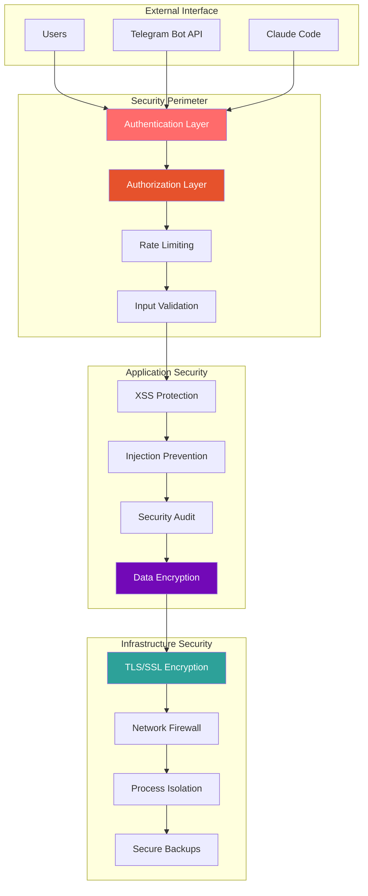

# Security Procedures

**Comprehensive security procedures and protocols for CCTelegram MCP Server deployment and operations**

[](README.md) [](README.md) [](README.md)

---

## 🛡️ Security Overview

The CCTelegram MCP Server implements defense-in-depth security principles with comprehensive protection mechanisms across all system layers.

### Security Architecture



---

## 🔐 Immediate Requirements

### Critical Security Setup

#### 1. Authentication Configuration
```bash
# Required: Set strong authentication token
export MCP_AUTH_TOKEN=$(openssl rand -hex 32)

# Enable authentication
export MCP_ENABLE_AUTH=true

# Configure allowed origins
export MCP_ALLOWED_ORIGINS="https://claude.ai"
```

#### 2. Telegram Security Setup
```bash
# Secure bot token storage
export TELEGRAM_BOT_TOKEN="your-bot-token-here"  # Store in secure vault

# Restrict chat access
export TELEGRAM_CHAT_ID="your-chat-id-here"     # Specific chat only

# Enable user allowlist
export MCP_ALLOWED_USERS="123456789,987654321"  # Telegram user IDs
```

#### 3. Network Security
```bash
# Enable TLS (production)
export MCP_TLS_ENABLED=true
export MCP_TLS_CERT_PATH="/etc/ssl/certs/cctelegram.crt"
export MCP_TLS_KEY_PATH="/etc/ssl/private/cctelegram.key"

# Bind to specific interface
export MCP_HOST="127.0.0.1"  # Local only, or specific IP
```

---

## 🔑 Authentication & Authorization

### Authentication Mechanisms

#### API Token Authentication
```typescript
interface AuthenticationConfig {
  enableAuth: boolean           // Enable/disable authentication
  authToken: string            // Secure API token (32+ characters)
  tokenExpiry: number          // Token expiry time (seconds)
  allowedOrigins: string[]     // CORS allowed origins
  requireHttps: boolean        // Force HTTPS in production
}

// Implementation example
const authConfig: AuthenticationConfig = {
  enableAuth: true,
  authToken: process.env.MCP_AUTH_TOKEN,
  tokenExpiry: 3600,
  allowedOrigins: ['https://claude.ai'],
  requireHttps: process.env.NODE_ENV === 'production'
};
```

#### User Authorization Matrix
| User Role | Permissions | Access Level | Rate Limit |
|-----------|------------|--------------|------------|
| **Admin** | All operations | Full system | 1000 req/hr |
| **Developer** | Development tools | Limited | 500 req/hr |
| **Operator** | Status & monitoring | Read-only | 200 req/hr |
| **Guest** | Basic operations | Restricted | 50 req/hr |

### Authorization Implementation

```typescript
// User role-based access control
enum UserRole {
  ADMIN = 'admin',
  DEVELOPER = 'developer',
  OPERATOR = 'operator',
  GUEST = 'guest'
}

interface UserPermissions {
  canSendEvents: boolean
  canManageBridge: boolean
  canViewStatus: boolean
  canViewMetrics: boolean
  canModifyConfig: boolean
}

class AuthorizationService {
  private getUserPermissions(role: UserRole): UserPermissions {
    const permissions: Record<UserRole, UserPermissions> = {
      [UserRole.ADMIN]: {
        canSendEvents: true,
        canManageBridge: true,
        canViewStatus: true,
        canViewMetrics: true,
        canModifyConfig: true
      },
      [UserRole.DEVELOPER]: {
        canSendEvents: true,
        canManageBridge: false,
        canViewStatus: true,
        canViewMetrics: true,
        canModifyConfig: false
      },
      [UserRole.OPERATOR]: {
        canSendEvents: false,
        canManageBridge: false,
        canViewStatus: true,
        canViewMetrics: true,
        canModifyConfig: false
      },
      [UserRole.GUEST]: {
        canSendEvents: false,
        canManageBridge: false,
        canViewStatus: true,
        canViewMetrics: false,
        canModifyConfig: false
      }
    };
    
    return permissions[role];
  }
}
```

---

## 🛡️ Input Validation & Sanitization

### Multi-Layer Validation System

#### Schema Validation (Layer 1)
```typescript
import Ajv from 'ajv';
import addFormats from 'ajv-formats';

class SchemaValidator {
  private ajv: Ajv;
  
  constructor() {
    this.ajv = new Ajv({ allErrors: true });
    addFormats(this.ajv);
  }
  
  validateEvent(event: any): ValidationResult {
    const schema = {
      type: 'object',
      required: ['type', 'title', 'description'],
      properties: {
        type: { type: 'string', enum: EVENT_TYPES },
        title: { type: 'string', minLength: 1, maxLength: 200 },
        description: { type: 'string', minLength: 1, maxLength: 1000 },
        source: { type: 'string', maxLength: 100 },
        task_id: { type: 'string', format: 'uuid' },
        data: { type: 'object' }
      },
      additionalProperties: false
    };
    
    const validate = this.ajv.compile(schema);
    const valid = validate(event);
    
    return {
      valid,
      errors: validate.errors || []
    };
  }
}
```

#### XSS Protection (Layer 2)
```typescript
import DOMPurify from 'dompurify';
import { JSDOM } from 'jsdom';

class XSSProtection {
  private purify: DOMPurify.DOMPurifyI;
  
  constructor() {
    const window = new JSDOM('').window;
    this.purify = DOMPurify(window);
    
    // Configure DOMPurify
    this.purify.addHook('beforeSanitizeElements', (node) => {
      // Custom sanitization hooks
      if (node.nodeName === 'SCRIPT') {
        node.remove();
      }
    });
  }
  
  sanitizeInput(input: string): SanitizationResult {
    const sanitized = this.purify.sanitize(input, {
      ALLOWED_TAGS: [],      // No HTML tags allowed
      ALLOWED_ATTR: [],      // No attributes allowed
      KEEP_CONTENT: true     // Keep text content
    });
    
    return {
      original: input,
      sanitized,
      modified: input !== sanitized,
      threats: this.detectThreats(input)
    };
  }
  
  private detectThreats(input: string): string[] {
    const threats: string[] = [];
    
    // Detect potential XSS patterns
    const xssPatterns = [
      /<script/i,
      /javascript:/i,
      /on\w+\s*=/i,
      /<iframe/i,
      /eval\s*\(/i
    ];
    
    for (const pattern of xssPatterns) {
      if (pattern.test(input)) {
        threats.push(`XSS pattern detected: ${pattern.source}`);
      }
    }
    
    return threats;
  }
}
```

#### Injection Prevention (Layer 3)
```typescript
class InjectionProtection {
  validateAndSanitize(input: any): ValidationResult {
    const threats: string[] = [];
    
    // SQL Injection protection
    if (typeof input === 'string') {
      const sqlPatterns = [
        /(\bUNION\b|\bSELECT\b|\bINSERT\b|\bDROP\b|\bDELETE\b)/i,
        /('|(\\')|(;)|(\-\-)|(\#)/g,
        /(\bOR\b|\bAND\b)\s+\d+\s*=\s*\d+/i
      ];
      
      for (const pattern of sqlPatterns) {
        if (pattern.test(input)) {
          threats.push('SQL injection pattern detected');
          break;
        }
      }
    }
    
    // Command injection protection
    if (typeof input === 'string') {
      const commandPatterns = [
        /(\||&&|;|\$\(|\`)/g,
        /(rm\s+|cat\s+|ls\s+|pwd|whoami)/i,
        /\.\.\//g
      ];
      
      for (const pattern of commandPatterns) {
        if (pattern.test(input)) {
          threats.push('Command injection pattern detected');
          break;
        }
      }
    }
    
    return {
      valid: threats.length === 0,
      errors: threats,
      sanitized: this.sanitizeInput(input)
    };
  }
  
  private sanitizeInput(input: any): any {
    if (typeof input === 'string') {
      // Remove dangerous characters
      return input
        .replace(/[<>'"&]/g, '') // HTML/XML dangerous chars
        .replace(/[;|&$`\\]/g, '') // Shell dangerous chars
        .trim();
    }
    
    return input;
  }
}
```

### Validation Error Types

```typescript
enum ValidationErrorType {
  SCHEMA_VIOLATION = 'schema_violation',
  MISSING_REQUIRED_FIELD = 'missing_required_field',
  INVALID_FIELD_TYPE = 'invalid_field_type',
  FIELD_LENGTH_EXCEEDED = 'field_length_exceeded',
  INVALID_ENUM_VALUE = 'invalid_enum_value',
  INVALID_UUID_FORMAT = 'invalid_uuid_format',
  INVALID_TIMESTAMP_FORMAT = 'invalid_timestamp_format',
  BUSINESS_RULE_VIOLATION = 'business_rule_violation',
  SECURITY_VIOLATION = 'security_violation',
  RATE_LIMIT_EXCEEDED = 'rate_limit_exceeded',
  DUPLICATE_EVENT = 'duplicate_event',
  INVALID_EVENT_TYPE = 'invalid_event_type',
  CONTENT_TOO_LARGE = 'content_too_large',
  FORBIDDEN_CONTENT = 'forbidden_content'
}
```

---

## ⚡ Rate Limiting & DDoS Protection

### Rate Limiting Strategy

#### Multi-Tier Rate Limiting
```typescript
interface RateLimitConfig {
  windowMs: number          // Time window in milliseconds
  maxRequests: number       // Maximum requests per window
  skipSuccessfulRequests: boolean
  skipFailedRequests: boolean
  keyGenerator: (req: any) => string
  onLimitReached: (req: any) => void
}

class RateLimiter {
  private limits: Map<string, RateLimitConfig> = new Map([
    // Global rate limit
    ['global', {
      windowMs: 60 * 1000,     // 1 minute
      maxRequests: 1000,        // 1000 requests per minute
      skipSuccessfulRequests: false,
      skipFailedRequests: false,
      keyGenerator: (req) => 'global',
      onLimitReached: this.logRateLimitExceeded
    }],
    
    // Per-IP rate limit
    ['ip', {
      windowMs: 60 * 1000,     // 1 minute
      maxRequests: 100,         // 100 requests per minute per IP
      skipSuccessfulRequests: false,
      skipFailedRequests: true,
      keyGenerator: (req) => req.ip,
      onLimitReached: this.logRateLimitExceeded
    }],
    
    // Per-user rate limit
    ['user', {
      windowMs: 60 * 1000,     // 1 minute
      maxRequests: 200,         // 200 requests per minute per user
      skipSuccessfulRequests: false,
      skipFailedRequests: false,
      keyGenerator: (req) => req.userId,
      onLimitReached: this.logRateLimitExceeded
    }],
    
    // Authentication endpoint protection
    ['auth', {
      windowMs: 15 * 60 * 1000, // 15 minutes
      maxRequests: 5,            // 5 attempts per 15 minutes
      skipSuccessfulRequests: true,
      skipFailedRequests: false,
      keyGenerator: (req) => req.ip,
      onLimitReached: this.handleAuthRateLimit
    }]
  ]);
  
  private logRateLimitExceeded(req: any): void {
    console.warn(`Rate limit exceeded for ${req.ip}`, {
      userAgent: req.headers['user-agent'],
      endpoint: req.path,
      timestamp: new Date().toISOString()
    });
  }
  
  private handleAuthRateLimit(req: any): void {
    // More aggressive response for auth rate limiting
    console.error(`Authentication rate limit exceeded for ${req.ip}`, {
      userAgent: req.headers['user-agent'],
      attempts: req.rateLimitAttempts,
      timestamp: new Date().toISOString()
    });
    
    // Optionally trigger IP blocking
    this.triggerSecurityAlert(req);
  }
}
```

### DDoS Protection

#### Request Pattern Analysis
```typescript
class DDoSProtection {
  private suspiciousPatterns: Map<string, SuspiciousActivity> = new Map();
  
  analyzeRequest(req: any): SecurityAssessment {
    const clientId = this.getClientIdentifier(req);
    const activity = this.getOrCreateActivity(clientId);
    
    // Update activity metrics
    activity.requestCount++;
    activity.lastSeen = Date.now();
    
    // Analyze request patterns
    const assessment = this.assessThreatLevel(activity, req);
    
    // Take protective action if needed
    if (assessment.threatLevel === 'HIGH') {
      this.triggerProtection(clientId, assessment);
    }
    
    return assessment;
  }
  
  private assessThreatLevel(activity: SuspiciousActivity, req: any): SecurityAssessment {
    const threats: string[] = [];
    let threatLevel: 'LOW' | 'MEDIUM' | 'HIGH' = 'LOW';
    
    // High request frequency
    if (activity.requestCount > 100 && activity.timeWindow < 60000) {
      threats.push('High request frequency detected');
      threatLevel = 'HIGH';
    }
    
    // Suspicious user agent patterns
    const suspiciousAgents = [
      /bot/i,
      /crawler/i,
      /spider/i,
      /scraper/i
    ];
    
    for (const pattern of suspiciousAgents) {
      if (pattern.test(req.headers['user-agent'] || '')) {
        threats.push('Suspicious user agent detected');
        threatLevel = 'MEDIUM';
        break;
      }
    }
    
    // Multiple endpoints targeted
    if (activity.uniqueEndpoints.size > 10 && activity.timeWindow < 300000) {
      threats.push('Multiple endpoints targeted rapidly');
      threatLevel = 'HIGH';
    }
    
    return {
      threatLevel,
      threats,
      confidence: this.calculateConfidence(threats),
      recommendedAction: this.getRecommendedAction(threatLevel)
    };
  }
}
```

---

## 🔍 Security Monitoring & Audit

### Comprehensive Audit Logging

#### Security Event Types
```typescript
enum SecurityEventType {
  // Authentication events
  AUTHENTICATION_SUCCESS = 'auth_success',
  AUTHENTICATION_FAILURE = 'auth_failure',
  AUTHORIZATION_DENIED = 'authz_denied',
  SESSION_CREATED = 'session_created',
  SESSION_EXPIRED = 'session_expired',
  
  // Input validation events
  VALIDATION_FAILURE = 'validation_failure',
  XSS_ATTEMPT = 'xss_attempt',
  INJECTION_ATTEMPT = 'injection_attempt',
  MALFORMED_REQUEST = 'malformed_request',
  
  // Rate limiting events
  RATE_LIMIT_EXCEEDED = 'rate_limit_exceeded',
  SUSPICIOUS_ACTIVITY = 'suspicious_activity',
  IP_BLOCKED = 'ip_blocked',
  
  // System security events
  CONFIGURATION_CHANGED = 'config_changed',
  SECURITY_SCAN_INITIATED = 'security_scan_started',
  VULNERABILITY_DETECTED = 'vulnerability_detected',
  SECURITY_UPDATE_APPLIED = 'security_update_applied'
}

interface SecurityAuditEvent {
  id: string
  timestamp: string
  eventType: SecurityEventType
  severity: 'LOW' | 'MEDIUM' | 'HIGH' | 'CRITICAL'
  source: string
  userId?: string
  ipAddress: string
  userAgent: string
  details: Record<string, any>
  sanitizedData: any
  stackTrace?: string
}
```

#### Audit Logger Implementation
```typescript
class SecurityAuditor {
  private logger: winston.Logger;
  
  constructor(config: AuditConfig) {
    this.logger = winston.createLogger({
      level: 'info',
      format: winston.format.combine(
        winston.format.timestamp(),
        winston.format.json(),
        winston.format.errors({ stack: true })
      ),
      transports: [
        new winston.transports.File({ 
          filename: 'security-audit.log',
          maxsize: 10485760, // 10MB
          maxFiles: 10,
          tailable: true
        }),
        new winston.transports.Console({
          format: winston.format.simple()
        })
      ]
    });
  }
  
  logSecurityEvent(event: SecurityAuditEvent): void {
    // Sanitize sensitive data before logging
    const sanitizedEvent = this.sanitizeEvent(event);
    
    // Log based on severity
    switch (event.severity) {
      case 'CRITICAL':
        this.logger.error('SECURITY CRITICAL', sanitizedEvent);
        this.triggerImmediateAlert(sanitizedEvent);
        break;
      case 'HIGH':
        this.logger.error('SECURITY HIGH', sanitizedEvent);
        this.triggerAlert(sanitizedEvent);
        break;
      case 'MEDIUM':
        this.logger.warn('SECURITY MEDIUM', sanitizedEvent);
        break;
      case 'LOW':
        this.logger.info('SECURITY LOW', sanitizedEvent);
        break;
    }
    
    // Store in security database for analysis
    this.storeSecurityEvent(sanitizedEvent);
  }
  
  private sanitizeEvent(event: SecurityAuditEvent): SecurityAuditEvent {
    return {
      ...event,
      // Mask sensitive information
      ipAddress: this.maskIP(event.ipAddress),
      userAgent: this.sanitizeUserAgent(event.userAgent),
      details: this.sanitizeDetails(event.details),
      // Remove potentially sensitive stack traces in production
      stackTrace: process.env.NODE_ENV === 'production' ? undefined : event.stackTrace
    };
  }
}
```

### Real-time Security Monitoring

#### Security Metrics Dashboard
```typescript
interface SecurityMetrics {
  // Authentication metrics
  authenticationAttempts: Counter
  authenticationFailures: Counter
  sessionCreations: Counter
  sessionDuration: Histogram
  
  // Input validation metrics
  validationFailures: Counter
  xssAttempts: Counter
  injectionAttempts: Counter
  malformedRequests: Counter
  
  // Rate limiting metrics
  rateLimitExceeded: Counter
  suspiciousActivity: Counter
  blockedIPs: Gauge
  
  // System security metrics
  vulnerabilityScans: Counter
  configurationChanges: Counter
  securityUpdates: Counter
}

class SecurityMonitor {
  private metrics: SecurityMetrics;
  private alertManager: AlertManager;
  
  constructor() {
    this.metrics = this.initializeMetrics();
    this.alertManager = new AlertManager();
  }
  
  recordSecurityEvent(event: SecurityAuditEvent): void {
    // Update relevant metrics
    switch (event.eventType) {
      case SecurityEventType.AUTHENTICATION_FAILURE:
        this.metrics.authenticationFailures.inc();
        break;
      case SecurityEventType.XSS_ATTEMPT:
        this.metrics.xssAttempts.inc();
        break;
      case SecurityEventType.RATE_LIMIT_EXCEEDED:
        this.metrics.rateLimitExceeded.inc();
        break;
      // ... other event types
    }
    
    // Trigger alerts for high-severity events
    if (event.severity === 'CRITICAL' || event.severity === 'HIGH') {
      this.alertManager.triggerSecurityAlert(event);
    }
  }
}
```

---

## 🚨 Incident Response Procedures

### Security Incident Classification

| Severity | Response Time | Escalation | Actions |
|----------|--------------|------------|---------|
| **Critical** | <15 minutes | Immediate | System isolation, executive notification |
| **High** | <1 hour | Security team | Investigation, containment |
| **Medium** | <4 hours | Operations team | Analysis, monitoring |
| **Low** | <24 hours | Standard | Documentation, review |

### Incident Response Workflow

#### Immediate Response (0-15 minutes)
```bash
#!/bin/bash
# security-incident-response.sh

# 1. Identify and isolate affected systems
echo "🚨 Security incident detected - initiating response"

# 2. Preserve evidence
mkdir -p /var/log/security-incident/$(date +%Y%m%d_%H%M%S)
INCIDENT_DIR="/var/log/security-incident/$(date +%Y%m%d_%H%M%S)"

# Capture system state
ps aux > "$INCIDENT_DIR/processes.txt"
netstat -tuln > "$INCIDENT_DIR/network.txt"
df -h > "$INCIDENT_DIR/disk_usage.txt"
free -m > "$INCIDENT_DIR/memory.txt"

# Capture application logs
cp /var/log/cctelegram/*.log "$INCIDENT_DIR/"
cp /var/log/security-audit.log "$INCIDENT_DIR/"

# 3. Notify security team
curl -X POST "$SECURITY_WEBHOOK_URL" \
  -H "Content-Type: application/json" \
  -d "{\"alert\": \"Security incident detected\", \"timestamp\": \"$(date -Iseconds)\"}"

# 4. Begin assessment
echo "Evidence preserved in: $INCIDENT_DIR"
echo "Security team notified"
```

#### Investigation Phase (15-60 minutes)
```typescript
class SecurityIncidentHandler {
  async handleSecurityIncident(incident: SecurityIncident): Promise<void> {
    // 1. Collect forensic data
    const forensicData = await this.collectForensicData(incident);
    
    // 2. Analyze attack vectors
    const attackAnalysis = await this.analyzeAttackVectors(forensicData);
    
    // 3. Assess data exposure
    const exposureAssessment = await this.assessDataExposure(incident);
    
    // 4. Document timeline
    const timeline = await this.createIncidentTimeline(incident);
    
    // 5. Generate incident report
    const report = this.generateIncidentReport({
      incident,
      forensicData,
      attackAnalysis,
      exposureAssessment,
      timeline
    });
    
    // 6. Initiate containment measures
    await this.initiateContainment(incident, attackAnalysis);
  }
  
  private async collectForensicData(incident: SecurityIncident): Promise<ForensicData> {
    return {
      systemLogs: await this.collectSystemLogs(incident.timeWindow),
      networkTraffic: await this.collectNetworkData(incident.timeWindow),
      fileSystemChanges: await this.detectFileChanges(incident.timeWindow),
      memoryDump: await this.captureMemoryDump(),
      processList: await this.captureProcessList(),
      networkConnections: await this.captureNetworkState()
    };
  }
}
```

---

## 🔒 Data Protection & Privacy

### Data Classification

| Data Type | Classification | Encryption | Retention | Access Control |
|-----------|---------------|------------|-----------|----------------|
| **User Credentials** | Confidential | AES-256 | 90 days | Admin only |
| **API Keys** | Secret | Vault storage | 365 days | Service accounts |
| **Event Data** | Internal | TLS in-transit | 30 days | Authorized users |
| **Audit Logs** | Confidential | AES-256 | 7 years | Security team |
| **System Metrics** | Internal | TLS in-transit | 90 days | Operations team |

### Encryption Implementation

#### Data at Rest Encryption
```typescript
import crypto from 'crypto';

class DataEncryption {
  private algorithm = 'aes-256-gcm';
  private keyLength = 32; // 256 bits
  private ivLength = 16;  // 128 bits
  private tagLength = 16; // 128 bits
  
  encrypt(data: string, key: Buffer): EncryptedData {
    const iv = crypto.randomBytes(this.ivLength);
    const cipher = crypto.createCipher(this.algorithm, key, iv);
    
    let encrypted = cipher.update(data, 'utf8', 'hex');
    encrypted += cipher.final('hex');
    
    const tag = cipher.getAuthTag();
    
    return {
      encrypted,
      iv: iv.toString('hex'),
      tag: tag.toString('hex'),
      algorithm: this.algorithm
    };
  }
  
  decrypt(encryptedData: EncryptedData, key: Buffer): string {
    const decipher = crypto.createDecipher(
      encryptedData.algorithm,
      key,
      Buffer.from(encryptedData.iv, 'hex')
    );
    
    decipher.setAuthTag(Buffer.from(encryptedData.tag, 'hex'));
    
    let decrypted = decipher.update(encryptedData.encrypted, 'hex', 'utf8');
    decrypted += decipher.final('utf8');
    
    return decrypted;
  }
}
```

#### Data in Transit Protection
```typescript
// TLS Configuration
const tlsConfig = {
  key: fs.readFileSync('/etc/ssl/private/cctelegram.key'),
  cert: fs.readFileSync('/etc/ssl/certs/cctelegram.crt'),
  
  // Security settings
  secureProtocol: 'TLSv1_2_method',
  ciphers: [
    'ECDHE-RSA-AES128-GCM-SHA256',
    'ECDHE-RSA-AES256-GCM-SHA384',
    'ECDHE-RSA-AES128-SHA256',
    'ECDHE-RSA-AES256-SHA384'
  ].join(':'),
  
  honorCipherOrder: true,
  rejectUnauthorized: true
};
```

---

## 📋 Security Checklist

### Pre-Deployment Security Checklist

- [ ] **Authentication configured with strong tokens**
- [ ] **Rate limiting enabled and configured**
- [ ] **Input validation enabled with strict rules**
- [ ] **TLS/SSL certificates installed and configured**
- [ ] **User authorization matrix implemented**
- [ ] **Audit logging enabled and configured**
- [ ] **Security monitoring dashboard deployed**
- [ ] **Incident response procedures documented**
- [ ] **Data encryption configured (at rest and in transit)**
- [ ] **Network security (firewall rules, VPN access)**
- [ ] **Security scanning completed with no critical issues**
- [ ] **Backup encryption and integrity verification**

### Runtime Security Monitoring

- [ ] **Monitor authentication failure rates**
- [ ] **Track input validation violations**
- [ ] **Review audit logs daily**
- [ ] **Verify system integrity checksums**
- [ ] **Monitor network connections**
- [ ] **Check for suspicious user activity**
- [ ] **Review security alerts and incidents**
- [ ] **Validate backup integrity**
- [ ] **Update security signatures and rules**
- [ ] **Perform monthly security reviews**

---

## 🔗 Related Documentation

### Security Resources
- **[Security Center](../README.md)** - Complete security overview and architecture
- **[Authentication Guide](auth-guide.md)** - Detailed authentication implementation
- **[Incident Response](incident-response.md)** - Emergency response procedures

### Compliance Resources
- **[Administration Guide](../../administration/security-guide.md)** - Administrative security configuration
- **[Monitoring Setup](../operations/monitoring.md)** - Security monitoring implementation
- **[Configuration Reference](../../reference/configuration.md)** - Security configuration options

---

*Security Procedures Guide - Version 1.8.5*  
*Last updated: August 2025 | Security Review: October 2025*

## See Also

- **[OWASP Compliance Report](../reference/SECURITY_AUDIT_REPORT.md)** - Security audit results
- **[Security Architecture](../../development/security-architecture.md)** - Technical security design
- **[Operations Security](../operations/runbooks/README.md#security-incident-response)** - Operational security procedures