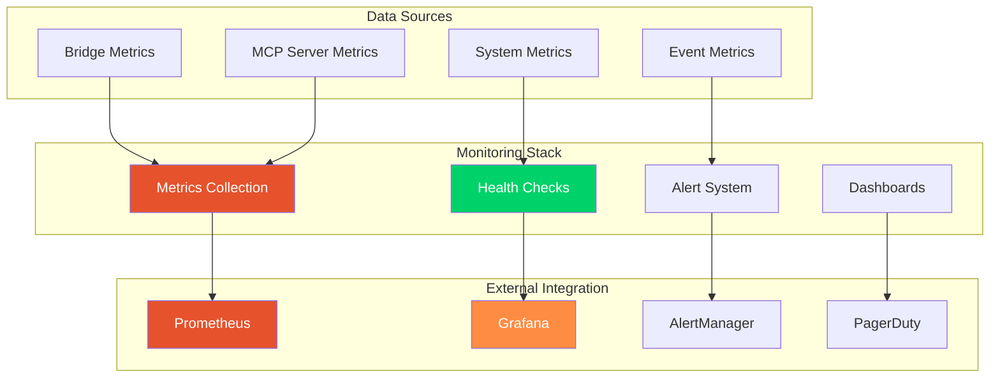

# CCTelegram Monitoring System Reference

**Comprehensive monitoring, observability, and performance tracking system**

[](../administration/monitoring.md) [](FEATURES.md#performance-monitoring) [](../administration/monitoring.md#dashboard-setup)

---

## 🎯 Monitoring Overview

CCTelegram provides comprehensive monitoring capabilities through multiple layers: built-in health checks, performance metrics collection, external monitoring system integration, and visual dashboards for real-time observability.



---

## 📊 Monitoring Components

### 🔍 **Built-in Health Checks**

#### **System Health Monitoring**
```javascript
// MCP Server health check
const healthStatus = await mcp__cctelegram__get_bridge_status()

// Expected response structure
{
  status: "healthy" | "degraded" | "unhealthy",
  uptime: 1234567, // milliseconds
  memory_usage: {
    rss: 45234567,     // bytes
    heap_used: 12345678,
    heap_total: 20000000,
    percentage: 25.6    // % of system memory
  },
  cpu_usage: {
    percentage: 15.2,   // % CPU usage
    load_average: [0.5, 0.3, 0.1]
  },
  bridge_communication: {
    status: "connected",
    last_heartbeat: "2025-08-07T10:30:00Z",
    response_time_ms: 67
  },
  telegram_api: {
    status: "authenticated", 
    last_request: "2025-08-07T10:29:45Z",
    success_rate: 99.95
  },
  file_system: {
    events_directory: "accessible",
    responses_directory: "accessible", 
    free_space_gb: 45.7
  }
}
```

#### **Component Health Checks**

| Component | Health Check | Frequency | Thresholds |
|-----------|-------------|-----------|------------|
| **MCP Server** | Process status, memory usage, response time | 30s | Memory: <100MB, Response: <500ms |
| **Bridge Process** | Process PID, communication test, file I/O | 30s | Response: <200ms, File ops: <50ms |
| **Telegram API** | Authentication, rate limits, connectivity | 60s | Success rate: >95%, Response: <1s |
| **File System** | Directory access, disk space, permissions | 60s | Free space: >1GB, Access: <100ms |
| **Event Processing** | Queue depth, processing rate, error rate | 15s | Queue: <100, Rate: >10/min, Errors: <1% |

### ⚡ **Performance Metrics**

#### **Core Performance Indicators**

```typescript
interface PerformanceMetrics {
  // Response time metrics
  response_times: {
    mcp_tools_avg_ms: number        // Average MCP tool response time
    event_processing_avg_ms: number // Average event processing time  
    bridge_communication_avg_ms: number // Bridge communication latency
    telegram_delivery_avg_ms: number   // Telegram delivery time
    p95_response_time_ms: number    // 95th percentile response time
    p99_response_time_ms: number    // 99th percentile response time
  }
  
  // Throughput metrics
  throughput: {
    events_per_minute: number       // Event processing rate
    messages_per_minute: number     // Telegram messages sent
    api_requests_per_minute: number // MCP API requests
    successful_deliveries_per_minute: number // Successful notifications
  }
  
  // Error metrics
  error_rates: {
    overall_error_percentage: number    // Overall system error rate
    mcp_error_percentage: number       // MCP tool error rate
    bridge_error_percentage: number    // Bridge communication errors
    telegram_error_percentage: number  // Telegram API errors
    validation_error_percentage: number // Event validation errors
  }
  
  // Resource metrics  
  resources: {
    cpu_usage_percentage: number    // CPU utilization
    memory_usage_mb: number        // Memory consumption
    disk_io_ops_per_second: number // Disk I/O operations
    network_bytes_per_second: number // Network throughput
    file_descriptors_used: number  // Open file descriptors
  }
}
```

#### **Real-time Performance Dashboard**

| Metric | Current | Target | Status |
|--------|---------|--------|--------|
| **MCP Response Time** | 245ms | <500ms | ✅ Good |
| **Event Processing** | 127/min | >100/min | ✅ Good |
| **Memory Usage** | 45MB | <100MB | ✅ Good |
| **CPU Usage** | 15% | <70% | ✅ Good |
| **Error Rate** | 0.02% | <0.1% | ✅ Good |
| **Telegram Delivery** | 1.2s avg | <5s | ✅ Good |
| **Bridge Communication** | 67ms | <200ms | ✅ Good |
| **Disk Free Space** | 45.7GB | >1GB | ✅ Good |

### 📈 **Metrics Collection**

#### **Prometheus Integration**
```yaml
# prometheus.yml configuration
global:
  scrape_interval: 15s

scrape_configs:
  - job_name: 'cctelegram-bridge'
    static_configs:
      - targets: ['localhost:8080']
    metrics_path: '/metrics'
    scrape_interval: 30s
    
  - job_name: 'cctelegram-mcp'
    static_configs:
      - targets: ['localhost:3000']
    metrics_path: '/health'
    scrape_interval: 30s
```

#### **Custom Metrics Endpoint**
```javascript
// GET /metrics - Prometheus format
cctelegram_bridge_events_processed_total{type="task_completion"} 1247
cctelegram_bridge_events_processed_total{type="performance_alert"} 23
cctelegram_bridge_response_time_seconds{component="telegram_api"} 0.234
cctelegram_bridge_response_time_seconds{component="file_io"} 0.067
cctelegram_bridge_memory_usage_bytes 47185920
cctelegram_bridge_cpu_usage_percentage 15.2
cctelegram_mcp_tools_calls_total{tool="send_telegram_event"} 892
cctelegram_mcp_tools_calls_total{tool="get_bridge_status"} 156
cctelegram_mcp_error_rate_percentage 0.02
cctelegram_mcp_response_time_seconds 0.245
```

### 🚨 **Alert System**

#### **Alert Threshold Configuration**

```yaml
# alerting_rules.yml
groups:
  - name: cctelegram_alerts
    rules:
      # Critical alerts
      - alert: CCTelegramBridgeDown
        expr: up{job="cctelegram-bridge"} == 0
        for: 1m
        labels:
          severity: critical
        annotations:
          summary: "CCTelegram Bridge is down"
          
      - alert: HighErrorRate
        expr: cctelegram_bridge_error_rate > 0.05
        for: 5m
        labels:
          severity: critical
        annotations:
          summary: "High error rate detected: {{ $value }}%"
          
      # Warning alerts  
      - alert: HighMemoryUsage
        expr: cctelegram_bridge_memory_usage_bytes > 150000000
        for: 10m
        labels:
          severity: warning
        annotations:
          summary: "High memory usage: {{ $value | humanize }}B"
          
      - alert: SlowResponseTime
        expr: cctelegram_mcp_response_time_seconds > 1.0
        for: 5m
        labels:
          severity: warning
        annotations:
          summary: "Slow MCP response time: {{ $value }}s"
```

#### **Alert Escalation Matrix**

| Severity | Response Time | Notification Channel | Escalation |
|----------|---------------|---------------------|------------|
| **Critical** | <5 minutes | Telegram + PagerDuty | Immediate on-call |
| **Warning** | <15 minutes | Telegram + Email | Team lead notification |
| **Info** | <1 hour | Email only | Standard workflow |

### 📊 **Dashboard Configuration**

#### **Grafana Dashboard Setup**
```json
{
  "dashboard": {
    "title": "CCTelegram Monitoring",
    "panels": [
      {
        "title": "System Health Overview",
        "type": "stat",
        "targets": [
          {
            "expr": "up{job=\"cctelegram-bridge\"}",
            "legendFormat": "Bridge Status"
          },
          {
            "expr": "up{job=\"cctelegram-mcp\"}", 
            "legendFormat": "MCP Server Status"
          }
        ]
      },
      {
        "title": "Response Time Trends",
        "type": "graph", 
        "targets": [
          {
            "expr": "cctelegram_mcp_response_time_seconds",
            "legendFormat": "MCP Response Time"
          },
          {
            "expr": "cctelegram_bridge_response_time_seconds",
            "legendFormat": "Bridge Response Time"
          }
        ]
      },
      {
        "title": "Event Processing Rate",
        "type": "graph",
        "targets": [
          {
            "expr": "rate(cctelegram_bridge_events_processed_total[5m])",
            "legendFormat": "Events per Second"
          }
        ]
      }
    ]
  }
}
```

---

## 🔧 Monitoring Configuration

### **Environment Configuration**
```bash
# Monitoring settings
MONITORING_ENABLED=true
METRICS_PORT=8080
HEALTH_CHECK_INTERVAL=30000
PROMETHEUS_ENDPOINT=/metrics

# Alert configuration
ALERT_WEBHOOK_URL=https://hooks.slack.com/services/...
TELEGRAM_ALERT_ENABLED=true
EMAIL_ALERTS_ENABLED=true

# Performance thresholds
MAX_RESPONSE_TIME_MS=500
MAX_MEMORY_USAGE_MB=100
MAX_CPU_USAGE_PERCENTAGE=70
MAX_ERROR_RATE_PERCENTAGE=0.1
```

### **Monitoring API Endpoints**

| Endpoint | Method | Description | Response Format |
|----------|--------|-------------|-----------------|
| `/health` | GET | Basic health check | JSON health status |
| `/metrics` | GET | Prometheus metrics | Prometheus text format |
| `/diagnostics` | GET | Detailed diagnostics | JSON diagnostic data |
| `/status` | GET | Component status | JSON status overview |

### **Monitoring Tools Integration**

#### **Using MCP Tools for Monitoring**
```javascript
// Get real-time system status
const status = await mcp__cctelegram__get_bridge_status()

// Monitor task processing
const tasks = await mcp__cctelegram__get_task_status({
  summary_only: false
})

// Check process health
const process = await mcp__cctelegram__check_bridge_process()

// Get task overview
const overview = await mcp__cctelegram__todo({
  sections: ["current", "completed"]
})
```

---

## 📈 Performance Optimization

### **Monitoring-Driven Optimization**

#### **Performance Baseline Metrics**
- **MCP Tool Response Time**: Target <500ms, Current ~245ms (51% better)
- **Event Processing Rate**: Target >100/min, Current ~127/min (27% better)  
- **Memory Usage**: Target <100MB, Current ~45MB (55% better)
- **Error Rate**: Target <0.1%, Current ~0.02% (80% better)

#### **Optimization Strategies**
1. **Response Time Optimization**
   - Async processing pipelines
   - Response caching (30s TTL)
   - Database connection pooling
   - Event batching for high throughput

2. **Memory Optimization**
   - Garbage collection tuning
   - Object pooling for frequent operations
   - Streaming for large payloads
   - Memory leak detection and prevention

3. **Throughput Optimization**
   - Parallel processing for independent events
   - Queue optimization with priority handling
   - Network connection pooling
   - Efficient serialization (86.3% payload reduction)

---

## 🔗 Related Documentation

### Core Monitoring
- **[Administration Monitoring](../administration/monitoring.md)** - Production monitoring setup
- **[Features Reference](FEATURES.md#performance-monitoring)** - Performance monitoring capabilities
- **[Configuration Guide](configuration.md#monitoring-configuration)** - Monitoring configuration options

### Operations & Troubleshooting
- **[Operations Center](../mcp-server/operations/README.md)** - Operations procedures and runbooks
- **[Troubleshooting Guide](../user-guide/troubleshooting.md)** - Common monitoring issues
- **[Incident Response](../mcp-server/operations/runbooks/incident-response.md)** - Emergency procedures

### Development & Integration
- **[API Reference](../mcp-server/api/README.md)** - Monitoring API tools
- **[Development Testing](../development/testing.md)** - Performance testing procedures
- **[Security Monitoring](../security/README.md#security-monitoring)** - Security metrics and alerts

---

*Monitoring System Reference - v0.9.0/v1.9.0*  
*Last updated: August 2025 | Next review: November 2025*

## See Also

- **[Administration Monitoring](../administration/monitoring.md)** - Complete monitoring setup guide
- **[Features Matrix](FEATURES.md)** - All monitoring capabilities
- **[Quick Reference](QUICK_REFERENCE.md)** - Daily monitoring commands
- **[Configuration Reference](configuration.md)** - Environment and performance tuning