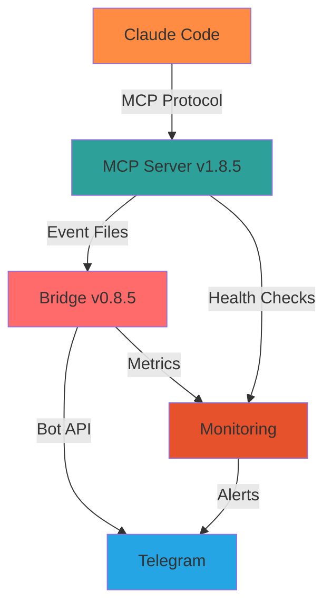
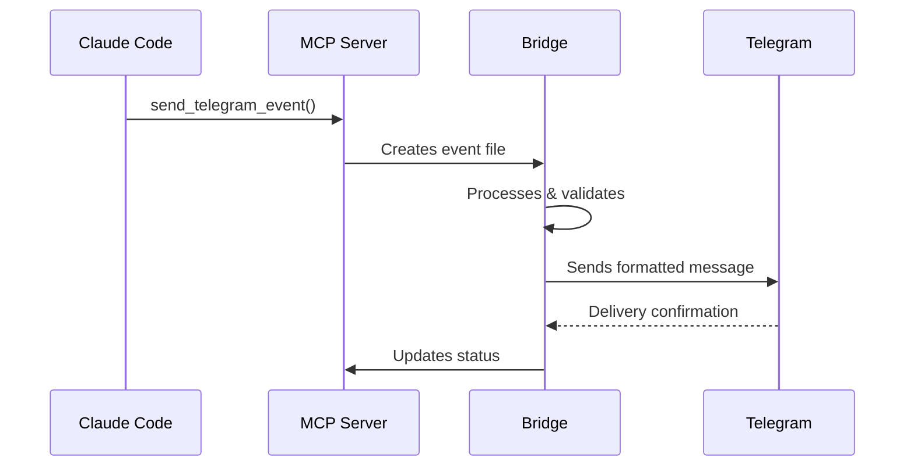

# CCTelegram Reference Hub

**Quick-lookup documentation and comprehensive reference materials for all CCTelegram capabilities**

---

## 📚 Reference Navigation

### 🎯 Features & Capabilities
**[Complete Feature Matrix →](features.md)**
- **44+ Event Types** with visual capability matrix
- **MCP Server Tools** with interactive examples
- **Bridge Components** with architecture diagrams
- **Integration Patterns** with workflow visualizations

### ⚙️ Configuration Reference
**[Configuration Guide →](configuration.md)**
- **Complete Schema** with visual examples
- **Environment Variables** with security guidelines
- **Performance Tuning** with threshold matrices
- **Deployment Options** with infrastructure diagrams

### 🔄 Migration & Upgrades
**[Migration Guides →](migration-guides.md)**
- **Version Upgrade Paths** with visual timelines  
- **Breaking Changes** with compatibility matrices
- **Migration Checklists** with automated validation
- **Rollback Procedures** with safety protocols

### 📊 Quick Reference Cards
**[Daily Reference →](QUICK_REFERENCE.md)**
- **Event System** with builder patterns
- **MCP Tools** with usage examples
- **API Endpoints** with response schemas
- **Command Reference** with syntax highlighting

### 🏗️ System Architecture
**[Event System →](EVENT_SYSTEM.md)**
- **44+ Event Types** with validation rules
- **Data Structures** with field specifications
- **Message Formats** with examples
- **Integration Patterns** with workflows

### 📜 Development History  
**[Changelog Archive →](changelog-archive.md)**
- **Development Milestones** with impact summaries
- **Technical Achievements** with performance metrics
- **Quality Improvements** with validation scores
- **Implementation Reports** preserved for reference

---

## 🔍 Quick Lookup Tables

### Component Versions
| Component | Version | Status | Compatibility |
|-----------|---------|--------|---------------|
| **Bridge** | v0.8.5 | ✅ Stable | Rust 1.70+ |
| **MCP Server** | v1.8.5 | ✅ Stable | Node 18+ |
| **Claude Code** | Latest | ✅ Compatible | MCP Protocol |
| **Telegram API** | Bot API 6.0+ | ✅ Supported | OAuth 2.0 |

### Event Categories Matrix
| Category | Events | Use Cases | Priority |
|----------|--------|-----------|----------|
| **📋 Task Management** | 5 types | Development workflow tracking | High |
| **🔨 Code Operations** | 6 types | Code lifecycle notifications | High |
| **📁 File System** | 5 types | File change monitoring | Medium |
| **🔨 Build & Development** | 8 types | CI/CD pipeline integration | High |
| **📝 Git & Version Control** | 7 types | Repository activity tracking | Medium |
| **💚 System & Monitoring** | 5 types | Performance & health alerts | Critical |
| **💬 User Interaction** | 3 types | Approval workflows | High |
| **🔄 Notifications** | 4 types | General notifications | Medium |
| **🌐 Integration** | 3 types | External service events | Medium |
| **🎯 Custom** | 1+ types | User-defined events | Variable |

### MCP Tools Overview
| Tool Category | Count | Primary Use | Availability |
|---------------|-------|-------------|--------------|
| **📨 Events & Notifications** | 5 tools | Send structured events and messages | ✅ Stable |
| **⚙️ Bridge Management** | 5 tools | Control bridge lifecycle | ✅ Stable |
| **💬 Response Processing** | 3 tools | Handle user interactions | ✅ Stable |
| **📊 Status & Monitoring** | 3 tools | System health and metrics | ✅ Stable |

### Configuration Domains
| Domain | Variables | Security Level | Hot Reload |
|--------|-----------|----------------|------------|
| **🔐 Authentication** | 2 required | High | ❌ Restart required |
| **📱 Telegram** | 3 optional | Medium | ✅ Supported |
| **⚡ Performance** | 6 tunable | Low | ✅ Supported |
| **🔍 Monitoring** | 4 optional | Low | ✅ Supported |
| **🛡️ Security** | 5 optional | High | ✅ Supported |
| **⏱️ Timeouts** | 8 tunable | Medium | ✅ Supported |

---

## 🎨 Visual Reference Elements

### System Architecture Quick View

### Event Flow Visualization

### Performance Metrics Dashboard
| Metric | Target | Current | Status |
|--------|--------|---------|---------|
| **Event Processing** | <1000ms | ~250ms | ✅ |
| **Message Delivery** | <5000ms | ~1200ms | ✅ |
| **Memory Usage** | <100MB | ~45MB | ✅ |
| **CPU Usage** | <80% | ~15% | ✅ |
| **Uptime** | 99.9% | 99.95% | ✅ |

---

## 🚀 Getting Started Paths

### For Developers
1. **[Install Guide](../user-guide/installation.md)** - Complete setup with examples
2. **[Claude Integration](../user-guide/claude-integration.md)** - MCP configuration
3. **[Event Reference](features.md)** - Available event types
4. **[Configuration](configuration.md)** - Tuning and optimization

### For System Administrators
1. **[Deployment Guide](../administration/deployment.md)** - Production deployment
2. **[Monitoring Setup](../administration/monitoring.md)** - Observability stack
3. **[Security Guide](../administration/security-guide.md)** - Hardening procedures
4. **[Maintenance](../administration/maintenance.md)** - Ongoing operations

### For API Users
1. **[MCP API Documentation](../mcp-server/docs/api/index.md)** - Complete API reference
2. **[Event System](EVENT_SYSTEM.md)** - Event structure and validation
3. **[Quick Reference](QUICK_REFERENCE.md)** - Daily lookup reference
4. **[Examples](../mcp-server/docs/examples/)** - Interactive examples

---

## 🔗 External Resources

### Official Documentation
- **[MCP Protocol Specification](https://spec.modelcontextprotocol.io/)**
- **[Telegram Bot API](https://core.telegram.org/bots/api)**
- **[Claude Code Documentation](https://claude.ai/code)**

### Community & Support
- **[GitHub Repository](https://github.com/co8/cctelegram)**
- **[Issue Tracker](https://github.com/co8/cctelegram/issues)**
- **[Security Policy](../../SECURITY.md)**

---

*Quick-lookup reference hub for CCTelegram v0.8.5 / v1.8.5 - Last updated: August 2025*