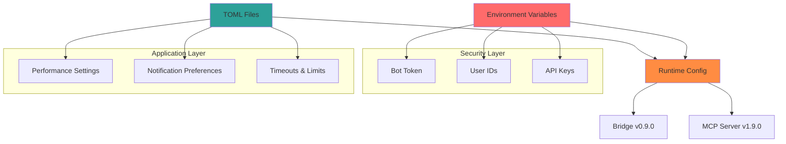

# CCTelegram Configuration Reference

**Complete configuration guide with visual examples and security best practices**

---

## 📋 Configuration Overview

CCTelegram uses a multi-layered configuration approach combining **environment variables** (security-sensitive), **TOML files** (application settings), and **hot-reload capabilities** for optimal flexibility and security.

### Configuration Architecture


---

## 🔐 Security Configuration

### Environment Variables (REQUIRED)
```bash
# REQUIRED: Telegram Bot Configuration
TELEGRAM_BOT_TOKEN="1234567890:ABCdefGHIjklMNOPqrsTUVwxyZ1234567890"
TELEGRAM_ALLOWED_USERS="123456789,987654321,555666777"

# OPTIONAL: Path Overrides
CC_TELEGRAM_EVENTS_DIR="/custom/events/path"
CC_TELEGRAM_RESPONSES_DIR="/custom/responses/path"

# OPTIONAL: Application Settings
CC_TELEGRAM_TIMEZONE="America/New_York"
CC_TELEGRAM_MESSAGE_STYLE="concise"  # Options: concise|detailed
```

### Security Best Practices
| Setting | Level | Recommendation | Example |
|---------|-------|---------------|---------|
| **Bot Token** | 🔴 Critical | Environment variable only | `TELEGRAM_BOT_TOKEN="..."` |
| **User IDs** | 🔴 Critical | Comma-separated, no spaces | `"123456789,987654321"` |
| **File Permissions** | 🟡 Medium | Restrict config file access | `chmod 600 ~/.cc_telegram/config.toml` |
| **API Keys** | 🔴 Critical | Never in version control | Use `.env` files |

---

## ⚙️ TOML Configuration Schema

### Complete Configuration Template
```toml
# ~/.cc_telegram/config.toml
# Security-sensitive values loaded from environment variables

[telegram]
# TELEGRAM_BOT_TOKEN and TELEGRAM_ALLOWED_USERS from environment
timezone = "Europe/Berlin"           # Timezone for message timestamps
message_style = "concise"            # Options: "concise" (default), "detailed"
```

### Configuration Domains

#### 📱 Telegram Settings
```toml
[telegram]
timezone = "Europe/Berlin"           # Any valid timezone
message_style = "concise"            # "concise" | "detailed"
```

| Setting | Type | Default | Description | Hot Reload |
|---------|------|---------|-------------|------------|
| `timezone` | String | `Europe/Berlin` | Message timestamp timezone | ✅ |
| `message_style` | String | `concise` | Message formatting style | ✅ |

#### 🔔 Notification Settings
```toml
[notifications]
task_completion = true               # Task completion events
approval_requests = true             # User approval workflows  
progress_updates = false             # Progress update messages
system_alerts = true                 # System health alerts
performance_alerts = true            # Performance threshold alerts
```

| Setting | Type | Default | Description | Hot Reload |
|---------|------|---------|-------------|------------|
| `task_completion` | Boolean | `true` | Enable task completion notifications | ✅ |
| `approval_requests` | Boolean | `true` | Enable approval request workflows | ✅ |
| `progress_updates` | Boolean | `false` | Enable progress update messages | ✅ |
| `system_alerts` | Boolean | `true` | Enable system health alerts | ✅ |
| `performance_alerts` | Boolean | `true` | Enable performance alerts | ✅ |

#### 🛡️ Security Settings
```toml
[security]
rate_limit_requests = 50            # Max requests per window
rate_limit_window = 60              # Rate limit window in seconds
audit_log = true                    # Enable audit logging
hmac_verification = true            # Enable HMAC integrity checking
max_message_size = 4096             # Max message size in bytes
```

| Setting | Type | Default | Description | Hot Reload |
|---------|------|---------|-------------|------------|
| `rate_limit_requests` | Integer | `50` | Maximum requests per window | ✅ |
| `rate_limit_window` | Integer | `60` | Rate limit window (seconds) | ✅ |
| `audit_log` | Boolean | `true` | Enable comprehensive audit logging | ✅ |
| `hmac_verification` | Boolean | `true` | Enable message integrity verification | ❌ |
| `max_message_size` | Integer | `4096` | Maximum message size in bytes | ✅ |

#### ⚡ Performance Settings
```toml
[performance]
memory_threshold_mb = 100           # Memory usage alert threshold
cpu_threshold_percent = 80.0        # CPU usage alert threshold  
event_processing_threshold_ms = 1000 # Event processing timeout
telegram_response_threshold_ms = 5000 # Telegram API timeout
metrics_collection_interval_seconds = 30 # Metrics collection frequency
enable_detailed_logging = false     # Enable detailed debug logging
```

| Setting | Type | Default | Description | Hot Reload |
|---------|------|---------|-------------|------------|
| `memory_threshold_mb` | Integer | `100` | Memory usage alert threshold (MB) | ✅ |
| `cpu_threshold_percent` | Float | `80.0` | CPU usage alert threshold (%) | ✅ |
| `event_processing_threshold_ms` | Integer | `1000` | Event processing timeout (ms) | ✅ |
| `telegram_response_threshold_ms` | Integer | `5000` | Telegram API response timeout (ms) | ✅ |
| `metrics_collection_interval_seconds` | Integer | `30` | Metrics collection interval | ✅ |
| `enable_detailed_logging` | Boolean | `false` | Enable detailed debug logging | ✅ |

#### 🔍 Monitoring Settings
```toml
[monitoring]
health_check_port = 8080            # Health check server port
enable_metrics_server = true        # Enable Prometheus metrics
metrics_endpoint = "/metrics"       # Metrics endpoint path
health_endpoint = "/health"         # Health check endpoint path
report_endpoint = "/report"         # Performance report endpoint
enable_prometheus = true            # Enable Prometheus integration
```

| Setting | Type | Default | Description | Hot Reload |
|---------|------|---------|-------------|------------|
| `health_check_port` | Integer | `8080` | HTTP server port for health checks | ❌ |
| `enable_metrics_server` | Boolean | `true` | Enable metrics HTTP server | ❌ |
| `metrics_endpoint` | String | `/metrics` | Prometheus metrics endpoint | ✅ |
| `health_endpoint` | String | `/health` | Health check endpoint | ✅ |
| `report_endpoint` | String | `/report` | Performance report endpoint | ✅ |
| `enable_prometheus` | Boolean | `true` | Enable Prometheus metrics export | ✅ |

---

## ⏱️ Timeout Configuration

### Timeout Domains
```toml
[timeouts]
# Tier-specific timeouts (Task 21.8 requirements)
webhook_timeout_ms = 100             # MCP webhook tier timeout
bridge_processing_timeout_ms = 500   # Bridge internal processing  
file_watcher_timeout_ms = 5000       # File watcher tier timeout
file_watcher_debounce_ms = 500       # File watcher debounce interval
overall_system_timeout_ms = 10000    # Overall system timeout

# Grace periods and recovery
degradation_grace_period_ms = 1000         # Grace period before degradation
health_check_interval_ms = 30000           # Health check frequency
config_reload_interval_ms = 5000           # Config hot-reload interval  
circuit_breaker_recovery_timeout_ms = 30000 # Circuit breaker recovery time
```

### Timeout Matrix
| Component | Timeout | Purpose | Adjustable |
|-----------|---------|---------|-----------|
| **MCP Webhook** | 100ms | Fast response for MCP tools | ✅ |
| **Bridge Processing** | 500ms | Internal event processing | ✅ |
| **File Watcher** | 5000ms | File system monitoring | ✅ |
| **System Overall** | 10000ms | Total request timeout | ✅ |
| **Health Checks** | 30000ms | Health monitoring interval | ✅ |
| **Config Reload** | 5000ms | Configuration hot-reload | ✅ |

---

## 🎛️ Tier Configuration

### Tier System Settings
```toml
[tier_configuration]
# Performance-based tier selection
performance_degradation_threshold = 0.8    # Success rate threshold (0.0-1.0)
response_time_degradation_ms = 2000        # Response time threshold
error_rate_threshold_percent = 15.0        # Error rate threshold (%)
max_consecutive_failures = 3               # Failures before circuit breaker

# Tier priorities (lower = higher priority)
[tier_configuration.tier_priorities]
mcp_webhook = 1                    # Highest priority
bridge_internal = 2                # Medium priority
file_watcher = 3                   # Lowest priority (fallback)

# Tier enablement
mcp_webhook_enabled = true         # Enable MCP webhook tier
bridge_internal_enabled = true     # Enable bridge internal tier
file_watcher_enabled = true        # Enable file watcher tier

# Graceful degradation
enable_auto_recovery = true                 # Enable automatic recovery
enable_performance_based_selection = true  # Use performance metrics for tier selection
```

### Tier Performance Matrix
| Tier | Priority | Use Case | Fallback | Auto-Recovery |
|------|----------|----------|----------|---------------|
| **MCP Webhook** | 1 (Highest) | Claude Code integration | Bridge Internal | ✅ |
| **Bridge Internal** | 2 (Medium) | Direct processing | File Watcher | ✅ |
| **File Watcher** | 3 (Lowest) | File system monitoring | None | ✅ |

---

## 🎨 Visual Configuration Examples

### Message Style Comparison
```yaml
concise_style:
  format: "*🎯 Task Complete Deploy Auth*\n⏰ 7/Aug/25 14:30\n📝 Authentication deployed"
  benefits: [40% shorter, faster reading, mobile-friendly]
  use_cases: [high-frequency notifications, mobile users, quick updates]

detailed_style:  
  format: "🎯 **Task Completion Notification**\n**Deploy Authentication Module**\n📅 August 7, 2025 at 14:30\n📝 Authentication module deployed successfully with OAuth2 implementation"
  benefits: [comprehensive context, formal tone, detailed information]
  use_cases: [critical notifications, detailed reporting, formal environments]
```

### Timezone Configuration Examples
```toml
# Common timezone configurations
timezone = "UTC"                    # Universal Coordinated Time
timezone = "America/New_York"       # Eastern Time
timezone = "Europe/London"          # British Time  
timezone = "Europe/Berlin"          # Central European Time
timezone = "Asia/Tokyo"             # Japan Standard Time
timezone = "Australia/Sydney"       # Australian Eastern Time
```

### Performance Threshold Matrix
```yaml
conservative:
  memory_threshold_mb: 80
  cpu_threshold_percent: 60.0
  event_processing_threshold_ms: 800
  
balanced:
  memory_threshold_mb: 100  
  cpu_threshold_percent: 80.0
  event_processing_threshold_ms: 1000
  
aggressive:
  memory_threshold_mb: 150
  cpu_threshold_percent: 95.0
  event_processing_threshold_ms: 2000
```

---

## 🔧 Advanced Configuration

### Queue Configuration
```toml
[queue]
# Redis configuration (optional - memory fallback available)
redis_url = "redis://localhost:6379"       # Redis connection URL
redis_db = 0                               # Redis database number
redis_timeout_ms = 5000                    # Redis operation timeout
enable_redis_cluster = false               # Enable Redis cluster support

# Memory queue fallback
memory_queue_max_size = 10000              # Max events in memory queue
memory_queue_overflow_behavior = "drop_oldest" # "drop_oldest" | "drop_newest" | "block"
```

### Large Message Protocol (v0.9.0)
```toml
[large_message]
max_message_size_kb = 100                  # Maximum message size (KB)
chunk_size_bytes = 4000                    # Chunk size for segmentation
enable_compression = true                  # Enable message compression
compression_level = 6                      # Compression level (1-9)
enable_integrity_check = true              # Enable chunk integrity verification
```

### Event Validation Configuration
```toml
[validation]
enable_strict_validation = true           # Enable strict event validation
allow_unknown_event_types = false         # Allow unknown event types
validate_timestamps = true                # Validate event timestamps
max_event_age_hours = 24                  # Maximum event age for processing
enable_schema_migration = true            # Enable automatic schema migration
```

---

## 📊 Configuration Validation

### Validation Schema
```yaml
telegram:
  bot_token:
    required: true
    format: "regex: ^[0-9]+:[A-Za-z0-9_-]{35}$"
    source: environment_variable
  
  allowed_users:
    required: true
    format: "comma_separated_integers"
    min_count: 1
    source: environment_variable
  
  timezone:
    required: false
    default: "Europe/Berlin"
    validation: valid_timezone
  
  message_style:
    required: false
    default: "concise"
    options: ["concise", "detailed"]

performance:
  memory_threshold_mb:
    type: integer
    range: [50, 1000]
    default: 100
  
  cpu_threshold_percent:
    type: float
    range: [10.0, 100.0]
    default: 80.0

security:
  rate_limit_requests:
    type: integer
    range: [1, 1000]
    default: 50
  
  rate_limit_window:
    type: integer  
    range: [10, 3600]
    default: 60
```

### Configuration Health Check
```bash
# Validate current configuration
curl http://localhost:8080/health/config

# Example response
{
  "config_valid": true,
  "validation_errors": [],
  "warnings": [
    "memory_threshold_mb below recommended minimum of 80MB"
  ],
  "hot_reload_capable": [
    "telegram.timezone",
    "performance.memory_threshold_mb",
    "notifications.task_completion"
  ],
  "restart_required": [
    "monitoring.health_check_port",
    "security.hmac_verification"
  ]
}
```

---

## 🚀 Deployment Configurations

### Development Environment
```toml
# ~/.cc_telegram/config.toml - Development
[performance]
memory_threshold_mb = 50
cpu_threshold_percent = 95.0
enable_detailed_logging = true

[notifications]
progress_updates = true

[monitoring]
health_check_port = 8080
enable_metrics_server = true
```

### Production Environment  
```toml
# ~/.cc_telegram/config.toml - Production
[performance]
memory_threshold_mb = 100
cpu_threshold_percent = 80.0
enable_detailed_logging = false

[security]
rate_limit_requests = 30
audit_log = true
hmac_verification = true

[monitoring]
health_check_port = 8080
enable_prometheus = true
```

### High-Volume Environment
```toml
# ~/.cc_telegram/config.toml - High Volume
[performance]
memory_threshold_mb = 200
cpu_threshold_percent = 85.0
event_processing_threshold_ms = 2000
metrics_collection_interval_seconds = 60

[security]
rate_limit_requests = 100
rate_limit_window = 60

[queue]
memory_queue_max_size = 50000
redis_timeout_ms = 3000
```

---

## 🔍 Configuration Troubleshooting

### Common Issues & Solutions

#### Configuration Not Loading
```bash
# Check file location and permissions
ls -la ~/.cc_telegram/config.toml

# Verify TOML syntax
cat ~/.cc_telegram/config.toml

# Check environment variables
env | grep TELEGRAM_
```

#### Hot Reload Not Working
| Setting | Hot Reload | Action Required |
|---------|------------|-----------------|
| `telegram.timezone` | ✅ | None |
| `monitoring.health_check_port` | ❌ | Restart bridge |
| `security.hmac_verification` | ❌ | Restart bridge |
| `performance.*` | ✅ | Configuration reload only |

#### Performance Issues
```yaml
symptoms:
  - High memory usage alerts
  - Frequent CPU threshold alerts
  - Slow event processing
  
solutions:
  memory_threshold_mb: increase to 150-200
  cpu_threshold_percent: adjust to 85-90
  event_processing_threshold_ms: increase to 2000
  enable_detailed_logging: disable in production
```

---

## 📖 Configuration Migration Guide

### Version Compatibility Matrix
| Version | Config Format | Breaking Changes | Migration Required |
|---------|---------------|------------------|-------------------|
| v0.9.0 | TOML + Environment | Large Message Protocol | Automatic |
| v0.8.4 | TOML + Environment | Tier Configuration | Manual |
| v0.8.3 | TOML Only | Environment Variables | Manual |

### Migration Commands
```bash
# Backup current configuration
cp ~/.cc_telegram/config.toml ~/.cc_telegram/config.toml.backup

# Migration will be handled automatically on bridge startup
# Check migration status
curl http://localhost:8080/health/migration
```

---

<style>
table {
  font-size: 0.85em;
  border-collapse: collapse;
  width: 100%;
  margin: 1rem 0;
}

table th {
  background: linear-gradient(135deg, #2da199, #20b2aa);
  color: white;
  padding: 0.75rem 0.5rem;
  text-align: left;
  font-weight: bold;
}

table td {
  padding: 0.5rem 0.75rem;
  border-bottom: 1px solid #dee2e6;
  vertical-align: top;
}

table tr:nth-child(even) {
  background-color: #f8f9fa;
}

table tr:hover {
  background-color: #e9ecef;
}

.mermaid {
  text-align: center;
  margin: 2rem auto;
  max-width: 800px;
}

code {
  background-color: #f8f9fa;
  border: 1px solid #e9ecef;
  border-radius: 4px;
  padding: 0.2rem 0.4rem;
  font-size: 0.9em;
}

pre {
  background-color: #f8f9fa;
  border: 1px solid #e9ecef;
  border-radius: 8px;
  padding: 1rem;
  overflow-x: auto;
  font-size: 0.85em;
  line-height: 1.4;
}

.config-section {
  background: #f8f9fa;
  border-left: 4px solid #2da199;
  padding: 1rem;
  margin: 1rem 0;
  border-radius: 0 8px 8px 0;
}

.security-warning {
  background-color: #fff3cd;
  border: 1px solid #ffeaa7;
  border-radius: 8px;
  padding: 1rem;
  margin: 1rem 0;
}

.security-warning::before {
  content: "⚠️ Security Warning: ";
  font-weight: bold;
  color: #856404;
}
</style>

*Complete configuration reference for CCTelegram v0.9.0 / v1.9.0 - Updated: August 2025*