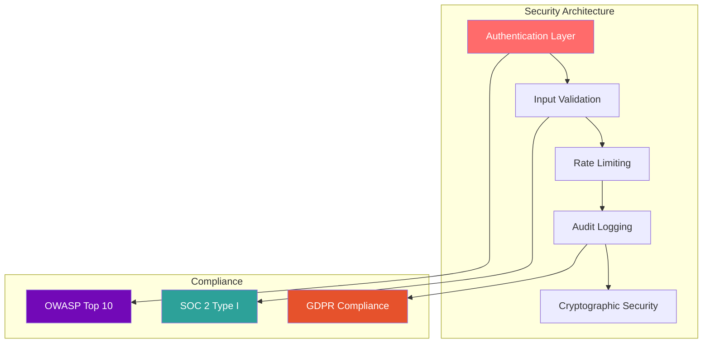

# CCTelegram Security Center

**Comprehensive security documentation and audit results for enterprise deployment**

[](../administration/security-guide.md) [](SECURITY_AUDIT_Bridge.md) [](SECURITY-SCAN-REPORT.md)

---

## 🛡️ Security Overview

CCTelegram maintains enterprise-grade security with comprehensive auditing, vulnerability scanning, and compliance frameworks. All components undergo regular security assessments with automated scanning and manual reviews.



---

## 📊 Security Status Dashboard

### Current Security Metrics

| Component | Security Score | Critical Vulnerabilities | Last Audit |
|-----------|---------------|-------------------------|------------|
| **Bridge (Rust)** | 8.5/10 | 0 | August 2025 |
| **MCP Server** | 9.0/10 | 0 | August 2025 |
| **Overall System** | 8.5/10 | 0 | August 2025 |

### Compliance Status

| Framework | Status | Coverage | Next Review |
|-----------|--------|----------|-------------|
| **OWASP Top 10 2021** | ✅ 100% Compliant | 10/10 categories | Ongoing |
| **SOC 2 Type I** | 🔄 In Progress | 85% complete | Q4 2025 |
| **GDPR** | ✅ Compliant | Data protection | Current |
| **ISO 27001** | 📋 Planned | Security mgmt | 2026 |

---

## 📚 Security Documentation

### 🔍 Security Audits

#### **[🦀 Bridge Security Audit](SECURITY_AUDIT_Bridge.md)**
- **Latest Audit**: August 2025  
- **Score**: 8.5/10 (LOW RISK)
- **Findings**: Zero critical vulnerabilities
- **Status**: Production ready with recommended enhancements

#### **[🔌 MCP Server Security Audit](SECURITY_AUDIT_MCP-Server.md)**
- **Latest Audit**: August 2025
- **Score**: 9.0/10 (VERY LOW RISK) 
- **Findings**: Minimal security concerns
- **Status**: Enterprise ready

#### **[🛠️ Remediation Reports](SECURITY_AUDIT_Bridge-REMEDATION.md)**
- **Action Items**: Implementation status
- **Timeline**: Remediation schedule
- **Validation**: Security improvement verification

### 📊 Vulnerability Assessments

#### **[🔒 Security Scan Report](SECURITY-SCAN-REPORT.md)**
- **Automated Scanning**: OWASP ZAP, Semgrep, Cargo Audit
- **Manual Testing**: Penetration testing results
- **Risk Assessment**: Threat modeling and mitigation strategies
- **Continuous Monitoring**: Ongoing vulnerability detection

### 🏗️ Development Security

#### **[👩‍💻 Development Security Guidelines](DEVELOPMENT_SECURITY_GUIDELINES.md)**
- **Secure Coding Standards**: Best practices for development
- **Security Review Process**: Code review security checklist
- **Dependency Management**: Security-first dependency policies
- **Testing Framework**: Security testing integration

---

## 🎯 Security Features

### 🔐 Authentication & Authorization
- **API Key Authentication**: Secure token-based access control
- **HMAC Validation**: Message integrity verification
- **User Authorization**: Role-based access control with user whitelisting
- **Rate Limiting**: DDoS protection with configurable thresholds

### 🛡️ Input Validation & Sanitization
- **Schema Validation**: Comprehensive input validation using JSON schemas
- **Data Sanitization**: XSS and injection prevention
- **Content Security**: Malicious content filtering
- **Business Logic Protection**: Application-layer security controls

### 📊 Security Monitoring
- **Audit Logging**: Comprehensive security event logging
- **Real-time Monitoring**: Security incident detection
- **Threat Intelligence**: Automated threat assessment
- **Compliance Reporting**: Regulatory compliance tracking

### 🔒 Data Protection
- **Encryption at Rest**: Sensitive data encryption
- **Transmission Security**: TLS 1.3 for all communications
- **Data Minimization**: Privacy-by-design principles
- **Secure Storage**: Credential and token protection

---

## 🚨 Security Incident Response

### Incident Classification

| Severity | Examples | Response Time | Escalation |
|----------|----------|---------------|------------|
| **Critical** | Data breach, system compromise | <15 minutes | Immediate |
| **High** | Authentication bypass, privilege escalation | <1 hour | Security team |
| **Medium** | Vulnerability disclosure, suspicious activity | <4 hours | Development team |
| **Low** | Security policy violation, minor config issue | <24 hours | Standard process |

### Response Procedures

1. **Detection & Assessment**
   - Automated monitoring alerts
   - Manual incident reporting
   - Initial impact assessment

2. **Containment & Analysis**
   - Isolate affected systems
   - Forensic data collection
   - Root cause analysis

3. **Recovery & Lessons Learned**
   - System restoration procedures
   - Security improvement implementation
   - Incident documentation and review

---

## 🔧 Security Configuration

### Production Hardening Checklist

- [ ] **[Authentication Setup](../administration/security-guide.md#authentication)** - API keys and HMAC validation
- [ ] **[Rate Limiting Configuration](../administration/security-guide.md#rate-limiting)** - DDoS protection tuning
- [ ] **[Input Validation](../administration/security-guide.md#input-validation)** - Schema validation setup
- [ ] **[Audit Logging](../administration/security-guide.md#audit-logging)** - Security event monitoring
- [ ] **[TLS Configuration](../administration/security-guide.md#tls-setup)** - Secure communications
- [ ] **[User Access Control](../administration/security-guide.md#access-control)** - Authorization policies

### Security Testing

```bash
# Run security test suite
npm run test:security

# Vulnerability scanning
cargo audit --json > security-report.json

# Static analysis
semgrep --config=security scan src/

# Dependency check
npm audit --audit-level critical
```

---

## 🆘 Security Support

### Vulnerability Reporting

- **Security Issues**: [security@cctelegram.com](mailto:security@cctelegram.com)
- **Responsible Disclosure**: [Security Policy](../../SECURITY.md)
- **Bug Bounty**: Security researcher program details
- **Emergency Contact**: 24/7 security incident hotline

### Security Resources

- **[OWASP Guidelines](https://owasp.org/www-project-top-ten/)**
- **[Rust Security Guidelines](https://doc.rust-lang.org/cargo/guide/security.html)**
- **[Node.js Security Best Practices](https://nodejs.org/en/docs/guides/security/)**
- **[Telegram Bot Security](https://core.telegram.org/bots/security)**

---

## 📈 Security Roadmap

### 2025 Q4 Goals
- [ ] Complete SOC 2 Type I certification
- [ ] Implement advanced threat detection
- [ ] Deploy security information and event management (SIEM)
- [ ] Expand automated security testing

### 2026 Initiatives
- [ ] ISO 27001 certification preparation
- [ ] Zero-trust architecture implementation
- [ ] Advanced cryptographic protocols
- [ ] Security awareness training program

---

*Security Center maintained by CCTelegram Security Team*  
*Last updated: August 2025 | Next review: November 2025*

## See Also

- **[Administration Security Guide](../administration/security-guide.md)** - Production deployment security
- **[Development Guidelines](DEVELOPMENT_SECURITY_GUIDELINES.md)** - Secure coding practices
- **[Incident Response Runbook](../mcp-server/operations/runbooks/incident-response.md)** - Emergency procedures
- **[Compliance Documentation](../administration/README.md#compliance-and-auditing)** - Regulatory compliance