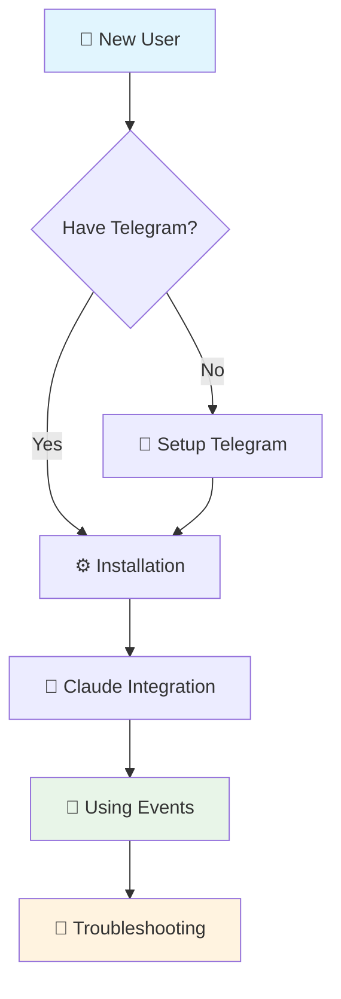
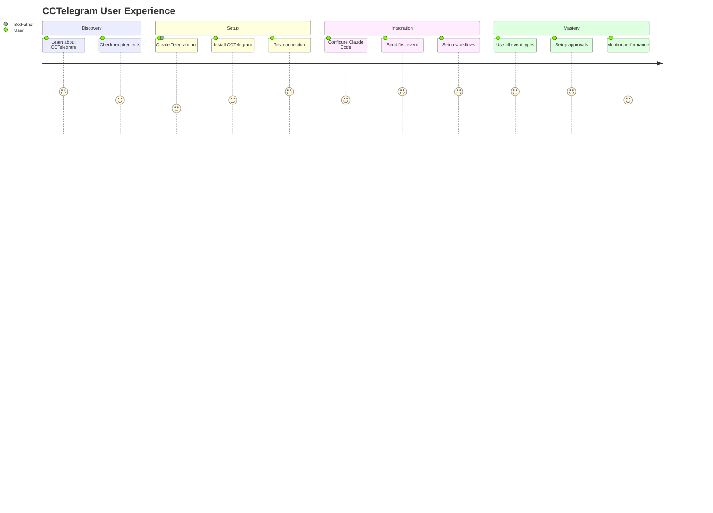
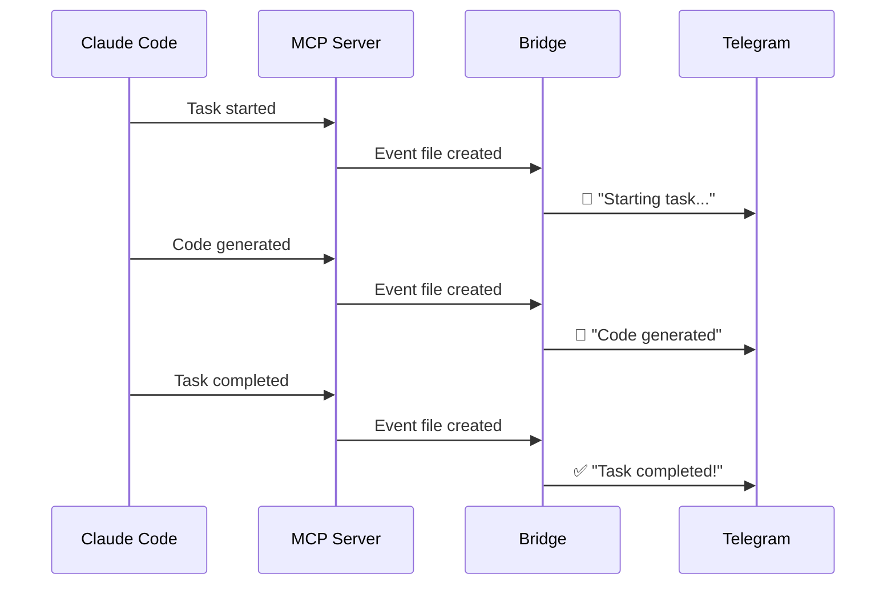
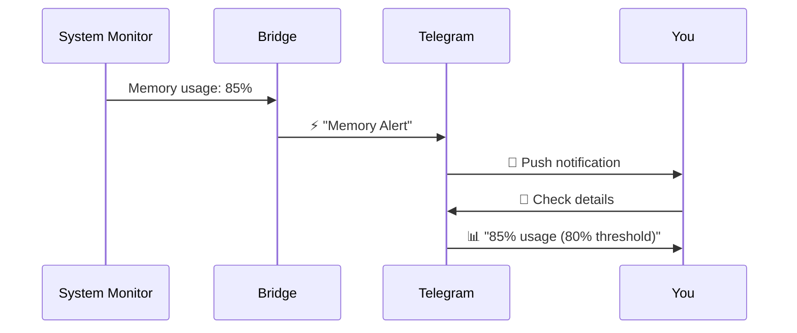

# 🚀 CCTelegram User Guide

> **Complete notification ecosystem for Claude Code developers**

Welcome to CCTelegram! This guide will help you get from zero to productive in minutes, with visual guides and clear workflows.

## 📖 Quick Navigation



## 🎯 What You'll Learn

| Section | Time | What You'll Accomplish |
|---------|------|------------------------|
| [📱 Installation](installation.md) | 5 min | Get CCTelegram running with Telegram notifications |
| [🔌 Claude Integration](claude-integration.md) | 10 min | Master MCP tools and advanced workflows |
| [📚 Event Reference](event-reference.md) | 15 min | Understand all 44+ event types and usage patterns |
| [🔧 Troubleshooting](troubleshooting.md) | As needed | Fix common issues quickly |

## 🏃‍♂️ Fast Track (2 Minutes)

Already know the basics? Jump right in:

```bash
# 1. Quick install
git clone https://github.com/co8/cctelegram.git && cd cctelegram/mcp-server && ./install.sh

# 2. Test immediately
echo '{"type": "info_notification", "title": "Hello!", "description": "CCTelegram working!"}' > ~/.cc_telegram/events/test.json
```

**Expected result:** Telegram notification within 5 seconds ✨

## 🎭 User Journey Map



## 📱 Visual Overview

CCTelegram consists of **two seamlessly integrated components**:

```ascii
┌─────────────────────────────────────────────────────────────────┐
│                         CCTelegram                              │
├─────────────────────────────────────────────────────────────────┤
│                                                                 │
│  🔌 MCP Server (TypeScript)    🌉 Bridge (Rust)               │
│  ┌─────────────────────────┐    ┌─────────────────────────┐     │
│  │ • Claude Code integration│    │ • Background service   │     │
│  │ • 20+ MCP tools         │    │ • File watching        │     │
│  │ • Interactive workflows │    │ • Telegram delivery    │     │
│  │ • Task management       │    │ • Performance focused  │     │
│  └─────────────────────────┘    └─────────────────────────┘     │
│            │                              ▲                    │
│            ▼                              │                    │
│  ┌─────────────────────────────────────────────────────────┐   │
│  │              ~/.cc_telegram/events/                     │   │
│  │            📄 JSON event files                          │   │
│  └─────────────────────────────────────────────────────────┘   │
└─────────────────────────────────────────────────────────────────┘
```

## 🚀 Getting Started Paths

### 👤 Choose Your Experience Level

<table>
<tr>
<td width="33%">

**🌱 Beginner**
- New to Claude Code or Telegram bots
- Want step-by-step guidance
- Prefer detailed explanations

➡️ [Start with Installation](installation.md)

</td>
<td width="33%">

**⚡ Intermediate**  
- Familiar with Claude Code
- Some Telegram bot experience
- Want efficient setup

➡️ [Jump to Claude Integration](claude-integration.md)

</td>
<td width="34%">

**🚀 Advanced**
- Experienced developer
- Want all capabilities
- Need reference material

➡️ [Browse Event Reference](event-reference.md)

</td>
</tr>
</table>

## 🎯 Core Capabilities

### 🔔 Real-time Notifications
Get instant Telegram alerts for:
- ✅ Task completions with results
- 🚨 Performance alerts with metrics
- 🔒 Security events with severity
- 🏗️ Build status with test coverage

### 🤝 Interactive Approvals
Handle critical decisions via Telegram:
- 🚀 Deployment approvals
- 🔐 Security confirmations  
- 📝 Code review responses
- ⚙️ Configuration changes

### 📊 Development Insights
Track your workflow with:
- 📈 Performance monitoring
- 🧪 Test execution tracking
- 📁 File change notifications
- 🌿 Git operation updates

## 🔄 Workflow Examples

### Development Cycle


### Performance Monitoring


## 🎨 Visual Message Formats

CCTelegram uses modern, scannable message formats:

```
*✅ Task Completed Deploy Authentication*
⏰ 2/Aug/25 23:42
📝 Authentication module deployed with 100% test coverage

*⚡ Performance Alert Memory Usage High*  
⏰ 2/Aug/25 23:45
📝 Server memory: 85% (threshold: 80%)

*🔐 Approval Required Production Deploy*
⏰ 2/Aug/25 23:50
📝 Ready to deploy v1.8.5 to production?
[Approve] [Deny] [Details]
```

## 📊 Feature Matrix

| Feature | MCP Server | Bridge | Benefits |
|---------|------------|---------|----------|
| 🔌 Claude Code Integration | ✅ | ➖ | Zero-config setup |
| 📱 Telegram Delivery | ➖ | ✅ | Real-time notifications |
| 🤝 Interactive Approvals | ✅ | ✅ | Two-way communication |
| 📊 Performance Monitoring | ✅ | ✅ | Built-in observability |
| 🔒 Security Features | ✅ | ✅ | Enterprise-grade protection |
| 🎯 44+ Event Types | ✅ | ✅ | Complete workflow coverage |

## 🚀 Success Indicators

You'll know CCTelegram is working perfectly when:

- [ ] 📱 Telegram notifications arrive within 5 seconds
- [ ] 🔄 All event types work without errors  
- [ ] 🤝 Interactive buttons respond correctly
- [ ] 📊 Performance metrics are tracked
- [ ] 🔒 No security warnings in logs
- [ ] ⚡ Memory usage stays under 100MB

## 🆘 Quick Help

<details>
<summary>🚫 Not receiving notifications?</summary>

1. Check bot token: `echo $TELEGRAM_BOT_TOKEN`
2. Verify user ID: `echo $TELEGRAM_ALLOWED_USERS`
3. Test bridge: `curl http://localhost:8080/health`
4. Check logs: `tail -f ~/.cc_telegram/logs/*.log`

</details>

<details>
<summary>🔧 MCP tools not working?</summary>

1. Restart Claude Code completely
2. Check MCP config: `cat .mcp.json`  
3. Verify installation: `ls ~/.cc_telegram/`
4. Test directly: `echo '{}' | node mcp-server/src/index.js`

</details>

<details>
<summary>⚡ Performance issues?</summary>

1. Check memory: `ps aux | grep cctelegram`
2. Monitor events: `ls ~/.cc_telegram/events/ | wc -l`
3. Clean old files: Use `clear_old_responses` tool
4. Restart bridge: Use `restart_bridge` tool

</details>

## 📚 Next Steps

Ready to dive deeper? Choose your path:

<table>
<tr>
<td>

**🎯 I want to get started now**  
[📱 Installation Guide →](installation.md)

*Perfect for first-time setup*

</td>
<td>

**🔌 I want Claude Code integration**  
[🔌 Claude Integration →](claude-integration.md)

*Advanced MCP workflows*

</td>
</tr>
<tr>
<td>

**📚 I need the complete reference**  
[📚 Event Reference →](event-reference.md)

*All 44+ event types*

</td>
<td>

**🔧 I'm having issues**  
[🔧 Troubleshooting →](troubleshooting.md)

*Solutions for common problems*

</td>
</tr>
</table>

---

## 🎉 Welcome to the Community!

CCTelegram is built for developers, by developers. Join thousands of users who've supercharged their Claude Code workflows:

- 🌟 **Zero message loss** - Enterprise reliability
- ⚡ **Sub-5 second** notification delivery  
- 🛡️ **8.5/10 security score** - OWASP compliant
- 🧪 **61 passing tests** - Production ready

**Ready to transform your development workflow?** Let's get started! 

[📱 Begin Installation →](installation.md)