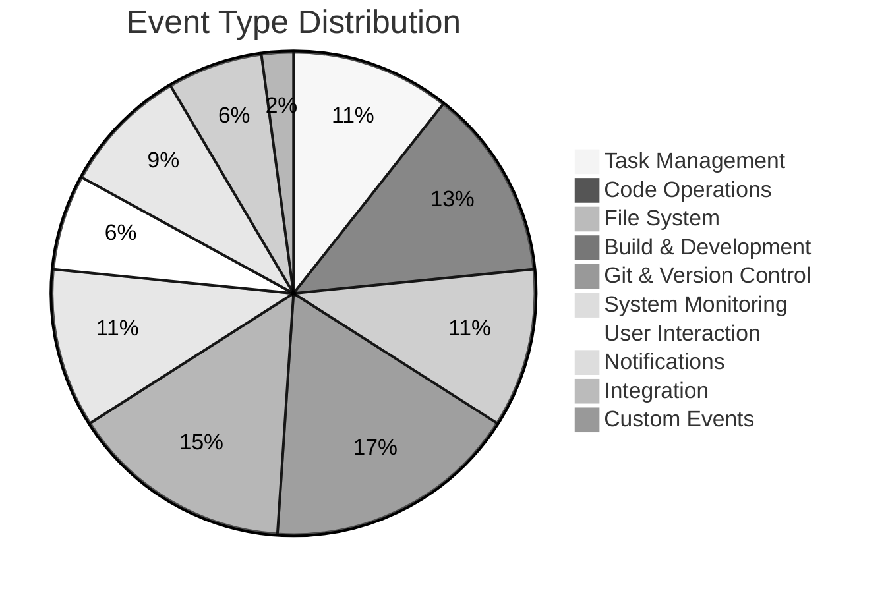

# 📚 Event Reference Guide

> **Complete visual guide to all 44+ CCTelegram event types with examples and best practices**

## 🎯 Event System Overview

CCTelegram's event system covers your entire development workflow with **44+ specialized event types** organized into **10 logical categories**:



**Quick Access:** Jump to any category below ⬇️

---

## 📋 Event Categories Quick Reference

| Category | Count | Visual Icon | Common Use Cases |
|----------|-------|-------------|------------------|
| [📝 Task Management](#-task-management-events) | 5 | ✅❌🚀 | Project tracking, completion notifications |
| [🔨 Code Operations](#-code-operations-events) | 6 | 💻🔍🔧 | Code generation, analysis, refactoring |
| [📁 File System](#-file-system-events) | 5 | 📄📝🗑️ | File changes, directory operations |
| [🏗️ Build & Development](#️-build--development-events) | 8 | 🔨✅❌ | Build status, testing, linting |
| [🌿 Git & Version Control](#-git--version-control-events) | 7 | 📝⬆️🔀 | Commits, pushes, PRs |
| [💚 System Monitoring](#-system-monitoring-events) | 5 | ⚡🔒📊 | Performance, health, security |
| [👤 User Interaction](#-user-interaction-events) | 3 | 💬🤝⚡ | Approvals, responses, commands |
| [🔔 Notifications](#-notifications-events) | 4 | 🚨ℹ️📢 | General alerts and updates |
| [🔗 Integration](#-integration-events) | 3 | 🌐📡⚙️ | External services, APIs |
| [🎨 Custom](#-custom-events) | 1 | 🎯🔧⭐ | User-defined events |

---

## 📝 Task Management Events

*Track your project's progress from start to finish*

### ✅ task_completion
**Perfect for:** Successfully completed tasks, milestones reached

```javascript
send_telegram_event({
  type: "task_completion",
  title: "User Authentication System Complete",
  description: "OAuth2 implementation finished with JWT tokens and refresh logic",
  data: {
    status: "completed",
    results: "• 5 new files created\n• 15 tests passing\n• Security audit passed\n• Documentation updated",
    duration_ms: 7200000,  // 2 hours
    files_affected: ["src/auth/", "tests/auth/", "docs/auth.md"],
    test_coverage: 94.5
  }
})
```

**Visual Result:**
```
*✅ Task Completed User Authentication System Complete*
⏰ 7/Aug/24 16:30
📝 OAuth2 implementation finished with JWT tokens and refresh logic
⏱️ 2h 0m • 94.5% coverage • 5 files
```

### 🚀 task_started
**Perfect for:** Beginning new work, setting expectations

```javascript
send_telegram_event({
  type: "task_started", 
  title: "Database Migration Task Started",
  description: "Beginning migration of user preferences to new schema",
  data: {
    estimated_duration_ms: 1800000,  // 30 minutes
    priority: "high",
    assigned_to: "claude-code",
    complexity: "medium"
  }
})
```

### ❌ task_failed
**Perfect for:** Task failures, troubleshooting needed

```javascript
send_telegram_event({
  type: "task_failed",
  title: "API Integration Failed",
  description: "Third-party authentication service unreachable",
  data: {
    error_message: "Connection timeout after 30 seconds",
    failure_reason: "network_timeout",
    retry_count: 3,
    next_action: "Switch to fallback authentication method"
  }
})
```

### 📊 task_progress  
**Perfect for:** Long-running tasks, progress updates

```javascript
send_telegram_event({
  type: "task_progress",
  title: "Database Backup Progress", 
  description: "Backup operation 65% complete - processing user data",
  data: {
    progress_percentage: 65,
    current_phase: "user_data",
    estimated_remaining_ms: 600000,  // 10 minutes
    records_processed: 150000
  }
})
```

### 🚫 task_cancelled
**Perfect for:** Cancelled tasks, changed priorities

```javascript
send_telegram_event({
  type: "task_cancelled",
  title: "Feature Development Cancelled",
  description: "Advanced search feature cancelled due to API limitations",
  data: {
    cancellation_reason: "external_dependency_unavailable",
    work_completed_percentage: 30,
    alternative_approach: "Simple text search implemented instead"
  }
})
```

---

## 🔨 Code Operations Events

*Monitor your code generation, analysis, and modification workflows*

### 💻 code_generation
**Perfect for:** Claude Code generating new files, AI-assisted coding

```javascript
send_telegram_event({
  type: "code_generation",
  title: "React Components Generated",
  description: "Created user profile components with TypeScript interfaces",
  data: {
    language: "typescript",
    framework: "react",
    files_affected: [
      "src/components/UserProfile.tsx",
      "src/components/Avatar.tsx", 
      "src/types/user.ts"
    ],
    lines_generated: 340,
    estimated_time_saved_hours: 2.5
  }
})
```

**Visual Result:**
```
*🔨 Code Generated React Components Generated*  
⏰ 7/Aug/24 16:35
📝 Created user profile components with TypeScript interfaces
💻 TypeScript • React • 340 lines • 2.5h saved
```

### 🔍 code_analysis
**Perfect for:** Code reviews, quality assessments, architecture analysis

```javascript
send_telegram_event({
  type: "code_analysis",
  title: "Authentication Module Analysis Complete",
  description: "Security and performance analysis of OAuth implementation",
  data: {
    analysis_type: "security_review",
    files_analyzed: ["src/auth/oauth.ts", "src/auth/middleware.ts"],
    issues_found: 0,
    security_score: 9.2,
    performance_score: 8.7,
    recommendations: [
      "Consider rate limiting on token refresh",
      "Add request logging for audit trail"
    ]
  }
})
```

### 🔧 code_refactoring
**Perfect for:** Code cleanup, optimization, structural improvements

```javascript
send_telegram_event({
  type: "code_refactoring",
  title: "Database Layer Refactored", 
  description: "Consolidated database queries and improved connection pooling",
  data: {
    refactoring_type: "performance_optimization",
    files_modified: 8,
    lines_removed: 150,
    lines_added: 95,
    performance_improvement: "35% faster query execution",
    complexity_reduction: "McCabe complexity reduced from 12 to 6"
  }
})
```

### 👁️ code_review
**Perfect for:** Peer reviews, automated code quality checks

```javascript
send_telegram_event({
  type: "code_review",
  title: "Pull Request Review Complete",
  description: "Authentication feature ready for merge",
  data: {
    pull_request_id: "pr-123",
    reviewer: "claude-code",
    files_reviewed: 12,
    comments_added: 3,
    approval_status: "approved_with_suggestions",
    overall_rating: "excellent"
  }
})
```

### 🧪 code_testing
**Perfect for:** Test execution, coverage reports, quality gates

```javascript
send_telegram_event({
  type: "code_testing",
  title: "Integration Tests Complete",
  description: "API endpoint testing finished with full coverage",
  data: {
    test_suite: "integration_tests",
    tests_run: 45,
    tests_passed: 44,
    tests_failed: 1,
    coverage_percentage: 92.3,
    failed_test: "auth/logout.test.ts - timeout on slow network"
  }
})
```

### 🚀 code_deployment
**Perfect for:** Deployments, releases, environment updates

```javascript
send_telegram_event({
  type: "code_deployment",
  title: "Production Deployment Complete",
  description: "Version 2.1.0 deployed with zero downtime",
  data: {
    environment: "production",
    version: "2.1.0",
    deployment_strategy: "blue_green",
    downtime_seconds: 0,
    health_check_status: "all_passed",
    rollback_available: true
  }
})
```

---

## 📁 File System Events

*Track file and directory changes in your project*

### 📄 file_created
**Perfect for:** New files, scaffolding, generated assets

```javascript
send_telegram_event({
  type: "file_created",
  title: "Configuration File Created",
  description: "Environment configuration for staging environment",
  data: {
    file_path: "config/staging.env",
    file_size_bytes: 1024,
    created_by: "deployment_script",
    file_type: "configuration"
  }
})
```

### 📝 file_modified
**Perfect for:** File updates, content changes, version tracking

```javascript
send_telegram_event({
  type: "file_modified",
  title: "API Documentation Updated",
  description: "Added new endpoint documentation for user preferences",
  data: {
    file_path: "docs/api/users.md",
    modification_type: "content_addition",
    lines_added: 25,
    lines_removed: 3,
    modified_by: "claude-code"
  }
})
```

### 🗑️ file_deleted
**Perfect for:** Cleanup operations, deprecated code removal

```javascript
send_telegram_event({
  type: "file_deleted",
  title: "Legacy Code Removed",
  description: "Deleted deprecated authentication helpers",
  data: {
    file_path: "src/legacy/auth-helpers.js",
    deletion_reason: "deprecated_in_v2",
    alternative_location: "src/auth/modern-helpers.ts",
    backup_available: true
  }
})
```

### 📁 directory_created
**Perfect for:** Project structure changes, new modules

```javascript
send_telegram_event({
  type: "directory_created", 
  title: "New Module Directory Created",
  description: "Created notifications module structure",
  data: {
    directory_path: "src/notifications/",
    purpose: "notification_system",
    subdirectories_created: ["providers/", "templates/", "types/"]
  }
})
```

### 🗂️ directory_deleted
**Perfect for:** Module removal, cleanup operations

```javascript
send_telegram_event({
  type: "directory_deleted",
  title: "Old Build Directory Removed",
  description: "Cleaned up legacy build artifacts",
  data: {
    directory_path: "build/legacy/",
    files_removed: 47,
    space_freed_mb: 125,
    cleanup_reason: "build_system_upgrade"
  }
})
```

---

## 🏗️ Build & Development Events

*Monitor your build processes, tests, and development tools*

### 🔨 build_started
**Perfect for:** Build initiation, CI/CD triggers

```javascript
send_telegram_event({
  type: "build_started",
  title: "Production Build Started",
  description: "Building release candidate for v2.1.0",
  data: {
    build_target: "production",
    branch_name: "release/v2.1.0",
    commit_hash: "a1b2c3d4e5f6",
    estimated_duration_ms: 300000,  // 5 minutes
    build_agent: "github_actions"
  }
})
```

### ✅ build_completed
**Perfect for:** Successful builds, deployment readiness

```javascript
send_telegram_event({
  type: "build_completed",
  title: "Build Successful - v2.1.0",
  description: "Production build completed with optimizations",
  data: {
    build_duration_ms: 285000,  // 4m 45s
    bundle_size_mb: 2.3,
    optimization_percentage: 15,
    artifacts_created: [
      "dist/main.bundle.js",
      "dist/vendor.bundle.js", 
      "dist/styles.css"
    ],
    next_step: "ready_for_deployment"
  }
})
```

### ❌ build_failed
**Perfect for:** Build failures, compilation errors

```javascript
send_telegram_event({
  type: "build_failed", 
  title: "Build Failed - TypeScript Errors",
  description: "Compilation failed due to type mismatches in auth module",
  data: {
    failure_stage: "typescript_compilation",
    error_count: 3,
    errors: [
      "src/auth/oauth.ts(42): Type 'string' not assignable to type 'number'",
      "src/auth/jwt.ts(15): Property 'exp' missing in type"
    ],
    suggested_fix: "Run 'npm run type-check' for detailed analysis"
  }
})
```

### 🧪 test_suite_run
**Perfect for:** Test execution, quality gates, CI pipelines

```javascript
send_telegram_event({
  type: "test_suite_run",
  title: "Full Test Suite Complete",
  description: "All unit, integration, and e2e tests executed",
  data: {
    test_suites: ["unit", "integration", "e2e"],
    total_tests: 234,
    tests_passed: 230,
    tests_failed: 4,
    tests_skipped: 0,
    coverage_percentage: 87.5,
    duration_ms: 125000,  // 2m 5s
    flaky_tests: ["auth/timeout.test.ts"]
  }
})
```

### ✅ test_passed / ❌ test_failed
**Perfect for:** Individual test results, focused debugging

```javascript
// Passing test
send_telegram_event({
  type: "test_passed",
  title: "Authentication Tests Passed",
  description: "All OAuth flow tests successful",
  data: {
    test_file: "tests/auth/oauth.test.ts",
    tests_run: 12,
    duration_ms: 3500
  }
})

// Failing test
send_telegram_event({
  type: "test_failed",
  title: "Payment Integration Test Failed", 
  description: "Stripe webhook test failing on timeout",
  data: {
    test_file: "tests/payments/stripe.test.ts",
    failed_test: "should process webhook within 10 seconds",
    error_message: "Timeout exceeded: 15000ms",
    suggested_action: "Check Stripe test environment"
  }
})
```

### 📏 lint_check / 🔍 type_check
**Perfect for:** Code quality, style enforcement, type safety

```javascript
// Linting
send_telegram_event({
  type: "lint_check",
  title: "ESLint Check Complete",
  description: "Code style analysis finished",
  data: {
    files_checked: 89,
    errors: 0,
    warnings: 3,
    auto_fixable: 2,
    style_violations: [
      "Prefer const over let in 2 locations",
      "Missing trailing comma in object literal"
    ]
  }
})

// Type checking
send_telegram_event({
  type: "type_check", 
  title: "TypeScript Check Passed",
  description: "All type definitions validated successfully",
  data: {
    files_checked: 156,
    type_errors: 0,
    strict_mode: true,
    compilation_time_ms: 8500
  }
})
```

---

## 🌿 Git & Version Control Events

*Track your version control workflow and collaboration*

### 📝 git_commit
**Perfect for:** Commit tracking, change history, collaboration

```javascript
send_telegram_event({
  type: "git_commit",
  title: "Authentication Module Committed",
  description: "Add OAuth2 implementation with JWT tokens",
  data: {
    commit_hash: "a1b2c3d4e5f6789",
    author: "claude-code",
    branch_name: "feature/oauth2",
    files_changed: [
      "src/auth/oauth.ts", 
      "src/auth/jwt.ts",
      "tests/auth/oauth.test.ts"
    ],
    lines_added: 245,
    lines_deleted: 12,
    commit_message: "feat: add OAuth2 with JWT refresh tokens\n\n- Implement authorization code flow\n- Add token refresh logic\n- Include comprehensive tests"
  }
})
```

### ⬆️ git_push
**Perfect for:** Push notifications, remote sync, backup confirmation

```javascript
send_telegram_event({
  type: "git_push",
  title: "Feature Branch Pushed",
  description: "OAuth2 implementation pushed to remote repository", 
  data: {
    branch_name: "feature/oauth2",
    remote_name: "origin",
    commits_pushed: 3,
    force_push: false,
    push_size_mb: 1.2
  }
})
```

### 🔀 git_merge
**Perfect for:** Merge operations, integration points, release preparation

```javascript
send_telegram_event({
  type: "git_merge",
  title: "Feature Branch Merged",
  description: "OAuth2 feature successfully merged into development",
  data: {
    source_branch: "feature/oauth2",
    target_branch: "develop", 
    merge_strategy: "merge_commit",
    conflicts_resolved: 0,
    files_merged: 8,
    merge_commit: "m1e2r3g4e567"
  }
})
```

### 🌿 git_branch
**Perfect for:** Branch creation, workflow tracking, feature isolation

```javascript
send_telegram_event({
  type: "git_branch",
  title: "Feature Branch Created",
  description: "Started work on user notification preferences",
  data: {
    branch_name: "feature/notification-preferences",
    created_from: "develop",
    branch_type: "feature",
    estimated_completion: "2024-08-10"
  }
})
```

### 🏷️ git_tag
**Perfect for:** Version releases, deployment markers, milestone tracking

```javascript
send_telegram_event({
  type: "git_tag",
  title: "Version 2.1.0 Tagged",
  description: "Release candidate tagged for production deployment",
  data: {
    tag_name: "v2.1.0-rc.1",
    commit_hash: "a1b2c3d4",
    tag_type: "annotated",
    release_notes: "Major authentication system upgrade with OAuth2 support",
    deployment_ready: true
  }
})
```

### 📝 pull_request_created / 🔀 pull_request_merged
**Perfect for:** Code review workflow, collaboration, quality gates

```javascript
// PR Created
send_telegram_event({
  type: "pull_request_created",
  title: "Pull Request: OAuth2 Implementation",
  description: "Ready for review - OAuth2 authentication system",
  data: {
    pr_number: 123,
    source_branch: "feature/oauth2",
    target_branch: "develop",
    files_changed: 8,
    additions: 245,
    deletions: 12,
    reviewers: ["senior-dev", "security-team"],
    draft: false
  }
})

// PR Merged
send_telegram_event({
  type: "pull_request_merged",
  title: "PR #123 Merged: OAuth2 Implementation",
  description: "OAuth2 authentication feature merged after review",
  data: {
    pr_number: 123,
    merged_by: "senior-dev",
    merge_commit: "m1e2r3g4",
    review_comments: 5,
    approval_count: 2,
    auto_delete_branch: true
  }
})
```

---

## 💚 System Monitoring Events

*Keep track of system health, performance, and security*

### 💚 system_health
**Perfect for:** Health checks, uptime monitoring, system status

```javascript
send_telegram_event({
  type: "system_health",
  title: "System Health Check - All Green",
  description: "All services operational and performing within thresholds",
  data: {
    overall_status: "healthy",
    services_checked: [
      "api_server", "database", "redis_cache", "file_storage"
    ],
    response_times: {
      "api_server": 145,
      "database": 12,
      "redis_cache": 2
    },
    uptime_percentage: 99.97
  }
})
```

### ⚡ performance_alert
**Perfect for:** Performance degradation, threshold breaches, optimization triggers

```javascript
send_performance_alert({
  title: "Database Query Performance Degraded",
  current_value: 850,     // milliseconds
  threshold: 500,         // milliseconds  
  severity: "medium"
})

// With additional context
send_telegram_event({
  type: "performance_alert",
  title: "Memory Usage Critical",
  description: "Application memory usage has exceeded safe thresholds",
  data: {
    current_value: 92.5,   // percentage
    threshold: 85.0,       // percentage
    severity: "high",
    affected_service: "api_server",
    trending: "increasing",
    time_above_threshold_minutes: 15,
    suggested_action: "Scale horizontally or restart service"
  }
})
```

### 🔒 security_alert
**Perfect for:** Security incidents, threat detection, audit events

```javascript
send_telegram_event({
  type: "security_alert",
  title: "Suspicious Login Activity Detected", 
  description: "Multiple failed login attempts from unusual location",
  data: {
    alert_type: "brute_force_attempt",
    severity: "high",
    source_ip: "192.168.1.100",
    failed_attempts: 15,
    time_window_minutes: 5,
    user_account: "admin@company.com",
    location: "Unknown (VPN detected)",
    action_taken: "Account temporarily locked"
  }
})
```

### ❌ error_occurred
**Perfect for:** Application errors, exception tracking, debugging

```javascript
send_telegram_event({
  type: "error_occurred",
  title: "Database Connection Error",
  description: "Connection pool exhausted during high traffic period",
  data: {
    error_type: "DatabaseConnectionError",
    error_code: "CONN_POOL_EXHAUSTED",
    severity: "critical", 
    stack_trace: "Error: Connection pool exhausted...",
    affected_endpoints: ["/api/users", "/api/auth"],
    recovery_action: "Scaling database connection pool",
    estimated_recovery_time_minutes: 5
  }
})
```

### 📊 resource_usage
**Perfect for:** Resource monitoring, capacity planning, optimization tracking

```javascript
send_telegram_event({
  type: "resource_usage",
  title: "Hourly Resource Usage Report",
  description: "System resource utilization summary",
  data: {
    cpu_usage_percent: 68.5,
    memory_usage_percent: 72.1,
    disk_usage_percent: 45.3,
    network_throughput_mbps: 125.7,
    active_connections: 1450,
    queue_depth: 23,
    trending: "stable"
  }
})
```

---

## 👤 User Interaction Events

*Handle approvals, responses, and user commands*

### 🤝 approval_request
**Perfect for:** Critical decisions, deployment gates, user confirmations

```javascript
send_approval_request({
  title: "Production Database Migration",
  description: "Ready to migrate production database schema. This will:\n• Add user_preferences table\n• Create foreign key constraints\n• Require ~3 minutes downtime\n• Affect 50,000 user records",
  options: [
    "Approve Migration",
    "Schedule for Maintenance Window", 
    "Cancel - Need More Review"
  ]
})
```

**Interactive Result:**
```
*🔐 Approval Required Production Database Migration*
⏰ 7/Aug/24 17:00
📝 Ready to migrate production database schema. This will:
• Add user_preferences table
• Create foreign key constraints  
• Require ~3 minutes downtime
• Affect 50,000 user records

[Approve Migration] [Schedule for Maintenance] [Cancel]
```

### 💬 user_response
**Perfect for:** Tracking user decisions, audit logging, workflow continuation

```javascript
send_telegram_event({
  type: "user_response", 
  title: "Migration Approved by Admin",
  description: "Database migration approved for immediate execution",
  data: {
    original_request_id: "migration_001",
    response: "Approve Migration",
    user_id: "admin@company.com",
    response_time_seconds: 45,
    confidence_level: "high"
  }
})
```

### ⚡ command_executed
**Perfect for:** Command tracking, automation logging, user activity

```javascript
send_telegram_event({
  type: "command_executed",
  title: "Database Backup Command Executed",
  description: "Manual backup initiated by administrator",
  data: {
    command: "pg_dump production_db",
    executed_by: "admin@company.com",
    execution_time_ms: 45000,
    exit_code: 0,
    output_size_mb: 250,
    backup_location: "s3://backups/manual/2024-08-07/"
  }
})
```

---

## 🔔 Notifications Events

*General purpose notifications and updates*

### 📊 progress_update
**Perfect for:** Long-running operations, status updates, user engagement

```javascript
send_telegram_event({
  type: "progress_update",
  title: "Data Export Progress Update",
  description: "Export operation 75% complete - processing user analytics",
  data: {
    operation: "user_data_export",
    progress_percentage: 75,
    current_phase: "analytics_processing",
    records_processed: 37500,
    total_records: 50000,
    estimated_remaining_ms: 300000,  // 5 minutes
    throughput_records_per_second: 125
  }
})
```

### 🔄 status_change
**Perfect for:** State transitions, workflow updates, system changes

```javascript
send_telegram_event({
  type: "status_change",
  title: "Service Status: Maintenance Mode", 
  description: "API service switched to maintenance mode for scheduled updates",
  data: {
    service_name: "api_server",
    previous_status: "operational",
    new_status: "maintenance",
    change_reason: "scheduled_maintenance",
    estimated_duration_minutes: 15,
    affected_endpoints: "all_api_endpoints",
    user_impact: "service_unavailable"
  }
})
```

### 🚨 alert_notification
**Perfect for:** Urgent alerts, immediate attention required

```javascript
send_telegram_event({
  type: "alert_notification",
  title: "🚨 CRITICAL: Payment System Down",
  description: "Payment processing service is completely unavailable",
  data: {
    alert_level: "critical",
    service_affected: "payment_processor",
    impact: "revenue_blocking", 
    first_detected: "2024-08-07T17:15:00Z",
    escalation_level: 1,
    on_call_notified: true,
    estimated_revenue_impact: "$15000/hour"
  }
})
```

### ℹ️ info_notification
**Perfect for:** General information, updates, non-urgent communication

```javascript
send_telegram_event({
  type: "info_notification",
  title: "Weekly Metrics Report Available",
  description: "Your weekly development metrics report is ready for review",
  data: {
    report_type: "weekly_metrics",
    report_period: "2024-07-29 to 2024-08-05",
    highlights: [
      "25% increase in deployment frequency",
      "Test coverage improved to 89.5%", 
      "Mean time to recovery: 8.2 minutes"
    ],
    report_url: "https://metrics.company.com/weekly/2024-08-05"
  }
})
```

---

## 🔗 Integration Events

*Connect with external services and APIs*

### 🌐 api_call
**Perfect for:** External API monitoring, integration tracking, dependency health

```javascript
send_telegram_event({
  type: "api_call",
  title: "Stripe Payment API Call",
  description: "Processed customer subscription renewal",
  data: {
    api_endpoint: "https://api.stripe.com/v1/subscriptions",
    http_method: "POST",
    response_code: 200,
    response_time_ms: 245,
    request_size_bytes: 512,
    response_size_bytes: 1024,
    success: true,
    rate_limit_remaining: 850
  }
})
```

### 📡 webhook_received
**Perfect for:** Webhook processing, external service notifications, event-driven workflows

```javascript
send_telegram_event({
  type: "webhook_received",
  title: "GitHub Webhook: Push Event",
  description: "New commits pushed to main branch", 
  data: {
    webhook_source: "github",
    event_type: "push",
    repository: "company/main-app",
    branch: "main",
    commits_count: 3,
    pusher: "developer@company.com",
    trigger_build: true,
    webhook_signature_valid: true
  }
})
```

### 🔗 service_integration
**Perfect for:** Service connections, third-party integrations, system integration

```javascript
send_telegram_event({
  type: "service_integration",
  title: "Slack Integration Connected",
  description: "Team notifications now integrated with Slack workspace",
  data: {
    integration_type: "slack_notifications",
    service_name: "Slack",
    workspace: "company.slack.com",
    channels_configured: ["#development", "#alerts", "#deployments"],
    integration_health: "healthy",
    setup_completed_by: "admin@company.com"
  }
})
```

---

## 🎨 Custom Events

*Create your own specialized event types*

### 🎯 custom_event
**Perfect for:** Specialized workflows, domain-specific events, unique requirements

```javascript
send_telegram_event({
  type: "custom_event",
  title: "AI Model Training Complete",
  description: "Customer recommendation model training finished",
  data: {
    custom_type: "ml_model_training",
    model_name: "customer_recommendations_v3",
    training_duration_hours: 4.5,
    accuracy_improvement: "12.3%",
    dataset_size: 1000000,
    model_size_mb: 45.2,
    deployment_ready: true,
    validation_metrics: {
      precision: 0.89,
      recall: 0.91,
      f1_score: 0.90
    }
  }
})
```

---

## 🎨 Visual Message Format Guide

CCTelegram uses a **consistent, scannable message format** across all event types:

### 📱 Standard Message Structure

```
*{emoji} {Event Name} {Title}*        ← Bold header with emoji
⏰ {timestamp}                         ← Concise timestamp  
📝 {description}                       ← Main content
{optional context lines}               ← Additional context
```

### 🎯 Event Type Emojis Reference

| Category | Event Type | Emoji | Visual Impact |
|----------|------------|-------|---------------|
| **Task** | task_completion | ✅ | Success, achievement |
| **Task** | task_started | 🚀 | Beginning, momentum |
| **Task** | task_failed | ❌ | Problem, attention needed |
| **Task** | task_progress | 📊 | Ongoing, measurable |
| **Task** | task_cancelled | 🚫 | Stopped, changed plans |
| **Code** | code_generation | 🔨 | Creation, building |
| **Code** | code_analysis | 🔍 | Investigation, review |
| **Code** | code_refactoring | 🔧 | Improvement, optimization |
| **Code** | code_review | 👁️ | Examination, quality |
| **Code** | code_testing | 🧪 | Verification, quality |
| **Code** | code_deployment | 🚀 | Release, delivery |
| **File** | file_created | 📄 | New content |
| **File** | file_modified | 📝 | Change, update |
| **File** | file_deleted | 🗑️ | Removal, cleanup |
| **File** | directory_* | 📁 | Structure, organization |
| **Build** | build_started | 🔨 | Process beginning |
| **Build** | build_completed | ✅ | Success, ready |
| **Build** | build_failed | ❌ | Problem, fix needed |
| **Build** | test_* | 🧪 | Quality, verification |
| **Git** | git_commit | 📝 | Change, history |
| **Git** | git_push | ⬆️ | Upload, sync |
| **Git** | git_merge | 🔀 | Integration, joining |
| **Git** | git_branch | 🌿 | Separation, feature work |
| **Git** | git_tag | 🏷️ | Milestone, version |
| **Git** | pull_request_* | 📝 | Collaboration, review |
| **System** | system_health | 💚 | Status, wellbeing |
| **System** | performance_alert | ⚡ | Speed, urgency |
| **System** | security_alert | 🔒 | Protection, safety |
| **System** | error_occurred | ❌ | Problem, investigation |
| **System** | resource_usage | 📊 | Metrics, monitoring |
| **User** | approval_request | 🔐 | Decision, interaction |
| **User** | user_response | 💬 | Communication, feedback |
| **User** | command_executed | ⚡ | Action, execution |
| **Notify** | progress_update | 📊 | Status, advancement |
| **Notify** | status_change | 🔄 | Transition, state |
| **Notify** | alert_notification | 🚨 | Urgency, attention |
| **Notify** | info_notification | ℹ️ | Information, context |
| **Integration** | api_call | 🌐 | Connection, external |
| **Integration** | webhook_received | 📡 | Incoming, trigger |
| **Integration** | service_integration | 🔗 | Connection, linking |
| **Custom** | custom_event | 🎯 | Specialized, unique |

---

## 🚀 Best Practices by Event Category

### ✨ Task Management Best Practices

```javascript
// ✅ Good: Rich context and clear status
send_telegram_event({
  type: "task_completion",
  title: "User Authentication System Complete",
  description: "OAuth2 implementation with comprehensive testing",
  data: {
    results: "• 5 files created\n• 15 tests passing\n• Security audit passed",
    duration_ms: 7200000,
    files_affected: ["src/auth/", "tests/auth/"],
    next_steps: "Ready for code review and deployment"
  }
})

// ❌ Avoid: Vague and minimal information
send_telegram_event({
  type: "task_completion",
  title: "Task done",
  description: "Finished the thing"
})
```

### 🎯 Performance Alert Best Practices

```javascript
// ✅ Good: Specific metrics and action guidance
send_performance_alert({
  title: "API Response Time Degraded", 
  current_value: 1200,  // milliseconds
  threshold: 500,       // milliseconds
  severity: "high",
  data: {
    affected_endpoints: ["/api/users", "/api/posts"],
    trend: "increasing_over_15_minutes",
    suggested_action: "Check database connection pool"
  }
})

// ❌ Avoid: Generic alerts without context
send_performance_alert({
  title: "Something slow",
  current_value: 100,
  threshold: 50
})
```

### 🤝 Approval Request Best Practices

```javascript
// ✅ Good: Clear options and consequences
send_approval_request({
  title: "Production Database Migration",
  description: "Migration will:\n• Add user_preferences table\n• Require 3 minutes downtime\n• Affect 50,000 records",
  options: [
    "Approve Now",           // Clear action
    "Schedule for 2AM",      // Alternative timing
    "Need More Review"       // Safe fallback
  ]
})

// ❌ Avoid: Ambiguous options
send_approval_request({
  title: "Do the thing?",
  options: ["Yes", "No", "Maybe"]
})
```

---

## 🔧 Advanced Event Customization

### 📊 Rich Data Context

Make your events more valuable with structured data:

```javascript
send_telegram_event({
  type: "code_generation",
  title: "E-commerce Cart System Generated",
  description: "Complete shopping cart with payment integration",
  data: {
    // Technical details
    language: "typescript",
    framework: "next.js",
    lines_generated: 450,
    
    // Quality metrics
    estimated_time_saved_hours: 6,
    test_coverage_percentage: 92,
    
    // Business context
    feature_impact: "Enables online sales",
    estimated_value: "$50000_annual_revenue",
    
    // Files and structure
    files_affected: [
      "components/Cart.tsx",
      "hooks/useCart.ts", 
      "api/cart.ts",
      "tests/cart.test.ts"
    ],
    
    // Next steps
    deployment_ready: false,
    requires_review: true,
    estimated_review_time_hours: 2
  }
})
```

### 🎯 Event Chaining and Workflows

Create coherent workflow narratives:

```javascript
// 1. Start the workflow
send_telegram_event({
  type: "task_started",
  title: "Payment System Integration",
  description: "Beginning Stripe payment system integration",
  data: { 
    workflow_id: "payment_integration_001",
    estimated_completion: "2024-08-07T19:00:00Z"
  }
})

// 2. Progress updates
send_telegram_event({
  type: "code_generation", 
  title: "Payment API Client Generated",
  data: { 
    workflow_id: "payment_integration_001",
    workflow_step: "api_client_generation"
  }
})

// 3. Quality gates
send_telegram_event({
  type: "test_suite_run",
  title: "Payment Integration Tests",
  data: { 
    workflow_id: "payment_integration_001", 
    workflow_step: "quality_verification"
  }
})

// 4. Approval needed
send_approval_request({
  title: "Payment Integration Ready for Production",
  description: "All tests passing, ready to enable live payments",
  data: { 
    workflow_id: "payment_integration_001",
    workflow_step: "production_approval" 
  }
})

// 5. Completion
send_telegram_event({
  type: "task_completion",
  title: "Payment System Integration Complete",
  data: { 
    workflow_id: "payment_integration_001",
    workflow_step: "completion"
  }
})
```

---

## 🎉 You're Now an Event Expert!

Congratulations! You now have complete mastery over CCTelegram's event system:

```ascii
┌─ Your Event Expertise ──────────────────────────┐
│                                                 │
│  🎯 All 44+ event types                        │
│  🎨 Visual message design mastery               │
│  📊 Rich data context techniques                │
│  🔄 Workflow automation patterns               │
│  ⚡ Performance-optimized usage                 │
│  🤝 Interactive approval workflows              │
│                                                 │
└─────────────────────────────────────────────────┘
```

## 🚀 Next Steps

<table>
<tr>
<td width="50%">

**🔧 Troubleshoot Issues**  
[Troubleshooting Guide →](troubleshooting.md)

*Solve common problems*  
*Performance optimization*  
*Debug techniques*

</td>
<td width="50%">

**🔌 Master MCP Integration**  
[Claude Integration Guide →](claude-integration.md)

*Advanced MCP workflows*  
*Task management integration*  
*Mode switching strategies*

</td>
</tr>
</table>

---

*🎊 You're now equipped to create incredible notification workflows with every event type in CCTelegram's arsenal!*