# 📱 Installation Guide

> **Get CCTelegram running in under 10 minutes with step-by-step visual guidance**

## 🎯 What You'll Achieve

By the end of this guide, you'll have:
- ✅ A working Telegram bot connected to CCTelegram  
- ✅ Both MCP Server and Bridge running smoothly
- ✅ Your first notification sent and received
- ✅ Claude Code integration ready to use

**Estimated time:** 8-10 minutes ⏱️

---

## 📋 Pre-Installation Checklist

Before starting, ensure you have:

```ascii
┌─ System Requirements ─┐  ┌─ Access Requirements ─┐
│ • macOS/Linux/WSL     │  │ • Telegram account    │
│ • Terminal access     │  │ • Internet connection │  
│ • 50MB disk space     │  │ • Admin privileges    │
│ • Node.js (optional)  │  │ • 10 minutes time     │
└───────────────────────┘  └───────────────────────┘
```

**Don't have Telegram?** → [Download here](https://telegram.org/) (2 minutes)

---

## 🤖 Step 1: Create Your Telegram Bot

### 1.1 Create Bot with BotFather


### 1.2 Detailed Bot Creation

1. **Start chat with BotFather**
   ```
   Search: @BotFather
   Send: /newbot
   ```

2. **Name your bot** (user-friendly name)
   ```
   Example: My CCTelegram Notifications
   ```

3. **Choose username** (must end with `_bot`)
   ```
   Example: mycompany_ccbridge_bot
   Requirements: unique, ends with _bot
   ```

4. **Save your bot token** 🔐
   ```
   Format: 123456789:ABCdefGHIjklMNOpqrsTUVwxyz-123
   ⚠️  Keep this secret! Don't share publicly.
   ```

### 1.3 Get Your User ID


1. Search for `@userinfobot` in Telegram
2. Start a chat and send any message
3. Copy the **ID number** (example: `123456789`)

---

## ⚙️ Step 2: Install CCTelegram

### 2.1 Download and Install

Choose your preferred method:

<table>
<tr>
<td width="50%">

**🚀 Automatic Install (Recommended)**

```bash
# Clone and auto-install
git clone https://github.com/co8/cctelegram.git
cd cctelegram/mcp-server
./install.sh
```

*Installs both MCP Server and Bridge*

</td>
<td width="50%">

**🛠️ Manual Install (Advanced)**

```bash
# Clone repository
git clone https://github.com/co8/cctelegram.git
cd cctelegram

# Install MCP Server
cd mcp-server && npm install && cd ..

# Build Bridge
cargo build --release
```

*More control over process*

</td>
</tr>
</table>

### 2.2 Installation Progress

The installer will show:

```ascii
┌─ Installation Progress ─────────────────────┐
│                                             │
│  [████████████████████] 100%                │
│                                             │
│  ✅ MCP Server installed                    │
│  ✅ Bridge binary compiled                  │
│  ✅ Directories created                     │
│  ✅ Configuration templates copied          │
│  ✅ Ready for configuration                 │
│                                             │
└─────────────────────────────────────────────┘
```

### 2.3 Verify Installation

```bash
# Check MCP Server
ls mcp-server/package.json

# Check Bridge binary  
ls target/release/cctelegram-bridge

# Check directories
ls ~/.cc_telegram/
```

**Expected output:**
```
config.toml  events/  logs/  responses/
```

---

## 🔑 Step 3: Configure Your Credentials

### 3.1 Set Environment Variables

Create your configuration:

```bash
# Set your bot credentials
export TELEGRAM_BOT_TOKEN="YOUR_BOT_TOKEN_HERE"
export TELEGRAM_ALLOWED_USERS="YOUR_USER_ID_HERE"

# Verify they're set
echo "Bot Token: ${TELEGRAM_BOT_TOKEN:0:10}..."
echo "User ID: $TELEGRAM_ALLOWED_USERS"
```

### 3.2 Configuration Methods

<details>
<summary><strong>🔒 Method 1: Environment File (Recommended)</strong></summary>

Create `~/.cc_telegram/.env`:
```bash
cat > ~/.cc_telegram/.env << 'EOF'
TELEGRAM_BOT_TOKEN=your_bot_token_here
TELEGRAM_ALLOWED_USERS=your_user_id_here
MCP_ENABLE_AUTH=true
EOF
```

</details>

<details>
<summary><strong>⚙️ Method 2: Shell Profile (Persistent)</strong></summary>

Add to `~/.bashrc` or `~/.zshrc`:
```bash
echo 'export TELEGRAM_BOT_TOKEN="your_bot_token_here"' >> ~/.bashrc
echo 'export TELEGRAM_ALLOWED_USERS="your_user_id_here"' >> ~/.bashrc
source ~/.bashrc
```

</details>

<details>
<summary><strong>🏃‍♂️ Method 3: Session Only (Temporary)</strong></summary>

For current terminal session only:
```bash
export TELEGRAM_BOT_TOKEN="your_bot_token_here"
export TELEGRAM_ALLOWED_USERS="your_user_id_here"
```

</details>

---

## 🚦 Step 4: First Launch

### 4.1 Start the Bridge

```bash
# Navigate to project directory
cd cctelegram

# Start the bridge (choose your installation method)
./target/release/cctelegram-bridge    # If built from source
# OR use the installed binary path shown by installer
```

### 4.2 Expected Startup Messages

```
2024-08-07T20:30:00.000Z  INFO Starting CCTelegram Bridge v0.8.5
2024-08-07T20:30:00.001Z  INFO Configuration loaded successfully  
2024-08-07T20:30:00.002Z  INFO Telegram bot connected: @myccbridge_bot
2024-08-07T20:30:00.003Z  INFO Health check server started on port 8080
2024-08-07T20:30:00.004Z  INFO File watcher initialized: ~/.cc_telegram/events
2024-08-07T20:30:00.005Z  INFO ✅ CCTelegram Bridge ready - Press Ctrl+C to stop
```

### 4.3 Health Check

Open a **new terminal** and verify:

```bash
# Check bridge health
curl http://localhost:8080/health

# Expected response
{"status":"healthy","uptime_seconds":30,"events_processed":0}
```

---

## 🧪 Step 5: Send Your First Test

### 5.1 Create Test Event

```bash
# Create a test notification
mkdir -p ~/.cc_telegram/events
cat > ~/.cc_telegram/events/test_install.json << 'EOF'
{
  "type": "task_completion",
  "source": "installation_test", 
  "timestamp": "2024-08-07T20:30:00Z",
  "task_id": "install_test_001",
  "title": "🎉 CCTelegram Installation Complete!",
  "description": "Your CCTelegram setup is working perfectly! You should receive this message in Telegram within 5 seconds.",
  "data": {
    "status": "completed",
    "results": "✅ Bridge running\n✅ Bot connected\n✅ Events processing\n✅ Ready for production!",
    "duration_ms": 600000
  }
}
EOF
```

### 5.2 Watch for Results

You should see:



```mermaid
sequenceDiagram
    participant T as Terminal
    participant B as Bridge
    participant TG as Telegram
    participant Y as You

    T->>B: test_install.json created
    B->>B: Event processed
    B->>TG: Send message  
    TG->>Y: 📱 Push notification
    Y->>TG: 👀 Open message
    TG->>Y: 🎉 Installation complete!
```

**Expected Telegram message:**
```
*✅ Task Completed CCTelegram Installation Complete!*
⏰ 7/Aug/24 20:30
📝 Your CCTelegram setup is working perfectly! You should receive this message in Telegram within 5 seconds.
```

---

## 🔌 Step 6: Configure Claude Code Integration

### 6.1 Create MCP Configuration

Create or update `~/.claude/mcp.json`:

```bash
mkdir -p ~/.claude
cat > ~/.claude/mcp.json << 'EOF'
{
  "mcpServers": {
    "cctelegram": {
      "command": "node",
      "args": ["/path/to/cctelegram/mcp-server/src/index.js"],
      "env": {
        "TELEGRAM_BOT_TOKEN": "your_bot_token_here",
        "TELEGRAM_ALLOWED_USERS": "your_user_id_here"
      }
    }
  }
}
EOF
```

**Replace `/path/to/cctelegram/` with your actual path!**

### 6.2 Test MCP Integration

1. **Restart Claude Code completely**
2. **Test MCP tools:**
   ```
   Use the send_telegram_message tool with message "MCP integration working!"
   ```

3. **Expected result:** Telegram notification within seconds ✨

---

## ✅ Step 7: Verify Complete Installation

### 7.1 Installation Checklist

Run this verification script:

```bash
#!/bin/bash
echo "🔍 CCTelegram Installation Verification"
echo "======================================="

# Check Bridge binary
if [ -f "target/release/cctelegram-bridge" ]; then
    echo "✅ Bridge binary exists"
else
    echo "❌ Bridge binary missing"
fi

# Check MCP Server
if [ -f "mcp-server/package.json" ]; then
    echo "✅ MCP Server installed"
else
    echo "❌ MCP Server missing"
fi

# Check directories
if [ -d "$HOME/.cc_telegram" ]; then
    echo "✅ Configuration directory created"
    ls -la ~/.cc_telegram/
else
    echo "❌ Configuration directory missing"
fi

# Check environment variables
if [ -n "$TELEGRAM_BOT_TOKEN" ]; then
    echo "✅ Bot token configured"
else
    echo "⚠️  Bot token not set in environment"
fi

# Check Bridge health
if curl -s http://localhost:8080/health > /dev/null; then
    echo "✅ Bridge is running and healthy"
else
    echo "⚠️  Bridge may not be running"
fi

echo "======================================="
echo "🎉 Installation verification complete!"
```

### 7.2 Success Indicators

You should see:
- ✅ Bridge binary exists
- ✅ MCP Server installed  
- ✅ Configuration directory created
- ✅ Bot token configured
- ✅ Bridge is running and healthy

---

## 🎊 Step 8: Production Setup (Optional)

### 8.1 Background Service (Linux)

<details>
<summary><strong>🐧 Create systemd service</strong></summary>

```bash
# Create service file
sudo tee /etc/systemd/system/cctelegram.service << EOF
[Unit]
Description=CCTelegram Bridge
After=network.target

[Service]
Type=simple
User=$USER
WorkingDirectory=$(pwd)
Environment=TELEGRAM_BOT_TOKEN=$TELEGRAM_BOT_TOKEN
Environment=TELEGRAM_ALLOWED_USERS=$TELEGRAM_ALLOWED_USERS
ExecStart=$(pwd)/target/release/cctelegram-bridge
Restart=always
RestartSec=10

[Install]
WantedBy=multi-user.target
EOF

# Enable and start
sudo systemctl daemon-reload
sudo systemctl enable cctelegram
sudo systemctl start cctelegram
```

</details>

### 8.2 Background Process (macOS)

<details>
<summary><strong>🍎 Run as background process</strong></summary>

```bash
# Run in background with logging
nohup ./target/release/cctelegram-bridge > ~/.cc_telegram/logs/bridge.log 2>&1 &

# Save PID for later
echo $! > ~/.cc_telegram/bridge.pid

# Check it's running
ps aux | grep cctelegram-bridge
```

</details>

---

## 🎉 Congratulations!

Your CCTelegram installation is complete! Here's what you've accomplished:

```ascii
┌─ Your New Superpowers ─────────────────────────┐
│                                                │
│  📱 Real-time Telegram notifications          │  
│  🔌 Claude Code MCP integration               │
│  🤖 Automated workflow monitoring             │
│  🛡️ Enterprise-grade security                 │
│  ⚡ Sub-5-second notification delivery         │
│  🎯 44+ event types ready to use             │
│                                                │
└────────────────────────────────────────────────┘
```

## 🚀 Next Steps

Ready for more? Choose your adventure:

<table>
<tr>
<td width="50%">

**🔌 Master Claude Integration**  
[Advanced MCP Workflows →](claude-integration.md)

*Learn all 20+ MCP tools*  
*Setup interactive approvals*  
*Automate your workflow*

</td>
<td width="50%">

**📚 Explore All Capabilities**  
[Complete Event Reference →](event-reference.md)

*Discover all 44+ event types*  
*Visual categorization guide*  
*Best practices and examples*

</td>
</tr>
</table>

---

## 🆘 Troubleshooting

<details>
<summary>🚫 Bridge won't start?</summary>

**Check these common issues:**

1. **Port already in use**
   ```bash
   lsof -i :8080
   # Change port in ~/.cc_telegram/config.toml
   ```

2. **Missing environment variables**
   ```bash
   echo $TELEGRAM_BOT_TOKEN
   echo $TELEGRAM_ALLOWED_USERS
   ```

3. **Binary permissions**
   ```bash
   chmod +x target/release/cctelegram-bridge
   ```

</details>

<details>
<summary>📱 No Telegram notifications?</summary>

**Debug checklist:**

1. **Test bot token**
   ```bash
   curl "https://api.telegram.org/bot$TELEGRAM_BOT_TOKEN/getMe"
   ```

2. **Check user ID**
   ```bash
   # Should be numbers only
   echo $TELEGRAM_ALLOWED_USERS
   ```

3. **Verify event files**
   ```bash
   ls -la ~/.cc_telegram/events/
   ```

4. **Check bridge logs**
   ```bash
   tail -f ~/.cc_telegram/logs/application.log
   ```

</details>

<details>
<summary>🔌 MCP integration issues?</summary>

**Common fixes:**

1. **Restart Claude Code completely**
2. **Check MCP config path**
   ```bash
   cat ~/.claude/mcp.json
   ```
3. **Verify node path**
   ```bash
   which node
   # Update mcp.json with correct path
   ```
4. **Test MCP server directly**
   ```bash
   echo '{}' | node mcp-server/src/index.js
   ```

</details>

**Still stuck?** → [Full Troubleshooting Guide](troubleshooting.md)

---

*🎊 Welcome to the CCTelegram community! You're now equipped with enterprise-grade notifications for your Claude Code workflow.*