# 🔧 Troubleshooting Guide

> **Comprehensive problem-solving guide with visual diagnostics and step-by-step solutions**

## 🎯 Quick Problem Identifier

**Having issues? Find your problem fast:**

```mermaid
flowchart TD
    A[🤔 What's the problem?] --> B{Getting notifications?}
    B -->|No| C[📱 Telegram Issues]
    B -->|Yes, but wrong| D[🎯 Event Issues]
    
    A --> E{Bridge running?}
    E -->|No| F[🌉 Bridge Issues] 
    E -->|Yes| G{MCP tools working?}
    G -->|No| H[🔌 MCP Issues]
    G -->|Yes| I[⚡ Performance Issues]
    
    click C "#-telegram--notification-issues"
    click D "#-event--content-issues"
    click F "#-bridge--connection-issues"
    click H "#-mcp--integration-issues"
    click I "#-performance--resource-issues"
```



**Jump to your issue:**
- [📱 No Telegram notifications](#-telegram--notification-issues)
- [🌉 Bridge won't start](#-bridge--connection-issues)
- [🔌 MCP tools not working](#-mcp--integration-issues)
- [⚡ Performance problems](#-performance--resource-issues)
- [🎯 Wrong event content](#-event--content-issues)

---

## 🚀 Emergency Quick Fixes

**Try these first - they solve 80% of issues:**

```bash
# 1. Restart everything
killall cctelegram-bridge 2>/dev/null
./target/release/cctelegram-bridge &

# 2. Check basic connectivity
curl http://localhost:8080/health

# 3. Verify environment variables
echo "Bot token: ${TELEGRAM_BOT_TOKEN:0:10}..."
echo "User ID: $TELEGRAM_ALLOWED_USERS"

# 4. Send test event
echo '{"type":"info_notification","title":"Test","description":"Testing CCTelegram"}' > ~/.cc_telegram/events/test.json
```

**Expected results:**
- ✅ Bridge starts without errors
- ✅ Health check returns `{"status":"healthy"}`
- ✅ Environment variables are set
- ✅ Test notification appears in Telegram within 10 seconds

---

## 📱 Telegram & Notification Issues

### 🚫 Not Receiving Any Notifications

**Symptom:** No Telegram messages at all, even for test events

<details>
<summary><strong>🔍 Diagnostic Steps</strong></summary>

```bash
# 1. Test bot token
curl "https://api.telegram.org/bot$TELEGRAM_BOT_TOKEN/getMe"

# Expected: {"ok":true,"result":{"id":123456789,"is_bot":true,...}}
# If error: Token is invalid or expired

# 2. Verify user ID format
echo "$TELEGRAM_ALLOWED_USERS" | grep -E '^[0-9]+$'

# Expected: Your user ID (numbers only)
# If empty: User ID not set properly

# 3. Check bridge logs
tail -20 ~/.cc_telegram/logs/application.log

# Look for:
# - "Telegram bot connected" ✅
# - "Authentication failed" ❌
# - "Invalid user ID" ❌
```

</details>

<details>
<summary><strong>🔧 Solution: Bot Token Issues</strong></summary>

**If bot token test fails:**

```bash
# 1. Recreate bot with BotFather
# Go to @BotFather in Telegram
# Send: /newbot
# Follow prompts and get new token

# 2. Update token everywhere
export TELEGRAM_BOT_TOKEN="NEW_TOKEN_HERE"

# 3. Update config file if using one
echo "TELEGRAM_BOT_TOKEN=NEW_TOKEN_HERE" > ~/.cc_telegram/.env

# 4. Restart bridge
pkill cctelegram-bridge
./target/release/cctelegram-bridge
```

</details>

<details>
<summary><strong>🔧 Solution: User ID Issues</strong></summary>

**If user ID is wrong:**

```bash
# 1. Get correct user ID
# Message @userinfobot in Telegram
# Copy the ID number (digits only)

# 2. Set correct user ID
export TELEGRAM_ALLOWED_USERS="YOUR_ACTUAL_USER_ID"

# 3. Restart bridge and test
pkill cctelegram-bridge && ./target/release/cctelegram-bridge &
echo '{"type":"info_notification","title":"ID Fixed","description":"Testing user ID fix"}' > ~/.cc_telegram/events/test.json
```

</details>

### ⏱️ Slow or Delayed Notifications

**Symptom:** Notifications arrive but with significant delay (>30 seconds)

<details>
<summary><strong>🔍 Diagnostic Steps</strong></summary>

```bash
# 1. Check bridge performance
curl http://localhost:8080/health | jq

# Look for:
# - "events_processed" increasing
# - "error_count" should be 0
# - "memory_usage_mb" < 100

# 2. Monitor event processing
ls ~/.cc_telegram/events/ | wc -l

# Should be 0 or low number
# High number = processing backlog

# 3. Check system resources
ps aux | grep cctelegram
top -p $(pgrep cctelegram-bridge)
```

</details>

<details>
<summary><strong>🔧 Solution: Performance Optimization</strong></summary>

```bash
# 1. Clear event backlog
rm ~/.cc_telegram/events/*.json

# 2. Optimize bridge settings
cat > ~/.cc_telegram/config.toml << 'EOF'
[performance]
file_check_interval_ms = 100      # Faster polling
batch_size = 10                   # Process more at once
max_retry_attempts = 3            # Reduce retry overhead

[telegram]
api_timeout_seconds = 10          # Faster timeout
max_concurrent_requests = 5       # More parallel requests
EOF

# 3. Restart with optimizations
pkill cctelegram-bridge
./target/release/cctelegram-bridge
```

</details>

### 📱 Partial Notifications (Some Work, Some Don't)

**Symptom:** Some event types work, others don't

<details>
<summary><strong>🔍 Diagnostic Matrix</strong></summary>

Test each event type systematically:

```bash
# Test basic message
echo '{"type":"info_notification","title":"Test Info","description":"Basic test"}' > ~/.cc_telegram/events/test_info.json

# Test task completion  
echo '{"type":"task_completion","title":"Test Task","description":"Task test","data":{"status":"completed"}}' > ~/.cc_telegram/events/test_task.json

# Test performance alert
echo '{"type":"performance_alert","title":"Test Alert","description":"Alert test","data":{"current_value":100,"threshold":50}}' > ~/.cc_telegram/events/test_perf.json

# Wait 10 seconds, then check which ones worked
```

**Results analysis:**
- ✅ All work → Problem elsewhere  
- ❌ None work → Telegram/Bridge issue
- 🔄 Some work → Event formatting issue

</details>

<details>
<summary><strong>🔧 Solution: Event Format Validation</strong></summary>

```bash
# 1. Validate JSON format
echo '{"type":"task_completion","title":"Test","description":"Test"}' | jq .

# Should format nicely, no errors

# 2. Check required fields for each event type
# All events need: type, title, description
# Some events need specific data fields

# 3. Use event templates
curl -s http://localhost:8080/templates | jq

# 4. Test with known-good template
cat > ~/.cc_telegram/events/template_test.json << 'EOF'
{
  "type": "task_completion",
  "source": "troubleshooting",
  "timestamp": "2024-08-07T20:00:00Z",
  "task_id": "test_001", 
  "title": "Template Test",
  "description": "Testing with proper template format",
  "data": {
    "status": "completed",
    "results": "Template validation successful"
  }
}
EOF
```

</details>

---

## 🌉 Bridge & Connection Issues

### 🚫 Bridge Won't Start

**Symptom:** `cctelegram-bridge` command fails or crashes immediately

<details>
<summary><strong>🔍 Diagnostic Steps</strong></summary>

```bash
# 1. Check if already running
ps aux | grep cctelegram-bridge
lsof -i :8080

# 2. Try starting with debug output
RUST_LOG=debug ./target/release/cctelegram-bridge

# 3. Check binary permissions and dependencies
ls -la target/release/cctelegram-bridge
ldd target/release/cctelegram-bridge  # Linux
otool -L target/release/cctelegram-bridge  # macOS

# 4. Verify configuration
ls -la ~/.cc_telegram/
cat ~/.cc_telegram/config.toml
```

</details>

<details>
<summary><strong>🔧 Solution: Binary Issues</strong></summary>

```bash
# 1. If binary doesn't exist, rebuild
cargo build --release

# 2. If permission denied
chmod +x target/release/cctelegram-bridge

# 3. If dependency issues (Linux)
sudo apt update && sudo apt install -y libssl-dev pkg-config

# 4. If still failing, try from source
RUST_LOG=info cargo run --release
```

</details>

<details>
<summary><strong>🔧 Solution: Port Conflicts</strong></summary>

```bash
# 1. Find what's using port 8080
lsof -i :8080
netstat -tulpn | grep 8080

# 2. Kill conflicting process (if safe)
sudo kill $(lsof -ti:8080)

# 3. Or change CCTelegram port
echo '[monitoring]
health_check_port = 8081' >> ~/.cc_telegram/config.toml

# 4. Restart and test new port
./target/release/cctelegram-bridge &
curl http://localhost:8081/health
```

</details>

### ⚠️ Bridge Runs But Unhealthy

**Symptom:** Bridge starts but health check fails or shows errors

<details>
<summary><strong>🔍 Health Check Analysis</strong></summary>

```bash
# 1. Detailed health check
curl -s http://localhost:8080/health | jq

# 2. Check metrics endpoint
curl -s http://localhost:8080/metrics

# 3. Review recent logs
tail -50 ~/.cc_telegram/logs/application.log | grep -E "(ERROR|WARN|health)"

# 4. Test file system permissions
touch ~/.cc_telegram/events/test_permissions.tmp
rm ~/.cc_telegram/events/test_permissions.tmp
```

**Healthy response should show:**
```json
{
  "status": "healthy",
  "uptime_seconds": 300,
  "events_processed": 5,
  "error_count": 0,
  "memory_usage_mb": 45.2
}
```

</details>

<details>
<summary><strong>🔧 Solution: Directory Permissions</strong></summary>

```bash
# 1. Fix directory permissions
chmod -R 755 ~/.cc_telegram/
chown -R $USER:$USER ~/.cc_telegram/

# 2. Recreate directories if needed
mkdir -p ~/.cc_telegram/{events,logs,responses}

# 3. Test write permissions
echo "test" > ~/.cc_telegram/events/permission_test.json
cat ~/.cc_telegram/events/permission_test.json
rm ~/.cc_telegram/events/permission_test.json
```

</details>

<details>
<summary><strong>🔧 Solution: Configuration Issues</strong></summary>

```bash
# 1. Reset to default configuration
cp ~/.cc_telegram/config.toml ~/.cc_telegram/config.toml.backup
cat > ~/.cc_telegram/config.toml << 'EOF'
[telegram]
bot_token = "$TELEGRAM_BOT_TOKEN"
allowed_users = "$TELEGRAM_ALLOWED_USERS"

[monitoring]
health_check_port = 8080
enable_metrics = true

[logging]
level = "info"
EOF

# 2. Validate configuration
./target/release/cctelegram-bridge --validate-config

# 3. Restart and test
pkill cctelegram-bridge
./target/release/cctelegram-bridge &
sleep 5 && curl http://localhost:8080/health
```

</details>

---

## 🔌 MCP & Integration Issues

### ❌ MCP Tools Not Recognized

**Symptom:** Claude Code doesn't show CCTelegram tools or shows "Unknown tool" errors

<details>
<summary><strong>🔍 MCP Configuration Check</strong></summary>

```bash
# 1. Check Claude MCP config location
ls -la ~/.claude/mcp.json
cat ~/.claude/mcp.json

# 2. Test MCP server directly
echo '{}' | node mcp-server/src/index.js

# Expected: MCP protocol handshake messages

# 3. Verify Node.js and dependencies
which node
node --version  # Should be 18+ 
ls mcp-server/node_modules/@modelcontextprotocol/

# 4. Check if Claude Code is using correct config
# Look for MCP errors in Claude Code logs
```

</details>

<details>
<summary><strong>🔧 Solution: MCP Configuration</strong></summary>

```bash
# 1. Create proper MCP config
mkdir -p ~/.claude
cat > ~/.claude/mcp.json << EOF
{
  "mcpServers": {
    "cctelegram": {
      "command": "node",
      "args": ["$(pwd)/mcp-server/src/index.js"],
      "env": {
        "TELEGRAM_BOT_TOKEN": "$TELEGRAM_BOT_TOKEN",
        "TELEGRAM_ALLOWED_USERS": "$TELEGRAM_ALLOWED_USERS"
      }
    }
  }
}
EOF

# 2. Validate paths are absolute
sed -i "s|$(pwd)|$(realpath .)|g" ~/.claude/mcp.json

# 3. Install MCP dependencies if needed
cd mcp-server && npm install && cd ..

# 4. Restart Claude Code completely
# Close and reopen Claude Code
```

</details>

<details>
<summary><strong>🔧 Solution: Node.js Issues</strong></summary>

```bash
# 1. Check Node.js version
node --version

# If < 18, update Node.js:
# curl -fsSL https://deb.nodesource.com/setup_18.x | sudo -E bash -
# sudo apt-get install -y nodejs

# 2. Test MCP server standalone
cd mcp-server
npm test  # If tests exist
node src/index.js  # Should start without errors

# 3. Check module resolution
node -e "console.log(require.resolve('@modelcontextprotocol/sdk'))"

# 4. Reinstall dependencies if needed
rm -rf node_modules package-lock.json
npm install
```

</details>

### 🔄 MCP Tools Work But Don't Send Notifications

**Symptom:** MCP tools execute successfully but no Telegram messages appear

<details>
<summary><strong>🔍 MCP-Bridge Communication Check</strong></summary>

```bash
# 1. Test MCP tool execution
# In Claude Code:
# send_telegram_message "MCP test message"

# 2. Check if event files are created
ls -la ~/.cc_telegram/events/

# Should show new .json files after MCP tool use

# 3. Check bridge is processing events
curl -s http://localhost:8080/health | jq .events_processed

# Number should increase after MCP tool use

# 4. Check event file content
cat ~/.cc_telegram/events/*.json | jq
```

**Event files should appear and be processed within seconds**

</details>

<details>
<summary><strong>🔧 Solution: Event File Processing</strong></summary>

```bash
# 1. Verify event directory is correct
echo "Event directory: ~/.cc_telegram/events/"
ls -la ~/.cc_telegram/events/

# 2. Test manual event creation
echo '{"type":"info_notification","title":"Manual Test","description":"Testing manual event creation"}' > ~/.cc_telegram/events/manual_test.json

# 3. Watch for file processing
# File should disappear within 5 seconds if bridge is working

# 4. If files accumulate, check bridge file watcher
pkill cctelegram-bridge
RUST_LOG=debug ./target/release/cctelegram-bridge 2>&1 | grep -i "file"
```

</details>

<details>
<summary><strong>🔧 Solution: Path Mismatch Issues</strong></summary>

```bash
# 1. Verify MCP server is using correct event path
grep -r "cc_telegram" mcp-server/src/

# 2. Check environment variables in MCP context
# Create test MCP tool that shows environment:
echo '{
  "type": "debug",
  "title": "Environment Check",
  "description": "HOME=' + process.env.HOME + ', event path should be: ' + process.env.HOME + '/.cc_telegram/events/'
}' | node -e "
const fs = require('fs');
const path = require('path');
const eventData = JSON.parse(require('fs').readFileSync('/dev/stdin', 'utf8'));
const eventPath = path.join(process.env.HOME, '.cc_telegram', 'events', 'debug.json');
fs.writeFileSync(eventPath, JSON.stringify(eventData));
console.log('Debug event written to:', eventPath);
"

# 3. If paths don't match, update MCP server config
```

</details>

---

## ⚡ Performance & Resource Issues

### 🐌 High Memory Usage

**Symptom:** Bridge uses >200MB RAM or grows over time

<details>
<summary><strong>🔍 Memory Usage Analysis</strong></summary>

```bash
# 1. Monitor memory over time
watch -n 5 'ps aux | grep cctelegram-bridge | grep -v grep'

# 2. Check for memory leaks
curl -s http://localhost:8080/health | jq .memory_usage_mb

# 3. Count event files (potential memory leak)
find ~/.cc_telegram/events/ -name "*.json" | wc -l
find ~/.cc_telegram/responses/ -name "*.json" | wc -l

# 4. Check log file sizes
du -sh ~/.cc_telegram/logs/*
```

**Normal usage:** <100MB RAM, stable over time

</details>

<details>
<summary><strong>🔧 Solution: Memory Optimization</strong></summary>

```bash
# 1. Clear accumulated files
rm ~/.cc_telegram/events/*.json 2>/dev/null
find ~/.cc_telegram/responses/ -name "*.json" -mtime +1 -delete

# 2. Optimize configuration
cat >> ~/.cc_telegram/config.toml << 'EOF'
[performance]
max_event_cache = 100
response_cleanup_hours = 24
log_rotation_mb = 10
gc_interval_minutes = 30
EOF

# 3. Restart bridge
pkill cctelegram-bridge
./target/release/cctelegram-bridge &

# 4. Use MCP cleanup tools regularly
# In Claude Code:
clear_old_responses({ older_than_hours: 24 })
```

</details>

### ⚡ High CPU Usage

**Symptom:** Bridge uses >20% CPU consistently

<details>
<summary><strong>🔍 CPU Usage Analysis</strong></summary>

```bash
# 1. Monitor CPU usage
top -p $(pgrep cctelegram-bridge)

# 2. Check file system activity
lsof -p $(pgrep cctelegram-bridge) | grep -E "(events|responses)"

# 3. Count event processing rate
curl -s http://localhost:8080/metrics | grep events_per_second

# 4. Check for tight loops in logs
grep -E "(processing|error|retry)" ~/.cc_telegram/logs/application.log | tail -20
```

</details>

<details>
<summary><strong>🔧 Solution: CPU Optimization</strong></summary>

```bash
# 1. Reduce file system polling
cat >> ~/.cc_telegram/config.toml << 'EOF'
[performance]
file_check_interval_ms = 500     # Slower polling
batch_processing = true          # Process multiple files at once
debounce_delay_ms = 100         # Reduce duplicate processing
EOF

# 2. Optimize Telegram API calls
cat >> ~/.cc_telegram/config.toml << 'EOF'
[telegram]
request_batch_size = 5          # Batch requests
api_timeout_seconds = 10        # Reasonable timeout
max_retry_attempts = 3          # Limit retries
EOF

# 3. Restart and monitor
pkill cctelegram-bridge
./target/release/cctelegram-bridge &
sleep 30 && top -p $(pgrep cctelegram-bridge) -n 1
```

</details>

### 📊 Event Processing Bottlenecks

**Symptom:** Events pile up in directory, slow processing

<details>
<summary><strong>🔍 Processing Bottleneck Analysis</strong></summary>

```bash
# 1. Check event backlog
ls ~/.cc_telegram/events/*.json | wc -l

# 2. Monitor processing rate
watch -n 2 'echo "Events pending: $(ls ~/.cc_telegram/events/*.json 2>/dev/null | wc -l)"'

# 3. Check for failed processing
grep -E "(failed|error|timeout)" ~/.cc_telegram/logs/application.log | tail -10

# 4. Test single event processing time
time_start=$(date +%s.%N)
echo '{"type":"info_notification","title":"Speed Test","description":"Testing processing speed"}' > ~/.cc_telegram/events/speed_test.json
# Wait for file to disappear, then:
time_end=$(date +%s.%N)
echo "Processing time: $(echo "$time_end - $time_start" | bc) seconds"
```

</details>

<details>
<summary><strong>🔧 Solution: Processing Optimization</strong></summary>

```bash
# 1. Clear event backlog
rm ~/.cc_telegram/events/*.json

# 2. Enable batch processing
cat >> ~/.cc_telegram/config.toml << 'EOF'
[processing]
batch_mode = true
batch_size = 10
batch_timeout_ms = 1000
parallel_workers = 3
EOF

# 3. Optimize file handling
cat >> ~/.cc_telegram/config.toml << 'EOF'
[files]
use_inotify = true              # Linux: Use kernel notifications
atomic_writes = true            # Ensure complete writes
cleanup_on_error = true         # Remove failed files
EOF

# 4. Restart with optimizations
pkill cctelegram-bridge
./target/release/cctelegram-bridge &
```

</details>

---

## 🎯 Event & Content Issues

### 📝 Malformed or Missing Event Content

**Symptom:** Events send but content is wrong, missing, or corrupted

<details>
<summary><strong>🔍 Event Content Analysis</strong></summary>

```bash
# 1. Capture and examine actual event
echo '{"type":"task_completion","title":"Debug Test","description":"Testing event content","data":{"status":"completed","results":"Debug info here"}}' > ~/.cc_telegram/events/debug_content.json

# 2. Check bridge processing logs
tail -f ~/.cc_telegram/logs/application.log | grep -A 5 -B 5 "debug_content"

# 3. Verify JSON structure
cat ~/.cc_telegram/events/*.json | jq . 2>&1 | grep -E "(error|invalid)"

# 4. Check for special character issues
cat ~/.cc_telegram/events/*.json | grep -P '[^\x00-\x7F]'
```

</details>

<details>
<summary><strong>🔧 Solution: Event Validation</strong></summary>

```bash
# 1. Create event validation function
validate_event() {
    local event_file="$1"
    echo "Validating: $event_file"
    
    # Check JSON syntax
    if ! jq . "$event_file" >/dev/null 2>&1; then
        echo "❌ Invalid JSON syntax"
        return 1
    fi
    
    # Check required fields
    local required_fields=("type" "title" "description")
    for field in "${required_fields[@]}"; do
        if ! jq -e ".$field" "$event_file" >/dev/null; then
            echo "❌ Missing required field: $field"
            return 1
        fi
    done
    
    echo "✅ Event is valid"
    return 0
}

# 2. Test with validation
echo '{"type":"task_completion","title":"Validation Test","description":"Testing event validation"}' > test_event.json
validate_event test_event.json

# 3. Use validated template for all events
cat > event_template.json << 'EOF'
{
  "type": "REPLACE_TYPE",
  "source": "claude-code",
  "timestamp": "REPLACE_TIMESTAMP", 
  "task_id": "REPLACE_TASK_ID",
  "title": "REPLACE_TITLE",
  "description": "REPLACE_DESCRIPTION",
  "data": {}
}
EOF
```

</details>

### 🎨 Formatting or Display Issues

**Symptom:** Telegram messages appear but formatting is wrong

<details>
<summary><strong>🔍 Formatting Analysis</strong></summary>

```bash
# 1. Test different message formats
echo '{"type":"info_notification","title":"Format Test","description":"Testing *bold* and _italic_ and `code` formatting"}' > ~/.cc_telegram/events/format_test.json

# 2. Check for Telegram markdown conflicts
grep -E "(\*|_|\`|\[)" ~/.cc_telegram/events/*.json

# 3. Test emoji handling
echo '{"type":"info_notification","title":"🎉 Emoji Test","description":"Testing emoji display: ✅❌⚡🔒"}' > ~/.cc_telegram/events/emoji_test.json

# 4. Check message length limits
echo '{"type":"info_notification","title":"Length Test","description":"'$(perl -E 'say "x" x 5000')'"}' > ~/.cc_telegram/events/length_test.json
```

</details>

<details>
<summary><strong>🔧 Solution: Message Format Optimization</strong></summary>

```bash
# 1. Configure message formatting
cat >> ~/.cc_telegram/config.toml << 'EOF'
[telegram]
parse_mode = "Markdown"         # or "HTML"
disable_web_page_preview = true
max_message_length = 4000       # Stay under Telegram limits
EOF

# 2. Test safe formatting patterns
cat > safe_format_test.json << 'EOF'
{
  "type": "task_completion",
  "title": "Formatting Guidelines Test",
  "description": "Safe formatting:\n• Use bullet points\n• Avoid complex markdown\n• Keep messages under 4000 chars\n• Test emojis: ✅ ❌ ⚡",
  "data": {
    "results": "Line 1: Simple text\nLine 2: With colon: value\nLine 3: Status = completed"
  }
}
EOF

cp safe_format_test.json ~/.cc_telegram/events/

# 3. Implement message truncation safety
# This prevents Telegram API errors from oversized messages
```

</details>

---

## 🔧 Advanced Debugging Techniques

### 📊 Comprehensive System Diagnosis

**When multiple issues occur or root cause is unclear:**

<details>
<summary><strong>🔍 Full System Diagnostic Script</strong></summary>

```bash
#!/bin/bash
echo "🔍 CCTelegram Full System Diagnostic"
echo "===================================="

# System information
echo "📊 SYSTEM INFO"
uname -a
echo "Date: $(date)"
echo "User: $USER"
echo "Home: $HOME"
echo ""

# Environment variables
echo "🔑 ENVIRONMENT"
echo "Bot token set: ${TELEGRAM_BOT_TOKEN:+YES (${TELEGRAM_BOT_TOKEN:0:10}...)}"
echo "User ID set: ${TELEGRAM_ALLOWED_USERS:+YES ($TELEGRAM_ALLOWED_USERS)}"
echo "Node version: $(which node && node --version || echo 'Not found')"
echo ""

# File system
echo "📁 FILES & PERMISSIONS"
ls -la ~/.cc_telegram/ 2>/dev/null || echo "❌ CCTelegram directory missing"
echo "Event files: $(ls ~/.cc_telegram/events/ 2>/dev/null | wc -l)"
echo "Response files: $(ls ~/.cc_telegram/responses/ 2>/dev/null | wc -l)"
echo "Log files: $(ls ~/.cc_telegram/logs/ 2>/dev/null | wc -l)"
echo ""

# Process status
echo "⚙️ PROCESS STATUS"
if pgrep cctelegram-bridge >/dev/null; then
    echo "✅ Bridge process running (PID: $(pgrep cctelegram-bridge))"
    echo "Memory usage: $(ps -p $(pgrep cctelegram-bridge) -o rss= | awk '{print $1/1024 " MB"}')"
    echo "CPU usage: $(ps -p $(pgrep cctelegram-bridge) -o pcpu= | awk '{print $1 "%"}')"
else
    echo "❌ Bridge process not running"
fi
echo ""

# Network connectivity
echo "🌐 CONNECTIVITY"
if curl -s --max-time 5 http://localhost:8080/health >/dev/null; then
    echo "✅ Health endpoint responding"
    curl -s http://localhost:8080/health | jq . 2>/dev/null || echo "Health data not JSON"
else
    echo "❌ Health endpoint not responding"
fi

if curl -s --max-time 5 "https://api.telegram.org/bot$TELEGRAM_BOT_TOKEN/getMe" | grep -q '"ok":true'; then
    echo "✅ Telegram bot token valid"
else
    echo "❌ Telegram bot token invalid or network issue"
fi
echo ""

# Configuration
echo "⚙️ CONFIGURATION"
if [ -f ~/.cc_telegram/config.toml ]; then
    echo "✅ Configuration file exists"
    echo "Config size: $(wc -l < ~/.cc_telegram/config.toml) lines"
else
    echo "⚠️ Configuration file missing (using defaults)"
fi

if [ -f ~/.claude/mcp.json ]; then
    echo "✅ MCP configuration exists"
    echo "MCP servers configured: $(jq -r '.mcpServers | keys[]' ~/.claude/mcp.json 2>/dev/null | wc -l)"
else
    echo "❌ MCP configuration missing"
fi
echo ""

# Recent logs
echo "📝 RECENT LOG ACTIVITY"
if [ -f ~/.cc_telegram/logs/application.log ]; then
    echo "Last 5 log entries:"
    tail -5 ~/.cc_telegram/logs/application.log
else
    echo "❌ No application log found"
fi

echo ""
echo "🎯 DIAGNOSTIC COMPLETE"
```

</details>

### 🔍 Event Flow Debugging

**Trace events from creation to delivery:**

<details>
<summary><strong>📈 Event Lifecycle Monitor</strong></summary>

```bash
#!/bin/bash
echo "📈 Event Lifecycle Monitor"
echo "========================="

# Create test event with unique ID
test_id="debug_$(date +%s)"
test_event="{
  \"type\": \"info_notification\",
  \"title\": \"Debug Event $test_id\",
  \"description\": \"Tracing event lifecycle\",
  \"data\": {
    \"debug_id\": \"$test_id\",
    \"timestamp\": \"$(date -Iseconds)\"
  }
}"

echo "1. Creating test event: $test_id"
echo "$test_event" > ~/.cc_telegram/events/debug_$test_id.json

echo "2. Monitoring file processing..."
start_time=$(date +%s)
while [ -f ~/.cc_telegram/events/debug_$test_id.json ]; do
    echo -n "."
    sleep 0.5
    if [ $(($(date +%s) - start_time)) -gt 30 ]; then
        echo " ❌ TIMEOUT - File not processed in 30 seconds"
        break
    fi
done

if [ ! -f ~/.cc_telegram/events/debug_$test_id.json ]; then
    processing_time=$(($(date +%s) - start_time))
    echo " ✅ File processed in ${processing_time}s"
fi

echo "3. Checking bridge metrics..."
curl -s http://localhost:8080/health | jq

echo "4. Checking logs for our event..."
grep -A 3 -B 3 "$test_id" ~/.cc_telegram/logs/application.log | tail -10

echo "5. Check your Telegram for message with ID: $test_id"
```

</details>

### 🛠️ Development Mode Debugging

**For developers and advanced troubleshooting:**

<details>
<summary><strong>🔧 Developer Debug Mode</strong></summary>

```bash
# 1. Enable maximum logging
export RUST_LOG=debug,cctelegram_bridge=trace

# 2. Start bridge with debug output
./target/release/cctelegram-bridge 2>&1 | tee debug.log

# 3. In another terminal, monitor file system events
if command -v inotifywait >/dev/null; then
    inotifywait -m -e create,modify,delete ~/.cc_telegram/events/
fi

# 4. Test MCP server directly
cd mcp-server
npm run debug 2>&1 | tee mcp_debug.log

# 5. Monitor Telegram API calls
# Add to bridge logs to see actual API requests/responses
```

</details>

---

## 🚨 Emergency Recovery Procedures

### 🔄 Complete System Reset

**When everything is broken and you need to start fresh:**

<details>
<summary><strong>🆘 Nuclear Reset (Last Resort)</strong></summary>

```bash
#!/bin/bash
echo "🆘 CCTelegram Emergency Reset"
echo "============================"
read -p "This will reset ALL CCTelegram settings. Continue? (y/N) " -n 1 -r
echo
if [[ ! $REPLY =~ ^[Yy]$ ]]; then exit 1; fi

# 1. Stop all processes
echo "1. Stopping all CCTelegram processes..."
pkill -f cctelegram-bridge
pkill -f "node.*mcp-server"

# 2. Backup existing configuration
echo "2. Backing up existing configuration..."
if [ -d ~/.cc_telegram ]; then
    mv ~/.cc_telegram ~/.cc_telegram.backup.$(date +%s)
fi

if [ -f ~/.claude/mcp.json ]; then
    cp ~/.claude/mcp.json ~/.claude/mcp.json.backup.$(date +%s)
fi

# 3. Clean installation
echo "3. Clean installation..."
mkdir -p ~/.cc_telegram/{events,logs,responses}

# 4. Rebuild from source
echo "4. Rebuilding from source..."
cargo clean
cargo build --release

# 5. Reinstall MCP dependencies
echo "5. Reinstalling MCP dependencies..."
cd mcp-server
rm -rf node_modules package-lock.json
npm install

# 6. Create minimal working configuration
echo "6. Creating minimal configuration..."
cat > ~/.cc_telegram/config.toml << 'EOF'
[telegram]
# Set your bot token and user ID as environment variables

[monitoring]
health_check_port = 8080

[logging]
level = "info"
EOF

cat > ~/.claude/mcp.json << EOF
{
  "mcpServers": {
    "cctelegram": {
      "command": "node",
      "args": ["$(pwd)/src/index.js"],
      "env": {
        "TELEGRAM_BOT_TOKEN": "YOUR_BOT_TOKEN_HERE",
        "TELEGRAM_ALLOWED_USERS": "YOUR_USER_ID_HERE"
      }
    }
  }
}
EOF

echo ""
echo "✅ Emergency reset complete!"
echo ""
echo "Next steps:"
echo "1. Set your environment variables:"
echo "   export TELEGRAM_BOT_TOKEN='your_token'"
echo "   export TELEGRAM_ALLOWED_USERS='your_id'"
echo ""
echo "2. Update MCP config with real values:"
echo "   Edit ~/.claude/mcp.json"
echo ""
echo "3. Start the bridge:"
echo "   ./target/release/cctelegram-bridge"
echo ""
echo "4. Test with:"
echo "   curl http://localhost:8080/health"
```

</details>

---

## 📚 Getting Additional Help

### 🌐 Community Resources

<table>
<tr>
<td width="50%">

**📖 Documentation**
- [Installation Guide](installation.md)
- [Claude Integration](claude-integration.md)  
- [Event Reference](event-reference.md)
- [GitHub Repository](https://github.com/co8/cctelegram)

</td>
<td width="50%">

**🆘 Support Channels**
- [GitHub Issues](https://github.com/co8/cctelegram/issues)
- [GitHub Discussions](https://github.com/co8/cctelegram/discussions)
- [Security Reports](mailto:security@example.com)

</td>
</tr>
</table>

### 📊 Issue Report Template

**When creating support requests, include:**

```
**Environment:**
- OS: [macOS/Linux/Windows]
- CCTelegram Version: [version]
- Claude Code Version: [version]
- Node.js Version: [version]

**Problem Description:**
[Clear description of the issue]

**Steps to Reproduce:**
1. [First step]
2. [Second step]
3. [Third step]

**Expected Behavior:**
[What should happen]

**Actual Behavior:**
[What actually happens]

**Diagnostic Information:**
[Paste output from diagnostic script]

**Logs:**
[Relevant log entries]
```

### 🔧 Self-Help Checklist

Before asking for help, verify you've tried:

- [ ] Restarted both Bridge and Claude Code
- [ ] Checked environment variables are set
- [ ] Verified Telegram bot token is valid
- [ ] Confirmed User ID is correct (numbers only)
- [ ] Tested with simple event (`send_telegram_message`)
- [ ] Checked logs for error messages
- [ ] Confirmed file permissions are correct
- [ ] Validated JSON event format
- [ ] Tested network connectivity
- [ ] Reviewed this troubleshooting guide

---

## 🎉 Troubleshooting Success!

**You've successfully resolved your CCTelegram issue when:**

- ✅ Bridge starts without errors and stays running
- ✅ Health check returns "healthy" status
- ✅ Test notifications arrive in Telegram within 10 seconds  
- ✅ MCP tools work correctly in Claude Code
- ✅ System performance is stable (<100MB RAM, <10% CPU)
- ✅ All 44+ event types work as expected

```ascii
┌─ Your Troubleshooting Skills ───────────────────┐
│                                                 │
│  🔧 Expert diagnostic techniques                │
│  🚀 Emergency recovery procedures               │
│  📊 Performance optimization                    │
│  🎯 Root cause analysis                        │
│  🤝 Community support knowledge                │
│                                                 │
└─────────────────────────────────────────────────┘
```

**🎊 Congratulations! You're now equipped to solve any CCTelegram issue like a pro.**

---

*💡 Remember: Most issues are environmental (tokens, IDs, paths). When in doubt, verify your basics first!*