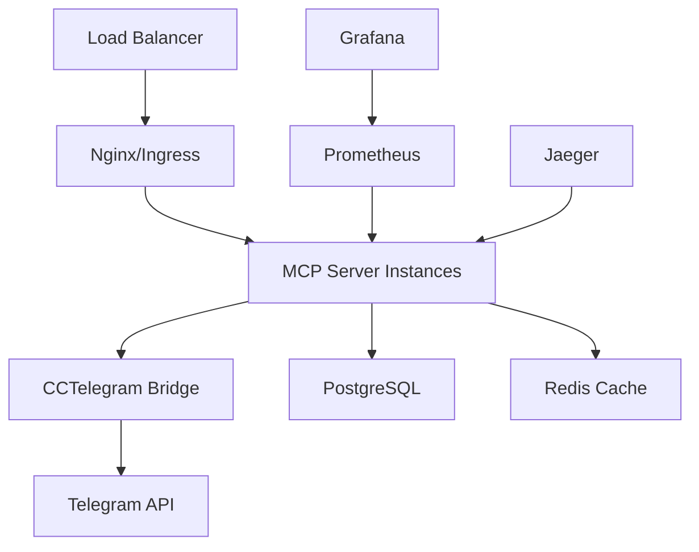

# Deployment & Operations Guides

Complete deployment documentation for CCTelegram MCP Server with production-ready configurations.

## Quick Start

| Deployment Method | Complexity | Production Ready | Time to Deploy |
|-------------------|------------|------------------|----------------|
| [Docker Compose](./docker-guide.md) | ⭐⭐ | ✅ | 10 minutes |
| [Kubernetes](./kubernetes-guide.md) | ⭐⭐⭐ | ✅ | 30 minutes |
| [Helm Chart](./helm-chart.md) | ⭐⭐ | ✅ | 15 minutes |

## 🚀 Quick Deploy Commands

### Docker (Recommended for Single Server)

```bash
# 1. Clone and setup
git clone https://github.com/your-org/cctelegram.git
cd cctelegram/mcp-server

# 2. Configure environment
cp .env.example .env.production
nano .env.production  # Set your values

# 3. Deploy
docker-compose -f docker-compose.production.yml up -d

# 4. Verify
curl http://localhost:3000/health
```

### Kubernetes (Recommended for Scale)

```bash
# 1. Apply configurations
kubectl apply -f k8s/production/

# 2. Wait for deployment
kubectl rollout status deployment/cctelegram-mcp-server -n cctelegram-production

# 3. Verify
kubectl port-forward service/cctelegram-mcp-service 3000:80 -n cctelegram-production
curl http://localhost:3000/health
```

### Helm (Recommended for Teams)

```bash
# 1. Add repository
helm repo add cctelegram https://charts.company.com/cctelegram

# 2. Install
helm install cctelegram cctelegram/cctelegram \
  --values values-production.yaml \
  --namespace cctelegram-production \
  --create-namespace

# 3. Verify
helm test cctelegram -n cctelegram-production
```

## 📚 Deployment Guides

### Core Deployment

| Guide | Description | Use Case |
|-------|-------------|----------|
| [Docker Guide](./docker-guide.md) | Multi-stage Docker builds, compose configurations | Single server, development, staging |
| [Kubernetes Guide](./kubernetes-guide.md) | K8s manifests, scaling, security policies | Production clusters, enterprise |
| [Helm Chart](./helm-chart.md) | Configurable Helm deployment | Team deployments, GitOps |

### Automation & Operations

| Guide | Description | Use Case |
|-------|-------------|----------|
| [CI/CD Pipeline](./cicd-guide.md) | GitHub Actions, quality gates, automated deployment | Development teams, automation |
| [Environment Config](./environment-config.md) | Multi-environment configuration templates | Dev/staging/prod environments |
| [SSL Automation](./ssl-automation.md) | Let's Encrypt automation, cert-manager | HTTPS automation |

### Operations & Support

| Guide | Description | Use Case |
|-------|-------------|----------|
| [Troubleshooting](./troubleshooting-guide.md) | Common issues, diagnostic commands | Operations, support |
| [Enterprise Guide](../deployment/enterprise-guide.md) | High-availability, security hardening | Enterprise deployments |

## 🏗️ Architecture Overview



## 📋 Pre-Deployment Checklist

### Infrastructure Requirements

- [ ] **Compute**: 2+ CPU cores, 4GB+ RAM (per environment)
- [ ] **Storage**: 50GB+ SSD storage
- [ ] **Network**: 443/tcp (HTTPS), 3000/tcp (internal)
- [ ] **DNS**: Domain name configured
- [ ] **Certificates**: SSL/TLS certificates ready

### Security Requirements

- [ ] **API Keys**: Secure API key generation
- [ ] **Secrets**: Encrypted secret storage
- [ ] **Firewall**: Network security configured
- [ ] **Authentication**: MCP authentication enabled
- [ ] **Rate Limiting**: Request rate limiting configured

### Monitoring Requirements

- [ ] **Health Checks**: Application health monitoring
- [ ] **Metrics**: Prometheus metrics collection
- [ ] **Logging**: Structured logging configured
- [ ] **Alerting**: Alert channels configured
- [ ] **Dashboards**: Grafana dashboards imported

## 🔧 Configuration Overview

### Environment Variables

| Variable | Development | Staging | Production |
|----------|-------------|---------|------------|
| `MCP_ENABLE_AUTH` | `false` | `true` | `true` |
| `MCP_LOG_LEVEL` | `debug` | `info` | `warn` |
| `MCP_ENABLE_RATE_LIMIT` | `false` | `true` | `true` |
| `NODE_ENV` | `development` | `staging` | `production` |

### Resource Requirements

| Environment | CPU | Memory | Storage | Replicas |
|-------------|-----|--------|---------|----------|
| **Development** | 0.5 cores | 512MB | 10GB | 1 |
| **Staging** | 1 core | 1GB | 20GB | 2 |
| **Production** | 2 cores | 2GB | 50GB | 3+ |

## 🔒 Security Configuration

### Authentication Setup

```bash
# Generate API keys
export MCP_API_KEYS='{
  "secure-api-key-here": {
    "name": "claude-production",
    "permissions": ["send_telegram_event", "get_bridge_status"],
    "enabled": true
  }
}'

# Generate HMAC secret
export MCP_HMAC_SECRET="$(openssl rand -hex 32)"

# Set Telegram configuration
export TELEGRAM_BOT_TOKEN="your-telegram-bot-token"
export TELEGRAM_ALLOWED_USERS="123456,789012"
```

### Network Security

```bash
# Firewall rules
ufw allow 443/tcp                    # HTTPS public
ufw allow from 10.0.0.0/8 to any port 3000  # Internal MCP
ufw allow from monitoring-subnet to any port 9090  # Metrics

# Rate limiting (Nginx)
limit_req_zone $binary_remote_addr zone=api:10m rate=30r/m;
```

## 📊 Monitoring Setup

### Health Endpoints

```bash
# Basic health check
GET /health
# Response: {"status": "healthy", "timestamp": "2024-01-01T00:00:00Z"}

# Detailed health check
GET /health/detailed
# Response: {"status": "healthy", "components": {...}, "metrics": {...}}

# Readiness probe
GET /health/ready
# Response: {"ready": true, "services": {"bridge": "connected", "telegram": "ok"}}
```

### Metrics Collection

```bash
# Prometheus metrics
GET /metrics
# Response: Prometheus format metrics

# Key metrics to monitor
- http_requests_total
- http_request_duration_seconds
- nodejs_heap_used_bytes
- bridge_connection_status
- telegram_api_calls_total
```

## 🚨 Troubleshooting Quick Reference

### Common Issues

| Issue | Symptom | Quick Fix |
|-------|---------|-----------|
| Service won't start | No response on health endpoint | Check logs: `docker logs cctelegram-mcp` |
| High memory usage | Memory >1GB | Restart: `systemctl restart cctelegram-mcp` |
| Authentication failed | 401 errors | Verify API keys: `echo $MCP_API_KEYS \| jq` |
| SSL certificate error | HTTPS not working | Renew cert: `certbot renew` |
| Bridge disconnected | Bridge status "disconnected" | Restart bridge via API or systemctl |

### Emergency Recovery

```bash
# Quick recovery script
#!/bin/bash
systemctl stop cctelegram-mcp
docker container prune -f
systemctl start cctelegram-mcp
curl -f http://localhost:3000/health && echo "✅ Recovered"
```

## 📞 Support & Resources

### Getting Help

- 📚 **Documentation**: [Complete Guides](../README.md)
- 🐛 **Issues**: [GitHub Issues](https://github.com/your-org/cctelegram/issues)
- 💬 **Discussions**: [GitHub Discussions](https://github.com/your-org/cctelegram/discussions)
- 📧 **Enterprise Support**: support@company.com

### Useful Commands

```bash
# Docker management
docker-compose logs -f cctelegram-mcp
docker exec -it cctelegram-mcp sh
docker system prune -f

# Kubernetes management
kubectl get pods -l app=cctelegram-mcp-server
kubectl logs -f deployment/cctelegram-mcp-server
kubectl describe pod $POD_NAME

# System management
systemctl status cctelegram-mcp
journalctl -u cctelegram-mcp -f
htop -p $(pgrep cctelegram)
```

## 🚀 Next Steps

After successful deployment:

1. **Configure Monitoring**: Set up Grafana dashboards
2. **Set Up Alerting**: Configure Slack/email notifications  
3. **Load Testing**: Validate performance under load
4. **Backup Strategy**: Implement automated backups
5. **Security Audit**: Run security scans and audits

---

*For detailed deployment instructions, select the appropriate guide above. All guides include production-ready configurations with security, monitoring, and automation built-in.*