# System Architecture

CCTelegram implements a sophisticated 3-tier cascading architecture designed for high-performance event processing and reliable notification delivery. This document provides comprehensive architectural diagrams showing the system design, data flows, and integration patterns.

## System Overview

The CCTelegram system consists of several key components working together to provide seamless integration between Claude Code and Telegram:


**Key Architectural Principles:**

1. **3-Tier Cascading**: Progressive timeout handling with intelligent failover
2. **High Availability**: Circuit breaker pattern with health monitoring
3. **Security First**: Multi-layer security with authentication and audit logging
4. **Performance Monitoring**: Comprehensive metrics and alerting
5. **Scalable Design**: Modular components with clear separation of concerns

## Component Details

### Tier 1: Webhook Layer (0-100ms SLA)
- **Ultra-fast response**: Immediate acknowledgment
- **Request validation**: Input sanitization and structure validation
- **Rate limiting**: Per-user and global throttling
- **Security headers**: CSRF protection and security headers

### Tier 2: Bridge Layer (100-500ms SLA) 
- **Event processing**: Business logic and event enrichment
- **Circuit breaker**: Intelligent failover management
- **Response caching**: Performance optimization
- **Audit logging**: Comprehensive event tracking

### Tier 3: File Layer (1-5s SLA)
- **Reliable delivery**: Guaranteed event processing via file system
- **File watching**: Real-time file system monitoring
- **Buffer management**: Event queuing and batching
- **Recovery mechanisms**: Automatic retry and error handling

## Next Sections

- [MCP Server Architecture →](#mcp-server-architecture)
- [3-Tier Cascading Flow →](#3-tier-cascading-flow)
- [Telegram Integration →](#telegram-integration)
- [Security Architecture →](#security-architecture)
- [Data Flow & Error Handling →](#data-flow--error-handling)

## MCP Server Architecture

The MCP Server provides 16 specialized tools for Claude Code integration, implementing robust security, performance monitoring, and comprehensive event management.


**MCP Server Features:**

### Tool Categories

1. **Event Management (5 tools)**
   - Structured event notifications with 40+ event types
   - Custom message delivery with source attribution
   - Task completion tracking with performance metrics
   - Performance alerts with threshold monitoring
   - Interactive approval workflows with response tracking

2. **Response Processing (3 tools)**
   - Telegram response collection and parsing
   - Pending approval request processing
   - Automated cleanup of old response files

3. **Bridge Management (6 tools)**
   - Bridge process lifecycle management
   - Health status monitoring and reporting
   - Automatic process recovery and restart
   - Connection validation and testing

4. **System Integration (2 tools)**
   - Event type discovery and documentation
   - Multi-system task status aggregation

### Security Implementation

- **Authentication**: Token-based validation with configurable providers
- **Authorization**: Role-based access control with granular permissions
- **Input Validation**: Comprehensive Joi schema validation
- **Rate Limiting**: Flexible rate limiting with per-user and global limits
- **Audit Logging**: Complete request/response logging with security events

### Performance Features

- **Connection Pooling**: Efficient HTTP connection reuse
- **Circuit Breaker**: Intelligent failover with health monitoring
- **Retry Logic**: Exponential backoff with jitter
- **Caching**: Response caching with TTL management
- **Monitoring**: Real-time performance metrics and alerting

## 3-Tier Cascading Flow

The 3-tier cascading system provides intelligent failover with progressive timeout handling and guaranteed event delivery.


**Tier Characteristics:**

### Tier 1: Webhook Layer (0-100ms)


**Features:**
- In-memory processing only
- Minimal validation and transformation
- Direct Telegram API calls
- No disk I/O operations
- Circuit breaker integration

### Tier 2: Bridge Layer (100-500ms)


**Features:**
- Event enrichment and transformation
- Comprehensive audit logging
- Response caching
- Advanced validation rules
- Database interactions

### Tier 3: File Layer (1-5s)


**Features:**
- File system durability
- Batch processing capabilities
- Comprehensive retry logic
- Dead letter queue handling
- Recovery mechanisms

## Telegram Integration

The Telegram integration provides comprehensive bot functionality with interactive messaging, approval workflows, and multi-user support.

```mermaid
sequenceDiagram
    participant CC as Claude Code
    participant MCP as MCP Server
    participant BC as Bridge Client
    participant BRIDGE as CCTelegram Bridge
    participant TB as Telegram Bot API
    participant TU1 as User 1
    participant TU2 as User 2
    participant ADMIN as Admin User
    participant FS as Response Files
    
    Note over CC, FS: Event Notification Flow
    
    %% Event Sending
    CC->>MCP: send_telegram_event({<br/>  type: "task_completion",<br/>  title: "Build Complete",<br/>  description: "Successfully built app"<br/>})
    
    MCP->>BC: HTTP POST /events
    BC->>BRIDGE: Process Event
    
    BRIDGE->>BRIDGE: Validate Event
    BRIDGE->>BRIDGE: Format Message
    BRIDGE->>BRIDGE: Apply Security Rules
    
    %% Multi-User Broadcasting
    par Send to User 1
        BRIDGE->>TB: sendMessage({<br/>  chat_id: user1_id,<br/>  text: "✅ Build Complete\nSuccessfully built app",<br/>  reply_markup: inline_keyboard<br/>})
        TB->>TU1: Notification Message
    and Send to User 2  
        BRIDGE->>TB: sendMessage({<br/>  chat_id: user2_id,<br/>  text: "✅ Build Complete\nSuccessfully built app"<br/>})
        TB->>TU2: Notification Message
    and Send to Admin
        BRIDGE->>TB: sendMessage({<br/>  chat_id: admin_id,<br/>  text: "🔧 [ADMIN] Build Complete\nUser: claude-code\nDuration: 45s"<br/>})
        TB->>ADMIN: Admin Notification
    end
    
    BRIDGE->>MCP: 200 OK
    MCP->>CC: Success Response
    
    Note over CC, FS: Interactive Approval Flow
    
    %% Approval Request
    CC->>MCP: send_approval_request({<br/>  title: "Deploy to Production?",<br/>  description: "Build #342 ready for deployment",<br/>  options: ["✅ Approve", "❌ Deny", "⏸️ Hold"]<br/>})
    
    MCP->>BC: HTTP POST /approvals
    BC->>BRIDGE: Process Approval Request
    
    BRIDGE->>BRIDGE: Generate Approval ID
    BRIDGE->>TB: sendMessage({<br/>  chat_id: admin_id,<br/>  text: "🚀 Deployment Approval Required\nBuild #342 ready for production",<br/>  reply_markup: {<br/>    inline_keyboard: [[<br/>      {text: "✅ Approve", callback_data: "approve_abc123"},<br/>      {text: "❌ Deny", callback_data: "deny_abc123"},<br/>      {text: "⏸️ Hold", callback_data: "hold_abc123"}<br/>    ]]<br/>  }<br/>})
    
    TB->>ADMIN: Approval Request
    ADMIN->>TB: Callback Query: "approve_abc123"
    TB->>BRIDGE: Update received
    
    %% Response Processing
    BRIDGE->>BRIDGE: Parse Callback Data
    BRIDGE->>BRIDGE: Validate User Permission
    BRIDGE->>FS: Write Response File({<br/>  id: "abc123",<br/>  user_id: admin_id,<br/>  action: "approve",<br/>  timestamp: "2024-01-01T12:00:00Z"<br/>})
    
    BRIDGE->>TB: editMessageText({<br/>  message_id: original_msg_id,<br/>  text: "✅ Approved by @admin\nDeployment proceeding...",<br/>  reply_markup: null<br/>})
    
    TB->>ADMIN: Updated Message
    
    %% Response Retrieval
    CC->>MCP: get_telegram_responses()
    MCP->>FS: Read Response Files
    FS-->>MCP: Response Data
    MCP->>CC: [{<br/>  id: "abc123",<br/>  user_id: 12345,<br/>  message: "approve",<br/>  timestamp: "2024-01-01T12:00:00Z",<br/>  event_id: "approval_abc123"<br/>}]
    
    Note over CC, FS: Error Handling & Recovery
    
    %% Telegram API Error
    CC->>MCP: send_telegram_event(large_event)
    MCP->>BC: HTTP POST
    BC->>BRIDGE: Process Event
    BRIDGE->>TB: sendMessage (large text)
    TB-->>BRIDGE: Error: Message too long
    
    BRIDGE->>BRIDGE: Auto-truncate Message
    BRIDGE->>TB: sendMessage (truncated + "...more")
    TB->>TU1: Truncated Message
    
    alt Message Still Too Long
        BRIDGE->>BRIDGE: Split into Multiple Messages  
        loop For Each Chunk
            BRIDGE->>TB: sendMessage (chunk)
            TB->>TU1: Message Part
        end
    end
    
    BRIDGE->>MCP: 200 OK (with warning)
    MCP->>CC: Success with Metadata
    
    Note over CC, FS: Bot Command Handling
    
    %% User Commands
    TU1->>TB: /status
    TB->>BRIDGE: Command Update
    BRIDGE->>BRIDGE: Process Command
    BRIDGE->>BRIDGE: Check User Permissions
    
    BRIDGE->>TB: sendMessage({<br/>  chat_id: user1_id,<br/>  text: "🤖 CCTelegram Status\n\n" +<br/>         "🟢 Bridge: Healthy\n" +<br/>         "📊 Events Today: 127\n" +<br/>         "⚡ Response Time: 45ms\n" +<br/>         "👥 Active Users: 3"<br/>})
    
    TB->>TU1: Status Response
    
    %% Admin Commands
    ADMIN->>TB: /users
    TB->>BRIDGE: Admin Command Update
    BRIDGE->>BRIDGE: Verify Admin Status
    
    BRIDGE->>TB: sendMessage({<br/>  chat_id: admin_id,<br/>  text: "👥 User Management\n\n" +<br/>         "User 1: @user1 (Active)\n" +<br/>         "User 2: @user2 (Active)\n" +<br/>         "Admin: @admin (Online)",<br/>  reply_markup: management_keyboard<br/>})
    
    TB->>ADMIN: User Management Interface
```



**Telegram Bot Features:**

### Message Types & Formatting

1. **Event Notifications**
   - Rich formatting with emojis and status indicators
   - Contextual information (duration, files affected, etc.)
   - Automatic message truncation for long content
   - Multi-part message splitting when needed

2. **Interactive Elements**
   - Inline keyboards for approval workflows
   - Callback queries for user actions
   - Command menus for bot interaction
   - Custom keyboards for frequent actions

3. **User Management**
   - Multi-user support with individual targeting
   - Role-based permissions (admin/user)
   - User activity tracking and analytics
   - Configurable notification preferences

### Bot Commands

```mermaid
graph TD
    subgraph "User Commands"
        STATUS[/status - System Status]
        HELP[/help - Command Help]
        SETTINGS[/settings - User Preferences]
        HISTORY[/history - Recent Events]
    end
    
    subgraph "Admin Commands"
        USERS[/users - User Management]
        METRICS[/metrics - System Metrics]
        CONFIG[/config - Bot Configuration]
        LOGS[/logs - System Logs]
    end
    
    subgraph "Interactive Features"
        APPROVE[Approval Buttons]
        QUICK[Quick Actions]
        MENU[Inline Menus]
        FEEDBACK[Response Collection]
    end
    
    STATUS --> HEALTH[Health Check Response]
    HELP --> GUIDE[Command Guide]
    SETTINGS --> PREFS[Preference Panel]
    HISTORY --> EVENTS[Event History]
    
    USERS --> MGMT[User Management Panel]
    METRICS --> STATS[Performance Statistics]
    CONFIG --> SETTINGS_PANEL[Configuration Panel]
    LOGS --> LOG_VIEWER[Log Viewer]
    
    APPROVE --> RESPONSE[Automated Response]
    QUICK --> ACTION[Immediate Action]
    MENU --> OPTIONS[Action Options]
    FEEDBACK --> COLLECTION[Response Collection]
    
    %% Styling
    classDef userCmd fill:#e3f2fd,stroke:#1976d2,stroke-width:2px
    classDef adminCmd fill:#fff3e0,stroke:#f57c00,stroke-width:2px
    classDef interactive fill:#e8f5e8,stroke:#388e3c,stroke-width:2px
    classDef response fill:#fce4ec,stroke:#c2185b,stroke-width:1px
    
    class STATUS,HELP,SETTINGS,HISTORY userCmd
    class USERS,METRICS,CONFIG,LOGS adminCmd
    class APPROVE,QUICK,MENU,FEEDBACK interactive
    class HEALTH,GUIDE,PREFS,EVENTS,MGMT,STATS,SETTINGS_PANEL,LOG_VIEWER,RESPONSE,ACTION,OPTIONS,COLLECTION response
```

### Security & Privacy

- **Authentication**: Telegram user ID validation
- **Authorization**: Role-based command access control  
- **Rate Limiting**: Per-user message throttling
- **Content Filtering**: Sensitive data redaction
- **Audit Logging**: Complete interaction history
- **Privacy Controls**: Configurable notification levels

## Security Architecture

CCTelegram implements a comprehensive multi-layer security architecture with defense-in-depth principles, comprehensive audit logging, and enterprise-grade access controls.

```mermaid
graph TB
    subgraph "External Threats"
        DDOS[DDoS Attacks]
        BRUTE[Brute Force]
        INJECT[Injection Attacks]
        MITM[Man-in-Middle]
        SOCIAL[Social Engineering]
    end
    
    subgraph "Perimeter Security Layer"
        direction TB
        
        subgraph "Network Security"
            FW[Firewall Rules]
            PROXY[Reverse Proxy]
            RATE_GLOBAL[Global Rate Limiting]
            GEO[Geo-blocking]
        end
        
        subgraph "TLS/SSL Protection"
            CERT[TLS Certificates]
            HSTS[HSTS Headers]
            CIPHER[Cipher Suites]
            PINNING[Certificate Pinning]
        end
    end
    
    subgraph "Application Security Layer"
        direction TB
        
        subgraph "Authentication & Authorization"
            TOKEN_AUTH[Token Authentication]
            RBAC[Role-Based Access Control]
            MFA[Multi-Factor Auth (Optional)]
            SESSION[Session Management]
        end
        
        subgraph "Input Security"
            VALIDATION[Input Validation]
            SANITIZATION[Data Sanitization]
            ENCODING[Output Encoding]
            CSRF[CSRF Protection]
        end
        
        subgraph "Application Controls"
            RATE_USER[Per-User Rate Limiting]
            THROTTLE[Request Throttling]
            CIRCUIT[Circuit Breakers]
            TIMEOUT[Request Timeouts]
        end
    end
    
    subgraph "Data Security Layer"
        direction TB
        
        subgraph "Data Protection"
            ENCRYPT_REST[Encryption at Rest]
            ENCRYPT_TRANSIT[Encryption in Transit]
            KEY_MGMT[Key Management]
            DATA_CLASS[Data Classification]
        end
        
        subgraph "Privacy Controls"
            PII_FILTER[PII Filtering]
            REDACTION[Data Redaction]
            RETENTION[Data Retention]
            GDPR[GDPR Compliance]
        end
    end
    
    subgraph "Monitoring & Audit Layer"
        direction TB
        
        subgraph "Security Monitoring"
            SIEM[SIEM Integration]
            ANOMALY[Anomaly Detection]
            THREAT[Threat Intelligence]
            ALERT[Security Alerts]
        end
        
        subgraph "Audit & Compliance"
            AUDIT_LOG[Audit Logging]
            COMPLIANCE[Compliance Reporting]
            FORENSICS[Digital Forensics]
            INCIDENT[Incident Response]
        end
    end
    
    subgraph "Core Application"
        MCP[MCP Server]
        BRIDGE[CCTelegram Bridge]
        TELEGRAM[Telegram Bot]
    end
    
    %% Attack Flow Prevention
    DDOS -.-> FW
    BRUTE -.-> RATE_GLOBAL
    INJECT -.-> VALIDATION
    MITM -.-> CERT
    SOCIAL -.-> TOKEN_AUTH
    
    %% Security Layer Flow
    FW --> PROXY
    PROXY --> RATE_GLOBAL
    RATE_GLOBAL --> GEO
    
    CERT --> HSTS
    HSTS --> CIPHER
    CIPHER --> PINNING
    
    TOKEN_AUTH --> RBAC
    RBAC --> MFA
    MFA --> SESSION
    
    VALIDATION --> SANITIZATION
    SANITIZATION --> ENCODING
    ENCODING --> CSRF
    
    RATE_USER --> THROTTLE
    THROTTLE --> CIRCUIT
    CIRCUIT --> TIMEOUT
    
    ENCRYPT_REST --> ENCRYPT_TRANSIT
    ENCRYPT_TRANSIT --> KEY_MGMT
    KEY_MGMT --> DATA_CLASS
    
    PII_FILTER --> REDACTION
    REDACTION --> RETENTION
    RETENTION --> GDPR
    
    SIEM --> ANOMALY
    ANOMALY --> THREAT
    THREAT --> ALERT
    
    AUDIT_LOG --> COMPLIANCE
    COMPLIANCE --> FORENSICS
    FORENSICS --> INCIDENT
    
    %% Core Application Integration
    GEO --> MCP
    PINNING --> MCP
    SESSION --> MCP
    CSRF --> MCP
    TIMEOUT --> MCP
    DATA_CLASS --> MCP
    GDPR --> MCP
    ALERT --> MCP
    INCIDENT --> MCP
    
    MCP --> BRIDGE
    BRIDGE --> TELEGRAM
    
    %% Monitoring Integration
    MCP --> AUDIT_LOG
    BRIDGE --> AUDIT_LOG
    TELEGRAM --> AUDIT_LOG
    
    %% Styling
    classDef threat fill:#ffebee,stroke:#d32f2f,stroke-width:2px,stroke-dasharray: 5 5
    classDef perimeter fill:#e3f2fd,stroke:#1976d2,stroke-width:2px
    classDef application fill:#fff3e0,stroke:#f57c00,stroke-width:2px
    classDef data fill:#e8f5e8,stroke:#388e3c,stroke-width:2px
    classDef monitoring fill:#f3e5f5,stroke:#7b1fa2,stroke-width:2px
    classDef core fill:#fafafa,stroke:#424242,stroke-width:2px
    
    class DDOS,BRUTE,INJECT,MITM,SOCIAL threat
    class FW,PROXY,RATE_GLOBAL,GEO,CERT,HSTS,CIPHER,PINNING perimeter
    class TOKEN_AUTH,RBAC,MFA,SESSION,VALIDATION,SANITIZATION,ENCODING,CSRF,RATE_USER,THROTTLE,CIRCUIT,TIMEOUT application
    class ENCRYPT_REST,ENCRYPT_TRANSIT,KEY_MGMT,DATA_CLASS,PII_FILTER,REDACTION,RETENTION,GDPR data
    class SIEM,ANOMALY,THREAT,ALERT,AUDIT_LOG,COMPLIANCE,FORENSICS,INCIDENT monitoring
    class MCP,BRIDGE,TELEGRAM core
```

### Security Implementation Details

#### Authentication & Authorization


#### Data Protection & Privacy

```mermaid
graph TD
    subgraph "Data Classification"
        PII[PII Data<br/>🔴 Highly Sensitive]
        AUTH_DATA[Auth Data<br/>🟠 Sensitive]
        EVENT_DATA[Event Data<br/>🟡 Internal]
        LOG_DATA[Log Data<br/>🟢 General]
    end
    
    subgraph "Protection Mechanisms"
        direction LR
        
        subgraph "Encryption"
            AES256[AES-256 Encryption]
            RSA[RSA Key Exchange]
            HASH[SHA-256 Hashing]
            SALT[Salt Generation]
        end
        
        subgraph "Privacy Controls"
            FILTER[Content Filtering]
            MASK[Data Masking]
            ANON[Anonymization]
            EXPIRE[Auto-Expiration]
        end
        
        subgraph "Compliance"
            GDPR_CTRL[GDPR Controls]
            DATA_MIN[Data Minimization]
            PURPOSE[Purpose Limitation]
            CONSENT[Consent Management]
        end
    end
    
    %% Data flow through protection
    PII --> AES256
    PII --> FILTER
    PII --> GDPR_CTRL
    
    AUTH_DATA --> RSA
    AUTH_DATA --> HASH
    AUTH_DATA --> SALT
    AUTH_DATA --> MASK
    
    EVENT_DATA --> AES256
    EVENT_DATA --> ANON
    EVENT_DATA --> DATA_MIN
    
    LOG_DATA --> HASH
    LOG_DATA --> EXPIRE
    LOG_DATA --> PURPOSE
    
    %% Compliance integration
    GDPR_CTRL --> CONSENT
    DATA_MIN --> PURPOSE
    PURPOSE --> CONSENT
    
    %% Styling
    classDef highly_sensitive fill:#ffebee,stroke:#d32f2f,stroke-width:3px
    classDef sensitive fill:#fff3e0,stroke:#ff9800,stroke-width:2px
    classDef internal fill:#fff9c4,stroke:#f9a825,stroke-width:2px
    classDef general fill:#e8f5e8,stroke:#4caf50,stroke-width:1px
    classDef protection fill:#e3f2fd,stroke:#2196f3,stroke-width:2px
    
    class PII highly_sensitive
    class AUTH_DATA sensitive
    class EVENT_DATA internal
    class LOG_DATA general
    class AES256,RSA,HASH,SALT,FILTER,MASK,ANON,EXPIRE,GDPR_CTRL,DATA_MIN,PURPOSE,CONSENT protection
```



### Security Monitoring & Incident Response


### Security Configuration

**Environment Variables:**
```bash
# Authentication
MCP_ENABLE_AUTH=true
MCP_AUTH_TOKEN=your_secure_token_here
MCP_AUTH_PROVIDER=telegram

# Rate Limiting
RATE_LIMIT_WINDOW=900
RATE_LIMIT_MAX=100
RATE_LIMIT_PER_USER=20

# Security Headers
SECURITY_HEADERS_ENABLED=true
HSTS_MAX_AGE=31536000
CSP_ENABLED=true

# Audit Logging
AUDIT_LOG_LEVEL=info
AUDIT_LOG_RETENTION_DAYS=90
SECURITY_LOG_ENABLED=true

# Encryption
ENCRYPTION_ENABLED=true
KEY_ROTATION_DAYS=30
```

**Security Checklist:**

- ✅ **Authentication**: Token-based with configurable providers
- ✅ **Authorization**: Role-based access control (RBAC)
- ✅ **Input Validation**: Comprehensive Joi schema validation
- ✅ **Rate Limiting**: Global and per-user throttling
- ✅ **Encryption**: AES-256 for data at rest, TLS 1.3 in transit
- ✅ **Audit Logging**: Complete security event tracking
- ✅ **Privacy Controls**: PII filtering and GDPR compliance
- ✅ **Monitoring**: Real-time threat detection and alerting
- ✅ **Incident Response**: Automated response and escalation
- ✅ **Compliance**: Industry security standard adherence

## Data Flow & Error Handling

CCTelegram implements comprehensive data flow patterns with robust error handling, automatic recovery mechanisms, and guaranteed message delivery.

### Primary Data Flow Architecture


### Error Handling & Recovery Patterns


### Error Categories & Response Strategies


### Monitoring & Observability

**Key Metrics Tracked:**
- **Throughput**: Events/second, Messages/second
- **Latency**: p50, p95, p99 response times per tier
- **Error Rates**: 4xx/5xx errors, retry rates, circuit breaker trips
- **Resource Usage**: CPU, memory, disk, network utilization
- **Business Metrics**: User engagement, approval response times

**Health Check Endpoints:**
- `/health` - Basic service health
- `/health/detailed` - Component-level health status
- `/metrics` - Prometheus metrics export
- `/readiness` - Kubernetes readiness probe
- `/liveness` - Kubernetes liveness probe

**Alert Thresholds:**
```yaml
error_rate:
  warning: 1%      # Yellow alert
  critical: 5%     # Red alert
  
latency_p95:
  warning: 500ms   # Performance degradation
  critical: 2000ms # Service impact
  
circuit_breaker:
  open: immediate  # Critical alert
  half_open: info  # Recovery in progress
```

---

## Summary

The CCTelegram architecture provides:

✅ **High Performance**: Sub-100ms response times with 3-tier cascading  
✅ **Reliability**: Circuit breakers, retries, and guaranteed delivery  
✅ **Security**: Multi-layer defense with comprehensive audit logging  
✅ **Scalability**: Modular design with horizontal scaling capabilities  
✅ **Observability**: Complete monitoring, metrics, and alerting  
✅ **Developer Experience**: Rich MCP integration with 16 specialized tools  

The system successfully bridges Claude Code and Telegram while maintaining enterprise-grade reliability, security, and performance standards.