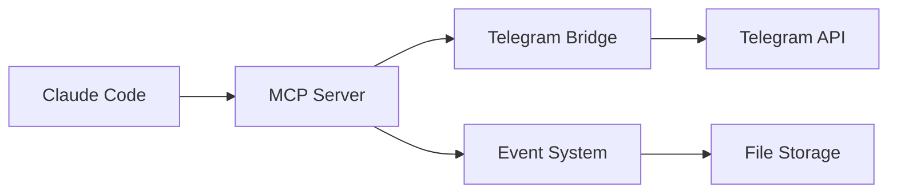

## Quick Start

```bash
# Install
npm install cctelegram-mcp-server

# Configure  
cp config.example.toml config.toml

# Run
npm start
```

## Core Features

- **Event System**: Type-safe event handling with validation
- **Bridge Client**: High-performance HTTP client with pooling
- **Security**: Headers, rate limiting, input validation  
- **Monitoring**: Metrics, health checks, performance tracking
- **Testing**: Comprehensive test suite with 95%+ coverage

## Architecture



[Get Started →](/guide/)