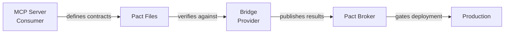

# Contract Testing and API Validation

This directory contains a comprehensive contract testing implementation using Pact for API validation between the CCTelegram MCP Server and Bridge components.

## 🎯 Overview

The contract testing system ensures API compatibility and prevents integration failures through:

- **Consumer-driven contracts** defining API expectations
- **Provider verification** ensuring Bridge satisfies MCP Server contracts  
- **Contract evolution tracking** with breaking change detection
- **Automated CI/CD integration** with deployment gates
- **Version management** and compatibility scoring

## 📁 Directory Structure

```
tests/contract/
├── README.md                          # This file
├── CONTRACT-TESTING.md                # Comprehensive documentation
├── consumer/                           # Consumer contract tests
│   ├── mcp-server.consumer.test.ts    # Main MCP Server consumer tests
│   └── event-api.consumer.test.ts     # Event API specific consumer tests
├── provider/                           # Provider verification tests
│   └── bridge.provider.test.ts        # Bridge provider verification
├── shared/                             # Shared contract definitions
│   └── contracts.ts                   # API contract specifications
├── config/                             # Pact configuration
│   └── pact.config.ts                 # Consumer/provider configuration
├── utils/                              # Contract testing utilities
│   ├── contract-helpers.ts            # Testing helpers and fixtures
│   ├── version-manager.ts             # Contract version management
│   └── deployment-checker.ts          # Deployment compatibility checker
└── integration/                        # Integration tests
    └── contract-workflow.integration.test.ts  # End-to-end workflow tests
```

## 🚀 Quick Start

### Prerequisites

```bash
# Install dependencies
npm install

# Ensure Pact Broker is running (optional for local development)
docker run -d --name pact-broker -p 9292:9292 pactfoundation/pact-broker
```

### Basic Usage

```bash
# Run consumer contract tests
npm run test:contract:consumer

# Run provider verification  
npm run test:contract:provider

# Run complete contract testing pipeline
npm run test:contract:ci

# Check deployment compatibility
npm run pact:can-deploy
```

### Advanced Workflow

```bash
# Use the contract workflow orchestrator
./scripts/contract-workflow.sh full        # Complete workflow
./scripts/contract-workflow.sh consumer    # Consumer tests only
./scripts/contract-workflow.sh provider    # Provider verification only
./scripts/contract-workflow.sh deploy-check # Deployment compatibility
```

## 🏗️ Architecture

### Consumer-Provider Relationship



### Contract Lifecycle

1. **Consumer Tests**: MCP Server defines expected Bridge behavior
2. **Contract Generation**: Pact files created with interaction expectations
3. **Contract Publishing**: Contracts uploaded to Pact Broker
4. **Provider Verification**: Bridge tested against published contracts
5. **Deployment Gates**: Compatibility checked before deployment

## 📝 Contract Specifications

### API Contracts

The system tests contracts for these key APIs:

#### Event Submission API
- **Endpoint**: `POST /api/events`
- **Purpose**: Submit events to Bridge for Telegram notification
- **Contract Coverage**: Event validation, error handling, response format

#### Health Check API  
- **Endpoint**: `GET /health`
- **Purpose**: Monitor Bridge health status
- **Contract Coverage**: Health states (healthy/degraded/unhealthy)

#### Response Management API
- **Endpoints**: `GET /api/responses`, `DELETE /api/responses`, `POST /api/responses/process`
- **Purpose**: Manage Telegram user responses
- **Contract Coverage**: Response retrieval, cleanup, processing

#### Bridge Management API
- **Endpoints**: `POST /api/bridge/{start,stop,restart}`, `GET /api/bridge/status`
- **Purpose**: Control Bridge process lifecycle
- **Contract Coverage**: Process management, status reporting

#### Task Management API
- **Endpoint**: `GET /api/tasks/status`  
- **Purpose**: Retrieve task status from Claude Code and TaskMaster
- **Contract Coverage**: Task system integration, status aggregation

### Contract Examples

#### Event Submission Contract
```typescript
// Consumer expectation
pact.given('bridge is running')
  .uponReceiving('a valid event submission')
  .withRequest({
    method: 'POST',
    path: '/api/events',
    body: like({
      type: 'task_completion',
      title: like('Task completed'),
      description: like('Task description'),
      data: like({ status: 'completed' })
    })
  })
  .willRespondWith({
    status: 200,
    body: like({
      success: true,
      event_id: uuid(),
      message: like('Event sent successfully')
    })
  });
```

#### Health Check Contract
```typescript
// Consumer expectation
pact.given('bridge is healthy')
  .uponReceiving('a health check request')
  .withRequest({
    method: 'GET',
    path: '/health'
  })
  .willRespondWith({
    status: 200,
    body: like({
      running: true,
      health: 'healthy',
      metrics: like({
        uptime_seconds: integer(3600),
        events_processed: integer(150)
      })
    })
  });
```

## 🔄 Contract Evolution

### Version Management

The system tracks contract evolution through:

- **Semantic versioning** with breaking change detection
- **Compatibility scoring** (0-1 scale)  
- **Evolution metadata** including new/removed features
- **Deployment compatibility assessment**

### Breaking Change Detection

The system detects breaking changes such as:

- **Field Removal**: Required fields removed from requests/responses
- **Type Changes**: Field type modifications
- **Endpoint Removal**: API endpoints no longer available  
- **Status Code Changes**: Different HTTP status codes returned
- **Schema Incompatibilities**: Request/response schema changes

### Compatibility Rules

```typescript
const compatibilityRules = {
  // Allow new optional fields (backward compatible)
  allowNewOptionalFields: true,
  
  // Disallow removing required fields (breaking)
  allowRemoveRequiredFields: false,
  
  // Allow adding new endpoints (forward compatible)
  allowNewEndpoints: true,
  
  // Disallow removing endpoints (breaking)
  allowRemoveEndpoints: false
};
```

## 🚦 Deployment Gates

### Compatibility Checks

Before deployment, the system verifies:

1. **Contract Compatibility**: Changes don't break existing consumers
2. **Consumer Verification**: All consumers can verify against new contracts
3. **Environment Readiness**: Infrastructure/monitoring configured
4. **Rollback Readiness**: Previous version available for rollback

### Deployment Decision Matrix

| Compatibility Score | Breaking Changes | Action |
|---------------------|------------------|--------|
| ≥ 0.8 | None | ✅ Deploy |
| 0.6 - 0.8 | Minor | ⚠️ Deploy with monitoring |
| < 0.6 | Major | ❌ Block deployment |
| Any | Critical | ❌ Block deployment |

### Rollback Planning

Automatic rollback plan generation includes:

- **Previous Version**: Identified stable version to rollback to
- **Rollback Steps**: Automated rollback procedure
- **Verification Steps**: Post-rollback validation checks
- **Communication Plan**: Stakeholder notification process

## 🔧 Configuration

### Environment Variables

```bash
# Pact Broker Configuration
PACT_BROKER_URL=http://localhost:9292
PACT_BROKER_TOKEN=your_token_here
PACT_BROKER_USERNAME=username
PACT_BROKER_PASSWORD=password

# Test Configuration  
BRIDGE_BASE_URL=http://localhost:8080
BRIDGE_TEST_PORT=8081
TEST_MODE=true

# CI/CD Configuration
CI_ENVIRONMENT=development
PUBLISH_PACTS=true
VERIFY_PROVIDER=true
CHECK_CAN_DEPLOY=true
DRY_RUN=false
```

### Pact Configuration

Consumer and provider configurations are defined in `config/pact.config.ts`:

```typescript
export const consumerConfig: PactOptions = {
  consumer: 'cctelegram-mcp-server',
  provider: 'cctelegram-bridge',
  port: 8989,
  publishPacts: process.env.CI === 'true',
  pactBrokerUrl: process.env.PACT_BROKER_URL
};
```

## 🧪 Testing Strategies

### Consumer Testing Strategy

1. **API Interaction Testing**: Test all MCP tool interactions with Bridge
2. **Error Scenario Testing**: Verify error handling contracts
3. **Data Validation Testing**: Test input validation contracts  
4. **Edge Case Testing**: Handle boundary conditions and limits

### Provider Testing Strategy

1. **Contract Verification**: Verify Bridge satisfies all consumer contracts
2. **State Management**: Set up provider states for different test scenarios
3. **Integration Testing**: Test with actual Bridge implementation
4. **Performance Testing**: Verify contract compliance under load

### Integration Testing Strategy

1. **End-to-End Workflow**: Test complete contract lifecycle
2. **Evolution Scenarios**: Test contract changes and compatibility
3. **Failure Handling**: Test error conditions and recovery
4. **Performance**: Test large contracts and concurrent operations

## 📊 Monitoring and Metrics

### Contract Metrics

The system tracks:

- **Contract Coverage**: Percentage of API interactions under contract
- **Verification Success Rate**: Provider verification pass rate
- **Compatibility Score**: Historical compatibility trends  
- **Breaking Change Frequency**: Rate of breaking changes over time

### Deployment Metrics

- **Deployment Success Rate**: Rate of successful deployments
- **Rollback Frequency**: How often rollbacks are needed
- **Time to Deploy**: Duration from commit to production
- **Mean Time to Recovery**: Average time to resolve deployment issues

## 🚀 CI/CD Integration

### GitHub Actions Integration

```yaml
- name: Contract Testing
  run: |
    npm run test:contract:ci
    npm run pact:can-deploy

- name: Deploy Check
  if: github.ref == 'refs/heads/main'
  run: |
    ./scripts/contract-workflow.sh deploy-check
```

### Jenkins Integration

```groovy
stage('Contract Testing') {
  steps {
    sh 'npm run test:contract:ci'
    sh 'npm run pact:can-deploy'
  }
}

stage('Deploy Compatibility') {
  when { branch 'main' }
  steps {
    sh './scripts/contract-workflow.sh deploy-check'
  }
}
```

## 🔍 Troubleshooting

### Common Issues

#### Consumer Tests Failing
```bash
# Check contract generation
ls -la pacts/
cat pacts/*.json | jq .

# Verify test data
npm run test:contract:consumer -- --verbose
```

#### Provider Verification Failing  
```bash
# Check Bridge availability
curl http://localhost:8080/health

# Run with debug logging
DEBUG=pact* npm run test:contract:provider
```

#### Pact Broker Connection Issues
```bash
# Test broker connectivity
curl ${PACT_BROKER_URL}/diagnostic/status/heartbeat

# Verify authentication
curl -H "Authorization: Bearer ${PACT_BROKER_TOKEN}" ${PACT_BROKER_URL}/
```

### Debugging Tips

1. **Enable Debug Logging**: Set `DEBUG=pact*` for detailed Pact logs
2. **Check Provider States**: Verify provider state handlers are working
3. **Validate JSON**: Ensure contract JSON files are well-formed
4. **Test Isolation**: Run individual contract tests to isolate issues
5. **Version Conflicts**: Check for version mismatches between consumer and provider

## 📚 Best Practices

### Contract Design

1. **Consumer-Driven**: Let consumer needs drive contract specifications
2. **Minimal Contracts**: Only test what the consumer actually needs
3. **Stable Identifiers**: Use UUIDs and stable field names
4. **Error Contracts**: Include error scenarios in contracts
5. **Evolution Planning**: Design contracts for extensibility

### Testing Practices

1. **Independent Tests**: Each contract test should be isolated
2. **Deterministic Data**: Use fixed test data for reproducible tests
3. **Provider States**: Use meaningful provider state descriptions
4. **Error Testing**: Test both success and failure scenarios
5. **Performance**: Keep contract tests fast and focused

### CI/CD Integration

1. **Branch Strategy**: Publish contracts only from main branch
2. **Parallel Execution**: Run consumer and provider tests in parallel when possible
3. **Fail Fast**: Fail builds immediately on contract violations
4. **Deployment Gates**: Block deployments on compatibility issues
5. **Monitoring**: Track contract testing metrics over time

## 🔗 Additional Resources

- [Pact Documentation](https://docs.pact.io/)
- [Consumer-Driven Contract Testing](https://martinfowler.com/articles/consumerDrivenContracts.html)
- [API Evolution Best Practices](https://docs.microsoft.com/en-us/azure/architecture/best-practices/api-design)
- [Semantic Versioning](https://semver.org/)
- [CCTelegram Project Documentation](../../@docs/)